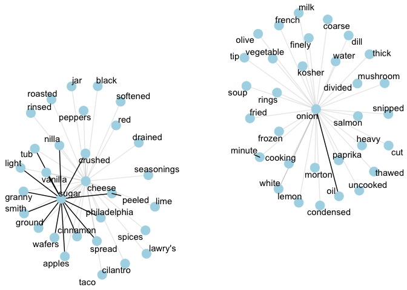

***


```r
dirs <- c("prep", "build", "score", "scrape", "solve", "simulate")
paths <- stringr::str_c("./scripts/", dirs)

# Import all .R scripts from all the dirs above 
for (p in paths) {
  suppressMessages(suppressPackageStartupMessages(dobtools::import_scripts(p)))
}
```

```
## Warning in read_fun(path = path, sheet = sheet, limits = limits, shim =
## shim, : partial argument match of 'sheet' to 'sheet_i'
```


### About

This is an ongoing project on menu optimizing. It's mainly an excuse for me to use several data science techniques in various proportions: along the way I query an API, generate menus, solve them algorithmically, simulate solving them, scrape the web for real menus, and touch on some natural language processing techniques. Don't worry about getting too hungry: this project has been fairly ~~nicknamed~~ slandered "Eat, Pray, Barf."

The meat of the project surrounds building menus and changing them until they are in compliance with daily nutritional guidelines. We'll simulate the curve of the proportion of these that are solvable as we increase the minimum portion size that each food must meet. Finally, I start about trying to improve the quality of the menus (i.e., decrease barf factor) by taking a cue from actual recipes scraped from Allrecipes.com. 

[](img/chinese_food.jpg)


## Getting from A to Beef

The data we'll be using here is conveniently located in an Excel file called ABBREV.xlsx on the USDA website. As the name suggests, this is an abbreviated version of all the foods in their database. 

If you do want the full list, they provide a Microsoft Access SQL dump as well (which requires that you have Access). The USDA also does have an open API so you can create an API key and grab foods from them with requests along the lines of a quick example I'll go through. The [API documentation](https://ndb.nal.usda.gov/ndb/doc/apilist/API-FOOD-REPORTV2.md) walks through the format for requesting data in more detail. I'll walk through an exmaple of how to get some foods and a few of their associated nutrient values.

The base URL we'll want is `http://api.nal.usda.gov/ndb/`.

The default number of results per request is 50 so we specify 1500 as our `max`. In this example I set `subset` to 1 in order to grab the most common foods. (Otherwise 1:1500 query only gets you from a to beef 😆.) If you do want to grab all foods, you can send requests of 1500 iteratively specifying `offset`, which refers to the number of the first row you want, and then glue them together. We've specified just 4 nutrient values we want here: calories, sugar, lipids, and carbohydrates.

After attaching those parameters to the end of our base URL, we'd have: 

`http://api.nal.usda.gov/ndb/nutrients/?format=json&api_key="<YOUR_KEY_HERE>&subset=1&max=1500&nutrients=205&nutrients=204&nutrients=208&nutrients=269`


In the browser, you could paste that same thing in to see:


We'll use the `jsonlite` package to turn that `fromJSON` into an R object.


```r
foods_raw <- jsonlite::fromJSON(paste0("http://api.nal.usda.gov/ndb/nutrients/?format=json&api_key=", 
                       key, "&subset=1&max=1500&nutrients=205&nutrients=204&nutrients=208&nutrients=269"), flatten = FALSE)

foods <- as_tibble(foods_raw$report$foods)
```


```r
head(foods) %>% kable(format = "html")
```

<table>
 <thead>
  <tr>
   <th style="text-align:left;"> ndbno </th>
   <th style="text-align:left;"> name </th>
   <th style="text-align:right;"> weight </th>
   <th style="text-align:left;"> measure </th>
   <th style="text-align:left;"> nutrients </th>
  </tr>
 </thead>
<tbody>
  <tr>
   <td style="text-align:left;"> 14007 </td>
   <td style="text-align:left;"> Alcoholic beverage, beer, light, BUD LIGHT </td>
   <td style="text-align:right;"> 29.5 </td>
   <td style="text-align:left;"> 1.0 fl oz </td>
   <td style="text-align:left;"> 208, 269, 204, 205, Energy, Sugars, total, Total lipid (fat), Carbohydrate, by difference, kcal, g, g, g, 9, --, 0.00, 0.38, 29, --, 0, 1.3 </td>
  </tr>
  <tr>
   <td style="text-align:left;"> 14009 </td>
   <td style="text-align:left;"> Alcoholic beverage, daiquiri, canned </td>
   <td style="text-align:right;"> 30.5 </td>
   <td style="text-align:left;"> 1.0 fl oz </td>
   <td style="text-align:left;"> 208, 269, 204, 205, Energy, Sugars, total, Total lipid (fat), Carbohydrate, by difference, kcal, g, g, g, 38, --, 0.00, 4.79, 125, --, 0, 15.7 </td>
  </tr>
  <tr>
   <td style="text-align:left;"> 14534 </td>
   <td style="text-align:left;"> Alcoholic beverage, liqueur, coffee, 63 proof </td>
   <td style="text-align:right;"> 34.8 </td>
   <td style="text-align:left;"> 1.0 fl oz </td>
   <td style="text-align:left;"> 208, 269, 204, 205, Energy, Sugars, total, Total lipid (fat), Carbohydrate, by difference, kcal, g, g, g, 107, --, 0.10, 11.21, 308, --, 0.3, 32.2 </td>
  </tr>
  <tr>
   <td style="text-align:left;"> 14015 </td>
   <td style="text-align:left;"> Alcoholic beverage, pina colada, canned </td>
   <td style="text-align:right;"> 32.6 </td>
   <td style="text-align:left;"> 1.0 fl oz </td>
   <td style="text-align:left;"> 208, 269, 204, 205, Energy, Sugars, total, Total lipid (fat), Carbohydrate, by difference, kcal, g, g, g, 77, --, 2.48, 9.00, 237, --, 7.6, 27.6 </td>
  </tr>
  <tr>
   <td style="text-align:left;"> 14019 </td>
   <td style="text-align:left;"> Alcoholic beverage, tequila sunrise, canned </td>
   <td style="text-align:right;"> 31.1 </td>
   <td style="text-align:left;"> 1.0 fl oz </td>
   <td style="text-align:left;"> 208, 269, 204, 205, Energy, Sugars, total, Total lipid (fat), Carbohydrate, by difference, kcal, g, g, g, 34, --, 0.03, 3.51, 110, --, 0.1, 11.3 </td>
  </tr>
  <tr>
   <td style="text-align:left;"> 14027 </td>
   <td style="text-align:left;"> Alcoholic beverage, whiskey sour, canned </td>
   <td style="text-align:right;"> 30.8 </td>
   <td style="text-align:left;"> 1.0 fl oz </td>
   <td style="text-align:left;"> 208, 269, 204, 205, Energy, Sugars, total, Total lipid (fat), Carbohydrate, by difference, kcal, g, g, g, 37, --, 0.00, 4.13, 119, --, 0, 13.4 </td>
  </tr>
</tbody>
</table>

We've got one row per food and a nested list-col of nutrients.


```r
str(foods$nutrients[1:3])
```

```
## List of 3
##  $ :'data.frame':	4 obs. of  5 variables:
##   ..$ nutrient_id: chr [1:4] "208" "269" "204" "205"
##   ..$ nutrient   : chr [1:4] "Energy" "Sugars, total" "Total lipid (fat)" "Carbohydrate, by difference"
##   ..$ unit       : chr [1:4] "kcal" "g" "g" "g"
##   ..$ value      : chr [1:4] "9" "--" "0.00" "0.38"
##   ..$ gm         : chr [1:4] "29" "--" "0" "1.3"
##  $ :'data.frame':	4 obs. of  5 variables:
##   ..$ nutrient_id: chr [1:4] "208" "269" "204" "205"
##   ..$ nutrient   : chr [1:4] "Energy" "Sugars, total" "Total lipid (fat)" "Carbohydrate, by difference"
##   ..$ unit       : chr [1:4] "kcal" "g" "g" "g"
##   ..$ value      : chr [1:4] "38" "--" "0.00" "4.79"
##   ..$ gm         : chr [1:4] "125" "--" "0" "15.7"
##  $ :'data.frame':	4 obs. of  5 variables:
##   ..$ nutrient_id: chr [1:4] "208" "269" "204" "205"
##   ..$ nutrient   : chr [1:4] "Energy" "Sugars, total" "Total lipid (fat)" "Carbohydrate, by difference"
##   ..$ unit       : chr [1:4] "kcal" "g" "g" "g"
##   ..$ value      : chr [1:4] "107" "--" "0.10" "11.21"
##   ..$ gm         : chr [1:4] "308" "--" "0.3" "32.2"
```


If we tried to unnest this right now we'd get an error. 

```r
foods %>% unnest()   # error :(
```


That's because missing values are coded as `--`. 


```r
foods$nutrients[[100]] %>% as_tibble() 
```

```
## # A tibble: 4 x 5
##   nutrient_id                    nutrient  unit value    gm
## *       <chr>                       <chr> <chr> <chr> <chr>
## 1         208                      Energy  kcal    --    --
## 2         269               Sugars, total     g    --    --
## 3         204           Total lipid (fat)     g  0.00     0
## 4         205 Carbohydrate, by difference     g    --    --
```

This becomes an issue for two of these columns, `gm` and `value` because `gm` gets coded as type numeric if there are no mising values and character otherwise. Consider the case where we have no missing values: here we see that `gm` is numeric.


```r
foods$nutrients[[200]] %>% as_tibble()
```

```
## # A tibble: 4 x 5
##   nutrient_id                    nutrient  unit value     gm
## *       <chr>                       <chr> <chr> <chr>  <dbl>
## 1         208                      Energy  kcal   216 540.00
## 2         269               Sugars, total     g 17.00  42.50
## 3         204           Total lipid (fat)     g 12.00  30.00
## 4         205 Carbohydrate, by difference     g 23.98  59.95
```

We can't unnest yet because a single column in a dataframe can only have values of one type; without changing the types of the various `gm` columns to a lowest common denominator, we won't be able to combine them.


We can replace our `--`s with `NA`s no problem


```r
foods$nutrients <- foods$nutrients %>% 
  map(na_if, "--") 
```


but unnesting is the challenge. 


```r
foods %>% unnest()
```

```
## Error in bind_rows_(x, .id): Column `gm` can't be converted from character to numeric
```

The naive approach of mapping character over all the nutrients columns doesn't give us the output we expect 


```r
foods$nutrients[1] %>% map(as.character)
```

```
## [[1]]
## [1] "c(\"208\", \"269\", \"204\", \"205\")"                                                   
## [2] "c(\"Energy\", \"Sugars, total\", \"Total lipid (fat)\", \"Carbohydrate, by difference\")"
## [3] "c(\"kcal\", \"g\", \"g\", \"g\")"                                                        
## [4] "c(\"9\", NA, \"0.00\", \"0.38\")"                                                        
## [5] "c(\"29\", NA, \"0\", \"1.3\")"
```

and we're stuck with the usual sense of not quite being able to reach the part of the data we want. (All credit here to the fantastic [Jenny Bryan](https://twitter.com/JennyBryan).)


<!-- From: https://giphy.com/gifs/water-funny-Bqn8Z7xdPCFy0 -->


So instead we'll dive into the second level of our nested list, take everything in there to character, and then unnest.


```r
foods$nutrients <- foods$nutrients %>% modify_depth(2, as.character)
```

Which is a nicer way of saying


```r
for (i in 1:length(foods$nutrients)) {
  for (j in 1:nrow(foods$nutrients[[1]])) {
    foods$nutrients[[i]]$nutrient_id[j] <- as.character(foods$nutrients[[i]]$nutrient_id[j])
    foods$nutrients[[i]]$nutrient[j] <- as.character(foods$nutrients[[i]]$nutrient[j])
    foods$nutrients[[i]]$unit[j] <- as.character(foods$nutrients[[i]]$unit[j])
    foods$nutrients[[i]]$gm[j] <- as.character(foods$nutrients[[i]]$gm[j])
    foods$nutrients[[i]]$value[j] <- as.character(foods$nutrients[[i]]$value[j])
  }
}
```

Now we can unnest the whole thing.


```r
foods <- foods %>% unnest()
```


Finally, let's set `value` and `gm` to numeric.


```r
foods$value <- as.numeric(foods$value)
foods$gm <- as.numeric(foods$gm)
```


```r
foods[1:20, ] %>% kable(format = "html")
```

<table>
 <thead>
  <tr>
   <th style="text-align:left;"> ndbno </th>
   <th style="text-align:left;"> name </th>
   <th style="text-align:right;"> weight </th>
   <th style="text-align:left;"> measure </th>
   <th style="text-align:left;"> nutrient_id </th>
   <th style="text-align:left;"> nutrient </th>
   <th style="text-align:left;"> unit </th>
   <th style="text-align:right;"> value </th>
   <th style="text-align:right;"> gm </th>
  </tr>
 </thead>
<tbody>
  <tr>
   <td style="text-align:left;"> 14007 </td>
   <td style="text-align:left;"> Alcoholic beverage, beer, light, BUD LIGHT </td>
   <td style="text-align:right;"> 29.5 </td>
   <td style="text-align:left;"> 1.0 fl oz </td>
   <td style="text-align:left;"> 208 </td>
   <td style="text-align:left;"> Energy </td>
   <td style="text-align:left;"> kcal </td>
   <td style="text-align:right;"> 9.00 </td>
   <td style="text-align:right;"> 29.0 </td>
  </tr>
  <tr>
   <td style="text-align:left;"> 14007 </td>
   <td style="text-align:left;"> Alcoholic beverage, beer, light, BUD LIGHT </td>
   <td style="text-align:right;"> 29.5 </td>
   <td style="text-align:left;"> 1.0 fl oz </td>
   <td style="text-align:left;"> 269 </td>
   <td style="text-align:left;"> Sugars, total </td>
   <td style="text-align:left;"> g </td>
   <td style="text-align:right;"> NA </td>
   <td style="text-align:right;"> NA </td>
  </tr>
  <tr>
   <td style="text-align:left;"> 14007 </td>
   <td style="text-align:left;"> Alcoholic beverage, beer, light, BUD LIGHT </td>
   <td style="text-align:right;"> 29.5 </td>
   <td style="text-align:left;"> 1.0 fl oz </td>
   <td style="text-align:left;"> 204 </td>
   <td style="text-align:left;"> Total lipid (fat) </td>
   <td style="text-align:left;"> g </td>
   <td style="text-align:right;"> 0.00 </td>
   <td style="text-align:right;"> 0.0 </td>
  </tr>
  <tr>
   <td style="text-align:left;"> 14007 </td>
   <td style="text-align:left;"> Alcoholic beverage, beer, light, BUD LIGHT </td>
   <td style="text-align:right;"> 29.5 </td>
   <td style="text-align:left;"> 1.0 fl oz </td>
   <td style="text-align:left;"> 205 </td>
   <td style="text-align:left;"> Carbohydrate, by difference </td>
   <td style="text-align:left;"> g </td>
   <td style="text-align:right;"> 0.38 </td>
   <td style="text-align:right;"> 1.3 </td>
  </tr>
  <tr>
   <td style="text-align:left;"> 14009 </td>
   <td style="text-align:left;"> Alcoholic beverage, daiquiri, canned </td>
   <td style="text-align:right;"> 30.5 </td>
   <td style="text-align:left;"> 1.0 fl oz </td>
   <td style="text-align:left;"> 208 </td>
   <td style="text-align:left;"> Energy </td>
   <td style="text-align:left;"> kcal </td>
   <td style="text-align:right;"> 38.00 </td>
   <td style="text-align:right;"> 125.0 </td>
  </tr>
  <tr>
   <td style="text-align:left;"> 14009 </td>
   <td style="text-align:left;"> Alcoholic beverage, daiquiri, canned </td>
   <td style="text-align:right;"> 30.5 </td>
   <td style="text-align:left;"> 1.0 fl oz </td>
   <td style="text-align:left;"> 269 </td>
   <td style="text-align:left;"> Sugars, total </td>
   <td style="text-align:left;"> g </td>
   <td style="text-align:right;"> NA </td>
   <td style="text-align:right;"> NA </td>
  </tr>
  <tr>
   <td style="text-align:left;"> 14009 </td>
   <td style="text-align:left;"> Alcoholic beverage, daiquiri, canned </td>
   <td style="text-align:right;"> 30.5 </td>
   <td style="text-align:left;"> 1.0 fl oz </td>
   <td style="text-align:left;"> 204 </td>
   <td style="text-align:left;"> Total lipid (fat) </td>
   <td style="text-align:left;"> g </td>
   <td style="text-align:right;"> 0.00 </td>
   <td style="text-align:right;"> 0.0 </td>
  </tr>
  <tr>
   <td style="text-align:left;"> 14009 </td>
   <td style="text-align:left;"> Alcoholic beverage, daiquiri, canned </td>
   <td style="text-align:right;"> 30.5 </td>
   <td style="text-align:left;"> 1.0 fl oz </td>
   <td style="text-align:left;"> 205 </td>
   <td style="text-align:left;"> Carbohydrate, by difference </td>
   <td style="text-align:left;"> g </td>
   <td style="text-align:right;"> 4.79 </td>
   <td style="text-align:right;"> 15.7 </td>
  </tr>
  <tr>
   <td style="text-align:left;"> 14534 </td>
   <td style="text-align:left;"> Alcoholic beverage, liqueur, coffee, 63 proof </td>
   <td style="text-align:right;"> 34.8 </td>
   <td style="text-align:left;"> 1.0 fl oz </td>
   <td style="text-align:left;"> 208 </td>
   <td style="text-align:left;"> Energy </td>
   <td style="text-align:left;"> kcal </td>
   <td style="text-align:right;"> 107.00 </td>
   <td style="text-align:right;"> 308.0 </td>
  </tr>
  <tr>
   <td style="text-align:left;"> 14534 </td>
   <td style="text-align:left;"> Alcoholic beverage, liqueur, coffee, 63 proof </td>
   <td style="text-align:right;"> 34.8 </td>
   <td style="text-align:left;"> 1.0 fl oz </td>
   <td style="text-align:left;"> 269 </td>
   <td style="text-align:left;"> Sugars, total </td>
   <td style="text-align:left;"> g </td>
   <td style="text-align:right;"> NA </td>
   <td style="text-align:right;"> NA </td>
  </tr>
  <tr>
   <td style="text-align:left;"> 14534 </td>
   <td style="text-align:left;"> Alcoholic beverage, liqueur, coffee, 63 proof </td>
   <td style="text-align:right;"> 34.8 </td>
   <td style="text-align:left;"> 1.0 fl oz </td>
   <td style="text-align:left;"> 204 </td>
   <td style="text-align:left;"> Total lipid (fat) </td>
   <td style="text-align:left;"> g </td>
   <td style="text-align:right;"> 0.10 </td>
   <td style="text-align:right;"> 0.3 </td>
  </tr>
  <tr>
   <td style="text-align:left;"> 14534 </td>
   <td style="text-align:left;"> Alcoholic beverage, liqueur, coffee, 63 proof </td>
   <td style="text-align:right;"> 34.8 </td>
   <td style="text-align:left;"> 1.0 fl oz </td>
   <td style="text-align:left;"> 205 </td>
   <td style="text-align:left;"> Carbohydrate, by difference </td>
   <td style="text-align:left;"> g </td>
   <td style="text-align:right;"> 11.21 </td>
   <td style="text-align:right;"> 32.2 </td>
  </tr>
  <tr>
   <td style="text-align:left;"> 14015 </td>
   <td style="text-align:left;"> Alcoholic beverage, pina colada, canned </td>
   <td style="text-align:right;"> 32.6 </td>
   <td style="text-align:left;"> 1.0 fl oz </td>
   <td style="text-align:left;"> 208 </td>
   <td style="text-align:left;"> Energy </td>
   <td style="text-align:left;"> kcal </td>
   <td style="text-align:right;"> 77.00 </td>
   <td style="text-align:right;"> 237.0 </td>
  </tr>
  <tr>
   <td style="text-align:left;"> 14015 </td>
   <td style="text-align:left;"> Alcoholic beverage, pina colada, canned </td>
   <td style="text-align:right;"> 32.6 </td>
   <td style="text-align:left;"> 1.0 fl oz </td>
   <td style="text-align:left;"> 269 </td>
   <td style="text-align:left;"> Sugars, total </td>
   <td style="text-align:left;"> g </td>
   <td style="text-align:right;"> NA </td>
   <td style="text-align:right;"> NA </td>
  </tr>
  <tr>
   <td style="text-align:left;"> 14015 </td>
   <td style="text-align:left;"> Alcoholic beverage, pina colada, canned </td>
   <td style="text-align:right;"> 32.6 </td>
   <td style="text-align:left;"> 1.0 fl oz </td>
   <td style="text-align:left;"> 204 </td>
   <td style="text-align:left;"> Total lipid (fat) </td>
   <td style="text-align:left;"> g </td>
   <td style="text-align:right;"> 2.48 </td>
   <td style="text-align:right;"> 7.6 </td>
  </tr>
  <tr>
   <td style="text-align:left;"> 14015 </td>
   <td style="text-align:left;"> Alcoholic beverage, pina colada, canned </td>
   <td style="text-align:right;"> 32.6 </td>
   <td style="text-align:left;"> 1.0 fl oz </td>
   <td style="text-align:left;"> 205 </td>
   <td style="text-align:left;"> Carbohydrate, by difference </td>
   <td style="text-align:left;"> g </td>
   <td style="text-align:right;"> 9.00 </td>
   <td style="text-align:right;"> 27.6 </td>
  </tr>
  <tr>
   <td style="text-align:left;"> 14019 </td>
   <td style="text-align:left;"> Alcoholic beverage, tequila sunrise, canned </td>
   <td style="text-align:right;"> 31.1 </td>
   <td style="text-align:left;"> 1.0 fl oz </td>
   <td style="text-align:left;"> 208 </td>
   <td style="text-align:left;"> Energy </td>
   <td style="text-align:left;"> kcal </td>
   <td style="text-align:right;"> 34.00 </td>
   <td style="text-align:right;"> 110.0 </td>
  </tr>
  <tr>
   <td style="text-align:left;"> 14019 </td>
   <td style="text-align:left;"> Alcoholic beverage, tequila sunrise, canned </td>
   <td style="text-align:right;"> 31.1 </td>
   <td style="text-align:left;"> 1.0 fl oz </td>
   <td style="text-align:left;"> 269 </td>
   <td style="text-align:left;"> Sugars, total </td>
   <td style="text-align:left;"> g </td>
   <td style="text-align:right;"> NA </td>
   <td style="text-align:right;"> NA </td>
  </tr>
  <tr>
   <td style="text-align:left;"> 14019 </td>
   <td style="text-align:left;"> Alcoholic beverage, tequila sunrise, canned </td>
   <td style="text-align:right;"> 31.1 </td>
   <td style="text-align:left;"> 1.0 fl oz </td>
   <td style="text-align:left;"> 204 </td>
   <td style="text-align:left;"> Total lipid (fat) </td>
   <td style="text-align:left;"> g </td>
   <td style="text-align:right;"> 0.03 </td>
   <td style="text-align:right;"> 0.1 </td>
  </tr>
  <tr>
   <td style="text-align:left;"> 14019 </td>
   <td style="text-align:left;"> Alcoholic beverage, tequila sunrise, canned </td>
   <td style="text-align:right;"> 31.1 </td>
   <td style="text-align:left;"> 1.0 fl oz </td>
   <td style="text-align:left;"> 205 </td>
   <td style="text-align:left;"> Carbohydrate, by difference </td>
   <td style="text-align:left;"> g </td>
   <td style="text-align:right;"> 3.51 </td>
   <td style="text-align:right;"> 11.3 </td>
  </tr>
</tbody>
</table>

<br>

### Prep Time: 20mins

Great, we've successfully unnested. As I mentioned before, we'll use our nice `ABBREV.xlsx` rather than using data pulled from the API. So:


```r
abbrev_raw <- readxl::read_excel("./data/raw/ABBREV.xlsx") %>% as_tibble()
```

```
## Warning in read_fun(path = path, sheet = sheet, limits = limits, shim =
## shim, : partial argument match of 'sheet' to 'sheet_i'
```

```r
abbrev_raw %>% sample_n(20) %>% kable(format = "html")
```

<table>
 <thead>
  <tr>
   <th style="text-align:left;"> NDB_No </th>
   <th style="text-align:left;"> Shrt_Desc </th>
   <th style="text-align:right;"> Water_(g) </th>
   <th style="text-align:right;"> Energ_Kcal </th>
   <th style="text-align:right;"> Protein_(g) </th>
   <th style="text-align:right;"> Lipid_Tot_(g) </th>
   <th style="text-align:right;"> Ash_(g) </th>
   <th style="text-align:right;"> Carbohydrt_(g) </th>
   <th style="text-align:right;"> Fiber_TD_(g) </th>
   <th style="text-align:right;"> Sugar_Tot_(g) </th>
   <th style="text-align:right;"> Calcium_(mg) </th>
   <th style="text-align:right;"> Iron_(mg) </th>
   <th style="text-align:right;"> Magnesium_(mg) </th>
   <th style="text-align:right;"> Phosphorus_(mg) </th>
   <th style="text-align:right;"> Potassium_(mg) </th>
   <th style="text-align:right;"> Sodium_(mg) </th>
   <th style="text-align:right;"> Zinc_(mg) </th>
   <th style="text-align:right;"> Copper_mg) </th>
   <th style="text-align:right;"> Manganese_(mg) </th>
   <th style="text-align:right;"> Selenium_(µg) </th>
   <th style="text-align:right;"> Vit_C_(mg) </th>
   <th style="text-align:right;"> Thiamin_(mg) </th>
   <th style="text-align:right;"> Riboflavin_(mg) </th>
   <th style="text-align:right;"> Niacin_(mg) </th>
   <th style="text-align:right;"> Panto_Acid_mg) </th>
   <th style="text-align:right;"> Vit_B6_(mg) </th>
   <th style="text-align:right;"> Folate_Tot_(µg) </th>
   <th style="text-align:right;"> Folic_Acid_(µg) </th>
   <th style="text-align:right;"> Food_Folate_(µg) </th>
   <th style="text-align:right;"> Folate_DFE_(µg) </th>
   <th style="text-align:right;"> Choline_Tot_ (mg) </th>
   <th style="text-align:right;"> Vit_B12_(µg) </th>
   <th style="text-align:right;"> Vit_A_IU </th>
   <th style="text-align:right;"> Vit_A_RAE </th>
   <th style="text-align:right;"> Retinol_(µg) </th>
   <th style="text-align:right;"> Alpha_Carot_(µg) </th>
   <th style="text-align:right;"> Beta_Carot_(µg) </th>
   <th style="text-align:right;"> Beta_Crypt_(µg) </th>
   <th style="text-align:right;"> Lycopene_(µg) </th>
   <th style="text-align:right;"> Lut+Zea_ (µg) </th>
   <th style="text-align:right;"> Vit_E_(mg) </th>
   <th style="text-align:right;"> Vit_D_µg </th>
   <th style="text-align:right;"> Vit_D_IU </th>
   <th style="text-align:right;"> Vit_K_(µg) </th>
   <th style="text-align:right;"> FA_Sat_(g) </th>
   <th style="text-align:right;"> FA_Mono_(g) </th>
   <th style="text-align:right;"> FA_Poly_(g) </th>
   <th style="text-align:right;"> Cholestrl_(mg) </th>
   <th style="text-align:right;"> GmWt_1 </th>
   <th style="text-align:left;"> GmWt_Desc1 </th>
   <th style="text-align:right;"> GmWt_2 </th>
   <th style="text-align:left;"> GmWt_Desc2 </th>
   <th style="text-align:right;"> Refuse_Pct </th>
  </tr>
 </thead>
<tbody>
  <tr>
   <td style="text-align:left;"> 10998 </td>
   <td style="text-align:left;"> CANADIAN BACON,CKD,PAN-FRIED </td>
   <td style="text-align:right;"> 62.50 </td>
   <td style="text-align:right;"> 146 </td>
   <td style="text-align:right;"> 28.31 </td>
   <td style="text-align:right;"> 2.78 </td>
   <td style="text-align:right;"> 4.60 </td>
   <td style="text-align:right;"> 1.80 </td>
   <td style="text-align:right;"> 0.0 </td>
   <td style="text-align:right;"> 1.20 </td>
   <td style="text-align:right;"> 7 </td>
   <td style="text-align:right;"> 0.56 </td>
   <td style="text-align:right;"> 27 </td>
   <td style="text-align:right;"> 309 </td>
   <td style="text-align:right;"> 999 </td>
   <td style="text-align:right;"> 993 </td>
   <td style="text-align:right;"> 1.73 </td>
   <td style="text-align:right;"> 0.063 </td>
   <td style="text-align:right;"> 0.016 </td>
   <td style="text-align:right;"> 50.4 </td>
   <td style="text-align:right;"> 0.0 </td>
   <td style="text-align:right;"> 0.669 </td>
   <td style="text-align:right;"> 0.185 </td>
   <td style="text-align:right;"> 9.988 </td>
   <td style="text-align:right;"> 0.720 </td>
   <td style="text-align:right;"> 0.280 </td>
   <td style="text-align:right;"> 4 </td>
   <td style="text-align:right;"> 0 </td>
   <td style="text-align:right;"> 4 </td>
   <td style="text-align:right;"> 4 </td>
   <td style="text-align:right;"> 104.8 </td>
   <td style="text-align:right;"> 0.43 </td>
   <td style="text-align:right;"> 0 </td>
   <td style="text-align:right;"> 0 </td>
   <td style="text-align:right;"> 0 </td>
   <td style="text-align:right;"> 0 </td>
   <td style="text-align:right;"> 0 </td>
   <td style="text-align:right;"> 0 </td>
   <td style="text-align:right;"> 0 </td>
   <td style="text-align:right;"> 0 </td>
   <td style="text-align:right;"> 0.41 </td>
   <td style="text-align:right;"> 0.2 </td>
   <td style="text-align:right;"> 9 </td>
   <td style="text-align:right;"> 0.2 </td>
   <td style="text-align:right;"> 1.039 </td>
   <td style="text-align:right;"> 1.255 </td>
   <td style="text-align:right;"> 0.485 </td>
   <td style="text-align:right;"> 67 </td>
   <td style="text-align:right;"> 13.80 </td>
   <td style="text-align:left;"> 1 slice </td>
   <td style="text-align:right;"> NA </td>
   <td style="text-align:left;"> NA </td>
   <td style="text-align:right;"> 0 </td>
  </tr>
  <tr>
   <td style="text-align:left;"> 21382 </td>
   <td style="text-align:left;"> MCDONALD'S,FILET-O-FISH (WITHOUT TARTAR SAUCE) </td>
   <td style="text-align:right;"> 46.90 </td>
   <td style="text-align:right;"> 243 </td>
   <td style="text-align:right;"> 12.47 </td>
   <td style="text-align:right;"> 7.62 </td>
   <td style="text-align:right;"> 1.93 </td>
   <td style="text-align:right;"> 31.08 </td>
   <td style="text-align:right;"> 1.0 </td>
   <td style="text-align:right;"> 4.27 </td>
   <td style="text-align:right;"> 128 </td>
   <td style="text-align:right;"> 1.64 </td>
   <td style="text-align:right;"> 23 </td>
   <td style="text-align:right;"> 131 </td>
   <td style="text-align:right;"> 194 </td>
   <td style="text-align:right;"> 464 </td>
   <td style="text-align:right;"> 0.54 </td>
   <td style="text-align:right;"> 0.065 </td>
   <td style="text-align:right;"> 0.230 </td>
   <td style="text-align:right;"> NA </td>
   <td style="text-align:right;"> 0.1 </td>
   <td style="text-align:right;"> 0.283 </td>
   <td style="text-align:right;"> 0.201 </td>
   <td style="text-align:right;"> 2.748 </td>
   <td style="text-align:right;"> NA </td>
   <td style="text-align:right;"> NA </td>
   <td style="text-align:right;"> 57 </td>
   <td style="text-align:right;"> NA </td>
   <td style="text-align:right;"> NA </td>
   <td style="text-align:right;"> NA </td>
   <td style="text-align:right;"> NA </td>
   <td style="text-align:right;"> 0.81 </td>
   <td style="text-align:right;"> 93 </td>
   <td style="text-align:right;"> NA </td>
   <td style="text-align:right;"> NA </td>
   <td style="text-align:right;"> NA </td>
   <td style="text-align:right;"> NA </td>
   <td style="text-align:right;"> NA </td>
   <td style="text-align:right;"> NA </td>
   <td style="text-align:right;"> NA </td>
   <td style="text-align:right;"> NA </td>
   <td style="text-align:right;"> NA </td>
   <td style="text-align:right;"> NA </td>
   <td style="text-align:right;"> NA </td>
   <td style="text-align:right;"> 1.773 </td>
   <td style="text-align:right;"> 2.768 </td>
   <td style="text-align:right;"> 2.323 </td>
   <td style="text-align:right;"> 25 </td>
   <td style="text-align:right;"> 124.00 </td>
   <td style="text-align:left;"> 1 item </td>
   <td style="text-align:right;"> NA </td>
   <td style="text-align:left;"> NA </td>
   <td style="text-align:right;"> 0 </td>
  </tr>
  <tr>
   <td style="text-align:left;"> 16596 </td>
   <td style="text-align:left;"> MORNINGSTAR FARMS GRILLERS QRTR PND VEGGIE BRGR,FRZ,UNPRP </td>
   <td style="text-align:right;"> 55.60 </td>
   <td style="text-align:right;"> 219 </td>
   <td style="text-align:right;"> 22.80 </td>
   <td style="text-align:right;"> 10.50 </td>
   <td style="text-align:right;"> 2.20 </td>
   <td style="text-align:right;"> 8.90 </td>
   <td style="text-align:right;"> 2.5 </td>
   <td style="text-align:right;"> 0.60 </td>
   <td style="text-align:right;"> 79 </td>
   <td style="text-align:right;"> 4.90 </td>
   <td style="text-align:right;"> NA </td>
   <td style="text-align:right;"> 124 </td>
   <td style="text-align:right;"> 235 </td>
   <td style="text-align:right;"> 429 </td>
   <td style="text-align:right;"> 1.10 </td>
   <td style="text-align:right;"> NA </td>
   <td style="text-align:right;"> NA </td>
   <td style="text-align:right;"> NA </td>
   <td style="text-align:right;"> 28.0 </td>
   <td style="text-align:right;"> 1.150 </td>
   <td style="text-align:right;"> 0.300 </td>
   <td style="text-align:right;"> 10.800 </td>
   <td style="text-align:right;"> NA </td>
   <td style="text-align:right;"> 0.780 </td>
   <td style="text-align:right;"> 2 </td>
   <td style="text-align:right;"> NA </td>
   <td style="text-align:right;"> 2 </td>
   <td style="text-align:right;"> NA </td>
   <td style="text-align:right;"> NA </td>
   <td style="text-align:right;"> 7.70 </td>
   <td style="text-align:right;"> 1 </td>
   <td style="text-align:right;"> NA </td>
   <td style="text-align:right;"> NA </td>
   <td style="text-align:right;"> NA </td>
   <td style="text-align:right;"> NA </td>
   <td style="text-align:right;"> NA </td>
   <td style="text-align:right;"> NA </td>
   <td style="text-align:right;"> NA </td>
   <td style="text-align:right;"> NA </td>
   <td style="text-align:right;"> NA </td>
   <td style="text-align:right;"> 0 </td>
   <td style="text-align:right;"> NA </td>
   <td style="text-align:right;"> 1.900 </td>
   <td style="text-align:right;"> 2.000 </td>
   <td style="text-align:right;"> 4.900 </td>
   <td style="text-align:right;"> 1 </td>
   <td style="text-align:right;"> 114.00 </td>
   <td style="text-align:left;"> 1 burger </td>
   <td style="text-align:right;"> NA </td>
   <td style="text-align:left;"> NA </td>
   <td style="text-align:right;"> 0 </td>
  </tr>
  <tr>
   <td style="text-align:left;"> 21018 </td>
   <td style="text-align:left;"> FAST FOODS,EGG,SCRAMBLED </td>
   <td style="text-align:right;"> 66.70 </td>
   <td style="text-align:right;"> 212 </td>
   <td style="text-align:right;"> 13.84 </td>
   <td style="text-align:right;"> 16.18 </td>
   <td style="text-align:right;"> 1.20 </td>
   <td style="text-align:right;"> 2.08 </td>
   <td style="text-align:right;"> 0.0 </td>
   <td style="text-align:right;"> 1.64 </td>
   <td style="text-align:right;"> 57 </td>
   <td style="text-align:right;"> 2.59 </td>
   <td style="text-align:right;"> 14 </td>
   <td style="text-align:right;"> 242 </td>
   <td style="text-align:right;"> 147 </td>
   <td style="text-align:right;"> 187 </td>
   <td style="text-align:right;"> 1.66 </td>
   <td style="text-align:right;"> 0.067 </td>
   <td style="text-align:right;"> 0.043 </td>
   <td style="text-align:right;"> 22.5 </td>
   <td style="text-align:right;"> 3.3 </td>
   <td style="text-align:right;"> 0.080 </td>
   <td style="text-align:right;"> 0.520 </td>
   <td style="text-align:right;"> 0.210 </td>
   <td style="text-align:right;"> 0.940 </td>
   <td style="text-align:right;"> 0.190 </td>
   <td style="text-align:right;"> 29 </td>
   <td style="text-align:right;"> 0 </td>
   <td style="text-align:right;"> 29 </td>
   <td style="text-align:right;"> 29 </td>
   <td style="text-align:right;"> 180.6 </td>
   <td style="text-align:right;"> 1.01 </td>
   <td style="text-align:right;"> 679 </td>
   <td style="text-align:right;"> 176 </td>
   <td style="text-align:right;"> 171 </td>
   <td style="text-align:right;"> 0 </td>
   <td style="text-align:right;"> 62 </td>
   <td style="text-align:right;"> 6 </td>
   <td style="text-align:right;"> 0 </td>
   <td style="text-align:right;"> 233 </td>
   <td style="text-align:right;"> 0.96 </td>
   <td style="text-align:right;"> 1.1 </td>
   <td style="text-align:right;"> 46 </td>
   <td style="text-align:right;"> 9.0 </td>
   <td style="text-align:right;"> 6.153 </td>
   <td style="text-align:right;"> 5.889 </td>
   <td style="text-align:right;"> 1.969 </td>
   <td style="text-align:right;"> 426 </td>
   <td style="text-align:right;"> 96.00 </td>
   <td style="text-align:left;"> 2 eggs </td>
   <td style="text-align:right;"> NA </td>
   <td style="text-align:left;"> NA </td>
   <td style="text-align:right;"> 0 </td>
  </tr>
  <tr>
   <td style="text-align:left;"> 01070 </td>
   <td style="text-align:left;"> DESSERT TOPPING,POWDERED </td>
   <td style="text-align:right;"> 1.47 </td>
   <td style="text-align:right;"> 577 </td>
   <td style="text-align:right;"> 4.90 </td>
   <td style="text-align:right;"> 39.92 </td>
   <td style="text-align:right;"> 1.17 </td>
   <td style="text-align:right;"> 52.54 </td>
   <td style="text-align:right;"> 0.0 </td>
   <td style="text-align:right;"> 52.54 </td>
   <td style="text-align:right;"> 17 </td>
   <td style="text-align:right;"> 0.03 </td>
   <td style="text-align:right;"> 7 </td>
   <td style="text-align:right;"> 74 </td>
   <td style="text-align:right;"> 166 </td>
   <td style="text-align:right;"> 122 </td>
   <td style="text-align:right;"> 0.08 </td>
   <td style="text-align:right;"> 0.118 </td>
   <td style="text-align:right;"> 0.225 </td>
   <td style="text-align:right;"> 0.6 </td>
   <td style="text-align:right;"> 0.0 </td>
   <td style="text-align:right;"> 0.000 </td>
   <td style="text-align:right;"> 0.000 </td>
   <td style="text-align:right;"> 0.000 </td>
   <td style="text-align:right;"> 0.000 </td>
   <td style="text-align:right;"> 0.000 </td>
   <td style="text-align:right;"> 0 </td>
   <td style="text-align:right;"> 0 </td>
   <td style="text-align:right;"> 0 </td>
   <td style="text-align:right;"> 0 </td>
   <td style="text-align:right;"> 0.1 </td>
   <td style="text-align:right;"> 0.00 </td>
   <td style="text-align:right;"> 0 </td>
   <td style="text-align:right;"> 0 </td>
   <td style="text-align:right;"> 0 </td>
   <td style="text-align:right;"> 0 </td>
   <td style="text-align:right;"> 0 </td>
   <td style="text-align:right;"> 0 </td>
   <td style="text-align:right;"> 0 </td>
   <td style="text-align:right;"> 0 </td>
   <td style="text-align:right;"> 1.52 </td>
   <td style="text-align:right;"> 0.0 </td>
   <td style="text-align:right;"> 0 </td>
   <td style="text-align:right;"> 9.9 </td>
   <td style="text-align:right;"> 36.723 </td>
   <td style="text-align:right;"> 0.600 </td>
   <td style="text-align:right;"> 0.447 </td>
   <td style="text-align:right;"> 0 </td>
   <td style="text-align:right;"> 43.00 </td>
   <td style="text-align:left;"> 1.5 oz </td>
   <td style="text-align:right;"> 1.3 </td>
   <td style="text-align:left;"> 1 portion,  amount to make 1 tbsp </td>
   <td style="text-align:right;"> 0 </td>
  </tr>
  <tr>
   <td style="text-align:left;"> 03009 </td>
   <td style="text-align:left;"> BABYFOOD,MEAT,HAM,JUNIOR </td>
   <td style="text-align:right;"> 80.50 </td>
   <td style="text-align:right;"> 97 </td>
   <td style="text-align:right;"> 11.30 </td>
   <td style="text-align:right;"> 3.80 </td>
   <td style="text-align:right;"> 0.70 </td>
   <td style="text-align:right;"> 3.70 </td>
   <td style="text-align:right;"> 0.0 </td>
   <td style="text-align:right;"> 0.00 </td>
   <td style="text-align:right;"> 5 </td>
   <td style="text-align:right;"> 1.01 </td>
   <td style="text-align:right;"> 11 </td>
   <td style="text-align:right;"> 89 </td>
   <td style="text-align:right;"> 210 </td>
   <td style="text-align:right;"> 44 </td>
   <td style="text-align:right;"> 1.70 </td>
   <td style="text-align:right;"> 0.068 </td>
   <td style="text-align:right;"> NA </td>
   <td style="text-align:right;"> 15.0 </td>
   <td style="text-align:right;"> 2.1 </td>
   <td style="text-align:right;"> 0.142 </td>
   <td style="text-align:right;"> 0.194 </td>
   <td style="text-align:right;"> 2.840 </td>
   <td style="text-align:right;"> 0.531 </td>
   <td style="text-align:right;"> 0.200 </td>
   <td style="text-align:right;"> 2 </td>
   <td style="text-align:right;"> 0 </td>
   <td style="text-align:right;"> 2 </td>
   <td style="text-align:right;"> 2 </td>
   <td style="text-align:right;"> 45.2 </td>
   <td style="text-align:right;"> 0.10 </td>
   <td style="text-align:right;"> 0 </td>
   <td style="text-align:right;"> 0 </td>
   <td style="text-align:right;"> 0 </td>
   <td style="text-align:right;"> 0 </td>
   <td style="text-align:right;"> 0 </td>
   <td style="text-align:right;"> 0 </td>
   <td style="text-align:right;"> 0 </td>
   <td style="text-align:right;"> 0 </td>
   <td style="text-align:right;"> 0.40 </td>
   <td style="text-align:right;"> 0.4 </td>
   <td style="text-align:right;"> 18 </td>
   <td style="text-align:right;"> 0.0 </td>
   <td style="text-align:right;"> 1.271 </td>
   <td style="text-align:right;"> 1.804 </td>
   <td style="text-align:right;"> 0.516 </td>
   <td style="text-align:right;"> 29 </td>
   <td style="text-align:right;"> 28.35 </td>
   <td style="text-align:left;"> 1 oz </td>
   <td style="text-align:right;"> 71.0 </td>
   <td style="text-align:left;"> 1 jar </td>
   <td style="text-align:right;"> 0 </td>
  </tr>
  <tr>
   <td style="text-align:left;"> 23584 </td>
   <td style="text-align:left;"> BEEF,TOP SIRLOIN,STEAK,LN,1/8&quot; FAT,SEL,RAW </td>
   <td style="text-align:right;"> 73.31 </td>
   <td style="text-align:right;"> 127 </td>
   <td style="text-align:right;"> 22.27 </td>
   <td style="text-align:right;"> 3.54 </td>
   <td style="text-align:right;"> 1.19 </td>
   <td style="text-align:right;"> 0.00 </td>
   <td style="text-align:right;"> 0.0 </td>
   <td style="text-align:right;"> 0.00 </td>
   <td style="text-align:right;"> 22 </td>
   <td style="text-align:right;"> 1.61 </td>
   <td style="text-align:right;"> 23 </td>
   <td style="text-align:right;"> 211 </td>
   <td style="text-align:right;"> 357 </td>
   <td style="text-align:right;"> 56 </td>
   <td style="text-align:right;"> 4.00 </td>
   <td style="text-align:right;"> 0.077 </td>
   <td style="text-align:right;"> 0.011 </td>
   <td style="text-align:right;"> 30.8 </td>
   <td style="text-align:right;"> 0.0 </td>
   <td style="text-align:right;"> 0.075 </td>
   <td style="text-align:right;"> 0.120 </td>
   <td style="text-align:right;"> 6.469 </td>
   <td style="text-align:right;"> 0.654 </td>
   <td style="text-align:right;"> 0.628 </td>
   <td style="text-align:right;"> 13 </td>
   <td style="text-align:right;"> 0 </td>
   <td style="text-align:right;"> 13 </td>
   <td style="text-align:right;"> 13 </td>
   <td style="text-align:right;"> 93.0 </td>
   <td style="text-align:right;"> 0.94 </td>
   <td style="text-align:right;"> 0 </td>
   <td style="text-align:right;"> 0 </td>
   <td style="text-align:right;"> 0 </td>
   <td style="text-align:right;"> 0 </td>
   <td style="text-align:right;"> 0 </td>
   <td style="text-align:right;"> 0 </td>
   <td style="text-align:right;"> 0 </td>
   <td style="text-align:right;"> 0 </td>
   <td style="text-align:right;"> 0.28 </td>
   <td style="text-align:right;"> 0.0 </td>
   <td style="text-align:right;"> 2 </td>
   <td style="text-align:right;"> 1.1 </td>
   <td style="text-align:right;"> 1.307 </td>
   <td style="text-align:right;"> 1.422 </td>
   <td style="text-align:right;"> 0.167 </td>
   <td style="text-align:right;"> 59 </td>
   <td style="text-align:right;"> 28.35 </td>
   <td style="text-align:left;"> 1 oz </td>
   <td style="text-align:right;"> 453.6 </td>
   <td style="text-align:left;"> 1 lb </td>
   <td style="text-align:right;"> 14 </td>
  </tr>
  <tr>
   <td style="text-align:left;"> 06740 </td>
   <td style="text-align:left;"> SOUP,CHICK VEG,CHUNKY,RED FAT,RED NA,RTS,SINGLE BRAND </td>
   <td style="text-align:right;"> 89.50 </td>
   <td style="text-align:right;"> 40 </td>
   <td style="text-align:right;"> 2.70 </td>
   <td style="text-align:right;"> 0.50 </td>
   <td style="text-align:right;"> 1.00 </td>
   <td style="text-align:right;"> 6.30 </td>
   <td style="text-align:right;"> NA </td>
   <td style="text-align:right;"> NA </td>
   <td style="text-align:right;"> NA </td>
   <td style="text-align:right;"> NA </td>
   <td style="text-align:right;"> NA </td>
   <td style="text-align:right;"> NA </td>
   <td style="text-align:right;"> NA </td>
   <td style="text-align:right;"> 192 </td>
   <td style="text-align:right;"> NA </td>
   <td style="text-align:right;"> NA </td>
   <td style="text-align:right;"> NA </td>
   <td style="text-align:right;"> NA </td>
   <td style="text-align:right;"> NA </td>
   <td style="text-align:right;"> NA </td>
   <td style="text-align:right;"> NA </td>
   <td style="text-align:right;"> NA </td>
   <td style="text-align:right;"> NA </td>
   <td style="text-align:right;"> NA </td>
   <td style="text-align:right;"> NA </td>
   <td style="text-align:right;"> NA </td>
   <td style="text-align:right;"> NA </td>
   <td style="text-align:right;"> NA </td>
   <td style="text-align:right;"> NA </td>
   <td style="text-align:right;"> NA </td>
   <td style="text-align:right;"> 1283 </td>
   <td style="text-align:right;"> NA </td>
   <td style="text-align:right;"> NA </td>
   <td style="text-align:right;"> NA </td>
   <td style="text-align:right;"> 770 </td>
   <td style="text-align:right;"> NA </td>
   <td style="text-align:right;"> NA </td>
   <td style="text-align:right;"> NA </td>
   <td style="text-align:right;"> NA </td>
   <td style="text-align:right;"> NA </td>
   <td style="text-align:right;"> NA </td>
   <td style="text-align:right;"> NA </td>
   <td style="text-align:right;"> 0.121 </td>
   <td style="text-align:right;"> 0.168 </td>
   <td style="text-align:right;"> 0.107 </td>
   <td style="text-align:right;"> 4 </td>
   <td style="text-align:right;"> 240.00 </td>
   <td style="text-align:left;"> 1 serving </td>
   <td style="text-align:right;"> 454.0 </td>
   <td style="text-align:left;"> 1 package,  yields </td>
   <td style="text-align:right;"> 0 </td>
  </tr>
  <tr>
   <td style="text-align:left;"> 21234 </td>
   <td style="text-align:left;"> MCDONALD'S,QUARTER POUNDER </td>
   <td style="text-align:right;"> 50.37 </td>
   <td style="text-align:right;"> 244 </td>
   <td style="text-align:right;"> 14.10 </td>
   <td style="text-align:right;"> 11.55 </td>
   <td style="text-align:right;"> 1.81 </td>
   <td style="text-align:right;"> 22.17 </td>
   <td style="text-align:right;"> 1.6 </td>
   <td style="text-align:right;"> 5.13 </td>
   <td style="text-align:right;"> 84 </td>
   <td style="text-align:right;"> 2.41 </td>
   <td style="text-align:right;"> 22 </td>
   <td style="text-align:right;"> 124 </td>
   <td style="text-align:right;"> 227 </td>
   <td style="text-align:right;"> 427 </td>
   <td style="text-align:right;"> 2.69 </td>
   <td style="text-align:right;"> 0.107 </td>
   <td style="text-align:right;"> 0.199 </td>
   <td style="text-align:right;"> NA </td>
   <td style="text-align:right;"> 0.9 </td>
   <td style="text-align:right;"> 0.183 </td>
   <td style="text-align:right;"> 0.344 </td>
   <td style="text-align:right;"> 4.452 </td>
   <td style="text-align:right;"> NA </td>
   <td style="text-align:right;"> NA </td>
   <td style="text-align:right;"> 56 </td>
   <td style="text-align:right;"> NA </td>
   <td style="text-align:right;"> NA </td>
   <td style="text-align:right;"> NA </td>
   <td style="text-align:right;"> NA </td>
   <td style="text-align:right;"> 1.28 </td>
   <td style="text-align:right;"> 56 </td>
   <td style="text-align:right;"> NA </td>
   <td style="text-align:right;"> NA </td>
   <td style="text-align:right;"> NA </td>
   <td style="text-align:right;"> NA </td>
   <td style="text-align:right;"> NA </td>
   <td style="text-align:right;"> NA </td>
   <td style="text-align:right;"> NA </td>
   <td style="text-align:right;"> NA </td>
   <td style="text-align:right;"> NA </td>
   <td style="text-align:right;"> NA </td>
   <td style="text-align:right;"> NA </td>
   <td style="text-align:right;"> 4.008 </td>
   <td style="text-align:right;"> 4.202 </td>
   <td style="text-align:right;"> 0.283 </td>
   <td style="text-align:right;"> 39 </td>
   <td style="text-align:right;"> 171.00 </td>
   <td style="text-align:left;"> 1 item </td>
   <td style="text-align:right;"> NA </td>
   <td style="text-align:left;"> NA </td>
   <td style="text-align:right;"> 0 </td>
  </tr>
  <tr>
   <td style="text-align:left;"> 11296 </td>
   <td style="text-align:left;"> ONION RINGS,BREADED,PAR FR,FRZ,PREP,HTD IN OVEN </td>
   <td style="text-align:right;"> 46.37 </td>
   <td style="text-align:right;"> 276 </td>
   <td style="text-align:right;"> 4.14 </td>
   <td style="text-align:right;"> 14.30 </td>
   <td style="text-align:right;"> 1.40 </td>
   <td style="text-align:right;"> 33.79 </td>
   <td style="text-align:right;"> 2.2 </td>
   <td style="text-align:right;"> 5.10 </td>
   <td style="text-align:right;"> 31 </td>
   <td style="text-align:right;"> 1.25 </td>
   <td style="text-align:right;"> 17 </td>
   <td style="text-align:right;"> 71 </td>
   <td style="text-align:right;"> 123 </td>
   <td style="text-align:right;"> 370 </td>
   <td style="text-align:right;"> 0.42 </td>
   <td style="text-align:right;"> 0.073 </td>
   <td style="text-align:right;"> 0.348 </td>
   <td style="text-align:right;"> 5.6 </td>
   <td style="text-align:right;"> 1.6 </td>
   <td style="text-align:right;"> 0.185 </td>
   <td style="text-align:right;"> 0.116 </td>
   <td style="text-align:right;"> 1.349 </td>
   <td style="text-align:right;"> 0.294 </td>
   <td style="text-align:right;"> 0.117 </td>
   <td style="text-align:right;"> 33 </td>
   <td style="text-align:right;"> 0 </td>
   <td style="text-align:right;"> 33 </td>
   <td style="text-align:right;"> 33 </td>
   <td style="text-align:right;"> 10.7 </td>
   <td style="text-align:right;"> 0.00 </td>
   <td style="text-align:right;"> 0 </td>
   <td style="text-align:right;"> 0 </td>
   <td style="text-align:right;"> 0 </td>
   <td style="text-align:right;"> 0 </td>
   <td style="text-align:right;"> 0 </td>
   <td style="text-align:right;"> 0 </td>
   <td style="text-align:right;"> 0 </td>
   <td style="text-align:right;"> 0 </td>
   <td style="text-align:right;"> 0.46 </td>
   <td style="text-align:right;"> 0.0 </td>
   <td style="text-align:right;"> 0 </td>
   <td style="text-align:right;"> 34.1 </td>
   <td style="text-align:right;"> 2.137 </td>
   <td style="text-align:right;"> 3.000 </td>
   <td style="text-align:right;"> 7.633 </td>
   <td style="text-align:right;"> 0 </td>
   <td style="text-align:right;"> 48.00 </td>
   <td style="text-align:left;"> 1 cup </td>
   <td style="text-align:right;"> 71.0 </td>
   <td style="text-align:left;"> 10 rings,  large (3-4&quot; dia) </td>
   <td style="text-align:right;"> 0 </td>
  </tr>
  <tr>
   <td style="text-align:left;"> 23449 </td>
   <td style="text-align:left;"> BEEF,NZ,IMP,BRISKET NAVEL END,LN &amp; FAT,RAW </td>
   <td style="text-align:right;"> 53.33 </td>
   <td style="text-align:right;"> 345 </td>
   <td style="text-align:right;"> 15.81 </td>
   <td style="text-align:right;"> 31.27 </td>
   <td style="text-align:right;"> 0.61 </td>
   <td style="text-align:right;"> 0.00 </td>
   <td style="text-align:right;"> 0.0 </td>
   <td style="text-align:right;"> 0.00 </td>
   <td style="text-align:right;"> 9 </td>
   <td style="text-align:right;"> 1.11 </td>
   <td style="text-align:right;"> 13 </td>
   <td style="text-align:right;"> 118 </td>
   <td style="text-align:right;"> 223 </td>
   <td style="text-align:right;"> 54 </td>
   <td style="text-align:right;"> 2.66 </td>
   <td style="text-align:right;"> 0.037 </td>
   <td style="text-align:right;"> 0.003 </td>
   <td style="text-align:right;"> 2.5 </td>
   <td style="text-align:right;"> 0.0 </td>
   <td style="text-align:right;"> 0.056 </td>
   <td style="text-align:right;"> 0.076 </td>
   <td style="text-align:right;"> 2.683 </td>
   <td style="text-align:right;"> 0.255 </td>
   <td style="text-align:right;"> 0.177 </td>
   <td style="text-align:right;"> NA </td>
   <td style="text-align:right;"> NA </td>
   <td style="text-align:right;"> NA </td>
   <td style="text-align:right;"> NA </td>
   <td style="text-align:right;"> NA </td>
   <td style="text-align:right;"> 1.38 </td>
   <td style="text-align:right;"> 29 </td>
   <td style="text-align:right;"> 9 </td>
   <td style="text-align:right;"> 9 </td>
   <td style="text-align:right;"> 0 </td>
   <td style="text-align:right;"> 0 </td>
   <td style="text-align:right;"> 0 </td>
   <td style="text-align:right;"> 0 </td>
   <td style="text-align:right;"> 0 </td>
   <td style="text-align:right;"> 0.29 </td>
   <td style="text-align:right;"> 0.2 </td>
   <td style="text-align:right;"> 8 </td>
   <td style="text-align:right;"> NA </td>
   <td style="text-align:right;"> 12.915 </td>
   <td style="text-align:right;"> 10.892 </td>
   <td style="text-align:right;"> 0.766 </td>
   <td style="text-align:right;"> 62 </td>
   <td style="text-align:right;"> 114.00 </td>
   <td style="text-align:left;"> 4 oz </td>
   <td style="text-align:right;"> NA </td>
   <td style="text-align:left;"> NA </td>
   <td style="text-align:right;"> 0 </td>
  </tr>
  <tr>
   <td style="text-align:left;"> 10956 </td>
   <td style="text-align:left;"> PORK,LOIN,LEG CAP STEAK,BNLESS,LN &amp; FAT,CKD,BRLD </td>
   <td style="text-align:right;"> 68.72 </td>
   <td style="text-align:right;"> 158 </td>
   <td style="text-align:right;"> 27.57 </td>
   <td style="text-align:right;"> 4.41 </td>
   <td style="text-align:right;"> 1.07 </td>
   <td style="text-align:right;"> 0.00 </td>
   <td style="text-align:right;"> 0.0 </td>
   <td style="text-align:right;"> 0.00 </td>
   <td style="text-align:right;"> 7 </td>
   <td style="text-align:right;"> 0.97 </td>
   <td style="text-align:right;"> 23 </td>
   <td style="text-align:right;"> 221 </td>
   <td style="text-align:right;"> 366 </td>
   <td style="text-align:right;"> 76 </td>
   <td style="text-align:right;"> 4.11 </td>
   <td style="text-align:right;"> 0.073 </td>
   <td style="text-align:right;"> 0.010 </td>
   <td style="text-align:right;"> 32.1 </td>
   <td style="text-align:right;"> 0.0 </td>
   <td style="text-align:right;"> 0.481 </td>
   <td style="text-align:right;"> 0.387 </td>
   <td style="text-align:right;"> 8.205 </td>
   <td style="text-align:right;"> 0.772 </td>
   <td style="text-align:right;"> 0.430 </td>
   <td style="text-align:right;"> 1 </td>
   <td style="text-align:right;"> 0 </td>
   <td style="text-align:right;"> 1 </td>
   <td style="text-align:right;"> 1 </td>
   <td style="text-align:right;"> 88.4 </td>
   <td style="text-align:right;"> 0.69 </td>
   <td style="text-align:right;"> 0 </td>
   <td style="text-align:right;"> 0 </td>
   <td style="text-align:right;"> 0 </td>
   <td style="text-align:right;"> 0 </td>
   <td style="text-align:right;"> 0 </td>
   <td style="text-align:right;"> 0 </td>
   <td style="text-align:right;"> 0 </td>
   <td style="text-align:right;"> 0 </td>
   <td style="text-align:right;"> 0.10 </td>
   <td style="text-align:right;"> NA </td>
   <td style="text-align:right;"> NA </td>
   <td style="text-align:right;"> 0.0 </td>
   <td style="text-align:right;"> 1.358 </td>
   <td style="text-align:right;"> 1.928 </td>
   <td style="text-align:right;"> 0.578 </td>
   <td style="text-align:right;"> 81 </td>
   <td style="text-align:right;"> 85.00 </td>
   <td style="text-align:left;"> 3 oz </td>
   <td style="text-align:right;"> 194.0 </td>
   <td style="text-align:left;"> 1 piece </td>
   <td style="text-align:right;"> 0 </td>
  </tr>
  <tr>
   <td style="text-align:left;"> 08575 </td>
   <td style="text-align:left;"> CEREALS,CRM OF WHT,2 1/2 MIN COOK TIME,CKD W/H2O,MW,WO/ SALT </td>
   <td style="text-align:right;"> 87.11 </td>
   <td style="text-align:right;"> 52 </td>
   <td style="text-align:right;"> 1.88 </td>
   <td style="text-align:right;"> 0.37 </td>
   <td style="text-align:right;"> 0.54 </td>
   <td style="text-align:right;"> 10.10 </td>
   <td style="text-align:right;"> 0.7 </td>
   <td style="text-align:right;"> 0.34 </td>
   <td style="text-align:right;"> 131 </td>
   <td style="text-align:right;"> 4.98 </td>
   <td style="text-align:right;"> 8 </td>
   <td style="text-align:right;"> 57 </td>
   <td style="text-align:right;"> 26 </td>
   <td style="text-align:right;"> 45 </td>
   <td style="text-align:right;"> 0.26 </td>
   <td style="text-align:right;"> 0.052 </td>
   <td style="text-align:right;"> 0.226 </td>
   <td style="text-align:right;"> NA </td>
   <td style="text-align:right;"> 0.0 </td>
   <td style="text-align:right;"> 0.087 </td>
   <td style="text-align:right;"> 0.045 </td>
   <td style="text-align:right;"> 0.715 </td>
   <td style="text-align:right;"> 0.312 </td>
   <td style="text-align:right;"> 0.033 </td>
   <td style="text-align:right;"> 32 </td>
   <td style="text-align:right;"> 20 </td>
   <td style="text-align:right;"> 12 </td>
   <td style="text-align:right;"> 46 </td>
   <td style="text-align:right;"> NA </td>
   <td style="text-align:right;"> NA </td>
   <td style="text-align:right;"> NA </td>
   <td style="text-align:right;"> NA </td>
   <td style="text-align:right;"> NA </td>
   <td style="text-align:right;"> NA </td>
   <td style="text-align:right;"> NA </td>
   <td style="text-align:right;"> NA </td>
   <td style="text-align:right;"> NA </td>
   <td style="text-align:right;"> NA </td>
   <td style="text-align:right;"> 0.06 </td>
   <td style="text-align:right;"> NA </td>
   <td style="text-align:right;"> NA </td>
   <td style="text-align:right;"> 0.0 </td>
   <td style="text-align:right;"> 0.099 </td>
   <td style="text-align:right;"> 0.058 </td>
   <td style="text-align:right;"> 0.176 </td>
   <td style="text-align:right;"> NA </td>
   <td style="text-align:right;"> 231.00 </td>
   <td style="text-align:left;"> 1 cup </td>
   <td style="text-align:right;"> NA </td>
   <td style="text-align:left;"> NA </td>
   <td style="text-align:right;"> 0 </td>
  </tr>
  <tr>
   <td style="text-align:left;"> 20022 </td>
   <td style="text-align:left;"> CORNMEAL,DEGERMED,ENR,YEL </td>
   <td style="text-align:right;"> 11.18 </td>
   <td style="text-align:right;"> 370 </td>
   <td style="text-align:right;"> 7.11 </td>
   <td style="text-align:right;"> 1.75 </td>
   <td style="text-align:right;"> 0.51 </td>
   <td style="text-align:right;"> 79.45 </td>
   <td style="text-align:right;"> 3.9 </td>
   <td style="text-align:right;"> 1.61 </td>
   <td style="text-align:right;"> 3 </td>
   <td style="text-align:right;"> 4.36 </td>
   <td style="text-align:right;"> 32 </td>
   <td style="text-align:right;"> 99 </td>
   <td style="text-align:right;"> 142 </td>
   <td style="text-align:right;"> 7 </td>
   <td style="text-align:right;"> 0.66 </td>
   <td style="text-align:right;"> 0.076 </td>
   <td style="text-align:right;"> 0.174 </td>
   <td style="text-align:right;"> 10.5 </td>
   <td style="text-align:right;"> 0.0 </td>
   <td style="text-align:right;"> 0.551 </td>
   <td style="text-align:right;"> 0.382 </td>
   <td style="text-align:right;"> 4.968 </td>
   <td style="text-align:right;"> 0.240 </td>
   <td style="text-align:right;"> 0.182 </td>
   <td style="text-align:right;"> 209 </td>
   <td style="text-align:right;"> 180 </td>
   <td style="text-align:right;"> 30 </td>
   <td style="text-align:right;"> 335 </td>
   <td style="text-align:right;"> 8.6 </td>
   <td style="text-align:right;"> 0.00 </td>
   <td style="text-align:right;"> 214 </td>
   <td style="text-align:right;"> 11 </td>
   <td style="text-align:right;"> 0 </td>
   <td style="text-align:right;"> 63 </td>
   <td style="text-align:right;"> 97 </td>
   <td style="text-align:right;"> 0 </td>
   <td style="text-align:right;"> 0 </td>
   <td style="text-align:right;"> 1628 </td>
   <td style="text-align:right;"> 0.12 </td>
   <td style="text-align:right;"> 0.0 </td>
   <td style="text-align:right;"> 0 </td>
   <td style="text-align:right;"> 0.0 </td>
   <td style="text-align:right;"> 0.220 </td>
   <td style="text-align:right;"> 0.390 </td>
   <td style="text-align:right;"> 0.828 </td>
   <td style="text-align:right;"> 0 </td>
   <td style="text-align:right;"> 157.00 </td>
   <td style="text-align:left;"> 1 cup </td>
   <td style="text-align:right;"> NA </td>
   <td style="text-align:left;"> NA </td>
   <td style="text-align:right;"> 0 </td>
  </tr>
  <tr>
   <td style="text-align:left;"> 10019 </td>
   <td style="text-align:left;"> PORK,FRSH,LEG (HAM),SHANK HALF,LN,CKD,RSTD </td>
   <td style="text-align:right;"> 65.28 </td>
   <td style="text-align:right;"> 175 </td>
   <td style="text-align:right;"> 28.69 </td>
   <td style="text-align:right;"> 5.83 </td>
   <td style="text-align:right;"> 1.20 </td>
   <td style="text-align:right;"> 0.00 </td>
   <td style="text-align:right;"> 0.0 </td>
   <td style="text-align:right;"> 0.00 </td>
   <td style="text-align:right;"> 14 </td>
   <td style="text-align:right;"> 0.92 </td>
   <td style="text-align:right;"> 24 </td>
   <td style="text-align:right;"> 261 </td>
   <td style="text-align:right;"> 376 </td>
   <td style="text-align:right;"> 84 </td>
   <td style="text-align:right;"> 2.67 </td>
   <td style="text-align:right;"> 0.123 </td>
   <td style="text-align:right;"> 0.019 </td>
   <td style="text-align:right;"> 28.6 </td>
   <td style="text-align:right;"> 0.0 </td>
   <td style="text-align:right;"> 0.440 </td>
   <td style="text-align:right;"> 0.373 </td>
   <td style="text-align:right;"> 8.082 </td>
   <td style="text-align:right;"> 0.877 </td>
   <td style="text-align:right;"> 0.478 </td>
   <td style="text-align:right;"> 0 </td>
   <td style="text-align:right;"> 0 </td>
   <td style="text-align:right;"> 0 </td>
   <td style="text-align:right;"> 0 </td>
   <td style="text-align:right;"> 98.6 </td>
   <td style="text-align:right;"> 0.50 </td>
   <td style="text-align:right;"> 4 </td>
   <td style="text-align:right;"> 1 </td>
   <td style="text-align:right;"> 1 </td>
   <td style="text-align:right;"> 0 </td>
   <td style="text-align:right;"> 0 </td>
   <td style="text-align:right;"> 0 </td>
   <td style="text-align:right;"> 0 </td>
   <td style="text-align:right;"> 0 </td>
   <td style="text-align:right;"> 0.26 </td>
   <td style="text-align:right;"> 0.4 </td>
   <td style="text-align:right;"> 15 </td>
   <td style="text-align:right;"> 0.0 </td>
   <td style="text-align:right;"> 1.837 </td>
   <td style="text-align:right;"> 2.482 </td>
   <td style="text-align:right;"> 1.130 </td>
   <td style="text-align:right;"> 93 </td>
   <td style="text-align:right;"> 85.00 </td>
   <td style="text-align:left;"> 3 oz </td>
   <td style="text-align:right;"> 2900.0 </td>
   <td style="text-align:left;"> 1 roast </td>
   <td style="text-align:right;"> 27 </td>
  </tr>
  <tr>
   <td style="text-align:left;"> 23321 </td>
   <td style="text-align:left;"> BEEF,AUS,IMP,WGU,SMLEDRIB STK/RST,BNLES,LN&amp;FAT,MRBSCR4/5,RAW </td>
   <td style="text-align:right;"> 54.63 </td>
   <td style="text-align:right;"> 317 </td>
   <td style="text-align:right;"> 17.07 </td>
   <td style="text-align:right;"> 27.64 </td>
   <td style="text-align:right;"> 0.78 </td>
   <td style="text-align:right;"> 0.00 </td>
   <td style="text-align:right;"> 0.0 </td>
   <td style="text-align:right;"> 0.00 </td>
   <td style="text-align:right;"> 4 </td>
   <td style="text-align:right;"> 1.68 </td>
   <td style="text-align:right;"> NA </td>
   <td style="text-align:right;"> NA </td>
   <td style="text-align:right;"> NA </td>
   <td style="text-align:right;"> 52 </td>
   <td style="text-align:right;"> NA </td>
   <td style="text-align:right;"> NA </td>
   <td style="text-align:right;"> NA </td>
   <td style="text-align:right;"> NA </td>
   <td style="text-align:right;"> 0.0 </td>
   <td style="text-align:right;"> NA </td>
   <td style="text-align:right;"> NA </td>
   <td style="text-align:right;"> NA </td>
   <td style="text-align:right;"> NA </td>
   <td style="text-align:right;"> NA </td>
   <td style="text-align:right;"> NA </td>
   <td style="text-align:right;"> NA </td>
   <td style="text-align:right;"> NA </td>
   <td style="text-align:right;"> NA </td>
   <td style="text-align:right;"> NA </td>
   <td style="text-align:right;"> NA </td>
   <td style="text-align:right;"> 17 </td>
   <td style="text-align:right;"> 5 </td>
   <td style="text-align:right;"> 5 </td>
   <td style="text-align:right;"> 0 </td>
   <td style="text-align:right;"> 0 </td>
   <td style="text-align:right;"> 0 </td>
   <td style="text-align:right;"> 0 </td>
   <td style="text-align:right;"> 0 </td>
   <td style="text-align:right;"> 0.00 </td>
   <td style="text-align:right;"> NA </td>
   <td style="text-align:right;"> NA </td>
   <td style="text-align:right;"> NA </td>
   <td style="text-align:right;"> 10.329 </td>
   <td style="text-align:right;"> 13.685 </td>
   <td style="text-align:right;"> 0.763 </td>
   <td style="text-align:right;"> 76 </td>
   <td style="text-align:right;"> 114.00 </td>
   <td style="text-align:left;"> 4 oz </td>
   <td style="text-align:right;"> 342.0 </td>
   <td style="text-align:left;"> 1 roast </td>
   <td style="text-align:right;"> 4 </td>
  </tr>
  <tr>
   <td style="text-align:left;"> 12061 </td>
   <td style="text-align:left;"> ALMONDS </td>
   <td style="text-align:right;"> 4.41 </td>
   <td style="text-align:right;"> 579 </td>
   <td style="text-align:right;"> 21.15 </td>
   <td style="text-align:right;"> 49.93 </td>
   <td style="text-align:right;"> 2.97 </td>
   <td style="text-align:right;"> 21.55 </td>
   <td style="text-align:right;"> 12.5 </td>
   <td style="text-align:right;"> 4.35 </td>
   <td style="text-align:right;"> 269 </td>
   <td style="text-align:right;"> 3.71 </td>
   <td style="text-align:right;"> 270 </td>
   <td style="text-align:right;"> 481 </td>
   <td style="text-align:right;"> 733 </td>
   <td style="text-align:right;"> 1 </td>
   <td style="text-align:right;"> 3.12 </td>
   <td style="text-align:right;"> 1.031 </td>
   <td style="text-align:right;"> 2.179 </td>
   <td style="text-align:right;"> 4.1 </td>
   <td style="text-align:right;"> 0.0 </td>
   <td style="text-align:right;"> 0.205 </td>
   <td style="text-align:right;"> 1.138 </td>
   <td style="text-align:right;"> 3.618 </td>
   <td style="text-align:right;"> 0.471 </td>
   <td style="text-align:right;"> 0.137 </td>
   <td style="text-align:right;"> 44 </td>
   <td style="text-align:right;"> 0 </td>
   <td style="text-align:right;"> 44 </td>
   <td style="text-align:right;"> 44 </td>
   <td style="text-align:right;"> 52.1 </td>
   <td style="text-align:right;"> 0.00 </td>
   <td style="text-align:right;"> 2 </td>
   <td style="text-align:right;"> 0 </td>
   <td style="text-align:right;"> 0 </td>
   <td style="text-align:right;"> 0 </td>
   <td style="text-align:right;"> 1 </td>
   <td style="text-align:right;"> 0 </td>
   <td style="text-align:right;"> 0 </td>
   <td style="text-align:right;"> 1 </td>
   <td style="text-align:right;"> 25.63 </td>
   <td style="text-align:right;"> 0.0 </td>
   <td style="text-align:right;"> 0 </td>
   <td style="text-align:right;"> 0.0 </td>
   <td style="text-align:right;"> 3.802 </td>
   <td style="text-align:right;"> 31.551 </td>
   <td style="text-align:right;"> 12.329 </td>
   <td style="text-align:right;"> 0 </td>
   <td style="text-align:right;"> 143.00 </td>
   <td style="text-align:left;"> 1 cup, whole </td>
   <td style="text-align:right;"> 92.0 </td>
   <td style="text-align:left;"> 1 cup, sliced </td>
   <td style="text-align:right;"> 60 </td>
  </tr>
  <tr>
   <td style="text-align:left;"> 10868 </td>
   <td style="text-align:left;"> PORK,CURED,HAM -- H2O ADDED,SLICE,BONE-IN,LN,HTD,PAN-BROIL </td>
   <td style="text-align:right;"> 68.58 </td>
   <td style="text-align:right;"> 131 </td>
   <td style="text-align:right;"> 22.04 </td>
   <td style="text-align:right;"> 4.30 </td>
   <td style="text-align:right;"> 4.06 </td>
   <td style="text-align:right;"> 1.48 </td>
   <td style="text-align:right;"> 0.0 </td>
   <td style="text-align:right;"> 1.48 </td>
   <td style="text-align:right;"> 11 </td>
   <td style="text-align:right;"> 1.12 </td>
   <td style="text-align:right;"> 20 </td>
   <td style="text-align:right;"> 260 </td>
   <td style="text-align:right;"> 289 </td>
   <td style="text-align:right;"> 1374 </td>
   <td style="text-align:right;"> 2.29 </td>
   <td style="text-align:right;"> 0.118 </td>
   <td style="text-align:right;"> 0.022 </td>
   <td style="text-align:right;"> 30.0 </td>
   <td style="text-align:right;"> 0.0 </td>
   <td style="text-align:right;"> 0.384 </td>
   <td style="text-align:right;"> 0.182 </td>
   <td style="text-align:right;"> 5.436 </td>
   <td style="text-align:right;"> 0.726 </td>
   <td style="text-align:right;"> 0.461 </td>
   <td style="text-align:right;"> 2 </td>
   <td style="text-align:right;"> 0 </td>
   <td style="text-align:right;"> 2 </td>
   <td style="text-align:right;"> 2 </td>
   <td style="text-align:right;"> 90.2 </td>
   <td style="text-align:right;"> 0.58 </td>
   <td style="text-align:right;"> 38 </td>
   <td style="text-align:right;"> 12 </td>
   <td style="text-align:right;"> 12 </td>
   <td style="text-align:right;"> 0 </td>
   <td style="text-align:right;"> 0 </td>
   <td style="text-align:right;"> 0 </td>
   <td style="text-align:right;"> 0 </td>
   <td style="text-align:right;"> 0 </td>
   <td style="text-align:right;"> 0.26 </td>
   <td style="text-align:right;"> NA </td>
   <td style="text-align:right;"> NA </td>
   <td style="text-align:right;"> 0.0 </td>
   <td style="text-align:right;"> 1.439 </td>
   <td style="text-align:right;"> 1.989 </td>
   <td style="text-align:right;"> 0.687 </td>
   <td style="text-align:right;"> 65 </td>
   <td style="text-align:right;"> 85.00 </td>
   <td style="text-align:left;"> 1 serving,  (3 oz) </td>
   <td style="text-align:right;"> 436.0 </td>
   <td style="text-align:left;"> 1 slice </td>
   <td style="text-align:right;"> 13 </td>
  </tr>
  <tr>
   <td style="text-align:left;"> 17398 </td>
   <td style="text-align:left;"> LAMB,NZ,IMP,LOIN CHOP,LN,CKD,FAST FRIED </td>
   <td style="text-align:right;"> 60.21 </td>
   <td style="text-align:right;"> 208 </td>
   <td style="text-align:right;"> 27.43 </td>
   <td style="text-align:right;"> 10.70 </td>
   <td style="text-align:right;"> 1.25 </td>
   <td style="text-align:right;"> 0.41 </td>
   <td style="text-align:right;"> 0.0 </td>
   <td style="text-align:right;"> 0.00 </td>
   <td style="text-align:right;"> 42 </td>
   <td style="text-align:right;"> 1.88 </td>
   <td style="text-align:right;"> 27 </td>
   <td style="text-align:right;"> 233 </td>
   <td style="text-align:right;"> 367 </td>
   <td style="text-align:right;"> 84 </td>
   <td style="text-align:right;"> 3.48 </td>
   <td style="text-align:right;"> 0.152 </td>
   <td style="text-align:right;"> 0.009 </td>
   <td style="text-align:right;"> 7.3 </td>
   <td style="text-align:right;"> 0.0 </td>
   <td style="text-align:right;"> 0.097 </td>
   <td style="text-align:right;"> 0.222 </td>
   <td style="text-align:right;"> 6.651 </td>
   <td style="text-align:right;"> 0.806 </td>
   <td style="text-align:right;"> 0.189 </td>
   <td style="text-align:right;"> NA </td>
   <td style="text-align:right;"> NA </td>
   <td style="text-align:right;"> NA </td>
   <td style="text-align:right;"> NA </td>
   <td style="text-align:right;"> NA </td>
   <td style="text-align:right;"> 1.84 </td>
   <td style="text-align:right;"> 20 </td>
   <td style="text-align:right;"> 6 </td>
   <td style="text-align:right;"> 6 </td>
   <td style="text-align:right;"> 0 </td>
   <td style="text-align:right;"> 0 </td>
   <td style="text-align:right;"> 0 </td>
   <td style="text-align:right;"> 0 </td>
   <td style="text-align:right;"> 0 </td>
   <td style="text-align:right;"> 0.37 </td>
   <td style="text-align:right;"> 0.1 </td>
   <td style="text-align:right;"> 2 </td>
   <td style="text-align:right;"> NA </td>
   <td style="text-align:right;"> 4.039 </td>
   <td style="text-align:right;"> 2.745 </td>
   <td style="text-align:right;"> 0.539 </td>
   <td style="text-align:right;"> 85 </td>
   <td style="text-align:right;"> 85.00 </td>
   <td style="text-align:left;"> 3 oz </td>
   <td style="text-align:right;"> NA </td>
   <td style="text-align:left;"> NA </td>
   <td style="text-align:right;"> 44 </td>
  </tr>
  <tr>
   <td style="text-align:left;"> 17413 </td>
   <td style="text-align:left;"> LAMB,NZ,IMP,NETTED SHLDR,ROLLED,BNLESS,L &amp; F,CKD,SLOW RSTD </td>
   <td style="text-align:right;"> 56.45 </td>
   <td style="text-align:right;"> 287 </td>
   <td style="text-align:right;"> 21.45 </td>
   <td style="text-align:right;"> 22.33 </td>
   <td style="text-align:right;"> 0.96 </td>
   <td style="text-align:right;"> 0.05 </td>
   <td style="text-align:right;"> 0.0 </td>
   <td style="text-align:right;"> 0.00 </td>
   <td style="text-align:right;"> 7 </td>
   <td style="text-align:right;"> 1.33 </td>
   <td style="text-align:right;"> 21 </td>
   <td style="text-align:right;"> 178 </td>
   <td style="text-align:right;"> 305 </td>
   <td style="text-align:right;"> 61 </td>
   <td style="text-align:right;"> 4.28 </td>
   <td style="text-align:right;"> 0.101 </td>
   <td style="text-align:right;"> 0.009 </td>
   <td style="text-align:right;"> 4.2 </td>
   <td style="text-align:right;"> 0.0 </td>
   <td style="text-align:right;"> 0.116 </td>
   <td style="text-align:right;"> 0.167 </td>
   <td style="text-align:right;"> 3.739 </td>
   <td style="text-align:right;"> 0.673 </td>
   <td style="text-align:right;"> 0.107 </td>
   <td style="text-align:right;"> NA </td>
   <td style="text-align:right;"> NA </td>
   <td style="text-align:right;"> NA </td>
   <td style="text-align:right;"> NA </td>
   <td style="text-align:right;"> NA </td>
   <td style="text-align:right;"> 1.94 </td>
   <td style="text-align:right;"> 46 </td>
   <td style="text-align:right;"> 14 </td>
   <td style="text-align:right;"> 14 </td>
   <td style="text-align:right;"> 0 </td>
   <td style="text-align:right;"> 0 </td>
   <td style="text-align:right;"> 0 </td>
   <td style="text-align:right;"> 0 </td>
   <td style="text-align:right;"> 0 </td>
   <td style="text-align:right;"> 0.47 </td>
   <td style="text-align:right;"> 0.1 </td>
   <td style="text-align:right;"> 3 </td>
   <td style="text-align:right;"> NA </td>
   <td style="text-align:right;"> 8.431 </td>
   <td style="text-align:right;"> 5.677 </td>
   <td style="text-align:right;"> 0.851 </td>
   <td style="text-align:right;"> 78 </td>
   <td style="text-align:right;"> 85.00 </td>
   <td style="text-align:left;"> 3 oz </td>
   <td style="text-align:right;"> NA </td>
   <td style="text-align:left;"> NA </td>
   <td style="text-align:right;"> 2 </td>
  </tr>
</tbody>
</table>


How much data are we working with here?


```r
dim(abbrev_raw)
```

```
## [1] 8790   53
```


You can read in depth the prep I did on this file in `/scripts/prep`. Mainly this involved a bit of cleaning like stripping out parentheses from column names, e.g., `Vit_C_(mg)` becomes `Vit_C_mg`.

In there you'll also find a dataframe called `all_nut_and_mr_df` where I define the nutritional constraints on menus. If a nutrient is among the "must restricts," that is, it's one of Lipid_Tot_g, Sodium_mg, Cholestrl_mg, FA_Sat_g, then its corresponding value is a daily *upper* bound. Otherwise, the nutrient is a "positive nutrient" and its vlaue is a lower bound. For example, you're supposed to have at least 18mg of Iron and no more than 2400mg of Sodium per day. (As someone who puts salt on everything indiscriminately I'd be shocked if I've ever been under that threshold.)


```r
all_nut_and_mr_df %>% kable(format = "html")
```

<table>
 <thead>
  <tr>
   <th style="text-align:left;"> nutrient </th>
   <th style="text-align:right;"> value </th>
  </tr>
 </thead>
<tbody>
  <tr>
   <td style="text-align:left;"> Lipid_Tot_g </td>
   <td style="text-align:right;"> 65 </td>
  </tr>
  <tr>
   <td style="text-align:left;"> Sodium_mg </td>
   <td style="text-align:right;"> 2400 </td>
  </tr>
  <tr>
   <td style="text-align:left;"> Cholestrl_mg </td>
   <td style="text-align:right;"> 300 </td>
  </tr>
  <tr>
   <td style="text-align:left;"> FA_Sat_g </td>
   <td style="text-align:right;"> 20 </td>
  </tr>
  <tr>
   <td style="text-align:left;"> Protein_g </td>
   <td style="text-align:right;"> 56 </td>
  </tr>
  <tr>
   <td style="text-align:left;"> Calcium_mg </td>
   <td style="text-align:right;"> 1000 </td>
  </tr>
  <tr>
   <td style="text-align:left;"> Iron_mg </td>
   <td style="text-align:right;"> 18 </td>
  </tr>
  <tr>
   <td style="text-align:left;"> Magnesium_mg </td>
   <td style="text-align:right;"> 400 </td>
  </tr>
  <tr>
   <td style="text-align:left;"> Phosphorus_mg </td>
   <td style="text-align:right;"> 1000 </td>
  </tr>
  <tr>
   <td style="text-align:left;"> Potassium_mg </td>
   <td style="text-align:right;"> 3500 </td>
  </tr>
  <tr>
   <td style="text-align:left;"> Zinc_mg </td>
   <td style="text-align:right;"> 15 </td>
  </tr>
  <tr>
   <td style="text-align:left;"> Copper_mg </td>
   <td style="text-align:right;"> 2 </td>
  </tr>
  <tr>
   <td style="text-align:left;"> Manganese_mg </td>
   <td style="text-align:right;"> 2 </td>
  </tr>
  <tr>
   <td style="text-align:left;"> Selenium_µg </td>
   <td style="text-align:right;"> 70 </td>
  </tr>
  <tr>
   <td style="text-align:left;"> Vit_C_mg </td>
   <td style="text-align:right;"> 60 </td>
  </tr>
  <tr>
   <td style="text-align:left;"> Thiamin_mg </td>
   <td style="text-align:right;"> 2 </td>
  </tr>
  <tr>
   <td style="text-align:left;"> Riboflavin_mg </td>
   <td style="text-align:right;"> 2 </td>
  </tr>
  <tr>
   <td style="text-align:left;"> Niacin_mg </td>
   <td style="text-align:right;"> 20 </td>
  </tr>
  <tr>
   <td style="text-align:left;"> Panto_Acid_mg </td>
   <td style="text-align:right;"> 10 </td>
  </tr>
  <tr>
   <td style="text-align:left;"> Vit_B6_mg </td>
   <td style="text-align:right;"> 2 </td>
  </tr>
</tbody>
</table>

In `/scripts/prep` we also create a z-scored version of `abbrev` with:


```r
scaled <- abbrev %>% 
  drop_na_(all_nut_and_mr_df$nutrient) %>% filter(!(is.na(Energ_Kcal)) & !(is.na(GmWt_1))) %>% 
  mutate_at(
    vars(nutrient_names, "Energ_Kcal"), dobtools::z_score   # <-- equivalent to scale(), but simpler
  )
```


I usually shunt `Shrt_Desc` all the way off screen to the right but here I'll put it next to its shorter sibling, `shorter_desc` so you can see how the truncation of name looks. Here's a random sample of 20 foods.


```r
scaled %>% sample_n(20) %>% 
  select(shorter_desc, Shrt_Desc, everything()) %>% kable(format = "html")
```

<table>
 <thead>
  <tr>
   <th style="text-align:left;"> shorter_desc </th>
   <th style="text-align:left;"> Shrt_Desc </th>
   <th style="text-align:right;"> solution_amounts </th>
   <th style="text-align:right;"> GmWt_1 </th>
   <th style="text-align:right;"> serving_gmwt </th>
   <th style="text-align:right;"> cost </th>
   <th style="text-align:right;"> Lipid_Tot_g </th>
   <th style="text-align:right;"> Sodium_mg </th>
   <th style="text-align:right;"> Cholestrl_mg </th>
   <th style="text-align:right;"> FA_Sat_g </th>
   <th style="text-align:right;"> Protein_g </th>
   <th style="text-align:right;"> Calcium_mg </th>
   <th style="text-align:right;"> Iron_mg </th>
   <th style="text-align:right;"> Magnesium_mg </th>
   <th style="text-align:right;"> Phosphorus_mg </th>
   <th style="text-align:right;"> Potassium_mg </th>
   <th style="text-align:right;"> Zinc_mg </th>
   <th style="text-align:right;"> Copper_mg </th>
   <th style="text-align:right;"> Manganese_mg </th>
   <th style="text-align:right;"> Selenium_µg </th>
   <th style="text-align:right;"> Vit_C_mg </th>
   <th style="text-align:right;"> Thiamin_mg </th>
   <th style="text-align:right;"> Riboflavin_mg </th>
   <th style="text-align:right;"> Niacin_mg </th>
   <th style="text-align:right;"> Panto_Acid_mg </th>
   <th style="text-align:right;"> Vit_B6_mg </th>
   <th style="text-align:right;"> Energ_Kcal </th>
   <th style="text-align:left;"> NDB_No </th>
   <th style="text-align:right;"> score </th>
   <th style="text-align:right;"> scaled_score </th>
  </tr>
 </thead>
<tbody>
  <tr>
   <td style="text-align:left;"> TUNA </td>
   <td style="text-align:left;"> TUNA,LT,CND IN OIL,WO/SALT,DRND SOL </td>
   <td style="text-align:right;"> 1 </td>
   <td style="text-align:right;"> 85.00 </td>
   <td style="text-align:right;"> 85.00 </td>
   <td style="text-align:right;"> 1.49 </td>
   <td style="text-align:right;"> -0.1329359 </td>
   <td style="text-align:right;"> -0.2243601 </td>
   <td style="text-align:right;"> -0.2369700 </td>
   <td style="text-align:right;"> -0.3085528 </td>
   <td style="text-align:right;"> 1.4434110 </td>
   <td style="text-align:right;"> -0.2594454 </td>
   <td style="text-align:right;"> -0.1957240 </td>
   <td style="text-align:right;"> -0.0542244 </td>
   <td style="text-align:right;"> 0.6145169 </td>
   <td style="text-align:right;"> -0.2197257 </td>
   <td style="text-align:right;"> -0.3739253 </td>
   <td style="text-align:right;"> -0.1985987 </td>
   <td style="text-align:right;"> -0.0803815 </td>
   <td style="text-align:right;"> 1.8350398 </td>
   <td style="text-align:right;"> -0.1318713 </td>
   <td style="text-align:right;"> -0.3130598 </td>
   <td style="text-align:right;"> -0.2579559 </td>
   <td style="text-align:right;"> 1.8612349 </td>
   <td style="text-align:right;"> -0.2079963 </td>
   <td style="text-align:right;"> -0.3881159 </td>
   <td style="text-align:right;"> -0.0955685 </td>
   <td style="text-align:left;"> 15183 </td>
   <td style="text-align:right;"> -2859.920 </td>
   <td style="text-align:right;"> 0.6169279 </td>
  </tr>
  <tr>
   <td style="text-align:left;"> BROCCOLI </td>
   <td style="text-align:left;"> BROCCOLI,RAW </td>
   <td style="text-align:right;"> 1 </td>
   <td style="text-align:right;"> 91.00 </td>
   <td style="text-align:right;"> 91.00 </td>
   <td style="text-align:right;"> 3.90 </td>
   <td style="text-align:right;"> -0.6926310 </td>
   <td style="text-align:right;"> -0.2394511 </td>
   <td style="text-align:right;"> -0.3613150 </td>
   <td style="text-align:right;"> -0.5482143 </td>
   <td style="text-align:right;"> -0.9547258 </td>
   <td style="text-align:right;"> -0.0979257 </td>
   <td style="text-align:right;"> -0.3496006 </td>
   <td style="text-align:right;"> -0.2454015 </td>
   <td style="text-align:right;"> -0.4803418 </td>
   <td style="text-align:right;"> 0.0496502 </td>
   <td style="text-align:right;"> -0.5073419 </td>
   <td style="text-align:right;"> -0.2319270 </td>
   <td style="text-align:right;"> -0.0560104 </td>
   <td style="text-align:right;"> -0.4358511 </td>
   <td style="text-align:right;"> 1.5091280 </td>
   <td style="text-align:right;"> -0.2446894 </td>
   <td style="text-align:right;"> -0.2644760 </td>
   <td style="text-align:right;"> -0.6419115 </td>
   <td style="text-align:right;"> -0.0610370 </td>
   <td style="text-align:right;"> -0.2347818 </td>
   <td style="text-align:right;"> -1.1698735 </td>
   <td style="text-align:left;"> 11090 </td>
   <td style="text-align:right;"> -2927.355 </td>
   <td style="text-align:right;"> 0.4880110 </td>
  </tr>
  <tr>
   <td style="text-align:left;"> EGG CUSTARDS </td>
   <td style="text-align:left;"> EGG CUSTARDS,DRY MIX,PREP W/ WHL MILK </td>
   <td style="text-align:right;"> 1 </td>
   <td style="text-align:right;"> 141.00 </td>
   <td style="text-align:right;"> 141.00 </td>
   <td style="text-align:right;"> 3.15 </td>
   <td style="text-align:right;"> -0.4334865 </td>
   <td style="text-align:right;"> -0.1941781 </td>
   <td style="text-align:right;"> -0.0090043 </td>
   <td style="text-align:right;"> -0.2287191 </td>
   <td style="text-align:right;"> -0.8480812 </td>
   <td style="text-align:right;"> 0.3391276 </td>
   <td style="text-align:right;"> -0.4405278 </td>
   <td style="text-align:right;"> -0.3409900 </td>
   <td style="text-align:right;"> -0.1943379 </td>
   <td style="text-align:right;"> -0.2197257 </td>
   <td style="text-align:right;"> -0.4801140 </td>
   <td style="text-align:right;"> -0.2607106 </td>
   <td style="text-align:right;"> -0.0813813 </td>
   <td style="text-align:right;"> -0.3277134 </td>
   <td style="text-align:right;"> -0.1300316 </td>
   <td style="text-align:right;"> -0.2654077 </td>
   <td style="text-align:right;"> -0.0406215 </td>
   <td style="text-align:right;"> -0.7498186 </td>
   <td style="text-align:right;"> 0.0301791 </td>
   <td style="text-align:right;"> -0.4966292 </td>
   <td style="text-align:right;"> -0.5934172 </td>
   <td style="text-align:left;"> 19170 </td>
   <td style="text-align:right;"> -2861.999 </td>
   <td style="text-align:right;"> 0.6129527 </td>
  </tr>
  <tr>
   <td style="text-align:left;"> CRAYFISH </td>
   <td style="text-align:left;"> CRAYFISH,MXD SP,WILD,RAW </td>
   <td style="text-align:right;"> 1 </td>
   <td style="text-align:right;"> 85.00 </td>
   <td style="text-align:right;"> 85.00 </td>
   <td style="text-align:right;"> 7.39 </td>
   <td style="text-align:right;"> -0.6512250 </td>
   <td style="text-align:right;"> -0.2172585 </td>
   <td style="text-align:right;"> 0.4262031 </td>
   <td style="text-align:right;"> -0.5289773 </td>
   <td style="text-align:right;"> 0.2438868 </td>
   <td style="text-align:right;"> -0.1929373 </td>
   <td style="text-align:right;"> -0.3239545 </td>
   <td style="text-align:right;"> -0.1306952 </td>
   <td style="text-align:right;"> 0.3687323 </td>
   <td style="text-align:right;"> 0.0150514 </td>
   <td style="text-align:right;"> -0.2650138 </td>
   <td style="text-align:right;"> 0.3285947 </td>
   <td style="text-align:right;"> -0.0540107 </td>
   <td style="text-align:right;"> 0.4632363 </td>
   <td style="text-align:right;"> -0.1097951 </td>
   <td style="text-align:right;"> -0.2467613 </td>
   <td style="text-align:right;"> -0.4492102 </td>
   <td style="text-align:right;"> -0.3079742 </td>
   <td style="text-align:right;"> -0.0805833 </td>
   <td style="text-align:right;"> -0.3928339 </td>
   <td style="text-align:right;"> -0.8881960 </td>
   <td style="text-align:left;"> 15145 </td>
   <td style="text-align:right;"> -2954.602 </td>
   <td style="text-align:right;"> 0.4359224 </td>
  </tr>
  <tr>
   <td style="text-align:left;"> GARLIC BREAD </td>
   <td style="text-align:left;"> GARLIC BREAD,FRZ </td>
   <td style="text-align:right;"> 1 </td>
   <td style="text-align:right;"> 43.00 </td>
   <td style="text-align:right;"> 43.00 </td>
   <td style="text-align:right;"> 7.23 </td>
   <td style="text-align:right;"> 0.4667376 </td>
   <td style="text-align:right;"> 0.2141670 </td>
   <td style="text-align:right;"> -0.3613150 </td>
   <td style="text-align:right;"> 0.2921239 </td>
   <td style="text-align:right;"> -0.4497589 </td>
   <td style="text-align:right;"> -0.1929373 </td>
   <td style="text-align:right;"> 0.1912992 </td>
   <td style="text-align:right;"> -0.2071661 </td>
   <td style="text-align:right;"> -0.3864967 </td>
   <td style="text-align:right;"> -0.4767449 </td>
   <td style="text-align:right;"> -0.3820936 </td>
   <td style="text-align:right;"> -0.1425466 </td>
   <td style="text-align:right;"> -0.0271400 </td>
   <td style="text-align:right;"> -0.0002108 </td>
   <td style="text-align:right;"> -0.1281919 </td>
   <td style="text-align:right;"> 0.5653959 </td>
   <td style="text-align:right;"> -0.1188619 </td>
   <td style="text-align:right;"> 0.1036477 </td>
   <td style="text-align:right;"> 0.0019455 </td>
   <td style="text-align:right;"> -0.4518085 </td>
   <td style="text-align:right;"> 0.9001288 </td>
   <td style="text-align:left;"> 18963 </td>
   <td style="text-align:right;"> -3499.014 </td>
   <td style="text-align:right;"> -0.6048485 </td>
  </tr>
  <tr>
   <td style="text-align:left;"> CHEESE </td>
   <td style="text-align:left;"> CHEESE,ROQUEFORT </td>
   <td style="text-align:right;"> 1 </td>
   <td style="text-align:right;"> 28.35 </td>
   <td style="text-align:right;"> 28.35 </td>
   <td style="text-align:right;"> 5.23 </td>
   <td style="text-align:right;"> 1.4683349 </td>
   <td style="text-align:right;"> 1.3371159 </td>
   <td style="text-align:right;"> 0.2604098 </td>
   <td style="text-align:right;"> 2.5335603 </td>
   <td style="text-align:right;"> 0.7515882 </td>
   <td style="text-align:right;"> 2.8236809 </td>
   <td style="text-align:right;"> -0.3892355 </td>
   <td style="text-align:right;"> -0.0733421 </td>
   <td style="text-align:right;"> 0.9764906 </td>
   <td style="text-align:right;"> -0.5064010 </td>
   <td style="text-align:right;"> -0.0526363 </td>
   <td style="text-align:right;"> -0.2546509 </td>
   <td style="text-align:right;"> -0.0785068 </td>
   <td style="text-align:right;"> -0.0650934 </td>
   <td style="text-align:right;"> -0.1318713 </td>
   <td style="text-align:right;"> -0.3089162 </td>
   <td style="text-align:right;"> 0.7548225 </td>
   <td style="text-align:right;"> -0.6216922 </td>
   <td style="text-align:right;"> 0.7772824 </td>
   <td style="text-align:right;"> -0.3550901 </td>
   <td style="text-align:right;"> 1.0245909 </td>
   <td style="text-align:left;"> 01039 </td>
   <td style="text-align:right;"> -3581.506 </td>
   <td style="text-align:right;"> -0.7625507 </td>
  </tr>
  <tr>
   <td style="text-align:left;"> ANISE SEED </td>
   <td style="text-align:left;"> ANISE SEED </td>
   <td style="text-align:right;"> 1 </td>
   <td style="text-align:right;"> 2.10 </td>
   <td style="text-align:right;"> 2.10 </td>
   <td style="text-align:right;"> 6.73 </td>
   <td style="text-align:right;"> 0.4160509 </td>
   <td style="text-align:right;"> -0.2545421 </td>
   <td style="text-align:right;"> -0.3613150 </td>
   <td style="text-align:right;"> -0.4605254 </td>
   <td style="text-align:right;"> 0.3924601 </td>
   <td style="text-align:right;"> 2.7476716 </td>
   <td style="text-align:right;"> 8.0972960 </td>
   <td style="text-align:right;"> 2.6031363 </td>
   <td style="text-align:right;"> 1.1909935 </td>
   <td style="text-align:right;"> 2.8299059 </td>
   <td style="text-align:right;"> 0.8241013 </td>
   <td style="text-align:right;"> 1.0724222 </td>
   <td style="text-align:right;"> 0.2051977 </td>
   <td style="text-align:right;"> -0.3586099 </td>
   <td style="text-align:right;"> 0.2544626 </td>
   <td style="text-align:right;"> 0.3126327 </td>
   <td style="text-align:right;"> 0.1115126 </td>
   <td style="text-align:right;"> -0.1266392 </td>
   <td style="text-align:right;"> 0.1011249 </td>
   <td style="text-align:right;"> 0.8857366 </td>
   <td style="text-align:right;"> 0.8149705 </td>
   <td style="text-align:left;"> 02002 </td>
   <td style="text-align:right;"> -3316.067 </td>
   <td style="text-align:right;"> -0.2551022 </td>
  </tr>
  <tr>
   <td style="text-align:left;"> SCHOOL LUNCH </td>
   <td style="text-align:left;"> SCHOOL LUNCH,PIZZA,SAUSAGE TOP,THICK CRUST,WHL GRN,FRZ,CKD </td>
   <td style="text-align:right;"> 1 </td>
   <td style="text-align:right;"> 129.00 </td>
   <td style="text-align:right;"> 129.00 </td>
   <td style="text-align:right;"> 9.06 </td>
   <td style="text-align:right;"> -0.0715407 </td>
   <td style="text-align:right;"> 0.1156315 </td>
   <td style="text-align:right;"> -0.1817056 </td>
   <td style="text-align:right;"> 0.1218761 </td>
   <td style="text-align:right;"> -0.0031276 </td>
   <td style="text-align:right;"> 0.4768945 </td>
   <td style="text-align:right;"> -0.0045439 </td>
   <td style="text-align:right;"> -0.2071661 </td>
   <td style="text-align:right;"> 0.4715149 </td>
   <td style="text-align:right;"> -0.0343753 </td>
   <td style="text-align:right;"> -0.1833301 </td>
   <td style="text-align:right;"> -0.1198227 </td>
   <td style="text-align:right;"> -0.0353887 </td>
   <td style="text-align:right;"> 0.2593196 </td>
   <td style="text-align:right;"> -0.1245126 </td>
   <td style="text-align:right;"> 0.2836271 </td>
   <td style="text-align:right;"> 0.1571528 </td>
   <td style="text-align:right;"> 0.0947086 </td>
   <td style="text-align:right;"> -0.1602164 </td>
   <td style="text-align:right;"> -0.3598080 </td>
   <td style="text-align:right;"> 0.2909192 </td>
   <td style="text-align:left;"> 21605 </td>
   <td style="text-align:right;"> -2950.914 </td>
   <td style="text-align:right;"> 0.4429727 </td>
  </tr>
  <tr>
   <td style="text-align:left;"> PICKLE&amp;PIMIENTO LOAF </td>
   <td style="text-align:left;"> PICKLE&amp;PIMIENTO LOAF,PORK </td>
   <td style="text-align:right;"> 1 </td>
   <td style="text-align:right;"> 38.00 </td>
   <td style="text-align:right;"> 38.00 </td>
   <td style="text-align:right;"> 9.32 </td>
   <td style="text-align:right;"> 0.4196204 </td>
   <td style="text-align:right;"> 0.6544695 </td>
   <td style="text-align:right;"> 0.0393521 </td>
   <td style="text-align:right;"> 0.2930858 </td>
   <td style="text-align:right;"> -0.1881606 </td>
   <td style="text-align:right;"> 0.1966102 </td>
   <td style="text-align:right;"> -0.2097128 </td>
   <td style="text-align:right;"> 0.0031287 </td>
   <td style="text-align:right;"> -0.0915552 </td>
   <td style="text-align:right;"> 0.1855738 </td>
   <td style="text-align:right;"> -0.1615478 </td>
   <td style="text-align:right;"> -0.1470913 </td>
   <td style="text-align:right;"> -0.0683834 </td>
   <td style="text-align:right;"> -0.2690101 </td>
   <td style="text-align:right;"> 0.0116241 </td>
   <td style="text-align:right;"> 0.4203679 </td>
   <td style="text-align:right;"> -0.2688226 </td>
   <td style="text-align:right;"> -0.2488062 </td>
   <td style="text-align:right;"> -0.1551489 </td>
   <td style="text-align:right;"> 0.3384519 </td>
   <td style="text-align:right;"> 0.0812988 </td>
   <td style="text-align:left;"> 07058 </td>
   <td style="text-align:right;"> -3532.926 </td>
   <td style="text-align:right;"> -0.6696790 </td>
  </tr>
  <tr>
   <td style="text-align:left;"> CANDIES </td>
   <td style="text-align:left;"> CANDIES,CAROB,UNSWTND </td>
   <td style="text-align:right;"> 1 </td>
   <td style="text-align:right;"> 28.35 </td>
   <td style="text-align:right;"> 28.35 </td>
   <td style="text-align:right;"> 2.25 </td>
   <td style="text-align:right;"> 1.5197355 </td>
   <td style="text-align:right;"> -0.1737608 </td>
   <td style="text-align:right;"> -0.3544070 </td>
   <td style="text-align:right;"> 4.0973718 </td>
   <td style="text-align:right;"> -0.4689003 </td>
   <td style="text-align:right;"> 1.1182227 </td>
   <td style="text-align:right;"> -0.2190386 </td>
   <td style="text-align:right;"> 0.0413641 </td>
   <td style="text-align:right;"> -0.2122131 </td>
   <td style="text-align:right;"> 0.8330645 </td>
   <td style="text-align:right;"> 0.3421679 </td>
   <td style="text-align:right;"> -0.0289273 </td>
   <td style="text-align:right;"> -0.0647590 </td>
   <td style="text-align:right;"> -0.3524306 </td>
   <td style="text-align:right;"> -0.1226729 </td>
   <td style="text-align:right;"> -0.1846064 </td>
   <td style="text-align:right;"> -0.1319019 </td>
   <td style="text-align:right;"> -0.5565649 </td>
   <td style="text-align:right;"> 0.0670999 </td>
   <td style="text-align:right;"> -0.3409362 </td>
   <td style="text-align:right;"> 2.1447504 </td>
   <td style="text-align:left;"> 19071 </td>
   <td style="text-align:right;"> -3104.445 </td>
   <td style="text-align:right;"> 0.1494628 </td>
  </tr>
  <tr>
   <td style="text-align:left;"> ONIONS </td>
   <td style="text-align:left;"> ONIONS,CND,SOL&amp;LIQUIDS </td>
   <td style="text-align:right;"> 1 </td>
   <td style="text-align:right;"> 63.00 </td>
   <td style="text-align:right;"> 63.00 </td>
   <td style="text-align:right;"> 7.65 </td>
   <td style="text-align:right;"> -0.7126202 </td>
   <td style="text-align:right;"> 0.0605937 </td>
   <td style="text-align:right;"> -0.3613150 </td>
   <td style="text-align:right;"> -0.5519014 </td>
   <td style="text-align:right;"> -1.1342898 </td>
   <td style="text-align:right;"> -0.1074269 </td>
   <td style="text-align:right;"> -0.4894885 </td>
   <td style="text-align:right;"> -0.5321670 </td>
   <td style="text-align:right;"> -0.6501566 </td>
   <td style="text-align:right;"> -0.4569742 </td>
   <td style="text-align:right;"> -0.5400153 </td>
   <td style="text-align:right;"> -0.2228375 </td>
   <td style="text-align:right;"> -0.0695082 </td>
   <td style="text-align:right;"> -0.5038233 </td>
   <td style="text-align:right;"> -0.0527648 </td>
   <td style="text-align:right;"> -0.3254908 </td>
   <td style="text-align:right;"> -0.5057172 </td>
   <td style="text-align:right;"> -0.7649298 </td>
   <td style="text-align:right;"> -0.4056312 </td>
   <td style="text-align:right;"> -0.3244233 </td>
   <td style="text-align:right;"> -1.2681331 </td>
   <td style="text-align:left;"> 11285 </td>
   <td style="text-align:right;"> -3484.090 </td>
   <td style="text-align:right;"> -0.5763172 </td>
  </tr>
  <tr>
   <td style="text-align:left;"> PIZZA HUT 12&quot; PEPPERONI PIZZA </td>
   <td style="text-align:left;"> PIZZA HUT 12&quot; PEPPERONI PIZZA,HAND-TOSSED CRUST </td>
   <td style="text-align:right;"> 1 </td>
   <td style="text-align:right;"> 96.00 </td>
   <td style="text-align:right;"> 96.00 </td>
   <td style="text-align:right;"> 3.96 </td>
   <td style="text-align:right;"> 0.0933695 </td>
   <td style="text-align:right;"> 0.4423076 </td>
   <td style="text-align:right;"> -0.1817056 </td>
   <td style="text-align:right;"> 0.2728869 </td>
   <td style="text-align:right;"> -0.0395873 </td>
   <td style="text-align:right;"> 0.4151369 </td>
   <td style="text-align:right;"> -0.0208641 </td>
   <td style="text-align:right;"> -0.2071661 </td>
   <td style="text-align:right;"> 0.1989175 </td>
   <td style="text-align:right;"> -0.2197257 </td>
   <td style="text-align:right;"> -0.1615478 </td>
   <td style="text-align:right;"> -0.1486062 </td>
   <td style="text-align:right;"> -0.0366385 </td>
   <td style="text-align:right;"> 0.1450027 </td>
   <td style="text-align:right;"> -0.1318713 </td>
   <td style="text-align:right;"> 0.2711961 </td>
   <td style="text-align:right;"> 0.0702191 </td>
   <td style="text-align:right;"> 0.0793846 </td>
   <td style="text-align:right;"> -0.1377744 </td>
   <td style="text-align:right;"> -0.2890385 </td>
   <td style="text-align:right;"> 0.4415840 </td>
   <td style="text-align:left;"> 21274 </td>
   <td style="text-align:right;"> -3562.980 </td>
   <td style="text-align:right;"> -0.7271334 </td>
  </tr>
  <tr>
   <td style="text-align:left;"> MUNG BNS </td>
   <td style="text-align:left;"> MUNG BNS,MATURE SEEDS,SPROUTED,RAW </td>
   <td style="text-align:right;"> 1 </td>
   <td style="text-align:right;"> 104.00 </td>
   <td style="text-align:right;"> 104.00 </td>
   <td style="text-align:right;"> 1.67 </td>
   <td style="text-align:right;"> -0.7061951 </td>
   <td style="text-align:right;"> -0.2634192 </td>
   <td style="text-align:right;"> -0.3613150 </td>
   <td style="text-align:right;"> -0.5470922 </td>
   <td style="text-align:right;"> -0.9346729 </td>
   <td style="text-align:right;"> -0.2594454 </td>
   <td style="text-align:right;"> -0.3076343 </td>
   <td style="text-align:right;"> -0.2454015 </td>
   <td style="text-align:right;"> -0.5339675 </td>
   <td style="text-align:right;"> -0.3630633 </td>
   <td style="text-align:right;"> -0.5073419 </td>
   <td style="text-align:right;"> -0.0577108 </td>
   <td style="text-align:right;"> -0.0587599 </td>
   <td style="text-align:right;"> -0.4945544 </td>
   <td style="text-align:right;"> 0.1109671 </td>
   <td style="text-align:right;"> -0.2177557 </td>
   <td style="text-align:right;"> -0.2492625 </td>
   <td style="text-align:right;"> -0.6184997 </td>
   <td style="text-align:right;"> -0.2007569 </td>
   <td style="text-align:right;"> -0.4400136 </td>
   <td style="text-align:right;"> -1.1960761 </td>
   <td style="text-align:left;"> 11043 </td>
   <td style="text-align:right;"> -3113.261 </td>
   <td style="text-align:right;"> 0.1326089 </td>
  </tr>
  <tr>
   <td style="text-align:left;"> GRAPES </td>
   <td style="text-align:left;"> GRAPES,CND,THOMPSON SEEDLESS,H2O PK,SOL&amp;LIQUIDS </td>
   <td style="text-align:right;"> 1 </td>
   <td style="text-align:right;"> 245.00 </td>
   <td style="text-align:right;"> 245.00 </td>
   <td style="text-align:right;"> 7.22 </td>
   <td style="text-align:right;"> -0.7111924 </td>
   <td style="text-align:right;"> -0.2634192 </td>
   <td style="text-align:right;"> -0.3613150 </td>
   <td style="text-align:right;"> -0.5488555 </td>
   <td style="text-align:right;"> -1.1661920 </td>
   <td style="text-align:right;"> -0.2736972 </td>
   <td style="text-align:right;"> -0.2913140 </td>
   <td style="text-align:right;"> -0.5321670 </td>
   <td style="text-align:right;"> -0.6948447 </td>
   <td style="text-align:right;"> -0.4668595 </td>
   <td style="text-align:right;"> -0.6053622 </td>
   <td style="text-align:right;"> -0.2213226 </td>
   <td style="text-align:right;"> -0.0773819 </td>
   <td style="text-align:right;"> -0.5100026 </td>
   <td style="text-align:right;"> -0.1134745 </td>
   <td style="text-align:right;"> -0.3275626 </td>
   <td style="text-align:right;"> -0.4687703 </td>
   <td style="text-align:right;"> -0.7502443 </td>
   <td style="text-align:right;"> -0.4461717 </td>
   <td style="text-align:right;"> -0.4942703 </td>
   <td style="text-align:right;"> -1.1305697 </td>
   <td style="text-align:left;"> 09133 </td>
   <td style="text-align:right;"> -3036.218 </td>
   <td style="text-align:right;"> 0.2798926 </td>
  </tr>
  <tr>
   <td style="text-align:left;"> PANCAKES </td>
   <td style="text-align:left;"> PANCAKES,PLN,DRY MIX,INCOMPLETE (INCL BTTRMLK) </td>
   <td style="text-align:right;"> 1 </td>
   <td style="text-align:right;"> 28.35 </td>
   <td style="text-align:right;"> 28.35 </td>
   <td style="text-align:right;"> 8.24 </td>
   <td style="text-align:right;"> -0.5976828 </td>
   <td style="text-align:right;"> 1.0592637 </td>
   <td style="text-align:right;"> -0.3613150 </td>
   <td style="text-align:right;"> -0.5143892 </td>
   <td style="text-align:right;"> -0.3002742 </td>
   <td style="text-align:right;"> 1.3034953 </td>
   <td style="text-align:right;"> 0.1912992 </td>
   <td style="text-align:right;"> -0.0542244 </td>
   <td style="text-align:right;"> 2.0266611 </td>
   <td style="text-align:right;"> -0.2592671 </td>
   <td style="text-align:right;"> -0.3902620 </td>
   <td style="text-align:right;"> -0.1319421 </td>
   <td style="text-align:right;"> -0.0328891 </td>
   <td style="text-align:right;"> -0.1145277 </td>
   <td style="text-align:right;"> -0.1318713 </td>
   <td style="text-align:right;"> 0.8720267 </td>
   <td style="text-align:right;"> 0.2875535 </td>
   <td style="text-align:right;"> 0.0219193 </td>
   <td style="text-align:right;"> -0.1674558 </td>
   <td style="text-align:right;"> -0.2159099 </td>
   <td style="text-align:right;"> 0.9328820 </td>
   <td style="text-align:left;"> 18291 </td>
   <td style="text-align:right;"> -3451.765 </td>
   <td style="text-align:right;"> -0.5145198 </td>
  </tr>
  <tr>
   <td style="text-align:left;"> PORK </td>
   <td style="text-align:left;"> PORK,FRSH,LOIN,SIRLOIN (CHOPS OR ROASTS),BNLESS,LN&amp;FAT,RAW </td>
   <td style="text-align:right;"> 1 </td>
   <td style="text-align:right;"> 85.00 </td>
   <td style="text-align:right;"> 85.00 </td>
   <td style="text-align:right;"> 4.88 </td>
   <td style="text-align:right;"> -0.4299170 </td>
   <td style="text-align:right;"> -0.2128199 </td>
   <td style="text-align:right;"> 0.0738923 </td>
   <td style="text-align:right;"> -0.3311563 </td>
   <td style="text-align:right;"> 0.8381800 </td>
   <td style="text-align:right;"> -0.2784477 </td>
   <td style="text-align:right;"> -0.3915670 </td>
   <td style="text-align:right;"> -0.2262838 </td>
   <td style="text-align:right;"> 0.3285130 </td>
   <td style="text-align:right;"> 0.1435610 </td>
   <td style="text-align:right;"> -0.1561023 </td>
   <td style="text-align:right;"> -0.2016286 </td>
   <td style="text-align:right;"> -0.0808814 </td>
   <td style="text-align:right;"> 0.6208083 </td>
   <td style="text-align:right;"> -0.1318713 </td>
   <td style="text-align:right;"> 0.8513084 </td>
   <td style="text-align:right;"> 0.0289255 </td>
   <td style="text-align:right;"> 0.7627961 </td>
   <td style="text-align:right;"> 0.0461057 </td>
   <td style="text-align:right;"> 0.7677873 </td>
   <td style="text-align:right;"> -0.5213601 </td>
   <td style="text-align:left;"> 10210 </td>
   <td style="text-align:right;"> -2888.234 </td>
   <td style="text-align:right;"> 0.5627985 </td>
  </tr>
  <tr>
   <td style="text-align:left;"> FAST FOODS </td>
   <td style="text-align:left;"> FAST FOODS,CHSEBURGER; DBLE,REG,PATTY &amp; BN; W/ CONDMNT &amp; VEG </td>
   <td style="text-align:right;"> 1 </td>
   <td style="text-align:right;"> 228.00 </td>
   <td style="text-align:right;"> 228.00 </td>
   <td style="text-align:right;"> 5.10 </td>
   <td style="text-align:right;"> 0.3853533 </td>
   <td style="text-align:right;"> 0.0898880 </td>
   <td style="text-align:right;"> -0.0780848 </td>
   <td style="text-align:right;"> 0.3432624 </td>
   <td style="text-align:right;"> -0.0231805 </td>
   <td style="text-align:right;"> 0.0303400 </td>
   <td style="text-align:right;"> -0.0371844 </td>
   <td style="text-align:right;"> -0.3409900 </td>
   <td style="text-align:right;"> -0.0915552 </td>
   <td style="text-align:right;"> -0.3086939 </td>
   <td style="text-align:right;"> -0.1261516 </td>
   <td style="text-align:right;"> -0.1985987 </td>
   <td style="text-align:right;"> -0.0672586 </td>
   <td style="text-align:right;"> 0.0214168 </td>
   <td style="text-align:right;"> -0.1097951 </td>
   <td style="text-align:right;"> 0.1261680 </td>
   <td style="text-align:right;"> -0.1058218 </td>
   <td style="text-align:right;"> 0.0010615 </td>
   <td style="text-align:right;"> -0.2731507 </td>
   <td style="text-align:right;"> -0.3645260 </td>
   <td style="text-align:right;"> 0.4743372 </td>
   <td style="text-align:left;"> 21095 </td>
   <td style="text-align:right;"> -3401.267 </td>
   <td style="text-align:right;"> -0.4179810 </td>
  </tr>
  <tr>
   <td style="text-align:left;"> RUTABAGAS </td>
   <td style="text-align:left;"> RUTABAGAS,CKD,BLD,DRND,W/SALT </td>
   <td style="text-align:right;"> 1 </td>
   <td style="text-align:right;"> 120.00 </td>
   <td style="text-align:right;"> 120.00 </td>
   <td style="text-align:right;"> 7.44 </td>
   <td style="text-align:right;"> -0.7061951 </td>
   <td style="text-align:right;"> -0.0432680 </td>
   <td style="text-align:right;"> -0.3613150 </td>
   <td style="text-align:right;"> -0.5498174 </td>
   <td style="text-align:right;"> -1.1269979 </td>
   <td style="text-align:right;"> -0.2356925 </td>
   <td style="text-align:right;"> -0.4778312 </td>
   <td style="text-align:right;"> -0.4556962 </td>
   <td style="text-align:right;"> -0.5920620 </td>
   <td style="text-align:right;"> -0.1974837 </td>
   <td style="text-align:right;"> -0.5863027 </td>
   <td style="text-align:right;"> -0.2622255 </td>
   <td style="text-align:right;"> -0.0701331 </td>
   <td style="text-align:right;"> -0.4914647 </td>
   <td style="text-align:right;"> 0.2139895 </td>
   <td style="text-align:right;"> -0.2218993 </td>
   <td style="text-align:right;"> -0.4296501 </td>
   <td style="text-align:right;"> -0.6257361 </td>
   <td style="text-align:right;"> -0.3636428 </td>
   <td style="text-align:right;"> -0.4069878 </td>
   <td style="text-align:right;"> -1.1960761 </td>
   <td style="text-align:left;"> 11851 </td>
   <td style="text-align:right;"> -3310.710 </td>
   <td style="text-align:right;"> -0.2448605 </td>
  </tr>
  <tr>
   <td style="text-align:left;"> PORK </td>
   <td style="text-align:left;"> PORK,SHLDR PETITE TENDER,BNLESS,LN &amp; FAT,RAW </td>
   <td style="text-align:right;"> 1 </td>
   <td style="text-align:right;"> 105.00 </td>
   <td style="text-align:right;"> 105.00 </td>
   <td style="text-align:right;"> 2.62 </td>
   <td style="text-align:right;"> -0.4399115 </td>
   <td style="text-align:right;"> -0.2243601 </td>
   <td style="text-align:right;"> 0.0946165 </td>
   <td style="text-align:right;"> -0.3922339 </td>
   <td style="text-align:right;"> 0.7616146 </td>
   <td style="text-align:right;"> -0.2926995 </td>
   <td style="text-align:right;"> -0.2703308 </td>
   <td style="text-align:right;"> -0.1880484 </td>
   <td style="text-align:right;"> 0.2480744 </td>
   <td style="text-align:right;"> 0.2350006 </td>
   <td style="text-align:right;"> -0.0308540 </td>
   <td style="text-align:right;"> -0.1698152 </td>
   <td style="text-align:right;"> -0.0808814 </td>
   <td style="text-align:right;"> 0.1511819 </td>
   <td style="text-align:right;"> -0.1318713 </td>
   <td style="text-align:right;"> 1.3299010 </td>
   <td style="text-align:right;"> 0.7852494 </td>
   <td style="text-align:right;"> 0.3526640 </td>
   <td style="text-align:right;"> 0.2350534 </td>
   <td style="text-align:right;"> 0.8857366 </td>
   <td style="text-align:right;"> -0.5541133 </td>
   <td style="text-align:left;"> 10961 </td>
   <td style="text-align:right;"> -2760.869 </td>
   <td style="text-align:right;"> 0.8062862 </td>
  </tr>
  <tr>
   <td style="text-align:left;"> BEANS </td>
   <td style="text-align:left;"> BEANS,KIDNEY,RED,MATURE SEEDS,CND,SOL &amp; LIQ,LO NA </td>
   <td style="text-align:right;"> 1 </td>
   <td style="text-align:right;"> 256.00 </td>
   <td style="text-align:right;"> 256.00 </td>
   <td style="text-align:right;"> 7.85 </td>
   <td style="text-align:right;"> -0.6933449 </td>
   <td style="text-align:right;"> -0.1648838 </td>
   <td style="text-align:right;"> -0.3613150 </td>
   <td style="text-align:right;"> -0.5344278 </td>
   <td style="text-align:right;"> -0.7359676 </td>
   <td style="text-align:right;"> -0.1834361 </td>
   <td style="text-align:right;"> -0.2283645 </td>
   <td style="text-align:right;"> -0.0733421 </td>
   <td style="text-align:right;"> -0.3015893 </td>
   <td style="text-align:right;"> -0.0887448 </td>
   <td style="text-align:right;"> -0.4501633 </td>
   <td style="text-align:right;"> -0.0834645 </td>
   <td style="text-align:right;"> -0.0458870 </td>
   <td style="text-align:right;"> -0.4791061 </td>
   <td style="text-align:right;"> -0.1171538 </td>
   <td style="text-align:right;"> -0.1721754 </td>
   <td style="text-align:right;"> -0.3731432 </td>
   <td style="text-align:right;"> -0.6727725 </td>
   <td style="text-align:right;"> -0.3817413 </td>
   <td style="text-align:right;"> -0.4588855 </td>
   <td style="text-align:right;"> -0.8619934 </td>
   <td style="text-align:left;"> 16337 </td>
   <td style="text-align:right;"> -2560.381 </td>
   <td style="text-align:right;"> 1.1895663 </td>
  </tr>
</tbody>
</table>


Then we do a few mutates to `abbrev` using the function below. This is a function we can use on any menu dataframe, not just `abbrev`, which is why it's called `do_menu_mutates()`. Turns out that the short descriptions of foods in the `Shrt_Desc` column actually aren't so short so we'll create a `shorter_desc` column by taking only the values in `Shrt_Desc` up to the first comma. That turns "BUTTER,WHIPPED,W/ SALT" into just "BUTTER".

Since we'll need a cost associated with each row in order to optimize something, for now each item gets a random cost between \$1 and \$10.

What we'll do when we eventually "solve" these menus is change the amount we have of each item, i.e. its `GmWt_1`. We'll vary that by multiplying it by some `solution_amount`. In order to keep a record of what the gram weight of a single serving of a food is, we'll save that in `serving_gmwt`. Since we know that all foods in `abbrev` are exactly one serving, for now `GmWt_1` and `serving_gmwt` are the same thing, and `solution_amounts` is 1.

Finally, we rearrange columns a bit.


```r
cols_to_keep <- c(nutrient_names, "Shrt_Desc", "GmWt_1", "NDB_No")

do_menu_mutates <- function(menu, to_keep = cols_to_keep) {

  quo_to_keep <- quo(to_keep)
  
  menu <- menu %>% 
    mutate(
      shorter_desc = map_chr(Shrt_Desc, grab_first_word, splitter = ","), # Take only the fist word
      cost = runif(nrow(.), min = 1, max = 10) %>% round(digits = 2) # Add a cost column
    ) 
  
  if (!("serving_gmwt" %in% names(menu))) {
    menu <- menu %>% mutate(
      serving_gmwt = GmWt_1   # Single serving gram weight
    )
  }
  
  if (!("solution_amounts" %in% names(menu))) {
    menu <- menu %>% mutate(
      solution_amounts = 1   # Single serving gram weight
    )
  }
  
  menu <- menu %>%
    select(shorter_desc, solution_amounts, GmWt_1, serving_gmwt, cost, !!quo_to_keep,  Shrt_Desc, NDB_No)
  
  return(menu)
}
```

We'll do these mutates and score each item (see `/scripts/score/rank_foods.R` for `add_ranked_foods()`; also more on scoring in the Scoring section below).


```r
abbrev <- abbrev %>% do_menu_mutates() %>% add_ranked_foods() 
```

```
## score column doesn't exist; creating it
```

```
## scaled_score doesn't exist; creating it
```

And now we've got our main bucket of foods to pull from, each with a single portion size for now.


```r
abbrev[1:20, ] %>% kable(format = "html")
```

<table>
 <thead>
  <tr>
   <th style="text-align:left;"> shorter_desc </th>
   <th style="text-align:right;"> solution_amounts </th>
   <th style="text-align:right;"> GmWt_1 </th>
   <th style="text-align:right;"> serving_gmwt </th>
   <th style="text-align:right;"> cost </th>
   <th style="text-align:right;"> Lipid_Tot_g </th>
   <th style="text-align:right;"> Sodium_mg </th>
   <th style="text-align:right;"> Cholestrl_mg </th>
   <th style="text-align:right;"> FA_Sat_g </th>
   <th style="text-align:right;"> Protein_g </th>
   <th style="text-align:right;"> Calcium_mg </th>
   <th style="text-align:right;"> Iron_mg </th>
   <th style="text-align:right;"> Magnesium_mg </th>
   <th style="text-align:right;"> Phosphorus_mg </th>
   <th style="text-align:right;"> Potassium_mg </th>
   <th style="text-align:right;"> Zinc_mg </th>
   <th style="text-align:right;"> Copper_mg </th>
   <th style="text-align:right;"> Manganese_mg </th>
   <th style="text-align:right;"> Selenium_µg </th>
   <th style="text-align:right;"> Vit_C_mg </th>
   <th style="text-align:right;"> Thiamin_mg </th>
   <th style="text-align:right;"> Riboflavin_mg </th>
   <th style="text-align:right;"> Niacin_mg </th>
   <th style="text-align:right;"> Panto_Acid_mg </th>
   <th style="text-align:right;"> Vit_B6_mg </th>
   <th style="text-align:right;"> Energ_Kcal </th>
   <th style="text-align:left;"> Shrt_Desc </th>
   <th style="text-align:left;"> NDB_No </th>
   <th style="text-align:right;"> score </th>
   <th style="text-align:right;"> scaled_score </th>
  </tr>
 </thead>
<tbody>
  <tr>
   <td style="text-align:left;"> BUTTER </td>
   <td style="text-align:right;"> 1 </td>
   <td style="text-align:right;"> 5.00 </td>
   <td style="text-align:right;"> 5.00 </td>
   <td style="text-align:right;"> 6.26 </td>
   <td style="text-align:right;"> 81.11 </td>
   <td style="text-align:right;"> 643 </td>
   <td style="text-align:right;"> 215 </td>
   <td style="text-align:right;"> 51.368 </td>
   <td style="text-align:right;"> 0.85 </td>
   <td style="text-align:right;"> 24 </td>
   <td style="text-align:right;"> 0.02 </td>
   <td style="text-align:right;"> 2 </td>
   <td style="text-align:right;"> 24 </td>
   <td style="text-align:right;"> 24 </td>
   <td style="text-align:right;"> 0.09 </td>
   <td style="text-align:right;"> 0.000 </td>
   <td style="text-align:right;"> 0.000 </td>
   <td style="text-align:right;"> 1.0 </td>
   <td style="text-align:right;"> 0.0 </td>
   <td style="text-align:right;"> 0.005 </td>
   <td style="text-align:right;"> 0.034 </td>
   <td style="text-align:right;"> 0.042 </td>
   <td style="text-align:right;"> 0.110 </td>
   <td style="text-align:right;"> 0.003 </td>
   <td style="text-align:right;"> 717 </td>
   <td style="text-align:left;"> BUTTER,WITH SALT </td>
   <td style="text-align:left;"> 01001 </td>
   <td style="text-align:right;"> -3419.716 </td>
   <td style="text-align:right;"> -0.4532518 </td>
  </tr>
  <tr>
   <td style="text-align:left;"> BUTTER </td>
   <td style="text-align:right;"> 1 </td>
   <td style="text-align:right;"> 3.80 </td>
   <td style="text-align:right;"> 3.80 </td>
   <td style="text-align:right;"> 3.88 </td>
   <td style="text-align:right;"> 78.30 </td>
   <td style="text-align:right;"> 583 </td>
   <td style="text-align:right;"> 225 </td>
   <td style="text-align:right;"> 45.390 </td>
   <td style="text-align:right;"> 0.49 </td>
   <td style="text-align:right;"> 23 </td>
   <td style="text-align:right;"> 0.05 </td>
   <td style="text-align:right;"> 1 </td>
   <td style="text-align:right;"> 24 </td>
   <td style="text-align:right;"> 41 </td>
   <td style="text-align:right;"> 0.05 </td>
   <td style="text-align:right;"> 0.010 </td>
   <td style="text-align:right;"> 0.001 </td>
   <td style="text-align:right;"> 0.0 </td>
   <td style="text-align:right;"> 0.0 </td>
   <td style="text-align:right;"> 0.007 </td>
   <td style="text-align:right;"> 0.064 </td>
   <td style="text-align:right;"> 0.022 </td>
   <td style="text-align:right;"> 0.097 </td>
   <td style="text-align:right;"> 0.008 </td>
   <td style="text-align:right;"> 718 </td>
   <td style="text-align:left;"> BUTTER,WHIPPED,W/ SALT </td>
   <td style="text-align:left;"> 01002 </td>
   <td style="text-align:right;"> -3405.992 </td>
   <td style="text-align:right;"> -0.4270146 </td>
  </tr>
  <tr>
   <td style="text-align:left;"> BUTTER OIL </td>
   <td style="text-align:right;"> 1 </td>
   <td style="text-align:right;"> 12.80 </td>
   <td style="text-align:right;"> 12.80 </td>
   <td style="text-align:right;"> 8.05 </td>
   <td style="text-align:right;"> 99.48 </td>
   <td style="text-align:right;"> 2 </td>
   <td style="text-align:right;"> 256 </td>
   <td style="text-align:right;"> 61.924 </td>
   <td style="text-align:right;"> 0.28 </td>
   <td style="text-align:right;"> 4 </td>
   <td style="text-align:right;"> 0.00 </td>
   <td style="text-align:right;"> 0 </td>
   <td style="text-align:right;"> 3 </td>
   <td style="text-align:right;"> 5 </td>
   <td style="text-align:right;"> 0.01 </td>
   <td style="text-align:right;"> 0.001 </td>
   <td style="text-align:right;"> 0.000 </td>
   <td style="text-align:right;"> 0.0 </td>
   <td style="text-align:right;"> 0.0 </td>
   <td style="text-align:right;"> 0.001 </td>
   <td style="text-align:right;"> 0.005 </td>
   <td style="text-align:right;"> 0.003 </td>
   <td style="text-align:right;"> 0.010 </td>
   <td style="text-align:right;"> 0.001 </td>
   <td style="text-align:right;"> 876 </td>
   <td style="text-align:left;"> BUTTER OIL,ANHYDROUS </td>
   <td style="text-align:left;"> 01003 </td>
   <td style="text-align:right;"> -3426.108 </td>
   <td style="text-align:right;"> -0.4654711 </td>
  </tr>
  <tr>
   <td style="text-align:left;"> CHEESE </td>
   <td style="text-align:right;"> 1 </td>
   <td style="text-align:right;"> 28.35 </td>
   <td style="text-align:right;"> 28.35 </td>
   <td style="text-align:right;"> 6.20 </td>
   <td style="text-align:right;"> 28.74 </td>
   <td style="text-align:right;"> 1146 </td>
   <td style="text-align:right;"> 75 </td>
   <td style="text-align:right;"> 18.669 </td>
   <td style="text-align:right;"> 21.40 </td>
   <td style="text-align:right;"> 528 </td>
   <td style="text-align:right;"> 0.31 </td>
   <td style="text-align:right;"> 23 </td>
   <td style="text-align:right;"> 387 </td>
   <td style="text-align:right;"> 256 </td>
   <td style="text-align:right;"> 2.66 </td>
   <td style="text-align:right;"> 0.040 </td>
   <td style="text-align:right;"> 0.009 </td>
   <td style="text-align:right;"> 14.5 </td>
   <td style="text-align:right;"> 0.0 </td>
   <td style="text-align:right;"> 0.029 </td>
   <td style="text-align:right;"> 0.382 </td>
   <td style="text-align:right;"> 1.016 </td>
   <td style="text-align:right;"> 1.729 </td>
   <td style="text-align:right;"> 0.166 </td>
   <td style="text-align:right;"> 353 </td>
   <td style="text-align:left;"> CHEESE,BLUE </td>
   <td style="text-align:left;"> 01004 </td>
   <td style="text-align:right;"> -3383.120 </td>
   <td style="text-align:right;"> -0.3832890 </td>
  </tr>
  <tr>
   <td style="text-align:left;"> CHEESE </td>
   <td style="text-align:right;"> 1 </td>
   <td style="text-align:right;"> 132.00 </td>
   <td style="text-align:right;"> 132.00 </td>
   <td style="text-align:right;"> 7.83 </td>
   <td style="text-align:right;"> 29.68 </td>
   <td style="text-align:right;"> 560 </td>
   <td style="text-align:right;"> 94 </td>
   <td style="text-align:right;"> 18.764 </td>
   <td style="text-align:right;"> 23.24 </td>
   <td style="text-align:right;"> 674 </td>
   <td style="text-align:right;"> 0.43 </td>
   <td style="text-align:right;"> 24 </td>
   <td style="text-align:right;"> 451 </td>
   <td style="text-align:right;"> 136 </td>
   <td style="text-align:right;"> 2.60 </td>
   <td style="text-align:right;"> 0.024 </td>
   <td style="text-align:right;"> 0.012 </td>
   <td style="text-align:right;"> 14.5 </td>
   <td style="text-align:right;"> 0.0 </td>
   <td style="text-align:right;"> 0.014 </td>
   <td style="text-align:right;"> 0.351 </td>
   <td style="text-align:right;"> 0.118 </td>
   <td style="text-align:right;"> 0.288 </td>
   <td style="text-align:right;"> 0.065 </td>
   <td style="text-align:right;"> 371 </td>
   <td style="text-align:left;"> CHEESE,BRICK </td>
   <td style="text-align:left;"> 01005 </td>
   <td style="text-align:right;"> -2550.059 </td>
   <td style="text-align:right;"> 1.2092995 </td>
  </tr>
  <tr>
   <td style="text-align:left;"> CHEESE </td>
   <td style="text-align:right;"> 1 </td>
   <td style="text-align:right;"> 28.35 </td>
   <td style="text-align:right;"> 28.35 </td>
   <td style="text-align:right;"> 1.06 </td>
   <td style="text-align:right;"> 27.68 </td>
   <td style="text-align:right;"> 629 </td>
   <td style="text-align:right;"> 100 </td>
   <td style="text-align:right;"> 17.410 </td>
   <td style="text-align:right;"> 20.75 </td>
   <td style="text-align:right;"> 184 </td>
   <td style="text-align:right;"> 0.50 </td>
   <td style="text-align:right;"> 20 </td>
   <td style="text-align:right;"> 188 </td>
   <td style="text-align:right;"> 152 </td>
   <td style="text-align:right;"> 2.38 </td>
   <td style="text-align:right;"> 0.019 </td>
   <td style="text-align:right;"> 0.034 </td>
   <td style="text-align:right;"> 14.5 </td>
   <td style="text-align:right;"> 0.0 </td>
   <td style="text-align:right;"> 0.070 </td>
   <td style="text-align:right;"> 0.520 </td>
   <td style="text-align:right;"> 0.380 </td>
   <td style="text-align:right;"> 0.690 </td>
   <td style="text-align:right;"> 0.235 </td>
   <td style="text-align:right;"> 334 </td>
   <td style="text-align:left;"> CHEESE,BRIE </td>
   <td style="text-align:left;"> 01006 </td>
   <td style="text-align:right;"> -3427.868 </td>
   <td style="text-align:right;"> -0.4688367 </td>
  </tr>
  <tr>
   <td style="text-align:left;"> CHEESE </td>
   <td style="text-align:right;"> 1 </td>
   <td style="text-align:right;"> 28.35 </td>
   <td style="text-align:right;"> 28.35 </td>
   <td style="text-align:right;"> 1.33 </td>
   <td style="text-align:right;"> 24.26 </td>
   <td style="text-align:right;"> 842 </td>
   <td style="text-align:right;"> 72 </td>
   <td style="text-align:right;"> 15.259 </td>
   <td style="text-align:right;"> 19.80 </td>
   <td style="text-align:right;"> 388 </td>
   <td style="text-align:right;"> 0.33 </td>
   <td style="text-align:right;"> 20 </td>
   <td style="text-align:right;"> 347 </td>
   <td style="text-align:right;"> 187 </td>
   <td style="text-align:right;"> 2.38 </td>
   <td style="text-align:right;"> 0.021 </td>
   <td style="text-align:right;"> 0.038 </td>
   <td style="text-align:right;"> 14.5 </td>
   <td style="text-align:right;"> 0.0 </td>
   <td style="text-align:right;"> 0.028 </td>
   <td style="text-align:right;"> 0.488 </td>
   <td style="text-align:right;"> 0.630 </td>
   <td style="text-align:right;"> 1.364 </td>
   <td style="text-align:right;"> 0.227 </td>
   <td style="text-align:right;"> 300 </td>
   <td style="text-align:left;"> CHEESE,CAMEMBERT </td>
   <td style="text-align:left;"> 01007 </td>
   <td style="text-align:right;"> -3365.981 </td>
   <td style="text-align:right;"> -0.3505239 </td>
  </tr>
  <tr>
   <td style="text-align:left;"> CHEESE </td>
   <td style="text-align:right;"> 1 </td>
   <td style="text-align:right;"> 28.35 </td>
   <td style="text-align:right;"> 28.35 </td>
   <td style="text-align:right;"> 8.82 </td>
   <td style="text-align:right;"> 29.20 </td>
   <td style="text-align:right;"> 690 </td>
   <td style="text-align:right;"> 93 </td>
   <td style="text-align:right;"> 18.584 </td>
   <td style="text-align:right;"> 25.18 </td>
   <td style="text-align:right;"> 673 </td>
   <td style="text-align:right;"> 0.64 </td>
   <td style="text-align:right;"> 22 </td>
   <td style="text-align:right;"> 490 </td>
   <td style="text-align:right;"> 93 </td>
   <td style="text-align:right;"> 2.94 </td>
   <td style="text-align:right;"> 0.024 </td>
   <td style="text-align:right;"> 0.021 </td>
   <td style="text-align:right;"> 14.5 </td>
   <td style="text-align:right;"> 0.0 </td>
   <td style="text-align:right;"> 0.031 </td>
   <td style="text-align:right;"> 0.450 </td>
   <td style="text-align:right;"> 0.180 </td>
   <td style="text-align:right;"> 0.190 </td>
   <td style="text-align:right;"> 0.074 </td>
   <td style="text-align:right;"> 376 </td>
   <td style="text-align:left;"> CHEESE,CARAWAY </td>
   <td style="text-align:left;"> 01008 </td>
   <td style="text-align:right;"> -3234.675 </td>
   <td style="text-align:right;"> -0.0995030 </td>
  </tr>
  <tr>
   <td style="text-align:left;"> CHEESE </td>
   <td style="text-align:right;"> 1 </td>
   <td style="text-align:right;"> 132.00 </td>
   <td style="text-align:right;"> 132.00 </td>
   <td style="text-align:right;"> 2.61 </td>
   <td style="text-align:right;"> 33.31 </td>
   <td style="text-align:right;"> 653 </td>
   <td style="text-align:right;"> 99 </td>
   <td style="text-align:right;"> 18.867 </td>
   <td style="text-align:right;"> 22.87 </td>
   <td style="text-align:right;"> 710 </td>
   <td style="text-align:right;"> 0.14 </td>
   <td style="text-align:right;"> 27 </td>
   <td style="text-align:right;"> 455 </td>
   <td style="text-align:right;"> 76 </td>
   <td style="text-align:right;"> 3.64 </td>
   <td style="text-align:right;"> 0.030 </td>
   <td style="text-align:right;"> 0.027 </td>
   <td style="text-align:right;"> 28.5 </td>
   <td style="text-align:right;"> 0.0 </td>
   <td style="text-align:right;"> 0.029 </td>
   <td style="text-align:right;"> 0.428 </td>
   <td style="text-align:right;"> 0.059 </td>
   <td style="text-align:right;"> 0.410 </td>
   <td style="text-align:right;"> 0.066 </td>
   <td style="text-align:right;"> 404 </td>
   <td style="text-align:left;"> CHEESE,CHEDDAR </td>
   <td style="text-align:left;"> 01009 </td>
   <td style="text-align:right;"> -2687.571 </td>
   <td style="text-align:right;"> 0.9464129 </td>
  </tr>
  <tr>
   <td style="text-align:left;"> CHEESE </td>
   <td style="text-align:right;"> 1 </td>
   <td style="text-align:right;"> 28.35 </td>
   <td style="text-align:right;"> 28.35 </td>
   <td style="text-align:right;"> 7.93 </td>
   <td style="text-align:right;"> 30.60 </td>
   <td style="text-align:right;"> 700 </td>
   <td style="text-align:right;"> 103 </td>
   <td style="text-align:right;"> 19.475 </td>
   <td style="text-align:right;"> 23.37 </td>
   <td style="text-align:right;"> 643 </td>
   <td style="text-align:right;"> 0.21 </td>
   <td style="text-align:right;"> 21 </td>
   <td style="text-align:right;"> 464 </td>
   <td style="text-align:right;"> 95 </td>
   <td style="text-align:right;"> 2.79 </td>
   <td style="text-align:right;"> 0.042 </td>
   <td style="text-align:right;"> 0.012 </td>
   <td style="text-align:right;"> 14.5 </td>
   <td style="text-align:right;"> 0.0 </td>
   <td style="text-align:right;"> 0.046 </td>
   <td style="text-align:right;"> 0.293 </td>
   <td style="text-align:right;"> 0.080 </td>
   <td style="text-align:right;"> 0.413 </td>
   <td style="text-align:right;"> 0.074 </td>
   <td style="text-align:right;"> 387 </td>
   <td style="text-align:left;"> CHEESE,CHESHIRE </td>
   <td style="text-align:left;"> 01010 </td>
   <td style="text-align:right;"> -3257.267 </td>
   <td style="text-align:right;"> -0.1426935 </td>
  </tr>
  <tr>
   <td style="text-align:left;"> CHEESE </td>
   <td style="text-align:right;"> 1 </td>
   <td style="text-align:right;"> 132.00 </td>
   <td style="text-align:right;"> 132.00 </td>
   <td style="text-align:right;"> 4.12 </td>
   <td style="text-align:right;"> 32.11 </td>
   <td style="text-align:right;"> 604 </td>
   <td style="text-align:right;"> 95 </td>
   <td style="text-align:right;"> 20.218 </td>
   <td style="text-align:right;"> 23.76 </td>
   <td style="text-align:right;"> 685 </td>
   <td style="text-align:right;"> 0.76 </td>
   <td style="text-align:right;"> 26 </td>
   <td style="text-align:right;"> 457 </td>
   <td style="text-align:right;"> 127 </td>
   <td style="text-align:right;"> 3.07 </td>
   <td style="text-align:right;"> 0.042 </td>
   <td style="text-align:right;"> 0.012 </td>
   <td style="text-align:right;"> 14.5 </td>
   <td style="text-align:right;"> 0.0 </td>
   <td style="text-align:right;"> 0.015 </td>
   <td style="text-align:right;"> 0.375 </td>
   <td style="text-align:right;"> 0.093 </td>
   <td style="text-align:right;"> 0.210 </td>
   <td style="text-align:right;"> 0.079 </td>
   <td style="text-align:right;"> 394 </td>
   <td style="text-align:left;"> CHEESE,COLBY </td>
   <td style="text-align:left;"> 01011 </td>
   <td style="text-align:right;"> -2599.704 </td>
   <td style="text-align:right;"> 1.1143912 </td>
  </tr>
  <tr>
   <td style="text-align:left;"> CHEESE </td>
   <td style="text-align:right;"> 1 </td>
   <td style="text-align:right;"> 113.00 </td>
   <td style="text-align:right;"> 113.00 </td>
   <td style="text-align:right;"> 8.72 </td>
   <td style="text-align:right;"> 4.30 </td>
   <td style="text-align:right;"> 364 </td>
   <td style="text-align:right;"> 17 </td>
   <td style="text-align:right;"> 1.718 </td>
   <td style="text-align:right;"> 11.12 </td>
   <td style="text-align:right;"> 83 </td>
   <td style="text-align:right;"> 0.07 </td>
   <td style="text-align:right;"> 8 </td>
   <td style="text-align:right;"> 159 </td>
   <td style="text-align:right;"> 104 </td>
   <td style="text-align:right;"> 0.40 </td>
   <td style="text-align:right;"> 0.029 </td>
   <td style="text-align:right;"> 0.002 </td>
   <td style="text-align:right;"> 9.7 </td>
   <td style="text-align:right;"> 0.0 </td>
   <td style="text-align:right;"> 0.027 </td>
   <td style="text-align:right;"> 0.163 </td>
   <td style="text-align:right;"> 0.099 </td>
   <td style="text-align:right;"> 0.557 </td>
   <td style="text-align:right;"> 0.046 </td>
   <td style="text-align:right;"> 98 </td>
   <td style="text-align:left;"> CHEESE,COTTAGE,CRMD,LRG OR SML CURD </td>
   <td style="text-align:left;"> 01012 </td>
   <td style="text-align:right;"> -3386.210 </td>
   <td style="text-align:right;"> -0.3891963 </td>
  </tr>
  <tr>
   <td style="text-align:left;"> CHEESE </td>
   <td style="text-align:right;"> 1 </td>
   <td style="text-align:right;"> 113.00 </td>
   <td style="text-align:right;"> 113.00 </td>
   <td style="text-align:right;"> 3.85 </td>
   <td style="text-align:right;"> 3.85 </td>
   <td style="text-align:right;"> 344 </td>
   <td style="text-align:right;"> 13 </td>
   <td style="text-align:right;"> 2.311 </td>
   <td style="text-align:right;"> 10.69 </td>
   <td style="text-align:right;"> 53 </td>
   <td style="text-align:right;"> 0.16 </td>
   <td style="text-align:right;"> 7 </td>
   <td style="text-align:right;"> 113 </td>
   <td style="text-align:right;"> 90 </td>
   <td style="text-align:right;"> 0.33 </td>
   <td style="text-align:right;"> 0.040 </td>
   <td style="text-align:right;"> 0.003 </td>
   <td style="text-align:right;"> 7.7 </td>
   <td style="text-align:right;"> 1.4 </td>
   <td style="text-align:right;"> 0.033 </td>
   <td style="text-align:right;"> 0.142 </td>
   <td style="text-align:right;"> 0.150 </td>
   <td style="text-align:right;"> 0.181 </td>
   <td style="text-align:right;"> 0.068 </td>
   <td style="text-align:right;"> 97 </td>
   <td style="text-align:left;"> CHEESE,COTTAGE,CRMD,W/FRUIT </td>
   <td style="text-align:left;"> 01013 </td>
   <td style="text-align:right;"> -3463.568 </td>
   <td style="text-align:right;"> -0.5370853 </td>
  </tr>
  <tr>
   <td style="text-align:left;"> CHEESE </td>
   <td style="text-align:right;"> 1 </td>
   <td style="text-align:right;"> 145.00 </td>
   <td style="text-align:right;"> 145.00 </td>
   <td style="text-align:right;"> 3.07 </td>
   <td style="text-align:right;"> 0.29 </td>
   <td style="text-align:right;"> 372 </td>
   <td style="text-align:right;"> 7 </td>
   <td style="text-align:right;"> 0.169 </td>
   <td style="text-align:right;"> 10.34 </td>
   <td style="text-align:right;"> 86 </td>
   <td style="text-align:right;"> 0.15 </td>
   <td style="text-align:right;"> 11 </td>
   <td style="text-align:right;"> 190 </td>
   <td style="text-align:right;"> 137 </td>
   <td style="text-align:right;"> 0.47 </td>
   <td style="text-align:right;"> 0.030 </td>
   <td style="text-align:right;"> 0.022 </td>
   <td style="text-align:right;"> 9.4 </td>
   <td style="text-align:right;"> 0.0 </td>
   <td style="text-align:right;"> 0.023 </td>
   <td style="text-align:right;"> 0.226 </td>
   <td style="text-align:right;"> 0.144 </td>
   <td style="text-align:right;"> 0.446 </td>
   <td style="text-align:right;"> 0.016 </td>
   <td style="text-align:right;"> 72 </td>
   <td style="text-align:left;"> CHEESE,COTTAGE,NONFAT,UNCRMD,DRY,LRG OR SML CURD </td>
   <td style="text-align:left;"> 01014 </td>
   <td style="text-align:right;"> -3278.578 </td>
   <td style="text-align:right;"> -0.1834343 </td>
  </tr>
  <tr>
   <td style="text-align:left;"> CHEESE </td>
   <td style="text-align:right;"> 1 </td>
   <td style="text-align:right;"> 113.00 </td>
   <td style="text-align:right;"> 113.00 </td>
   <td style="text-align:right;"> 7.66 </td>
   <td style="text-align:right;"> 2.27 </td>
   <td style="text-align:right;"> 308 </td>
   <td style="text-align:right;"> 12 </td>
   <td style="text-align:right;"> 1.235 </td>
   <td style="text-align:right;"> 10.45 </td>
   <td style="text-align:right;"> 111 </td>
   <td style="text-align:right;"> 0.13 </td>
   <td style="text-align:right;"> 9 </td>
   <td style="text-align:right;"> 150 </td>
   <td style="text-align:right;"> 125 </td>
   <td style="text-align:right;"> 0.51 </td>
   <td style="text-align:right;"> 0.033 </td>
   <td style="text-align:right;"> 0.015 </td>
   <td style="text-align:right;"> 11.9 </td>
   <td style="text-align:right;"> 0.0 </td>
   <td style="text-align:right;"> 0.020 </td>
   <td style="text-align:right;"> 0.251 </td>
   <td style="text-align:right;"> 0.103 </td>
   <td style="text-align:right;"> 0.524 </td>
   <td style="text-align:right;"> 0.057 </td>
   <td style="text-align:right;"> 81 </td>
   <td style="text-align:left;"> CHEESE,COTTAGE,LOWFAT,2% MILKFAT </td>
   <td style="text-align:left;"> 01015 </td>
   <td style="text-align:right;"> -3266.099 </td>
   <td style="text-align:right;"> -0.1595762 </td>
  </tr>
  <tr>
   <td style="text-align:left;"> CHEESE </td>
   <td style="text-align:right;"> 1 </td>
   <td style="text-align:right;"> 113.00 </td>
   <td style="text-align:right;"> 113.00 </td>
   <td style="text-align:right;"> 3.56 </td>
   <td style="text-align:right;"> 1.02 </td>
   <td style="text-align:right;"> 406 </td>
   <td style="text-align:right;"> 4 </td>
   <td style="text-align:right;"> 0.645 </td>
   <td style="text-align:right;"> 12.39 </td>
   <td style="text-align:right;"> 61 </td>
   <td style="text-align:right;"> 0.14 </td>
   <td style="text-align:right;"> 5 </td>
   <td style="text-align:right;"> 134 </td>
   <td style="text-align:right;"> 86 </td>
   <td style="text-align:right;"> 0.38 </td>
   <td style="text-align:right;"> 0.028 </td>
   <td style="text-align:right;"> 0.003 </td>
   <td style="text-align:right;"> 9.0 </td>
   <td style="text-align:right;"> 0.0 </td>
   <td style="text-align:right;"> 0.021 </td>
   <td style="text-align:right;"> 0.165 </td>
   <td style="text-align:right;"> 0.128 </td>
   <td style="text-align:right;"> 0.215 </td>
   <td style="text-align:right;"> 0.068 </td>
   <td style="text-align:right;"> 72 </td>
   <td style="text-align:left;"> CHEESE,COTTAGE,LOWFAT,1% MILKFAT </td>
   <td style="text-align:left;"> 01016 </td>
   <td style="text-align:right;"> -3490.534 </td>
   <td style="text-align:right;"> -0.5886355 </td>
  </tr>
  <tr>
   <td style="text-align:left;"> CHEESE </td>
   <td style="text-align:right;"> 1 </td>
   <td style="text-align:right;"> 14.50 </td>
   <td style="text-align:right;"> 14.50 </td>
   <td style="text-align:right;"> 8.59 </td>
   <td style="text-align:right;"> 34.44 </td>
   <td style="text-align:right;"> 314 </td>
   <td style="text-align:right;"> 101 </td>
   <td style="text-align:right;"> 20.213 </td>
   <td style="text-align:right;"> 6.15 </td>
   <td style="text-align:right;"> 97 </td>
   <td style="text-align:right;"> 0.11 </td>
   <td style="text-align:right;"> 9 </td>
   <td style="text-align:right;"> 107 </td>
   <td style="text-align:right;"> 132 </td>
   <td style="text-align:right;"> 0.50 </td>
   <td style="text-align:right;"> 0.018 </td>
   <td style="text-align:right;"> 0.011 </td>
   <td style="text-align:right;"> 8.6 </td>
   <td style="text-align:right;"> 0.0 </td>
   <td style="text-align:right;"> 0.023 </td>
   <td style="text-align:right;"> 0.230 </td>
   <td style="text-align:right;"> 0.091 </td>
   <td style="text-align:right;"> 0.517 </td>
   <td style="text-align:right;"> 0.056 </td>
   <td style="text-align:right;"> 350 </td>
   <td style="text-align:left;"> CHEESE,CREAM </td>
   <td style="text-align:left;"> 01017 </td>
   <td style="text-align:right;"> -3389.710 </td>
   <td style="text-align:right;"> -0.3958887 </td>
  </tr>
  <tr>
   <td style="text-align:left;"> CHEESE </td>
   <td style="text-align:right;"> 1 </td>
   <td style="text-align:right;"> 28.35 </td>
   <td style="text-align:right;"> 28.35 </td>
   <td style="text-align:right;"> 4.73 </td>
   <td style="text-align:right;"> 27.80 </td>
   <td style="text-align:right;"> 812 </td>
   <td style="text-align:right;"> 89 </td>
   <td style="text-align:right;"> 17.572 </td>
   <td style="text-align:right;"> 24.99 </td>
   <td style="text-align:right;"> 731 </td>
   <td style="text-align:right;"> 0.44 </td>
   <td style="text-align:right;"> 30 </td>
   <td style="text-align:right;"> 536 </td>
   <td style="text-align:right;"> 188 </td>
   <td style="text-align:right;"> 3.75 </td>
   <td style="text-align:right;"> 0.036 </td>
   <td style="text-align:right;"> 0.011 </td>
   <td style="text-align:right;"> 14.5 </td>
   <td style="text-align:right;"> 0.0 </td>
   <td style="text-align:right;"> 0.037 </td>
   <td style="text-align:right;"> 0.389 </td>
   <td style="text-align:right;"> 0.082 </td>
   <td style="text-align:right;"> 0.281 </td>
   <td style="text-align:right;"> 0.076 </td>
   <td style="text-align:right;"> 357 </td>
   <td style="text-align:left;"> CHEESE,EDAM </td>
   <td style="text-align:left;"> 01018 </td>
   <td style="text-align:right;"> -3208.657 </td>
   <td style="text-align:right;"> -0.0497637 </td>
  </tr>
  <tr>
   <td style="text-align:left;"> CHEESE </td>
   <td style="text-align:right;"> 1 </td>
   <td style="text-align:right;"> 150.00 </td>
   <td style="text-align:right;"> 150.00 </td>
   <td style="text-align:right;"> 3.77 </td>
   <td style="text-align:right;"> 21.28 </td>
   <td style="text-align:right;"> 917 </td>
   <td style="text-align:right;"> 89 </td>
   <td style="text-align:right;"> 14.946 </td>
   <td style="text-align:right;"> 14.21 </td>
   <td style="text-align:right;"> 493 </td>
   <td style="text-align:right;"> 0.65 </td>
   <td style="text-align:right;"> 19 </td>
   <td style="text-align:right;"> 337 </td>
   <td style="text-align:right;"> 62 </td>
   <td style="text-align:right;"> 2.88 </td>
   <td style="text-align:right;"> 0.032 </td>
   <td style="text-align:right;"> 0.028 </td>
   <td style="text-align:right;"> 15.0 </td>
   <td style="text-align:right;"> 0.0 </td>
   <td style="text-align:right;"> 0.154 </td>
   <td style="text-align:right;"> 0.844 </td>
   <td style="text-align:right;"> 0.991 </td>
   <td style="text-align:right;"> 0.967 </td>
   <td style="text-align:right;"> 0.424 </td>
   <td style="text-align:right;"> 264 </td>
   <td style="text-align:left;"> CHEESE,FETA </td>
   <td style="text-align:left;"> 01019 </td>
   <td style="text-align:right;"> -3516.569 </td>
   <td style="text-align:right;"> -0.6384083 </td>
  </tr>
  <tr>
   <td style="text-align:left;"> CHEESE </td>
   <td style="text-align:right;"> 1 </td>
   <td style="text-align:right;"> 132.00 </td>
   <td style="text-align:right;"> 132.00 </td>
   <td style="text-align:right;"> 6.64 </td>
   <td style="text-align:right;"> 31.14 </td>
   <td style="text-align:right;"> 800 </td>
   <td style="text-align:right;"> 116 </td>
   <td style="text-align:right;"> 19.196 </td>
   <td style="text-align:right;"> 25.60 </td>
   <td style="text-align:right;"> 550 </td>
   <td style="text-align:right;"> 0.23 </td>
   <td style="text-align:right;"> 14 </td>
   <td style="text-align:right;"> 346 </td>
   <td style="text-align:right;"> 64 </td>
   <td style="text-align:right;"> 3.50 </td>
   <td style="text-align:right;"> 0.025 </td>
   <td style="text-align:right;"> 0.014 </td>
   <td style="text-align:right;"> 14.5 </td>
   <td style="text-align:right;"> 0.0 </td>
   <td style="text-align:right;"> 0.021 </td>
   <td style="text-align:right;"> 0.204 </td>
   <td style="text-align:right;"> 0.150 </td>
   <td style="text-align:right;"> 0.429 </td>
   <td style="text-align:right;"> 0.083 </td>
   <td style="text-align:right;"> 389 </td>
   <td style="text-align:left;"> CHEESE,FONTINA </td>
   <td style="text-align:left;"> 01020 </td>
   <td style="text-align:right;"> -3304.806 </td>
   <td style="text-align:right;"> -0.2335737 </td>
  </tr>
</tbody>
</table>


**Per 100g vs. Raw**

Note how our column titles have aways end with `_g` or `_mg`. That's because this column is giving us the value of each nutrient, *per 100g of this food*. The value we've got in that column isn't the raw value. Our contraints, though, are in raw terms. We'll need a way to know whether we've gotten our 1000mg of Calcium from the foods in our menu, each of which list how much Calcium they provide per 100g of that food.

In order to get to the raw value of a nutrient, for each food in our menu we'll multiply the 100g value of that nutrient by the weight of the food in grams, or its `GmWt_1`:

$TotalNutrientVal = \sum_{i=1}^{k} Per100gVal_{i} * GmWt_{i}$ 

where `k` the total number of foods in our menu.

Two helper functions `get_per_g_vals()` and `get_raw_vals()` in `/scripts/solve` allow us to go back and forth between raw and per 100g values. We'll try to keep everything in per 100g whenever possible, as that's the format our raw data is in. Our main solving function does accept both formats, however.


```r
abbrev %>% sample_n(10) %>% get_raw_vals() %>% kable(format = "html")
```

<table>
 <thead>
  <tr>
   <th style="text-align:left;"> shorter_desc </th>
   <th style="text-align:right;"> GmWt_1 </th>
   <th style="text-align:right;"> serving_gmwt </th>
   <th style="text-align:right;"> cost </th>
   <th style="text-align:right;"> Lipid_Tot_g </th>
   <th style="text-align:right;"> Sodium_mg </th>
   <th style="text-align:right;"> Cholestrl_mg </th>
   <th style="text-align:right;"> FA_Sat_g </th>
   <th style="text-align:right;"> Protein_g </th>
   <th style="text-align:right;"> Calcium_mg </th>
   <th style="text-align:right;"> Iron_mg </th>
   <th style="text-align:right;"> Magnesium_mg </th>
   <th style="text-align:right;"> Phosphorus_mg </th>
   <th style="text-align:right;"> Potassium_mg </th>
   <th style="text-align:right;"> Zinc_mg </th>
   <th style="text-align:right;"> Copper_mg </th>
   <th style="text-align:right;"> Manganese_mg </th>
   <th style="text-align:right;"> Selenium_µg </th>
   <th style="text-align:right;"> Vit_C_mg </th>
   <th style="text-align:right;"> Thiamin_mg </th>
   <th style="text-align:right;"> Riboflavin_mg </th>
   <th style="text-align:right;"> Niacin_mg </th>
   <th style="text-align:right;"> Panto_Acid_mg </th>
   <th style="text-align:right;"> Vit_B6_mg </th>
   <th style="text-align:right;"> Energ_Kcal </th>
   <th style="text-align:right;"> solution_amounts </th>
   <th style="text-align:left;"> Shrt_Desc </th>
   <th style="text-align:left;"> NDB_No </th>
   <th style="text-align:right;"> score </th>
   <th style="text-align:right;"> scaled_score </th>
  </tr>
 </thead>
<tbody>
  <tr>
   <td style="text-align:left;"> SAUCE </td>
   <td style="text-align:right;"> 30.00 </td>
   <td style="text-align:right;"> 30.00 </td>
   <td style="text-align:right;"> 9.83 </td>
   <td style="text-align:right;"> 5.01000 </td>
   <td style="text-align:right;"> 200.1000 </td>
   <td style="text-align:right;"> 2.1000 </td>
   <td style="text-align:right;"> 0.9999000 </td>
   <td style="text-align:right;"> 0.300000 </td>
   <td style="text-align:right;"> 7.8000 </td>
   <td style="text-align:right;"> 0.07500 </td>
   <td style="text-align:right;"> 1.8000 </td>
   <td style="text-align:right;"> 5.1000 </td>
   <td style="text-align:right;"> 20.400 </td>
   <td style="text-align:right;"> 0.03600 </td>
   <td style="text-align:right;"> 0.0069000 </td>
   <td style="text-align:right;"> 0.03210 </td>
   <td style="text-align:right;"> 0.27000 </td>
   <td style="text-align:right;"> 0.69000 </td>
   <td style="text-align:right;"> 0.00480 </td>
   <td style="text-align:right;"> 0.008700 </td>
   <td style="text-align:right;"> 0.02790 </td>
   <td style="text-align:right;"> 0.0219000 </td>
   <td style="text-align:right;"> 0.013200 </td>
   <td style="text-align:right;"> 63.300 </td>
   <td style="text-align:right;"> 1 </td>
   <td style="text-align:left;"> SAUCE,TARTAR,RTS </td>
   <td style="text-align:left;"> 27049 </td>
   <td style="text-align:right;"> -3545.6234 </td>
   <td style="text-align:right;"> -0.6939525 </td>
  </tr>
  <tr>
   <td style="text-align:left;"> PASTA </td>
   <td style="text-align:right;"> 117.00 </td>
   <td style="text-align:right;"> 117.00 </td>
   <td style="text-align:right;"> 9.78 </td>
   <td style="text-align:right;"> 2.00070 </td>
   <td style="text-align:right;"> 4.6800 </td>
   <td style="text-align:right;"> 0.0000 </td>
   <td style="text-align:right;"> 0.2843100 </td>
   <td style="text-align:right;"> 7.008300 </td>
   <td style="text-align:right;"> 15.2100 </td>
   <td style="text-align:right;"> 2.01240 </td>
   <td style="text-align:right;"> 63.1800 </td>
   <td style="text-align:right;"> 148.5900 </td>
   <td style="text-align:right;"> 112.320 </td>
   <td style="text-align:right;"> 1.56780 </td>
   <td style="text-align:right;"> 0.2632500 </td>
   <td style="text-align:right;"> 1.54557 </td>
   <td style="text-align:right;"> 42.47100 </td>
   <td style="text-align:right;"> 0.00000 </td>
   <td style="text-align:right;"> 0.18252 </td>
   <td style="text-align:right;"> 0.115830 </td>
   <td style="text-align:right;"> 3.65742 </td>
   <td style="text-align:right;"> 0.3135600 </td>
   <td style="text-align:right;"> 0.108810 </td>
   <td style="text-align:right;"> 174.330 </td>
   <td style="text-align:right;"> 1 </td>
   <td style="text-align:left;"> PASTA,WHOLE-WHEAT,CKD </td>
   <td style="text-align:left;"> 20125 </td>
   <td style="text-align:right;"> -2982.4185 </td>
   <td style="text-align:right;"> 0.3827436 </td>
  </tr>
  <tr>
   <td style="text-align:left;"> CHEESE </td>
   <td style="text-align:right;"> 132.00 </td>
   <td style="text-align:right;"> 132.00 </td>
   <td style="text-align:right;"> 7.85 </td>
   <td style="text-align:right;"> 23.23200 </td>
   <td style="text-align:right;"> 811.8000 </td>
   <td style="text-align:right;"> 72.6000 </td>
   <td style="text-align:right;"> 14.9160000 </td>
   <td style="text-align:right;"> 32.604000 </td>
   <td style="text-align:right;"> 997.9200 </td>
   <td style="text-align:right;"> 0.68640 </td>
   <td style="text-align:right;"> 36.9600 </td>
   <td style="text-align:right;"> 654.7200 </td>
   <td style="text-align:right;"> 182.160 </td>
   <td style="text-align:right;"> 4.26360 </td>
   <td style="text-align:right;"> 0.0343200 </td>
   <td style="text-align:right;"> 0.01320 </td>
   <td style="text-align:right;"> 19.14000 </td>
   <td style="text-align:right;"> 0.00000 </td>
   <td style="text-align:right;"> 0.02508 </td>
   <td style="text-align:right;"> 0.423720 </td>
   <td style="text-align:right;"> 0.20592 </td>
   <td style="text-align:right;"> 0.6283200 </td>
   <td style="text-align:right;"> 0.096360 </td>
   <td style="text-align:right;"> 361.680 </td>
   <td style="text-align:right;"> 1 </td>
   <td style="text-align:left;"> CHEESE,PROVOLONE,RED FAT </td>
   <td style="text-align:left;"> 01208 </td>
   <td style="text-align:right;"> -2366.6671 </td>
   <td style="text-align:right;"> 1.5598948 </td>
  </tr>
  <tr>
   <td style="text-align:left;"> BABYFOOD </td>
   <td style="text-align:right;"> 15.00 </td>
   <td style="text-align:right;"> 15.00 </td>
   <td style="text-align:right;"> 3.47 </td>
   <td style="text-align:right;"> 0.07800 </td>
   <td style="text-align:right;"> 2.1000 </td>
   <td style="text-align:right;"> 0.1500 </td>
   <td style="text-align:right;"> 0.0555000 </td>
   <td style="text-align:right;"> 0.165000 </td>
   <td style="text-align:right;"> 4.5000 </td>
   <td style="text-align:right;"> 0.02100 </td>
   <td style="text-align:right;"> 1.5000 </td>
   <td style="text-align:right;"> 4.2000 </td>
   <td style="text-align:right;"> 15.000 </td>
   <td style="text-align:right;"> 0.03900 </td>
   <td style="text-align:right;"> 0.0030000 </td>
   <td style="text-align:right;"> NA </td>
   <td style="text-align:right;"> 0.13500 </td>
   <td style="text-align:right;"> 2.08500 </td>
   <td style="text-align:right;"> 0.00150 </td>
   <td style="text-align:right;"> 0.006000 </td>
   <td style="text-align:right;"> 0.02850 </td>
   <td style="text-align:right;"> NA </td>
   <td style="text-align:right;"> 0.012000 </td>
   <td style="text-align:right;"> 11.700 </td>
   <td style="text-align:right;"> 1 </td>
   <td style="text-align:left;"> BABYFOOD,DSSRT,BANANA YOGURT,STR </td>
   <td style="text-align:left;"> 43539 </td>
   <td style="text-align:right;"> -3348.6875 </td>
   <td style="text-align:right;"> -0.3174641 </td>
  </tr>
  <tr>
   <td style="text-align:left;"> MACKEREL </td>
   <td style="text-align:right;"> 28.35 </td>
   <td style="text-align:right;"> 28.35 </td>
   <td style="text-align:right;"> 6.69 </td>
   <td style="text-align:right;"> 1.78605 </td>
   <td style="text-align:right;"> 107.4465 </td>
   <td style="text-align:right;"> 22.3965 </td>
   <td style="text-align:right;"> 0.5264595 </td>
   <td style="text-align:right;"> 6.574365 </td>
   <td style="text-align:right;"> 68.3235 </td>
   <td style="text-align:right;"> 0.57834 </td>
   <td style="text-align:right;"> 10.4895 </td>
   <td style="text-align:right;"> 85.3335 </td>
   <td style="text-align:right;"> 54.999 </td>
   <td style="text-align:right;"> 0.28917 </td>
   <td style="text-align:right;"> 0.0416745 </td>
   <td style="text-align:right;"> 0.01134 </td>
   <td style="text-align:right;"> 10.68795 </td>
   <td style="text-align:right;"> 0.25515 </td>
   <td style="text-align:right;"> 0.01134 </td>
   <td style="text-align:right;"> 0.060102 </td>
   <td style="text-align:right;"> 1.75203 </td>
   <td style="text-align:right;"> 0.0864675 </td>
   <td style="text-align:right;"> 0.059535 </td>
   <td style="text-align:right;"> 44.226 </td>
   <td style="text-align:right;"> 1 </td>
   <td style="text-align:left;"> MACKEREL,JACK,CND,DRND SOL </td>
   <td style="text-align:left;"> 15048 </td>
   <td style="text-align:right;"> -3266.6025 </td>
   <td style="text-align:right;"> -0.1605397 </td>
  </tr>
  <tr>
   <td style="text-align:left;"> NUTS </td>
   <td style="text-align:right;"> 157.00 </td>
   <td style="text-align:right;"> 157.00 </td>
   <td style="text-align:right;"> 4.44 </td>
   <td style="text-align:right;"> 86.61690 </td>
   <td style="text-align:right;"> 224.5100 </td>
   <td style="text-align:right;"> 0.0000 </td>
   <td style="text-align:right;"> 6.6049900 </td>
   <td style="text-align:right;"> 33.331100 </td>
   <td style="text-align:right;"> 456.8700 </td>
   <td style="text-align:right;"> 5.77760 </td>
   <td style="text-align:right;"> 430.1800 </td>
   <td style="text-align:right;"> 731.6200 </td>
   <td style="text-align:right;"> 1097.430 </td>
   <td style="text-align:right;"> 4.81990 </td>
   <td style="text-align:right;"> 1.4993500 </td>
   <td style="text-align:right;"> 3.86220 </td>
   <td style="text-align:right;"> 6.43700 </td>
   <td style="text-align:right;"> 0.00000 </td>
   <td style="text-align:right;"> 0.14444 </td>
   <td style="text-align:right;"> 1.226170 </td>
   <td style="text-align:right;"> 5.75405 </td>
   <td style="text-align:right;"> 0.3595300 </td>
   <td style="text-align:right;"> 0.185260 </td>
   <td style="text-align:right;"> 952.990 </td>
   <td style="text-align:right;"> 1 </td>
   <td style="text-align:left;"> NUTS,ALMONDS,OIL RSTD,LIGHTLY SALTED </td>
   <td style="text-align:left;"> 12665 </td>
   <td style="text-align:right;"> -944.2775 </td>
   <td style="text-align:right;"> 4.2791211 </td>
  </tr>
  <tr>
   <td style="text-align:left;"> PORK </td>
   <td style="text-align:right;"> 85.00 </td>
   <td style="text-align:right;"> 85.00 </td>
   <td style="text-align:right;"> 2.25 </td>
   <td style="text-align:right;"> 11.57700 </td>
   <td style="text-align:right;"> 40.8000 </td>
   <td style="text-align:right;"> 68.0000 </td>
   <td style="text-align:right;"> 4.3435000 </td>
   <td style="text-align:right;"> 23.145500 </td>
   <td style="text-align:right;"> 17.8500 </td>
   <td style="text-align:right;"> 0.90950 </td>
   <td style="text-align:right;"> 16.1500 </td>
   <td style="text-align:right;"> 153.8500 </td>
   <td style="text-align:right;"> 317.900 </td>
   <td style="text-align:right;"> 2.02300 </td>
   <td style="text-align:right;"> 0.0654500 </td>
   <td style="text-align:right;"> 0.01020 </td>
   <td style="text-align:right;"> 38.50500 </td>
   <td style="text-align:right;"> 0.51000 </td>
   <td style="text-align:right;"> 0.53720 </td>
   <td style="text-align:right;"> 0.215900 </td>
   <td style="text-align:right;"> 3.75615 </td>
   <td style="text-align:right;"> 0.5508000 </td>
   <td style="text-align:right;"> 0.311100 </td>
   <td style="text-align:right;"> 203.150 </td>
   <td style="text-align:right;"> 1 </td>
   <td style="text-align:left;"> PORK,FRSH,LOIN,WHL,LN&amp;FAT,CKD,BRSD </td>
   <td style="text-align:left;"> 10021 </td>
   <td style="text-align:right;"> -2922.4307 </td>
   <td style="text-align:right;"> 0.4974243 </td>
  </tr>
  <tr>
   <td style="text-align:left;"> YOGURT </td>
   <td style="text-align:right;"> 170.00 </td>
   <td style="text-align:right;"> 170.00 </td>
   <td style="text-align:right;"> 5.29 </td>
   <td style="text-align:right;"> 0.66300 </td>
   <td style="text-align:right;"> 61.2000 </td>
   <td style="text-align:right;"> 8.5000 </td>
   <td style="text-align:right;"> 0.1989000 </td>
   <td style="text-align:right;"> 17.323000 </td>
   <td style="text-align:right;"> 187.0000 </td>
   <td style="text-align:right;"> 0.11900 </td>
   <td style="text-align:right;"> 18.7000 </td>
   <td style="text-align:right;"> 229.5000 </td>
   <td style="text-align:right;"> 239.700 </td>
   <td style="text-align:right;"> 0.88400 </td>
   <td style="text-align:right;"> 0.0289000 </td>
   <td style="text-align:right;"> 0.01530 </td>
   <td style="text-align:right;"> 16.49000 </td>
   <td style="text-align:right;"> 0.00000 </td>
   <td style="text-align:right;"> 0.03910 </td>
   <td style="text-align:right;"> 0.472600 </td>
   <td style="text-align:right;"> 0.35360 </td>
   <td style="text-align:right;"> 0.5627000 </td>
   <td style="text-align:right;"> 0.107100 </td>
   <td style="text-align:right;"> 100.300 </td>
   <td style="text-align:right;"> 1 </td>
   <td style="text-align:left;"> YOGURT,GREEK,PLN,NONFAT </td>
   <td style="text-align:left;"> 01256 </td>
   <td style="text-align:right;"> -2733.2666 </td>
   <td style="text-align:right;"> 0.8590551 </td>
  </tr>
  <tr>
   <td style="text-align:left;"> RUFFED GROUSE </td>
   <td style="text-align:right;"> 113.00 </td>
   <td style="text-align:right;"> 113.00 </td>
   <td style="text-align:right;"> 4.41 </td>
   <td style="text-align:right;"> 0.99440 </td>
   <td style="text-align:right;"> 56.5000 </td>
   <td style="text-align:right;"> 45.2000 </td>
   <td style="text-align:right;"> 0.1469000 </td>
   <td style="text-align:right;"> 29.312200 </td>
   <td style="text-align:right;"> 5.6500 </td>
   <td style="text-align:right;"> 0.65540 </td>
   <td style="text-align:right;"> 36.1600 </td>
   <td style="text-align:right;"> 258.7700 </td>
   <td style="text-align:right;"> 351.430 </td>
   <td style="text-align:right;"> 0.57630 </td>
   <td style="text-align:right;"> 0.0655400 </td>
   <td style="text-align:right;"> 0.01808 </td>
   <td style="text-align:right;"> NA </td>
   <td style="text-align:right;"> 0.00000 </td>
   <td style="text-align:right;"> 0.04746 </td>
   <td style="text-align:right;"> 0.316400 </td>
   <td style="text-align:right;"> 13.10800 </td>
   <td style="text-align:right;"> NA </td>
   <td style="text-align:right;"> 1.440750 </td>
   <td style="text-align:right;"> 126.560 </td>
   <td style="text-align:right;"> 1 </td>
   <td style="text-align:left;"> RUFFED GROUSE,BREAST MEAT,SKINLESS,RAW </td>
   <td style="text-align:left;"> 05363 </td>
   <td style="text-align:right;"> -2779.2912 </td>
   <td style="text-align:right;"> 0.7710685 </td>
  </tr>
  <tr>
   <td style="text-align:left;"> PATE </td>
   <td style="text-align:right;"> 13.00 </td>
   <td style="text-align:right;"> 13.00 </td>
   <td style="text-align:right;"> 7.78 </td>
   <td style="text-align:right;"> 3.64000 </td>
   <td style="text-align:right;"> 90.6100 </td>
   <td style="text-align:right;"> 33.1500 </td>
   <td style="text-align:right;"> 1.2441000 </td>
   <td style="text-align:right;"> 1.846000 </td>
   <td style="text-align:right;"> 9.1000 </td>
   <td style="text-align:right;"> 0.71500 </td>
   <td style="text-align:right;"> 1.6900 </td>
   <td style="text-align:right;"> 26.0000 </td>
   <td style="text-align:right;"> 17.940 </td>
   <td style="text-align:right;"> 0.37050 </td>
   <td style="text-align:right;"> 0.0520000 </td>
   <td style="text-align:right;"> 0.01560 </td>
   <td style="text-align:right;"> 5.40800 </td>
   <td style="text-align:right;"> 0.26000 </td>
   <td style="text-align:right;"> 0.00390 </td>
   <td style="text-align:right;"> 0.078000 </td>
   <td style="text-align:right;"> 0.42900 </td>
   <td style="text-align:right;"> 0.1560000 </td>
   <td style="text-align:right;"> 0.007800 </td>
   <td style="text-align:right;"> 41.470 </td>
   <td style="text-align:right;"> 1 </td>
   <td style="text-align:left;"> PATE,LIVER,NOT SPECIFIED,CND </td>
   <td style="text-align:left;"> 07055 </td>
   <td style="text-align:right;"> -3438.5723 </td>
   <td style="text-align:right;"> -0.4892996 </td>
  </tr>
</tbody>
</table>


# Creating and Solving Menus

### Building

Now that we've got our data, on to building a menu. The only constraint we'll worry about for now is that menus have to contain at least 2300 calories. Our strategy is simple; pick one serving of a food at random from our dataset and, if it doesn't yet exist in our menu, add it. We do this until we're no longer under 2300 calories. 

That's implemented in `add_calories()` below, which we'll as a helper inside the main building function, `build_menu()`. The reason I've spun `add_calories()` out into its own function is so that we can easily add more foods to existing menus. Unlike `build_menu()` which takes a dataframe of possible foods to choose from as its first argument, `add_calories()` takes `menu` as its first argument, making it convenient to pipe a menu in that needs more calories.


```r
add_calories <- function(menu = NULL, df = abbrev, seed = NULL, ...) {

  # If we're starting from an existing menu
  if (! is.null(menu)) {
    menu <- menu %>% drop_na_(all_nut_and_mr_df$nutrient) %>%  filter(!(is.na(Energ_Kcal)) & !(is.na(GmWt_1)))
    cals <- sum((menu$Energ_Kcal * menu$GmWt_1), na.rm = TRUE)/100   # Set calories to our current number of calories
  # If we're starting from scratch
  } else {
    cals <- 0   
    menu <- NULL
  }

  while (cals < 2300) {
    df <- df %>% filter(!NDB_No %in% menu$NDB_No)   # Only add foods we don't already have

    if (nrow(df) == 0) {
      message("No more elligible foods to sample from. Returning menu too low in calories.")
      return(menu)
    } else {
      food_i <- df %>%
        sample_n(1)   # Sample a new index from a food that doesn't already exist in our menu
    }

    this_food_cal <- (food_i$Energ_Kcal * food_i$GmWt_1)/100   
    cals <- cals + this_food_cal    

    menu <- bind_rows(menu, food_i)   
  }
  return(menu)   
}
```


Okay now for `build_menu()`. We'll make sure we don't have missing values in any of our nutrient columns, calories, or the food weight. The `from_better_cutoff` argument allows us to specify that we only want to pull foods that have at least a certain z-score on our `scaled_score` dimension. More on scoring in a bit. 

The default, though, will just be to pull foods from our main `abbrev` dataframe.


```r
build_menu <- function(df = abbrev, menu = NULL, seed = NULL, from_better_cutoff = NULL, do_mutates = TRUE) {
  if (!is.null(seed)) {
    set.seed(seed)
  }
  
  df <- df %>% drop_na_(all_nut_and_mr_df$nutrient) %>%
    filter(!(is.na(Energ_Kcal)) & !(is.na(GmWt_1)))    # Filter out rows that have NAs in columns that we need
  
  # Optionally choose a floor for what the z-score of each food to build from should be
  if (!is.null(from_better_cutoff)) {
    assert_that(is.numeric(from_better_cutoff), msg = "from_better_cutoff must be numeric or NULL")
    if (! "scaled_score" %in% names(df)) {
      df <- df %>% 
        add_ranked_foods()
    }
    df <- df %>% 
      filter(scaled_score > from_better_cutoff)
  }
  
  if (nrow(df) == 0) {
    stop("No foods to speak of; you might try a lower cutoff.")
  }
  
  # Add one serving of food until we hit 2300
  menu <- add_calories(menu = menu, df = df)
  
  return(menu)
}
```


```r
our_random_menu <- build_menu()
our_random_menu %>% kable(format = "html")
```

<table>
 <thead>
  <tr>
   <th style="text-align:left;"> shorter_desc </th>
   <th style="text-align:right;"> solution_amounts </th>
   <th style="text-align:right;"> GmWt_1 </th>
   <th style="text-align:right;"> serving_gmwt </th>
   <th style="text-align:right;"> cost </th>
   <th style="text-align:right;"> Lipid_Tot_g </th>
   <th style="text-align:right;"> Sodium_mg </th>
   <th style="text-align:right;"> Cholestrl_mg </th>
   <th style="text-align:right;"> FA_Sat_g </th>
   <th style="text-align:right;"> Protein_g </th>
   <th style="text-align:right;"> Calcium_mg </th>
   <th style="text-align:right;"> Iron_mg </th>
   <th style="text-align:right;"> Magnesium_mg </th>
   <th style="text-align:right;"> Phosphorus_mg </th>
   <th style="text-align:right;"> Potassium_mg </th>
   <th style="text-align:right;"> Zinc_mg </th>
   <th style="text-align:right;"> Copper_mg </th>
   <th style="text-align:right;"> Manganese_mg </th>
   <th style="text-align:right;"> Selenium_µg </th>
   <th style="text-align:right;"> Vit_C_mg </th>
   <th style="text-align:right;"> Thiamin_mg </th>
   <th style="text-align:right;"> Riboflavin_mg </th>
   <th style="text-align:right;"> Niacin_mg </th>
   <th style="text-align:right;"> Panto_Acid_mg </th>
   <th style="text-align:right;"> Vit_B6_mg </th>
   <th style="text-align:right;"> Energ_Kcal </th>
   <th style="text-align:left;"> Shrt_Desc </th>
   <th style="text-align:left;"> NDB_No </th>
   <th style="text-align:right;"> score </th>
   <th style="text-align:right;"> scaled_score </th>
  </tr>
 </thead>
<tbody>
  <tr>
   <td style="text-align:left;"> CANDIES </td>
   <td style="text-align:right;"> 1 </td>
   <td style="text-align:right;"> 40.00 </td>
   <td style="text-align:right;"> 40.00 </td>
   <td style="text-align:right;"> 5.43 </td>
   <td style="text-align:right;"> 34.50 </td>
   <td style="text-align:right;"> 39 </td>
   <td style="text-align:right;"> 11 </td>
   <td style="text-align:right;"> 20.600 </td>
   <td style="text-align:right;"> 5.58 </td>
   <td style="text-align:right;"> 109 </td>
   <td style="text-align:right;"> 1.33 </td>
   <td style="text-align:right;"> 38 </td>
   <td style="text-align:right;"> 129 </td>
   <td style="text-align:right;"> 306 </td>
   <td style="text-align:right;"> 0.79 </td>
   <td style="text-align:right;"> 0.180 </td>
   <td style="text-align:right;"> 0.000 </td>
   <td style="text-align:right;"> 0.0 </td>
   <td style="text-align:right;"> 1.0 </td>
   <td style="text-align:right;"> 0.040 </td>
   <td style="text-align:right;"> 0.160 </td>
   <td style="text-align:right;"> 0.330 </td>
   <td style="text-align:right;"> 0.250 </td>
   <td style="text-align:right;"> 0.060 </td>
   <td style="text-align:right;"> 563 </td>
   <td style="text-align:left;"> CANDIES,HERSHEY'S,ALMOND JOY BITES </td>
   <td style="text-align:left;"> 19248 </td>
   <td style="text-align:right;"> -3179.352 </td>
   <td style="text-align:right;"> 0.0062599 </td>
  </tr>
  <tr>
   <td style="text-align:left;"> SALMON </td>
   <td style="text-align:right;"> 1 </td>
   <td style="text-align:right;"> 85.00 </td>
   <td style="text-align:right;"> 85.00 </td>
   <td style="text-align:right;"> 3.75 </td>
   <td style="text-align:right;"> 7.31 </td>
   <td style="text-align:right;"> 75 </td>
   <td style="text-align:right;"> 44 </td>
   <td style="text-align:right;"> 1.644 </td>
   <td style="text-align:right;"> 20.47 </td>
   <td style="text-align:right;"> 239 </td>
   <td style="text-align:right;"> 1.06 </td>
   <td style="text-align:right;"> 29 </td>
   <td style="text-align:right;"> 326 </td>
   <td style="text-align:right;"> 377 </td>
   <td style="text-align:right;"> 1.02 </td>
   <td style="text-align:right;"> 0.084 </td>
   <td style="text-align:right;"> 0.030 </td>
   <td style="text-align:right;"> 35.4 </td>
   <td style="text-align:right;"> 0.0 </td>
   <td style="text-align:right;"> 0.016 </td>
   <td style="text-align:right;"> 0.193 </td>
   <td style="text-align:right;"> 5.480 </td>
   <td style="text-align:right;"> 0.550 </td>
   <td style="text-align:right;"> 0.300 </td>
   <td style="text-align:right;"> 153 </td>
   <td style="text-align:left;"> SALMON,SOCKEYE,CND,WO/SALT,DRND SOL W/BONE </td>
   <td style="text-align:left;"> 15182 </td>
   <td style="text-align:right;"> -2602.498 </td>
   <td style="text-align:right;"> 1.1090489 </td>
  </tr>
  <tr>
   <td style="text-align:left;"> BROADBEANS </td>
   <td style="text-align:right;"> 1 </td>
   <td style="text-align:right;"> 109.00 </td>
   <td style="text-align:right;"> 109.00 </td>
   <td style="text-align:right;"> 1.47 </td>
   <td style="text-align:right;"> 0.60 </td>
   <td style="text-align:right;"> 50 </td>
   <td style="text-align:right;"> 0 </td>
   <td style="text-align:right;"> 0.138 </td>
   <td style="text-align:right;"> 5.60 </td>
   <td style="text-align:right;"> 22 </td>
   <td style="text-align:right;"> 1.90 </td>
   <td style="text-align:right;"> 38 </td>
   <td style="text-align:right;"> 95 </td>
   <td style="text-align:right;"> 250 </td>
   <td style="text-align:right;"> 0.58 </td>
   <td style="text-align:right;"> 0.074 </td>
   <td style="text-align:right;"> 0.320 </td>
   <td style="text-align:right;"> 1.2 </td>
   <td style="text-align:right;"> 33.0 </td>
   <td style="text-align:right;"> 0.170 </td>
   <td style="text-align:right;"> 0.110 </td>
   <td style="text-align:right;"> 1.500 </td>
   <td style="text-align:right;"> 0.086 </td>
   <td style="text-align:right;"> 0.038 </td>
   <td style="text-align:right;"> 72 </td>
   <td style="text-align:left;"> BROADBEANS,IMMAT SEEDS,RAW </td>
   <td style="text-align:left;"> 11088 </td>
   <td style="text-align:right;"> -2939.264 </td>
   <td style="text-align:right;"> 0.4652428 </td>
  </tr>
  <tr>
   <td style="text-align:left;"> GELATIN DSSRT </td>
   <td style="text-align:right;"> 1 </td>
   <td style="text-align:right;"> 85.00 </td>
   <td style="text-align:right;"> 85.00 </td>
   <td style="text-align:right;"> 4.71 </td>
   <td style="text-align:right;"> 0.00 </td>
   <td style="text-align:right;"> 466 </td>
   <td style="text-align:right;"> 0 </td>
   <td style="text-align:right;"> 0.000 </td>
   <td style="text-align:right;"> 7.80 </td>
   <td style="text-align:right;"> 3 </td>
   <td style="text-align:right;"> 0.13 </td>
   <td style="text-align:right;"> 2 </td>
   <td style="text-align:right;"> 141 </td>
   <td style="text-align:right;"> 7 </td>
   <td style="text-align:right;"> 0.01 </td>
   <td style="text-align:right;"> 0.118 </td>
   <td style="text-align:right;"> 0.011 </td>
   <td style="text-align:right;"> 6.7 </td>
   <td style="text-align:right;"> 0.0 </td>
   <td style="text-align:right;"> 0.003 </td>
   <td style="text-align:right;"> 0.041 </td>
   <td style="text-align:right;"> 0.009 </td>
   <td style="text-align:right;"> 0.014 </td>
   <td style="text-align:right;"> 0.001 </td>
   <td style="text-align:right;"> 381 </td>
   <td style="text-align:left;"> GELATIN DSSRT,DRY MIX </td>
   <td style="text-align:left;"> 19172 </td>
   <td style="text-align:right;"> -3627.439 </td>
   <td style="text-align:right;"> -0.8503611 </td>
  </tr>
  <tr>
   <td style="text-align:left;"> CRAYFISH </td>
   <td style="text-align:right;"> 1 </td>
   <td style="text-align:right;"> 85.00 </td>
   <td style="text-align:right;"> 85.00 </td>
   <td style="text-align:right;"> 5.25 </td>
   <td style="text-align:right;"> 1.20 </td>
   <td style="text-align:right;"> 94 </td>
   <td style="text-align:right;"> 133 </td>
   <td style="text-align:right;"> 0.181 </td>
   <td style="text-align:right;"> 16.77 </td>
   <td style="text-align:right;"> 60 </td>
   <td style="text-align:right;"> 0.83 </td>
   <td style="text-align:right;"> 33 </td>
   <td style="text-align:right;"> 270 </td>
   <td style="text-align:right;"> 296 </td>
   <td style="text-align:right;"> 1.76 </td>
   <td style="text-align:right;"> 0.685 </td>
   <td style="text-align:right;"> 0.522 </td>
   <td style="text-align:right;"> 36.7 </td>
   <td style="text-align:right;"> 0.9 </td>
   <td style="text-align:right;"> 0.050 </td>
   <td style="text-align:right;"> 0.085 </td>
   <td style="text-align:right;"> 2.280 </td>
   <td style="text-align:right;"> 0.580 </td>
   <td style="text-align:right;"> 0.076 </td>
   <td style="text-align:right;"> 82 </td>
   <td style="text-align:left;"> CRAYFISH,MXD SP,WILD,CKD,MOIST HEAT </td>
   <td style="text-align:left;"> 15146 </td>
   <td style="text-align:right;"> -2955.922 </td>
   <td style="text-align:right;"> 0.4333988 </td>
  </tr>
  <tr>
   <td style="text-align:left;"> CRACKERS </td>
   <td style="text-align:right;"> 1 </td>
   <td style="text-align:right;"> 30.00 </td>
   <td style="text-align:right;"> 30.00 </td>
   <td style="text-align:right;"> 3.35 </td>
   <td style="text-align:right;"> 11.67 </td>
   <td style="text-align:right;"> 1167 </td>
   <td style="text-align:right;"> 0 </td>
   <td style="text-align:right;"> 3.333 </td>
   <td style="text-align:right;"> 10.00 </td>
   <td style="text-align:right;"> 67 </td>
   <td style="text-align:right;"> 4.80 </td>
   <td style="text-align:right;"> 22 </td>
   <td style="text-align:right;"> 162 </td>
   <td style="text-align:right;"> 141 </td>
   <td style="text-align:right;"> 0.90 </td>
   <td style="text-align:right;"> 0.118 </td>
   <td style="text-align:right;"> 0.517 </td>
   <td style="text-align:right;"> 26.2 </td>
   <td style="text-align:right;"> 0.0 </td>
   <td style="text-align:right;"> 1.087 </td>
   <td style="text-align:right;"> 0.750 </td>
   <td style="text-align:right;"> 7.170 </td>
   <td style="text-align:right;"> 0.528 </td>
   <td style="text-align:right;"> 0.044 </td>
   <td style="text-align:right;"> 418 </td>
   <td style="text-align:left;"> CRACKERS,CHS,RED FAT </td>
   <td style="text-align:left;"> 18965 </td>
   <td style="text-align:right;"> -3595.367 </td>
   <td style="text-align:right;"> -0.7890484 </td>
  </tr>
  <tr>
   <td style="text-align:left;"> CHEESE </td>
   <td style="text-align:right;"> 1 </td>
   <td style="text-align:right;"> 28.35 </td>
   <td style="text-align:right;"> 28.35 </td>
   <td style="text-align:right;"> 7.10 </td>
   <td style="text-align:right;"> 30.64 </td>
   <td style="text-align:right;"> 1809 </td>
   <td style="text-align:right;"> 90 </td>
   <td style="text-align:right;"> 19.263 </td>
   <td style="text-align:right;"> 21.54 </td>
   <td style="text-align:right;"> 662 </td>
   <td style="text-align:right;"> 0.56 </td>
   <td style="text-align:right;"> 30 </td>
   <td style="text-align:right;"> 392 </td>
   <td style="text-align:right;"> 91 </td>
   <td style="text-align:right;"> 2.08 </td>
   <td style="text-align:right;"> 0.034 </td>
   <td style="text-align:right;"> 0.030 </td>
   <td style="text-align:right;"> 14.5 </td>
   <td style="text-align:right;"> 0.0 </td>
   <td style="text-align:right;"> 0.040 </td>
   <td style="text-align:right;"> 0.586 </td>
   <td style="text-align:right;"> 0.734 </td>
   <td style="text-align:right;"> 1.731 </td>
   <td style="text-align:right;"> 0.124 </td>
   <td style="text-align:right;"> 369 </td>
   <td style="text-align:left;"> CHEESE,ROQUEFORT </td>
   <td style="text-align:left;"> 01039 </td>
   <td style="text-align:right;"> -3581.506 </td>
   <td style="text-align:right;"> -0.7625507 </td>
  </tr>
  <tr>
   <td style="text-align:left;"> SPICES </td>
   <td style="text-align:right;"> 1 </td>
   <td style="text-align:right;"> 0.70 </td>
   <td style="text-align:right;"> 0.70 </td>
   <td style="text-align:right;"> 3.60 </td>
   <td style="text-align:right;"> 4.07 </td>
   <td style="text-align:right;"> 76 </td>
   <td style="text-align:right;"> 0 </td>
   <td style="text-align:right;"> 2.157 </td>
   <td style="text-align:right;"> 22.98 </td>
   <td style="text-align:right;"> 2240 </td>
   <td style="text-align:right;"> 89.80 </td>
   <td style="text-align:right;"> 711 </td>
   <td style="text-align:right;"> 274 </td>
   <td style="text-align:right;"> 2630 </td>
   <td style="text-align:right;"> 7.10 </td>
   <td style="text-align:right;"> 2.100 </td>
   <td style="text-align:right;"> 9.800 </td>
   <td style="text-align:right;"> 3.0 </td>
   <td style="text-align:right;"> 0.8 </td>
   <td style="text-align:right;"> 0.080 </td>
   <td style="text-align:right;"> 1.200 </td>
   <td style="text-align:right;"> 4.900 </td>
   <td style="text-align:right;"> 0.838 </td>
   <td style="text-align:right;"> 1.340 </td>
   <td style="text-align:right;"> 233 </td>
   <td style="text-align:left;"> SPICES,BASIL,DRIED </td>
   <td style="text-align:left;"> 02003 </td>
   <td style="text-align:right;"> -3332.583 </td>
   <td style="text-align:right;"> -0.2866766 </td>
  </tr>
  <tr>
   <td style="text-align:left;"> RAVIOLI </td>
   <td style="text-align:right;"> 1 </td>
   <td style="text-align:right;"> 242.00 </td>
   <td style="text-align:right;"> 242.00 </td>
   <td style="text-align:right;"> 9.97 </td>
   <td style="text-align:right;"> 1.45 </td>
   <td style="text-align:right;"> 306 </td>
   <td style="text-align:right;"> 3 </td>
   <td style="text-align:right;"> 0.723 </td>
   <td style="text-align:right;"> 2.48 </td>
   <td style="text-align:right;"> 33 </td>
   <td style="text-align:right;"> 0.74 </td>
   <td style="text-align:right;"> 15 </td>
   <td style="text-align:right;"> 50 </td>
   <td style="text-align:right;"> 232 </td>
   <td style="text-align:right;"> 0.36 </td>
   <td style="text-align:right;"> 0.142 </td>
   <td style="text-align:right;"> 0.176 </td>
   <td style="text-align:right;"> 3.5 </td>
   <td style="text-align:right;"> 0.0 </td>
   <td style="text-align:right;"> 0.074 </td>
   <td style="text-align:right;"> 0.080 </td>
   <td style="text-align:right;"> 1.060 </td>
   <td style="text-align:right;"> 0.272 </td>
   <td style="text-align:right;"> 0.102 </td>
   <td style="text-align:right;"> 77 </td>
   <td style="text-align:left;"> RAVIOLI,CHEESE-FILLED,CND </td>
   <td style="text-align:left;"> 22899 </td>
   <td style="text-align:right;"> -3306.693 </td>
   <td style="text-align:right;"> -0.2371810 </td>
  </tr>
  <tr>
   <td style="text-align:left;"> LUXURY LOAF </td>
   <td style="text-align:right;"> 1 </td>
   <td style="text-align:right;"> 28.00 </td>
   <td style="text-align:right;"> 28.00 </td>
   <td style="text-align:right;"> 5.14 </td>
   <td style="text-align:right;"> 4.80 </td>
   <td style="text-align:right;"> 1225 </td>
   <td style="text-align:right;"> 36 </td>
   <td style="text-align:right;"> 1.580 </td>
   <td style="text-align:right;"> 18.40 </td>
   <td style="text-align:right;"> 36 </td>
   <td style="text-align:right;"> 1.05 </td>
   <td style="text-align:right;"> 20 </td>
   <td style="text-align:right;"> 185 </td>
   <td style="text-align:right;"> 377 </td>
   <td style="text-align:right;"> 3.05 </td>
   <td style="text-align:right;"> 0.100 </td>
   <td style="text-align:right;"> 0.041 </td>
   <td style="text-align:right;"> 21.5 </td>
   <td style="text-align:right;"> 0.0 </td>
   <td style="text-align:right;"> 0.707 </td>
   <td style="text-align:right;"> 0.297 </td>
   <td style="text-align:right;"> 3.482 </td>
   <td style="text-align:right;"> 0.515 </td>
   <td style="text-align:right;"> 0.310 </td>
   <td style="text-align:right;"> 141 </td>
   <td style="text-align:left;"> LUXURY LOAF,PORK </td>
   <td style="text-align:left;"> 07060 </td>
   <td style="text-align:right;"> -3541.980 </td>
   <td style="text-align:right;"> -0.6869870 </td>
  </tr>
  <tr>
   <td style="text-align:left;"> CANDIES </td>
   <td style="text-align:right;"> 1 </td>
   <td style="text-align:right;"> 14.50 </td>
   <td style="text-align:right;"> 14.50 </td>
   <td style="text-align:right;"> 9.75 </td>
   <td style="text-align:right;"> 30.00 </td>
   <td style="text-align:right;"> 11 </td>
   <td style="text-align:right;"> 0 </td>
   <td style="text-align:right;"> 17.750 </td>
   <td style="text-align:right;"> 4.20 </td>
   <td style="text-align:right;"> 32 </td>
   <td style="text-align:right;"> 3.13 </td>
   <td style="text-align:right;"> 115 </td>
   <td style="text-align:right;"> 132 </td>
   <td style="text-align:right;"> 365 </td>
   <td style="text-align:right;"> 1.62 </td>
   <td style="text-align:right;"> 0.700 </td>
   <td style="text-align:right;"> 0.800 </td>
   <td style="text-align:right;"> 4.2 </td>
   <td style="text-align:right;"> 0.0 </td>
   <td style="text-align:right;"> 0.055 </td>
   <td style="text-align:right;"> 0.090 </td>
   <td style="text-align:right;"> 0.427 </td>
   <td style="text-align:right;"> 0.105 </td>
   <td style="text-align:right;"> 0.035 </td>
   <td style="text-align:right;"> 480 </td>
   <td style="text-align:left;"> CANDIES,SEMISWEET CHOC </td>
   <td style="text-align:left;"> 19080 </td>
   <td style="text-align:right;"> -3286.911 </td>
   <td style="text-align:right;"> -0.1993645 </td>
  </tr>
  <tr>
   <td style="text-align:left;"> ONIONS </td>
   <td style="text-align:right;"> 1 </td>
   <td style="text-align:right;"> 210.00 </td>
   <td style="text-align:right;"> 210.00 </td>
   <td style="text-align:right;"> 2.31 </td>
   <td style="text-align:right;"> 0.05 </td>
   <td style="text-align:right;"> 8 </td>
   <td style="text-align:right;"> 0 </td>
   <td style="text-align:right;"> 0.009 </td>
   <td style="text-align:right;"> 0.71 </td>
   <td style="text-align:right;"> 27 </td>
   <td style="text-align:right;"> 0.34 </td>
   <td style="text-align:right;"> 8 </td>
   <td style="text-align:right;"> 2 </td>
   <td style="text-align:right;"> 101 </td>
   <td style="text-align:right;"> 0.09 </td>
   <td style="text-align:right;"> 0.024 </td>
   <td style="text-align:right;"> 0.040 </td>
   <td style="text-align:right;"> 0.4 </td>
   <td style="text-align:right;"> 5.1 </td>
   <td style="text-align:right;"> 0.016 </td>
   <td style="text-align:right;"> 0.018 </td>
   <td style="text-align:right;"> 0.132 </td>
   <td style="text-align:right;"> 0.078 </td>
   <td style="text-align:right;"> 0.070 </td>
   <td style="text-align:right;"> 28 </td>
   <td style="text-align:left;"> ONIONS,FRZ,WHL,CKD,BLD,DRND,WO/SALT </td>
   <td style="text-align:left;"> 11290 </td>
   <td style="text-align:right;"> -3086.386 </td>
   <td style="text-align:right;"> 0.1839856 </td>
  </tr>
  <tr>
   <td style="text-align:left;"> PIZZA HUT 14&quot; PEPPERONI PIZZA </td>
   <td style="text-align:right;"> 1 </td>
   <td style="text-align:right;"> 113.00 </td>
   <td style="text-align:right;"> 113.00 </td>
   <td style="text-align:right;"> 6.17 </td>
   <td style="text-align:right;"> 13.07 </td>
   <td style="text-align:right;"> 676 </td>
   <td style="text-align:right;"> 23 </td>
   <td style="text-align:right;"> 4.823 </td>
   <td style="text-align:right;"> 11.47 </td>
   <td style="text-align:right;"> 147 </td>
   <td style="text-align:right;"> 2.57 </td>
   <td style="text-align:right;"> 22 </td>
   <td style="text-align:right;"> 193 </td>
   <td style="text-align:right;"> 187 </td>
   <td style="text-align:right;"> 1.36 </td>
   <td style="text-align:right;"> 0.104 </td>
   <td style="text-align:right;"> 0.425 </td>
   <td style="text-align:right;"> 15.5 </td>
   <td style="text-align:right;"> 1.0 </td>
   <td style="text-align:right;"> 0.420 </td>
   <td style="text-align:right;"> 0.210 </td>
   <td style="text-align:right;"> 3.750 </td>
   <td style="text-align:right;"> 0.323 </td>
   <td style="text-align:right;"> 0.090 </td>
   <td style="text-align:right;"> 291 </td>
   <td style="text-align:left;"> PIZZA HUT 14&quot; PEPPERONI PIZZA,PAN CRUST </td>
   <td style="text-align:left;"> 21297 </td>
   <td style="text-align:right;"> -3521.658 </td>
   <td style="text-align:right;"> -0.6481376 </td>
  </tr>
  <tr>
   <td style="text-align:left;"> BEANS </td>
   <td style="text-align:right;"> 1 </td>
   <td style="text-align:right;"> 104.00 </td>
   <td style="text-align:right;"> 104.00 </td>
   <td style="text-align:right;"> 3.07 </td>
   <td style="text-align:right;"> 0.70 </td>
   <td style="text-align:right;"> 13 </td>
   <td style="text-align:right;"> 0 </td>
   <td style="text-align:right;"> 0.085 </td>
   <td style="text-align:right;"> 6.15 </td>
   <td style="text-align:right;"> 15 </td>
   <td style="text-align:right;"> 1.93 </td>
   <td style="text-align:right;"> 101 </td>
   <td style="text-align:right;"> 100 </td>
   <td style="text-align:right;"> 307 </td>
   <td style="text-align:right;"> 0.89 </td>
   <td style="text-align:right;"> 0.356 </td>
   <td style="text-align:right;"> 0.408 </td>
   <td style="text-align:right;"> 0.6 </td>
   <td style="text-align:right;"> 18.8 </td>
   <td style="text-align:right;"> 0.390 </td>
   <td style="text-align:right;"> 0.215 </td>
   <td style="text-align:right;"> 1.220 </td>
   <td style="text-align:right;"> 0.825 </td>
   <td style="text-align:right;"> 0.191 </td>
   <td style="text-align:right;"> 67 </td>
   <td style="text-align:left;"> BEANS,NAVY,MATURE SEEDS,SPROUTED,RAW </td>
   <td style="text-align:left;"> 11046 </td>
   <td style="text-align:right;"> -2811.162 </td>
   <td style="text-align:right;"> 0.7101393 </td>
  </tr>
  <tr>
   <td style="text-align:left;"> GRAPE JUC </td>
   <td style="text-align:right;"> 1 </td>
   <td style="text-align:right;"> 253.00 </td>
   <td style="text-align:right;"> 253.00 </td>
   <td style="text-align:right;"> 8.25 </td>
   <td style="text-align:right;"> 0.13 </td>
   <td style="text-align:right;"> 5 </td>
   <td style="text-align:right;"> 0 </td>
   <td style="text-align:right;"> 0.025 </td>
   <td style="text-align:right;"> 0.37 </td>
   <td style="text-align:right;"> 11 </td>
   <td style="text-align:right;"> 0.25 </td>
   <td style="text-align:right;"> 10 </td>
   <td style="text-align:right;"> 14 </td>
   <td style="text-align:right;"> 104 </td>
   <td style="text-align:right;"> 0.07 </td>
   <td style="text-align:right;"> 0.018 </td>
   <td style="text-align:right;"> 0.239 </td>
   <td style="text-align:right;"> 0.0 </td>
   <td style="text-align:right;"> 0.1 </td>
   <td style="text-align:right;"> 0.017 </td>
   <td style="text-align:right;"> 0.015 </td>
   <td style="text-align:right;"> 0.133 </td>
   <td style="text-align:right;"> 0.048 </td>
   <td style="text-align:right;"> 0.032 </td>
   <td style="text-align:right;"> 60 </td>
   <td style="text-align:left;"> GRAPE JUC,CND OR BTLD,UNSWTND,WO/ ADDED VIT C </td>
   <td style="text-align:left;"> 09135 </td>
   <td style="text-align:right;"> -3032.103 </td>
   <td style="text-align:right;"> 0.2877596 </td>
  </tr>
  <tr>
   <td style="text-align:left;"> PIE </td>
   <td style="text-align:right;"> 1 </td>
   <td style="text-align:right;"> 28.35 </td>
   <td style="text-align:right;"> 28.35 </td>
   <td style="text-align:right;"> 4.42 </td>
   <td style="text-align:right;"> 12.50 </td>
   <td style="text-align:right;"> 211 </td>
   <td style="text-align:right;"> 0 </td>
   <td style="text-align:right;"> 3.050 </td>
   <td style="text-align:right;"> 2.40 </td>
   <td style="text-align:right;"> 7 </td>
   <td style="text-align:right;"> 1.12 </td>
   <td style="text-align:right;"> 7 </td>
   <td style="text-align:right;"> 28 </td>
   <td style="text-align:right;"> 79 </td>
   <td style="text-align:right;"> 0.19 </td>
   <td style="text-align:right;"> 0.053 </td>
   <td style="text-align:right;"> 0.185 </td>
   <td style="text-align:right;"> 7.8 </td>
   <td style="text-align:right;"> 1.7 </td>
   <td style="text-align:right;"> 0.148 </td>
   <td style="text-align:right;"> 0.107 </td>
   <td style="text-align:right;"> 1.230 </td>
   <td style="text-align:right;"> 0.093 </td>
   <td style="text-align:right;"> 0.032 </td>
   <td style="text-align:right;"> 265 </td>
   <td style="text-align:left;"> PIE,APPL,PREP FROM RECIPE </td>
   <td style="text-align:left;"> 18302 </td>
   <td style="text-align:right;"> -3399.654 </td>
   <td style="text-align:right;"> -0.4148992 </td>
  </tr>
  <tr>
   <td style="text-align:left;"> PORK </td>
   <td style="text-align:right;"> 1 </td>
   <td style="text-align:right;"> 85.00 </td>
   <td style="text-align:right;"> 85.00 </td>
   <td style="text-align:right;"> 8.42 </td>
   <td style="text-align:right;"> 2.59 </td>
   <td style="text-align:right;"> 63 </td>
   <td style="text-align:right;"> 63 </td>
   <td style="text-align:right;"> 0.906 </td>
   <td style="text-align:right;"> 22.81 </td>
   <td style="text-align:right;"> 9 </td>
   <td style="text-align:right;"> 0.56 </td>
   <td style="text-align:right;"> 23 </td>
   <td style="text-align:right;"> 251 </td>
   <td style="text-align:right;"> 354 </td>
   <td style="text-align:right;"> 1.72 </td>
   <td style="text-align:right;"> 0.069 </td>
   <td style="text-align:right;"> 0.011 </td>
   <td style="text-align:right;"> 37.4 </td>
   <td style="text-align:right;"> 0.0 </td>
   <td style="text-align:right;"> 0.610 </td>
   <td style="text-align:right;"> 0.256 </td>
   <td style="text-align:right;"> 7.348 </td>
   <td style="text-align:right;"> 0.728 </td>
   <td style="text-align:right;"> 0.611 </td>
   <td style="text-align:right;"> 121 </td>
   <td style="text-align:left;"> PORK,FRSH,LOIN,SIRLOIN (CHOPS OR ROASTS),BNLESS,LN,RAW </td>
   <td style="text-align:left;"> 10214 </td>
   <td style="text-align:right;"> -2881.317 </td>
   <td style="text-align:right;"> 0.5760225 </td>
  </tr>
  <tr>
   <td style="text-align:left;"> FAST FOODS </td>
   <td style="text-align:right;"> 1 </td>
   <td style="text-align:right;"> 226.00 </td>
   <td style="text-align:right;"> 226.00 </td>
   <td style="text-align:right;"> 9.28 </td>
   <td style="text-align:right;"> 11.75 </td>
   <td style="text-align:right;"> 350 </td>
   <td style="text-align:right;"> 54 </td>
   <td style="text-align:right;"> 4.654 </td>
   <td style="text-align:right;"> 15.17 </td>
   <td style="text-align:right;"> 45 </td>
   <td style="text-align:right;"> 2.59 </td>
   <td style="text-align:right;"> 22 </td>
   <td style="text-align:right;"> 139 </td>
   <td style="text-align:right;"> 252 </td>
   <td style="text-align:right;"> 2.51 </td>
   <td style="text-align:right;"> 0.097 </td>
   <td style="text-align:right;"> 0.110 </td>
   <td style="text-align:right;"> 11.3 </td>
   <td style="text-align:right;"> 0.5 </td>
   <td style="text-align:right;"> 0.160 </td>
   <td style="text-align:right;"> 0.170 </td>
   <td style="text-align:right;"> 3.350 </td>
   <td style="text-align:right;"> 0.240 </td>
   <td style="text-align:right;"> 0.240 </td>
   <td style="text-align:right;"> 239 </td>
   <td style="text-align:left;"> FAST FOODS,HAMBURGER; DOUBLE,LRG PATTY; W/ CONDMNT &amp; VEG </td>
   <td style="text-align:left;"> 21114 </td>
   <td style="text-align:right;"> -3206.685 </td>
   <td style="text-align:right;"> -0.0459943 </td>
  </tr>
</tbody>
</table>

Alright nice -- we've got a random menu that's at least compliant on calories. Is it compliant on nutrients and must restricts?


#### Testing Compliance

A few quick functions for testing whether we're compliant on the other dimensions. Nothing fancy here; all we're doing is going through positives and must restricts and figuring out how much of a given nutrient we've got and comparing that to the requirement. If we're below the minimum on any positives, above the maximum on any must restricts, or we're below 2300 calories we're out of compliance. To make it easier to see where we're out of compliance, we'll return a dataframe of the nutrients we're uncompliant on.

For must restricts:


```r
test_mr_compliance <- function(orig_menu, capitalize_colname = TRUE) {
  
  compliance_df <- list(must_restricts_uncompliant_on = vector(), 
                        `difference_(g)` = vector()) %>% as_tibble()
  
  for (m in seq_along(mr_df$must_restrict)) {    
    nut_to_restrict <- mr_df$must_restrict[m]    # Grab the name of the nutrient we're restricting
    to_restrict <- (sum(orig_menu[[nut_to_restrict]] * orig_menu$GmWt_1, na.rm = TRUE))/100   # Get the amount of that must restrict nutrient in our original menu
    
    if ((to_restrict - mr_df$value[m]) > 0.01) {    # Account for rounding error
      this_compliance <- list(must_restricts_uncompliant_on = nut_to_restrict,
                              `difference_(g)` = (to_restrict - mr_df$value[m]) %>% round(digits = 2)) %>% as_tibble()
      compliance_df <- bind_rows(compliance_df, this_compliance)
    }
  }
  if (capitalize_colname == TRUE) {
    compliance_df <- compliance_df %>% cap_df()
  }
  return(compliance_df)
}
```

Same idea for positives. Then to test whether we're compliant overall, we'll see whether we pass all of these tests. If not, we're not compliant.


```r
test_all_compliance <- function(orig_menu) {
  combined_compliance <- "Undetermined"
  
  if (nrow(test_mr_compliance(orig_menu)) + nrow(test_pos_compliance(orig_menu)) > 0 |
      test_calories(orig_menu) == "Calories too low") {
    combined_compliance <- "Not Compliant"
    
  } else if (nrow(test_mr_compliance(orig_menu)) + nrow(test_pos_compliance(orig_menu)) == 0 &
             test_calories(orig_menu) == "Calorie compliant") {
    combined_compliance <- "Compliant"
    
  } else {
    combined_compliance <- "Undetermined"
  }
  return(combined_compliance)
}
```


Let's see where we are with our random menu.


```r
our_random_menu %>% test_all_compliance
```

```
## [1] "Not Compliant"
```


😔 We've got some work to do!


#### Scoring

Now I want an objective and preferably single scalar metric by which to judge menus. We want a metric that takes into account the following things:

* You don't get extra credit for going above the daily minimum on positive nutrients
    * This reflects the fact that your body can only absorb up to a certain amount of a vitamin
* You do, however, keep getting penalized for going farther and farther above the minimum on `must_restricts`
    * There's no cap on how bad an increase in bad stuff will keep 
    
For simplicity and because I'm not a doctor, we'll assume a linear relationship between increasing and decreasing nutrients and their effect on our score. Though they're really two different dimensions, I want to be able to combine a must restrict score with a postiive score to get a single number out. The directionality of the scores will also have to be the same if we want to combine them; so in both cases, *more positive scores mean worse*.

Similar to how we tested compliance, I'll do is go through a given menu and multiply the nutrient value per 100g by `GmWt_1`, the amount of the food we have. That will give us the raw amount of this nutrient. Then I'll see how much that raw amount differs from the minimum or maximum daily value of that nutrient we're supposed to have and give it a score accordingly. Then I'll add it up.

First, the must restricts. For each must restrict, we find the difference between our maximum allowed value and the value of that must restrict and add those all up. (Perhaps percent above the maximum would be a better metric.)

$\sum_{i=1}^{k} MaxAllowedAmount_{i} - AmountWeHave_{i}$ 

where `k` is the total number of must restricts.

So the farther above our max we are on must restricts, the higher our score will be.


```r
mr_score <- function(orig_menu) {
  total_mr_score <- 0
  
  for (m in seq_along(mr_df$must_restrict)) {    
    mr_considering <- mr_df$must_restrict[m]    
    val_mr_considering <- (sum((orig_menu[[mr_considering]] * orig_menu$GmWt_1), 
                                na.rm = TRUE))/100   
    
    mr_score <- mr_df$value[m] - val_mr_considering  # max amount it's supposed to be - amount it is

    total_mr_score <- total_mr_score + mr_score
  }
  return(total_mr_score)
}
```


Similar story for the positives: we'll take the difference between our minimum required amount and the amount of the nutrient we've got in our menu and multiply that by -1:

$\sum_{i=1}^{k} (-1) * (MaxAllowedAmount_{i} - AmountWeHave_{i})$ 

where `k` is the total number of positive nutrients in our constriants.

That means that if we've got less than the amount we need, this value will be negative; if we've got more than we need it'll be positive. Next, to make the best score 0 I'll turn everything greater than 0 into 0. This takes away the extra brownie points for going above and beyond. Same as with must restricts, lower scores mean "better." 


```r
pos_score <- function(orig_menu) {
  total_nut_score <- 0
  
  for (p in seq_along(pos_df$positive_nut)) {    
    nut_considering <- pos_df$positive_nut[p]    
    val_nut_considering <- (sum((orig_menu[[nut_considering]] * orig_menu$GmWt_1), 
                                na.rm = TRUE))/100   
    
    nut_score <- (-1)*(pos_df$value[p] - val_nut_considering)    # (-1)*(min amount it's supposed to be - amount it is here)
    
    if (nut_score > 0) {
      nut_score <- 0
    } else if (is.na(nut_score)) {
      message("Nutrient has no score")
      break
    }
    total_nut_score <- total_nut_score + nut_score
  }
  return(total_nut_score)
}
```


Last step is just a simple sum:


```r
score_menu <- function(orig_menu) {
  healthiness_score <- pos_score(orig_menu) + mr_score(orig_menu)
  return(healthiness_score)
}
```

Let's see what our menu's score is.


```r
our_random_menu %>% score_menu()
```

```
## [1] -2018.912
```


### Solving

#### Getting a Solution

Solving our menus is the next step. We've got a fixes set of constraints and an objective function: to minimize cost.

Given these conditions, it makes sense to use a simple linear programming algorithm. The implementation we use for solving is the [GNU linear program solver](https://cran.r-project.org/web/packages/Rglpk/Rglpk.pdf) which has an R interface via the `Rglpk` package. (You'll need to `brew install glpk` or otherwise install the GLPK in order to be able ot install the `Rglpk` package.)

The `Rglpk_solve_LP()` function is going to do the work for us. What `solve_it()` below will do is grab the elements of a menu that we need for this function, pass them to the solver in the format it needs, and return a solution that is a list of a few things we're intersted in: the cost of our final menu, the original menu, and the multiplier on each food's portion size.

Kind of a lot going on in `solve_it()`, which I'll walk through below. If you're only interested in what we get out of it, feel free to skip this section 😁.

**Into the bowels of `solve_it()`**

What we first have to do is get the raw values of every nutrient, if our nutrients are in per 100g form. (If they're already in raw form, we're all set.) We know they're in raw form already if the `df_is_per_100g` flag is FALSE. Whichever form we get our menu data in, we'll transform it to the other form in order to return that in our list at the end.

`Rglpk_solve_LP()` needs something to optimize for, which for us will be `df[["cost"]]`. We'll tell it we want to minimize that. 

Next we need to set up a series of constraint inequalities. On the left hand side of each inequality will be the raw values of each nutrient we've got in our menu. That will be followed by a directionality, either `">"` if the value of that nutrient is a positive or a `"<"` if it is a must restrict. Last we'll supply the upper or lower bound for that particular nutrient, which we supply in `bounds`. If we're thinking about Riboflavin in our menu and we've got `n` items in our menu each with some amount of Riboflavin, that would look like:

$\sum_{i=1}^{n} OurRawRiboflavin_{i} > MinRequiredDailyRiboflavin$ 

Now to construct the constraint matrix which I'm cleverly calling `constraint_matrix` for all the nutritional constraints that need to be met. We'll make this by essentially transposing our menu's nutrient columns; whereas in a typical menu dataframe we have one row per food and one column per nutrient, we'll turn this into a matrix with one row per constraint and one column per food. (In practice we do this by taking our vector of nutrient constraint values, and, in the `matrix` call of `construct_matrix()`, creating `byrow = TRUE` matrix from them.) We can print out the constraint matrix by turning `v_v_verbose` on.

Cool, so now we can read a given row in this matrix pertaining to a certain nutrient left to right as adding up the value of that nutrient contained in all of our menu foods. That gives us the sum total of that nutrient in the menu.

What we'd need next if we keep reading from left to right is the directionality which the solver accepts as a vector of `">"`s and `"<"`s. Farthest to the right, we'll need the min or max value of that nutrient, which we'll supply in the vector `rhs` for "right hand side" of the equation. We get `rhs` from the user-supplied `nut_df`, or dataframe of nutrients and their daily upper or lower bounds.

We'll specify minimum and serving sizes per food by creating `bounds` from `min_food_amount` and `max_food_amount`. This acts as the other half of the constraint on the solver; not only do we need a certain amount of each *nutrient*, we also need a certain amount of each *food*.

Finally, we can specify that we want only full serving sizes by setting `only_full_servings` to TRUE. If we do that, we'll tell the solver that the `types` must be integer, `"I"` rather than continuous, `"C"`.

If we turn `verbose` on we'll know whether a solution could be found or not, and what the cost of the solved menu is.  
**Return**

The native return value of the call to `Rglpk_solve_LP()` is a list including: vector of solution amounts, the cost, and the status (0 for solved, 1 for not solvable). `solve_it()` will take that list and append a few more things to it, so we can check that it's working correctly and pipe it into other things to distill menus and nutritional information out . We'll append the nutritional constraints we supplied in `nut_df`, the constraint matrix we constructed, and the nutrient values in our original menu in both raw and per 100g form.


```r
solve_it <- function(df, nut_df = nutrient_df, df_is_per_100g = TRUE, only_full_servings = FALSE, 
                     min_food_amount = 1, max_food_amount = 100, 
                     verbose = TRUE, v_v_verbose = FALSE, maximize = FALSE) {
  
  # If our nutrient values are per 100g (i.e., straight from menu_builder)
  if (df_is_per_100g == TRUE) {
    df_per_100g <- df        # Save our original df in df_per_100g
    df <- get_raw_vals(df)   # Get the raw values
  } else {
    df_per_100g <- get_per_g_vals(df)
    df <- df
  }
  
  n_foods <- length(df$shorter_desc)
  nut_quo <- quo(nut_df$nutrient)
  
  dir_mr <- rep("<", nut_df %>% filter(is_must_restrict == TRUE) %>% ungroup() %>% count() %>% as_vector())       # And less than on all the must_restricts
  dir_pos <- rep(">", nut_df %>% filter(is_must_restrict == FALSE) %>% ungroup() %>% count() %>% as_vector())     # Final menu must be greater than on all the positives
  
  dir <- c(dir_mr, dir_pos)
  rhs <- nut_df[["value"]]      # The right-hand side of the equation is all of the min or max nutrient values
  obj_fn <- df[["cost"]]             # Objective function will be to minimize total cost
  
  bounds <- list(lower = list(ind = seq(n_foods), 
                              val = rep(min_food_amount, n_foods)),
                 upper = list(ind = seq(n_foods), 
                              val = rep(max_food_amount, n_foods)))
  
  construct_matrix <- function(df, nut_df) {       # Set up matrix constraints
    mat_base <- df %>% select(!!nut_quo) %>% as_vector()    # Get a vector of all our nutrients
    mat <- matrix(mat_base, nrow = nrow(nut_df), byrow = TRUE)       # One row per constraint, one column per food (variable)
    return(mat)
  }
  
  const_mat_names <- str_c(df$shorter_desc,  # Use combo of shorter_desc and NDB_No
        df$NDB_No, sep = ", ")  # so that names are interpretable but also unique
  
  mat <- construct_matrix(df, nut_df)
  constraint_matrix <- mat %>% dplyr::as_data_frame() 
  names(constraint_matrix) <- const_mat_names
  
  constraint_matrix <- constraint_matrix %>% 
    mutate(
      dir = dir,
      rhs = rhs
    ) %>% left_join(nut_df, by = c("rhs" = "value")) %>% 
    select(nutrient, everything())
  
  if(only_full_servings == TRUE) {    # Integer values of coefficients if only full servings
    types <- rep("I", n_foods)
  } else {
    types <- rep("C", n_foods)
  }
  
  if(v_v_verbose == TRUE) {
    v_v_verbose <- TRUE
    message("Constraint matrix below:")
    print(constraint_matrix)
  } else {
    v_v_verbose <- FALSE
  }
  
  out <- Rglpk_solve_LP(obj_fn, mat, dir, rhs,                    # Do the solving; we get a list back
                        bounds = bounds, types = types, 
                        max = maximize, verbose = v_v_verbose)   
  
  out <- append(append(append(                                           # Append the dataframe of all min/max nutrient values
    out, list(necessary_nutrients = nut_df)),
    list(constraint_matrix = constraint_matrix)),                        # our constraint matrix
    list(original_menu_raw = df))                                            # and our original menu
  
  if (!is.null(df_per_100g)) {
    out <- append(out, list(original_menu_per_g = df_per_100g))
  }
  
  if (verbose == TRUE) {
    message(paste0("Cost is $", round(out$optimum, digits = 2), ".")) 
    if (out$status == 0) {
      message("Optimal solution found :)")
    } else {
      message("No optimal solution found :'(")
    }
  }
  
  return(out)
}
```

Let's try it out.


```r
our_menu_solution <- our_random_menu %>% solve_it()
```

```
## Cost is $101.44.
```

```
## No optimal solution found :'(
```

```r
our_menu_solution
```

```
## $optimum
## [1] 101.44
## 
## $solution
##  [1] 1 1 1 1 1 1 1 1 1 1 1 1 1 1 1 1 1 1
## 
## $status
## [1] 1
## 
## $solution_dual
##  [1] 5.43 3.75 1.47 4.71 5.25 3.35 7.10 3.60 9.97 5.14 9.75 2.31 6.17 3.07
## [15] 8.25 4.42 8.42 9.28
## 
## $auxiliary
## $auxiliary$primal
##  [1]   91.337680 4269.667000  399.285000   38.956894  143.787350
##  [6] 1019.891500   21.990730  432.931500 2032.328000 3677.960000
## [11]   16.206145    2.316085    3.516593  173.897050   70.397550
## [16]    2.861833    2.313175   34.651609    5.334605    2.381441
## [21] 2681.570000
## 
## $auxiliary$dual
##  [1] 0 0 0 0 0 0 0 0 0 0 0 0 0 0 0 0 0 0 0 0 0
## 
## 
## $necessary_nutrients
## # A tibble: 21 x 3
##         nutrient value is_must_restrict
##            <chr> <dbl>            <lgl>
##  1   Lipid_Tot_g    65             TRUE
##  2     Sodium_mg  2400             TRUE
##  3  Cholestrl_mg   300             TRUE
##  4      FA_Sat_g    20             TRUE
##  5     Protein_g    56            FALSE
##  6    Calcium_mg  1000            FALSE
##  7       Iron_mg    18            FALSE
##  8  Magnesium_mg   400            FALSE
##  9 Phosphorus_mg  1000            FALSE
## 10  Potassium_mg  3500            FALSE
## # ... with 11 more rows
## 
## $constraint_matrix
## # A tibble: 45 x 22
##         nutrient `CANDIES, 19248` `SALMON, 15182` `BROADBEANS, 11088`
##            <chr>            <dbl>           <dbl>               <dbl>
##  1   Lipid_Tot_g           13.800          6.2135             0.65400
##  2     Sodium_mg           15.600         63.7500            54.50000
##  3  Cholestrl_mg            4.400         37.4000             0.00000
##  4      FA_Sat_g            8.240          1.3974             0.15042
##  5     Niacin_mg            8.240          1.3974             0.15042
##  6     Protein_g            2.232         17.3995             6.10400
##  7    Calcium_mg           43.600        203.1500            23.98000
##  8 Phosphorus_mg           43.600        203.1500            23.98000
##  9       Iron_mg            0.532          0.9010             2.07100
## 10  Magnesium_mg           15.200         24.6500            41.42000
## # ... with 35 more rows, and 18 more variables: `GELATIN DSSRT,
## #   19172` <dbl>, `CRAYFISH, 15146` <dbl>, `CRACKERS, 18965` <dbl>,
## #   `CHEESE, 01039` <dbl>, `SPICES, 02003` <dbl>, `RAVIOLI, 22899` <dbl>,
## #   `LUXURY LOAF, 07060` <dbl>, `CANDIES, 19080` <dbl>, `ONIONS,
## #   11290` <dbl>, `PIZZA HUT 14" PEPPERONI PIZZA, 21297` <dbl>, `BEANS,
## #   11046` <dbl>, `GRAPE JUC, 09135` <dbl>, `PIE, 18302` <dbl>, `PORK,
## #   10214` <dbl>, `FAST FOODS, 21114` <dbl>, dir <chr>, rhs <dbl>,
## #   is_must_restrict <lgl>
## 
## $original_menu_raw
## # A tibble: 18 x 30
##                        shorter_desc GmWt_1 serving_gmwt  cost Lipid_Tot_g
##                               <chr>  <dbl>        <dbl> <dbl>       <dbl>
##  1                          CANDIES  40.00        40.00  5.43    13.80000
##  2                           SALMON  85.00        85.00  3.75     6.21350
##  3                       BROADBEANS 109.00       109.00  1.47     0.65400
##  4                    GELATIN DSSRT  85.00        85.00  4.71     0.00000
##  5                         CRAYFISH  85.00        85.00  5.25     1.02000
##  6                         CRACKERS  30.00        30.00  3.35     3.50100
##  7                           CHEESE  28.35        28.35  7.10     8.68644
##  8                           SPICES   0.70         0.70  3.60     0.02849
##  9                          RAVIOLI 242.00       242.00  9.97     3.50900
## 10                      LUXURY LOAF  28.00        28.00  5.14     1.34400
## 11                          CANDIES  14.50        14.50  9.75     4.35000
## 12                           ONIONS 210.00       210.00  2.31     0.10500
## 13 "PIZZA HUT 14\" PEPPERONI PIZZA" 113.00       113.00  6.17    14.76910
## 14                            BEANS 104.00       104.00  3.07     0.72800
## 15                        GRAPE JUC 253.00       253.00  8.25     0.32890
## 16                              PIE  28.35        28.35  4.42     3.54375
## 17                             PORK  85.00        85.00  8.42     2.20150
## 18                       FAST FOODS 226.00       226.00  9.28    26.55500
## # ... with 25 more variables: Sodium_mg <dbl>, Cholestrl_mg <dbl>,
## #   FA_Sat_g <dbl>, Protein_g <dbl>, Calcium_mg <dbl>, Iron_mg <dbl>,
## #   Magnesium_mg <dbl>, Phosphorus_mg <dbl>, Potassium_mg <dbl>,
## #   Zinc_mg <dbl>, Copper_mg <dbl>, Manganese_mg <dbl>, Selenium_µg <dbl>,
## #   Vit_C_mg <dbl>, Thiamin_mg <dbl>, Riboflavin_mg <dbl>,
## #   Niacin_mg <dbl>, Panto_Acid_mg <dbl>, Vit_B6_mg <dbl>,
## #   Energ_Kcal <dbl>, solution_amounts <dbl>, Shrt_Desc <chr>,
## #   NDB_No <chr>, score <dbl>, scaled_score <dbl>
## 
## $original_menu_per_g
## # A tibble: 18 x 30
##                        shorter_desc solution_amounts GmWt_1 serving_gmwt
##                               <chr>            <dbl>  <dbl>        <dbl>
##  1                          CANDIES                1  40.00        40.00
##  2                           SALMON                1  85.00        85.00
##  3                       BROADBEANS                1 109.00       109.00
##  4                    GELATIN DSSRT                1  85.00        85.00
##  5                         CRAYFISH                1  85.00        85.00
##  6                         CRACKERS                1  30.00        30.00
##  7                           CHEESE                1  28.35        28.35
##  8                           SPICES                1   0.70         0.70
##  9                          RAVIOLI                1 242.00       242.00
## 10                      LUXURY LOAF                1  28.00        28.00
## 11                          CANDIES                1  14.50        14.50
## 12                           ONIONS                1 210.00       210.00
## 13 "PIZZA HUT 14\" PEPPERONI PIZZA"                1 113.00       113.00
## 14                            BEANS                1 104.00       104.00
## 15                        GRAPE JUC                1 253.00       253.00
## 16                              PIE                1  28.35        28.35
## 17                             PORK                1  85.00        85.00
## 18                       FAST FOODS                1 226.00       226.00
## # ... with 26 more variables: cost <dbl>, Lipid_Tot_g <dbl>,
## #   Sodium_mg <dbl>, Cholestrl_mg <dbl>, FA_Sat_g <dbl>, Protein_g <dbl>,
## #   Calcium_mg <dbl>, Iron_mg <dbl>, Magnesium_mg <dbl>,
## #   Phosphorus_mg <dbl>, Potassium_mg <dbl>, Zinc_mg <dbl>,
## #   Copper_mg <dbl>, Manganese_mg <dbl>, Selenium_µg <dbl>,
## #   Vit_C_mg <dbl>, Thiamin_mg <dbl>, Riboflavin_mg <dbl>,
## #   Niacin_mg <dbl>, Panto_Acid_mg <dbl>, Vit_B6_mg <dbl>,
## #   Energ_Kcal <dbl>, Shrt_Desc <chr>, NDB_No <chr>, score <dbl>,
## #   scaled_score <dbl>
```

How long did that take?


```r
system.time(our_random_menu %>% solve_it(verbose = FALSE))
```

```
##    user  system elapsed 
##   0.023   0.000   0.023
```

Not long. Thanks for being written in C, GLPK! 


### Solve menu

Okay so our output of `solve_it()` is an informative but long list. It has all the building blocks we need to create a solved menu; now we just need to extract those parts and glue them together in the right ways. Here's where `solve_menu()` comes in.

`solve_menu()` takes one main argument: the result of a call to `solve_it()`. Since we've written the return value of `solve_it()` to contain the original menu *and* a vector of solution amounts -- that is, the amount we're multiplying each portion size by in order to arrive at our solution -- we can combine these to get our solved menu.

We also return a message, if `verbose` is TRUE, telling us which food we've got the most servings of, as this might be something we'd want to decrease. (Now that I'm thining about it, maybe a more helpful message would take a threshold portion size and only alert us if we've exceeded that threshold.)


```r
solve_menu <- function(sol, verbose = TRUE) {
  
  solved_col <-  tibble(solution_amounts = sol$solution)    # Grab the vector of solution amounts
  
  if (! "solution_amounts" %in% names(sol$original_menu_per_g)) {   # If we don't yet have a solution amounts column add it
    df_solved <- sol$original_menu_per_g %>% 
      bind_cols(solved_col)            # cbind that to the original menu
  } else {
    df_solved <- sol$original_menu_per_g %>% 
      mutate(
        solution_amounts = solved_col %>% as_vector()    # If we've already got a solution amounts column, replace the old one with the new
      ) 
  }
  
  df_solved <- df_solved %>% 
    mutate(
      GmWt_1 = GmWt_1 * solution_amounts,
      cost = cost * solution_amounts
    ) %>% 
    select(shorter_desc, solution_amounts, GmWt_1, serving_gmwt, everything()) 
  
  max_food <- df_solved %>%                                   # Find what the most of any one food we've got is
    filter(solution_amounts == max(df_solved$solution_amounts)) %>% 
    slice(1:1)                                           # If we've got multiple maxes, take only the first
  
  if (verbose == TRUE) {
    message(paste0("We've got a lot of ", max_food$shorter_desc %>% as_vector()), ". ",
            max_food$solution_amounts %>% round(digits = 2), " servings of ",
            max_food$shorter_desc %>% as_vector() %>% is_plural(return_bool = FALSE), ".")  
  }
  
  return(df_solved)
}
```

Let's see what our tidied output looks like.


```r
our_solved_menu <- our_menu_solution %>% solve_menu()
```

```
## We've got a lot of CANDIES. 1 servings of them.
```

```r
our_solved_menu %>% kable(format = "html")
```

<table>
 <thead>
  <tr>
   <th style="text-align:left;"> shorter_desc </th>
   <th style="text-align:right;"> solution_amounts </th>
   <th style="text-align:right;"> GmWt_1 </th>
   <th style="text-align:right;"> serving_gmwt </th>
   <th style="text-align:right;"> cost </th>
   <th style="text-align:right;"> Lipid_Tot_g </th>
   <th style="text-align:right;"> Sodium_mg </th>
   <th style="text-align:right;"> Cholestrl_mg </th>
   <th style="text-align:right;"> FA_Sat_g </th>
   <th style="text-align:right;"> Protein_g </th>
   <th style="text-align:right;"> Calcium_mg </th>
   <th style="text-align:right;"> Iron_mg </th>
   <th style="text-align:right;"> Magnesium_mg </th>
   <th style="text-align:right;"> Phosphorus_mg </th>
   <th style="text-align:right;"> Potassium_mg </th>
   <th style="text-align:right;"> Zinc_mg </th>
   <th style="text-align:right;"> Copper_mg </th>
   <th style="text-align:right;"> Manganese_mg </th>
   <th style="text-align:right;"> Selenium_µg </th>
   <th style="text-align:right;"> Vit_C_mg </th>
   <th style="text-align:right;"> Thiamin_mg </th>
   <th style="text-align:right;"> Riboflavin_mg </th>
   <th style="text-align:right;"> Niacin_mg </th>
   <th style="text-align:right;"> Panto_Acid_mg </th>
   <th style="text-align:right;"> Vit_B6_mg </th>
   <th style="text-align:right;"> Energ_Kcal </th>
   <th style="text-align:left;"> Shrt_Desc </th>
   <th style="text-align:left;"> NDB_No </th>
   <th style="text-align:right;"> score </th>
   <th style="text-align:right;"> scaled_score </th>
  </tr>
 </thead>
<tbody>
  <tr>
   <td style="text-align:left;"> CANDIES </td>
   <td style="text-align:right;"> 1 </td>
   <td style="text-align:right;"> 40.00 </td>
   <td style="text-align:right;"> 40.00 </td>
   <td style="text-align:right;"> 2.24 </td>
   <td style="text-align:right;"> 34.50 </td>
   <td style="text-align:right;"> 39 </td>
   <td style="text-align:right;"> 11 </td>
   <td style="text-align:right;"> 20.600 </td>
   <td style="text-align:right;"> 5.58 </td>
   <td style="text-align:right;"> 109 </td>
   <td style="text-align:right;"> 1.33 </td>
   <td style="text-align:right;"> 38 </td>
   <td style="text-align:right;"> 129 </td>
   <td style="text-align:right;"> 306 </td>
   <td style="text-align:right;"> 0.79 </td>
   <td style="text-align:right;"> 0.180 </td>
   <td style="text-align:right;"> 0.000 </td>
   <td style="text-align:right;"> 0.0 </td>
   <td style="text-align:right;"> 1.0 </td>
   <td style="text-align:right;"> 0.040 </td>
   <td style="text-align:right;"> 0.160 </td>
   <td style="text-align:right;"> 0.330 </td>
   <td style="text-align:right;"> 0.250 </td>
   <td style="text-align:right;"> 0.060 </td>
   <td style="text-align:right;"> 563 </td>
   <td style="text-align:left;"> CANDIES,HERSHEY'S,ALMOND JOY BITES </td>
   <td style="text-align:left;"> 19248 </td>
   <td style="text-align:right;"> -4490.352 </td>
   <td style="text-align:right;"> 0.0062599 </td>
  </tr>
  <tr>
   <td style="text-align:left;"> SALMON </td>
   <td style="text-align:right;"> 1 </td>
   <td style="text-align:right;"> 85.00 </td>
   <td style="text-align:right;"> 85.00 </td>
   <td style="text-align:right;"> 9.02 </td>
   <td style="text-align:right;"> 7.31 </td>
   <td style="text-align:right;"> 75 </td>
   <td style="text-align:right;"> 44 </td>
   <td style="text-align:right;"> 1.644 </td>
   <td style="text-align:right;"> 20.47 </td>
   <td style="text-align:right;"> 239 </td>
   <td style="text-align:right;"> 1.06 </td>
   <td style="text-align:right;"> 29 </td>
   <td style="text-align:right;"> 326 </td>
   <td style="text-align:right;"> 377 </td>
   <td style="text-align:right;"> 1.02 </td>
   <td style="text-align:right;"> 0.084 </td>
   <td style="text-align:right;"> 0.030 </td>
   <td style="text-align:right;"> 35.4 </td>
   <td style="text-align:right;"> 0.0 </td>
   <td style="text-align:right;"> 0.016 </td>
   <td style="text-align:right;"> 0.193 </td>
   <td style="text-align:right;"> 5.480 </td>
   <td style="text-align:right;"> 0.550 </td>
   <td style="text-align:right;"> 0.300 </td>
   <td style="text-align:right;"> 153 </td>
   <td style="text-align:left;"> SALMON,SOCKEYE,CND,WO/SALT,DRND SOL W/BONE </td>
   <td style="text-align:left;"> 15182 </td>
   <td style="text-align:right;"> -3913.498 </td>
   <td style="text-align:right;"> 1.1090489 </td>
  </tr>
  <tr>
   <td style="text-align:left;"> BROADBEANS </td>
   <td style="text-align:right;"> 1 </td>
   <td style="text-align:right;"> 109.00 </td>
   <td style="text-align:right;"> 109.00 </td>
   <td style="text-align:right;"> 3.93 </td>
   <td style="text-align:right;"> 0.60 </td>
   <td style="text-align:right;"> 50 </td>
   <td style="text-align:right;"> 0 </td>
   <td style="text-align:right;"> 0.138 </td>
   <td style="text-align:right;"> 5.60 </td>
   <td style="text-align:right;"> 22 </td>
   <td style="text-align:right;"> 1.90 </td>
   <td style="text-align:right;"> 38 </td>
   <td style="text-align:right;"> 95 </td>
   <td style="text-align:right;"> 250 </td>
   <td style="text-align:right;"> 0.58 </td>
   <td style="text-align:right;"> 0.074 </td>
   <td style="text-align:right;"> 0.320 </td>
   <td style="text-align:right;"> 1.2 </td>
   <td style="text-align:right;"> 33.0 </td>
   <td style="text-align:right;"> 0.170 </td>
   <td style="text-align:right;"> 0.110 </td>
   <td style="text-align:right;"> 1.500 </td>
   <td style="text-align:right;"> 0.086 </td>
   <td style="text-align:right;"> 0.038 </td>
   <td style="text-align:right;"> 72 </td>
   <td style="text-align:left;"> BROADBEANS,IMMAT SEEDS,RAW </td>
   <td style="text-align:left;"> 11088 </td>
   <td style="text-align:right;"> -4250.264 </td>
   <td style="text-align:right;"> 0.4652428 </td>
  </tr>
  <tr>
   <td style="text-align:left;"> GELATIN DSSRT </td>
   <td style="text-align:right;"> 1 </td>
   <td style="text-align:right;"> 85.00 </td>
   <td style="text-align:right;"> 85.00 </td>
   <td style="text-align:right;"> 1.96 </td>
   <td style="text-align:right;"> 0.00 </td>
   <td style="text-align:right;"> 466 </td>
   <td style="text-align:right;"> 0 </td>
   <td style="text-align:right;"> 0.000 </td>
   <td style="text-align:right;"> 7.80 </td>
   <td style="text-align:right;"> 3 </td>
   <td style="text-align:right;"> 0.13 </td>
   <td style="text-align:right;"> 2 </td>
   <td style="text-align:right;"> 141 </td>
   <td style="text-align:right;"> 7 </td>
   <td style="text-align:right;"> 0.01 </td>
   <td style="text-align:right;"> 0.118 </td>
   <td style="text-align:right;"> 0.011 </td>
   <td style="text-align:right;"> 6.7 </td>
   <td style="text-align:right;"> 0.0 </td>
   <td style="text-align:right;"> 0.003 </td>
   <td style="text-align:right;"> 0.041 </td>
   <td style="text-align:right;"> 0.009 </td>
   <td style="text-align:right;"> 0.014 </td>
   <td style="text-align:right;"> 0.001 </td>
   <td style="text-align:right;"> 381 </td>
   <td style="text-align:left;"> GELATIN DSSRT,DRY MIX </td>
   <td style="text-align:left;"> 19172 </td>
   <td style="text-align:right;"> -4938.439 </td>
   <td style="text-align:right;"> -0.8503611 </td>
  </tr>
  <tr>
   <td style="text-align:left;"> CRAYFISH </td>
   <td style="text-align:right;"> 1 </td>
   <td style="text-align:right;"> 85.00 </td>
   <td style="text-align:right;"> 85.00 </td>
   <td style="text-align:right;"> 6.64 </td>
   <td style="text-align:right;"> 1.20 </td>
   <td style="text-align:right;"> 94 </td>
   <td style="text-align:right;"> 133 </td>
   <td style="text-align:right;"> 0.181 </td>
   <td style="text-align:right;"> 16.77 </td>
   <td style="text-align:right;"> 60 </td>
   <td style="text-align:right;"> 0.83 </td>
   <td style="text-align:right;"> 33 </td>
   <td style="text-align:right;"> 270 </td>
   <td style="text-align:right;"> 296 </td>
   <td style="text-align:right;"> 1.76 </td>
   <td style="text-align:right;"> 0.685 </td>
   <td style="text-align:right;"> 0.522 </td>
   <td style="text-align:right;"> 36.7 </td>
   <td style="text-align:right;"> 0.9 </td>
   <td style="text-align:right;"> 0.050 </td>
   <td style="text-align:right;"> 0.085 </td>
   <td style="text-align:right;"> 2.280 </td>
   <td style="text-align:right;"> 0.580 </td>
   <td style="text-align:right;"> 0.076 </td>
   <td style="text-align:right;"> 82 </td>
   <td style="text-align:left;"> CRAYFISH,MXD SP,WILD,CKD,MOIST HEAT </td>
   <td style="text-align:left;"> 15146 </td>
   <td style="text-align:right;"> -4266.922 </td>
   <td style="text-align:right;"> 0.4333988 </td>
  </tr>
  <tr>
   <td style="text-align:left;"> CRACKERS </td>
   <td style="text-align:right;"> 1 </td>
   <td style="text-align:right;"> 30.00 </td>
   <td style="text-align:right;"> 30.00 </td>
   <td style="text-align:right;"> 3.41 </td>
   <td style="text-align:right;"> 11.67 </td>
   <td style="text-align:right;"> 1167 </td>
   <td style="text-align:right;"> 0 </td>
   <td style="text-align:right;"> 3.333 </td>
   <td style="text-align:right;"> 10.00 </td>
   <td style="text-align:right;"> 67 </td>
   <td style="text-align:right;"> 4.80 </td>
   <td style="text-align:right;"> 22 </td>
   <td style="text-align:right;"> 162 </td>
   <td style="text-align:right;"> 141 </td>
   <td style="text-align:right;"> 0.90 </td>
   <td style="text-align:right;"> 0.118 </td>
   <td style="text-align:right;"> 0.517 </td>
   <td style="text-align:right;"> 26.2 </td>
   <td style="text-align:right;"> 0.0 </td>
   <td style="text-align:right;"> 1.087 </td>
   <td style="text-align:right;"> 0.750 </td>
   <td style="text-align:right;"> 7.170 </td>
   <td style="text-align:right;"> 0.528 </td>
   <td style="text-align:right;"> 0.044 </td>
   <td style="text-align:right;"> 418 </td>
   <td style="text-align:left;"> CRACKERS,CHS,RED FAT </td>
   <td style="text-align:left;"> 18965 </td>
   <td style="text-align:right;"> -4906.367 </td>
   <td style="text-align:right;"> -0.7890484 </td>
  </tr>
  <tr>
   <td style="text-align:left;"> CHEESE </td>
   <td style="text-align:right;"> 1 </td>
   <td style="text-align:right;"> 28.35 </td>
   <td style="text-align:right;"> 28.35 </td>
   <td style="text-align:right;"> 7.25 </td>
   <td style="text-align:right;"> 30.64 </td>
   <td style="text-align:right;"> 1809 </td>
   <td style="text-align:right;"> 90 </td>
   <td style="text-align:right;"> 19.263 </td>
   <td style="text-align:right;"> 21.54 </td>
   <td style="text-align:right;"> 662 </td>
   <td style="text-align:right;"> 0.56 </td>
   <td style="text-align:right;"> 30 </td>
   <td style="text-align:right;"> 392 </td>
   <td style="text-align:right;"> 91 </td>
   <td style="text-align:right;"> 2.08 </td>
   <td style="text-align:right;"> 0.034 </td>
   <td style="text-align:right;"> 0.030 </td>
   <td style="text-align:right;"> 14.5 </td>
   <td style="text-align:right;"> 0.0 </td>
   <td style="text-align:right;"> 0.040 </td>
   <td style="text-align:right;"> 0.586 </td>
   <td style="text-align:right;"> 0.734 </td>
   <td style="text-align:right;"> 1.731 </td>
   <td style="text-align:right;"> 0.124 </td>
   <td style="text-align:right;"> 369 </td>
   <td style="text-align:left;"> CHEESE,ROQUEFORT </td>
   <td style="text-align:left;"> 01039 </td>
   <td style="text-align:right;"> -4892.506 </td>
   <td style="text-align:right;"> -0.7625507 </td>
  </tr>
  <tr>
   <td style="text-align:left;"> SPICES </td>
   <td style="text-align:right;"> 1 </td>
   <td style="text-align:right;"> 0.70 </td>
   <td style="text-align:right;"> 0.70 </td>
   <td style="text-align:right;"> 9.03 </td>
   <td style="text-align:right;"> 4.07 </td>
   <td style="text-align:right;"> 76 </td>
   <td style="text-align:right;"> 0 </td>
   <td style="text-align:right;"> 2.157 </td>
   <td style="text-align:right;"> 22.98 </td>
   <td style="text-align:right;"> 2240 </td>
   <td style="text-align:right;"> 89.80 </td>
   <td style="text-align:right;"> 711 </td>
   <td style="text-align:right;"> 274 </td>
   <td style="text-align:right;"> 2630 </td>
   <td style="text-align:right;"> 7.10 </td>
   <td style="text-align:right;"> 2.100 </td>
   <td style="text-align:right;"> 9.800 </td>
   <td style="text-align:right;"> 3.0 </td>
   <td style="text-align:right;"> 0.8 </td>
   <td style="text-align:right;"> 0.080 </td>
   <td style="text-align:right;"> 1.200 </td>
   <td style="text-align:right;"> 4.900 </td>
   <td style="text-align:right;"> 0.838 </td>
   <td style="text-align:right;"> 1.340 </td>
   <td style="text-align:right;"> 233 </td>
   <td style="text-align:left;"> SPICES,BASIL,DRIED </td>
   <td style="text-align:left;"> 02003 </td>
   <td style="text-align:right;"> -4643.583 </td>
   <td style="text-align:right;"> -0.2866766 </td>
  </tr>
  <tr>
   <td style="text-align:left;"> RAVIOLI </td>
   <td style="text-align:right;"> 1 </td>
   <td style="text-align:right;"> 242.00 </td>
   <td style="text-align:right;"> 242.00 </td>
   <td style="text-align:right;"> 7.63 </td>
   <td style="text-align:right;"> 1.45 </td>
   <td style="text-align:right;"> 306 </td>
   <td style="text-align:right;"> 3 </td>
   <td style="text-align:right;"> 0.723 </td>
   <td style="text-align:right;"> 2.48 </td>
   <td style="text-align:right;"> 33 </td>
   <td style="text-align:right;"> 0.74 </td>
   <td style="text-align:right;"> 15 </td>
   <td style="text-align:right;"> 50 </td>
   <td style="text-align:right;"> 232 </td>
   <td style="text-align:right;"> 0.36 </td>
   <td style="text-align:right;"> 0.142 </td>
   <td style="text-align:right;"> 0.176 </td>
   <td style="text-align:right;"> 3.5 </td>
   <td style="text-align:right;"> 0.0 </td>
   <td style="text-align:right;"> 0.074 </td>
   <td style="text-align:right;"> 0.080 </td>
   <td style="text-align:right;"> 1.060 </td>
   <td style="text-align:right;"> 0.272 </td>
   <td style="text-align:right;"> 0.102 </td>
   <td style="text-align:right;"> 77 </td>
   <td style="text-align:left;"> RAVIOLI,CHEESE-FILLED,CND </td>
   <td style="text-align:left;"> 22899 </td>
   <td style="text-align:right;"> -4617.693 </td>
   <td style="text-align:right;"> -0.2371810 </td>
  </tr>
  <tr>
   <td style="text-align:left;"> LUXURY LOAF </td>
   <td style="text-align:right;"> 1 </td>
   <td style="text-align:right;"> 28.00 </td>
   <td style="text-align:right;"> 28.00 </td>
   <td style="text-align:right;"> 4.64 </td>
   <td style="text-align:right;"> 4.80 </td>
   <td style="text-align:right;"> 1225 </td>
   <td style="text-align:right;"> 36 </td>
   <td style="text-align:right;"> 1.580 </td>
   <td style="text-align:right;"> 18.40 </td>
   <td style="text-align:right;"> 36 </td>
   <td style="text-align:right;"> 1.05 </td>
   <td style="text-align:right;"> 20 </td>
   <td style="text-align:right;"> 185 </td>
   <td style="text-align:right;"> 377 </td>
   <td style="text-align:right;"> 3.05 </td>
   <td style="text-align:right;"> 0.100 </td>
   <td style="text-align:right;"> 0.041 </td>
   <td style="text-align:right;"> 21.5 </td>
   <td style="text-align:right;"> 0.0 </td>
   <td style="text-align:right;"> 0.707 </td>
   <td style="text-align:right;"> 0.297 </td>
   <td style="text-align:right;"> 3.482 </td>
   <td style="text-align:right;"> 0.515 </td>
   <td style="text-align:right;"> 0.310 </td>
   <td style="text-align:right;"> 141 </td>
   <td style="text-align:left;"> LUXURY LOAF,PORK </td>
   <td style="text-align:left;"> 07060 </td>
   <td style="text-align:right;"> -4852.980 </td>
   <td style="text-align:right;"> -0.6869870 </td>
  </tr>
  <tr>
   <td style="text-align:left;"> CANDIES </td>
   <td style="text-align:right;"> 1 </td>
   <td style="text-align:right;"> 14.50 </td>
   <td style="text-align:right;"> 14.50 </td>
   <td style="text-align:right;"> 9.99 </td>
   <td style="text-align:right;"> 30.00 </td>
   <td style="text-align:right;"> 11 </td>
   <td style="text-align:right;"> 0 </td>
   <td style="text-align:right;"> 17.750 </td>
   <td style="text-align:right;"> 4.20 </td>
   <td style="text-align:right;"> 32 </td>
   <td style="text-align:right;"> 3.13 </td>
   <td style="text-align:right;"> 115 </td>
   <td style="text-align:right;"> 132 </td>
   <td style="text-align:right;"> 365 </td>
   <td style="text-align:right;"> 1.62 </td>
   <td style="text-align:right;"> 0.700 </td>
   <td style="text-align:right;"> 0.800 </td>
   <td style="text-align:right;"> 4.2 </td>
   <td style="text-align:right;"> 0.0 </td>
   <td style="text-align:right;"> 0.055 </td>
   <td style="text-align:right;"> 0.090 </td>
   <td style="text-align:right;"> 0.427 </td>
   <td style="text-align:right;"> 0.105 </td>
   <td style="text-align:right;"> 0.035 </td>
   <td style="text-align:right;"> 480 </td>
   <td style="text-align:left;"> CANDIES,SEMISWEET CHOC </td>
   <td style="text-align:left;"> 19080 </td>
   <td style="text-align:right;"> -4597.911 </td>
   <td style="text-align:right;"> -0.1993645 </td>
  </tr>
  <tr>
   <td style="text-align:left;"> ONIONS </td>
   <td style="text-align:right;"> 1 </td>
   <td style="text-align:right;"> 210.00 </td>
   <td style="text-align:right;"> 210.00 </td>
   <td style="text-align:right;"> 4.83 </td>
   <td style="text-align:right;"> 0.05 </td>
   <td style="text-align:right;"> 8 </td>
   <td style="text-align:right;"> 0 </td>
   <td style="text-align:right;"> 0.009 </td>
   <td style="text-align:right;"> 0.71 </td>
   <td style="text-align:right;"> 27 </td>
   <td style="text-align:right;"> 0.34 </td>
   <td style="text-align:right;"> 8 </td>
   <td style="text-align:right;"> 2 </td>
   <td style="text-align:right;"> 101 </td>
   <td style="text-align:right;"> 0.09 </td>
   <td style="text-align:right;"> 0.024 </td>
   <td style="text-align:right;"> 0.040 </td>
   <td style="text-align:right;"> 0.4 </td>
   <td style="text-align:right;"> 5.1 </td>
   <td style="text-align:right;"> 0.016 </td>
   <td style="text-align:right;"> 0.018 </td>
   <td style="text-align:right;"> 0.132 </td>
   <td style="text-align:right;"> 0.078 </td>
   <td style="text-align:right;"> 0.070 </td>
   <td style="text-align:right;"> 28 </td>
   <td style="text-align:left;"> ONIONS,FRZ,WHL,CKD,BLD,DRND,WO/SALT </td>
   <td style="text-align:left;"> 11290 </td>
   <td style="text-align:right;"> -4397.386 </td>
   <td style="text-align:right;"> 0.1839856 </td>
  </tr>
  <tr>
   <td style="text-align:left;"> PIZZA HUT 14&quot; PEPPERONI PIZZA </td>
   <td style="text-align:right;"> 1 </td>
   <td style="text-align:right;"> 113.00 </td>
   <td style="text-align:right;"> 113.00 </td>
   <td style="text-align:right;"> 5.69 </td>
   <td style="text-align:right;"> 13.07 </td>
   <td style="text-align:right;"> 676 </td>
   <td style="text-align:right;"> 23 </td>
   <td style="text-align:right;"> 4.823 </td>
   <td style="text-align:right;"> 11.47 </td>
   <td style="text-align:right;"> 147 </td>
   <td style="text-align:right;"> 2.57 </td>
   <td style="text-align:right;"> 22 </td>
   <td style="text-align:right;"> 193 </td>
   <td style="text-align:right;"> 187 </td>
   <td style="text-align:right;"> 1.36 </td>
   <td style="text-align:right;"> 0.104 </td>
   <td style="text-align:right;"> 0.425 </td>
   <td style="text-align:right;"> 15.5 </td>
   <td style="text-align:right;"> 1.0 </td>
   <td style="text-align:right;"> 0.420 </td>
   <td style="text-align:right;"> 0.210 </td>
   <td style="text-align:right;"> 3.750 </td>
   <td style="text-align:right;"> 0.323 </td>
   <td style="text-align:right;"> 0.090 </td>
   <td style="text-align:right;"> 291 </td>
   <td style="text-align:left;"> PIZZA HUT 14&quot; PEPPERONI PIZZA,PAN CRUST </td>
   <td style="text-align:left;"> 21297 </td>
   <td style="text-align:right;"> -4832.658 </td>
   <td style="text-align:right;"> -0.6481376 </td>
  </tr>
  <tr>
   <td style="text-align:left;"> BEANS </td>
   <td style="text-align:right;"> 1 </td>
   <td style="text-align:right;"> 104.00 </td>
   <td style="text-align:right;"> 104.00 </td>
   <td style="text-align:right;"> 8.77 </td>
   <td style="text-align:right;"> 0.70 </td>
   <td style="text-align:right;"> 13 </td>
   <td style="text-align:right;"> 0 </td>
   <td style="text-align:right;"> 0.085 </td>
   <td style="text-align:right;"> 6.15 </td>
   <td style="text-align:right;"> 15 </td>
   <td style="text-align:right;"> 1.93 </td>
   <td style="text-align:right;"> 101 </td>
   <td style="text-align:right;"> 100 </td>
   <td style="text-align:right;"> 307 </td>
   <td style="text-align:right;"> 0.89 </td>
   <td style="text-align:right;"> 0.356 </td>
   <td style="text-align:right;"> 0.408 </td>
   <td style="text-align:right;"> 0.6 </td>
   <td style="text-align:right;"> 18.8 </td>
   <td style="text-align:right;"> 0.390 </td>
   <td style="text-align:right;"> 0.215 </td>
   <td style="text-align:right;"> 1.220 </td>
   <td style="text-align:right;"> 0.825 </td>
   <td style="text-align:right;"> 0.191 </td>
   <td style="text-align:right;"> 67 </td>
   <td style="text-align:left;"> BEANS,NAVY,MATURE SEEDS,SPROUTED,RAW </td>
   <td style="text-align:left;"> 11046 </td>
   <td style="text-align:right;"> -4122.162 </td>
   <td style="text-align:right;"> 0.7101393 </td>
  </tr>
  <tr>
   <td style="text-align:left;"> GRAPE JUC </td>
   <td style="text-align:right;"> 1 </td>
   <td style="text-align:right;"> 253.00 </td>
   <td style="text-align:right;"> 253.00 </td>
   <td style="text-align:right;"> 4.53 </td>
   <td style="text-align:right;"> 0.13 </td>
   <td style="text-align:right;"> 5 </td>
   <td style="text-align:right;"> 0 </td>
   <td style="text-align:right;"> 0.025 </td>
   <td style="text-align:right;"> 0.37 </td>
   <td style="text-align:right;"> 11 </td>
   <td style="text-align:right;"> 0.25 </td>
   <td style="text-align:right;"> 10 </td>
   <td style="text-align:right;"> 14 </td>
   <td style="text-align:right;"> 104 </td>
   <td style="text-align:right;"> 0.07 </td>
   <td style="text-align:right;"> 0.018 </td>
   <td style="text-align:right;"> 0.239 </td>
   <td style="text-align:right;"> 0.0 </td>
   <td style="text-align:right;"> 0.1 </td>
   <td style="text-align:right;"> 0.017 </td>
   <td style="text-align:right;"> 0.015 </td>
   <td style="text-align:right;"> 0.133 </td>
   <td style="text-align:right;"> 0.048 </td>
   <td style="text-align:right;"> 0.032 </td>
   <td style="text-align:right;"> 60 </td>
   <td style="text-align:left;"> GRAPE JUC,CND OR BTLD,UNSWTND,WO/ ADDED VIT C </td>
   <td style="text-align:left;"> 09135 </td>
   <td style="text-align:right;"> -4343.103 </td>
   <td style="text-align:right;"> 0.2877596 </td>
  </tr>
  <tr>
   <td style="text-align:left;"> PIE </td>
   <td style="text-align:right;"> 1 </td>
   <td style="text-align:right;"> 28.35 </td>
   <td style="text-align:right;"> 28.35 </td>
   <td style="text-align:right;"> 1.75 </td>
   <td style="text-align:right;"> 12.50 </td>
   <td style="text-align:right;"> 211 </td>
   <td style="text-align:right;"> 0 </td>
   <td style="text-align:right;"> 3.050 </td>
   <td style="text-align:right;"> 2.40 </td>
   <td style="text-align:right;"> 7 </td>
   <td style="text-align:right;"> 1.12 </td>
   <td style="text-align:right;"> 7 </td>
   <td style="text-align:right;"> 28 </td>
   <td style="text-align:right;"> 79 </td>
   <td style="text-align:right;"> 0.19 </td>
   <td style="text-align:right;"> 0.053 </td>
   <td style="text-align:right;"> 0.185 </td>
   <td style="text-align:right;"> 7.8 </td>
   <td style="text-align:right;"> 1.7 </td>
   <td style="text-align:right;"> 0.148 </td>
   <td style="text-align:right;"> 0.107 </td>
   <td style="text-align:right;"> 1.230 </td>
   <td style="text-align:right;"> 0.093 </td>
   <td style="text-align:right;"> 0.032 </td>
   <td style="text-align:right;"> 265 </td>
   <td style="text-align:left;"> PIE,APPL,PREP FROM RECIPE </td>
   <td style="text-align:left;"> 18302 </td>
   <td style="text-align:right;"> -4710.654 </td>
   <td style="text-align:right;"> -0.4148992 </td>
  </tr>
  <tr>
   <td style="text-align:left;"> PORK </td>
   <td style="text-align:right;"> 1 </td>
   <td style="text-align:right;"> 85.00 </td>
   <td style="text-align:right;"> 85.00 </td>
   <td style="text-align:right;"> 2.46 </td>
   <td style="text-align:right;"> 2.59 </td>
   <td style="text-align:right;"> 63 </td>
   <td style="text-align:right;"> 63 </td>
   <td style="text-align:right;"> 0.906 </td>
   <td style="text-align:right;"> 22.81 </td>
   <td style="text-align:right;"> 9 </td>
   <td style="text-align:right;"> 0.56 </td>
   <td style="text-align:right;"> 23 </td>
   <td style="text-align:right;"> 251 </td>
   <td style="text-align:right;"> 354 </td>
   <td style="text-align:right;"> 1.72 </td>
   <td style="text-align:right;"> 0.069 </td>
   <td style="text-align:right;"> 0.011 </td>
   <td style="text-align:right;"> 37.4 </td>
   <td style="text-align:right;"> 0.0 </td>
   <td style="text-align:right;"> 0.610 </td>
   <td style="text-align:right;"> 0.256 </td>
   <td style="text-align:right;"> 7.348 </td>
   <td style="text-align:right;"> 0.728 </td>
   <td style="text-align:right;"> 0.611 </td>
   <td style="text-align:right;"> 121 </td>
   <td style="text-align:left;"> PORK,FRSH,LOIN,SIRLOIN (CHOPS OR ROASTS),BNLESS,LN,RAW </td>
   <td style="text-align:left;"> 10214 </td>
   <td style="text-align:right;"> -4192.317 </td>
   <td style="text-align:right;"> 0.5760225 </td>
  </tr>
  <tr>
   <td style="text-align:left;"> FAST FOODS </td>
   <td style="text-align:right;"> 1 </td>
   <td style="text-align:right;"> 226.00 </td>
   <td style="text-align:right;"> 226.00 </td>
   <td style="text-align:right;"> 5.02 </td>
   <td style="text-align:right;"> 11.75 </td>
   <td style="text-align:right;"> 350 </td>
   <td style="text-align:right;"> 54 </td>
   <td style="text-align:right;"> 4.654 </td>
   <td style="text-align:right;"> 15.17 </td>
   <td style="text-align:right;"> 45 </td>
   <td style="text-align:right;"> 2.59 </td>
   <td style="text-align:right;"> 22 </td>
   <td style="text-align:right;"> 139 </td>
   <td style="text-align:right;"> 252 </td>
   <td style="text-align:right;"> 2.51 </td>
   <td style="text-align:right;"> 0.097 </td>
   <td style="text-align:right;"> 0.110 </td>
   <td style="text-align:right;"> 11.3 </td>
   <td style="text-align:right;"> 0.5 </td>
   <td style="text-align:right;"> 0.160 </td>
   <td style="text-align:right;"> 0.170 </td>
   <td style="text-align:right;"> 3.350 </td>
   <td style="text-align:right;"> 0.240 </td>
   <td style="text-align:right;"> 0.240 </td>
   <td style="text-align:right;"> 239 </td>
   <td style="text-align:left;"> FAST FOODS,HAMBURGER; DOUBLE,LRG PATTY; W/ CONDMNT &amp; VEG </td>
   <td style="text-align:left;"> 21114 </td>
   <td style="text-align:right;"> -4517.685 </td>
   <td style="text-align:right;"> -0.0459943 </td>
  </tr>
</tbody>
</table>


### Solve nutrients

We'll want to do something with nutrients that's analagous to what we're doing in `solve_menu()`. This function will let us find what the raw nutrient amounts in our solved menu are, and let us know which nutrient we've overshot the lower bound on the most. Like `solve_menu()`, a result from `solve_it()` can be piped nicely in here.

One part of the solution returned by the solver is a vector of the values of the constraints -- that is, our nutrients -- at solution. That lives in `$auxiliary$primal` and becomes our `solved_nutrient_value` in the function below. 

Recall also that we took `nut_df`, the dataframe of nutritional requirements handed to us by the user, and appended it to the solution so that it's also returned as a result of our call to `solve_it()`. This means the outcome of `solve_it()` will let us compare the `required_value` for each nutrient to its `solved_nutrient_value`. We calculate the ratio of these two for every nutrient, and if `verbose` is TRUE, let the user know which nutrient they've overshot the daily minimum on the most.


```r
solve_nutrients <- function(sol, verbose = TRUE) {
  
  solved_nutrient_value <- list(solution_nutrient_value =       # Grab the vector of nutrient values in the solution
                              sol$auxiliary$primal) %>% as_tibble()
  
  nut_df_small_solved <- sol$necessary_nutrients %>%       # cbind it to the nutrient requirements
    bind_cols(solved_nutrient_value)  %>% 
    rename(
      required_value = value
    ) %>% 
    select(nutrient, is_must_restrict, required_value, solution_nutrient_value)
  
  ratios <- nut_df_small_solved %>%                # Find the solution:required ratios for each nutrient
    mutate(
      ratio = solution_nutrient_value/required_value
    )
  
  max_pos_overshot <- ratios %>%             # Find where we've overshot our positives the most
    filter(is_must_restrict == FALSE) %>% 
    filter(ratio == max(.$ratio))
  
  if (verbose == TRUE) {
    message(paste0("We've overshot the most on ", max_pos_overshot$nutrient %>% as_vector()), 
            ". It's ", 
        max_pos_overshot$ratio %>% round(digits = 2), " times what is needed.")
  }
  
  return(nut_df_small_solved)
}
```

Remember that we saved the result of `solve_it()` in `our_menu_solution`. Let's see what those ratios look like in our solution.


```r
our_menu_solution %>% solve_nutrients() %>% kable(format = "html")
```

```
## We've overshot the most on Protein_g. It's 2.57 times what is needed.
```

<table>
 <thead>
  <tr>
   <th style="text-align:left;"> nutrient </th>
   <th style="text-align:left;"> is_must_restrict </th>
   <th style="text-align:right;"> required_value </th>
   <th style="text-align:right;"> solution_nutrient_value </th>
  </tr>
 </thead>
<tbody>
  <tr>
   <td style="text-align:left;"> Lipid_Tot_g </td>
   <td style="text-align:left;"> TRUE </td>
   <td style="text-align:right;"> 65 </td>
   <td style="text-align:right;"> 91.337680 </td>
  </tr>
  <tr>
   <td style="text-align:left;"> Sodium_mg </td>
   <td style="text-align:left;"> TRUE </td>
   <td style="text-align:right;"> 2400 </td>
   <td style="text-align:right;"> 4269.667000 </td>
  </tr>
  <tr>
   <td style="text-align:left;"> Cholestrl_mg </td>
   <td style="text-align:left;"> TRUE </td>
   <td style="text-align:right;"> 300 </td>
   <td style="text-align:right;"> 399.285000 </td>
  </tr>
  <tr>
   <td style="text-align:left;"> FA_Sat_g </td>
   <td style="text-align:left;"> TRUE </td>
   <td style="text-align:right;"> 20 </td>
   <td style="text-align:right;"> 38.956894 </td>
  </tr>
  <tr>
   <td style="text-align:left;"> Protein_g </td>
   <td style="text-align:left;"> FALSE </td>
   <td style="text-align:right;"> 56 </td>
   <td style="text-align:right;"> 143.787350 </td>
  </tr>
  <tr>
   <td style="text-align:left;"> Calcium_mg </td>
   <td style="text-align:left;"> FALSE </td>
   <td style="text-align:right;"> 1000 </td>
   <td style="text-align:right;"> 1019.891500 </td>
  </tr>
  <tr>
   <td style="text-align:left;"> Iron_mg </td>
   <td style="text-align:left;"> FALSE </td>
   <td style="text-align:right;"> 18 </td>
   <td style="text-align:right;"> 21.990730 </td>
  </tr>
  <tr>
   <td style="text-align:left;"> Magnesium_mg </td>
   <td style="text-align:left;"> FALSE </td>
   <td style="text-align:right;"> 400 </td>
   <td style="text-align:right;"> 432.931500 </td>
  </tr>
  <tr>
   <td style="text-align:left;"> Phosphorus_mg </td>
   <td style="text-align:left;"> FALSE </td>
   <td style="text-align:right;"> 1000 </td>
   <td style="text-align:right;"> 2032.328000 </td>
  </tr>
  <tr>
   <td style="text-align:left;"> Potassium_mg </td>
   <td style="text-align:left;"> FALSE </td>
   <td style="text-align:right;"> 3500 </td>
   <td style="text-align:right;"> 3677.960000 </td>
  </tr>
  <tr>
   <td style="text-align:left;"> Zinc_mg </td>
   <td style="text-align:left;"> FALSE </td>
   <td style="text-align:right;"> 15 </td>
   <td style="text-align:right;"> 16.206145 </td>
  </tr>
  <tr>
   <td style="text-align:left;"> Copper_mg </td>
   <td style="text-align:left;"> FALSE </td>
   <td style="text-align:right;"> 2 </td>
   <td style="text-align:right;"> 2.316085 </td>
  </tr>
  <tr>
   <td style="text-align:left;"> Manganese_mg </td>
   <td style="text-align:left;"> FALSE </td>
   <td style="text-align:right;"> 2 </td>
   <td style="text-align:right;"> 3.516592 </td>
  </tr>
  <tr>
   <td style="text-align:left;"> Selenium_µg </td>
   <td style="text-align:left;"> FALSE </td>
   <td style="text-align:right;"> 70 </td>
   <td style="text-align:right;"> 173.897050 </td>
  </tr>
  <tr>
   <td style="text-align:left;"> Vit_C_mg </td>
   <td style="text-align:left;"> FALSE </td>
   <td style="text-align:right;"> 60 </td>
   <td style="text-align:right;"> 70.397550 </td>
  </tr>
  <tr>
   <td style="text-align:left;"> Thiamin_mg </td>
   <td style="text-align:left;"> FALSE </td>
   <td style="text-align:right;"> 2 </td>
   <td style="text-align:right;"> 2.861833 </td>
  </tr>
  <tr>
   <td style="text-align:left;"> Riboflavin_mg </td>
   <td style="text-align:left;"> FALSE </td>
   <td style="text-align:right;"> 2 </td>
   <td style="text-align:right;"> 2.313175 </td>
  </tr>
  <tr>
   <td style="text-align:left;"> Niacin_mg </td>
   <td style="text-align:left;"> FALSE </td>
   <td style="text-align:right;"> 20 </td>
   <td style="text-align:right;"> 34.651609 </td>
  </tr>
  <tr>
   <td style="text-align:left;"> Panto_Acid_mg </td>
   <td style="text-align:left;"> FALSE </td>
   <td style="text-align:right;"> 10 </td>
   <td style="text-align:right;"> 5.334605 </td>
  </tr>
  <tr>
   <td style="text-align:left;"> Vit_B6_mg </td>
   <td style="text-align:left;"> FALSE </td>
   <td style="text-align:right;"> 2 </td>
   <td style="text-align:right;"> 2.381441 </td>
  </tr>
  <tr>
   <td style="text-align:left;"> Energ_Kcal </td>
   <td style="text-align:left;"> FALSE </td>
   <td style="text-align:right;"> 2300 </td>
   <td style="text-align:right;"> 2681.570000 </td>
  </tr>
</tbody>
</table>


### Swapping

Our menus often aren't solvable. That is, at the minimum portion size we set, there's no way we can change portion sizes in such a way that we stay under all the maximum values for each must restrict and under the minimums for all positive nutrients as well as have enough calories.

In these cases, we'll need to change up our lineup. 

### Single Swap

I only use single swapping for the cases where we're above the max threshold on must restricts, but you could imagine implementing the same funcitons to deal with positives.

The idea with a single swap is to see which must restricts are not satisfied, find the food that is the `max_offender` on that must restrict (i.e., contributes the most in absolute terms to the value of the must restrict) and then swap it out. We try to `replace_food_w_better()`, that is, swap it out for a food from a pool of better foods on that dimension. We define better as foods that score above a user-specified z-score `cutoff` on that must_restrict. If there are no foods that satisfy that cutoff, we choose a food at random from the pool of all possible foods.


```r
smart_swap_single <- function(menu, max_offender, cutoff = 0.5, df = abbrev, verbose = FALSE) {
  
  swap_count <- 0

    for (m in seq_along(mr_df$must_restrict)) {   
      nut_to_restrict <- mr_df$must_restrict[m]    # grab the name of the nutrient we're restricting
      message(paste0("------- The nutrient we're restricting is ", nut_to_restrict, ". It has to be below ", mr_df$value[m])) 
      to_restrict <- (sum(menu[[nut_to_restrict]] * menu$GmWt_1, na.rm = TRUE))/100   # get the amount of that must restrict nutrient in our original menu
      message(paste0("The original total value of that nutrient in our menu is ", to_restrict)) 
      
      if (to_restrict > mr_df$value[m]) {     # if the amount of the must restrict in our current menu is above the max value it should be according to mr_df
        swap_count <- swap_count + 1
        
        max_offender <- which(menu[[nut_to_restrict]] == max(menu[[nut_to_restrict]]))   # Find the food that's the worst offender in this respect
        
        message(paste0("The worst offender in this respect is ", menu[max_offender, ]$Shrt_Desc))
        
        menu[max_offender, ] <- replace_food_w_better(menu, max_offender, 
                                                           nutrient_to_restrict = nut_to_restrict, cutoff = cutoff)
        
        to_restrict <- (sum(menu[[nut_to_restrict]] * menu$GmWt_1, na.rm = TRUE))/100   # recalculate the must restrict nutrient content
        message(paste0("Our new value of this must restrict is ", to_restrict)) 
      } else {
        message("We're all good on this nutrient.") 
      }
    }
  
  if (verbose == TRUE) {
    print(paste0(swap_count, " swaps were completed."))
  }
  
  return(menu)
}

do_single_swap <- function(menu, solve_if_unsolved = TRUE, verbose = FALSE,
                        new_solution_amount = 1){  # What should the solution amount of the newly swapped in foods be?
  
  if (verbose == FALSE) {
    out <- suppressWarnings(suppressMessages(menu %>% 
      smart_swap_single(menu))) 
  } else {
    out <- menu
      smart_swap_single(menu) 
  }

  return(out)
}
```

In practice, that looks like:


```r
our_random_menu %>% do_single_swap() %>% kable(format = "html")
```

<table>
 <thead>
  <tr>
   <th style="text-align:left;"> shorter_desc </th>
   <th style="text-align:right;"> solution_amounts </th>
   <th style="text-align:right;"> GmWt_1 </th>
   <th style="text-align:right;"> serving_gmwt </th>
   <th style="text-align:right;"> cost </th>
   <th style="text-align:right;"> Lipid_Tot_g </th>
   <th style="text-align:right;"> Sodium_mg </th>
   <th style="text-align:right;"> Cholestrl_mg </th>
   <th style="text-align:right;"> FA_Sat_g </th>
   <th style="text-align:right;"> Protein_g </th>
   <th style="text-align:right;"> Calcium_mg </th>
   <th style="text-align:right;"> Iron_mg </th>
   <th style="text-align:right;"> Magnesium_mg </th>
   <th style="text-align:right;"> Phosphorus_mg </th>
   <th style="text-align:right;"> Potassium_mg </th>
   <th style="text-align:right;"> Zinc_mg </th>
   <th style="text-align:right;"> Copper_mg </th>
   <th style="text-align:right;"> Manganese_mg </th>
   <th style="text-align:right;"> Selenium_µg </th>
   <th style="text-align:right;"> Vit_C_mg </th>
   <th style="text-align:right;"> Thiamin_mg </th>
   <th style="text-align:right;"> Riboflavin_mg </th>
   <th style="text-align:right;"> Niacin_mg </th>
   <th style="text-align:right;"> Panto_Acid_mg </th>
   <th style="text-align:right;"> Vit_B6_mg </th>
   <th style="text-align:right;"> Energ_Kcal </th>
   <th style="text-align:left;"> Shrt_Desc </th>
   <th style="text-align:left;"> NDB_No </th>
   <th style="text-align:right;"> score </th>
   <th style="text-align:right;"> scaled_score </th>
  </tr>
 </thead>
<tbody>
  <tr>
   <td style="text-align:left;"> RUTABAGAS </td>
   <td style="text-align:right;"> 1 </td>
   <td style="text-align:right;"> 170.00 </td>
   <td style="text-align:right;"> 170.00 </td>
   <td style="text-align:right;"> 7.72 </td>
   <td style="text-align:right;"> 0.18 </td>
   <td style="text-align:right;"> 5 </td>
   <td style="text-align:right;"> 0 </td>
   <td style="text-align:right;"> 0.029 </td>
   <td style="text-align:right;"> 0.93 </td>
   <td style="text-align:right;"> 18 </td>
   <td style="text-align:right;"> 0.18 </td>
   <td style="text-align:right;"> 10 </td>
   <td style="text-align:right;"> 41 </td>
   <td style="text-align:right;"> 216 </td>
   <td style="text-align:right;"> 0.12 </td>
   <td style="text-align:right;"> 0.029 </td>
   <td style="text-align:right;"> 0.097 </td>
   <td style="text-align:right;"> 0.7 </td>
   <td style="text-align:right;"> 18.8 </td>
   <td style="text-align:right;"> 0.082 </td>
   <td style="text-align:right;"> 0.041 </td>
   <td style="text-align:right;"> 0.715 </td>
   <td style="text-align:right;"> 0.155 </td>
   <td style="text-align:right;"> 0.102 </td>
   <td style="text-align:right;"> 30 </td>
   <td style="text-align:left;"> RUTABAGAS,CKD,BLD,DRND,WO/SALT </td>
   <td style="text-align:left;"> 11436 </td>
   <td style="text-align:right;"> -2861.039 </td>
   <td style="text-align:right;"> 0.6147894 </td>
  </tr>
  <tr>
   <td style="text-align:left;"> SALMON </td>
   <td style="text-align:right;"> 1 </td>
   <td style="text-align:right;"> 85.00 </td>
   <td style="text-align:right;"> 85.00 </td>
   <td style="text-align:right;"> 3.75 </td>
   <td style="text-align:right;"> 7.31 </td>
   <td style="text-align:right;"> 75 </td>
   <td style="text-align:right;"> 44 </td>
   <td style="text-align:right;"> 1.644 </td>
   <td style="text-align:right;"> 20.47 </td>
   <td style="text-align:right;"> 239 </td>
   <td style="text-align:right;"> 1.06 </td>
   <td style="text-align:right;"> 29 </td>
   <td style="text-align:right;"> 326 </td>
   <td style="text-align:right;"> 377 </td>
   <td style="text-align:right;"> 1.02 </td>
   <td style="text-align:right;"> 0.084 </td>
   <td style="text-align:right;"> 0.030 </td>
   <td style="text-align:right;"> 35.4 </td>
   <td style="text-align:right;"> 0.0 </td>
   <td style="text-align:right;"> 0.016 </td>
   <td style="text-align:right;"> 0.193 </td>
   <td style="text-align:right;"> 5.480 </td>
   <td style="text-align:right;"> 0.550 </td>
   <td style="text-align:right;"> 0.300 </td>
   <td style="text-align:right;"> 153 </td>
   <td style="text-align:left;"> SALMON,SOCKEYE,CND,WO/SALT,DRND SOL W/BONE </td>
   <td style="text-align:left;"> 15182 </td>
   <td style="text-align:right;"> -2602.498 </td>
   <td style="text-align:right;"> 1.1090489 </td>
  </tr>
  <tr>
   <td style="text-align:left;"> BROADBEANS </td>
   <td style="text-align:right;"> 1 </td>
   <td style="text-align:right;"> 109.00 </td>
   <td style="text-align:right;"> 109.00 </td>
   <td style="text-align:right;"> 1.47 </td>
   <td style="text-align:right;"> 0.60 </td>
   <td style="text-align:right;"> 50 </td>
   <td style="text-align:right;"> 0 </td>
   <td style="text-align:right;"> 0.138 </td>
   <td style="text-align:right;"> 5.60 </td>
   <td style="text-align:right;"> 22 </td>
   <td style="text-align:right;"> 1.90 </td>
   <td style="text-align:right;"> 38 </td>
   <td style="text-align:right;"> 95 </td>
   <td style="text-align:right;"> 250 </td>
   <td style="text-align:right;"> 0.58 </td>
   <td style="text-align:right;"> 0.074 </td>
   <td style="text-align:right;"> 0.320 </td>
   <td style="text-align:right;"> 1.2 </td>
   <td style="text-align:right;"> 33.0 </td>
   <td style="text-align:right;"> 0.170 </td>
   <td style="text-align:right;"> 0.110 </td>
   <td style="text-align:right;"> 1.500 </td>
   <td style="text-align:right;"> 0.086 </td>
   <td style="text-align:right;"> 0.038 </td>
   <td style="text-align:right;"> 72 </td>
   <td style="text-align:left;"> BROADBEANS,IMMAT SEEDS,RAW </td>
   <td style="text-align:left;"> 11088 </td>
   <td style="text-align:right;"> -2939.264 </td>
   <td style="text-align:right;"> 0.4652428 </td>
  </tr>
  <tr>
   <td style="text-align:left;"> GELATIN DSSRT </td>
   <td style="text-align:right;"> 1 </td>
   <td style="text-align:right;"> 85.00 </td>
   <td style="text-align:right;"> 85.00 </td>
   <td style="text-align:right;"> 4.71 </td>
   <td style="text-align:right;"> 0.00 </td>
   <td style="text-align:right;"> 466 </td>
   <td style="text-align:right;"> 0 </td>
   <td style="text-align:right;"> 0.000 </td>
   <td style="text-align:right;"> 7.80 </td>
   <td style="text-align:right;"> 3 </td>
   <td style="text-align:right;"> 0.13 </td>
   <td style="text-align:right;"> 2 </td>
   <td style="text-align:right;"> 141 </td>
   <td style="text-align:right;"> 7 </td>
   <td style="text-align:right;"> 0.01 </td>
   <td style="text-align:right;"> 0.118 </td>
   <td style="text-align:right;"> 0.011 </td>
   <td style="text-align:right;"> 6.7 </td>
   <td style="text-align:right;"> 0.0 </td>
   <td style="text-align:right;"> 0.003 </td>
   <td style="text-align:right;"> 0.041 </td>
   <td style="text-align:right;"> 0.009 </td>
   <td style="text-align:right;"> 0.014 </td>
   <td style="text-align:right;"> 0.001 </td>
   <td style="text-align:right;"> 381 </td>
   <td style="text-align:left;"> GELATIN DSSRT,DRY MIX </td>
   <td style="text-align:left;"> 19172 </td>
   <td style="text-align:right;"> -3627.439 </td>
   <td style="text-align:right;"> -0.8503611 </td>
  </tr>
  <tr>
   <td style="text-align:left;"> COWPEAS </td>
   <td style="text-align:right;"> 1 </td>
   <td style="text-align:right;"> 171.00 </td>
   <td style="text-align:right;"> 171.00 </td>
   <td style="text-align:right;"> 6.26 </td>
   <td style="text-align:right;"> 0.71 </td>
   <td style="text-align:right;"> 255 </td>
   <td style="text-align:right;"> 0 </td>
   <td style="text-align:right;"> 0.185 </td>
   <td style="text-align:right;"> 8.13 </td>
   <td style="text-align:right;"> 26 </td>
   <td style="text-align:right;"> 3.05 </td>
   <td style="text-align:right;"> 96 </td>
   <td style="text-align:right;"> 142 </td>
   <td style="text-align:right;"> 375 </td>
   <td style="text-align:right;"> 1.87 </td>
   <td style="text-align:right;"> 0.271 </td>
   <td style="text-align:right;"> 0.473 </td>
   <td style="text-align:right;"> 2.5 </td>
   <td style="text-align:right;"> 0.4 </td>
   <td style="text-align:right;"> 0.162 </td>
   <td style="text-align:right;"> 0.046 </td>
   <td style="text-align:right;"> 0.714 </td>
   <td style="text-align:right;"> 0.386 </td>
   <td style="text-align:right;"> 0.092 </td>
   <td style="text-align:right;"> 117 </td>
   <td style="text-align:left;"> COWPEAS,CATJANG,MATURE SEEDS,CKD,BLD,W/SALT </td>
   <td style="text-align:left;"> 16361 </td>
   <td style="text-align:right;"> -2687.950 </td>
   <td style="text-align:right;"> 0.9456888 </td>
  </tr>
  <tr>
   <td style="text-align:left;"> CRACKERS </td>
   <td style="text-align:right;"> 1 </td>
   <td style="text-align:right;"> 30.00 </td>
   <td style="text-align:right;"> 30.00 </td>
   <td style="text-align:right;"> 3.35 </td>
   <td style="text-align:right;"> 11.67 </td>
   <td style="text-align:right;"> 1167 </td>
   <td style="text-align:right;"> 0 </td>
   <td style="text-align:right;"> 3.333 </td>
   <td style="text-align:right;"> 10.00 </td>
   <td style="text-align:right;"> 67 </td>
   <td style="text-align:right;"> 4.80 </td>
   <td style="text-align:right;"> 22 </td>
   <td style="text-align:right;"> 162 </td>
   <td style="text-align:right;"> 141 </td>
   <td style="text-align:right;"> 0.90 </td>
   <td style="text-align:right;"> 0.118 </td>
   <td style="text-align:right;"> 0.517 </td>
   <td style="text-align:right;"> 26.2 </td>
   <td style="text-align:right;"> 0.0 </td>
   <td style="text-align:right;"> 1.087 </td>
   <td style="text-align:right;"> 0.750 </td>
   <td style="text-align:right;"> 7.170 </td>
   <td style="text-align:right;"> 0.528 </td>
   <td style="text-align:right;"> 0.044 </td>
   <td style="text-align:right;"> 418 </td>
   <td style="text-align:left;"> CRACKERS,CHS,RED FAT </td>
   <td style="text-align:left;"> 18965 </td>
   <td style="text-align:right;"> -3595.367 </td>
   <td style="text-align:right;"> -0.7890484 </td>
  </tr>
  <tr>
   <td style="text-align:left;"> PORK </td>
   <td style="text-align:right;"> 1 </td>
   <td style="text-align:right;"> 113.00 </td>
   <td style="text-align:right;"> 113.00 </td>
   <td style="text-align:right;"> 8.59 </td>
   <td style="text-align:right;"> 32.93 </td>
   <td style="text-align:right;"> 94 </td>
   <td style="text-align:right;"> 100 </td>
   <td style="text-align:right;"> 11.311 </td>
   <td style="text-align:right;"> 22.83 </td>
   <td style="text-align:right;"> 20 </td>
   <td style="text-align:right;"> 1.15 </td>
   <td style="text-align:right;"> 19 </td>
   <td style="text-align:right;"> 192 </td>
   <td style="text-align:right;"> 280 </td>
   <td style="text-align:right;"> 2.58 </td>
   <td style="text-align:right;"> 0.038 </td>
   <td style="text-align:right;"> 0.013 </td>
   <td style="text-align:right;"> 38.0 </td>
   <td style="text-align:right;"> 0.0 </td>
   <td style="text-align:right;"> 0.341 </td>
   <td style="text-align:right;"> 0.488 </td>
   <td style="text-align:right;"> 7.522 </td>
   <td style="text-align:right;"> 0.984 </td>
   <td style="text-align:right;"> 0.508 </td>
   <td style="text-align:right;"> 393 </td>
   <td style="text-align:left;"> PORK,GROUND,72% LN / 28% FAT,CKD,CRUMBLES </td>
   <td style="text-align:left;"> 10974 </td>
   <td style="text-align:right;"> -2981.649 </td>
   <td style="text-align:right;"> 0.3842142 </td>
  </tr>
  <tr>
   <td style="text-align:left;"> SPICES </td>
   <td style="text-align:right;"> 1 </td>
   <td style="text-align:right;"> 0.70 </td>
   <td style="text-align:right;"> 0.70 </td>
   <td style="text-align:right;"> 3.60 </td>
   <td style="text-align:right;"> 4.07 </td>
   <td style="text-align:right;"> 76 </td>
   <td style="text-align:right;"> 0 </td>
   <td style="text-align:right;"> 2.157 </td>
   <td style="text-align:right;"> 22.98 </td>
   <td style="text-align:right;"> 2240 </td>
   <td style="text-align:right;"> 89.80 </td>
   <td style="text-align:right;"> 711 </td>
   <td style="text-align:right;"> 274 </td>
   <td style="text-align:right;"> 2630 </td>
   <td style="text-align:right;"> 7.10 </td>
   <td style="text-align:right;"> 2.100 </td>
   <td style="text-align:right;"> 9.800 </td>
   <td style="text-align:right;"> 3.0 </td>
   <td style="text-align:right;"> 0.8 </td>
   <td style="text-align:right;"> 0.080 </td>
   <td style="text-align:right;"> 1.200 </td>
   <td style="text-align:right;"> 4.900 </td>
   <td style="text-align:right;"> 0.838 </td>
   <td style="text-align:right;"> 1.340 </td>
   <td style="text-align:right;"> 233 </td>
   <td style="text-align:left;"> SPICES,BASIL,DRIED </td>
   <td style="text-align:left;"> 02003 </td>
   <td style="text-align:right;"> -3332.583 </td>
   <td style="text-align:right;"> -0.2866766 </td>
  </tr>
  <tr>
   <td style="text-align:left;"> RAVIOLI </td>
   <td style="text-align:right;"> 1 </td>
   <td style="text-align:right;"> 242.00 </td>
   <td style="text-align:right;"> 242.00 </td>
   <td style="text-align:right;"> 9.97 </td>
   <td style="text-align:right;"> 1.45 </td>
   <td style="text-align:right;"> 306 </td>
   <td style="text-align:right;"> 3 </td>
   <td style="text-align:right;"> 0.723 </td>
   <td style="text-align:right;"> 2.48 </td>
   <td style="text-align:right;"> 33 </td>
   <td style="text-align:right;"> 0.74 </td>
   <td style="text-align:right;"> 15 </td>
   <td style="text-align:right;"> 50 </td>
   <td style="text-align:right;"> 232 </td>
   <td style="text-align:right;"> 0.36 </td>
   <td style="text-align:right;"> 0.142 </td>
   <td style="text-align:right;"> 0.176 </td>
   <td style="text-align:right;"> 3.5 </td>
   <td style="text-align:right;"> 0.0 </td>
   <td style="text-align:right;"> 0.074 </td>
   <td style="text-align:right;"> 0.080 </td>
   <td style="text-align:right;"> 1.060 </td>
   <td style="text-align:right;"> 0.272 </td>
   <td style="text-align:right;"> 0.102 </td>
   <td style="text-align:right;"> 77 </td>
   <td style="text-align:left;"> RAVIOLI,CHEESE-FILLED,CND </td>
   <td style="text-align:left;"> 22899 </td>
   <td style="text-align:right;"> -3306.693 </td>
   <td style="text-align:right;"> -0.2371810 </td>
  </tr>
  <tr>
   <td style="text-align:left;"> LUXURY LOAF </td>
   <td style="text-align:right;"> 1 </td>
   <td style="text-align:right;"> 28.00 </td>
   <td style="text-align:right;"> 28.00 </td>
   <td style="text-align:right;"> 5.14 </td>
   <td style="text-align:right;"> 4.80 </td>
   <td style="text-align:right;"> 1225 </td>
   <td style="text-align:right;"> 36 </td>
   <td style="text-align:right;"> 1.580 </td>
   <td style="text-align:right;"> 18.40 </td>
   <td style="text-align:right;"> 36 </td>
   <td style="text-align:right;"> 1.05 </td>
   <td style="text-align:right;"> 20 </td>
   <td style="text-align:right;"> 185 </td>
   <td style="text-align:right;"> 377 </td>
   <td style="text-align:right;"> 3.05 </td>
   <td style="text-align:right;"> 0.100 </td>
   <td style="text-align:right;"> 0.041 </td>
   <td style="text-align:right;"> 21.5 </td>
   <td style="text-align:right;"> 0.0 </td>
   <td style="text-align:right;"> 0.707 </td>
   <td style="text-align:right;"> 0.297 </td>
   <td style="text-align:right;"> 3.482 </td>
   <td style="text-align:right;"> 0.515 </td>
   <td style="text-align:right;"> 0.310 </td>
   <td style="text-align:right;"> 141 </td>
   <td style="text-align:left;"> LUXURY LOAF,PORK </td>
   <td style="text-align:left;"> 07060 </td>
   <td style="text-align:right;"> -3541.980 </td>
   <td style="text-align:right;"> -0.6869870 </td>
  </tr>
  <tr>
   <td style="text-align:left;"> BEVERAGES </td>
   <td style="text-align:right;"> 1 </td>
   <td style="text-align:right;"> 240.00 </td>
   <td style="text-align:right;"> 240.00 </td>
   <td style="text-align:right;"> 3.77 </td>
   <td style="text-align:right;"> 1.04 </td>
   <td style="text-align:right;"> 63 </td>
   <td style="text-align:right;"> 0 </td>
   <td style="text-align:right;"> 0.000 </td>
   <td style="text-align:right;"> 0.42 </td>
   <td style="text-align:right;"> 188 </td>
   <td style="text-align:right;"> 0.30 </td>
   <td style="text-align:right;"> 7 </td>
   <td style="text-align:right;"> 8 </td>
   <td style="text-align:right;"> 50 </td>
   <td style="text-align:right;"> 0.63 </td>
   <td style="text-align:right;"> 0.017 </td>
   <td style="text-align:right;"> 0.033 </td>
   <td style="text-align:right;"> 0.1 </td>
   <td style="text-align:right;"> 0.0 </td>
   <td style="text-align:right;"> 0.015 </td>
   <td style="text-align:right;"> 0.177 </td>
   <td style="text-align:right;"> 0.075 </td>
   <td style="text-align:right;"> 0.009 </td>
   <td style="text-align:right;"> 0.003 </td>
   <td style="text-align:right;"> 38 </td>
   <td style="text-align:left;"> BEVERAGES,ALMOND MILK,SWTND,VANILLA FLAVOR,RTD </td>
   <td style="text-align:left;"> 14016 </td>
   <td style="text-align:right;"> -2916.226 </td>
   <td style="text-align:right;"> 0.5092852 </td>
  </tr>
  <tr>
   <td style="text-align:left;"> ONIONS </td>
   <td style="text-align:right;"> 1 </td>
   <td style="text-align:right;"> 210.00 </td>
   <td style="text-align:right;"> 210.00 </td>
   <td style="text-align:right;"> 2.31 </td>
   <td style="text-align:right;"> 0.05 </td>
   <td style="text-align:right;"> 8 </td>
   <td style="text-align:right;"> 0 </td>
   <td style="text-align:right;"> 0.009 </td>
   <td style="text-align:right;"> 0.71 </td>
   <td style="text-align:right;"> 27 </td>
   <td style="text-align:right;"> 0.34 </td>
   <td style="text-align:right;"> 8 </td>
   <td style="text-align:right;"> 2 </td>
   <td style="text-align:right;"> 101 </td>
   <td style="text-align:right;"> 0.09 </td>
   <td style="text-align:right;"> 0.024 </td>
   <td style="text-align:right;"> 0.040 </td>
   <td style="text-align:right;"> 0.4 </td>
   <td style="text-align:right;"> 5.1 </td>
   <td style="text-align:right;"> 0.016 </td>
   <td style="text-align:right;"> 0.018 </td>
   <td style="text-align:right;"> 0.132 </td>
   <td style="text-align:right;"> 0.078 </td>
   <td style="text-align:right;"> 0.070 </td>
   <td style="text-align:right;"> 28 </td>
   <td style="text-align:left;"> ONIONS,FRZ,WHL,CKD,BLD,DRND,WO/SALT </td>
   <td style="text-align:left;"> 11290 </td>
   <td style="text-align:right;"> -3086.386 </td>
   <td style="text-align:right;"> 0.1839856 </td>
  </tr>
  <tr>
   <td style="text-align:left;"> PIZZA HUT 14&quot; PEPPERONI PIZZA </td>
   <td style="text-align:right;"> 1 </td>
   <td style="text-align:right;"> 113.00 </td>
   <td style="text-align:right;"> 113.00 </td>
   <td style="text-align:right;"> 6.17 </td>
   <td style="text-align:right;"> 13.07 </td>
   <td style="text-align:right;"> 676 </td>
   <td style="text-align:right;"> 23 </td>
   <td style="text-align:right;"> 4.823 </td>
   <td style="text-align:right;"> 11.47 </td>
   <td style="text-align:right;"> 147 </td>
   <td style="text-align:right;"> 2.57 </td>
   <td style="text-align:right;"> 22 </td>
   <td style="text-align:right;"> 193 </td>
   <td style="text-align:right;"> 187 </td>
   <td style="text-align:right;"> 1.36 </td>
   <td style="text-align:right;"> 0.104 </td>
   <td style="text-align:right;"> 0.425 </td>
   <td style="text-align:right;"> 15.5 </td>
   <td style="text-align:right;"> 1.0 </td>
   <td style="text-align:right;"> 0.420 </td>
   <td style="text-align:right;"> 0.210 </td>
   <td style="text-align:right;"> 3.750 </td>
   <td style="text-align:right;"> 0.323 </td>
   <td style="text-align:right;"> 0.090 </td>
   <td style="text-align:right;"> 291 </td>
   <td style="text-align:left;"> PIZZA HUT 14&quot; PEPPERONI PIZZA,PAN CRUST </td>
   <td style="text-align:left;"> 21297 </td>
   <td style="text-align:right;"> -3521.658 </td>
   <td style="text-align:right;"> -0.6481376 </td>
  </tr>
  <tr>
   <td style="text-align:left;"> BEANS </td>
   <td style="text-align:right;"> 1 </td>
   <td style="text-align:right;"> 104.00 </td>
   <td style="text-align:right;"> 104.00 </td>
   <td style="text-align:right;"> 3.07 </td>
   <td style="text-align:right;"> 0.70 </td>
   <td style="text-align:right;"> 13 </td>
   <td style="text-align:right;"> 0 </td>
   <td style="text-align:right;"> 0.085 </td>
   <td style="text-align:right;"> 6.15 </td>
   <td style="text-align:right;"> 15 </td>
   <td style="text-align:right;"> 1.93 </td>
   <td style="text-align:right;"> 101 </td>
   <td style="text-align:right;"> 100 </td>
   <td style="text-align:right;"> 307 </td>
   <td style="text-align:right;"> 0.89 </td>
   <td style="text-align:right;"> 0.356 </td>
   <td style="text-align:right;"> 0.408 </td>
   <td style="text-align:right;"> 0.6 </td>
   <td style="text-align:right;"> 18.8 </td>
   <td style="text-align:right;"> 0.390 </td>
   <td style="text-align:right;"> 0.215 </td>
   <td style="text-align:right;"> 1.220 </td>
   <td style="text-align:right;"> 0.825 </td>
   <td style="text-align:right;"> 0.191 </td>
   <td style="text-align:right;"> 67 </td>
   <td style="text-align:left;"> BEANS,NAVY,MATURE SEEDS,SPROUTED,RAW </td>
   <td style="text-align:left;"> 11046 </td>
   <td style="text-align:right;"> -2811.162 </td>
   <td style="text-align:right;"> 0.7101393 </td>
  </tr>
  <tr>
   <td style="text-align:left;"> GRAPE JUC </td>
   <td style="text-align:right;"> 1 </td>
   <td style="text-align:right;"> 253.00 </td>
   <td style="text-align:right;"> 253.00 </td>
   <td style="text-align:right;"> 8.25 </td>
   <td style="text-align:right;"> 0.13 </td>
   <td style="text-align:right;"> 5 </td>
   <td style="text-align:right;"> 0 </td>
   <td style="text-align:right;"> 0.025 </td>
   <td style="text-align:right;"> 0.37 </td>
   <td style="text-align:right;"> 11 </td>
   <td style="text-align:right;"> 0.25 </td>
   <td style="text-align:right;"> 10 </td>
   <td style="text-align:right;"> 14 </td>
   <td style="text-align:right;"> 104 </td>
   <td style="text-align:right;"> 0.07 </td>
   <td style="text-align:right;"> 0.018 </td>
   <td style="text-align:right;"> 0.239 </td>
   <td style="text-align:right;"> 0.0 </td>
   <td style="text-align:right;"> 0.1 </td>
   <td style="text-align:right;"> 0.017 </td>
   <td style="text-align:right;"> 0.015 </td>
   <td style="text-align:right;"> 0.133 </td>
   <td style="text-align:right;"> 0.048 </td>
   <td style="text-align:right;"> 0.032 </td>
   <td style="text-align:right;"> 60 </td>
   <td style="text-align:left;"> GRAPE JUC,CND OR BTLD,UNSWTND,WO/ ADDED VIT C </td>
   <td style="text-align:left;"> 09135 </td>
   <td style="text-align:right;"> -3032.103 </td>
   <td style="text-align:right;"> 0.2877596 </td>
  </tr>
  <tr>
   <td style="text-align:left;"> PIE </td>
   <td style="text-align:right;"> 1 </td>
   <td style="text-align:right;"> 28.35 </td>
   <td style="text-align:right;"> 28.35 </td>
   <td style="text-align:right;"> 4.42 </td>
   <td style="text-align:right;"> 12.50 </td>
   <td style="text-align:right;"> 211 </td>
   <td style="text-align:right;"> 0 </td>
   <td style="text-align:right;"> 3.050 </td>
   <td style="text-align:right;"> 2.40 </td>
   <td style="text-align:right;"> 7 </td>
   <td style="text-align:right;"> 1.12 </td>
   <td style="text-align:right;"> 7 </td>
   <td style="text-align:right;"> 28 </td>
   <td style="text-align:right;"> 79 </td>
   <td style="text-align:right;"> 0.19 </td>
   <td style="text-align:right;"> 0.053 </td>
   <td style="text-align:right;"> 0.185 </td>
   <td style="text-align:right;"> 7.8 </td>
   <td style="text-align:right;"> 1.7 </td>
   <td style="text-align:right;"> 0.148 </td>
   <td style="text-align:right;"> 0.107 </td>
   <td style="text-align:right;"> 1.230 </td>
   <td style="text-align:right;"> 0.093 </td>
   <td style="text-align:right;"> 0.032 </td>
   <td style="text-align:right;"> 265 </td>
   <td style="text-align:left;"> PIE,APPL,PREP FROM RECIPE </td>
   <td style="text-align:left;"> 18302 </td>
   <td style="text-align:right;"> -3399.654 </td>
   <td style="text-align:right;"> -0.4148992 </td>
  </tr>
  <tr>
   <td style="text-align:left;"> PORK </td>
   <td style="text-align:right;"> 1 </td>
   <td style="text-align:right;"> 85.00 </td>
   <td style="text-align:right;"> 85.00 </td>
   <td style="text-align:right;"> 8.42 </td>
   <td style="text-align:right;"> 2.59 </td>
   <td style="text-align:right;"> 63 </td>
   <td style="text-align:right;"> 63 </td>
   <td style="text-align:right;"> 0.906 </td>
   <td style="text-align:right;"> 22.81 </td>
   <td style="text-align:right;"> 9 </td>
   <td style="text-align:right;"> 0.56 </td>
   <td style="text-align:right;"> 23 </td>
   <td style="text-align:right;"> 251 </td>
   <td style="text-align:right;"> 354 </td>
   <td style="text-align:right;"> 1.72 </td>
   <td style="text-align:right;"> 0.069 </td>
   <td style="text-align:right;"> 0.011 </td>
   <td style="text-align:right;"> 37.4 </td>
   <td style="text-align:right;"> 0.0 </td>
   <td style="text-align:right;"> 0.610 </td>
   <td style="text-align:right;"> 0.256 </td>
   <td style="text-align:right;"> 7.348 </td>
   <td style="text-align:right;"> 0.728 </td>
   <td style="text-align:right;"> 0.611 </td>
   <td style="text-align:right;"> 121 </td>
   <td style="text-align:left;"> PORK,FRSH,LOIN,SIRLOIN (CHOPS OR ROASTS),BNLESS,LN,RAW </td>
   <td style="text-align:left;"> 10214 </td>
   <td style="text-align:right;"> -2881.317 </td>
   <td style="text-align:right;"> 0.5760225 </td>
  </tr>
  <tr>
   <td style="text-align:left;"> FAST FOODS </td>
   <td style="text-align:right;"> 1 </td>
   <td style="text-align:right;"> 226.00 </td>
   <td style="text-align:right;"> 226.00 </td>
   <td style="text-align:right;"> 9.28 </td>
   <td style="text-align:right;"> 11.75 </td>
   <td style="text-align:right;"> 350 </td>
   <td style="text-align:right;"> 54 </td>
   <td style="text-align:right;"> 4.654 </td>
   <td style="text-align:right;"> 15.17 </td>
   <td style="text-align:right;"> 45 </td>
   <td style="text-align:right;"> 2.59 </td>
   <td style="text-align:right;"> 22 </td>
   <td style="text-align:right;"> 139 </td>
   <td style="text-align:right;"> 252 </td>
   <td style="text-align:right;"> 2.51 </td>
   <td style="text-align:right;"> 0.097 </td>
   <td style="text-align:right;"> 0.110 </td>
   <td style="text-align:right;"> 11.3 </td>
   <td style="text-align:right;"> 0.5 </td>
   <td style="text-align:right;"> 0.160 </td>
   <td style="text-align:right;"> 0.170 </td>
   <td style="text-align:right;"> 3.350 </td>
   <td style="text-align:right;"> 0.240 </td>
   <td style="text-align:right;"> 0.240 </td>
   <td style="text-align:right;"> 239 </td>
   <td style="text-align:left;"> FAST FOODS,HAMBURGER; DOUBLE,LRG PATTY; W/ CONDMNT &amp; VEG </td>
   <td style="text-align:left;"> 21114 </td>
   <td style="text-align:right;"> -3206.685 </td>
   <td style="text-align:right;"> -0.0459943 </td>
  </tr>
</tbody>
</table>

<br>

#### Wholesale Swap

The wholesale swap takes a different approach. It uses knowledge we've gained from solving to keep the foods that the solver wanted more of and offer the rest up for swapping. The intuition here is that foods that the solver increased the portion sizes of are more valuable to the menu as a whole. We sample a `percent_to_swap` of the foods that the solver assigned the lowest portion size to, shamefully dubbed the `worst_foods`.


```r
wholesale_swap <- function(menu, df = abbrev, percent_to_swap = 0.5) {
  
  # Get foods with the lowest solution amounts
  min_solution_amount <- min(menu$solution_amounts)
  worst_foods <- menu %>% 
    filter(solution_amounts == min_solution_amount)
  
  if (nrow(worst_foods) >= 2) {
    to_swap_out <- worst_foods %>% sample_frac(percent_to_swap)
    message(paste0("Swapping out a random ", percent_to_swap*100, "% of foods: ", 
                   str_c(to_swap_out$shorter_desc, collapse = ", ")))
    
  } else if (nrow(worst_foods) == 1)  {
    message("Only one worst food. Swapping this guy out.")
    to_swap_out <- worst_foods
    
  } else {
    message("No worst foods")
  }
  
  get_swap_candidates <- function(df, to_swap_out) {
    candidate <- df %>% 
      filter(! (NDB_No %in% menu)) %>%    # We can't swap in a food that already exists in our menu
      sample_n(., size = nrow(to_swap_out)) %>% 
      mutate(solution_amounts = 1)    # Give us one serving of each of these new foods
    return(candidate)
  }
  swap_candidate <- get_swap_candidates(df = df, to_swap_out = to_swap_out)
  
  if (score_menu(swap_candidate) < score_menu(to_swap_out)) {
    message("Swap candidate not good enough; reswapping.")
    swap_candidate <- get_swap_candidates(df = df, to_swap_out = to_swap_out)
    
  } else {
      message("Swap candidate is good enough. Doing the wholesale swap.")
      return(swap_candidate)
  }
  
  newly_swapped_in <- get_swap_candidates(df, to_swap_out)
  
  message(paste0("Replacing with: ", 
                 str_c(newly_swapped_in$shorter_desc, collapse = ", ")))
  
  out <- menu %>% 
    filter(!NDB_No %in% worst_foods) %>% 
    bind_rows(newly_swapped_in)
  
  return(out)
}
```


Let's do a wholesale swap.


```r
our_random_menu %>% wholesale_swap() %>% kable(format = "html")
```

```
## Swapping out a random 50% of foods: LUXURY LOAF, CRACKERS, CANDIES, SPICES, PORK, GRAPE JUC, PIE, PIZZA HUT 14" PEPPERONI PIZZA, FAST FOODS
```

```
## Swap candidate is good enough. Doing the wholesale swap.
```

<table>
 <thead>
  <tr>
   <th style="text-align:left;"> shorter_desc </th>
   <th style="text-align:right;"> solution_amounts </th>
   <th style="text-align:right;"> GmWt_1 </th>
   <th style="text-align:right;"> serving_gmwt </th>
   <th style="text-align:right;"> cost </th>
   <th style="text-align:right;"> Lipid_Tot_g </th>
   <th style="text-align:right;"> Sodium_mg </th>
   <th style="text-align:right;"> Cholestrl_mg </th>
   <th style="text-align:right;"> FA_Sat_g </th>
   <th style="text-align:right;"> Protein_g </th>
   <th style="text-align:right;"> Calcium_mg </th>
   <th style="text-align:right;"> Iron_mg </th>
   <th style="text-align:right;"> Magnesium_mg </th>
   <th style="text-align:right;"> Phosphorus_mg </th>
   <th style="text-align:right;"> Potassium_mg </th>
   <th style="text-align:right;"> Zinc_mg </th>
   <th style="text-align:right;"> Copper_mg </th>
   <th style="text-align:right;"> Manganese_mg </th>
   <th style="text-align:right;"> Selenium_µg </th>
   <th style="text-align:right;"> Vit_C_mg </th>
   <th style="text-align:right;"> Thiamin_mg </th>
   <th style="text-align:right;"> Riboflavin_mg </th>
   <th style="text-align:right;"> Niacin_mg </th>
   <th style="text-align:right;"> Panto_Acid_mg </th>
   <th style="text-align:right;"> Vit_B6_mg </th>
   <th style="text-align:right;"> Energ_Kcal </th>
   <th style="text-align:left;"> Shrt_Desc </th>
   <th style="text-align:left;"> NDB_No </th>
   <th style="text-align:right;"> score </th>
   <th style="text-align:right;"> scaled_score </th>
  </tr>
 </thead>
<tbody>
  <tr>
   <td style="text-align:left;"> POTATOES </td>
   <td style="text-align:right;"> 1 </td>
   <td style="text-align:right;"> 245.00 </td>
   <td style="text-align:right;"> 245.00 </td>
   <td style="text-align:right;"> 4.01 </td>
   <td style="text-align:right;"> 3.68 </td>
   <td style="text-align:right;"> 335 </td>
   <td style="text-align:right;"> 12 </td>
   <td style="text-align:right;"> 2.255 </td>
   <td style="text-align:right;"> 2.87 </td>
   <td style="text-align:right;"> 57 </td>
   <td style="text-align:right;"> 0.57 </td>
   <td style="text-align:right;"> 19 </td>
   <td style="text-align:right;"> 63 </td>
   <td style="text-align:right;"> 378 </td>
   <td style="text-align:right;"> 0.40 </td>
   <td style="text-align:right;"> 0.163 </td>
   <td style="text-align:right;"> 0.166 </td>
   <td style="text-align:right;"> 1.6 </td>
   <td style="text-align:right;"> 10.6 </td>
   <td style="text-align:right;"> 0.069 </td>
   <td style="text-align:right;"> 0.092 </td>
   <td style="text-align:right;"> 1.053 </td>
   <td style="text-align:right;"> 0.514 </td>
   <td style="text-align:right;"> 0.178 </td>
   <td style="text-align:right;"> 88 </td>
   <td style="text-align:left;"> POTATOES,SCALLPD,HOME-PREPARED W/BUTTER </td>
   <td style="text-align:left;"> 11372 </td>
   <td style="text-align:right;"> -2927.267 </td>
   <td style="text-align:right;"> 0.4881786 </td>
  </tr>
  <tr>
   <td style="text-align:left;"> TURKEY BREAST </td>
   <td style="text-align:right;"> 1 </td>
   <td style="text-align:right;"> 85.00 </td>
   <td style="text-align:right;"> 85.00 </td>
   <td style="text-align:right;"> 7.74 </td>
   <td style="text-align:right;"> 3.46 </td>
   <td style="text-align:right;"> 397 </td>
   <td style="text-align:right;"> 42 </td>
   <td style="text-align:right;"> 0.980 </td>
   <td style="text-align:right;"> 22.16 </td>
   <td style="text-align:right;"> 9 </td>
   <td style="text-align:right;"> 0.66 </td>
   <td style="text-align:right;"> 21 </td>
   <td style="text-align:right;"> 214 </td>
   <td style="text-align:right;"> 248 </td>
   <td style="text-align:right;"> 1.53 </td>
   <td style="text-align:right;"> 0.041 </td>
   <td style="text-align:right;"> 0.015 </td>
   <td style="text-align:right;"> 25.7 </td>
   <td style="text-align:right;"> 0.0 </td>
   <td style="text-align:right;"> 0.053 </td>
   <td style="text-align:right;"> 0.133 </td>
   <td style="text-align:right;"> 9.067 </td>
   <td style="text-align:right;"> 0.489 </td>
   <td style="text-align:right;"> 0.320 </td>
   <td style="text-align:right;"> 126 </td>
   <td style="text-align:left;"> TURKEY BREAST,PRE-BASTED,MEAT&amp;SKN,CKD,RSTD </td>
   <td style="text-align:left;"> 05293 </td>
   <td style="text-align:right;"> -3281.581 </td>
   <td style="text-align:right;"> -0.1891749 </td>
  </tr>
  <tr>
   <td style="text-align:left;"> SNACKS </td>
   <td style="text-align:right;"> 1 </td>
   <td style="text-align:right;"> 28.35 </td>
   <td style="text-align:right;"> 28.35 </td>
   <td style="text-align:right;"> 6.90 </td>
   <td style="text-align:right;"> 49.60 </td>
   <td style="text-align:right;"> 1531 </td>
   <td style="text-align:right;"> 133 </td>
   <td style="text-align:right;"> 20.800 </td>
   <td style="text-align:right;"> 21.50 </td>
   <td style="text-align:right;"> 68 </td>
   <td style="text-align:right;"> 3.40 </td>
   <td style="text-align:right;"> 21 </td>
   <td style="text-align:right;"> 180 </td>
   <td style="text-align:right;"> 257 </td>
   <td style="text-align:right;"> 2.42 </td>
   <td style="text-align:right;"> 0.130 </td>
   <td style="text-align:right;"> 0.086 </td>
   <td style="text-align:right;"> NA </td>
   <td style="text-align:right;"> 6.8 </td>
   <td style="text-align:right;"> 0.141 </td>
   <td style="text-align:right;"> 0.436 </td>
   <td style="text-align:right;"> 4.540 </td>
   <td style="text-align:right;"> 0.328 </td>
   <td style="text-align:right;"> 0.205 </td>
   <td style="text-align:right;"> 550 </td>
   <td style="text-align:left;"> SNACKS,BF STKS,SMOKED </td>
   <td style="text-align:left;"> 19407 </td>
   <td style="text-align:right;"> -3705.245 </td>
   <td style="text-align:right;"> -0.9991068 </td>
  </tr>
  <tr>
   <td style="text-align:left;"> BEEF </td>
   <td style="text-align:right;"> 1 </td>
   <td style="text-align:right;"> 85.00 </td>
   <td style="text-align:right;"> 85.00 </td>
   <td style="text-align:right;"> 8.03 </td>
   <td style="text-align:right;"> 7.67 </td>
   <td style="text-align:right;"> 81 </td>
   <td style="text-align:right;"> 70 </td>
   <td style="text-align:right;"> 3.419 </td>
   <td style="text-align:right;"> 20.87 </td>
   <td style="text-align:right;"> 15 </td>
   <td style="text-align:right;"> 2.31 </td>
   <td style="text-align:right;"> 18 </td>
   <td style="text-align:right;"> 195 </td>
   <td style="text-align:right;"> 330 </td>
   <td style="text-align:right;"> 7.86 </td>
   <td style="text-align:right;"> 0.092 </td>
   <td style="text-align:right;"> 0.014 </td>
   <td style="text-align:right;"> 21.9 </td>
   <td style="text-align:right;"> 0.0 </td>
   <td style="text-align:right;"> 0.070 </td>
   <td style="text-align:right;"> 0.190 </td>
   <td style="text-align:right;"> 4.097 </td>
   <td style="text-align:right;"> 0.680 </td>
   <td style="text-align:right;"> 0.355 </td>
   <td style="text-align:right;"> 152 </td>
   <td style="text-align:left;"> BEEF,CHUCK EYE COUNTRY-STYLE RIBS,BNLESS,LN,0&quot; FAT,CHOIC,RAW </td>
   <td style="text-align:left;"> 23072 </td>
   <td style="text-align:right;"> -2987.803 </td>
   <td style="text-align:right;"> 0.3724493 </td>
  </tr>
  <tr>
   <td style="text-align:left;"> WHEAT FLR </td>
   <td style="text-align:right;"> 1 </td>
   <td style="text-align:right;"> NA </td>
   <td style="text-align:right;"> NA </td>
   <td style="text-align:right;"> 9.73 </td>
   <td style="text-align:right;"> 1.45 </td>
   <td style="text-align:right;"> 2 </td>
   <td style="text-align:right;"> NA </td>
   <td style="text-align:right;"> 0.268 </td>
   <td style="text-align:right;"> 11.50 </td>
   <td style="text-align:right;"> 20 </td>
   <td style="text-align:right;"> 5.06 </td>
   <td style="text-align:right;"> 30 </td>
   <td style="text-align:right;"> 112 </td>
   <td style="text-align:right;"> 138 </td>
   <td style="text-align:right;"> 0.84 </td>
   <td style="text-align:right;"> 0.161 </td>
   <td style="text-align:right;"> 0.679 </td>
   <td style="text-align:right;"> 27.5 </td>
   <td style="text-align:right;"> 0.0 </td>
   <td style="text-align:right;"> 0.736 </td>
   <td style="text-align:right;"> 0.445 </td>
   <td style="text-align:right;"> 5.953 </td>
   <td style="text-align:right;"> 0.405 </td>
   <td style="text-align:right;"> 0.032 </td>
   <td style="text-align:right;"> 363 </td>
   <td style="text-align:left;"> WHEAT FLR,WHITE (INDUSTRIAL),11.5% PROT,UNBLEACHED,ENR </td>
   <td style="text-align:left;"> 20636 </td>
   <td style="text-align:right;"> -3374.000 </td>
   <td style="text-align:right;"> -0.3658548 </td>
  </tr>
  <tr>
   <td style="text-align:left;"> OKARA </td>
   <td style="text-align:right;"> 1 </td>
   <td style="text-align:right;"> 122.00 </td>
   <td style="text-align:right;"> 122.00 </td>
   <td style="text-align:right;"> 9.38 </td>
   <td style="text-align:right;"> 1.73 </td>
   <td style="text-align:right;"> 9 </td>
   <td style="text-align:right;"> 0 </td>
   <td style="text-align:right;"> 0.193 </td>
   <td style="text-align:right;"> 3.52 </td>
   <td style="text-align:right;"> 80 </td>
   <td style="text-align:right;"> 1.30 </td>
   <td style="text-align:right;"> 26 </td>
   <td style="text-align:right;"> 60 </td>
   <td style="text-align:right;"> 213 </td>
   <td style="text-align:right;"> 0.56 </td>
   <td style="text-align:right;"> 0.200 </td>
   <td style="text-align:right;"> 0.404 </td>
   <td style="text-align:right;"> 10.6 </td>
   <td style="text-align:right;"> 0.0 </td>
   <td style="text-align:right;"> 0.020 </td>
   <td style="text-align:right;"> 0.020 </td>
   <td style="text-align:right;"> 0.100 </td>
   <td style="text-align:right;"> 0.088 </td>
   <td style="text-align:right;"> 0.115 </td>
   <td style="text-align:right;"> 76 </td>
   <td style="text-align:left;"> OKARA </td>
   <td style="text-align:left;"> 16130 </td>
   <td style="text-align:right;"> -2904.295 </td>
   <td style="text-align:right;"> 0.5320946 </td>
  </tr>
  <tr>
   <td style="text-align:left;"> CHICKEN </td>
   <td style="text-align:right;"> 1 </td>
   <td style="text-align:right;"> 140.00 </td>
   <td style="text-align:right;"> 140.00 </td>
   <td style="text-align:right;"> 1.78 </td>
   <td style="text-align:right;"> 13.60 </td>
   <td style="text-align:right;"> 82 </td>
   <td style="text-align:right;"> 88 </td>
   <td style="text-align:right;"> 3.790 </td>
   <td style="text-align:right;"> 27.30 </td>
   <td style="text-align:right;"> 15 </td>
   <td style="text-align:right;"> 1.26 </td>
   <td style="text-align:right;"> 23 </td>
   <td style="text-align:right;"> 182 </td>
   <td style="text-align:right;"> 223 </td>
   <td style="text-align:right;"> 1.94 </td>
   <td style="text-align:right;"> 0.066 </td>
   <td style="text-align:right;"> 0.020 </td>
   <td style="text-align:right;"> 23.9 </td>
   <td style="text-align:right;"> 0.0 </td>
   <td style="text-align:right;"> 0.063 </td>
   <td style="text-align:right;"> 0.168 </td>
   <td style="text-align:right;"> 8.487 </td>
   <td style="text-align:right;"> 1.030 </td>
   <td style="text-align:right;"> 0.400 </td>
   <td style="text-align:right;"> 239 </td>
   <td style="text-align:left;"> CHICKEN,BROILERS OR FRYERS,MEAT&amp;SKN,CKD,RSTD </td>
   <td style="text-align:left;"> 05009 </td>
   <td style="text-align:right;"> -2925.658 </td>
   <td style="text-align:right;"> 0.4912538 </td>
  </tr>
  <tr>
   <td style="text-align:left;"> FISH </td>
   <td style="text-align:right;"> 1 </td>
   <td style="text-align:right;"> NA </td>
   <td style="text-align:right;"> NA </td>
   <td style="text-align:right;"> 6.40 </td>
   <td style="text-align:right;"> 12.95 </td>
   <td style="text-align:right;"> 870 </td>
   <td style="text-align:right;"> 67 </td>
   <td style="text-align:right;"> 2.440 </td>
   <td style="text-align:right;"> 23.19 </td>
   <td style="text-align:right;"> 55 </td>
   <td style="text-align:right;"> 0.55 </td>
   <td style="text-align:right;"> 29 </td>
   <td style="text-align:right;"> 270 </td>
   <td style="text-align:right;"> 390 </td>
   <td style="text-align:right;"> 0.77 </td>
   <td style="text-align:right;"> 0.148 </td>
   <td style="text-align:right;"> 0.037 </td>
   <td style="text-align:right;"> 30.5 </td>
   <td style="text-align:right;"> 0.0 </td>
   <td style="text-align:right;"> 0.043 </td>
   <td style="text-align:right;"> 0.201 </td>
   <td style="text-align:right;"> 8.610 </td>
   <td style="text-align:right;"> 0.822 </td>
   <td style="text-align:right;"> 0.378 </td>
   <td style="text-align:right;"> 209 </td>
   <td style="text-align:left;"> FISH,SALMON,KING,W/ SKN,KIPPERED,(ALASKA NATIVE) </td>
   <td style="text-align:left;"> 35168 </td>
   <td style="text-align:right;"> -3374.000 </td>
   <td style="text-align:right;"> -0.3658548 </td>
  </tr>
  <tr>
   <td style="text-align:left;"> KRAFT </td>
   <td style="text-align:right;"> 1 </td>
   <td style="text-align:right;"> 28.00 </td>
   <td style="text-align:right;"> 28.00 </td>
   <td style="text-align:right;"> 8.07 </td>
   <td style="text-align:right;"> 4.10 </td>
   <td style="text-align:right;"> 1532 </td>
   <td style="text-align:right;"> 4 </td>
   <td style="text-align:right;"> 0.800 </td>
   <td style="text-align:right;"> 12.60 </td>
   <td style="text-align:right;"> 63 </td>
   <td style="text-align:right;"> 4.32 </td>
   <td style="text-align:right;"> NA </td>
   <td style="text-align:right;"> 129 </td>
   <td style="text-align:right;"> 267 </td>
   <td style="text-align:right;"> NA </td>
   <td style="text-align:right;"> NA </td>
   <td style="text-align:right;"> NA </td>
   <td style="text-align:right;"> NA </td>
   <td style="text-align:right;"> 3.3 </td>
   <td style="text-align:right;"> 0.390 </td>
   <td style="text-align:right;"> 0.290 </td>
   <td style="text-align:right;"> 3.840 </td>
   <td style="text-align:right;"> NA </td>
   <td style="text-align:right;"> NA </td>
   <td style="text-align:right;"> 381 </td>
   <td style="text-align:left;"> KRAFT,STOVE TOP STUFFING MIX CHICKEN FLAVOR </td>
   <td style="text-align:left;"> 18567 </td>
   <td style="text-align:right;"> -3670.005 </td>
   <td style="text-align:right;"> -0.9317363 </td>
  </tr>
</tbody>
</table>


### Full Solving


```r
fully_solved <- build_menu() %>% solve_full(verbose = FALSE)
fully_solved %>% kable(format = "html")
```

<table>
 <thead>
  <tr>
   <th style="text-align:left;"> shorter_desc </th>
   <th style="text-align:right;"> solution_amounts </th>
   <th style="text-align:right;"> GmWt_1 </th>
   <th style="text-align:right;"> serving_gmwt </th>
   <th style="text-align:right;"> cost </th>
   <th style="text-align:right;"> Lipid_Tot_g </th>
   <th style="text-align:right;"> Sodium_mg </th>
   <th style="text-align:right;"> Cholestrl_mg </th>
   <th style="text-align:right;"> FA_Sat_g </th>
   <th style="text-align:right;"> Protein_g </th>
   <th style="text-align:right;"> Calcium_mg </th>
   <th style="text-align:right;"> Iron_mg </th>
   <th style="text-align:right;"> Magnesium_mg </th>
   <th style="text-align:right;"> Phosphorus_mg </th>
   <th style="text-align:right;"> Potassium_mg </th>
   <th style="text-align:right;"> Zinc_mg </th>
   <th style="text-align:right;"> Copper_mg </th>
   <th style="text-align:right;"> Manganese_mg </th>
   <th style="text-align:right;"> Selenium_µg </th>
   <th style="text-align:right;"> Vit_C_mg </th>
   <th style="text-align:right;"> Thiamin_mg </th>
   <th style="text-align:right;"> Riboflavin_mg </th>
   <th style="text-align:right;"> Niacin_mg </th>
   <th style="text-align:right;"> Panto_Acid_mg </th>
   <th style="text-align:right;"> Vit_B6_mg </th>
   <th style="text-align:right;"> Energ_Kcal </th>
   <th style="text-align:left;"> Shrt_Desc </th>
   <th style="text-align:left;"> NDB_No </th>
   <th style="text-align:right;"> score </th>
   <th style="text-align:right;"> scaled_score </th>
  </tr>
 </thead>
<tbody>
  <tr>
   <td style="text-align:left;"> LAMB </td>
   <td style="text-align:right;"> 1 </td>
   <td style="text-align:right;"> 114.00000 </td>
   <td style="text-align:right;"> 114.0 </td>
   <td style="text-align:right;"> 1.540000 </td>
   <td style="text-align:right;"> 4.73 </td>
   <td style="text-align:right;"> 73 </td>
   <td style="text-align:right;"> 76 </td>
   <td style="text-align:right;"> 1.857 </td>
   <td style="text-align:right;"> 23.42 </td>
   <td style="text-align:right;"> 2 </td>
   <td style="text-align:right;"> 2.27 </td>
   <td style="text-align:right;"> 26 </td>
   <td style="text-align:right;"> 210 </td>
   <td style="text-align:right;"> 311 </td>
   <td style="text-align:right;"> 2.32 </td>
   <td style="text-align:right;"> 0.128 </td>
   <td style="text-align:right;"> 0.006 </td>
   <td style="text-align:right;"> 8.1 </td>
   <td style="text-align:right;"> 0.0 </td>
   <td style="text-align:right;"> 0.147 </td>
   <td style="text-align:right;"> 0.380 </td>
   <td style="text-align:right;"> 8.490 </td>
   <td style="text-align:right;"> 0.880 </td>
   <td style="text-align:right;"> 0.556 </td>
   <td style="text-align:right;"> 136 </td>
   <td style="text-align:left;"> LAMB,AUSTRALIAN,IMP,FRSH,TENDERLOIN,BNLESS,LN,1/8&quot; FAT,RAW </td>
   <td style="text-align:left;"> 17443 </td>
   <td style="text-align:right;"> -2872.275 </td>
   <td style="text-align:right;"> 0.5933092 </td>
  </tr>
  <tr>
   <td style="text-align:left;"> CHI FORMU </td>
   <td style="text-align:right;"> 1 </td>
   <td style="text-align:right;"> 31.00000 </td>
   <td style="text-align:right;"> 31.0 </td>
   <td style="text-align:right;"> 8.040000 </td>
   <td style="text-align:right;"> 4.70 </td>
   <td style="text-align:right;"> 36 </td>
   <td style="text-align:right;"> 2 </td>
   <td style="text-align:right;"> 1.256 </td>
   <td style="text-align:right;"> 2.80 </td>
   <td style="text-align:right;"> 92 </td>
   <td style="text-align:right;"> 1.32 </td>
   <td style="text-align:right;"> 19 </td>
   <td style="text-align:right;"> 80 </td>
   <td style="text-align:right;"> 124 </td>
   <td style="text-align:right;"> 0.56 </td>
   <td style="text-align:right;"> 0.106 </td>
   <td style="text-align:right;"> 0.144 </td>
   <td style="text-align:right;"> 3.0 </td>
   <td style="text-align:right;"> 9.6 </td>
   <td style="text-align:right;"> 0.256 </td>
   <td style="text-align:right;"> 0.200 </td>
   <td style="text-align:right;"> 0.960 </td>
   <td style="text-align:right;"> 0.960 </td>
   <td style="text-align:right;"> 0.248 </td>
   <td style="text-align:right;"> 99 </td>
   <td style="text-align:left;"> CHI FORMU,ABBT NUTR,PEDIASU,RTF,W/ IRON &amp; FIB (FORMER ROSS) </td>
   <td style="text-align:left;"> 03870 </td>
   <td style="text-align:right;"> -3283.729 </td>
   <td style="text-align:right;"> -0.1932802 </td>
  </tr>
  <tr>
   <td style="text-align:left;"> PUMPKIN LEAVES </td>
   <td style="text-align:right;"> 1 </td>
   <td style="text-align:right;"> 360.87918 </td>
   <td style="text-align:right;"> 39.0 </td>
   <td style="text-align:right;"> 76.987558 </td>
   <td style="text-align:right;"> 0.40 </td>
   <td style="text-align:right;"> 11 </td>
   <td style="text-align:right;"> 0 </td>
   <td style="text-align:right;"> 0.207 </td>
   <td style="text-align:right;"> 3.15 </td>
   <td style="text-align:right;"> 39 </td>
   <td style="text-align:right;"> 2.22 </td>
   <td style="text-align:right;"> 38 </td>
   <td style="text-align:right;"> 104 </td>
   <td style="text-align:right;"> 436 </td>
   <td style="text-align:right;"> 0.20 </td>
   <td style="text-align:right;"> 0.133 </td>
   <td style="text-align:right;"> 0.355 </td>
   <td style="text-align:right;"> 0.9 </td>
   <td style="text-align:right;"> 11.0 </td>
   <td style="text-align:right;"> 0.094 </td>
   <td style="text-align:right;"> 0.128 </td>
   <td style="text-align:right;"> 0.920 </td>
   <td style="text-align:right;"> 0.042 </td>
   <td style="text-align:right;"> 0.207 </td>
   <td style="text-align:right;"> 19 </td>
   <td style="text-align:left;"> PUMPKIN LEAVES,RAW </td>
   <td style="text-align:left;"> 11418 </td>
   <td style="text-align:right;"> -3130.351 </td>
   <td style="text-align:right;"> 0.0999373 </td>
  </tr>
  <tr>
   <td style="text-align:left;"> TANGERINES </td>
   <td style="text-align:right;"> 1 </td>
   <td style="text-align:right;"> 2958.09865 </td>
   <td style="text-align:right;"> 252.0 </td>
   <td style="text-align:right;"> 29.111447 </td>
   <td style="text-align:right;"> 0.10 </td>
   <td style="text-align:right;"> 6 </td>
   <td style="text-align:right;"> 0 </td>
   <td style="text-align:right;"> 0.012 </td>
   <td style="text-align:right;"> 0.45 </td>
   <td style="text-align:right;"> 7 </td>
   <td style="text-align:right;"> 0.37 </td>
   <td style="text-align:right;"> 8 </td>
   <td style="text-align:right;"> 10 </td>
   <td style="text-align:right;"> 78 </td>
   <td style="text-align:right;"> 0.24 </td>
   <td style="text-align:right;"> 0.044 </td>
   <td style="text-align:right;"> 0.032 </td>
   <td style="text-align:right;"> 0.4 </td>
   <td style="text-align:right;"> 19.8 </td>
   <td style="text-align:right;"> 0.053 </td>
   <td style="text-align:right;"> 0.044 </td>
   <td style="text-align:right;"> 0.445 </td>
   <td style="text-align:right;"> 0.125 </td>
   <td style="text-align:right;"> 0.042 </td>
   <td style="text-align:right;"> 61 </td>
   <td style="text-align:left;"> TANGERINES,(MANDARIN ORANGES),CND,LT SYRUP PK </td>
   <td style="text-align:left;"> 09220 </td>
   <td style="text-align:right;"> -3074.289 </td>
   <td style="text-align:right;"> 0.2071124 </td>
  </tr>
  <tr>
   <td style="text-align:left;"> CEREALS RTE </td>
   <td style="text-align:right;"> 1 </td>
   <td style="text-align:right;"> 39.30006 </td>
   <td style="text-align:right;"> 27.0 </td>
   <td style="text-align:right;"> 7.874567 </td>
   <td style="text-align:right;"> 4.50 </td>
   <td style="text-align:right;"> 639 </td>
   <td style="text-align:right;"> 0 </td>
   <td style="text-align:right;"> 1.000 </td>
   <td style="text-align:right;"> 8.80 </td>
   <td style="text-align:right;"> 370 </td>
   <td style="text-align:right;"> 16.70 </td>
   <td style="text-align:right;"> 89 </td>
   <td style="text-align:right;"> 222 </td>
   <td style="text-align:right;"> 230 </td>
   <td style="text-align:right;"> 13.90 </td>
   <td style="text-align:right;"> 0.253 </td>
   <td style="text-align:right;"> 2.320 </td>
   <td style="text-align:right;"> 18.5 </td>
   <td style="text-align:right;"> 22.2 </td>
   <td style="text-align:right;"> 1.400 </td>
   <td style="text-align:right;"> 1.600 </td>
   <td style="text-align:right;"> 18.500 </td>
   <td style="text-align:right;"> 0.749 </td>
   <td style="text-align:right;"> 1.852 </td>
   <td style="text-align:right;"> 378 </td>
   <td style="text-align:left;"> CEREALS RTE,GENERAL MILLS,BERRY BURST CHEERIOS,TRIPLE BERRY </td>
   <td style="text-align:left;"> 08239 </td>
   <td style="text-align:right;"> -3273.216 </td>
   <td style="text-align:right;"> -0.1731829 </td>
  </tr>
  <tr>
   <td style="text-align:left;"> EGG CUSTARDS </td>
   <td style="text-align:right;"> 1 </td>
   <td style="text-align:right;"> 141.00000 </td>
   <td style="text-align:right;"> 141.0 </td>
   <td style="text-align:right;"> 6.590000 </td>
   <td style="text-align:right;"> 2.83 </td>
   <td style="text-align:right;"> 87 </td>
   <td style="text-align:right;"> 49 </td>
   <td style="text-align:right;"> 1.475 </td>
   <td style="text-align:right;"> 4.13 </td>
   <td style="text-align:right;"> 146 </td>
   <td style="text-align:right;"> 0.33 </td>
   <td style="text-align:right;"> 17 </td>
   <td style="text-align:right;"> 137 </td>
   <td style="text-align:right;"> 214 </td>
   <td style="text-align:right;"> 0.61 </td>
   <td style="text-align:right;"> 0.012 </td>
   <td style="text-align:right;"> 0.016 </td>
   <td style="text-align:right;"> 4.9 </td>
   <td style="text-align:right;"> 0.2 </td>
   <td style="text-align:right;"> 0.056 </td>
   <td style="text-align:right;"> 0.235 </td>
   <td style="text-align:right;"> 0.135 </td>
   <td style="text-align:right;"> 0.683 </td>
   <td style="text-align:right;"> 0.066 </td>
   <td style="text-align:right;"> 112 </td>
   <td style="text-align:left;"> EGG CUSTARDS,DRY MIX,PREP W/ 2% MILK </td>
   <td style="text-align:left;"> 19205 </td>
   <td style="text-align:right;"> -2831.054 </td>
   <td style="text-align:right;"> 0.6721117 </td>
  </tr>
  <tr>
   <td style="text-align:left;"> PUDDINGS </td>
   <td style="text-align:right;"> 1 </td>
   <td style="text-align:right;"> 140.00000 </td>
   <td style="text-align:right;"> 140.0 </td>
   <td style="text-align:right;"> 4.490000 </td>
   <td style="text-align:right;"> 2.90 </td>
   <td style="text-align:right;"> 156 </td>
   <td style="text-align:right;"> 9 </td>
   <td style="text-align:right;"> 1.643 </td>
   <td style="text-align:right;"> 2.80 </td>
   <td style="text-align:right;"> 99 </td>
   <td style="text-align:right;"> 0.04 </td>
   <td style="text-align:right;"> 9 </td>
   <td style="text-align:right;"> 74 </td>
   <td style="text-align:right;"> 119 </td>
   <td style="text-align:right;"> 0.33 </td>
   <td style="text-align:right;"> 0.025 </td>
   <td style="text-align:right;"> 0.005 </td>
   <td style="text-align:right;"> 3.3 </td>
   <td style="text-align:right;"> 0.0 </td>
   <td style="text-align:right;"> 0.036 </td>
   <td style="text-align:right;"> 0.149 </td>
   <td style="text-align:right;"> 0.078 </td>
   <td style="text-align:right;"> 0.326 </td>
   <td style="text-align:right;"> 0.028 </td>
   <td style="text-align:right;"> 113 </td>
   <td style="text-align:left;"> PUDDINGS,VANILLA,DRY MIX,REG,PREP W/ WHL MILK </td>
   <td style="text-align:left;"> 19207 </td>
   <td style="text-align:right;"> -3179.996 </td>
   <td style="text-align:right;"> 0.0050279 </td>
  </tr>
  <tr>
   <td style="text-align:left;"> INF FORMULA </td>
   <td style="text-align:right;"> 1 </td>
   <td style="text-align:right;"> 9.60000 </td>
   <td style="text-align:right;"> 9.6 </td>
   <td style="text-align:right;"> 2.430000 </td>
   <td style="text-align:right;"> 27.65 </td>
   <td style="text-align:right;"> 154 </td>
   <td style="text-align:right;"> 0 </td>
   <td style="text-align:right;"> 11.430 </td>
   <td style="text-align:right;"> 15.36 </td>
   <td style="text-align:right;"> 998 </td>
   <td style="text-align:right;"> 10.20 </td>
   <td style="text-align:right;"> 46 </td>
   <td style="text-align:right;"> 666 </td>
   <td style="text-align:right;"> 768 </td>
   <td style="text-align:right;"> 3.84 </td>
   <td style="text-align:right;"> 0.461 </td>
   <td style="text-align:right;"> 0.026 </td>
   <td style="text-align:right;"> 9.2 </td>
   <td style="text-align:right;"> 61.0 </td>
   <td style="text-align:right;"> 0.512 </td>
   <td style="text-align:right;"> 0.768 </td>
   <td style="text-align:right;"> 5.376 </td>
   <td style="text-align:right;"> 2.304 </td>
   <td style="text-align:right;"> 0.307 </td>
   <td style="text-align:right;"> 512 </td>
   <td style="text-align:left;"> INF FORMULA, ABB NUTR, SIMIL, GO &amp; GR, PDR, W/ ARA &amp; DHA </td>
   <td style="text-align:left;"> 33871 </td>
   <td style="text-align:right;"> -3144.150 </td>
   <td style="text-align:right;"> 0.0735572 </td>
  </tr>
  <tr>
   <td style="text-align:left;"> SEA BASS </td>
   <td style="text-align:right;"> 1 </td>
   <td style="text-align:right;"> 129.00000 </td>
   <td style="text-align:right;"> 129.0 </td>
   <td style="text-align:right;"> 3.960000 </td>
   <td style="text-align:right;"> 2.00 </td>
   <td style="text-align:right;"> 68 </td>
   <td style="text-align:right;"> 41 </td>
   <td style="text-align:right;"> 0.511 </td>
   <td style="text-align:right;"> 18.43 </td>
   <td style="text-align:right;"> 10 </td>
   <td style="text-align:right;"> 0.29 </td>
   <td style="text-align:right;"> 41 </td>
   <td style="text-align:right;"> 194 </td>
   <td style="text-align:right;"> 256 </td>
   <td style="text-align:right;"> 0.40 </td>
   <td style="text-align:right;"> 0.019 </td>
   <td style="text-align:right;"> 0.015 </td>
   <td style="text-align:right;"> 36.5 </td>
   <td style="text-align:right;"> 0.0 </td>
   <td style="text-align:right;"> 0.110 </td>
   <td style="text-align:right;"> 0.120 </td>
   <td style="text-align:right;"> 1.600 </td>
   <td style="text-align:right;"> 0.750 </td>
   <td style="text-align:right;"> 0.400 </td>
   <td style="text-align:right;"> 97 </td>
   <td style="text-align:left;"> SEA BASS,MXD SP,RAW </td>
   <td style="text-align:left;"> 15091 </td>
   <td style="text-align:right;"> -2795.921 </td>
   <td style="text-align:right;"> 0.7392762 </td>
  </tr>
  <tr>
   <td style="text-align:left;"> WHEAT FLR </td>
   <td style="text-align:right;"> 1 </td>
   <td style="text-align:right;"> 125.00000 </td>
   <td style="text-align:right;"> 125.0 </td>
   <td style="text-align:right;"> 2.420000 </td>
   <td style="text-align:right;"> 0.98 </td>
   <td style="text-align:right;"> 2 </td>
   <td style="text-align:right;"> 0 </td>
   <td style="text-align:right;"> 0.155 </td>
   <td style="text-align:right;"> 10.33 </td>
   <td style="text-align:right;"> 15 </td>
   <td style="text-align:right;"> 1.17 </td>
   <td style="text-align:right;"> 22 </td>
   <td style="text-align:right;"> 108 </td>
   <td style="text-align:right;"> 107 </td>
   <td style="text-align:right;"> 0.70 </td>
   <td style="text-align:right;"> 0.144 </td>
   <td style="text-align:right;"> 0.682 </td>
   <td style="text-align:right;"> 33.9 </td>
   <td style="text-align:right;"> 0.0 </td>
   <td style="text-align:right;"> 0.120 </td>
   <td style="text-align:right;"> 0.040 </td>
   <td style="text-align:right;"> 1.250 </td>
   <td style="text-align:right;"> 0.438 </td>
   <td style="text-align:right;"> 0.044 </td>
   <td style="text-align:right;"> 364 </td>
   <td style="text-align:left;"> WHEAT FLR,WHITE,ALL-PURPOSE,UNENR </td>
   <td style="text-align:left;"> 20481 </td>
   <td style="text-align:right;"> -3001.896 </td>
   <td style="text-align:right;"> 0.3455075 </td>
  </tr>
  <tr>
   <td style="text-align:left;"> BEANS </td>
   <td style="text-align:right;"> 1 </td>
   <td style="text-align:right;"> 179.00000 </td>
   <td style="text-align:right;"> 179.0 </td>
   <td style="text-align:right;"> 4.840000 </td>
   <td style="text-align:right;"> 0.64 </td>
   <td style="text-align:right;"> 238 </td>
   <td style="text-align:right;"> 0 </td>
   <td style="text-align:right;"> 0.166 </td>
   <td style="text-align:right;"> 8.97 </td>
   <td style="text-align:right;"> 73 </td>
   <td style="text-align:right;"> 2.84 </td>
   <td style="text-align:right;"> 68 </td>
   <td style="text-align:right;"> 169 </td>
   <td style="text-align:right;"> 463 </td>
   <td style="text-align:right;"> 1.09 </td>
   <td style="text-align:right;"> 0.149 </td>
   <td style="text-align:right;"> 0.510 </td>
   <td style="text-align:right;"> 1.3 </td>
   <td style="text-align:right;"> 0.0 </td>
   <td style="text-align:right;"> 0.236 </td>
   <td style="text-align:right;"> 0.059 </td>
   <td style="text-align:right;"> 0.272 </td>
   <td style="text-align:right;"> 0.251 </td>
   <td style="text-align:right;"> 0.127 </td>
   <td style="text-align:right;"> 142 </td>
   <td style="text-align:left;"> BEANS,SML WHITE,MATURE SEEDS,CKD,BLD,W/SALT </td>
   <td style="text-align:left;"> 16346 </td>
   <td style="text-align:right;"> -2389.504 </td>
   <td style="text-align:right;"> 1.5162376 </td>
  </tr>
  <tr>
   <td style="text-align:left;"> MILK </td>
   <td style="text-align:right;"> 1 </td>
   <td style="text-align:right;"> 245.00000 </td>
   <td style="text-align:right;"> 245.0 </td>
   <td style="text-align:right;"> 7.340000 </td>
   <td style="text-align:right;"> 1.98 </td>
   <td style="text-align:right;"> 59 </td>
   <td style="text-align:right;"> 8 </td>
   <td style="text-align:right;"> 1.232 </td>
   <td style="text-align:right;"> 3.95 </td>
   <td style="text-align:right;"> 143 </td>
   <td style="text-align:right;"> 0.06 </td>
   <td style="text-align:right;"> 15 </td>
   <td style="text-align:right;"> 112 </td>
   <td style="text-align:right;"> 182 </td>
   <td style="text-align:right;"> 0.41 </td>
   <td style="text-align:right;"> 0.011 </td>
   <td style="text-align:right;"> 0.002 </td>
   <td style="text-align:right;"> 2.6 </td>
   <td style="text-align:right;"> 1.1 </td>
   <td style="text-align:right;"> 0.045 </td>
   <td style="text-align:right;"> 0.194 </td>
   <td style="text-align:right;"> 0.101 </td>
   <td style="text-align:right;"> 0.339 </td>
   <td style="text-align:right;"> 0.046 </td>
   <td style="text-align:right;"> 56 </td>
   <td style="text-align:left;"> MILK,RED FAT,FLUID,2% MILKFAT,W/ NONFAT MILK SOL,WO/ VIT A </td>
   <td style="text-align:left;"> 01152 </td>
   <td style="text-align:right;"> -2416.917 </td>
   <td style="text-align:right;"> 1.4638299 </td>
  </tr>
  <tr>
   <td style="text-align:left;"> BEANS </td>
   <td style="text-align:right;"> 1 </td>
   <td style="text-align:right;"> 169.00000 </td>
   <td style="text-align:right;"> 169.0 </td>
   <td style="text-align:right;"> 5.520000 </td>
   <td style="text-align:right;"> 0.49 </td>
   <td style="text-align:right;"> 2 </td>
   <td style="text-align:right;"> 0 </td>
   <td style="text-align:right;"> 0.126 </td>
   <td style="text-align:right;"> 9.06 </td>
   <td style="text-align:right;"> 52 </td>
   <td style="text-align:right;"> 2.30 </td>
   <td style="text-align:right;"> 65 </td>
   <td style="text-align:right;"> 165 </td>
   <td style="text-align:right;"> 508 </td>
   <td style="text-align:right;"> 0.96 </td>
   <td style="text-align:right;"> 0.271 </td>
   <td style="text-align:right;"> 0.548 </td>
   <td style="text-align:right;"> 1.4 </td>
   <td style="text-align:right;"> 0.0 </td>
   <td style="text-align:right;"> 0.257 </td>
   <td style="text-align:right;"> 0.063 </td>
   <td style="text-align:right;"> 0.570 </td>
   <td style="text-align:right;"> 0.299 </td>
   <td style="text-align:right;"> 0.175 </td>
   <td style="text-align:right;"> 149 </td>
   <td style="text-align:left;"> BEANS,PINK,MATURE SEEDS,CKD,BLD,WO/SALT </td>
   <td style="text-align:left;"> 16041 </td>
   <td style="text-align:right;"> -2016.445 </td>
   <td style="text-align:right;"> 2.2294253 </td>
  </tr>
  <tr>
   <td style="text-align:left;"> BEEF </td>
   <td style="text-align:right;"> 1 </td>
   <td style="text-align:right;"> 85.00000 </td>
   <td style="text-align:right;"> 85.0 </td>
   <td style="text-align:right;"> 4.560000 </td>
   <td style="text-align:right;"> 9.04 </td>
   <td style="text-align:right;"> 64 </td>
   <td style="text-align:right;"> 64 </td>
   <td style="text-align:right;"> 3.544 </td>
   <td style="text-align:right;"> 21.22 </td>
   <td style="text-align:right;"> 9 </td>
   <td style="text-align:right;"> 1.96 </td>
   <td style="text-align:right;"> 21 </td>
   <td style="text-align:right;"> 152 </td>
   <td style="text-align:right;"> 275 </td>
   <td style="text-align:right;"> 4.89 </td>
   <td style="text-align:right;"> 0.073 </td>
   <td style="text-align:right;"> 0.073 </td>
   <td style="text-align:right;"> 21.1 </td>
   <td style="text-align:right;"> 0.0 </td>
   <td style="text-align:right;"> 0.100 </td>
   <td style="text-align:right;"> 0.269 </td>
   <td style="text-align:right;"> 5.080 </td>
   <td style="text-align:right;"> 0.540 </td>
   <td style="text-align:right;"> 0.488 </td>
   <td style="text-align:right;"> 166 </td>
   <td style="text-align:left;"> BEEF,RIB EYE STK/RST,BONE-IN,LIP-ON,LN,1/8&quot; FAT,ALL GRDS,RAW </td>
   <td style="text-align:left;"> 23150 </td>
   <td style="text-align:right;"> -3057.622 </td>
   <td style="text-align:right;"> 0.2389742 </td>
  </tr>
  <tr>
   <td style="text-align:left;"> DESSERTS </td>
   <td style="text-align:right;"> 1 </td>
   <td style="text-align:right;"> 141.00000 </td>
   <td style="text-align:right;"> 141.0 </td>
   <td style="text-align:right;"> 8.460000 </td>
   <td style="text-align:right;"> 3.43 </td>
   <td style="text-align:right;"> 351 </td>
   <td style="text-align:right;"> 0 </td>
   <td style="text-align:right;"> 0.685 </td>
   <td style="text-align:right;"> 1.75 </td>
   <td style="text-align:right;"> 35 </td>
   <td style="text-align:right;"> 0.82 </td>
   <td style="text-align:right;"> 8 </td>
   <td style="text-align:right;"> 28 </td>
   <td style="text-align:right;"> 78 </td>
   <td style="text-align:right;"> 0.18 </td>
   <td style="text-align:right;"> 0.071 </td>
   <td style="text-align:right;"> 0.130 </td>
   <td style="text-align:right;"> 3.5 </td>
   <td style="text-align:right;"> 2.2 </td>
   <td style="text-align:right;"> 0.083 </td>
   <td style="text-align:right;"> 0.081 </td>
   <td style="text-align:right;"> 0.846 </td>
   <td style="text-align:right;"> 0.092 </td>
   <td style="text-align:right;"> 0.040 </td>
   <td style="text-align:right;"> 161 </td>
   <td style="text-align:left;"> DESSERTS,APPL CRISP,PREPARED-FROM-RECIPE </td>
   <td style="text-align:left;"> 19186 </td>
   <td style="text-align:right;"> -3650.814 </td>
   <td style="text-align:right;"> -0.8950487 </td>
  </tr>
</tbody>
</table>


<br>
<br>

## Simulating Solving

Cool, so we've got a mechanism for creating and solving menus. But what portion of our menus are even solvable from the get-go? We'll stipulate that solvable means solvable at a minimum portion size of 1 without doing any swapping. To answer that, I set about making a way to run a some simulations.

First, a helper funciton for just `pluck`ing the status portion of our `solve_it()` response telling us whether we solved the menu or not. The result of `get_status()` should always be either a 1 for unsolvable or 0 for solved. 


```r
get_status <- function(seed = NULL, min_food_amount = 0.5, verbose = TRUE) {  
  this_menu <- build_menu(seed = seed) %>% 
    solve_it(min_food_amount = min_food_amount, verbose = verbose, only_full_servings = FALSE) %>% 
    purrr::pluck("status")
}
```


Now to the simulations: or a given minimum portion size, what proportion of a random number of simulated menus can we solve?

We'll use `map_dbl` to get the status of each solution in our simulation. Then all we need to do is specify a minimum portion size for all menus to have and the number of simulations to run. We'll shuffle the seed at which random menus are built for each simulation and then return a vector of whether each was solved or not.


```r
simulate_menus <- function(n_sims = 10, min_food_amount = 0.5, verbose = FALSE) {
  
  # Choose as many random seeds as we have simulations
  seeds <- sample(1:n_sims, size = n_sims, replace = FALSE)
  
  out <- seeds %>% map2_dbl(.y = min_food_amount, .f = get_status)
  return(out)
}
```


```r
simulate_menus(verbose = FALSE)
```

```
## Cost is $454.63.
```

```
## No optimal solution found :'(
```

```
## Cost is $56.04.
```

```
## No optimal solution found :'(
```

```
## Cost is $56.06.
```

```
## No optimal solution found :'(
```

```
## Cost is $170.53.
```

```
## No optimal solution found :'(
```

```
## Cost is $244.35.
```

```
## No optimal solution found :'(
```

```
## Cost is $98.86.
```

```
## Optimal solution found :)
```

```
## Cost is $133.71.
```

```
## No optimal solution found :'(
```

```
## Cost is $99.43.
```

```
## Optimal solution found :)
```

```
## Cost is $53.44.
```

```
## No optimal solution found :'(
```

```
## Cost is $149.91.
```

```
## Optimal solution found :)
```

```
##  [1] 1 1 1 1 1 0 1 0 1 0
```


Alright so that's kinda useful for a single portion size, but what if we wanted to see how solvability varies as we change up portion size? Presumably as we decrease the lower bound for each food's portion size we'll give ourselves more flexibility and be able to solve a higher proportion of menus. But will the percent of menus that are solvable increase linearly as we decrease portion size? 

#### Simulate Spectrum

I named this next function `simulate_spectrum()` because it allows us to take a lower and an upper bound of minimum portion sizes and see what happens at each point between those two intervals. 

We specify the lower bound for the min portion size spectrum with `from` and the upper bound with `to`. How spaced out those points are and how many of them there are are set with `n_intervals` and `n_sims`; in other words, `n_intervals` is the number of chunks we want to split the spectrum of `from` to `to` into and `n_sims` is the number of times we want to repeat the simulation at each point. 

Instead of a vector, this time we'll return a dataframe in order to be able to match up the minimim portion size (`min_amount`, which we're varying) with whether or not the menu was solvable.


```r
simulate_spectrum <- function(n_intervals = 10, n_sims = 2, from = -1, to = 1,
                              min_food_amount = NULL, verbose = FALSE, ...) {

  interval <- (to - from) / n_intervals
  spectrum <- seq(from = from, to = to, by = interval) %>% rep(n_sims) %>% sort()
  
  seeds <- sample(1:length(spectrum), size = length(spectrum), replace = FALSE)
  
  out_status <- vector(length = length(spectrum))
  
  for (i in seq_along(spectrum)) {
    this_status <- get_status(seed = seeds[i], min_food_amount = spectrum[i], verbose = verbose)
    if (!is.integer(this_status)) {
      this_status <- integer(0)     # If we don't get an integer value back, make it NA
    }
    out_status[i] <- this_status
  }
  
  out <- tibble(min_amount = spectrum, status = out_status)
  
  return(out)
}
```


```r
status_spectrum <- simulate_spectrum()
status_spectrum %>% kable(format = "html")
```

<table>
 <thead>
  <tr>
   <th style="text-align:right;"> min_amount </th>
   <th style="text-align:right;"> status </th>
  </tr>
 </thead>
<tbody>
  <tr>
   <td style="text-align:right;"> -1.0 </td>
   <td style="text-align:right;"> 0 </td>
  </tr>
  <tr>
   <td style="text-align:right;"> -1.0 </td>
   <td style="text-align:right;"> 0 </td>
  </tr>
  <tr>
   <td style="text-align:right;"> -0.8 </td>
   <td style="text-align:right;"> 0 </td>
  </tr>
  <tr>
   <td style="text-align:right;"> -0.8 </td>
   <td style="text-align:right;"> 0 </td>
  </tr>
  <tr>
   <td style="text-align:right;"> -0.6 </td>
   <td style="text-align:right;"> 0 </td>
  </tr>
  <tr>
   <td style="text-align:right;"> -0.6 </td>
   <td style="text-align:right;"> 0 </td>
  </tr>
  <tr>
   <td style="text-align:right;"> -0.4 </td>
   <td style="text-align:right;"> 1 </td>
  </tr>
  <tr>
   <td style="text-align:right;"> -0.4 </td>
   <td style="text-align:right;"> 0 </td>
  </tr>
  <tr>
   <td style="text-align:right;"> -0.2 </td>
   <td style="text-align:right;"> 1 </td>
  </tr>
  <tr>
   <td style="text-align:right;"> -0.2 </td>
   <td style="text-align:right;"> 0 </td>
  </tr>
  <tr>
   <td style="text-align:right;"> 0.0 </td>
   <td style="text-align:right;"> 0 </td>
  </tr>
  <tr>
   <td style="text-align:right;"> 0.0 </td>
   <td style="text-align:right;"> 0 </td>
  </tr>
  <tr>
   <td style="text-align:right;"> 0.2 </td>
   <td style="text-align:right;"> 0 </td>
  </tr>
  <tr>
   <td style="text-align:right;"> 0.2 </td>
   <td style="text-align:right;"> 0 </td>
  </tr>
  <tr>
   <td style="text-align:right;"> 0.4 </td>
   <td style="text-align:right;"> 1 </td>
  </tr>
  <tr>
   <td style="text-align:right;"> 0.4 </td>
   <td style="text-align:right;"> 0 </td>
  </tr>
  <tr>
   <td style="text-align:right;"> 0.6 </td>
   <td style="text-align:right;"> 1 </td>
  </tr>
  <tr>
   <td style="text-align:right;"> 0.6 </td>
   <td style="text-align:right;"> 1 </td>
  </tr>
  <tr>
   <td style="text-align:right;"> 0.8 </td>
   <td style="text-align:right;"> 1 </td>
  </tr>
  <tr>
   <td style="text-align:right;"> 0.8 </td>
   <td style="text-align:right;"> 1 </td>
  </tr>
  <tr>
   <td style="text-align:right;"> 1.0 </td>
   <td style="text-align:right;"> 1 </td>
  </tr>
  <tr>
   <td style="text-align:right;"> 1.0 </td>
   <td style="text-align:right;"> 1 </td>
  </tr>
</tbody>
</table>


#### Simulate Spectrum with Swapping

The next obvious question is, how many menus are solvable within a certain number of swaps? 


`get_swap_status()` is analogous to `get_status()` from our vanilla simulator above. We specify a maximum number of allowed swaps. We build a random menu and count how many swaps it takes to solve it. If we can't solve it within `max_n_swaps` swaps, we'll give up. At the end, we return a tibble of the status and the number of swaps done for each food.


```r
get_swap_status <- function(seed = NULL, min_food_amount = 0.5, max_n_swaps = 3, return_status = TRUE,
                           verbose = TRUE, ...) {  
  counter <- 0
  this_solution <- build_menu(seed = seed) %>% 
    solve_it(min_food_amount = min_food_amount, verbose = verbose, only_full_servings = FALSE) 
  
  this_status <- this_solution %>% purrr::pluck("status")
  
  this_menu <- this_solution %>% solve_menu()
  
  while (counter < max_n_swaps & this_status == 1) {
    this_solution <- this_menu %>% do_single_swap() %>% 
      solve_it(min_food_amount = min_food_amount, verbose = verbose, only_full_servings = FALSE)
    this_status <- this_solution %>% purrr::pluck("status")
    
    if (this_status == 0) {
      message(paste0("Solution found in ", counter, " steps"))
      if (return_status == TRUE) {
        out <- list(status = this_status, n_swaps_done = counter) %>% as_tibble()
        return(out)
      } else {
        this_menu <- this_solution %>% solve_menu()
        return(this_menu)
      }
    }
    counter <- counter + 1
  }
  
  message(paste0("No solution found in ", counter, " steps :/"))
  out <- tibble(status = this_status, n_swaps_done = counter)
  return(out)
}
```

Let's test it.


```r
get_swap_status(seed = 12345)
```

```
## Cost is $315.88.
```

```
## No optimal solution found :'(
```

```
## We've got a lot of CARROTS. 100 servings of them.
```

```
## Cost is $311.39.
```

```
## No optimal solution found :'(
```

```
## Cost is $292.1.
```

```
## No optimal solution found :'(
```

```
## Cost is $216.46.
```

```
## No optimal solution found :'(
```

```
## No solution found in 3 steps :/
```

```
## # A tibble: 1 x 2
##   status n_swaps_done
##    <int>        <dbl>
## 1      1            3
```

So for this particular random menu that was created, we can see whether a solution was found and how many swaps we did to get there.


Now we can do the same for a spectrum of minimum portion sizes with a fixed max number of swaps we're willing to do. Like we did with `simulate_spectrum()`, we split a minimum portion size (`from` to `to`) into `n_intervals` and do `n_sims` at each interval, recording the number of  swaps it took to solve it. Our return tibble this time includes the minimum portion size we were allowed, the swap status (0 for good, 1 for bad), and the number of swaps we had to do


```r
simulate_swap_spectrum <- function(n_intervals = 10, n_sims = 2, max_n_swaps = 3, from = -1, to = 1,
                                   seed = NULL, verbose = FALSE, ...) {
  
  interval <- (to - from) / n_intervals
  spectrum <- seq(from = from, to = to, by = interval) %>% rep(n_sims) %>% sort()
  
  if (!is.null(seed)) { set.seed(seed) }
  seeds <- sample(1:length(spectrum), size = length(spectrum), replace = FALSE)
  
  out_spectrum <- tibble(min_amount = spectrum)
  out_status <- tibble(status = vector(length = length(spectrum)), 
                       n_swaps_done = vector(length = length(spectrum)))
  
  for (i in seq_along(spectrum)) {
    this_status_df <- get_swap_status(seed = seeds[i], min_food_amount = spectrum[i], max_n_swaps = max_n_swaps, verbose = verbose)
    if (!is.integer(this_status_df$status)) {
      this_status_df$status <- integer(0)     # If we don't get an integer value back, make it NA
    }
    out_status[i, ] <- this_status_df
  }
  
  out <- bind_cols(out_spectrum, out_status)
  
  return(out)
}
```


```r
simmed_swaps <- simulate_swap_spectrum(n_intervals = 20, n_sims = 5, max_n_swaps = 4, seed = 2018,
                                       from = -1, to = 2)
simmed_swaps %>% kable(format = "html")
```


#### Summarising a Spectrum

Let's get some summary values out of our spectra. `summarise_status_spectrum()` allows us to summarise either a vanilla status spectrum or a swap spectrum. For a given portion size, we'll find the proportion of those menus that are we were able to solve.

If we've allowed swapping, we'll find the average number of swaps we did at a given portion size.


```r
summarise_status_spectrum <- function(spec) {
  
  # If this was a product of simulate_spectrum()
  if (!"n_swaps_done" %in% names(spec)){
    spec_summary <- spec %>% 
      group_by(min_amount) %>% 
      summarise(
        sol_prop = mean(status)
      )
    
    # If this was a product of simulate_swap_spectrum()
  } else {
    spec_summary <- spec %>% 
      group_by(min_amount) %>% 
      summarise(
        sol_prop = mean(status),
        mean_n_swaps_done = mean(n_swaps_done)
      )
  }
  
  return(spec_summary)
}
```


Let's summarise our vanilla spectrum. `sol_prop` refers to the proportion of the recipes that we were able to solve.


```r
(status_spectrum_summary <- summarise_status_spectrum(status_spectrum))
```

```
## # A tibble: 11 x 2
##    min_amount sol_prop
##         <dbl>    <dbl>
##  1       -1.0      0.0
##  2       -0.8      0.0
##  3       -0.6      0.0
##  4       -0.4      0.5
##  5       -0.2      0.5
##  6        0.0      0.0
##  7        0.2      0.0
##  8        0.4      0.5
##  9        0.6      1.0
## 10        0.8      1.0
## 11        1.0      1.0
```


Now the fun part: visualizing the curve of minimum allowed portion size per food compared to the proportion of menus that were solvable at that portion size.


```r
ggplot() +
  geom_smooth(data = status_spectrum, aes(min_amount, 1 - status),
              se = FALSE) +
  geom_point(data = status_spectrum_summary, aes(min_amount, 1 - sol_prop)) +
  theme_minimal() +
  ggtitle("Curve of portion size vs. solvability") +
  labs(x = "Minimum portion size", y = "Proportion of solutions") +
  ylim(0, 1) 
```

<!-- -->


So we don't have a linear relationship between portion size and the porportion of menus that are solvable at that portion size.


We can do the same for our swap spectrum. 


```r
simmed_swaps_summary <- summarise_status_spectrum(simmed_swaps)
```


```r
# Plot min portion size vs. whether we solved it or not
ggplot() +
  geom_smooth(data = simmed_swaps, aes(min_amount, 1 - status),
              se = FALSE) +
  geom_point(data = simmed_swaps_summary, aes(min_amount, 1 - sol_prop, colour = factor(mean_n_swaps_done))) +
  # facet_wrap( ~ n_swaps_done) +
  theme_minimal() +
  ggtitle("Curve of portion size vs. solvability") +
  labs(x = "Minimum portion size", y = "Proportion of solutions") +
  ylim(0, 1) 
```

```
## Warning: Removed 31 rows containing missing values (geom_smooth).
```

<!-- -->


***

<br>
<br>


# Scraping

I joked with my co-data scientist at Earlybird, [Boaz Reisman](https://www.linkedin.com/in/boaz-reisman-b828273), that this project so far could fairly be called "Eat, Pray, Barf." The menus we generate start off random and that's bad enough -- then, once we change up portion sizes, the menus only get less appetizing.

I figured the best way to decrease the barf factor was to look through how real menus are structured and try to suss out general patterns or rules in them. For instance, maybe we could learn that usually more than 1/3 of a dish should be dairy, or pork and apples tend to go well together.

I thought allrecipes.com would be likely to live up to its name and provide a good amount of data to work with. After a bit of poking a few recipes to try to discern if there was a pattern in how Allrecipes structures its URLs, I found that that all the recipe URLs followed this basic structure: `http://allrecipes.com/recipe/<ID>/<NAME-OF-RECIPE>/`. Omitting the `<NAME-OF-RECIPE>` parameter seemed to be fine in all cases; `http://allrecipes.com/recipe/<ID>` would redirect you to `http://allrecipes.com/recipe/<ID>/<NAME-OF-RECIPE>/`.

I couldn't figure out much of a pattern behind `ID`s save that they were always all digits and appeared to usually be between 10000 and 200000. (There's probably some pattern I'm missing here but this was good enough to start off with.)

So we know our base URL is going to be `"http://allrecipes.com/recipe/"`.


```r
base_url <- "http://allrecipes.com/recipe/"
```


Then we need to attach IDs to it, so for instance


```r
grab_urls <- function(base_url, id) {
  id <- as.character(id)
  recipe_url <- str_c(base_url, id)
  return(recipe_url)
}

(urls <- grab_urls(base_url, 244940:244950))
```

```
##  [1] "http://allrecipes.com/recipe/244940"
##  [2] "http://allrecipes.com/recipe/244941"
##  [3] "http://allrecipes.com/recipe/244942"
##  [4] "http://allrecipes.com/recipe/244943"
##  [5] "http://allrecipes.com/recipe/244944"
##  [6] "http://allrecipes.com/recipe/244945"
##  [7] "http://allrecipes.com/recipe/244946"
##  [8] "http://allrecipes.com/recipe/244947"
##  [9] "http://allrecipes.com/recipe/244948"
## [10] "http://allrecipes.com/recipe/244949"
## [11] "http://allrecipes.com/recipe/244950"
```


Now that we've got URLs to scrape, we'll need to do the actual scraping.

Since we're appending some random numbers to the end of our base URL, there's a good chance some of those pages won't exist. We want a helper function that can try to read HTML on a page if it exists, and if the page doesn't exist, tell us without erroring out and exiting our loop. `purrr::possibly()` will let us do that. It provides a sort of try-catch set up where we try to `read_url()` but if we can't, return "Bad URL" and go on to the next URL.


```r
read_url <- function(url) {
  page <- read_html(url)
}
try_read <- possibly(read_url, otherwise = "Bad URL", quiet = TRUE)
```

For example,


```r
try_read("foo")
```

```
## [1] "Bad URL"
```


`read_html()` from the `xml2` package will return us the raw HTML for a given page. We're only interested in the recipe portion of that, so using the Chrome inspector or the [SelectorGadget Chrome extension](http://selectorgadget.com/) we can figure out what the CSS tag is of the content itself. 

The recipe's name gets the CSS class `.recipe-summary__h1` and the content gets `.checkList__line`. So, we'll pluck everything tagged with those two classes using `html_nodes()` and return text we can use with `html_text()`.


```r
get_recipe_name <- function(page) {
  recipe_name <- page %>% 
    html_nodes(".recipe-summary__h1") %>% 
    html_text() 
  return(recipe_name)
}
```


Let's test that out on our fourth URL.


```r
urls[4] %>% try_read() %>% get_recipe_name()
```

```
## [1] "Banana, Orange, and Ginger Smoothie"
```


We'll need an extra couple steps when it comes to recipe content to pare out all the stray garbage left over like `\n` new lines etc.


```r
get_recipe_content <- function(page) {
  recipe <- page %>% 
    html_nodes(".checkList__line") %>% 
    html_text() %>% 
    str_replace_all("ADVERTISEMENT", "") %>% 
    str_replace_all("\n", "") %>% 
    str_replace_all("\r", "") %>% 
    str_replace_all("Add all ingredients to list", "")
  return(recipe)
}
```


And the content:


```r
urls[4] %>% try_read() %>% get_recipe_content()
```

```
## [1] "                                            1 orange, peeled                                                                                                                                                                                                                                                                                                                                                                                                                                                                                                                                                                    "                                  
## [2] "                                            1/2 banana                                                                                                                                                                                                                                                                                                                                                                                                                                                                                                                                                                    "                                        
## [3] "                                            3 ice cubes                                                                                                                                                                                                                                                                                                                                                                                                                                                                                                                                                                    "                                       
## [4] "                                            2 teaspoons honey                                                                                                                                                                                                                                                                                                                                                                                                                                                                                                                                                                    "                                 
## [5] "                                            1/2 teaspoon grated fresh ginger root, or to taste                                                                                                                                                                                                                                                                                                                                                                                                                                                                                                                                                                    "
## [6] "                                            1/2 cup plain yogurt                                                                                                                                                                                                                                                                                                                                                                                                                                                                                                                                                                    "                              
## [7] "                                                                                "                                                                                                                                                                                                                                                                                                                                                                                                                                                                                                                                                                                  
## [8] "                                                                                                                                                                                                                                                                                                                                                                                                                                                        "                                                                                                                                                                                                          
## [9] "                                                "
```


Cool, so we've got three functions now, one for reading the content from a URL and turning it into a `page` and two for taking that `page` and grabbing the parts of it that we want. We'll use those functions in `get_recipes()` which will take a vector of URLs and return us a list of recipes. We also include parameters for how long to wait in between requests (`sleep`) so as to avoid getting booted from allrecipes.com and whether we want the "Bad URL"s included in our results list or not. If `verbose` is TRUE we'll get a message of count of the number of 404s we had and the number of duped recipes. 


**Note on dupes**

Dupes come up because multiple IDs can point to the same recipe which means that two different URLs could resolve to the same page. I figured there were two routes we could go to see whether a recipe is a dupe or not; one, just go off of the recipe name or two, go off of the recipe name and content. By going off of the name, we don't go through the trouble of pulling in duped recipe content if we think we've got a dupe; we just skip it. Going off of content and checking whether the recipe content exists in our list so far would be safer (we'd only skip the recipes that we definitely already have), but slower because we have to both `get_recipe_name()` and `get_recipe_content()`. I went with the faster way; in `get_recipes()` we just check the recipe name we're on against all the recipe names in our list with `if (!recipe_name %in% names(out))`.


```r
get_recipes <- function(urls, sleep = 5, verbose = TRUE, append_bad_URLs = TRUE) {
  bad_url_counter <- 0
  duped_recipe_counter <- 0
  
  out <- NULL       # In this case we don't know how long our list will be 

  
  for (url in urls) {
    Sys.sleep(sleep)    # Sleep in between requests to avoid 429 (too many requests)
    recipe_page <- try_read(url)
  
    if (recipe_page == "Bad URL" ||
       (!class(recipe_page) %in% c("xml_document", "xml_node"))) { 
      recipe_list <- recipe_page    # If we've got a bad URL, recipe_df will be "Bad URL" because of the otherwise clause
      bad_url_counter <- bad_url_counter + 1
      
      if (append_bad_URLs == TRUE) { out <- append(out, recipe_list) }

    } else {
      recipe_name <- get_recipe_name(recipe_page)
      
      if (!recipe_name %in% names(out)) {
        
        if (verbose == TRUE) { message(recipe_name) }
      
        recipe <- recipe_page %>% 
          get_recipe_content() %>% 
          map(remove_whitespace) %>% as_vector()
        
        recipe_list <- list(tmp_name = recipe) %>% as_tibble()  
        names(recipe_list) <- recipe_name
        
        out <- append(out, recipe_list)
        
      } else {
        duped_recipe_counter <- duped_recipe_counter + 1
        if (verbose == TRUE) {
          message("Skipping recipe we already have")
        }
      }
    }
  }
  if (verbose == TRUE) { 
    message(paste0("Number bad URLs: ", bad_url_counter))
    message(paste0("Number duped recipes: ", duped_recipe_counter))
  }
  
  return(out)
}
```


Let's give it a shot with a couple URLs.


```r
(a_couple_recipes <- get_recipes(urls[4:5]))
```

```
## Banana, Orange, and Ginger Smoothie
```

```
## Alabama-Style White Barbecue Sauce
```

```
## Number bad URLs: 0
```

```
## Number duped recipes: 0
```

```
## [[1]]
## [1] FALSE
## 
## [[2]]
## [1] FALSE
## 
## $`Banana, Orange, and Ginger Smoothie`
## [1] "1 orange, peeled"                                  
## [2] "1/2 banana"                                        
## [3] "3 ice cubes"                                       
## [4] "2 teaspoons honey"                                 
## [5] "1/2 teaspoon grated fresh ginger root, or to taste"
## [6] "1/2 cup plain yogurt"                              
## 
## $`Alabama-Style White Barbecue Sauce`
## [1] "2 cups mayonnaise"                          
## [2] "1/2 cup apple cider vinegar"                
## [3] "1/4 cup prepared extra-hot horseradish"     
## [4] "2 tablespoons fresh lemon juice"            
## [5] "1 1/2 teaspoons freshly ground black pepper"
## [6] "2 teaspoons prepared yellow mustard"        
## [7] "1 teaspoon kosher salt"                     
## [8] "1/2 teaspoon cayenne pepper"                
## [9] "1/4 teaspoon garlic powder"
```

Now we've got a list of named recipes with one row per ingredient. Next step is tidying. We want to put this list of recipes into dataframe format with one observation per row and one variable per column. Our rows will contain items in the recipe content, each of which we'll associate with the recipe's name.


```r
dfize <- function(lst, remove_bad_urls = TRUE) {

  df <- NULL
  if (remove_bad_urls == TRUE) {
    lst <- lst[!lst == "Bad URL"]
  }

  for (i in seq_along(lst)) {
    this_df <- lst[i] %>% as_tibble()
    recipe_name <- names(lst[i])
    names(this_df) <- "ingredients"
    this_df <- this_df %>% 
      mutate(recipe_name = recipe_name)
    df <- df %>% bind_rows(this_df)
  }
  return(df)
}
```


```r
a_couple_recipes_df <- dfize(a_couple_recipes)
a_couple_recipes_df %>% kable(format = "html")
```

<table>
 <thead>
  <tr>
   <th style="text-align:left;"> ingredients </th>
   <th style="text-align:left;"> recipe_name </th>
  </tr>
 </thead>
<tbody>
  <tr>
   <td style="text-align:left;"> 1 (12 inch) pre-baked pizza crust </td>
   <td style="text-align:left;"> Johnsonville® Three Cheese Italian Style Chicken Sausage Skillet Pizza </td>
  </tr>
  <tr>
   <td style="text-align:left;"> 1 1/2 cups shredded mozzarella cheese </td>
   <td style="text-align:left;"> Johnsonville® Three Cheese Italian Style Chicken Sausage Skillet Pizza </td>
  </tr>
  <tr>
   <td style="text-align:left;"> 1 (14 ounce) jar pizza sauce </td>
   <td style="text-align:left;"> Johnsonville® Three Cheese Italian Style Chicken Sausage Skillet Pizza </td>
  </tr>
  <tr>
   <td style="text-align:left;"> 1 (12 ounce) package Johnsonville® Three Cheese Italian Style Chicken Sausage, sliced </td>
   <td style="text-align:left;"> Johnsonville® Three Cheese Italian Style Chicken Sausage Skillet Pizza </td>
  </tr>
  <tr>
   <td style="text-align:left;"> 1 (3.5 ounce) package sliced pepperoni </td>
   <td style="text-align:left;"> Johnsonville® Three Cheese Italian Style Chicken Sausage Skillet Pizza </td>
  </tr>
  <tr>
   <td style="text-align:left;"> 3 teaspoons peanut oil, divided </td>
   <td style="text-align:left;"> Ginger Fried Rice </td>
  </tr>
  <tr>
   <td style="text-align:left;"> 4 large eggs, beaten </td>
   <td style="text-align:left;"> Ginger Fried Rice </td>
  </tr>
  <tr>
   <td style="text-align:left;"> 1 bunch scallions, chopped </td>
   <td style="text-align:left;"> Ginger Fried Rice </td>
  </tr>
  <tr>
   <td style="text-align:left;"> 2 tablespoons minced fresh ginger </td>
   <td style="text-align:left;"> Ginger Fried Rice </td>
  </tr>
  <tr>
   <td style="text-align:left;"> 3 cups cold cooked long-grain brown rice </td>
   <td style="text-align:left;"> Ginger Fried Rice </td>
  </tr>
  <tr>
   <td style="text-align:left;"> 1 cup frozen peas </td>
   <td style="text-align:left;"> Ginger Fried Rice </td>
  </tr>
  <tr>
   <td style="text-align:left;"> 1 cup mung bean sprouts (see Note) </td>
   <td style="text-align:left;"> Ginger Fried Rice </td>
  </tr>
  <tr>
   <td style="text-align:left;"> 3 tablespoons prepared stir-fry or oyster sauce </td>
   <td style="text-align:left;"> Ginger Fried Rice </td>
  </tr>
</tbody>
</table>


Great, so we've got a tidy dataframe that we can start to get some useful data out of.

One of the goals here is to see what portion of a menu tends to be devoted to, say, meat or spices or a word that appears in the receipe name etc. In order to answer that, we'll need to extract portion names and portion sizes from the text. That wouldn't be pretty simple with a fixed list of portion names ("gram", "lb") if portion sizes were always just a single number.

But, as it happens, protion sizes don't usually consist of just one number. There are a few hurdles: 

1) Complex fractions
* `2 1/3 cups` of flour should become: `2.3333` cups of flour
2) Multiple items of the same item
* `4 (12oz)` bottles of beer should become: `48` oz of beer
3) Ranges
* `6-7` tomatoes should become: `6.5` tomatoes


Here is a fake recipe to illustrate some of those cases. (Certainly falls into Eat, Pray, Barf territory.)


```r
some_recipes_tester %>% kable(format = "html")
```

<table>
 <thead>
  <tr>
   <th style="text-align:left;"> ingredients </th>
  </tr>
 </thead>
<tbody>
  <tr>
   <td style="text-align:left;"> 1.2 ounces or maybe pounds of something with a decimal </td>
  </tr>
  <tr>
   <td style="text-align:left;"> 3 (14 ounce) cans o' beef broth </td>
  </tr>
  <tr>
   <td style="text-align:left;"> around 4 or 5 eels </td>
  </tr>
  <tr>
   <td style="text-align:left;"> 5-6 cans spam </td>
  </tr>
  <tr>
   <td style="text-align:left;"> 11 - 46 tbsp of sugar </td>
  </tr>
  <tr>
   <td style="text-align:left;"> 1/3 to 1/2 of a ham </td>
  </tr>
  <tr>
   <td style="text-align:left;"> 5 1/2 pounds of apples </td>
  </tr>
  <tr>
   <td style="text-align:left;"> 4g cinnamon </td>
  </tr>
  <tr>
   <td style="text-align:left;"> about 17 fluid ounces of wine </td>
  </tr>
  <tr>
   <td style="text-align:left;"> 4-5 cans of 1/2 caf coffee </td>
  </tr>
  <tr>
   <td style="text-align:left;"> 3 7oz figs with 1/3 rind </td>
  </tr>
</tbody>
</table>


Rather than start doing something conditional random field-level smart to get around these problems, to start off I started writing a few rules of thumb.

We'll worry first about how we find and extract numbers and next about how we'll add, multiply, or average them as necessary.


**Extracting Numbers**

We'll need a few regexes to extract our numbers. 

`portions_reg` will match any digit even if it contains a decimal or a slash in it, which will be important for capturing complex fractions.

`multiplier_reg` covers all cases of numbers that might need to be multiplied in the Allrecipes data, because these are always sepearated by `" ("`, whereas `multiplier_reg_looser` is a more loosely-defined case matching numbers separated just by `" "`.


```r
# Match any number, even if it has a decimal or slash in it
portions_reg <- "[[:digit:]]+\\.*[[:digit:]]*+\\/*[[:digit:]]*"

# Match numbers separated by " (" as in "3 (5 ounce) cans of broth" for multiplying
multiplier_reg <- "[[:digit:]]+ \\(+[[:digit:]]"   

# Match numbers separated by " "
multiplier_reg_looser <- "[0-9]+\ +[0-9]"
```


Now the `multiplier_reg` regexes will allow us to detect that we've got something that needs to be multiplied, like `"4 (12 oz) hams"` or a fraction like `"1 2/3 pound of butter"`. If we do, then we'll multiply or add those numbers as appropriate. The `only_mult_after_paren` parameter is something I put in that is specific to Allrecipes. On Allrecipes, it seems that if we do have multiples, they'll always be of the form "*number_of_things* (*quantity_of_single_thing*)". There are always parentheses around *quantity_of_single_thing*. If we're only using Allrecipes data, that gives us some more security that we're only multiplying quantities that actually should be multiplied. If we want to make this extensible in the future we'd want to set `only_mult_after_paren` to FALSE to account for cases like "7 4oz cans of broth".

We use `str_extract()` to check that our regexes are grabbing the parts of a string that we'll need to do computation on. 


```r
str_extract_all("3 1/4 lb patties", portions_reg)
```

```
## [[1]]
## [1] "3"   "1/4"
```

And check that `multiplier_reg` 

```r
str_extract_all("3 (4 pound patties) for grilling", multiplier_reg)
```

```
## [[1]]
## [1] "3 (4"
```

We'll clean that up by passing it to `portions_reg` to just grab the numbers:

```r
str_extract_all("3 (4 pound patties) for grilling", multiplier_reg) %>% str_extract_all(portions_reg)
```

```
## [[1]]
## [1] "3" "4"
```


Finally, let's make sure that our stricter multiplier regex doesn't want to multiply something shouldn't be multiplied.


```r
str_extract_all("3 or 4 lb patties", multiplier_reg)
```

```
## [[1]]
## character(0)
```


Okay, now to the multiplying and adding.

First, let's consider complex fractions. Off the bat, we know we'll need a way to turn a single fraction into a decimal form. We keep them `as.character` for now and turn them into numeric later down the pipe.


```r
frac_to_dec <- function(e) {
  if (length(e) == 0) {    # If NA because there are no numbers, make the portion 0
    out <- 0
  } else {
    out <- parse(text = e) %>% eval() %>% as.character()
  }
  return(out)
}
```

`eval()`, which is what does the work inside `frac_to_dec)` only only evaluates the last string in a vector, not multiple, so as a workaround I put it into a helper that will turn all fractions into decimal strings:


```r
map_frac_to_dec <- function(e) {
  out <- NULL
  for (i in e) {
    out <- e %>% map_chr(frac_to_dec)
  }
  return(out)
}
```


For example: 

```r
map_frac_to_dec(c("1/2", "1/8", "1/3"))
```

```
## [1] "0.5"               "0.125"             "0.333333333333333"
```


Cool, so for a given ingredient we'll need to look for numbers that are occur next to other numbers, and then and add complex fractions and multiply multiples. 

If we've got two numbers next to each other and the second number evaluates to a decimal less than 1, we've got a complex fraction. For example, if we're extracting digits and turning all fractions among them into decimals if we consider `"4 1/2 loaves of bread"` we'd end up with `"4"` and `"0.5"`. We know `0.5` is less than `1`, so we've got a complex fraction on our hands. We need to add `4 + 0.5` to end up with `4.5` loaves of bread.

It's true that this function doesn't address the issue of having both a complex fraction and multiples in a recipe. That would look like `"3 (2 1/4 inch)` blocks of cheese." I haven't run into that issue too much but it certainly could use a workaround.


```r
multiply_or_add_portions <- function(e) {
  if (length(e) == 0) {
    e <- 0    
  } else if (length(e) > 1) {
    if (e[2] < 1) {  # If our second element is a fraction, we know this is a complex fraction so we add the two
      e <- e[1:2] %>% reduce(`+`)
    } else {   # Otherwise, we multiply them
      e <- e[1:2] %>% reduce(`*`)
    }   
  }
  return(e)
}
```


```r
multiply_or_add_portions(c(4, 0.5))
```

```
## [1] 4.5
```


```r
multiply_or_add_portions(c(4, 5))
```

```
## [1] 20
```


This function will allow us to add a new column to our dataframe called `mult_add_portion`. If we've done any multiplying or adding of numbers, we'll have a value greater than 0 there, and 0 otherwise.


```r
get_mult_add_portion <- function(e, only_mult_after_paren = FALSE) {
  if ((str_detect(e, multiplier_reg) == TRUE | str_detect(e, multiplier_reg_looser) == TRUE)
      & only_mult_after_paren == FALSE) {  # If either matches and we don't care about where there's a parenthesis there or not
      if (str_detect(e, multiplier_reg) == TRUE) {
        out <- e %>% str_extract_all(portions_reg) %>% 
          map(map_frac_to_dec) %>%   
          map(as.numeric) %>% 
          map_dbl(multiply_or_add_portions) %>%   
          round(digits = 2)
    } else {    # If we do care, and we have a parenthesis
      out <- e %>% str_extract_all(portions_reg) %>% 
        map(map_frac_to_dec) %>%   
        map(as.numeric) %>% 
        map_dbl(multiply_or_add_portions) %>%   
        round(digits = 2)
    }
  } else {
    out <- 0
  }
  return(out)
}
```


```r
get_mult_add_portion("4 1/2 steaks") 
```

```
## [1] 4.5
```


```r
get_mult_add_portion("4 (5 lb melons)") 
```

```
## [1] 20
```


**Ranges**

Finally, let's deal with ranges. If two numbers are separated by an `"or"` or a `"-"` like "4-5 teaspoons of sugar" we know that this is a range. We'll take the average of those two numbers.

We'll add a new column to our dataframe called `range_portion` for the result of any range calculations. If we don't have a range, just like `mult_add_portion`, we set this value to 0.


```r
to_reg <- "([0-9])(( to ))(([0-9]))"
or_reg <- "([0-9])(( or ))(([0-9]))"
dash_reg_1 <- "([0-9])((-))(([0-9]))"
dash_reg_2 <- "([0-9])(( - ))(([0-9]))"
```

First, a couple helpers. If two numbers are separated by an "or" or a "-" we know that this is a range, e.g., 4-5 teaspoons of sugar.

```r
determine_if_range <- function(ingredients) {
  if (str_detect(ingredients, pattern = to_reg) | 
      str_detect(ingredients, pattern = or_reg) |
      str_detect(ingredients, pattern = dash_reg_1) |
      str_detect(ingredients, pattern = dash_reg_2)) {
    contains_range <- TRUE
  } else {
    contains_range <- FALSE
  }
  return(contains_range)
}
```


And, we'll want to be able to get the mean of the first two elements in a numeric vector.

```r
get_portion_means <- function(e) {
  if (length(e) == 0) {
    e <- 0    # NA to 0
  } else if (length(e) > 1) {
      e <- mean(e[1:2])
  }
  return(e)
}
```


```r
get_ranges <- function(e) {
  
  if (determine_if_range(e) == TRUE) {
    out <- str_extract_all(e, portions_reg) %>%  
      
      map(str_split, pattern = " to ", simplify = FALSE) %>%  
      map(str_split, pattern = " - ", simplify = FALSE) %>%  
      map(str_split, pattern = "-", simplify = FALSE) %>%
      
      map(map_frac_to_dec) %>%
      map(as.numeric) %>% 
      map_dbl(get_portion_means) %>% round(digits = 2)
    
  } else {
    out <- 0
  }
  return(out)
}
```


Let's make sure we get the average.


```r
get_ranges("7 to 21 peaches")
```

```
## [1] 14
```


At the end of the day, we want to end up with a single number describing how much of our recipe item we want. So, let's put all that together into one function. Either `range_portion` or `mult_add_portion` will always be 0, so we add them together to get our final portion size. If we neither need to get a range nor multiply or add numbers, we'll just take whatever the first number is in there.


```r
get_portion_values <- function(df, only_mult_after_paren = FALSE) {
  df <- df %>% 
    mutate(
      range_portion = map_dbl(ingredients, get_ranges),
      mult_add_portion = map_dbl(ingredients, get_mult_add_portion, only_mult_after_paren = only_mult_after_paren),
      portion = ifelse(range_portion == 0 & mult_add_portion == 0,
                       str_extract_all(ingredients, portions_reg) %>%
                         map(map_frac_to_dec) %>%
                         map(as.numeric) %>%
                         map_dbl(first),
                       range_portion + mult_add_portion)   # Otherwise, take either the range or the multiplied value
    )
  return(df)
}
```


Let's see what that looks like in practice.


```r
some_recipes_tester %>% get_portion_values() %>% kable(format = "html")
```

<table>
 <thead>
  <tr>
   <th style="text-align:left;"> ingredients </th>
   <th style="text-align:right;"> range_portion </th>
   <th style="text-align:right;"> mult_add_portion </th>
   <th style="text-align:right;"> portion </th>
  </tr>
 </thead>
<tbody>
  <tr>
   <td style="text-align:left;"> 1.2 ounces or maybe pounds of something with a decimal </td>
   <td style="text-align:right;"> 0.00 </td>
   <td style="text-align:right;"> 0.0 </td>
   <td style="text-align:right;"> 1.20 </td>
  </tr>
  <tr>
   <td style="text-align:left;"> 3 (14 ounce) cans o' beef broth </td>
   <td style="text-align:right;"> 0.00 </td>
   <td style="text-align:right;"> 42.0 </td>
   <td style="text-align:right;"> 42.00 </td>
  </tr>
  <tr>
   <td style="text-align:left;"> around 4 or 5 eels </td>
   <td style="text-align:right;"> 4.50 </td>
   <td style="text-align:right;"> 0.0 </td>
   <td style="text-align:right;"> 4.50 </td>
  </tr>
  <tr>
   <td style="text-align:left;"> 5-6 cans spam </td>
   <td style="text-align:right;"> 5.50 </td>
   <td style="text-align:right;"> 0.0 </td>
   <td style="text-align:right;"> 5.50 </td>
  </tr>
  <tr>
   <td style="text-align:left;"> 11 - 46 tbsp of sugar </td>
   <td style="text-align:right;"> 28.50 </td>
   <td style="text-align:right;"> 0.0 </td>
   <td style="text-align:right;"> 28.50 </td>
  </tr>
  <tr>
   <td style="text-align:left;"> 1/3 to 1/2 of a ham </td>
   <td style="text-align:right;"> 0.42 </td>
   <td style="text-align:right;"> 0.0 </td>
   <td style="text-align:right;"> 0.42 </td>
  </tr>
  <tr>
   <td style="text-align:left;"> 5 1/2 pounds of apples </td>
   <td style="text-align:right;"> 0.00 </td>
   <td style="text-align:right;"> 5.5 </td>
   <td style="text-align:right;"> 5.50 </td>
  </tr>
  <tr>
   <td style="text-align:left;"> 4g cinnamon </td>
   <td style="text-align:right;"> 0.00 </td>
   <td style="text-align:right;"> 0.0 </td>
   <td style="text-align:right;"> 4.00 </td>
  </tr>
  <tr>
   <td style="text-align:left;"> about 17 fluid ounces of wine </td>
   <td style="text-align:right;"> 0.00 </td>
   <td style="text-align:right;"> 0.0 </td>
   <td style="text-align:right;"> 17.00 </td>
  </tr>
  <tr>
   <td style="text-align:left;"> 4-5 cans of 1/2 caf coffee </td>
   <td style="text-align:right;"> 4.50 </td>
   <td style="text-align:right;"> 0.0 </td>
   <td style="text-align:right;"> 4.50 </td>
  </tr>
  <tr>
   <td style="text-align:left;"> 3 7oz figs with 1/3 rind </td>
   <td style="text-align:right;"> 0.00 </td>
   <td style="text-align:right;"> 21.0 </td>
   <td style="text-align:right;"> 21.00 </td>
  </tr>
</tbody>
</table>

Looks pretty solid.


**Extracting Measurement Units**

Now onto easier waters: portion names. You can check out [`/scripts/scrape/get_measurement_types.R`](https://github.com/aedobbyn/menu-builder/blob/master/scripts/scrape/get_measurement_types.R)  if you're interested in the steps I took to find some usual portion names and create an abbreviation dictionary, `abbrev_dict`. What we also do there is create `measures_collapsed` which is a single vector of all portion names separated by "|" so we can find all the portion names that might occur in a given item.


```r
measures_collapsed
```

```
## [1] "[[:digit:]]oz |[[:digit:]]pt |[[:digit:]]lb |[[:digit:]]kg |[[:digit:]]g |[[:digit:]]l |[[:digit:]]dl |[[:digit:]]ml |[[:digit:]] oz |[[:digit:]] pt |[[:digit:]] lb |[[:digit:]] kg |[[:digit:]] g |[[:digit:]] l |[[:digit:]] dl |[[:digit:]] ml |ounce|pint|pound|kilogram|gram|liter|deciliter|milliliter"
```

Then if there are multiple portions that match, we'll take the last one.

We'll also add `approximate` to our dataframe which is just a boolean value indicating whether this item is exact or approximate. If the item contains one of `approximate` (about ,around ,as desired ,as needed ,optional ,or so ,to taste) then we give it a TRUE.


```r
str_detect("8 or so cloves of garlic", approximate)
```

```
## [1] TRUE
```


```r
str_detect("8 cloves of garlic", approximate)
```

```
## [1] FALSE
```


```r
get_portion_text <- function(df) {
  
  df <- df %>% 
    mutate(
      raw_portion_num = str_extract_all(ingredients, portions_reg, simplify = FALSE) %>%   # Extract the raw portion numbers,
        map_chr(str_c, collapse = ", ", default = ""),   # separating by comma if multiple
      
      portion_name = str_extract_all(ingredients, measures_collapsed) %>%
        map(nix_nas) %>%  
        str_extract_all("[a-z]+") %>% 
        map(nix_nas) %>%   # Get rid of numbers
        map_chr(last),       # If there are multiple arguments that match, grab the last one

      approximate = str_detect(ingredients, approximate)
    )
  return(df)
}
```


Last thing for us for now on this subject (though there's a lot more to do here!) will be to add abbreviations. This will let us standardize things like `"ounces"` and `"oz"` which actually refer to the same thing. 

All `add_abbrevs()` will do is let us mutate our dataframe with a new column for the abbreviation of our portion size, if we've got a recognized portion size.


```r
add_abbrevs <- function(df) {

  out <- vector(length = nrow(df))
  for (i in seq_along(out)) {
    if (df$portion_name[i] %in% abbrev_dict$name) {
      out[i] <- abbrev_dict[which(abbrev_dict$name == df$portion_name[i]), ]$key
      
    } else {
      out[i] <- df$portion_name[i]
    }
  }
  
  out <- df %>% bind_cols(list(portion_abbrev = out) %>% as_tibble())
  return(out)
}
```


```r
tibble(ingredients = "10 pounds salt, or to taste") %>% 
  get_portion_text() %>% add_abbrevs() %>% kable(format = "html")
```

<table>
 <thead>
  <tr>
   <th style="text-align:left;"> ingredients </th>
   <th style="text-align:left;"> raw_portion_num </th>
   <th style="text-align:left;"> portion_name </th>
   <th style="text-align:left;"> approximate </th>
   <th style="text-align:left;"> portion_abbrev </th>
  </tr>
 </thead>
<tbody>
  <tr>
   <td style="text-align:left;"> 10 pounds salt, or to taste </td>
   <td style="text-align:left;"> 10 </td>
   <td style="text-align:left;"> pound </td>
   <td style="text-align:left;"> TRUE </td>
   <td style="text-align:left;"> lb </td>
  </tr>
</tbody>
</table>


All together now. Get the portion text and values. If we only want our best guess as to the portion size, that is, `final_portion_size`, we'll chuck `range_portion` and `mult_add_portion`.


```r
get_portions <- function(df, add_abbrevs = FALSE, pare_portion_info = FALSE) {
  df %<>% get_portion_text() 
  if (add_abbrevs == TRUE) {
    df %<>% add_abbrevs()
  }
  df %<>% get_portion_values()
  if (pare_portion_info == TRUE) {
    df %<>% select(-range_portion, -mult_add_portion)
  }
  return(df)
}
```


```r
some_recipes_tester %>%
  get_portions(pare_portion_info = TRUE) %>% 
  add_abbrevs() %>% kable(format = "html")
```

<table>
 <thead>
  <tr>
   <th style="text-align:left;"> ingredients </th>
   <th style="text-align:left;"> raw_portion_num </th>
   <th style="text-align:left;"> portion_name </th>
   <th style="text-align:left;"> approximate </th>
   <th style="text-align:right;"> portion </th>
   <th style="text-align:left;"> portion_abbrev </th>
  </tr>
 </thead>
<tbody>
  <tr>
   <td style="text-align:left;"> 1.2 ounces or maybe pounds of something with a decimal </td>
   <td style="text-align:left;"> 1.2 </td>
   <td style="text-align:left;"> pound </td>
   <td style="text-align:left;"> FALSE </td>
   <td style="text-align:right;"> 1.20 </td>
   <td style="text-align:left;"> lb </td>
  </tr>
  <tr>
   <td style="text-align:left;"> 3 (14 ounce) cans o' beef broth </td>
   <td style="text-align:left;"> 3, 14 </td>
   <td style="text-align:left;"> ounce </td>
   <td style="text-align:left;"> FALSE </td>
   <td style="text-align:right;"> 42.00 </td>
   <td style="text-align:left;"> oz </td>
  </tr>
  <tr>
   <td style="text-align:left;"> around 4 or 5 eels </td>
   <td style="text-align:left;"> 4, 5 </td>
   <td style="text-align:left;">  </td>
   <td style="text-align:left;"> TRUE </td>
   <td style="text-align:right;"> 4.50 </td>
   <td style="text-align:left;">  </td>
  </tr>
  <tr>
   <td style="text-align:left;"> 5-6 cans spam </td>
   <td style="text-align:left;"> 5, 6 </td>
   <td style="text-align:left;">  </td>
   <td style="text-align:left;"> FALSE </td>
   <td style="text-align:right;"> 5.50 </td>
   <td style="text-align:left;">  </td>
  </tr>
  <tr>
   <td style="text-align:left;"> 11 - 46 tbsp of sugar </td>
   <td style="text-align:left;"> 11, 46 </td>
   <td style="text-align:left;"> tbsp </td>
   <td style="text-align:left;"> FALSE </td>
   <td style="text-align:right;"> 28.50 </td>
   <td style="text-align:left;"> tbsp </td>
  </tr>
  <tr>
   <td style="text-align:left;"> 1/3 to 1/2 of a ham </td>
   <td style="text-align:left;"> 1/3, 1/2 </td>
   <td style="text-align:left;">  </td>
   <td style="text-align:left;"> FALSE </td>
   <td style="text-align:right;"> 0.42 </td>
   <td style="text-align:left;">  </td>
  </tr>
  <tr>
   <td style="text-align:left;"> 5 1/2 pounds of apples </td>
   <td style="text-align:left;"> 5, 1/2 </td>
   <td style="text-align:left;"> pound </td>
   <td style="text-align:left;"> FALSE </td>
   <td style="text-align:right;"> 5.50 </td>
   <td style="text-align:left;"> lb </td>
  </tr>
  <tr>
   <td style="text-align:left;"> 4g cinnamon </td>
   <td style="text-align:left;"> 4 </td>
   <td style="text-align:left;"> g </td>
   <td style="text-align:left;"> FALSE </td>
   <td style="text-align:right;"> 4.00 </td>
   <td style="text-align:left;"> g </td>
  </tr>
  <tr>
   <td style="text-align:left;"> about 17 fluid ounces of wine </td>
   <td style="text-align:left;"> 17 </td>
   <td style="text-align:left;"> ounce </td>
   <td style="text-align:left;"> TRUE </td>
   <td style="text-align:right;"> 17.00 </td>
   <td style="text-align:left;"> oz </td>
  </tr>
  <tr>
   <td style="text-align:left;"> 4-5 cans of 1/2 caf coffee </td>
   <td style="text-align:left;"> 4, 5, 1/2 </td>
   <td style="text-align:left;">  </td>
   <td style="text-align:left;"> FALSE </td>
   <td style="text-align:right;"> 4.50 </td>
   <td style="text-align:left;">  </td>
  </tr>
  <tr>
   <td style="text-align:left;"> 3 7oz figs with 1/3 rind </td>
   <td style="text-align:left;"> 3, 7, 1/3 </td>
   <td style="text-align:left;"> oz </td>
   <td style="text-align:left;"> FALSE </td>
   <td style="text-align:right;"> 21.00 </td>
   <td style="text-align:left;"> oz </td>
  </tr>
</tbody>
</table>


We've got some units! Next step will be to convert all units into grams, so that we have them all in a standardized format.


**Converting to Grams**

Rather than rolling our own conversion dictionary, let's turn to the `measurements` package that sports the `conv_unit()` function for going from one unit to another. For example, coverting 12 inches to centimeters, we get:


```r
conv_unit(12, "inch", "cm")
```

```
## [1] 30.48
```


Let's see how that'll work with our data. Let's take our 14 oz to grams.


```r
conv_unit(more_recipes_df[3, ]$portion, more_recipes_df[3, ]$portion_abbrev, "g")
```

```
## [1] 396.8933
```

Let's see which of our units `conv_unit()` can successfully convert out of the box.

We'll set up exception handling so that `conv_unit()` gives us an `NA` rather than an error if it encounters a value it can't convert properly. 


```r
try_conv <- possibly(conv_unit, otherwise = NA)
```

We'll mutate our abbreviation dictionary, adding a new column to convert to either grams in the case that our unit is a solid or mililieters if it's a liquid. These have a 1-to-1 conversion (1g = 1ml) so we'll take whichever one of these is not a missing value and put that in our `converted` column.

We'll use a sample value of 10 for everything.


```r
test_abbrev_dict_conv <- function(dict, key_col, val = 10) {
  
  quo_col <- enquo(key_col)
  
  out <- dict %>% 
    rowwise() %>% 
    mutate(
      converted_g = try_conv(val, !!quo_col, "g"),
      converted_ml = try_conv(val, !!quo_col, "ml"),
      converted = case_when(
        !is.na(converted_g) ~ converted_g,
        !is.na(converted_ml) ~ converted_ml
      )
    )
  
  return(out)
}
```


```r
test_abbrev_dict_conv(abbrev_dict, key)
```

```
## Source: local data frame [12 x 5]
## Groups: <by row>
## 
## # A tibble: 12 x 5
##           name      key converted_g converted_ml  converted
##          <chr>    <chr>       <dbl>        <dbl>      <dbl>
##  1       ounce       oz    283.4952           NA   283.4952
##  2        pint       pt          NA           NA         NA
##  3       pound       lb          NA           NA         NA
##  4    kilogram       kg  10000.0000           NA 10000.0000
##  5        gram        g     10.0000           NA    10.0000
##  6       liter        l          NA        10000 10000.0000
##  7   deciliter       dl          NA         1000  1000.0000
##  8  milliliter       ml          NA           10    10.0000
##  9  tablespoon     tbsp          NA           NA         NA
## 10    teaspoon      tsp          NA           NA         NA
## 11         cup      cup          NA           NA         NA
## 12 fluid ounce fluid oz          NA           NA         NA
```

What proportion of the portion abbreviations are we able to to convert to grams off the bat?

```r
converted_units <- test_abbrev_dict_conv(abbrev_dict, key)
length(converted_units$converted[!is.na(converted_units$converted)]) / length(converted_units$converted)
```

```
## [1] 0.5
```

We can take a look at the units that `measurements` provides conversions for to see if we'll need to go elsewhere to do the conversion math ourselves.


```r
conv_unit_options$volume
```

```
##  [1] "ul"        "ml"        "dl"        "l"         "cm3"      
##  [6] "dm3"       "m3"        "km3"       "us_tsp"    "us_tbsp"  
## [11] "us_oz"     "us_cup"    "us_pint"   "us_quart"  "us_gal"   
## [16] "inch3"     "ft3"       "mi3"       "imp_tsp"   "imp_tbsp" 
## [21] "imp_oz"    "imp_cup"   "imp_pint"  "imp_quart" "imp_gal"
```

This explains why `pint`, `cup`, etc. weren't convertable. It looks like we need to put the prefix `"us_"` before some of our units. We'll create a new `accepted` column of `abbrev_units` that provides the convertable 


```r
to_usize <- c("tsp", "tbsp", "cup", "pint")  

accepted <- c("oz", "pint", "lbs", "kg", "g", "l", "dl", "ml", "tbsp", "tsp", "cup", "oz")
accepted[which(accepted %in% to_usize)] <- 
  stringr::str_c("us_", accepted[which(accepted %in% to_usize)])

# cbind this to our dictionary 
abbrev_dict_w_accepted <- abbrev_dict %>% bind_cols(accepted = accepted)
```

What percentage of units are we able to convert now?

```r
test_abbrev_dict_conv(abbrev_dict_w_accepted, accepted)
```

```
## Source: local data frame [12 x 6]
## Groups: <by row>
## 
## # A tibble: 12 x 6
##           name      key accepted converted_g converted_ml   converted
##          <chr>    <chr>    <chr>       <dbl>        <dbl>       <dbl>
##  1       ounce       oz       oz    283.4952           NA   283.49523
##  2        pint       pt  us_pint          NA   4731.76473  4731.76473
##  3       pound       lb      lbs   4535.9243           NA  4535.92428
##  4    kilogram       kg       kg  10000.0000           NA 10000.00000
##  5        gram        g        g     10.0000           NA    10.00000
##  6       liter        l        l          NA  10000.00000 10000.00000
##  7   deciliter       dl       dl          NA   1000.00000  1000.00000
##  8  milliliter       ml       ml          NA     10.00000    10.00000
##  9  tablespoon     tbsp  us_tbsp          NA    147.86765   147.86765
## 10    teaspoon      tsp   us_tsp          NA     49.28922    49.28922
## 11         cup      cup   us_cup          NA   2365.88236  2365.88236
## 12 fluid ounce fluid oz       oz    283.4952           NA   283.49523
```

Looks like all of them! Good stuff.

Let's write a function to convert units for our real dataframe.


```r
convert_units <- function(df, name_col = accepted, val_col = portion,
                          pare_down = TRUE, round_to = 2) {
  
  quo_name_col <- enquo(name_col)
  quo_val_col <- enquo(val_col)
  
  out <- df %>% 
    rowwise() %>% 
    mutate(
      converted_g = try_conv(!!quo_val_col, !!quo_name_col, "g") %>% round(digits = round_to),
      converted_ml = try_conv(!!quo_val_col, !!quo_name_col, "ml") %>% round(digits = round_to), 
      converted = case_when(
        !is.na(converted_g) ~ as.numeric(converted_g), 
        !is.na(converted_ml) ~ as.numeric(converted_ml), 
        is.na(converted_g) && is.na(converted_ml) ~ NA_real_ 
      )
    ) 
  
  if (pare_down == TRUE) {
    out <- out %>% 
      select(-converted_g, -converted_ml)
  }
  
  return(out)
}
```


Next let's add an `accepted` column onto our dataframe to get our units in the right format and run our function.


```r
more_recipes_df %>% 
  left_join(abbrev_dict_w_accepted, by = c("portion_abbrev" = "key")) %>% 
  sample_n(30) %>%
  convert_units() %>% 
  kable(format = "html")
```

<table>
 <thead>
  <tr>
   <th style="text-align:left;"> ingredients </th>
   <th style="text-align:left;"> recipe_name </th>
   <th style="text-align:left;"> raw_portion_num </th>
   <th style="text-align:left;"> portion_name </th>
   <th style="text-align:left;"> approximate </th>
   <th style="text-align:right;"> range_portion </th>
   <th style="text-align:right;"> mult_add_portion </th>
   <th style="text-align:right;"> portion </th>
   <th style="text-align:left;"> portion_abbrev </th>
   <th style="text-align:left;"> name </th>
   <th style="text-align:left;"> accepted </th>
   <th style="text-align:right;"> converted </th>
  </tr>
 </thead>
<tbody>
  <tr>
   <td style="text-align:left;"> 1 (14.5 ounce) can chicken broth </td>
   <td style="text-align:left;"> African Chicken in Spicy Red Sauce </td>
   <td style="text-align:left;"> 1, 14.5 </td>
   <td style="text-align:left;"> ounce </td>
   <td style="text-align:left;"> FALSE </td>
   <td style="text-align:right;"> 0 </td>
   <td style="text-align:right;"> 14.50 </td>
   <td style="text-align:right;"> 14.5000000 </td>
   <td style="text-align:left;"> oz </td>
   <td style="text-align:left;"> ounce </td>
   <td style="text-align:left;"> oz </td>
   <td style="text-align:right;"> 411.06809 </td>
  </tr>
  <tr>
   <td style="text-align:left;"> 1 cup blueberries </td>
   <td style="text-align:left;"> Fourth of July Salad </td>
   <td style="text-align:left;"> 1 </td>
   <td style="text-align:left;">  </td>
   <td style="text-align:left;"> FALSE </td>
   <td style="text-align:right;"> 0 </td>
   <td style="text-align:right;"> 0.00 </td>
   <td style="text-align:right;"> 1.0000000 </td>
   <td style="text-align:left;">  </td>
   <td style="text-align:left;"> NA </td>
   <td style="text-align:left;"> NA </td>
   <td style="text-align:right;"> NA </td>
  </tr>
  <tr>
   <td style="text-align:left;"> 1/2 cup sweetened flaked coconut </td>
   <td style="text-align:left;"> Baked Coconut Shrimp with Spicy Dipping Sauce </td>
   <td style="text-align:left;"> 1/2 </td>
   <td style="text-align:left;">  </td>
   <td style="text-align:left;"> FALSE </td>
   <td style="text-align:right;"> 0 </td>
   <td style="text-align:right;"> 0.00 </td>
   <td style="text-align:right;"> 0.5000000 </td>
   <td style="text-align:left;">  </td>
   <td style="text-align:left;"> NA </td>
   <td style="text-align:left;"> NA </td>
   <td style="text-align:right;"> NA </td>
  </tr>
  <tr>
   <td style="text-align:left;"> 2 eggs </td>
   <td style="text-align:left;"> Tuna Fish Patties </td>
   <td style="text-align:left;"> 2 </td>
   <td style="text-align:left;">  </td>
   <td style="text-align:left;"> FALSE </td>
   <td style="text-align:right;"> 0 </td>
   <td style="text-align:right;"> 0.00 </td>
   <td style="text-align:right;"> 2.0000000 </td>
   <td style="text-align:left;">  </td>
   <td style="text-align:left;"> NA </td>
   <td style="text-align:left;"> NA </td>
   <td style="text-align:right;"> NA </td>
  </tr>
  <tr>
   <td style="text-align:left;"> 1 (.25 ounce) package yeast </td>
   <td style="text-align:left;"> White Pizza with Mushrooms </td>
   <td style="text-align:left;"> 1, 25 </td>
   <td style="text-align:left;"> ounce </td>
   <td style="text-align:left;"> FALSE </td>
   <td style="text-align:right;"> 0 </td>
   <td style="text-align:right;"> 0.00 </td>
   <td style="text-align:right;"> 1.0000000 </td>
   <td style="text-align:left;"> oz </td>
   <td style="text-align:left;"> ounce </td>
   <td style="text-align:left;"> oz </td>
   <td style="text-align:right;"> 28.34952 </td>
  </tr>
  <tr>
   <td style="text-align:left;"> 1/4 teaspoon pepper </td>
   <td style="text-align:left;"> Caramelized Pork Slices </td>
   <td style="text-align:left;"> 1/4 </td>
   <td style="text-align:left;">  </td>
   <td style="text-align:left;"> FALSE </td>
   <td style="text-align:right;"> 0 </td>
   <td style="text-align:right;"> 0.00 </td>
   <td style="text-align:right;"> 0.2500000 </td>
   <td style="text-align:left;">  </td>
   <td style="text-align:left;"> NA </td>
   <td style="text-align:left;"> NA </td>
   <td style="text-align:right;"> NA </td>
  </tr>
  <tr>
   <td style="text-align:left;"> 1 teaspoon salt </td>
   <td style="text-align:left;"> Seasoned Hamburger Mix </td>
   <td style="text-align:left;"> 1 </td>
   <td style="text-align:left;">  </td>
   <td style="text-align:left;"> FALSE </td>
   <td style="text-align:right;"> 0 </td>
   <td style="text-align:right;"> 0.00 </td>
   <td style="text-align:right;"> 1.0000000 </td>
   <td style="text-align:left;">  </td>
   <td style="text-align:left;"> NA </td>
   <td style="text-align:left;"> NA </td>
   <td style="text-align:right;"> NA </td>
  </tr>
  <tr>
   <td style="text-align:left;"> 1 cup chopped baby spinach </td>
   <td style="text-align:left;"> White Bean Tabbouleh </td>
   <td style="text-align:left;"> 1 </td>
   <td style="text-align:left;">  </td>
   <td style="text-align:left;"> FALSE </td>
   <td style="text-align:right;"> 0 </td>
   <td style="text-align:right;"> 0.00 </td>
   <td style="text-align:right;"> 1.0000000 </td>
   <td style="text-align:left;">  </td>
   <td style="text-align:left;"> NA </td>
   <td style="text-align:left;"> NA </td>
   <td style="text-align:right;"> NA </td>
  </tr>
  <tr>
   <td style="text-align:left;"> 1/2 teaspoon sugar </td>
   <td style="text-align:left;"> Baby Lettuces with Green Apple, Walnuts, and Dried Cranberries </td>
   <td style="text-align:left;"> 1/2 </td>
   <td style="text-align:left;">  </td>
   <td style="text-align:left;"> FALSE </td>
   <td style="text-align:right;"> 0 </td>
   <td style="text-align:right;"> 0.00 </td>
   <td style="text-align:right;"> 0.5000000 </td>
   <td style="text-align:left;">  </td>
   <td style="text-align:left;"> NA </td>
   <td style="text-align:left;"> NA </td>
   <td style="text-align:right;"> NA </td>
  </tr>
  <tr>
   <td style="text-align:left;"> 1 cup milk </td>
   <td style="text-align:left;"> Sweet Baked Onion Rings </td>
   <td style="text-align:left;"> 1 </td>
   <td style="text-align:left;">  </td>
   <td style="text-align:left;"> FALSE </td>
   <td style="text-align:right;"> 0 </td>
   <td style="text-align:right;"> 0.00 </td>
   <td style="text-align:right;"> 1.0000000 </td>
   <td style="text-align:left;">  </td>
   <td style="text-align:left;"> NA </td>
   <td style="text-align:left;"> NA </td>
   <td style="text-align:right;"> NA </td>
  </tr>
  <tr>
   <td style="text-align:left;"> 2 cups water, or as needed - divided </td>
   <td style="text-align:left;"> Bayrischer Schweinebraten (Bavarian Roast Pork) </td>
   <td style="text-align:left;"> 2 </td>
   <td style="text-align:left;">  </td>
   <td style="text-align:left;"> TRUE </td>
   <td style="text-align:right;"> 0 </td>
   <td style="text-align:right;"> 0.00 </td>
   <td style="text-align:right;"> 2.0000000 </td>
   <td style="text-align:left;">  </td>
   <td style="text-align:left;"> NA </td>
   <td style="text-align:left;"> NA </td>
   <td style="text-align:right;"> NA </td>
  </tr>
  <tr>
   <td style="text-align:left;"> 1/2 teaspoon garlic salt </td>
   <td style="text-align:left;"> Quinoa Crust Quiche </td>
   <td style="text-align:left;"> 1/2 </td>
   <td style="text-align:left;">  </td>
   <td style="text-align:left;"> FALSE </td>
   <td style="text-align:right;"> 0 </td>
   <td style="text-align:right;"> 0.00 </td>
   <td style="text-align:right;"> 0.5000000 </td>
   <td style="text-align:left;">  </td>
   <td style="text-align:left;"> NA </td>
   <td style="text-align:left;"> NA </td>
   <td style="text-align:right;"> NA </td>
  </tr>
  <tr>
   <td style="text-align:left;"> 1 (15 ounce) can white or yellow corn, drained </td>
   <td style="text-align:left;"> Black-Eyed Peas Salad </td>
   <td style="text-align:left;"> 1, 15 </td>
   <td style="text-align:left;"> ounce </td>
   <td style="text-align:left;"> FALSE </td>
   <td style="text-align:right;"> 0 </td>
   <td style="text-align:right;"> 15.00 </td>
   <td style="text-align:right;"> 15.0000000 </td>
   <td style="text-align:left;"> oz </td>
   <td style="text-align:left;"> ounce </td>
   <td style="text-align:left;"> oz </td>
   <td style="text-align:right;"> 425.24285 </td>
  </tr>
  <tr>
   <td style="text-align:left;"> 1 (1.25 ounce) package TACO BELL HOME ORIGINALS Taco Seasoning Mix </td>
   <td style="text-align:left;"> Burrito Bake </td>
   <td style="text-align:left;"> 1, 1.25 </td>
   <td style="text-align:left;"> ounce </td>
   <td style="text-align:left;"> FALSE </td>
   <td style="text-align:right;"> 0 </td>
   <td style="text-align:right;"> 1.25 </td>
   <td style="text-align:right;"> 1.2500000 </td>
   <td style="text-align:left;"> oz </td>
   <td style="text-align:left;"> ounce </td>
   <td style="text-align:left;"> oz </td>
   <td style="text-align:right;"> 35.43690 </td>
  </tr>
  <tr>
   <td style="text-align:left;"> 2 cups cubed fully cooked ham </td>
   <td style="text-align:left;"> Ham N Cheese Potato Bake </td>
   <td style="text-align:left;"> 2 </td>
   <td style="text-align:left;">  </td>
   <td style="text-align:left;"> FALSE </td>
   <td style="text-align:right;"> 0 </td>
   <td style="text-align:right;"> 0.00 </td>
   <td style="text-align:right;"> 2.0000000 </td>
   <td style="text-align:left;">  </td>
   <td style="text-align:left;"> NA </td>
   <td style="text-align:left;"> NA </td>
   <td style="text-align:right;"> NA </td>
  </tr>
  <tr>
   <td style="text-align:left;"> 4 boneless lean pork loin chops </td>
   <td style="text-align:left;"> Apples 'n' Onion Topped Chops </td>
   <td style="text-align:left;"> 4 </td>
   <td style="text-align:left;">  </td>
   <td style="text-align:left;"> FALSE </td>
   <td style="text-align:right;"> 0 </td>
   <td style="text-align:right;"> 0.00 </td>
   <td style="text-align:right;"> 4.0000000 </td>
   <td style="text-align:left;">  </td>
   <td style="text-align:left;"> NA </td>
   <td style="text-align:left;"> NA </td>
   <td style="text-align:right;"> NA </td>
  </tr>
  <tr>
   <td style="text-align:left;"> 2/3 cup fat-free sour cream </td>
   <td style="text-align:left;"> Mexican Beef and Corn Casserole from Country Crock® </td>
   <td style="text-align:left;"> 2/3 </td>
   <td style="text-align:left;">  </td>
   <td style="text-align:left;"> FALSE </td>
   <td style="text-align:right;"> 0 </td>
   <td style="text-align:right;"> 0.00 </td>
   <td style="text-align:right;"> 0.6666667 </td>
   <td style="text-align:left;">  </td>
   <td style="text-align:left;"> NA </td>
   <td style="text-align:left;"> NA </td>
   <td style="text-align:right;"> NA </td>
  </tr>
  <tr>
   <td style="text-align:left;"> 1/2 cup chopped red onion </td>
   <td style="text-align:left;"> Roast Beef Sandwich Roll </td>
   <td style="text-align:left;"> 1/2 </td>
   <td style="text-align:left;">  </td>
   <td style="text-align:left;"> FALSE </td>
   <td style="text-align:right;"> 0 </td>
   <td style="text-align:right;"> 0.00 </td>
   <td style="text-align:right;"> 0.5000000 </td>
   <td style="text-align:left;">  </td>
   <td style="text-align:left;"> NA </td>
   <td style="text-align:left;"> NA </td>
   <td style="text-align:right;"> NA </td>
  </tr>
  <tr>
   <td style="text-align:left;"> 1 (200 g) package KRAFT Dinner Extra Creamy Macaroni and Cheese </td>
   <td style="text-align:left;"> One-Pot Salsa Beef Skillet </td>
   <td style="text-align:left;"> 1, 200 </td>
   <td style="text-align:left;">  </td>
   <td style="text-align:left;"> FALSE </td>
   <td style="text-align:right;"> 0 </td>
   <td style="text-align:right;"> 200.00 </td>
   <td style="text-align:right;"> 200.0000000 </td>
   <td style="text-align:left;">  </td>
   <td style="text-align:left;"> NA </td>
   <td style="text-align:left;"> NA </td>
   <td style="text-align:right;"> NA </td>
  </tr>
  <tr>
   <td style="text-align:left;"> 2 1/2 tablespoons extra-virgin olive oil </td>
   <td style="text-align:left;"> Baby Lettuces with Green Apple, Walnuts, and Dried Cranberries </td>
   <td style="text-align:left;"> 2, 1/2 </td>
   <td style="text-align:left;">  </td>
   <td style="text-align:left;"> FALSE </td>
   <td style="text-align:right;"> 0 </td>
   <td style="text-align:right;"> 2.50 </td>
   <td style="text-align:right;"> 2.5000000 </td>
   <td style="text-align:left;">  </td>
   <td style="text-align:left;"> NA </td>
   <td style="text-align:left;"> NA </td>
   <td style="text-align:right;"> NA </td>
  </tr>
  <tr>
   <td style="text-align:left;"> 1 cup salsa </td>
   <td style="text-align:left;"> Veggie Fajitas </td>
   <td style="text-align:left;"> 1 </td>
   <td style="text-align:left;">  </td>
   <td style="text-align:left;"> FALSE </td>
   <td style="text-align:right;"> 0 </td>
   <td style="text-align:right;"> 0.00 </td>
   <td style="text-align:right;"> 1.0000000 </td>
   <td style="text-align:left;">  </td>
   <td style="text-align:left;"> NA </td>
   <td style="text-align:left;"> NA </td>
   <td style="text-align:right;"> NA </td>
  </tr>
  <tr>
   <td style="text-align:left;"> 4 dried pasilla chilies </td>
   <td style="text-align:left;"> Chicken Mole with Four Chiles </td>
   <td style="text-align:left;"> 4 </td>
   <td style="text-align:left;">  </td>
   <td style="text-align:left;"> FALSE </td>
   <td style="text-align:right;"> 0 </td>
   <td style="text-align:right;"> 0.00 </td>
   <td style="text-align:right;"> 4.0000000 </td>
   <td style="text-align:left;">  </td>
   <td style="text-align:left;"> NA </td>
   <td style="text-align:left;"> NA </td>
   <td style="text-align:right;"> NA </td>
  </tr>
  <tr>
   <td style="text-align:left;"> 1/2 teaspoon dried oregano </td>
   <td style="text-align:left;"> Extra-Virgin Olive Oil Dipping Sauce </td>
   <td style="text-align:left;"> 1/2 </td>
   <td style="text-align:left;">  </td>
   <td style="text-align:left;"> FALSE </td>
   <td style="text-align:right;"> 0 </td>
   <td style="text-align:right;"> 0.00 </td>
   <td style="text-align:right;"> 0.5000000 </td>
   <td style="text-align:left;">  </td>
   <td style="text-align:left;"> NA </td>
   <td style="text-align:left;"> NA </td>
   <td style="text-align:right;"> NA </td>
  </tr>
  <tr>
   <td style="text-align:left;"> 1 tablespoon cold unsalted butter, cut into chunks </td>
   <td style="text-align:left;"> Crust for Two </td>
   <td style="text-align:left;"> 1 </td>
   <td style="text-align:left;">  </td>
   <td style="text-align:left;"> FALSE </td>
   <td style="text-align:right;"> 0 </td>
   <td style="text-align:right;"> 0.00 </td>
   <td style="text-align:right;"> 1.0000000 </td>
   <td style="text-align:left;">  </td>
   <td style="text-align:left;"> NA </td>
   <td style="text-align:left;"> NA </td>
   <td style="text-align:right;"> NA </td>
  </tr>
  <tr>
   <td style="text-align:left;"> 6 cloves garlic, minced </td>
   <td style="text-align:left;"> Grilled Open-Face Feta and Veggie Sandwich </td>
   <td style="text-align:left;"> 6 </td>
   <td style="text-align:left;">  </td>
   <td style="text-align:left;"> FALSE </td>
   <td style="text-align:right;"> 0 </td>
   <td style="text-align:right;"> 0.00 </td>
   <td style="text-align:right;"> 6.0000000 </td>
   <td style="text-align:left;">  </td>
   <td style="text-align:left;"> NA </td>
   <td style="text-align:left;"> NA </td>
   <td style="text-align:right;"> NA </td>
  </tr>
  <tr>
   <td style="text-align:left;"> 2 cups frozen corn </td>
   <td style="text-align:left;"> One-Pot Salsa Beef Skillet </td>
   <td style="text-align:left;"> 2 </td>
   <td style="text-align:left;">  </td>
   <td style="text-align:left;"> FALSE </td>
   <td style="text-align:right;"> 0 </td>
   <td style="text-align:right;"> 0.00 </td>
   <td style="text-align:right;"> 2.0000000 </td>
   <td style="text-align:left;">  </td>
   <td style="text-align:left;"> NA </td>
   <td style="text-align:left;"> NA </td>
   <td style="text-align:right;"> NA </td>
  </tr>
  <tr>
   <td style="text-align:left;"> Salt and black pepper </td>
   <td style="text-align:left;"> Easy Barbecued Spareribs </td>
   <td style="text-align:left;">  </td>
   <td style="text-align:left;">  </td>
   <td style="text-align:left;"> FALSE </td>
   <td style="text-align:right;"> 0 </td>
   <td style="text-align:right;"> 0.00 </td>
   <td style="text-align:right;"> NA </td>
   <td style="text-align:left;">  </td>
   <td style="text-align:left;"> NA </td>
   <td style="text-align:left;"> NA </td>
   <td style="text-align:right;"> NA </td>
  </tr>
  <tr>
   <td style="text-align:left;"> 2 eggs </td>
   <td style="text-align:left;"> Carrot Pancake Cake </td>
   <td style="text-align:left;"> 2 </td>
   <td style="text-align:left;">  </td>
   <td style="text-align:left;"> FALSE </td>
   <td style="text-align:right;"> 0 </td>
   <td style="text-align:right;"> 0.00 </td>
   <td style="text-align:right;"> 2.0000000 </td>
   <td style="text-align:left;">  </td>
   <td style="text-align:left;"> NA </td>
   <td style="text-align:left;"> NA </td>
   <td style="text-align:right;"> NA </td>
  </tr>
  <tr>
   <td style="text-align:left;"> 1 onion, chopped </td>
   <td style="text-align:left;"> Claire's Curried Butternut Squash Soup </td>
   <td style="text-align:left;"> 1 </td>
   <td style="text-align:left;">  </td>
   <td style="text-align:left;"> FALSE </td>
   <td style="text-align:right;"> 0 </td>
   <td style="text-align:right;"> 0.00 </td>
   <td style="text-align:right;"> 1.0000000 </td>
   <td style="text-align:left;">  </td>
   <td style="text-align:left;"> NA </td>
   <td style="text-align:left;"> NA </td>
   <td style="text-align:right;"> NA </td>
  </tr>
  <tr>
   <td style="text-align:left;"> 1 1/4 cups milk </td>
   <td style="text-align:left;"> Broccoli Sausage Breakfast Bake </td>
   <td style="text-align:left;"> 1, 1/4 </td>
   <td style="text-align:left;">  </td>
   <td style="text-align:left;"> FALSE </td>
   <td style="text-align:right;"> 0 </td>
   <td style="text-align:right;"> 1.25 </td>
   <td style="text-align:right;"> 1.2500000 </td>
   <td style="text-align:left;">  </td>
   <td style="text-align:left;"> NA </td>
   <td style="text-align:left;"> NA </td>
   <td style="text-align:right;"> NA </td>
  </tr>
</tbody>
</table>


**All the data**

Let's put it all together, scraping all of our URLs and doing all of the munging in order.


```r
recipes_raw <- more_urls %>% get_recipes(sleep = 3)
recipes <- recipes_raw[!recipes_raw == "Bad URL"]

recipes_df <- recipes %>% 
  dfize() %>% 
  get_portions() %>% 
  add_abbrevs() %>% 
  left_join(abbrev_dict_w_accepted, by = c("portion_abbrev" = "key")) %>% 
  convert_units()
```


```r
set.seed(1234)

recipes_df %>% 
  sample_n(20) %>%
  select(ingredients, recipe_name, portion, portion_abbrev, converted) %>% 
  kable(format = "html")
```

<table>
 <thead>
  <tr>
   <th style="text-align:left;"> ingredients </th>
   <th style="text-align:left;"> recipe_name </th>
   <th style="text-align:right;"> portion </th>
   <th style="text-align:left;"> portion_abbrev </th>
   <th style="text-align:right;"> converted </th>
  </tr>
 </thead>
<tbody>
  <tr>
   <td style="text-align:left;"> 1 (14.5 ounce) can diced tomatoes </td>
   <td style="text-align:left;"> No Ordinary Meatloaf </td>
   <td style="text-align:right;"> 14.5000000 </td>
   <td style="text-align:left;"> oz </td>
   <td style="text-align:right;"> 411.068085 </td>
  </tr>
  <tr>
   <td style="text-align:left;"> 2 eggs </td>
   <td style="text-align:left;"> Blueberry Banana Nut Bread </td>
   <td style="text-align:right;"> 2.0000000 </td>
   <td style="text-align:left;">  </td>
   <td style="text-align:right;"> NA </td>
  </tr>
  <tr>
   <td style="text-align:left;"> 1/2 cup KRAFT LIGHT DONE RIGHT! Raspberry Vinaigrette Reduced Fat Dressing </td>
   <td style="text-align:left;"> Chicken and Citrus Salad </td>
   <td style="text-align:right;"> 0.5000000 </td>
   <td style="text-align:left;"> cup </td>
   <td style="text-align:right;"> 118.294118 </td>
  </tr>
  <tr>
   <td style="text-align:left;"> 2 tablespoons cold butter </td>
   <td style="text-align:left;"> Blueberry Banana Nut Bread </td>
   <td style="text-align:right;"> 2.0000000 </td>
   <td style="text-align:left;"> tbsp </td>
   <td style="text-align:right;"> 29.573530 </td>
  </tr>
  <tr>
   <td style="text-align:left;"> 1 cup superfine sugar </td>
   <td style="text-align:left;"> Banana Coffee Cake with Pecans </td>
   <td style="text-align:right;"> 1.0000000 </td>
   <td style="text-align:left;"> cup </td>
   <td style="text-align:right;"> 236.588236 </td>
  </tr>
  <tr>
   <td style="text-align:left;"> 1 onion, chopped </td>
   <td style="text-align:left;"> Claire's Curried Butternut Squash Soup </td>
   <td style="text-align:right;"> 1.0000000 </td>
   <td style="text-align:left;">  </td>
   <td style="text-align:right;"> NA </td>
  </tr>
  <tr>
   <td style="text-align:left;"> 2/3 cup milk </td>
   <td style="text-align:left;"> Cabbage Cakes </td>
   <td style="text-align:right;"> 0.6666667 </td>
   <td style="text-align:left;"> cup </td>
   <td style="text-align:right;"> 157.725491 </td>
  </tr>
  <tr>
   <td style="text-align:left;"> 1/2 cup red salsa </td>
   <td style="text-align:left;"> Chorizo, Potato and Green Chile Omelet </td>
   <td style="text-align:right;"> 0.5000000 </td>
   <td style="text-align:left;"> cup </td>
   <td style="text-align:right;"> 118.294118 </td>
  </tr>
  <tr>
   <td style="text-align:left;"> 1/2 cup raisins </td>
   <td style="text-align:left;"> Fudge Drops </td>
   <td style="text-align:right;"> 0.5000000 </td>
   <td style="text-align:left;"> cup </td>
   <td style="text-align:right;"> 118.294118 </td>
  </tr>
  <tr>
   <td style="text-align:left;"> 1/4 cup brown sugar </td>
   <td style="text-align:left;"> Mango Chicken with Greens </td>
   <td style="text-align:right;"> 0.2500000 </td>
   <td style="text-align:left;"> cup </td>
   <td style="text-align:right;"> 59.147059 </td>
  </tr>
  <tr>
   <td style="text-align:left;"> 4 tablespoons Safeway SELECT Verdi Olive Oil </td>
   <td style="text-align:left;"> Bistro Beef Salad </td>
   <td style="text-align:right;"> 4.0000000 </td>
   <td style="text-align:left;"> tbsp </td>
   <td style="text-align:right;"> 59.147059 </td>
  </tr>
  <tr>
   <td style="text-align:left;"> 1/4 cup canola oil </td>
   <td style="text-align:left;"> Hungarian Salad </td>
   <td style="text-align:right;"> 0.2500000 </td>
   <td style="text-align:left;"> cup </td>
   <td style="text-align:right;"> 59.147059 </td>
  </tr>
  <tr>
   <td style="text-align:left;"> 4 ounces PHILADELPHIA Neufchatel Cheese, 1/3 Less Fat than Cream Cheese </td>
   <td style="text-align:left;"> Creamy Two-Layer Pumpkin Pie </td>
   <td style="text-align:right;"> 4.0000000 </td>
   <td style="text-align:left;"> oz </td>
   <td style="text-align:right;"> 113.398093 </td>
  </tr>
  <tr>
   <td style="text-align:left;"> 1 tablespoon milk </td>
   <td style="text-align:left;"> Caramel Pear Crumble </td>
   <td style="text-align:right;"> 1.0000000 </td>
   <td style="text-align:left;"> tbsp </td>
   <td style="text-align:right;"> 14.786765 </td>
  </tr>
  <tr>
   <td style="text-align:left;"> 3 tablespoons Worcestershire sauce </td>
   <td style="text-align:left;"> Traveling Oven-Barbecued Baby Back Ribs </td>
   <td style="text-align:right;"> 3.0000000 </td>
   <td style="text-align:left;"> tbsp </td>
   <td style="text-align:right;"> 44.360294 </td>
  </tr>
  <tr>
   <td style="text-align:left;"> 1 teaspoon crushed red pepper flakes </td>
   <td style="text-align:left;"> Artichoke and Shrimp Linguine </td>
   <td style="text-align:right;"> 1.0000000 </td>
   <td style="text-align:left;"> tsp </td>
   <td style="text-align:right;"> 4.928922 </td>
  </tr>
  <tr>
   <td style="text-align:left;"> 1 tablespoon freshly ground black pepper </td>
   <td style="text-align:left;"> African Chicken in Spicy Red Sauce </td>
   <td style="text-align:right;"> 1.0000000 </td>
   <td style="text-align:left;"> tbsp </td>
   <td style="text-align:right;"> 14.786765 </td>
  </tr>
  <tr>
   <td style="text-align:left;"> 2 cups sugar snap peas, trimmed </td>
   <td style="text-align:left;"> Sugar Snap Salad </td>
   <td style="text-align:right;"> 2.0000000 </td>
   <td style="text-align:left;"> cup </td>
   <td style="text-align:right;"> 473.176473 </td>
  </tr>
  <tr>
   <td style="text-align:left;"> 1 teaspoon canola oil </td>
   <td style="text-align:left;"> Apples 'n' Onion Topped Chops </td>
   <td style="text-align:right;"> 1.0000000 </td>
   <td style="text-align:left;"> tsp </td>
   <td style="text-align:right;"> 4.928922 </td>
  </tr>
  <tr>
   <td style="text-align:left;"> 1 (8 ounce) package KRAFT Mexican Style Shredded Four Cheese with a Touch of PHILADELPHIA, divided </td>
   <td style="text-align:left;"> Chorizo, Potato and Green Chile Omelet </td>
   <td style="text-align:right;"> 8.0000000 </td>
   <td style="text-align:left;"> oz </td>
   <td style="text-align:right;"> 226.796185 </td>
  </tr>
</tbody>
</table>


## Recipe Text NLP Analysis

Now we'll do a quick text analysis of words in these freshly scraped recipes. The text we'll be pulling ngrams out of is the `ingredients` column, where all the action happens.

Let's take a sample of recipes and extract all the ngrams in those recipes to get into `n_buckets` bags of words. We want to take a sample of whole recipes and not just of ingredients because we'll want a full set of all the ingredients for a particular recipe; an ingredient isn't a meaningful unit for us outside the context of its recipe.

We'll use `tidytext::unnest_tokens()` to get sets of `n_grams` for each recipe. If `n_grams` is 1, that's every word in a recipe. If `n_grams` is 3, that's every instance of 3 words that occur in a row.


```r
grab_words <- function(df, n_buckets = 5, n_grams = 1) {
  recipes_to_keep <- df %>% 
    distinct(recipe_name) %>% 
    sample_n(n_buckets) %>% 
    pull("recipe_name")
  
  df <- df %>% 
    filter(recipe_name %in% recipes_to_keep) %>% 
    group_by(recipe_name) %>% 
    mutate(ingredient_num = row_number()) %>% 
    ungroup() %>% 
    unnest_tokens(word, ingredients, token = "ngrams", n = n_grams) %>% 
    select(recipe_name, word, everything())
  
  return(df)
}
```


Let's get just unigrams (single words),


```r
unigrams <- grab_words(recipes_df)

unigrams[1:10, ] %>% kable()
```


recipe_name                                    word         raw_portion_num   portion_name   approximate    range_portion   mult_add_portion   portion  portion_abbrev   name         accepted    converted   ingredient_num
---------------------------------------------  -----------  ----------------  -------------  ------------  --------------  -----------------  --------  ---------------  -----------  ---------  ----------  ---------------
20-Minute Green Bean Chicken and Rice Dinner   1            1                 tablespoon     FALSE                      0               0.00      1.00  tbsp             tablespoon   us_tbsp      14.78676                1
20-Minute Green Bean Chicken and Rice Dinner   tablespoon   1                 tablespoon     FALSE                      0               0.00      1.00  tbsp             tablespoon   us_tbsp      14.78676                1
20-Minute Green Bean Chicken and Rice Dinner   cooking      1                 tablespoon     FALSE                      0               0.00      1.00  tbsp             tablespoon   us_tbsp      14.78676                1
20-Minute Green Bean Chicken and Rice Dinner   oil          1                 tablespoon     FALSE                      0               0.00      1.00  tbsp             tablespoon   us_tbsp      14.78676                1
20-Minute Green Bean Chicken and Rice Dinner   1            1, 10.75          ounce          FALSE                      0              10.75     10.75  oz               ounce        oz          304.75737                5
20-Minute Green Bean Chicken and Rice Dinner   10.75        1, 10.75          ounce          FALSE                      0              10.75     10.75  oz               ounce        oz          304.75737                5
20-Minute Green Bean Chicken and Rice Dinner   ounce        1, 10.75          ounce          FALSE                      0              10.75     10.75  oz               ounce        oz          304.75737                5
20-Minute Green Bean Chicken and Rice Dinner   can          1, 10.75          ounce          FALSE                      0              10.75     10.75  oz               ounce        oz          304.75737                5
20-Minute Green Bean Chicken and Rice Dinner   condensed    1, 10.75          ounce          FALSE                      0              10.75     10.75  oz               ounce        oz          304.75737                5
20-Minute Green Bean Chicken and Rice Dinner   cream        1, 10.75          ounce          FALSE                      0              10.75     10.75  oz               ounce        oz          304.75737                5

 and bigrams.
 

```r
bigrams <- grab_words(recipes_df, n_grams = 2)

bigrams[1:10, ] %>% kable()
```


recipe_name     word                raw_portion_num   portion_name   approximate    range_portion   mult_add_portion   portion  portion_abbrev   name         accepted    converted   ingredient_num
--------------  ------------------  ----------------  -------------  ------------  --------------  -----------------  --------  ---------------  -----------  ---------  ----------  ---------------
Crust for Two   1 tablespoon        1                 tablespoon     FALSE                      0                  0         1  tbsp             tablespoon   us_tbsp      14.78676                5
Crust for Two   tablespoon cold     1                 tablespoon     FALSE                      0                  0         1  tbsp             tablespoon   us_tbsp      14.78676                5
Crust for Two   cold unsalted       1                 tablespoon     FALSE                      0                  0         1  tbsp             tablespoon   us_tbsp      14.78676                5
Crust for Two   unsalted butter     1                 tablespoon     FALSE                      0                  0         1  tbsp             tablespoon   us_tbsp      14.78676                5
Crust for Two   butter cut          1                 tablespoon     FALSE                      0                  0         1  tbsp             tablespoon   us_tbsp      14.78676                5
Crust for Two   cut into            1                 tablespoon     FALSE                      0                  0         1  tbsp             tablespoon   us_tbsp      14.78676                5
Crust for Two   into chunks         1                 tablespoon     FALSE                      0                  0         1  tbsp             tablespoon   us_tbsp      14.78676                5
Crust for Two   1 tablespoon        1                 tablespoon     FALSE                      0                  0         1  tbsp             tablespoon   us_tbsp      14.78676                6
Crust for Two   tablespoon canola   1                 tablespoon     FALSE                      0                  0         1  tbsp             tablespoon   us_tbsp      14.78676                6
Crust for Two   canola or           1                 tablespoon     FALSE                      0                  0         1  tbsp             tablespoon   us_tbsp      14.78676                6


We'll focus on just the unigrams for now.

### Cleaning unigrams

Now that we've got all our individual words, we want to do some cleaning to make sure we only keep words that are actually meaningful in our context. The `tidytext` package helpfully supplies a `stop_words` dataset that can be easily `anti_join`ed to our unigrams. 

Just like we don't want "the"s and "and"s muddying our recipe content waters, we also want to pare out any ngrams that are (or possibly contain) numbers. Here a quick helper for determining that by adding a column with a logical `is_num`. We could as easily have used a regex, but instead we'll use an appraoch of seeing if we can coerce a value to numeric. If we can, it's definitely a number.


```r
find_nums <- function(df, col = word, add_contains_num = TRUE) {
  quo_col <- rlang::enquo(col)

  df <- df %>% dplyr::mutate(
    num = suppressWarnings(as.numeric(!!quo_col)),  
    is_num = dplyr::case_when(
      !is.na(num) ~ TRUE,
      is.na(num) ~ FALSE
    )
  )

  if (add_contains_num == TRUE) {
    df <- df %>%
      dplyr::mutate(
        contains_num = dplyr::case_when(
          grepl("\\d+", !!quo_col) ~ TRUE,
          !(grepl("\\d+", !!quo_col)) ~ FALSE
        )
      )
  }

  df <- df %>% dplyr::select(-num)

  return(df)
}
```

This works like so:


```r
test_nums <- tibble(
  a = runif(3),
  b = janeaustenr::mansfieldpark[1:3]
)

test_nums %>% 
  find_nums(a)
```

```
## # A tibble: 3 x 4
##       a b              is_num contains_num
##   <dbl> <chr>          <lgl>  <lgl>       
## 1 0.456 MANSFIELD PARK TRUE   TRUE        
## 2 0.265 ""             TRUE   TRUE        
## 3 0.305 (1814)         TRUE   TRUE
```

```r
test_nums %>% 
  find_nums(b)
```

```
## # A tibble: 3 x 4
##       a b              is_num contains_num
##   <dbl> <chr>          <lgl>  <lgl>       
## 1 0.456 MANSFIELD PARK FALSE  FALSE       
## 2 0.265 ""             FALSE  FALSE       
## 3 0.305 (1814)         FALSE  TRUE
```


For now we won't worry about whether a unigram contains a number (for instance, the A1 in [A1 Sauce](https://en.wikipedia.org/wiki/A.1._Sauce) contains a number but I'd consider it fair game as an ingredient.)

But we will filter out anything in `unigrams` that is a straight up number.


```r
unigrams <- unigrams %>%
  find_nums(add_contains_num = FALSE) %>%
  filter(is_num == FALSE) %>% 
  select(-is_num)
```


We also want to filter out anything that's a unit. W'll put all of our units, including the plurals, into a dataframe so it can be `anti_join`ed on our words.


```r
all_units <- c(units, abbrev_dict$name, abbrev_dict$key, "inch")
(all_units_df <- list(word = all_units) %>% as_tibble())
```

```
## # A tibble: 77 x 1
##    word       
##    <chr>      
##  1 cups       
##  2 cup        
##  3 tablespoons
##  4 tablespoon 
##  5 teaspoons  
##  6 teaspoon   
##  7 pounds     
##  8 pound      
##  9 ounces     
## 10 ounce      
## # ... with 67 more rows
```


### Finding Patterns

Now looking at pairs of words within a recipe, which paris tend to co-occur, i.e., have a higher frequency within the same recipe?


```r
per_rec_freq <- unigrams %>% 
  anti_join(stop_words) %>% 
  anti_join(all_units_df) %>% 
  group_by(recipe_name) %>% 
  add_count(word, sort = TRUE) %>%    # Count of number of times this word appears in this recipe
  rename(n_this_rec = n) %>% 
  ungroup() %>% 
  add_count(word, sort = TRUE) %>%    # Count of number of times this word appears in all recipes
  rename(n_all_rec = n) %>%
  select(recipe_name, word, n_this_rec, n_all_rec)

# Get the total number of words per recipe
per_rec_totals <- per_rec_freq %>% 
  group_by(recipe_name) %>%
  summarise(total_this_recipe = sum(n_this_rec))

# Get the total number of times a word is used across all the recipes
all_rec_totals <- per_rec_freq %>% 
  ungroup() %>% 
  summarise(total_this_recipe = sum(n_this_rec))
  
# Join that on the sums we've found
per_rec_freq <- per_rec_freq %>% 
  mutate(
    total_overall = sum(n_this_rec)
  ) %>% 
  left_join(per_rec_totals) %>% 
  left_join(all_rec_totals)

per_rec_freq[1:20, ] %>% 
  kable()
```


recipe_name                                    word       n_this_rec   n_all_rec   total_overall   total_this_recipe
---------------------------------------------  --------  -----------  ----------  --------------  ------------------
20-Minute Green Bean Chicken and Rice Dinner   cream               1           4             141                  27
Black Bean & Roasted Red Pepper Dip            chopped             1           4             141                  23
Black Bean & Roasted Red Pepper Dip            cream               1           4             141                  23
PHILADELPHIA Apple Crumble                     cream               1           4             141                  18
PHILADELPHIA Apple Crumble                     chopped             1           4             141                  18
Salmon On-Sea-of-Salt Bed                      cream               1           4             141                  47
Salmon On-Sea-of-Salt Bed                      chopped             1           4             141                  47
Saucy Apricot Chicken                          chopped             1           4             141                  26
Salmon On-Sea-of-Salt Bed                      divided             3           3             141                  47
Salmon On-Sea-of-Salt Bed                      divided             3           3             141                  47
Salmon On-Sea-of-Salt Bed                      divided             3           3             141                  47
Salmon On-Sea-of-Salt Bed                      salt                2           3             141                  47
Salmon On-Sea-of-Salt Bed                      fresh               2           3             141                  47
Salmon On-Sea-of-Salt Bed                      salt                2           3             141                  47
Salmon On-Sea-of-Salt Bed                      fresh               2           3             141                  47
Saucy Apricot Chicken                          halves              2           3             141                  26
Saucy Apricot Chicken                          halves              2           3             141                  26
20-Minute Green Bean Chicken and Rice Dinner   white               1           3             141                  27
20-Minute Green Bean Chicken and Rice Dinner   halves              1           3             141                  27
Black Bean & Roasted Red Pepper Dip            fresh               1           3             141                  23

Let's use our `per_rec_freq` to find the TFIDF (term frequency inverse document frequency), a measure of how frequently a word appears in this document as compared to how much it's seen in all the other documents. If a word has a high TFIDF, it's more common in this document (i.e., recipe) than it is in the general population of recipes, which is an indication that it's an important word for the recipe in question


```r
recipe_tf_idf <- per_rec_freq %>% 
  bind_tf_idf(word, recipe_name, n_this_rec) %>% 
  arrange(desc(tf_idf))

recipe_tf_idf[1:20, ] %>% kable()
```


recipe_name                           word            n_this_rec   n_all_rec   total_overall   total_this_recipe          tf         idf      tf_idf
------------------------------------  -------------  -----------  ----------  --------------  ------------------  ----------  ----------  ----------
PHILADELPHIA Apple Crumble            tub                      1           1             141                  18   0.0555556   1.6094379   0.0894132
PHILADELPHIA Apple Crumble            philadelphia             1           1             141                  18   0.0555556   1.6094379   0.0894132
PHILADELPHIA Apple Crumble            light                    1           1             141                  18   0.0555556   1.6094379   0.0894132
PHILADELPHIA Apple Crumble            spread                   1           1             141                  18   0.0555556   1.6094379   0.0894132
PHILADELPHIA Apple Crumble            sugar                    1           1             141                  18   0.0555556   1.6094379   0.0894132
PHILADELPHIA Apple Crumble            crushed                  1           1             141                  18   0.0555556   1.6094379   0.0894132
PHILADELPHIA Apple Crumble            nilla                    1           1             141                  18   0.0555556   1.6094379   0.0894132
PHILADELPHIA Apple Crumble            vanilla                  1           1             141                  18   0.0555556   1.6094379   0.0894132
PHILADELPHIA Apple Crumble            wafers                   1           1             141                  18   0.0555556   1.6094379   0.0894132
PHILADELPHIA Apple Crumble            granny                   1           1             141                  18   0.0555556   1.6094379   0.0894132
PHILADELPHIA Apple Crumble            smith                    1           1             141                  18   0.0555556   1.6094379   0.0894132
PHILADELPHIA Apple Crumble            apples                   1           1             141                  18   0.0555556   1.6094379   0.0894132
PHILADELPHIA Apple Crumble            peeled                   1           1             141                  18   0.0555556   1.6094379   0.0894132
PHILADELPHIA Apple Crumble            ground                   1           1             141                  18   0.0555556   1.6094379   0.0894132
PHILADELPHIA Apple Crumble            cinnamon                 1           1             141                  18   0.0555556   1.6094379   0.0894132
Black Bean & Roasted Red Pepper Dip   drained                  2           2             141                  23   0.0869565   0.9162907   0.0796775
Black Bean & Roasted Red Pepper Dip   drained                  2           2             141                  23   0.0869565   0.9162907   0.0796775
Saucy Apricot Chicken                 apricot                  2           2             141                  26   0.0769231   0.9162907   0.0704839
Saucy Apricot Chicken                 apricot                  2           2             141                  26   0.0769231   0.9162907   0.0704839
Black Bean & Roasted Red Pepper Dip   cilantro                 1           1             141                  23   0.0434783   1.6094379   0.0699756


Next we'll get a measure of how frequently words co-occur with one another in these recipes. We'll find the pairwise correlation between `word`s in each recipe using `widyr::pairwise_cor()`. The `feature` term we're grouping on is `recipe_name`.


```r
pairwise_per_rec <- per_rec_freq %>% 
  pairwise_cor(word, recipe_name, sort = TRUE) 

pairwise_per_rec %>% kable()
```


item1          item2           correlation
-------------  -------------  ------------
morton         divided           1.0000000
coarse         divided           1.0000000
kosher         divided           1.0000000
water          divided           1.0000000
tip            divided           1.0000000
lemon          divided           1.0000000
heavy          divided           1.0000000
finely         divided           1.0000000
olive          divided           1.0000000
vegetable      divided           1.0000000
snipped        divided           1.0000000
dill           divided           1.0000000
thick          divided           1.0000000
salmon         divided           1.0000000
cilantro       drained           1.0000000
lawry's        drained           1.0000000
taco           drained           1.0000000
spices         drained           1.0000000
seasonings     drained           1.0000000
lime           drained           1.0000000
black          drained           1.0000000
rinsed         drained           1.0000000
jar            drained           1.0000000
roasted        drained           1.0000000
red            drained           1.0000000
peppers        drained           1.0000000
softened       drained           1.0000000
divided        morton            1.0000000
coarse         morton            1.0000000
kosher         morton            1.0000000
water          morton            1.0000000
tip            morton            1.0000000
lemon          morton            1.0000000
heavy          morton            1.0000000
finely         morton            1.0000000
olive          morton            1.0000000
vegetable      morton            1.0000000
snipped        morton            1.0000000
dill           morton            1.0000000
thick          morton            1.0000000
salmon         morton            1.0000000
divided        coarse            1.0000000
morton         coarse            1.0000000
kosher         coarse            1.0000000
water          coarse            1.0000000
tip            coarse            1.0000000
lemon          coarse            1.0000000
heavy          coarse            1.0000000
finely         coarse            1.0000000
olive          coarse            1.0000000
vegetable      coarse            1.0000000
snipped        coarse            1.0000000
dill           coarse            1.0000000
thick          coarse            1.0000000
salmon         coarse            1.0000000
divided        kosher            1.0000000
morton         kosher            1.0000000
coarse         kosher            1.0000000
water          kosher            1.0000000
tip            kosher            1.0000000
lemon          kosher            1.0000000
heavy          kosher            1.0000000
finely         kosher            1.0000000
olive          kosher            1.0000000
vegetable      kosher            1.0000000
snipped        kosher            1.0000000
dill           kosher            1.0000000
thick          kosher            1.0000000
salmon         kosher            1.0000000
hot            apricot           1.0000000
cooked         apricot           1.0000000
preserves      apricot           1.0000000
butter         apricot           1.0000000
vinegar        apricot           1.0000000
cornstarch     apricot           1.0000000
onions         apricot           1.0000000
onion          oil               1.0000000
oil            onion             1.0000000
green          pepper            1.0000000
rice           pepper            1.0000000
boneless       pepper            1.0000000
skinless       pepper            1.0000000
chicken        pepper            1.0000000
breast         pepper            1.0000000
pepper         green             1.0000000
rice           green             1.0000000
boneless       green             1.0000000
skinless       green             1.0000000
chicken        green             1.0000000
breast         green             1.0000000
pepper         rice              1.0000000
green          rice              1.0000000
boneless       rice              1.0000000
skinless       rice              1.0000000
chicken        rice              1.0000000
breast         rice              1.0000000
pepper         boneless          1.0000000
green          boneless          1.0000000
rice           boneless          1.0000000
skinless       boneless          1.0000000
chicken        boneless          1.0000000
breast         boneless          1.0000000
pepper         skinless          1.0000000
green          skinless          1.0000000
rice           skinless          1.0000000
boneless       skinless          1.0000000
chicken        skinless          1.0000000
breast         skinless          1.0000000
pepper         chicken           1.0000000
green          chicken           1.0000000
rice           chicken           1.0000000
boneless       chicken           1.0000000
skinless       chicken           1.0000000
breast         chicken           1.0000000
pepper         breast            1.0000000
green          breast            1.0000000
rice           breast            1.0000000
boneless       breast            1.0000000
skinless       breast            1.0000000
chicken        breast            1.0000000
condensed      cooking           1.0000000
mushroom       cooking           1.0000000
soup           cooking           1.0000000
milk           cooking           1.0000000
french         cooking           1.0000000
fried          cooking           1.0000000
rings          cooking           1.0000000
paprika        cooking           1.0000000
frozen         cooking           1.0000000
cut            cooking           1.0000000
thawed         cooking           1.0000000
minute         cooking           1.0000000
uncooked       cooking           1.0000000
cooking        condensed         1.0000000
mushroom       condensed         1.0000000
soup           condensed         1.0000000
milk           condensed         1.0000000
french         condensed         1.0000000
fried          condensed         1.0000000
rings          condensed         1.0000000
paprika        condensed         1.0000000
frozen         condensed         1.0000000
cut            condensed         1.0000000
thawed         condensed         1.0000000
minute         condensed         1.0000000
uncooked       condensed         1.0000000
cooking        mushroom          1.0000000
condensed      mushroom          1.0000000
soup           mushroom          1.0000000
milk           mushroom          1.0000000
french         mushroom          1.0000000
fried          mushroom          1.0000000
rings          mushroom          1.0000000
paprika        mushroom          1.0000000
frozen         mushroom          1.0000000
cut            mushroom          1.0000000
thawed         mushroom          1.0000000
minute         mushroom          1.0000000
uncooked       mushroom          1.0000000
cooking        soup              1.0000000
condensed      soup              1.0000000
mushroom       soup              1.0000000
milk           soup              1.0000000
french         soup              1.0000000
fried          soup              1.0000000
rings          soup              1.0000000
paprika        soup              1.0000000
frozen         soup              1.0000000
cut            soup              1.0000000
thawed         soup              1.0000000
minute         soup              1.0000000
uncooked       soup              1.0000000
cooking        milk              1.0000000
condensed      milk              1.0000000
mushroom       milk              1.0000000
soup           milk              1.0000000
french         milk              1.0000000
fried          milk              1.0000000
rings          milk              1.0000000
paprika        milk              1.0000000
frozen         milk              1.0000000
cut            milk              1.0000000
thawed         milk              1.0000000
minute         milk              1.0000000
uncooked       milk              1.0000000
cooking        french            1.0000000
condensed      french            1.0000000
mushroom       french            1.0000000
soup           french            1.0000000
milk           french            1.0000000
fried          french            1.0000000
rings          french            1.0000000
paprika        french            1.0000000
frozen         french            1.0000000
cut            french            1.0000000
thawed         french            1.0000000
minute         french            1.0000000
uncooked       french            1.0000000
cooking        fried             1.0000000
condensed      fried             1.0000000
mushroom       fried             1.0000000
soup           fried             1.0000000
milk           fried             1.0000000
french         fried             1.0000000
rings          fried             1.0000000
paprika        fried             1.0000000
frozen         fried             1.0000000
cut            fried             1.0000000
thawed         fried             1.0000000
minute         fried             1.0000000
uncooked       fried             1.0000000
cooking        rings             1.0000000
condensed      rings             1.0000000
mushroom       rings             1.0000000
soup           rings             1.0000000
milk           rings             1.0000000
french         rings             1.0000000
fried          rings             1.0000000
paprika        rings             1.0000000
frozen         rings             1.0000000
cut            rings             1.0000000
thawed         rings             1.0000000
minute         rings             1.0000000
uncooked       rings             1.0000000
cooking        paprika           1.0000000
condensed      paprika           1.0000000
mushroom       paprika           1.0000000
soup           paprika           1.0000000
milk           paprika           1.0000000
french         paprika           1.0000000
fried          paprika           1.0000000
rings          paprika           1.0000000
frozen         paprika           1.0000000
cut            paprika           1.0000000
thawed         paprika           1.0000000
minute         paprika           1.0000000
uncooked       paprika           1.0000000
cooking        frozen            1.0000000
condensed      frozen            1.0000000
mushroom       frozen            1.0000000
soup           frozen            1.0000000
milk           frozen            1.0000000
french         frozen            1.0000000
fried          frozen            1.0000000
rings          frozen            1.0000000
paprika        frozen            1.0000000
cut            frozen            1.0000000
thawed         frozen            1.0000000
minute         frozen            1.0000000
uncooked       frozen            1.0000000
cooking        cut               1.0000000
condensed      cut               1.0000000
mushroom       cut               1.0000000
soup           cut               1.0000000
milk           cut               1.0000000
french         cut               1.0000000
fried          cut               1.0000000
rings          cut               1.0000000
paprika        cut               1.0000000
frozen         cut               1.0000000
thawed         cut               1.0000000
minute         cut               1.0000000
uncooked       cut               1.0000000
cooking        thawed            1.0000000
condensed      thawed            1.0000000
mushroom       thawed            1.0000000
soup           thawed            1.0000000
milk           thawed            1.0000000
french         thawed            1.0000000
fried          thawed            1.0000000
rings          thawed            1.0000000
paprika        thawed            1.0000000
frozen         thawed            1.0000000
cut            thawed            1.0000000
minute         thawed            1.0000000
uncooked       thawed            1.0000000
cooking        minute            1.0000000
condensed      minute            1.0000000
mushroom       minute            1.0000000
soup           minute            1.0000000
milk           minute            1.0000000
french         minute            1.0000000
fried          minute            1.0000000
rings          minute            1.0000000
paprika        minute            1.0000000
frozen         minute            1.0000000
cut            minute            1.0000000
thawed         minute            1.0000000
uncooked       minute            1.0000000
cooking        uncooked          1.0000000
condensed      uncooked          1.0000000
mushroom       uncooked          1.0000000
soup           uncooked          1.0000000
milk           uncooked          1.0000000
french         uncooked          1.0000000
fried          uncooked          1.0000000
rings          uncooked          1.0000000
paprika        uncooked          1.0000000
frozen         uncooked          1.0000000
cut            uncooked          1.0000000
thawed         uncooked          1.0000000
minute         uncooked          1.0000000
drained        cilantro          1.0000000
lawry's        cilantro          1.0000000
taco           cilantro          1.0000000
spices         cilantro          1.0000000
seasonings     cilantro          1.0000000
lime           cilantro          1.0000000
black          cilantro          1.0000000
rinsed         cilantro          1.0000000
jar            cilantro          1.0000000
roasted        cilantro          1.0000000
red            cilantro          1.0000000
peppers        cilantro          1.0000000
softened       cilantro          1.0000000
drained        lawry's           1.0000000
cilantro       lawry's           1.0000000
taco           lawry's           1.0000000
spices         lawry's           1.0000000
seasonings     lawry's           1.0000000
lime           lawry's           1.0000000
black          lawry's           1.0000000
rinsed         lawry's           1.0000000
jar            lawry's           1.0000000
roasted        lawry's           1.0000000
red            lawry's           1.0000000
peppers        lawry's           1.0000000
softened       lawry's           1.0000000
drained        taco              1.0000000
cilantro       taco              1.0000000
lawry's        taco              1.0000000
spices         taco              1.0000000
seasonings     taco              1.0000000
lime           taco              1.0000000
black          taco              1.0000000
rinsed         taco              1.0000000
jar            taco              1.0000000
roasted        taco              1.0000000
red            taco              1.0000000
peppers        taco              1.0000000
softened       taco              1.0000000
drained        spices            1.0000000
cilantro       spices            1.0000000
lawry's        spices            1.0000000
taco           spices            1.0000000
seasonings     spices            1.0000000
lime           spices            1.0000000
black          spices            1.0000000
rinsed         spices            1.0000000
jar            spices            1.0000000
roasted        spices            1.0000000
red            spices            1.0000000
peppers        spices            1.0000000
softened       spices            1.0000000
drained        seasonings        1.0000000
cilantro       seasonings        1.0000000
lawry's        seasonings        1.0000000
taco           seasonings        1.0000000
spices         seasonings        1.0000000
lime           seasonings        1.0000000
black          seasonings        1.0000000
rinsed         seasonings        1.0000000
jar            seasonings        1.0000000
roasted        seasonings        1.0000000
red            seasonings        1.0000000
peppers        seasonings        1.0000000
softened       seasonings        1.0000000
drained        lime              1.0000000
cilantro       lime              1.0000000
lawry's        lime              1.0000000
taco           lime              1.0000000
spices         lime              1.0000000
seasonings     lime              1.0000000
black          lime              1.0000000
rinsed         lime              1.0000000
jar            lime              1.0000000
roasted        lime              1.0000000
red            lime              1.0000000
peppers        lime              1.0000000
softened       lime              1.0000000
drained        black             1.0000000
cilantro       black             1.0000000
lawry's        black             1.0000000
taco           black             1.0000000
spices         black             1.0000000
seasonings     black             1.0000000
lime           black             1.0000000
rinsed         black             1.0000000
jar            black             1.0000000
roasted        black             1.0000000
red            black             1.0000000
peppers        black             1.0000000
softened       black             1.0000000
drained        rinsed            1.0000000
cilantro       rinsed            1.0000000
lawry's        rinsed            1.0000000
taco           rinsed            1.0000000
spices         rinsed            1.0000000
seasonings     rinsed            1.0000000
lime           rinsed            1.0000000
black          rinsed            1.0000000
jar            rinsed            1.0000000
roasted        rinsed            1.0000000
red            rinsed            1.0000000
peppers        rinsed            1.0000000
softened       rinsed            1.0000000
drained        jar               1.0000000
cilantro       jar               1.0000000
lawry's        jar               1.0000000
taco           jar               1.0000000
spices         jar               1.0000000
seasonings     jar               1.0000000
lime           jar               1.0000000
black          jar               1.0000000
rinsed         jar               1.0000000
roasted        jar               1.0000000
red            jar               1.0000000
peppers        jar               1.0000000
softened       jar               1.0000000
drained        roasted           1.0000000
cilantro       roasted           1.0000000
lawry's        roasted           1.0000000
taco           roasted           1.0000000
spices         roasted           1.0000000
seasonings     roasted           1.0000000
lime           roasted           1.0000000
black          roasted           1.0000000
rinsed         roasted           1.0000000
jar            roasted           1.0000000
red            roasted           1.0000000
peppers        roasted           1.0000000
softened       roasted           1.0000000
drained        red               1.0000000
cilantro       red               1.0000000
lawry's        red               1.0000000
taco           red               1.0000000
spices         red               1.0000000
seasonings     red               1.0000000
lime           red               1.0000000
black          red               1.0000000
rinsed         red               1.0000000
jar            red               1.0000000
roasted        red               1.0000000
peppers        red               1.0000000
softened       red               1.0000000
drained        peppers           1.0000000
cilantro       peppers           1.0000000
lawry's        peppers           1.0000000
taco           peppers           1.0000000
spices         peppers           1.0000000
seasonings     peppers           1.0000000
lime           peppers           1.0000000
black          peppers           1.0000000
rinsed         peppers           1.0000000
jar            peppers           1.0000000
roasted        peppers           1.0000000
red            peppers           1.0000000
softened       peppers           1.0000000
drained        softened          1.0000000
cilantro       softened          1.0000000
lawry's        softened          1.0000000
taco           softened          1.0000000
spices         softened          1.0000000
seasonings     softened          1.0000000
lime           softened          1.0000000
black          softened          1.0000000
rinsed         softened          1.0000000
jar            softened          1.0000000
roasted        softened          1.0000000
red            softened          1.0000000
peppers        softened          1.0000000
philadelphia   tub               1.0000000
light          tub               1.0000000
spread         tub               1.0000000
sugar          tub               1.0000000
crushed        tub               1.0000000
nilla          tub               1.0000000
vanilla        tub               1.0000000
wafers         tub               1.0000000
granny         tub               1.0000000
smith          tub               1.0000000
apples         tub               1.0000000
peeled         tub               1.0000000
ground         tub               1.0000000
cinnamon       tub               1.0000000
tub            philadelphia      1.0000000
light          philadelphia      1.0000000
spread         philadelphia      1.0000000
sugar          philadelphia      1.0000000
crushed        philadelphia      1.0000000
nilla          philadelphia      1.0000000
vanilla        philadelphia      1.0000000
wafers         philadelphia      1.0000000
granny         philadelphia      1.0000000
smith          philadelphia      1.0000000
apples         philadelphia      1.0000000
peeled         philadelphia      1.0000000
ground         philadelphia      1.0000000
cinnamon       philadelphia      1.0000000
tub            light             1.0000000
philadelphia   light             1.0000000
spread         light             1.0000000
sugar          light             1.0000000
crushed        light             1.0000000
nilla          light             1.0000000
vanilla        light             1.0000000
wafers         light             1.0000000
granny         light             1.0000000
smith          light             1.0000000
apples         light             1.0000000
peeled         light             1.0000000
ground         light             1.0000000
cinnamon       light             1.0000000
tub            spread            1.0000000
philadelphia   spread            1.0000000
light          spread            1.0000000
sugar          spread            1.0000000
crushed        spread            1.0000000
nilla          spread            1.0000000
vanilla        spread            1.0000000
wafers         spread            1.0000000
granny         spread            1.0000000
smith          spread            1.0000000
apples         spread            1.0000000
peeled         spread            1.0000000
ground         spread            1.0000000
cinnamon       spread            1.0000000
tub            sugar             1.0000000
philadelphia   sugar             1.0000000
light          sugar             1.0000000
spread         sugar             1.0000000
crushed        sugar             1.0000000
nilla          sugar             1.0000000
vanilla        sugar             1.0000000
wafers         sugar             1.0000000
granny         sugar             1.0000000
smith          sugar             1.0000000
apples         sugar             1.0000000
peeled         sugar             1.0000000
ground         sugar             1.0000000
cinnamon       sugar             1.0000000
tub            crushed           1.0000000
philadelphia   crushed           1.0000000
light          crushed           1.0000000
spread         crushed           1.0000000
sugar          crushed           1.0000000
nilla          crushed           1.0000000
vanilla        crushed           1.0000000
wafers         crushed           1.0000000
granny         crushed           1.0000000
smith          crushed           1.0000000
apples         crushed           1.0000000
peeled         crushed           1.0000000
ground         crushed           1.0000000
cinnamon       crushed           1.0000000
tub            nilla             1.0000000
philadelphia   nilla             1.0000000
light          nilla             1.0000000
spread         nilla             1.0000000
sugar          nilla             1.0000000
crushed        nilla             1.0000000
vanilla        nilla             1.0000000
wafers         nilla             1.0000000
granny         nilla             1.0000000
smith          nilla             1.0000000
apples         nilla             1.0000000
peeled         nilla             1.0000000
ground         nilla             1.0000000
cinnamon       nilla             1.0000000
tub            vanilla           1.0000000
philadelphia   vanilla           1.0000000
light          vanilla           1.0000000
spread         vanilla           1.0000000
sugar          vanilla           1.0000000
crushed        vanilla           1.0000000
nilla          vanilla           1.0000000
wafers         vanilla           1.0000000
granny         vanilla           1.0000000
smith          vanilla           1.0000000
apples         vanilla           1.0000000
peeled         vanilla           1.0000000
ground         vanilla           1.0000000
cinnamon       vanilla           1.0000000
tub            wafers            1.0000000
philadelphia   wafers            1.0000000
light          wafers            1.0000000
spread         wafers            1.0000000
sugar          wafers            1.0000000
crushed        wafers            1.0000000
nilla          wafers            1.0000000
vanilla        wafers            1.0000000
granny         wafers            1.0000000
smith          wafers            1.0000000
apples         wafers            1.0000000
peeled         wafers            1.0000000
ground         wafers            1.0000000
cinnamon       wafers            1.0000000
tub            granny            1.0000000
philadelphia   granny            1.0000000
light          granny            1.0000000
spread         granny            1.0000000
sugar          granny            1.0000000
crushed        granny            1.0000000
nilla          granny            1.0000000
vanilla        granny            1.0000000
wafers         granny            1.0000000
smith          granny            1.0000000
apples         granny            1.0000000
peeled         granny            1.0000000
ground         granny            1.0000000
cinnamon       granny            1.0000000
tub            smith             1.0000000
philadelphia   smith             1.0000000
light          smith             1.0000000
spread         smith             1.0000000
sugar          smith             1.0000000
crushed        smith             1.0000000
nilla          smith             1.0000000
vanilla        smith             1.0000000
wafers         smith             1.0000000
granny         smith             1.0000000
apples         smith             1.0000000
peeled         smith             1.0000000
ground         smith             1.0000000
cinnamon       smith             1.0000000
tub            apples            1.0000000
philadelphia   apples            1.0000000
light          apples            1.0000000
spread         apples            1.0000000
sugar          apples            1.0000000
crushed        apples            1.0000000
nilla          apples            1.0000000
vanilla        apples            1.0000000
wafers         apples            1.0000000
granny         apples            1.0000000
smith          apples            1.0000000
peeled         apples            1.0000000
ground         apples            1.0000000
cinnamon       apples            1.0000000
tub            peeled            1.0000000
philadelphia   peeled            1.0000000
light          peeled            1.0000000
spread         peeled            1.0000000
sugar          peeled            1.0000000
crushed        peeled            1.0000000
nilla          peeled            1.0000000
vanilla        peeled            1.0000000
wafers         peeled            1.0000000
granny         peeled            1.0000000
smith          peeled            1.0000000
apples         peeled            1.0000000
ground         peeled            1.0000000
cinnamon       peeled            1.0000000
tub            ground            1.0000000
philadelphia   ground            1.0000000
light          ground            1.0000000
spread         ground            1.0000000
sugar          ground            1.0000000
crushed        ground            1.0000000
nilla          ground            1.0000000
vanilla        ground            1.0000000
wafers         ground            1.0000000
granny         ground            1.0000000
smith          ground            1.0000000
apples         ground            1.0000000
peeled         ground            1.0000000
cinnamon       ground            1.0000000
tub            cinnamon          1.0000000
philadelphia   cinnamon          1.0000000
light          cinnamon          1.0000000
spread         cinnamon          1.0000000
sugar          cinnamon          1.0000000
crushed        cinnamon          1.0000000
nilla          cinnamon          1.0000000
vanilla        cinnamon          1.0000000
wafers         cinnamon          1.0000000
granny         cinnamon          1.0000000
smith          cinnamon          1.0000000
apples         cinnamon          1.0000000
peeled         cinnamon          1.0000000
ground         cinnamon          1.0000000
divided        water             1.0000000
morton         water             1.0000000
coarse         water             1.0000000
kosher         water             1.0000000
tip            water             1.0000000
lemon          water             1.0000000
heavy          water             1.0000000
finely         water             1.0000000
olive          water             1.0000000
vegetable      water             1.0000000
snipped        water             1.0000000
dill           water             1.0000000
thick          water             1.0000000
salmon         water             1.0000000
divided        tip               1.0000000
morton         tip               1.0000000
coarse         tip               1.0000000
kosher         tip               1.0000000
water          tip               1.0000000
lemon          tip               1.0000000
heavy          tip               1.0000000
finely         tip               1.0000000
olive          tip               1.0000000
vegetable      tip               1.0000000
snipped        tip               1.0000000
dill           tip               1.0000000
thick          tip               1.0000000
salmon         tip               1.0000000
divided        lemon             1.0000000
morton         lemon             1.0000000
coarse         lemon             1.0000000
kosher         lemon             1.0000000
water          lemon             1.0000000
tip            lemon             1.0000000
heavy          lemon             1.0000000
finely         lemon             1.0000000
olive          lemon             1.0000000
vegetable      lemon             1.0000000
snipped        lemon             1.0000000
dill           lemon             1.0000000
thick          lemon             1.0000000
salmon         lemon             1.0000000
divided        heavy             1.0000000
morton         heavy             1.0000000
coarse         heavy             1.0000000
kosher         heavy             1.0000000
water          heavy             1.0000000
tip            heavy             1.0000000
lemon          heavy             1.0000000
finely         heavy             1.0000000
olive          heavy             1.0000000
vegetable      heavy             1.0000000
snipped        heavy             1.0000000
dill           heavy             1.0000000
thick          heavy             1.0000000
salmon         heavy             1.0000000
divided        finely            1.0000000
morton         finely            1.0000000
coarse         finely            1.0000000
kosher         finely            1.0000000
water          finely            1.0000000
tip            finely            1.0000000
lemon          finely            1.0000000
heavy          finely            1.0000000
olive          finely            1.0000000
vegetable      finely            1.0000000
snipped        finely            1.0000000
dill           finely            1.0000000
thick          finely            1.0000000
salmon         finely            1.0000000
divided        olive             1.0000000
morton         olive             1.0000000
coarse         olive             1.0000000
kosher         olive             1.0000000
water          olive             1.0000000
tip            olive             1.0000000
lemon          olive             1.0000000
heavy          olive             1.0000000
finely         olive             1.0000000
vegetable      olive             1.0000000
snipped        olive             1.0000000
dill           olive             1.0000000
thick          olive             1.0000000
salmon         olive             1.0000000
divided        vegetable         1.0000000
morton         vegetable         1.0000000
coarse         vegetable         1.0000000
kosher         vegetable         1.0000000
water          vegetable         1.0000000
tip            vegetable         1.0000000
lemon          vegetable         1.0000000
heavy          vegetable         1.0000000
finely         vegetable         1.0000000
olive          vegetable         1.0000000
snipped        vegetable         1.0000000
dill           vegetable         1.0000000
thick          vegetable         1.0000000
salmon         vegetable         1.0000000
divided        snipped           1.0000000
morton         snipped           1.0000000
coarse         snipped           1.0000000
kosher         snipped           1.0000000
water          snipped           1.0000000
tip            snipped           1.0000000
lemon          snipped           1.0000000
heavy          snipped           1.0000000
finely         snipped           1.0000000
olive          snipped           1.0000000
vegetable      snipped           1.0000000
dill           snipped           1.0000000
thick          snipped           1.0000000
salmon         snipped           1.0000000
divided        dill              1.0000000
morton         dill              1.0000000
coarse         dill              1.0000000
kosher         dill              1.0000000
water          dill              1.0000000
tip            dill              1.0000000
lemon          dill              1.0000000
heavy          dill              1.0000000
finely         dill              1.0000000
olive          dill              1.0000000
vegetable      dill              1.0000000
snipped        dill              1.0000000
thick          dill              1.0000000
salmon         dill              1.0000000
divided        thick             1.0000000
morton         thick             1.0000000
coarse         thick             1.0000000
kosher         thick             1.0000000
water          thick             1.0000000
tip            thick             1.0000000
lemon          thick             1.0000000
heavy          thick             1.0000000
finely         thick             1.0000000
olive          thick             1.0000000
vegetable      thick             1.0000000
snipped        thick             1.0000000
dill           thick             1.0000000
salmon         thick             1.0000000
divided        salmon            1.0000000
morton         salmon            1.0000000
coarse         salmon            1.0000000
kosher         salmon            1.0000000
water          salmon            1.0000000
tip            salmon            1.0000000
lemon          salmon            1.0000000
heavy          salmon            1.0000000
finely         salmon            1.0000000
olive          salmon            1.0000000
vegetable      salmon            1.0000000
snipped        salmon            1.0000000
dill           salmon            1.0000000
thick          salmon            1.0000000
apricot        hot               1.0000000
cooked         hot               1.0000000
preserves      hot               1.0000000
butter         hot               1.0000000
vinegar        hot               1.0000000
cornstarch     hot               1.0000000
onions         hot               1.0000000
apricot        cooked            1.0000000
hot            cooked            1.0000000
preserves      cooked            1.0000000
butter         cooked            1.0000000
vinegar        cooked            1.0000000
cornstarch     cooked            1.0000000
onions         cooked            1.0000000
apricot        preserves         1.0000000
hot            preserves         1.0000000
cooked         preserves         1.0000000
butter         preserves         1.0000000
vinegar        preserves         1.0000000
cornstarch     preserves         1.0000000
onions         preserves         1.0000000
apricot        butter            1.0000000
hot            butter            1.0000000
cooked         butter            1.0000000
preserves      butter            1.0000000
vinegar        butter            1.0000000
cornstarch     butter            1.0000000
onions         butter            1.0000000
apricot        vinegar           1.0000000
hot            vinegar           1.0000000
cooked         vinegar           1.0000000
preserves      vinegar           1.0000000
butter         vinegar           1.0000000
cornstarch     vinegar           1.0000000
onions         vinegar           1.0000000
apricot        cornstarch        1.0000000
hot            cornstarch        1.0000000
cooked         cornstarch        1.0000000
preserves      cornstarch        1.0000000
butter         cornstarch        1.0000000
vinegar        cornstarch        1.0000000
onions         cornstarch        1.0000000
apricot        onions            1.0000000
hot            onions            1.0000000
cooked         onions            1.0000000
preserves      onions            1.0000000
butter         onions            1.0000000
vinegar        onions            1.0000000
cornstarch     onions            1.0000000
wine           salt              0.9185587
juice          fresh             0.9185587
pepper         halves            0.9185587
green          halves            0.9185587
rice           halves            0.9185587
boneless       halves            0.9185587
skinless       halves            0.9185587
chicken        halves            0.9185587
breast         halves            0.9185587
halves         pepper            0.9185587
halves         green             0.9185587
halves         rice              0.9185587
halves         boneless          0.9185587
halves         skinless          0.9185587
halves         chicken           0.9185587
halves         breast            0.9185587
fresh          juice             0.9185587
salt           wine              0.9185587
salt           divided           0.8750000
fresh          divided           0.8750000
divided        salt              0.8750000
divided        fresh             0.8750000
morton         salt              0.8750000
coarse         salt              0.8750000
kosher         salt              0.8750000
water          salt              0.8750000
tip            salt              0.8750000
lemon          salt              0.8750000
heavy          salt              0.8750000
finely         salt              0.8750000
olive          salt              0.8750000
vegetable      salt              0.8750000
snipped        salt              0.8750000
dill           salt              0.8750000
thick          salt              0.8750000
salmon         salt              0.8750000
morton         fresh             0.8750000
coarse         fresh             0.8750000
kosher         fresh             0.8750000
water          fresh             0.8750000
tip            fresh             0.8750000
lemon          fresh             0.8750000
heavy          fresh             0.8750000
finely         fresh             0.8750000
olive          fresh             0.8750000
vegetable      fresh             0.8750000
snipped        fresh             0.8750000
dill           fresh             0.8750000
thick          fresh             0.8750000
salmon         fresh             0.8750000
apricot        halves            0.8750000
hot            halves            0.8750000
cooked         halves            0.8750000
preserves      halves            0.8750000
butter         halves            0.8750000
vinegar        halves            0.8750000
cornstarch     halves            0.8750000
onions         halves            0.8750000
salt           morton            0.8750000
fresh          morton            0.8750000
salt           coarse            0.8750000
fresh          coarse            0.8750000
salt           kosher            0.8750000
fresh          kosher            0.8750000
halves         apricot           0.8750000
salt           water             0.8750000
fresh          water             0.8750000
salt           tip               0.8750000
fresh          tip               0.8750000
salt           lemon             0.8750000
fresh          lemon             0.8750000
salt           heavy             0.8750000
fresh          heavy             0.8750000
salt           finely            0.8750000
fresh          finely            0.8750000
salt           olive             0.8750000
fresh          olive             0.8750000
salt           vegetable         0.8750000
fresh          vegetable         0.8750000
salt           snipped           0.8750000
fresh          snipped           0.8750000
salt           dill              0.8750000
fresh          dill              0.8750000
salt           thick             0.8750000
fresh          thick             0.8750000
salt           salmon            0.8750000
fresh          salmon            0.8750000
halves         hot               0.8750000
halves         cooked            0.8750000
halves         preserves         0.8750000
halves         butter            0.8750000
halves         vinegar           0.8750000
halves         cornstarch        0.8750000
halves         onions            0.8750000
fresh          salt              0.6875000
salt           fresh             0.6875000
oil            white             0.6666667
onion          white             0.6666667
pepper         white             0.6666667
green          white             0.6666667
rice           white             0.6666667
boneless       white             0.6666667
skinless       white             0.6666667
chicken        white             0.6666667
breast         white             0.6666667
wine           white             0.6666667
white          oil               0.6666667
white          onion             0.6666667
white          pepper            0.6666667
white          green             0.6666667
white          rice              0.6666667
white          boneless          0.6666667
white          skinless          0.6666667
white          chicken           0.6666667
white          breast            0.6666667
white          wine              0.6666667
oil            divided           0.6123724
onion          divided           0.6123724
juice          divided           0.6123724
wine           divided           0.6123724
white          salt              0.6123724
white          halves            0.6123724
salt           white             0.6123724
halves         white             0.6123724
divided        oil               0.6123724
divided        onion             0.6123724
divided        juice             0.6123724
divided        wine              0.6123724
beans          drained           0.6123724
juice          drained           0.6123724
cheese         drained           0.6123724
oil            morton            0.6123724
onion          morton            0.6123724
juice          morton            0.6123724
wine           morton            0.6123724
oil            coarse            0.6123724
onion          coarse            0.6123724
juice          coarse            0.6123724
wine           coarse            0.6123724
oil            kosher            0.6123724
onion          kosher            0.6123724
juice          kosher            0.6123724
wine           kosher            0.6123724
pepper         apricot           0.6123724
green          apricot           0.6123724
rice           apricot           0.6123724
boneless       apricot           0.6123724
skinless       apricot           0.6123724
chicken        apricot           0.6123724
breast         apricot           0.6123724
wine           apricot           0.6123724
morton         oil               0.6123724
coarse         oil               0.6123724
kosher         oil               0.6123724
cooking        oil               0.6123724
condensed      oil               0.6123724
mushroom       oil               0.6123724
soup           oil               0.6123724
milk           oil               0.6123724
french         oil               0.6123724
fried          oil               0.6123724
rings          oil               0.6123724
paprika        oil               0.6123724
frozen         oil               0.6123724
cut            oil               0.6123724
thawed         oil               0.6123724
minute         oil               0.6123724
uncooked       oil               0.6123724
water          oil               0.6123724
tip            oil               0.6123724
lemon          oil               0.6123724
heavy          oil               0.6123724
finely         oil               0.6123724
olive          oil               0.6123724
vegetable      oil               0.6123724
snipped        oil               0.6123724
dill           oil               0.6123724
thick          oil               0.6123724
salmon         oil               0.6123724
morton         onion             0.6123724
coarse         onion             0.6123724
kosher         onion             0.6123724
cooking        onion             0.6123724
condensed      onion             0.6123724
mushroom       onion             0.6123724
soup           onion             0.6123724
milk           onion             0.6123724
french         onion             0.6123724
fried          onion             0.6123724
rings          onion             0.6123724
paprika        onion             0.6123724
frozen         onion             0.6123724
cut            onion             0.6123724
thawed         onion             0.6123724
minute         onion             0.6123724
uncooked       onion             0.6123724
water          onion             0.6123724
tip            onion             0.6123724
lemon          onion             0.6123724
heavy          onion             0.6123724
finely         onion             0.6123724
olive          onion             0.6123724
vegetable      onion             0.6123724
snipped        onion             0.6123724
dill           onion             0.6123724
thick          onion             0.6123724
salmon         onion             0.6123724
apricot        pepper            0.6123724
cooking        pepper            0.6123724
condensed      pepper            0.6123724
mushroom       pepper            0.6123724
soup           pepper            0.6123724
milk           pepper            0.6123724
french         pepper            0.6123724
fried          pepper            0.6123724
rings          pepper            0.6123724
paprika        pepper            0.6123724
frozen         pepper            0.6123724
cut            pepper            0.6123724
thawed         pepper            0.6123724
minute         pepper            0.6123724
uncooked       pepper            0.6123724
hot            pepper            0.6123724
cooked         pepper            0.6123724
preserves      pepper            0.6123724
butter         pepper            0.6123724
vinegar        pepper            0.6123724
cornstarch     pepper            0.6123724
onions         pepper            0.6123724
apricot        green             0.6123724
cooking        green             0.6123724
condensed      green             0.6123724
mushroom       green             0.6123724
soup           green             0.6123724
milk           green             0.6123724
french         green             0.6123724
fried          green             0.6123724
rings          green             0.6123724
paprika        green             0.6123724
frozen         green             0.6123724
cut            green             0.6123724
thawed         green             0.6123724
minute         green             0.6123724
uncooked       green             0.6123724
hot            green             0.6123724
cooked         green             0.6123724
preserves      green             0.6123724
butter         green             0.6123724
vinegar        green             0.6123724
cornstarch     green             0.6123724
onions         green             0.6123724
drained        beans             0.6123724
cooking        beans             0.6123724
condensed      beans             0.6123724
mushroom       beans             0.6123724
soup           beans             0.6123724
milk           beans             0.6123724
french         beans             0.6123724
fried          beans             0.6123724
rings          beans             0.6123724
paprika        beans             0.6123724
frozen         beans             0.6123724
cut            beans             0.6123724
thawed         beans             0.6123724
minute         beans             0.6123724
uncooked       beans             0.6123724
cilantro       beans             0.6123724
lawry's        beans             0.6123724
taco           beans             0.6123724
spices         beans             0.6123724
seasonings     beans             0.6123724
lime           beans             0.6123724
black          beans             0.6123724
rinsed         beans             0.6123724
jar            beans             0.6123724
roasted        beans             0.6123724
red            beans             0.6123724
peppers        beans             0.6123724
softened       beans             0.6123724
apricot        rice              0.6123724
cooking        rice              0.6123724
condensed      rice              0.6123724
mushroom       rice              0.6123724
soup           rice              0.6123724
milk           rice              0.6123724
french         rice              0.6123724
fried          rice              0.6123724
rings          rice              0.6123724
paprika        rice              0.6123724
frozen         rice              0.6123724
cut            rice              0.6123724
thawed         rice              0.6123724
minute         rice              0.6123724
uncooked       rice              0.6123724
hot            rice              0.6123724
cooked         rice              0.6123724
preserves      rice              0.6123724
butter         rice              0.6123724
vinegar        rice              0.6123724
cornstarch     rice              0.6123724
onions         rice              0.6123724
apricot        boneless          0.6123724
cooking        boneless          0.6123724
condensed      boneless          0.6123724
mushroom       boneless          0.6123724
soup           boneless          0.6123724
milk           boneless          0.6123724
french         boneless          0.6123724
fried          boneless          0.6123724
rings          boneless          0.6123724
paprika        boneless          0.6123724
frozen         boneless          0.6123724
cut            boneless          0.6123724
thawed         boneless          0.6123724
minute         boneless          0.6123724
uncooked       boneless          0.6123724
hot            boneless          0.6123724
cooked         boneless          0.6123724
preserves      boneless          0.6123724
butter         boneless          0.6123724
vinegar        boneless          0.6123724
cornstarch     boneless          0.6123724
onions         boneless          0.6123724
apricot        skinless          0.6123724
cooking        skinless          0.6123724
condensed      skinless          0.6123724
mushroom       skinless          0.6123724
soup           skinless          0.6123724
milk           skinless          0.6123724
french         skinless          0.6123724
fried          skinless          0.6123724
rings          skinless          0.6123724
paprika        skinless          0.6123724
frozen         skinless          0.6123724
cut            skinless          0.6123724
thawed         skinless          0.6123724
minute         skinless          0.6123724
uncooked       skinless          0.6123724
hot            skinless          0.6123724
cooked         skinless          0.6123724
preserves      skinless          0.6123724
butter         skinless          0.6123724
vinegar        skinless          0.6123724
cornstarch     skinless          0.6123724
onions         skinless          0.6123724
apricot        chicken           0.6123724
cooking        chicken           0.6123724
condensed      chicken           0.6123724
mushroom       chicken           0.6123724
soup           chicken           0.6123724
milk           chicken           0.6123724
french         chicken           0.6123724
fried          chicken           0.6123724
rings          chicken           0.6123724
paprika        chicken           0.6123724
frozen         chicken           0.6123724
cut            chicken           0.6123724
thawed         chicken           0.6123724
minute         chicken           0.6123724
uncooked       chicken           0.6123724
hot            chicken           0.6123724
cooked         chicken           0.6123724
preserves      chicken           0.6123724
butter         chicken           0.6123724
vinegar        chicken           0.6123724
cornstarch     chicken           0.6123724
onions         chicken           0.6123724
apricot        breast            0.6123724
cooking        breast            0.6123724
condensed      breast            0.6123724
mushroom       breast            0.6123724
soup           breast            0.6123724
milk           breast            0.6123724
french         breast            0.6123724
fried          breast            0.6123724
rings          breast            0.6123724
paprika        breast            0.6123724
frozen         breast            0.6123724
cut            breast            0.6123724
thawed         breast            0.6123724
minute         breast            0.6123724
uncooked       breast            0.6123724
hot            breast            0.6123724
cooked         breast            0.6123724
preserves      breast            0.6123724
butter         breast            0.6123724
vinegar        breast            0.6123724
cornstarch     breast            0.6123724
onions         breast            0.6123724
drained        juice             0.6123724
morton         juice             0.6123724
coarse         juice             0.6123724
kosher         juice             0.6123724
cilantro       juice             0.6123724
lawry's        juice             0.6123724
taco           juice             0.6123724
spices         juice             0.6123724
seasonings     juice             0.6123724
lime           juice             0.6123724
black          juice             0.6123724
rinsed         juice             0.6123724
jar            juice             0.6123724
roasted        juice             0.6123724
red            juice             0.6123724
peppers        juice             0.6123724
softened       juice             0.6123724
water          juice             0.6123724
tip            juice             0.6123724
lemon          juice             0.6123724
heavy          juice             0.6123724
finely         juice             0.6123724
olive          juice             0.6123724
vegetable      juice             0.6123724
snipped        juice             0.6123724
dill           juice             0.6123724
thick          juice             0.6123724
salmon         juice             0.6123724
drained        cheese            0.6123724
cilantro       cheese            0.6123724
lawry's        cheese            0.6123724
taco           cheese            0.6123724
spices         cheese            0.6123724
seasonings     cheese            0.6123724
lime           cheese            0.6123724
black          cheese            0.6123724
rinsed         cheese            0.6123724
jar            cheese            0.6123724
roasted        cheese            0.6123724
red            cheese            0.6123724
peppers        cheese            0.6123724
softened       cheese            0.6123724
tub            cheese            0.6123724
philadelphia   cheese            0.6123724
light          cheese            0.6123724
spread         cheese            0.6123724
sugar          cheese            0.6123724
crushed        cheese            0.6123724
nilla          cheese            0.6123724
vanilla        cheese            0.6123724
wafers         cheese            0.6123724
granny         cheese            0.6123724
smith          cheese            0.6123724
apples         cheese            0.6123724
peeled         cheese            0.6123724
ground         cheese            0.6123724
cinnamon       cheese            0.6123724
morton         wine              0.6123724
coarse         wine              0.6123724
kosher         wine              0.6123724
apricot        wine              0.6123724
water          wine              0.6123724
tip            wine              0.6123724
lemon          wine              0.6123724
heavy          wine              0.6123724
finely         wine              0.6123724
olive          wine              0.6123724
vegetable      wine              0.6123724
snipped        wine              0.6123724
dill           wine              0.6123724
thick          wine              0.6123724
salmon         wine              0.6123724
hot            wine              0.6123724
cooked         wine              0.6123724
preserves      wine              0.6123724
butter         wine              0.6123724
vinegar        wine              0.6123724
cornstarch     wine              0.6123724
onions         wine              0.6123724
oil            cooking           0.6123724
onion          cooking           0.6123724
pepper         cooking           0.6123724
green          cooking           0.6123724
beans          cooking           0.6123724
rice           cooking           0.6123724
boneless       cooking           0.6123724
skinless       cooking           0.6123724
chicken        cooking           0.6123724
breast         cooking           0.6123724
oil            condensed         0.6123724
onion          condensed         0.6123724
pepper         condensed         0.6123724
green          condensed         0.6123724
beans          condensed         0.6123724
rice           condensed         0.6123724
boneless       condensed         0.6123724
skinless       condensed         0.6123724
chicken        condensed         0.6123724
breast         condensed         0.6123724
oil            mushroom          0.6123724
onion          mushroom          0.6123724
pepper         mushroom          0.6123724
green          mushroom          0.6123724
beans          mushroom          0.6123724
rice           mushroom          0.6123724
boneless       mushroom          0.6123724
skinless       mushroom          0.6123724
chicken        mushroom          0.6123724
breast         mushroom          0.6123724
oil            soup              0.6123724
onion          soup              0.6123724
pepper         soup              0.6123724
green          soup              0.6123724
beans          soup              0.6123724
rice           soup              0.6123724
boneless       soup              0.6123724
skinless       soup              0.6123724
chicken        soup              0.6123724
breast         soup              0.6123724
oil            milk              0.6123724
onion          milk              0.6123724
pepper         milk              0.6123724
green          milk              0.6123724
beans          milk              0.6123724
rice           milk              0.6123724
boneless       milk              0.6123724
skinless       milk              0.6123724
chicken        milk              0.6123724
breast         milk              0.6123724
oil            french            0.6123724
onion          french            0.6123724
pepper         french            0.6123724
green          french            0.6123724
beans          french            0.6123724
rice           french            0.6123724
boneless       french            0.6123724
skinless       french            0.6123724
chicken        french            0.6123724
breast         french            0.6123724
oil            fried             0.6123724
onion          fried             0.6123724
pepper         fried             0.6123724
green          fried             0.6123724
beans          fried             0.6123724
rice           fried             0.6123724
boneless       fried             0.6123724
skinless       fried             0.6123724
chicken        fried             0.6123724
breast         fried             0.6123724
oil            rings             0.6123724
onion          rings             0.6123724
pepper         rings             0.6123724
green          rings             0.6123724
beans          rings             0.6123724
rice           rings             0.6123724
boneless       rings             0.6123724
skinless       rings             0.6123724
chicken        rings             0.6123724
breast         rings             0.6123724
oil            paprika           0.6123724
onion          paprika           0.6123724
pepper         paprika           0.6123724
green          paprika           0.6123724
beans          paprika           0.6123724
rice           paprika           0.6123724
boneless       paprika           0.6123724
skinless       paprika           0.6123724
chicken        paprika           0.6123724
breast         paprika           0.6123724
oil            frozen            0.6123724
onion          frozen            0.6123724
pepper         frozen            0.6123724
green          frozen            0.6123724
beans          frozen            0.6123724
rice           frozen            0.6123724
boneless       frozen            0.6123724
skinless       frozen            0.6123724
chicken        frozen            0.6123724
breast         frozen            0.6123724
oil            cut               0.6123724
onion          cut               0.6123724
pepper         cut               0.6123724
green          cut               0.6123724
beans          cut               0.6123724
rice           cut               0.6123724
boneless       cut               0.6123724
skinless       cut               0.6123724
chicken        cut               0.6123724
breast         cut               0.6123724
oil            thawed            0.6123724
onion          thawed            0.6123724
pepper         thawed            0.6123724
green          thawed            0.6123724
beans          thawed            0.6123724
rice           thawed            0.6123724
boneless       thawed            0.6123724
skinless       thawed            0.6123724
chicken        thawed            0.6123724
breast         thawed            0.6123724
oil            minute            0.6123724
onion          minute            0.6123724
pepper         minute            0.6123724
green          minute            0.6123724
beans          minute            0.6123724
rice           minute            0.6123724
boneless       minute            0.6123724
skinless       minute            0.6123724
chicken        minute            0.6123724
breast         minute            0.6123724
oil            uncooked          0.6123724
onion          uncooked          0.6123724
pepper         uncooked          0.6123724
green          uncooked          0.6123724
beans          uncooked          0.6123724
rice           uncooked          0.6123724
boneless       uncooked          0.6123724
skinless       uncooked          0.6123724
chicken        uncooked          0.6123724
breast         uncooked          0.6123724
beans          cilantro          0.6123724
juice          cilantro          0.6123724
cheese         cilantro          0.6123724
beans          lawry's           0.6123724
juice          lawry's           0.6123724
cheese         lawry's           0.6123724
beans          taco              0.6123724
juice          taco              0.6123724
cheese         taco              0.6123724
beans          spices            0.6123724
juice          spices            0.6123724
cheese         spices            0.6123724
beans          seasonings        0.6123724
juice          seasonings        0.6123724
cheese         seasonings        0.6123724
beans          lime              0.6123724
juice          lime              0.6123724
cheese         lime              0.6123724
beans          black             0.6123724
juice          black             0.6123724
cheese         black             0.6123724
beans          rinsed            0.6123724
juice          rinsed            0.6123724
cheese         rinsed            0.6123724
beans          jar               0.6123724
juice          jar               0.6123724
cheese         jar               0.6123724
beans          roasted           0.6123724
juice          roasted           0.6123724
cheese         roasted           0.6123724
beans          red               0.6123724
juice          red               0.6123724
cheese         red               0.6123724
beans          peppers           0.6123724
juice          peppers           0.6123724
cheese         peppers           0.6123724
beans          softened          0.6123724
juice          softened          0.6123724
cheese         softened          0.6123724
cheese         tub               0.6123724
cheese         philadelphia      0.6123724
cheese         light             0.6123724
cheese         spread            0.6123724
cheese         sugar             0.6123724
cheese         crushed           0.6123724
cheese         nilla             0.6123724
cheese         vanilla           0.6123724
cheese         wafers            0.6123724
cheese         granny            0.6123724
cheese         smith             0.6123724
cheese         apples            0.6123724
cheese         peeled            0.6123724
cheese         ground            0.6123724
cheese         cinnamon          0.6123724
oil            water             0.6123724
onion          water             0.6123724
juice          water             0.6123724
wine           water             0.6123724
oil            tip               0.6123724
onion          tip               0.6123724
juice          tip               0.6123724
wine           tip               0.6123724
oil            lemon             0.6123724
onion          lemon             0.6123724
juice          lemon             0.6123724
wine           lemon             0.6123724
oil            heavy             0.6123724
onion          heavy             0.6123724
juice          heavy             0.6123724
wine           heavy             0.6123724
oil            finely            0.6123724
onion          finely            0.6123724
juice          finely            0.6123724
wine           finely            0.6123724
oil            olive             0.6123724
onion          olive             0.6123724
juice          olive             0.6123724
wine           olive             0.6123724
oil            vegetable         0.6123724
onion          vegetable         0.6123724
juice          vegetable         0.6123724
wine           vegetable         0.6123724
oil            snipped           0.6123724
onion          snipped           0.6123724
juice          snipped           0.6123724
wine           snipped           0.6123724
oil            dill              0.6123724
onion          dill              0.6123724
juice          dill              0.6123724
wine           dill              0.6123724
oil            thick             0.6123724
onion          thick             0.6123724
juice          thick             0.6123724
wine           thick             0.6123724
oil            salmon            0.6123724
onion          salmon            0.6123724
juice          salmon            0.6123724
wine           salmon            0.6123724
pepper         hot               0.6123724
green          hot               0.6123724
rice           hot               0.6123724
boneless       hot               0.6123724
skinless       hot               0.6123724
chicken        hot               0.6123724
breast         hot               0.6123724
wine           hot               0.6123724
pepper         cooked            0.6123724
green          cooked            0.6123724
rice           cooked            0.6123724
boneless       cooked            0.6123724
skinless       cooked            0.6123724
chicken        cooked            0.6123724
breast         cooked            0.6123724
wine           cooked            0.6123724
pepper         preserves         0.6123724
green          preserves         0.6123724
rice           preserves         0.6123724
boneless       preserves         0.6123724
skinless       preserves         0.6123724
chicken        preserves         0.6123724
breast         preserves         0.6123724
wine           preserves         0.6123724
pepper         butter            0.6123724
green          butter            0.6123724
rice           butter            0.6123724
boneless       butter            0.6123724
skinless       butter            0.6123724
chicken        butter            0.6123724
breast         butter            0.6123724
wine           butter            0.6123724
pepper         vinegar           0.6123724
green          vinegar           0.6123724
rice           vinegar           0.6123724
boneless       vinegar           0.6123724
skinless       vinegar           0.6123724
chicken        vinegar           0.6123724
breast         vinegar           0.6123724
wine           vinegar           0.6123724
pepper         cornstarch        0.6123724
green          cornstarch        0.6123724
rice           cornstarch        0.6123724
boneless       cornstarch        0.6123724
skinless       cornstarch        0.6123724
chicken        cornstarch        0.6123724
breast         cornstarch        0.6123724
wine           cornstarch        0.6123724
pepper         onions            0.6123724
green          onions            0.6123724
rice           onions            0.6123724
boneless       onions            0.6123724
skinless       onions            0.6123724
chicken        onions            0.6123724
breast         onions            0.6123724
wine           onions            0.6123724
oil            salt              0.4082483
onion          salt              0.4082483
juice          salt              0.4082483
oil            fresh             0.4082483
onion          fresh             0.4082483
wine           fresh             0.4082483
wine           halves            0.4082483
salt           oil               0.4082483
fresh          oil               0.4082483
salt           onion             0.4082483
fresh          onion             0.4082483
salt           juice             0.4082483
fresh          wine              0.4082483
halves         wine              0.4082483
white          divided           0.4082483
divided        white             0.4082483
morton         white             0.4082483
coarse         white             0.4082483
kosher         white             0.4082483
apricot        white             0.4082483
cooking        white             0.4082483
condensed      white             0.4082483
mushroom       white             0.4082483
soup           white             0.4082483
milk           white             0.4082483
french         white             0.4082483
fried          white             0.4082483
rings          white             0.4082483
paprika        white             0.4082483
frozen         white             0.4082483
cut            white             0.4082483
thawed         white             0.4082483
minute         white             0.4082483
uncooked       white             0.4082483
water          white             0.4082483
tip            white             0.4082483
lemon          white             0.4082483
heavy          white             0.4082483
finely         white             0.4082483
olive          white             0.4082483
vegetable      white             0.4082483
snipped        white             0.4082483
dill           white             0.4082483
thick          white             0.4082483
salmon         white             0.4082483
hot            white             0.4082483
cooked         white             0.4082483
preserves      white             0.4082483
butter         white             0.4082483
vinegar        white             0.4082483
cornstarch     white             0.4082483
onions         white             0.4082483
white          morton            0.4082483
white          coarse            0.4082483
white          kosher            0.4082483
white          apricot           0.4082483
white          cooking           0.4082483
white          condensed         0.4082483
white          mushroom          0.4082483
white          soup              0.4082483
white          milk              0.4082483
white          french            0.4082483
white          fried             0.4082483
white          rings             0.4082483
white          paprika           0.4082483
white          frozen            0.4082483
white          cut               0.4082483
white          thawed            0.4082483
white          minute            0.4082483
white          uncooked          0.4082483
white          water             0.4082483
white          tip               0.4082483
white          lemon             0.4082483
white          heavy             0.4082483
white          finely            0.4082483
white          olive             0.4082483
white          vegetable         0.4082483
white          snipped           0.4082483
white          dill              0.4082483
white          thick             0.4082483
white          salmon            0.4082483
white          hot               0.4082483
white          cooked            0.4082483
white          preserves         0.4082483
white          butter            0.4082483
white          vinegar           0.4082483
white          cornstarch        0.4082483
white          onions            0.4082483
oil            cream             0.4082483
onion          cream             0.4082483
beans          cream             0.4082483
juice          cream             0.4082483
cheese         cream             0.4082483
juice          chopped           0.4082483
cheese         chopped           0.4082483
wine           chopped           0.4082483
cream          oil               0.4082483
cream          onion             0.4082483
cream          beans             0.4082483
cream          juice             0.4082483
chopped        juice             0.4082483
cream          cheese            0.4082483
chopped        cheese            0.4082483
chopped        wine              0.4082483
fresh          cream             0.3750000
salt           chopped           0.3750000
fresh          chopped           0.3750000
chopped        salt              0.3750000
cream          fresh             0.3750000
chopped        fresh             0.3750000
divided        cream             0.2500000
divided        chopped           0.2500000
cream          divided           0.2500000
chopped        divided           0.2500000
apricot        salt              0.2500000
hot            salt              0.2500000
cooked         salt              0.2500000
preserves      salt              0.2500000
butter         salt              0.2500000
vinegar        salt              0.2500000
cornstarch     salt              0.2500000
onions         salt              0.2500000
drained        fresh             0.2500000
cilantro       fresh             0.2500000
lawry's        fresh             0.2500000
taco           fresh             0.2500000
spices         fresh             0.2500000
seasonings     fresh             0.2500000
lime           fresh             0.2500000
black          fresh             0.2500000
rinsed         fresh             0.2500000
jar            fresh             0.2500000
roasted        fresh             0.2500000
red            fresh             0.2500000
peppers        fresh             0.2500000
softened       fresh             0.2500000
cooking        halves            0.2500000
condensed      halves            0.2500000
mushroom       halves            0.2500000
soup           halves            0.2500000
milk           halves            0.2500000
french         halves            0.2500000
fried          halves            0.2500000
rings          halves            0.2500000
paprika        halves            0.2500000
frozen         halves            0.2500000
cut            halves            0.2500000
thawed         halves            0.2500000
minute         halves            0.2500000
uncooked       halves            0.2500000
fresh          drained           0.2500000
salt           apricot           0.2500000
halves         cooking           0.2500000
halves         condensed         0.2500000
halves         mushroom          0.2500000
halves         soup              0.2500000
halves         milk              0.2500000
halves         french            0.2500000
halves         fried             0.2500000
halves         rings             0.2500000
halves         paprika           0.2500000
halves         frozen            0.2500000
halves         cut               0.2500000
halves         thawed            0.2500000
halves         minute            0.2500000
halves         uncooked          0.2500000
fresh          cilantro          0.2500000
fresh          lawry's           0.2500000
fresh          taco              0.2500000
fresh          spices            0.2500000
fresh          seasonings        0.2500000
fresh          lime              0.2500000
fresh          black             0.2500000
fresh          rinsed            0.2500000
fresh          jar               0.2500000
fresh          roasted           0.2500000
fresh          red               0.2500000
fresh          peppers           0.2500000
fresh          softened          0.2500000
salt           hot               0.2500000
salt           cooked            0.2500000
salt           preserves         0.2500000
salt           butter            0.2500000
salt           vinegar           0.2500000
salt           cornstarch        0.2500000
salt           onions            0.2500000
drained        cream             0.2500000
morton         cream             0.2500000
coarse         cream             0.2500000
kosher         cream             0.2500000
cooking        cream             0.2500000
condensed      cream             0.2500000
mushroom       cream             0.2500000
soup           cream             0.2500000
milk           cream             0.2500000
french         cream             0.2500000
fried          cream             0.2500000
rings          cream             0.2500000
paprika        cream             0.2500000
frozen         cream             0.2500000
cut            cream             0.2500000
thawed         cream             0.2500000
minute         cream             0.2500000
uncooked       cream             0.2500000
cilantro       cream             0.2500000
lawry's        cream             0.2500000
taco           cream             0.2500000
spices         cream             0.2500000
seasonings     cream             0.2500000
lime           cream             0.2500000
black          cream             0.2500000
rinsed         cream             0.2500000
jar            cream             0.2500000
roasted        cream             0.2500000
red            cream             0.2500000
peppers        cream             0.2500000
softened       cream             0.2500000
tub            cream             0.2500000
philadelphia   cream             0.2500000
light          cream             0.2500000
spread         cream             0.2500000
sugar          cream             0.2500000
crushed        cream             0.2500000
nilla          cream             0.2500000
vanilla        cream             0.2500000
wafers         cream             0.2500000
granny         cream             0.2500000
smith          cream             0.2500000
apples         cream             0.2500000
peeled         cream             0.2500000
ground         cream             0.2500000
cinnamon       cream             0.2500000
water          cream             0.2500000
tip            cream             0.2500000
lemon          cream             0.2500000
heavy          cream             0.2500000
finely         cream             0.2500000
olive          cream             0.2500000
vegetable      cream             0.2500000
snipped        cream             0.2500000
dill           cream             0.2500000
thick          cream             0.2500000
salmon         cream             0.2500000
drained        chopped           0.2500000
morton         chopped           0.2500000
coarse         chopped           0.2500000
kosher         chopped           0.2500000
apricot        chopped           0.2500000
cilantro       chopped           0.2500000
lawry's        chopped           0.2500000
taco           chopped           0.2500000
spices         chopped           0.2500000
seasonings     chopped           0.2500000
lime           chopped           0.2500000
black          chopped           0.2500000
rinsed         chopped           0.2500000
jar            chopped           0.2500000
roasted        chopped           0.2500000
red            chopped           0.2500000
peppers        chopped           0.2500000
softened       chopped           0.2500000
tub            chopped           0.2500000
philadelphia   chopped           0.2500000
light          chopped           0.2500000
spread         chopped           0.2500000
sugar          chopped           0.2500000
crushed        chopped           0.2500000
nilla          chopped           0.2500000
vanilla        chopped           0.2500000
wafers         chopped           0.2500000
granny         chopped           0.2500000
smith          chopped           0.2500000
apples         chopped           0.2500000
peeled         chopped           0.2500000
ground         chopped           0.2500000
cinnamon       chopped           0.2500000
water          chopped           0.2500000
tip            chopped           0.2500000
lemon          chopped           0.2500000
heavy          chopped           0.2500000
finely         chopped           0.2500000
olive          chopped           0.2500000
vegetable      chopped           0.2500000
snipped        chopped           0.2500000
dill           chopped           0.2500000
thick          chopped           0.2500000
salmon         chopped           0.2500000
hot            chopped           0.2500000
cooked         chopped           0.2500000
preserves      chopped           0.2500000
butter         chopped           0.2500000
vinegar        chopped           0.2500000
cornstarch     chopped           0.2500000
onions         chopped           0.2500000
cream          drained           0.2500000
chopped        drained           0.2500000
cream          morton            0.2500000
chopped        morton            0.2500000
cream          coarse            0.2500000
chopped        coarse            0.2500000
cream          kosher            0.2500000
chopped        kosher            0.2500000
chopped        apricot           0.2500000
cream          cooking           0.2500000
cream          condensed         0.2500000
cream          mushroom          0.2500000
cream          soup              0.2500000
cream          milk              0.2500000
cream          french            0.2500000
cream          fried             0.2500000
cream          rings             0.2500000
cream          paprika           0.2500000
cream          frozen            0.2500000
cream          cut               0.2500000
cream          thawed            0.2500000
cream          minute            0.2500000
cream          uncooked          0.2500000
cream          cilantro          0.2500000
chopped        cilantro          0.2500000
cream          lawry's           0.2500000
chopped        lawry's           0.2500000
cream          taco              0.2500000
chopped        taco              0.2500000
cream          spices            0.2500000
chopped        spices            0.2500000
cream          seasonings        0.2500000
chopped        seasonings        0.2500000
cream          lime              0.2500000
chopped        lime              0.2500000
cream          black             0.2500000
chopped        black             0.2500000
cream          rinsed            0.2500000
chopped        rinsed            0.2500000
cream          jar               0.2500000
chopped        jar               0.2500000
cream          roasted           0.2500000
chopped        roasted           0.2500000
cream          red               0.2500000
chopped        red               0.2500000
cream          peppers           0.2500000
chopped        peppers           0.2500000
cream          softened          0.2500000
chopped        softened          0.2500000
cream          tub               0.2500000
chopped        tub               0.2500000
cream          philadelphia      0.2500000
chopped        philadelphia      0.2500000
cream          light             0.2500000
chopped        light             0.2500000
cream          spread            0.2500000
chopped        spread            0.2500000
cream          sugar             0.2500000
chopped        sugar             0.2500000
cream          crushed           0.2500000
chopped        crushed           0.2500000
cream          nilla             0.2500000
chopped        nilla             0.2500000
cream          vanilla           0.2500000
chopped        vanilla           0.2500000
cream          wafers            0.2500000
chopped        wafers            0.2500000
cream          granny            0.2500000
chopped        granny            0.2500000
cream          smith             0.2500000
chopped        smith             0.2500000
cream          apples            0.2500000
chopped        apples            0.2500000
cream          peeled            0.2500000
chopped        peeled            0.2500000
cream          ground            0.2500000
chopped        ground            0.2500000
cream          cinnamon          0.2500000
chopped        cinnamon          0.2500000
cream          water             0.2500000
chopped        water             0.2500000
cream          tip               0.2500000
chopped        tip               0.2500000
cream          lemon             0.2500000
chopped        lemon             0.2500000
cream          heavy             0.2500000
chopped        heavy             0.2500000
cream          finely            0.2500000
chopped        finely            0.2500000
cream          olive             0.2500000
chopped        olive             0.2500000
cream          vegetable         0.2500000
chopped        vegetable         0.2500000
cream          snipped           0.2500000
chopped        snipped           0.2500000
cream          dill              0.2500000
chopped        dill              0.2500000
cream          thick             0.2500000
chopped        thick             0.2500000
cream          salmon            0.2500000
chopped        salmon            0.2500000
chopped        hot               0.2500000
chopped        cooked            0.2500000
chopped        preserves         0.2500000
chopped        butter            0.2500000
chopped        vinegar           0.2500000
chopped        cornstarch        0.2500000
chopped        onions            0.2500000
pepper         oil               0.1666667
green          oil               0.1666667
beans          oil               0.1666667
rice           oil               0.1666667
boneless       oil               0.1666667
skinless       oil               0.1666667
chicken        oil               0.1666667
breast         oil               0.1666667
juice          oil               0.1666667
wine           oil               0.1666667
pepper         onion             0.1666667
green          onion             0.1666667
beans          onion             0.1666667
rice           onion             0.1666667
boneless       onion             0.1666667
skinless       onion             0.1666667
chicken        onion             0.1666667
breast         onion             0.1666667
juice          onion             0.1666667
wine           onion             0.1666667
oil            pepper            0.1666667
onion          pepper            0.1666667
beans          pepper            0.1666667
wine           pepper            0.1666667
oil            green             0.1666667
onion          green             0.1666667
beans          green             0.1666667
wine           green             0.1666667
oil            beans             0.1666667
onion          beans             0.1666667
pepper         beans             0.1666667
green          beans             0.1666667
rice           beans             0.1666667
boneless       beans             0.1666667
skinless       beans             0.1666667
chicken        beans             0.1666667
breast         beans             0.1666667
juice          beans             0.1666667
cheese         beans             0.1666667
oil            rice              0.1666667
onion          rice              0.1666667
beans          rice              0.1666667
wine           rice              0.1666667
oil            boneless          0.1666667
onion          boneless          0.1666667
beans          boneless          0.1666667
wine           boneless          0.1666667
oil            skinless          0.1666667
onion          skinless          0.1666667
beans          skinless          0.1666667
wine           skinless          0.1666667
oil            chicken           0.1666667
onion          chicken           0.1666667
beans          chicken           0.1666667
wine           chicken           0.1666667
oil            breast            0.1666667
onion          breast            0.1666667
beans          breast            0.1666667
wine           breast            0.1666667
oil            juice             0.1666667
onion          juice             0.1666667
beans          juice             0.1666667
cheese         juice             0.1666667
wine           juice             0.1666667
beans          cheese            0.1666667
juice          cheese            0.1666667
oil            wine              0.1666667
onion          wine              0.1666667
pepper         wine              0.1666667
green          wine              0.1666667
rice           wine              0.1666667
boneless       wine              0.1666667
skinless       wine              0.1666667
chicken        wine              0.1666667
breast         wine              0.1666667
juice          wine              0.1666667
white          fresh             0.1020621
fresh          white             0.1020621
halves         salt              0.0625000
salt           halves            0.0625000
pepper         salt             -0.1020621
green          salt             -0.1020621
rice           salt             -0.1020621
boneless       salt             -0.1020621
skinless       salt             -0.1020621
chicken        salt             -0.1020621
breast         salt             -0.1020621
beans          fresh            -0.1020621
cheese         fresh            -0.1020621
oil            halves           -0.1020621
onion          halves           -0.1020621
beans          halves           -0.1020621
halves         oil              -0.1020621
halves         onion            -0.1020621
salt           pepper           -0.1020621
salt           green            -0.1020621
fresh          beans            -0.1020621
halves         beans            -0.1020621
salt           rice             -0.1020621
salt           boneless         -0.1020621
salt           skinless         -0.1020621
salt           chicken          -0.1020621
salt           breast           -0.1020621
fresh          cheese           -0.1020621
beans          white            -0.1666667
juice          white            -0.1666667
white          beans            -0.1666667
white          juice            -0.1666667
drained        divided          -0.2500000
apricot        divided          -0.2500000
cooking        divided          -0.2500000
condensed      divided          -0.2500000
mushroom       divided          -0.2500000
soup           divided          -0.2500000
milk           divided          -0.2500000
french         divided          -0.2500000
fried          divided          -0.2500000
rings          divided          -0.2500000
paprika        divided          -0.2500000
frozen         divided          -0.2500000
cut            divided          -0.2500000
thawed         divided          -0.2500000
minute         divided          -0.2500000
uncooked       divided          -0.2500000
cilantro       divided          -0.2500000
lawry's        divided          -0.2500000
taco           divided          -0.2500000
spices         divided          -0.2500000
seasonings     divided          -0.2500000
lime           divided          -0.2500000
black          divided          -0.2500000
rinsed         divided          -0.2500000
jar            divided          -0.2500000
roasted        divided          -0.2500000
red            divided          -0.2500000
peppers        divided          -0.2500000
softened       divided          -0.2500000
tub            divided          -0.2500000
philadelphia   divided          -0.2500000
light          divided          -0.2500000
spread         divided          -0.2500000
sugar          divided          -0.2500000
crushed        divided          -0.2500000
nilla          divided          -0.2500000
vanilla        divided          -0.2500000
wafers         divided          -0.2500000
granny         divided          -0.2500000
smith          divided          -0.2500000
apples         divided          -0.2500000
peeled         divided          -0.2500000
ground         divided          -0.2500000
cinnamon       divided          -0.2500000
hot            divided          -0.2500000
cooked         divided          -0.2500000
preserves      divided          -0.2500000
butter         divided          -0.2500000
vinegar        divided          -0.2500000
cornstarch     divided          -0.2500000
onions         divided          -0.2500000
divided        drained          -0.2500000
divided        apricot          -0.2500000
divided        cooking          -0.2500000
divided        condensed        -0.2500000
divided        mushroom         -0.2500000
divided        soup             -0.2500000
divided        milk             -0.2500000
divided        french           -0.2500000
divided        fried            -0.2500000
divided        rings            -0.2500000
divided        paprika          -0.2500000
divided        frozen           -0.2500000
divided        cut              -0.2500000
divided        thawed           -0.2500000
divided        minute           -0.2500000
divided        uncooked         -0.2500000
divided        cilantro         -0.2500000
divided        lawry's          -0.2500000
divided        taco             -0.2500000
divided        spices           -0.2500000
divided        seasonings       -0.2500000
divided        lime             -0.2500000
divided        black            -0.2500000
divided        rinsed           -0.2500000
divided        jar              -0.2500000
divided        roasted          -0.2500000
divided        red              -0.2500000
divided        peppers          -0.2500000
divided        softened         -0.2500000
divided        tub              -0.2500000
divided        philadelphia     -0.2500000
divided        light            -0.2500000
divided        spread           -0.2500000
divided        sugar            -0.2500000
divided        crushed          -0.2500000
divided        nilla            -0.2500000
divided        vanilla          -0.2500000
divided        wafers           -0.2500000
divided        granny           -0.2500000
divided        smith            -0.2500000
divided        apples           -0.2500000
divided        peeled           -0.2500000
divided        ground           -0.2500000
divided        cinnamon         -0.2500000
divided        hot              -0.2500000
divided        cooked           -0.2500000
divided        preserves        -0.2500000
divided        butter           -0.2500000
divided        vinegar          -0.2500000
divided        cornstarch       -0.2500000
divided        onions           -0.2500000
salt           cream            -0.2500000
halves         chopped          -0.2500000
cream          salt             -0.2500000
chopped        halves           -0.2500000
morton         drained          -0.2500000
coarse         drained          -0.2500000
kosher         drained          -0.2500000
apricot        drained          -0.2500000
cooking        drained          -0.2500000
condensed      drained          -0.2500000
mushroom       drained          -0.2500000
soup           drained          -0.2500000
milk           drained          -0.2500000
french         drained          -0.2500000
fried          drained          -0.2500000
rings          drained          -0.2500000
paprika        drained          -0.2500000
frozen         drained          -0.2500000
cut            drained          -0.2500000
thawed         drained          -0.2500000
minute         drained          -0.2500000
uncooked       drained          -0.2500000
tub            drained          -0.2500000
philadelphia   drained          -0.2500000
light          drained          -0.2500000
spread         drained          -0.2500000
sugar          drained          -0.2500000
crushed        drained          -0.2500000
nilla          drained          -0.2500000
vanilla        drained          -0.2500000
wafers         drained          -0.2500000
granny         drained          -0.2500000
smith          drained          -0.2500000
apples         drained          -0.2500000
peeled         drained          -0.2500000
ground         drained          -0.2500000
cinnamon       drained          -0.2500000
water          drained          -0.2500000
tip            drained          -0.2500000
lemon          drained          -0.2500000
heavy          drained          -0.2500000
finely         drained          -0.2500000
olive          drained          -0.2500000
vegetable      drained          -0.2500000
snipped        drained          -0.2500000
dill           drained          -0.2500000
thick          drained          -0.2500000
salmon         drained          -0.2500000
hot            drained          -0.2500000
cooked         drained          -0.2500000
preserves      drained          -0.2500000
butter         drained          -0.2500000
vinegar        drained          -0.2500000
cornstarch     drained          -0.2500000
onions         drained          -0.2500000
drained        morton           -0.2500000
apricot        morton           -0.2500000
cooking        morton           -0.2500000
condensed      morton           -0.2500000
mushroom       morton           -0.2500000
soup           morton           -0.2500000
milk           morton           -0.2500000
french         morton           -0.2500000
fried          morton           -0.2500000
rings          morton           -0.2500000
paprika        morton           -0.2500000
frozen         morton           -0.2500000
cut            morton           -0.2500000
thawed         morton           -0.2500000
minute         morton           -0.2500000
uncooked       morton           -0.2500000
cilantro       morton           -0.2500000
lawry's        morton           -0.2500000
taco           morton           -0.2500000
spices         morton           -0.2500000
seasonings     morton           -0.2500000
lime           morton           -0.2500000
black          morton           -0.2500000
rinsed         morton           -0.2500000
jar            morton           -0.2500000
roasted        morton           -0.2500000
red            morton           -0.2500000
peppers        morton           -0.2500000
softened       morton           -0.2500000
tub            morton           -0.2500000
philadelphia   morton           -0.2500000
light          morton           -0.2500000
spread         morton           -0.2500000
sugar          morton           -0.2500000
crushed        morton           -0.2500000
nilla          morton           -0.2500000
vanilla        morton           -0.2500000
wafers         morton           -0.2500000
granny         morton           -0.2500000
smith          morton           -0.2500000
apples         morton           -0.2500000
peeled         morton           -0.2500000
ground         morton           -0.2500000
cinnamon       morton           -0.2500000
hot            morton           -0.2500000
cooked         morton           -0.2500000
preserves      morton           -0.2500000
butter         morton           -0.2500000
vinegar        morton           -0.2500000
cornstarch     morton           -0.2500000
onions         morton           -0.2500000
drained        coarse           -0.2500000
apricot        coarse           -0.2500000
cooking        coarse           -0.2500000
condensed      coarse           -0.2500000
mushroom       coarse           -0.2500000
soup           coarse           -0.2500000
milk           coarse           -0.2500000
french         coarse           -0.2500000
fried          coarse           -0.2500000
rings          coarse           -0.2500000
paprika        coarse           -0.2500000
frozen         coarse           -0.2500000
cut            coarse           -0.2500000
thawed         coarse           -0.2500000
minute         coarse           -0.2500000
uncooked       coarse           -0.2500000
cilantro       coarse           -0.2500000
lawry's        coarse           -0.2500000
taco           coarse           -0.2500000
spices         coarse           -0.2500000
seasonings     coarse           -0.2500000
lime           coarse           -0.2500000
black          coarse           -0.2500000
rinsed         coarse           -0.2500000
jar            coarse           -0.2500000
roasted        coarse           -0.2500000
red            coarse           -0.2500000
peppers        coarse           -0.2500000
softened       coarse           -0.2500000
tub            coarse           -0.2500000
philadelphia   coarse           -0.2500000
light          coarse           -0.2500000
spread         coarse           -0.2500000
sugar          coarse           -0.2500000
crushed        coarse           -0.2500000
nilla          coarse           -0.2500000
vanilla        coarse           -0.2500000
wafers         coarse           -0.2500000
granny         coarse           -0.2500000
smith          coarse           -0.2500000
apples         coarse           -0.2500000
peeled         coarse           -0.2500000
ground         coarse           -0.2500000
cinnamon       coarse           -0.2500000
hot            coarse           -0.2500000
cooked         coarse           -0.2500000
preserves      coarse           -0.2500000
butter         coarse           -0.2500000
vinegar        coarse           -0.2500000
cornstarch     coarse           -0.2500000
onions         coarse           -0.2500000
drained        kosher           -0.2500000
apricot        kosher           -0.2500000
cooking        kosher           -0.2500000
condensed      kosher           -0.2500000
mushroom       kosher           -0.2500000
soup           kosher           -0.2500000
milk           kosher           -0.2500000
french         kosher           -0.2500000
fried          kosher           -0.2500000
rings          kosher           -0.2500000
paprika        kosher           -0.2500000
frozen         kosher           -0.2500000
cut            kosher           -0.2500000
thawed         kosher           -0.2500000
minute         kosher           -0.2500000
uncooked       kosher           -0.2500000
cilantro       kosher           -0.2500000
lawry's        kosher           -0.2500000
taco           kosher           -0.2500000
spices         kosher           -0.2500000
seasonings     kosher           -0.2500000
lime           kosher           -0.2500000
black          kosher           -0.2500000
rinsed         kosher           -0.2500000
jar            kosher           -0.2500000
roasted        kosher           -0.2500000
red            kosher           -0.2500000
peppers        kosher           -0.2500000
softened       kosher           -0.2500000
tub            kosher           -0.2500000
philadelphia   kosher           -0.2500000
light          kosher           -0.2500000
spread         kosher           -0.2500000
sugar          kosher           -0.2500000
crushed        kosher           -0.2500000
nilla          kosher           -0.2500000
vanilla        kosher           -0.2500000
wafers         kosher           -0.2500000
granny         kosher           -0.2500000
smith          kosher           -0.2500000
apples         kosher           -0.2500000
peeled         kosher           -0.2500000
ground         kosher           -0.2500000
cinnamon       kosher           -0.2500000
hot            kosher           -0.2500000
cooked         kosher           -0.2500000
preserves      kosher           -0.2500000
butter         kosher           -0.2500000
vinegar        kosher           -0.2500000
cornstarch     kosher           -0.2500000
onions         kosher           -0.2500000
drained        apricot          -0.2500000
morton         apricot          -0.2500000
coarse         apricot          -0.2500000
kosher         apricot          -0.2500000
cooking        apricot          -0.2500000
condensed      apricot          -0.2500000
mushroom       apricot          -0.2500000
soup           apricot          -0.2500000
milk           apricot          -0.2500000
french         apricot          -0.2500000
fried          apricot          -0.2500000
rings          apricot          -0.2500000
paprika        apricot          -0.2500000
frozen         apricot          -0.2500000
cut            apricot          -0.2500000
thawed         apricot          -0.2500000
minute         apricot          -0.2500000
uncooked       apricot          -0.2500000
cilantro       apricot          -0.2500000
lawry's        apricot          -0.2500000
taco           apricot          -0.2500000
spices         apricot          -0.2500000
seasonings     apricot          -0.2500000
lime           apricot          -0.2500000
black          apricot          -0.2500000
rinsed         apricot          -0.2500000
jar            apricot          -0.2500000
roasted        apricot          -0.2500000
red            apricot          -0.2500000
peppers        apricot          -0.2500000
softened       apricot          -0.2500000
tub            apricot          -0.2500000
philadelphia   apricot          -0.2500000
light          apricot          -0.2500000
spread         apricot          -0.2500000
sugar          apricot          -0.2500000
crushed        apricot          -0.2500000
nilla          apricot          -0.2500000
vanilla        apricot          -0.2500000
wafers         apricot          -0.2500000
granny         apricot          -0.2500000
smith          apricot          -0.2500000
apples         apricot          -0.2500000
peeled         apricot          -0.2500000
ground         apricot          -0.2500000
cinnamon       apricot          -0.2500000
water          apricot          -0.2500000
tip            apricot          -0.2500000
lemon          apricot          -0.2500000
heavy          apricot          -0.2500000
finely         apricot          -0.2500000
olive          apricot          -0.2500000
vegetable      apricot          -0.2500000
snipped        apricot          -0.2500000
dill           apricot          -0.2500000
thick          apricot          -0.2500000
salmon         apricot          -0.2500000
drained        cooking          -0.2500000
morton         cooking          -0.2500000
coarse         cooking          -0.2500000
kosher         cooking          -0.2500000
apricot        cooking          -0.2500000
cilantro       cooking          -0.2500000
lawry's        cooking          -0.2500000
taco           cooking          -0.2500000
spices         cooking          -0.2500000
seasonings     cooking          -0.2500000
lime           cooking          -0.2500000
black          cooking          -0.2500000
rinsed         cooking          -0.2500000
jar            cooking          -0.2500000
roasted        cooking          -0.2500000
red            cooking          -0.2500000
peppers        cooking          -0.2500000
softened       cooking          -0.2500000
tub            cooking          -0.2500000
philadelphia   cooking          -0.2500000
light          cooking          -0.2500000
spread         cooking          -0.2500000
sugar          cooking          -0.2500000
crushed        cooking          -0.2500000
nilla          cooking          -0.2500000
vanilla        cooking          -0.2500000
wafers         cooking          -0.2500000
granny         cooking          -0.2500000
smith          cooking          -0.2500000
apples         cooking          -0.2500000
peeled         cooking          -0.2500000
ground         cooking          -0.2500000
cinnamon       cooking          -0.2500000
water          cooking          -0.2500000
tip            cooking          -0.2500000
lemon          cooking          -0.2500000
heavy          cooking          -0.2500000
finely         cooking          -0.2500000
olive          cooking          -0.2500000
vegetable      cooking          -0.2500000
snipped        cooking          -0.2500000
dill           cooking          -0.2500000
thick          cooking          -0.2500000
salmon         cooking          -0.2500000
hot            cooking          -0.2500000
cooked         cooking          -0.2500000
preserves      cooking          -0.2500000
butter         cooking          -0.2500000
vinegar        cooking          -0.2500000
cornstarch     cooking          -0.2500000
onions         cooking          -0.2500000
drained        condensed        -0.2500000
morton         condensed        -0.2500000
coarse         condensed        -0.2500000
kosher         condensed        -0.2500000
apricot        condensed        -0.2500000
cilantro       condensed        -0.2500000
lawry's        condensed        -0.2500000
taco           condensed        -0.2500000
spices         condensed        -0.2500000
seasonings     condensed        -0.2500000
lime           condensed        -0.2500000
black          condensed        -0.2500000
rinsed         condensed        -0.2500000
jar            condensed        -0.2500000
roasted        condensed        -0.2500000
red            condensed        -0.2500000
peppers        condensed        -0.2500000
softened       condensed        -0.2500000
tub            condensed        -0.2500000
philadelphia   condensed        -0.2500000
light          condensed        -0.2500000
spread         condensed        -0.2500000
sugar          condensed        -0.2500000
crushed        condensed        -0.2500000
nilla          condensed        -0.2500000
vanilla        condensed        -0.2500000
wafers         condensed        -0.2500000
granny         condensed        -0.2500000
smith          condensed        -0.2500000
apples         condensed        -0.2500000
peeled         condensed        -0.2500000
ground         condensed        -0.2500000
cinnamon       condensed        -0.2500000
water          condensed        -0.2500000
tip            condensed        -0.2500000
lemon          condensed        -0.2500000
heavy          condensed        -0.2500000
finely         condensed        -0.2500000
olive          condensed        -0.2500000
vegetable      condensed        -0.2500000
snipped        condensed        -0.2500000
dill           condensed        -0.2500000
thick          condensed        -0.2500000
salmon         condensed        -0.2500000
hot            condensed        -0.2500000
cooked         condensed        -0.2500000
preserves      condensed        -0.2500000
butter         condensed        -0.2500000
vinegar        condensed        -0.2500000
cornstarch     condensed        -0.2500000
onions         condensed        -0.2500000
drained        mushroom         -0.2500000
morton         mushroom         -0.2500000
coarse         mushroom         -0.2500000
kosher         mushroom         -0.2500000
apricot        mushroom         -0.2500000
cilantro       mushroom         -0.2500000
lawry's        mushroom         -0.2500000
taco           mushroom         -0.2500000
spices         mushroom         -0.2500000
seasonings     mushroom         -0.2500000
lime           mushroom         -0.2500000
black          mushroom         -0.2500000
rinsed         mushroom         -0.2500000
jar            mushroom         -0.2500000
roasted        mushroom         -0.2500000
red            mushroom         -0.2500000
peppers        mushroom         -0.2500000
softened       mushroom         -0.2500000
tub            mushroom         -0.2500000
philadelphia   mushroom         -0.2500000
light          mushroom         -0.2500000
spread         mushroom         -0.2500000
sugar          mushroom         -0.2500000
crushed        mushroom         -0.2500000
nilla          mushroom         -0.2500000
vanilla        mushroom         -0.2500000
wafers         mushroom         -0.2500000
granny         mushroom         -0.2500000
smith          mushroom         -0.2500000
apples         mushroom         -0.2500000
peeled         mushroom         -0.2500000
ground         mushroom         -0.2500000
cinnamon       mushroom         -0.2500000
water          mushroom         -0.2500000
tip            mushroom         -0.2500000
lemon          mushroom         -0.2500000
heavy          mushroom         -0.2500000
finely         mushroom         -0.2500000
olive          mushroom         -0.2500000
vegetable      mushroom         -0.2500000
snipped        mushroom         -0.2500000
dill           mushroom         -0.2500000
thick          mushroom         -0.2500000
salmon         mushroom         -0.2500000
hot            mushroom         -0.2500000
cooked         mushroom         -0.2500000
preserves      mushroom         -0.2500000
butter         mushroom         -0.2500000
vinegar        mushroom         -0.2500000
cornstarch     mushroom         -0.2500000
onions         mushroom         -0.2500000
drained        soup             -0.2500000
morton         soup             -0.2500000
coarse         soup             -0.2500000
kosher         soup             -0.2500000
apricot        soup             -0.2500000
cilantro       soup             -0.2500000
lawry's        soup             -0.2500000
taco           soup             -0.2500000
spices         soup             -0.2500000
seasonings     soup             -0.2500000
lime           soup             -0.2500000
black          soup             -0.2500000
rinsed         soup             -0.2500000
jar            soup             -0.2500000
roasted        soup             -0.2500000
red            soup             -0.2500000
peppers        soup             -0.2500000
softened       soup             -0.2500000
tub            soup             -0.2500000
philadelphia   soup             -0.2500000
light          soup             -0.2500000
spread         soup             -0.2500000
sugar          soup             -0.2500000
crushed        soup             -0.2500000
nilla          soup             -0.2500000
vanilla        soup             -0.2500000
wafers         soup             -0.2500000
granny         soup             -0.2500000
smith          soup             -0.2500000
apples         soup             -0.2500000
peeled         soup             -0.2500000
ground         soup             -0.2500000
cinnamon       soup             -0.2500000
water          soup             -0.2500000
tip            soup             -0.2500000
lemon          soup             -0.2500000
heavy          soup             -0.2500000
finely         soup             -0.2500000
olive          soup             -0.2500000
vegetable      soup             -0.2500000
snipped        soup             -0.2500000
dill           soup             -0.2500000
thick          soup             -0.2500000
salmon         soup             -0.2500000
hot            soup             -0.2500000
cooked         soup             -0.2500000
preserves      soup             -0.2500000
butter         soup             -0.2500000
vinegar        soup             -0.2500000
cornstarch     soup             -0.2500000
onions         soup             -0.2500000
drained        milk             -0.2500000
morton         milk             -0.2500000
coarse         milk             -0.2500000
kosher         milk             -0.2500000
apricot        milk             -0.2500000
cilantro       milk             -0.2500000
lawry's        milk             -0.2500000
taco           milk             -0.2500000
spices         milk             -0.2500000
seasonings     milk             -0.2500000
lime           milk             -0.2500000
black          milk             -0.2500000
rinsed         milk             -0.2500000
jar            milk             -0.2500000
roasted        milk             -0.2500000
red            milk             -0.2500000
peppers        milk             -0.2500000
softened       milk             -0.2500000
tub            milk             -0.2500000
philadelphia   milk             -0.2500000
light          milk             -0.2500000
spread         milk             -0.2500000
sugar          milk             -0.2500000
crushed        milk             -0.2500000
nilla          milk             -0.2500000
vanilla        milk             -0.2500000
wafers         milk             -0.2500000
granny         milk             -0.2500000
smith          milk             -0.2500000
apples         milk             -0.2500000
peeled         milk             -0.2500000
ground         milk             -0.2500000
cinnamon       milk             -0.2500000
water          milk             -0.2500000
tip            milk             -0.2500000
lemon          milk             -0.2500000
heavy          milk             -0.2500000
finely         milk             -0.2500000
olive          milk             -0.2500000
vegetable      milk             -0.2500000
snipped        milk             -0.2500000
dill           milk             -0.2500000
thick          milk             -0.2500000
salmon         milk             -0.2500000
hot            milk             -0.2500000
cooked         milk             -0.2500000
preserves      milk             -0.2500000
butter         milk             -0.2500000
vinegar        milk             -0.2500000
cornstarch     milk             -0.2500000
onions         milk             -0.2500000
drained        french           -0.2500000
morton         french           -0.2500000
coarse         french           -0.2500000
kosher         french           -0.2500000
apricot        french           -0.2500000
cilantro       french           -0.2500000
lawry's        french           -0.2500000
taco           french           -0.2500000
spices         french           -0.2500000
seasonings     french           -0.2500000
lime           french           -0.2500000
black          french           -0.2500000
rinsed         french           -0.2500000
jar            french           -0.2500000
roasted        french           -0.2500000
red            french           -0.2500000
peppers        french           -0.2500000
softened       french           -0.2500000
tub            french           -0.2500000
philadelphia   french           -0.2500000
light          french           -0.2500000
spread         french           -0.2500000
sugar          french           -0.2500000
crushed        french           -0.2500000
nilla          french           -0.2500000
vanilla        french           -0.2500000
wafers         french           -0.2500000
granny         french           -0.2500000
smith          french           -0.2500000
apples         french           -0.2500000
peeled         french           -0.2500000
ground         french           -0.2500000
cinnamon       french           -0.2500000
water          french           -0.2500000
tip            french           -0.2500000
lemon          french           -0.2500000
heavy          french           -0.2500000
finely         french           -0.2500000
olive          french           -0.2500000
vegetable      french           -0.2500000
snipped        french           -0.2500000
dill           french           -0.2500000
thick          french           -0.2500000
salmon         french           -0.2500000
hot            french           -0.2500000
cooked         french           -0.2500000
preserves      french           -0.2500000
butter         french           -0.2500000
vinegar        french           -0.2500000
cornstarch     french           -0.2500000
onions         french           -0.2500000
drained        fried            -0.2500000
morton         fried            -0.2500000
coarse         fried            -0.2500000
kosher         fried            -0.2500000
apricot        fried            -0.2500000
cilantro       fried            -0.2500000
lawry's        fried            -0.2500000
taco           fried            -0.2500000
spices         fried            -0.2500000
seasonings     fried            -0.2500000
lime           fried            -0.2500000
black          fried            -0.2500000
rinsed         fried            -0.2500000
jar            fried            -0.2500000
roasted        fried            -0.2500000
red            fried            -0.2500000
peppers        fried            -0.2500000
softened       fried            -0.2500000
tub            fried            -0.2500000
philadelphia   fried            -0.2500000
light          fried            -0.2500000
spread         fried            -0.2500000
sugar          fried            -0.2500000
crushed        fried            -0.2500000
nilla          fried            -0.2500000
vanilla        fried            -0.2500000
wafers         fried            -0.2500000
granny         fried            -0.2500000
smith          fried            -0.2500000
apples         fried            -0.2500000
peeled         fried            -0.2500000
ground         fried            -0.2500000
cinnamon       fried            -0.2500000
water          fried            -0.2500000
tip            fried            -0.2500000
lemon          fried            -0.2500000
heavy          fried            -0.2500000
finely         fried            -0.2500000
olive          fried            -0.2500000
vegetable      fried            -0.2500000
snipped        fried            -0.2500000
dill           fried            -0.2500000
thick          fried            -0.2500000
salmon         fried            -0.2500000
hot            fried            -0.2500000
cooked         fried            -0.2500000
preserves      fried            -0.2500000
butter         fried            -0.2500000
vinegar        fried            -0.2500000
cornstarch     fried            -0.2500000
onions         fried            -0.2500000
drained        rings            -0.2500000
morton         rings            -0.2500000
coarse         rings            -0.2500000
kosher         rings            -0.2500000
apricot        rings            -0.2500000
cilantro       rings            -0.2500000
lawry's        rings            -0.2500000
taco           rings            -0.2500000
spices         rings            -0.2500000
seasonings     rings            -0.2500000
lime           rings            -0.2500000
black          rings            -0.2500000
rinsed         rings            -0.2500000
jar            rings            -0.2500000
roasted        rings            -0.2500000
red            rings            -0.2500000
peppers        rings            -0.2500000
softened       rings            -0.2500000
tub            rings            -0.2500000
philadelphia   rings            -0.2500000
light          rings            -0.2500000
spread         rings            -0.2500000
sugar          rings            -0.2500000
crushed        rings            -0.2500000
nilla          rings            -0.2500000
vanilla        rings            -0.2500000
wafers         rings            -0.2500000
granny         rings            -0.2500000
smith          rings            -0.2500000
apples         rings            -0.2500000
peeled         rings            -0.2500000
ground         rings            -0.2500000
cinnamon       rings            -0.2500000
water          rings            -0.2500000
tip            rings            -0.2500000
lemon          rings            -0.2500000
heavy          rings            -0.2500000
finely         rings            -0.2500000
olive          rings            -0.2500000
vegetable      rings            -0.2500000
snipped        rings            -0.2500000
dill           rings            -0.2500000
thick          rings            -0.2500000
salmon         rings            -0.2500000
hot            rings            -0.2500000
cooked         rings            -0.2500000
preserves      rings            -0.2500000
butter         rings            -0.2500000
vinegar        rings            -0.2500000
cornstarch     rings            -0.2500000
onions         rings            -0.2500000
drained        paprika          -0.2500000
morton         paprika          -0.2500000
coarse         paprika          -0.2500000
kosher         paprika          -0.2500000
apricot        paprika          -0.2500000
cilantro       paprika          -0.2500000
lawry's        paprika          -0.2500000
taco           paprika          -0.2500000
spices         paprika          -0.2500000
seasonings     paprika          -0.2500000
lime           paprika          -0.2500000
black          paprika          -0.2500000
rinsed         paprika          -0.2500000
jar            paprika          -0.2500000
roasted        paprika          -0.2500000
red            paprika          -0.2500000
peppers        paprika          -0.2500000
softened       paprika          -0.2500000
tub            paprika          -0.2500000
philadelphia   paprika          -0.2500000
light          paprika          -0.2500000
spread         paprika          -0.2500000
sugar          paprika          -0.2500000
crushed        paprika          -0.2500000
nilla          paprika          -0.2500000
vanilla        paprika          -0.2500000
wafers         paprika          -0.2500000
granny         paprika          -0.2500000
smith          paprika          -0.2500000
apples         paprika          -0.2500000
peeled         paprika          -0.2500000
ground         paprika          -0.2500000
cinnamon       paprika          -0.2500000
water          paprika          -0.2500000
tip            paprika          -0.2500000
lemon          paprika          -0.2500000
heavy          paprika          -0.2500000
finely         paprika          -0.2500000
olive          paprika          -0.2500000
vegetable      paprika          -0.2500000
snipped        paprika          -0.2500000
dill           paprika          -0.2500000
thick          paprika          -0.2500000
salmon         paprika          -0.2500000
hot            paprika          -0.2500000
cooked         paprika          -0.2500000
preserves      paprika          -0.2500000
butter         paprika          -0.2500000
vinegar        paprika          -0.2500000
cornstarch     paprika          -0.2500000
onions         paprika          -0.2500000
drained        frozen           -0.2500000
morton         frozen           -0.2500000
coarse         frozen           -0.2500000
kosher         frozen           -0.2500000
apricot        frozen           -0.2500000
cilantro       frozen           -0.2500000
lawry's        frozen           -0.2500000
taco           frozen           -0.2500000
spices         frozen           -0.2500000
seasonings     frozen           -0.2500000
lime           frozen           -0.2500000
black          frozen           -0.2500000
rinsed         frozen           -0.2500000
jar            frozen           -0.2500000
roasted        frozen           -0.2500000
red            frozen           -0.2500000
peppers        frozen           -0.2500000
softened       frozen           -0.2500000
tub            frozen           -0.2500000
philadelphia   frozen           -0.2500000
light          frozen           -0.2500000
spread         frozen           -0.2500000
sugar          frozen           -0.2500000
crushed        frozen           -0.2500000
nilla          frozen           -0.2500000
vanilla        frozen           -0.2500000
wafers         frozen           -0.2500000
granny         frozen           -0.2500000
smith          frozen           -0.2500000
apples         frozen           -0.2500000
peeled         frozen           -0.2500000
ground         frozen           -0.2500000
cinnamon       frozen           -0.2500000
water          frozen           -0.2500000
tip            frozen           -0.2500000
lemon          frozen           -0.2500000
heavy          frozen           -0.2500000
finely         frozen           -0.2500000
olive          frozen           -0.2500000
vegetable      frozen           -0.2500000
snipped        frozen           -0.2500000
dill           frozen           -0.2500000
thick          frozen           -0.2500000
salmon         frozen           -0.2500000
hot            frozen           -0.2500000
cooked         frozen           -0.2500000
preserves      frozen           -0.2500000
butter         frozen           -0.2500000
vinegar        frozen           -0.2500000
cornstarch     frozen           -0.2500000
onions         frozen           -0.2500000
drained        cut              -0.2500000
morton         cut              -0.2500000
coarse         cut              -0.2500000
kosher         cut              -0.2500000
apricot        cut              -0.2500000
cilantro       cut              -0.2500000
lawry's        cut              -0.2500000
taco           cut              -0.2500000
spices         cut              -0.2500000
seasonings     cut              -0.2500000
lime           cut              -0.2500000
black          cut              -0.2500000
rinsed         cut              -0.2500000
jar            cut              -0.2500000
roasted        cut              -0.2500000
red            cut              -0.2500000
peppers        cut              -0.2500000
softened       cut              -0.2500000
tub            cut              -0.2500000
philadelphia   cut              -0.2500000
light          cut              -0.2500000
spread         cut              -0.2500000
sugar          cut              -0.2500000
crushed        cut              -0.2500000
nilla          cut              -0.2500000
vanilla        cut              -0.2500000
wafers         cut              -0.2500000
granny         cut              -0.2500000
smith          cut              -0.2500000
apples         cut              -0.2500000
peeled         cut              -0.2500000
ground         cut              -0.2500000
cinnamon       cut              -0.2500000
water          cut              -0.2500000
tip            cut              -0.2500000
lemon          cut              -0.2500000
heavy          cut              -0.2500000
finely         cut              -0.2500000
olive          cut              -0.2500000
vegetable      cut              -0.2500000
snipped        cut              -0.2500000
dill           cut              -0.2500000
thick          cut              -0.2500000
salmon         cut              -0.2500000
hot            cut              -0.2500000
cooked         cut              -0.2500000
preserves      cut              -0.2500000
butter         cut              -0.2500000
vinegar        cut              -0.2500000
cornstarch     cut              -0.2500000
onions         cut              -0.2500000
drained        thawed           -0.2500000
morton         thawed           -0.2500000
coarse         thawed           -0.2500000
kosher         thawed           -0.2500000
apricot        thawed           -0.2500000
cilantro       thawed           -0.2500000
lawry's        thawed           -0.2500000
taco           thawed           -0.2500000
spices         thawed           -0.2500000
seasonings     thawed           -0.2500000
lime           thawed           -0.2500000
black          thawed           -0.2500000
rinsed         thawed           -0.2500000
jar            thawed           -0.2500000
roasted        thawed           -0.2500000
red            thawed           -0.2500000
peppers        thawed           -0.2500000
softened       thawed           -0.2500000
tub            thawed           -0.2500000
philadelphia   thawed           -0.2500000
light          thawed           -0.2500000
spread         thawed           -0.2500000
sugar          thawed           -0.2500000
crushed        thawed           -0.2500000
nilla          thawed           -0.2500000
vanilla        thawed           -0.2500000
wafers         thawed           -0.2500000
granny         thawed           -0.2500000
smith          thawed           -0.2500000
apples         thawed           -0.2500000
peeled         thawed           -0.2500000
ground         thawed           -0.2500000
cinnamon       thawed           -0.2500000
water          thawed           -0.2500000
tip            thawed           -0.2500000
lemon          thawed           -0.2500000
heavy          thawed           -0.2500000
finely         thawed           -0.2500000
olive          thawed           -0.2500000
vegetable      thawed           -0.2500000
snipped        thawed           -0.2500000
dill           thawed           -0.2500000
thick          thawed           -0.2500000
salmon         thawed           -0.2500000
hot            thawed           -0.2500000
cooked         thawed           -0.2500000
preserves      thawed           -0.2500000
butter         thawed           -0.2500000
vinegar        thawed           -0.2500000
cornstarch     thawed           -0.2500000
onions         thawed           -0.2500000
drained        minute           -0.2500000
morton         minute           -0.2500000
coarse         minute           -0.2500000
kosher         minute           -0.2500000
apricot        minute           -0.2500000
cilantro       minute           -0.2500000
lawry's        minute           -0.2500000
taco           minute           -0.2500000
spices         minute           -0.2500000
seasonings     minute           -0.2500000
lime           minute           -0.2500000
black          minute           -0.2500000
rinsed         minute           -0.2500000
jar            minute           -0.2500000
roasted        minute           -0.2500000
red            minute           -0.2500000
peppers        minute           -0.2500000
softened       minute           -0.2500000
tub            minute           -0.2500000
philadelphia   minute           -0.2500000
light          minute           -0.2500000
spread         minute           -0.2500000
sugar          minute           -0.2500000
crushed        minute           -0.2500000
nilla          minute           -0.2500000
vanilla        minute           -0.2500000
wafers         minute           -0.2500000
granny         minute           -0.2500000
smith          minute           -0.2500000
apples         minute           -0.2500000
peeled         minute           -0.2500000
ground         minute           -0.2500000
cinnamon       minute           -0.2500000
water          minute           -0.2500000
tip            minute           -0.2500000
lemon          minute           -0.2500000
heavy          minute           -0.2500000
finely         minute           -0.2500000
olive          minute           -0.2500000
vegetable      minute           -0.2500000
snipped        minute           -0.2500000
dill           minute           -0.2500000
thick          minute           -0.2500000
salmon         minute           -0.2500000
hot            minute           -0.2500000
cooked         minute           -0.2500000
preserves      minute           -0.2500000
butter         minute           -0.2500000
vinegar        minute           -0.2500000
cornstarch     minute           -0.2500000
onions         minute           -0.2500000
drained        uncooked         -0.2500000
morton         uncooked         -0.2500000
coarse         uncooked         -0.2500000
kosher         uncooked         -0.2500000
apricot        uncooked         -0.2500000
cilantro       uncooked         -0.2500000
lawry's        uncooked         -0.2500000
taco           uncooked         -0.2500000
spices         uncooked         -0.2500000
seasonings     uncooked         -0.2500000
lime           uncooked         -0.2500000
black          uncooked         -0.2500000
rinsed         uncooked         -0.2500000
jar            uncooked         -0.2500000
roasted        uncooked         -0.2500000
red            uncooked         -0.2500000
peppers        uncooked         -0.2500000
softened       uncooked         -0.2500000
tub            uncooked         -0.2500000
philadelphia   uncooked         -0.2500000
light          uncooked         -0.2500000
spread         uncooked         -0.2500000
sugar          uncooked         -0.2500000
crushed        uncooked         -0.2500000
nilla          uncooked         -0.2500000
vanilla        uncooked         -0.2500000
wafers         uncooked         -0.2500000
granny         uncooked         -0.2500000
smith          uncooked         -0.2500000
apples         uncooked         -0.2500000
peeled         uncooked         -0.2500000
ground         uncooked         -0.2500000
cinnamon       uncooked         -0.2500000
water          uncooked         -0.2500000
tip            uncooked         -0.2500000
lemon          uncooked         -0.2500000
heavy          uncooked         -0.2500000
finely         uncooked         -0.2500000
olive          uncooked         -0.2500000
vegetable      uncooked         -0.2500000
snipped        uncooked         -0.2500000
dill           uncooked         -0.2500000
thick          uncooked         -0.2500000
salmon         uncooked         -0.2500000
hot            uncooked         -0.2500000
cooked         uncooked         -0.2500000
preserves      uncooked         -0.2500000
butter         uncooked         -0.2500000
vinegar        uncooked         -0.2500000
cornstarch     uncooked         -0.2500000
onions         uncooked         -0.2500000
morton         cilantro         -0.2500000
coarse         cilantro         -0.2500000
kosher         cilantro         -0.2500000
apricot        cilantro         -0.2500000
cooking        cilantro         -0.2500000
condensed      cilantro         -0.2500000
mushroom       cilantro         -0.2500000
soup           cilantro         -0.2500000
milk           cilantro         -0.2500000
french         cilantro         -0.2500000
fried          cilantro         -0.2500000
rings          cilantro         -0.2500000
paprika        cilantro         -0.2500000
frozen         cilantro         -0.2500000
cut            cilantro         -0.2500000
thawed         cilantro         -0.2500000
minute         cilantro         -0.2500000
uncooked       cilantro         -0.2500000
tub            cilantro         -0.2500000
philadelphia   cilantro         -0.2500000
light          cilantro         -0.2500000
spread         cilantro         -0.2500000
sugar          cilantro         -0.2500000
crushed        cilantro         -0.2500000
nilla          cilantro         -0.2500000
vanilla        cilantro         -0.2500000
wafers         cilantro         -0.2500000
granny         cilantro         -0.2500000
smith          cilantro         -0.2500000
apples         cilantro         -0.2500000
peeled         cilantro         -0.2500000
ground         cilantro         -0.2500000
cinnamon       cilantro         -0.2500000
water          cilantro         -0.2500000
tip            cilantro         -0.2500000
lemon          cilantro         -0.2500000
heavy          cilantro         -0.2500000
finely         cilantro         -0.2500000
olive          cilantro         -0.2500000
vegetable      cilantro         -0.2500000
snipped        cilantro         -0.2500000
dill           cilantro         -0.2500000
thick          cilantro         -0.2500000
salmon         cilantro         -0.2500000
hot            cilantro         -0.2500000
cooked         cilantro         -0.2500000
preserves      cilantro         -0.2500000
butter         cilantro         -0.2500000
vinegar        cilantro         -0.2500000
cornstarch     cilantro         -0.2500000
onions         cilantro         -0.2500000
morton         lawry's          -0.2500000
coarse         lawry's          -0.2500000
kosher         lawry's          -0.2500000
apricot        lawry's          -0.2500000
cooking        lawry's          -0.2500000
condensed      lawry's          -0.2500000
mushroom       lawry's          -0.2500000
soup           lawry's          -0.2500000
milk           lawry's          -0.2500000
french         lawry's          -0.2500000
fried          lawry's          -0.2500000
rings          lawry's          -0.2500000
paprika        lawry's          -0.2500000
frozen         lawry's          -0.2500000
cut            lawry's          -0.2500000
thawed         lawry's          -0.2500000
minute         lawry's          -0.2500000
uncooked       lawry's          -0.2500000
tub            lawry's          -0.2500000
philadelphia   lawry's          -0.2500000
light          lawry's          -0.2500000
spread         lawry's          -0.2500000
sugar          lawry's          -0.2500000
crushed        lawry's          -0.2500000
nilla          lawry's          -0.2500000
vanilla        lawry's          -0.2500000
wafers         lawry's          -0.2500000
granny         lawry's          -0.2500000
smith          lawry's          -0.2500000
apples         lawry's          -0.2500000
peeled         lawry's          -0.2500000
ground         lawry's          -0.2500000
cinnamon       lawry's          -0.2500000
water          lawry's          -0.2500000
tip            lawry's          -0.2500000
lemon          lawry's          -0.2500000
heavy          lawry's          -0.2500000
finely         lawry's          -0.2500000
olive          lawry's          -0.2500000
vegetable      lawry's          -0.2500000
snipped        lawry's          -0.2500000
dill           lawry's          -0.2500000
thick          lawry's          -0.2500000
salmon         lawry's          -0.2500000
hot            lawry's          -0.2500000
cooked         lawry's          -0.2500000
preserves      lawry's          -0.2500000
butter         lawry's          -0.2500000
vinegar        lawry's          -0.2500000
cornstarch     lawry's          -0.2500000
onions         lawry's          -0.2500000
morton         taco             -0.2500000
coarse         taco             -0.2500000
kosher         taco             -0.2500000
apricot        taco             -0.2500000
cooking        taco             -0.2500000
condensed      taco             -0.2500000
mushroom       taco             -0.2500000
soup           taco             -0.2500000
milk           taco             -0.2500000
french         taco             -0.2500000
fried          taco             -0.2500000
rings          taco             -0.2500000
paprika        taco             -0.2500000
frozen         taco             -0.2500000
cut            taco             -0.2500000
thawed         taco             -0.2500000
minute         taco             -0.2500000
uncooked       taco             -0.2500000
tub            taco             -0.2500000
philadelphia   taco             -0.2500000
light          taco             -0.2500000
spread         taco             -0.2500000
sugar          taco             -0.2500000
crushed        taco             -0.2500000
nilla          taco             -0.2500000
vanilla        taco             -0.2500000
wafers         taco             -0.2500000
granny         taco             -0.2500000
smith          taco             -0.2500000
apples         taco             -0.2500000
peeled         taco             -0.2500000
ground         taco             -0.2500000
cinnamon       taco             -0.2500000
water          taco             -0.2500000
tip            taco             -0.2500000
lemon          taco             -0.2500000
heavy          taco             -0.2500000
finely         taco             -0.2500000
olive          taco             -0.2500000
vegetable      taco             -0.2500000
snipped        taco             -0.2500000
dill           taco             -0.2500000
thick          taco             -0.2500000
salmon         taco             -0.2500000
hot            taco             -0.2500000
cooked         taco             -0.2500000
preserves      taco             -0.2500000
butter         taco             -0.2500000
vinegar        taco             -0.2500000
cornstarch     taco             -0.2500000
onions         taco             -0.2500000
morton         spices           -0.2500000
coarse         spices           -0.2500000
kosher         spices           -0.2500000
apricot        spices           -0.2500000
cooking        spices           -0.2500000
condensed      spices           -0.2500000
mushroom       spices           -0.2500000
soup           spices           -0.2500000
milk           spices           -0.2500000
french         spices           -0.2500000
fried          spices           -0.2500000
rings          spices           -0.2500000
paprika        spices           -0.2500000
frozen         spices           -0.2500000
cut            spices           -0.2500000
thawed         spices           -0.2500000
minute         spices           -0.2500000
uncooked       spices           -0.2500000
tub            spices           -0.2500000
philadelphia   spices           -0.2500000
light          spices           -0.2500000
spread         spices           -0.2500000
sugar          spices           -0.2500000
crushed        spices           -0.2500000
nilla          spices           -0.2500000
vanilla        spices           -0.2500000
wafers         spices           -0.2500000
granny         spices           -0.2500000
smith          spices           -0.2500000
apples         spices           -0.2500000
peeled         spices           -0.2500000
ground         spices           -0.2500000
cinnamon       spices           -0.2500000
water          spices           -0.2500000
tip            spices           -0.2500000
lemon          spices           -0.2500000
heavy          spices           -0.2500000
finely         spices           -0.2500000
olive          spices           -0.2500000
vegetable      spices           -0.2500000
snipped        spices           -0.2500000
dill           spices           -0.2500000
thick          spices           -0.2500000
salmon         spices           -0.2500000
hot            spices           -0.2500000
cooked         spices           -0.2500000
preserves      spices           -0.2500000
butter         spices           -0.2500000
vinegar        spices           -0.2500000
cornstarch     spices           -0.2500000
onions         spices           -0.2500000
morton         seasonings       -0.2500000
coarse         seasonings       -0.2500000
kosher         seasonings       -0.2500000
apricot        seasonings       -0.2500000
cooking        seasonings       -0.2500000
condensed      seasonings       -0.2500000
mushroom       seasonings       -0.2500000
soup           seasonings       -0.2500000
milk           seasonings       -0.2500000
french         seasonings       -0.2500000
fried          seasonings       -0.2500000
rings          seasonings       -0.2500000
paprika        seasonings       -0.2500000
frozen         seasonings       -0.2500000
cut            seasonings       -0.2500000
thawed         seasonings       -0.2500000
minute         seasonings       -0.2500000
uncooked       seasonings       -0.2500000
tub            seasonings       -0.2500000
philadelphia   seasonings       -0.2500000
light          seasonings       -0.2500000
spread         seasonings       -0.2500000
sugar          seasonings       -0.2500000
crushed        seasonings       -0.2500000
nilla          seasonings       -0.2500000
vanilla        seasonings       -0.2500000
wafers         seasonings       -0.2500000
granny         seasonings       -0.2500000
smith          seasonings       -0.2500000
apples         seasonings       -0.2500000
peeled         seasonings       -0.2500000
ground         seasonings       -0.2500000
cinnamon       seasonings       -0.2500000
water          seasonings       -0.2500000
tip            seasonings       -0.2500000
lemon          seasonings       -0.2500000
heavy          seasonings       -0.2500000
finely         seasonings       -0.2500000
olive          seasonings       -0.2500000
vegetable      seasonings       -0.2500000
snipped        seasonings       -0.2500000
dill           seasonings       -0.2500000
thick          seasonings       -0.2500000
salmon         seasonings       -0.2500000
hot            seasonings       -0.2500000
cooked         seasonings       -0.2500000
preserves      seasonings       -0.2500000
butter         seasonings       -0.2500000
vinegar        seasonings       -0.2500000
cornstarch     seasonings       -0.2500000
onions         seasonings       -0.2500000
morton         lime             -0.2500000
coarse         lime             -0.2500000
kosher         lime             -0.2500000
apricot        lime             -0.2500000
cooking        lime             -0.2500000
condensed      lime             -0.2500000
mushroom       lime             -0.2500000
soup           lime             -0.2500000
milk           lime             -0.2500000
french         lime             -0.2500000
fried          lime             -0.2500000
rings          lime             -0.2500000
paprika        lime             -0.2500000
frozen         lime             -0.2500000
cut            lime             -0.2500000
thawed         lime             -0.2500000
minute         lime             -0.2500000
uncooked       lime             -0.2500000
tub            lime             -0.2500000
philadelphia   lime             -0.2500000
light          lime             -0.2500000
spread         lime             -0.2500000
sugar          lime             -0.2500000
crushed        lime             -0.2500000
nilla          lime             -0.2500000
vanilla        lime             -0.2500000
wafers         lime             -0.2500000
granny         lime             -0.2500000
smith          lime             -0.2500000
apples         lime             -0.2500000
peeled         lime             -0.2500000
ground         lime             -0.2500000
cinnamon       lime             -0.2500000
water          lime             -0.2500000
tip            lime             -0.2500000
lemon          lime             -0.2500000
heavy          lime             -0.2500000
finely         lime             -0.2500000
olive          lime             -0.2500000
vegetable      lime             -0.2500000
snipped        lime             -0.2500000
dill           lime             -0.2500000
thick          lime             -0.2500000
salmon         lime             -0.2500000
hot            lime             -0.2500000
cooked         lime             -0.2500000
preserves      lime             -0.2500000
butter         lime             -0.2500000
vinegar        lime             -0.2500000
cornstarch     lime             -0.2500000
onions         lime             -0.2500000
morton         black            -0.2500000
coarse         black            -0.2500000
kosher         black            -0.2500000
apricot        black            -0.2500000
cooking        black            -0.2500000
condensed      black            -0.2500000
mushroom       black            -0.2500000
soup           black            -0.2500000
milk           black            -0.2500000
french         black            -0.2500000
fried          black            -0.2500000
rings          black            -0.2500000
paprika        black            -0.2500000
frozen         black            -0.2500000
cut            black            -0.2500000
thawed         black            -0.2500000
minute         black            -0.2500000
uncooked       black            -0.2500000
tub            black            -0.2500000
philadelphia   black            -0.2500000
light          black            -0.2500000
spread         black            -0.2500000
sugar          black            -0.2500000
crushed        black            -0.2500000
nilla          black            -0.2500000
vanilla        black            -0.2500000
wafers         black            -0.2500000
granny         black            -0.2500000
smith          black            -0.2500000
apples         black            -0.2500000
peeled         black            -0.2500000
ground         black            -0.2500000
cinnamon       black            -0.2500000
water          black            -0.2500000
tip            black            -0.2500000
lemon          black            -0.2500000
heavy          black            -0.2500000
finely         black            -0.2500000
olive          black            -0.2500000
vegetable      black            -0.2500000
snipped        black            -0.2500000
dill           black            -0.2500000
thick          black            -0.2500000
salmon         black            -0.2500000
hot            black            -0.2500000
cooked         black            -0.2500000
preserves      black            -0.2500000
butter         black            -0.2500000
vinegar        black            -0.2500000
cornstarch     black            -0.2500000
onions         black            -0.2500000
morton         rinsed           -0.2500000
coarse         rinsed           -0.2500000
kosher         rinsed           -0.2500000
apricot        rinsed           -0.2500000
cooking        rinsed           -0.2500000
condensed      rinsed           -0.2500000
mushroom       rinsed           -0.2500000
soup           rinsed           -0.2500000
milk           rinsed           -0.2500000
french         rinsed           -0.2500000
fried          rinsed           -0.2500000
rings          rinsed           -0.2500000
paprika        rinsed           -0.2500000
frozen         rinsed           -0.2500000
cut            rinsed           -0.2500000
thawed         rinsed           -0.2500000
minute         rinsed           -0.2500000
uncooked       rinsed           -0.2500000
tub            rinsed           -0.2500000
philadelphia   rinsed           -0.2500000
light          rinsed           -0.2500000
spread         rinsed           -0.2500000
sugar          rinsed           -0.2500000
crushed        rinsed           -0.2500000
nilla          rinsed           -0.2500000
vanilla        rinsed           -0.2500000
wafers         rinsed           -0.2500000
granny         rinsed           -0.2500000
smith          rinsed           -0.2500000
apples         rinsed           -0.2500000
peeled         rinsed           -0.2500000
ground         rinsed           -0.2500000
cinnamon       rinsed           -0.2500000
water          rinsed           -0.2500000
tip            rinsed           -0.2500000
lemon          rinsed           -0.2500000
heavy          rinsed           -0.2500000
finely         rinsed           -0.2500000
olive          rinsed           -0.2500000
vegetable      rinsed           -0.2500000
snipped        rinsed           -0.2500000
dill           rinsed           -0.2500000
thick          rinsed           -0.2500000
salmon         rinsed           -0.2500000
hot            rinsed           -0.2500000
cooked         rinsed           -0.2500000
preserves      rinsed           -0.2500000
butter         rinsed           -0.2500000
vinegar        rinsed           -0.2500000
cornstarch     rinsed           -0.2500000
onions         rinsed           -0.2500000
morton         jar              -0.2500000
coarse         jar              -0.2500000
kosher         jar              -0.2500000
apricot        jar              -0.2500000
cooking        jar              -0.2500000
condensed      jar              -0.2500000
mushroom       jar              -0.2500000
soup           jar              -0.2500000
milk           jar              -0.2500000
french         jar              -0.2500000
fried          jar              -0.2500000
rings          jar              -0.2500000
paprika        jar              -0.2500000
frozen         jar              -0.2500000
cut            jar              -0.2500000
thawed         jar              -0.2500000
minute         jar              -0.2500000
uncooked       jar              -0.2500000
tub            jar              -0.2500000
philadelphia   jar              -0.2500000
light          jar              -0.2500000
spread         jar              -0.2500000
sugar          jar              -0.2500000
crushed        jar              -0.2500000
nilla          jar              -0.2500000
vanilla        jar              -0.2500000
wafers         jar              -0.2500000
granny         jar              -0.2500000
smith          jar              -0.2500000
apples         jar              -0.2500000
peeled         jar              -0.2500000
ground         jar              -0.2500000
cinnamon       jar              -0.2500000
water          jar              -0.2500000
tip            jar              -0.2500000
lemon          jar              -0.2500000
heavy          jar              -0.2500000
finely         jar              -0.2500000
olive          jar              -0.2500000
vegetable      jar              -0.2500000
snipped        jar              -0.2500000
dill           jar              -0.2500000
thick          jar              -0.2500000
salmon         jar              -0.2500000
hot            jar              -0.2500000
cooked         jar              -0.2500000
preserves      jar              -0.2500000
butter         jar              -0.2500000
vinegar        jar              -0.2500000
cornstarch     jar              -0.2500000
onions         jar              -0.2500000
morton         roasted          -0.2500000
coarse         roasted          -0.2500000
kosher         roasted          -0.2500000
apricot        roasted          -0.2500000
cooking        roasted          -0.2500000
condensed      roasted          -0.2500000
mushroom       roasted          -0.2500000
soup           roasted          -0.2500000
milk           roasted          -0.2500000
french         roasted          -0.2500000
fried          roasted          -0.2500000
rings          roasted          -0.2500000
paprika        roasted          -0.2500000
frozen         roasted          -0.2500000
cut            roasted          -0.2500000
thawed         roasted          -0.2500000
minute         roasted          -0.2500000
uncooked       roasted          -0.2500000
tub            roasted          -0.2500000
philadelphia   roasted          -0.2500000
light          roasted          -0.2500000
spread         roasted          -0.2500000
sugar          roasted          -0.2500000
crushed        roasted          -0.2500000
nilla          roasted          -0.2500000
vanilla        roasted          -0.2500000
wafers         roasted          -0.2500000
granny         roasted          -0.2500000
smith          roasted          -0.2500000
apples         roasted          -0.2500000
peeled         roasted          -0.2500000
ground         roasted          -0.2500000
cinnamon       roasted          -0.2500000
water          roasted          -0.2500000
tip            roasted          -0.2500000
lemon          roasted          -0.2500000
heavy          roasted          -0.2500000
finely         roasted          -0.2500000
olive          roasted          -0.2500000
vegetable      roasted          -0.2500000
snipped        roasted          -0.2500000
dill           roasted          -0.2500000
thick          roasted          -0.2500000
salmon         roasted          -0.2500000
hot            roasted          -0.2500000
cooked         roasted          -0.2500000
preserves      roasted          -0.2500000
butter         roasted          -0.2500000
vinegar        roasted          -0.2500000
cornstarch     roasted          -0.2500000
onions         roasted          -0.2500000
morton         red              -0.2500000
coarse         red              -0.2500000
kosher         red              -0.2500000
apricot        red              -0.2500000
cooking        red              -0.2500000
condensed      red              -0.2500000
mushroom       red              -0.2500000
soup           red              -0.2500000
milk           red              -0.2500000
french         red              -0.2500000
fried          red              -0.2500000
rings          red              -0.2500000
paprika        red              -0.2500000
frozen         red              -0.2500000
cut            red              -0.2500000
thawed         red              -0.2500000
minute         red              -0.2500000
uncooked       red              -0.2500000
tub            red              -0.2500000
philadelphia   red              -0.2500000
light          red              -0.2500000
spread         red              -0.2500000
sugar          red              -0.2500000
crushed        red              -0.2500000
nilla          red              -0.2500000
vanilla        red              -0.2500000
wafers         red              -0.2500000
granny         red              -0.2500000
smith          red              -0.2500000
apples         red              -0.2500000
peeled         red              -0.2500000
ground         red              -0.2500000
cinnamon       red              -0.2500000
water          red              -0.2500000
tip            red              -0.2500000
lemon          red              -0.2500000
heavy          red              -0.2500000
finely         red              -0.2500000
olive          red              -0.2500000
vegetable      red              -0.2500000
snipped        red              -0.2500000
dill           red              -0.2500000
thick          red              -0.2500000
salmon         red              -0.2500000
hot            red              -0.2500000
cooked         red              -0.2500000
preserves      red              -0.2500000
butter         red              -0.2500000
vinegar        red              -0.2500000
cornstarch     red              -0.2500000
onions         red              -0.2500000
morton         peppers          -0.2500000
coarse         peppers          -0.2500000
kosher         peppers          -0.2500000
apricot        peppers          -0.2500000
cooking        peppers          -0.2500000
condensed      peppers          -0.2500000
mushroom       peppers          -0.2500000
soup           peppers          -0.2500000
milk           peppers          -0.2500000
french         peppers          -0.2500000
fried          peppers          -0.2500000
rings          peppers          -0.2500000
paprika        peppers          -0.2500000
frozen         peppers          -0.2500000
cut            peppers          -0.2500000
thawed         peppers          -0.2500000
minute         peppers          -0.2500000
uncooked       peppers          -0.2500000
tub            peppers          -0.2500000
philadelphia   peppers          -0.2500000
light          peppers          -0.2500000
spread         peppers          -0.2500000
sugar          peppers          -0.2500000
crushed        peppers          -0.2500000
nilla          peppers          -0.2500000
vanilla        peppers          -0.2500000
wafers         peppers          -0.2500000
granny         peppers          -0.2500000
smith          peppers          -0.2500000
apples         peppers          -0.2500000
peeled         peppers          -0.2500000
ground         peppers          -0.2500000
cinnamon       peppers          -0.2500000
water          peppers          -0.2500000
tip            peppers          -0.2500000
lemon          peppers          -0.2500000
heavy          peppers          -0.2500000
finely         peppers          -0.2500000
olive          peppers          -0.2500000
vegetable      peppers          -0.2500000
snipped        peppers          -0.2500000
dill           peppers          -0.2500000
thick          peppers          -0.2500000
salmon         peppers          -0.2500000
hot            peppers          -0.2500000
cooked         peppers          -0.2500000
preserves      peppers          -0.2500000
butter         peppers          -0.2500000
vinegar        peppers          -0.2500000
cornstarch     peppers          -0.2500000
onions         peppers          -0.2500000
morton         softened         -0.2500000
coarse         softened         -0.2500000
kosher         softened         -0.2500000
apricot        softened         -0.2500000
cooking        softened         -0.2500000
condensed      softened         -0.2500000
mushroom       softened         -0.2500000
soup           softened         -0.2500000
milk           softened         -0.2500000
french         softened         -0.2500000
fried          softened         -0.2500000
rings          softened         -0.2500000
paprika        softened         -0.2500000
frozen         softened         -0.2500000
cut            softened         -0.2500000
thawed         softened         -0.2500000
minute         softened         -0.2500000
uncooked       softened         -0.2500000
tub            softened         -0.2500000
philadelphia   softened         -0.2500000
light          softened         -0.2500000
spread         softened         -0.2500000
sugar          softened         -0.2500000
crushed        softened         -0.2500000
nilla          softened         -0.2500000
vanilla        softened         -0.2500000
wafers         softened         -0.2500000
granny         softened         -0.2500000
smith          softened         -0.2500000
apples         softened         -0.2500000
peeled         softened         -0.2500000
ground         softened         -0.2500000
cinnamon       softened         -0.2500000
water          softened         -0.2500000
tip            softened         -0.2500000
lemon          softened         -0.2500000
heavy          softened         -0.2500000
finely         softened         -0.2500000
olive          softened         -0.2500000
vegetable      softened         -0.2500000
snipped        softened         -0.2500000
dill           softened         -0.2500000
thick          softened         -0.2500000
salmon         softened         -0.2500000
hot            softened         -0.2500000
cooked         softened         -0.2500000
preserves      softened         -0.2500000
butter         softened         -0.2500000
vinegar        softened         -0.2500000
cornstarch     softened         -0.2500000
onions         softened         -0.2500000
drained        tub              -0.2500000
morton         tub              -0.2500000
coarse         tub              -0.2500000
kosher         tub              -0.2500000
apricot        tub              -0.2500000
cooking        tub              -0.2500000
condensed      tub              -0.2500000
mushroom       tub              -0.2500000
soup           tub              -0.2500000
milk           tub              -0.2500000
french         tub              -0.2500000
fried          tub              -0.2500000
rings          tub              -0.2500000
paprika        tub              -0.2500000
frozen         tub              -0.2500000
cut            tub              -0.2500000
thawed         tub              -0.2500000
minute         tub              -0.2500000
uncooked       tub              -0.2500000
cilantro       tub              -0.2500000
lawry's        tub              -0.2500000
taco           tub              -0.2500000
spices         tub              -0.2500000
seasonings     tub              -0.2500000
lime           tub              -0.2500000
black          tub              -0.2500000
rinsed         tub              -0.2500000
jar            tub              -0.2500000
roasted        tub              -0.2500000
red            tub              -0.2500000
peppers        tub              -0.2500000
softened       tub              -0.2500000
water          tub              -0.2500000
tip            tub              -0.2500000
lemon          tub              -0.2500000
heavy          tub              -0.2500000
finely         tub              -0.2500000
olive          tub              -0.2500000
vegetable      tub              -0.2500000
snipped        tub              -0.2500000
dill           tub              -0.2500000
thick          tub              -0.2500000
salmon         tub              -0.2500000
hot            tub              -0.2500000
cooked         tub              -0.2500000
preserves      tub              -0.2500000
butter         tub              -0.2500000
vinegar        tub              -0.2500000
cornstarch     tub              -0.2500000
onions         tub              -0.2500000
drained        philadelphia     -0.2500000
morton         philadelphia     -0.2500000
coarse         philadelphia     -0.2500000
kosher         philadelphia     -0.2500000
apricot        philadelphia     -0.2500000
cooking        philadelphia     -0.2500000
condensed      philadelphia     -0.2500000
mushroom       philadelphia     -0.2500000
soup           philadelphia     -0.2500000
milk           philadelphia     -0.2500000
french         philadelphia     -0.2500000
fried          philadelphia     -0.2500000
rings          philadelphia     -0.2500000
paprika        philadelphia     -0.2500000
frozen         philadelphia     -0.2500000
cut            philadelphia     -0.2500000
thawed         philadelphia     -0.2500000
minute         philadelphia     -0.2500000
uncooked       philadelphia     -0.2500000
cilantro       philadelphia     -0.2500000
lawry's        philadelphia     -0.2500000
taco           philadelphia     -0.2500000
spices         philadelphia     -0.2500000
seasonings     philadelphia     -0.2500000
lime           philadelphia     -0.2500000
black          philadelphia     -0.2500000
rinsed         philadelphia     -0.2500000
jar            philadelphia     -0.2500000
roasted        philadelphia     -0.2500000
red            philadelphia     -0.2500000
peppers        philadelphia     -0.2500000
softened       philadelphia     -0.2500000
water          philadelphia     -0.2500000
tip            philadelphia     -0.2500000
lemon          philadelphia     -0.2500000
heavy          philadelphia     -0.2500000
finely         philadelphia     -0.2500000
olive          philadelphia     -0.2500000
vegetable      philadelphia     -0.2500000
snipped        philadelphia     -0.2500000
dill           philadelphia     -0.2500000
thick          philadelphia     -0.2500000
salmon         philadelphia     -0.2500000
hot            philadelphia     -0.2500000
cooked         philadelphia     -0.2500000
preserves      philadelphia     -0.2500000
butter         philadelphia     -0.2500000
vinegar        philadelphia     -0.2500000
cornstarch     philadelphia     -0.2500000
onions         philadelphia     -0.2500000
drained        light            -0.2500000
morton         light            -0.2500000
coarse         light            -0.2500000
kosher         light            -0.2500000
apricot        light            -0.2500000
cooking        light            -0.2500000
condensed      light            -0.2500000
mushroom       light            -0.2500000
soup           light            -0.2500000
milk           light            -0.2500000
french         light            -0.2500000
fried          light            -0.2500000
rings          light            -0.2500000
paprika        light            -0.2500000
frozen         light            -0.2500000
cut            light            -0.2500000
thawed         light            -0.2500000
minute         light            -0.2500000
uncooked       light            -0.2500000
cilantro       light            -0.2500000
lawry's        light            -0.2500000
taco           light            -0.2500000
spices         light            -0.2500000
seasonings     light            -0.2500000
lime           light            -0.2500000
black          light            -0.2500000
rinsed         light            -0.2500000
jar            light            -0.2500000
roasted        light            -0.2500000
red            light            -0.2500000
peppers        light            -0.2500000
softened       light            -0.2500000
water          light            -0.2500000
tip            light            -0.2500000
lemon          light            -0.2500000
heavy          light            -0.2500000
finely         light            -0.2500000
olive          light            -0.2500000
vegetable      light            -0.2500000
snipped        light            -0.2500000
dill           light            -0.2500000
thick          light            -0.2500000
salmon         light            -0.2500000
hot            light            -0.2500000
cooked         light            -0.2500000
preserves      light            -0.2500000
butter         light            -0.2500000
vinegar        light            -0.2500000
cornstarch     light            -0.2500000
onions         light            -0.2500000
drained        spread           -0.2500000
morton         spread           -0.2500000
coarse         spread           -0.2500000
kosher         spread           -0.2500000
apricot        spread           -0.2500000
cooking        spread           -0.2500000
condensed      spread           -0.2500000
mushroom       spread           -0.2500000
soup           spread           -0.2500000
milk           spread           -0.2500000
french         spread           -0.2500000
fried          spread           -0.2500000
rings          spread           -0.2500000
paprika        spread           -0.2500000
frozen         spread           -0.2500000
cut            spread           -0.2500000
thawed         spread           -0.2500000
minute         spread           -0.2500000
uncooked       spread           -0.2500000
cilantro       spread           -0.2500000
lawry's        spread           -0.2500000
taco           spread           -0.2500000
spices         spread           -0.2500000
seasonings     spread           -0.2500000
lime           spread           -0.2500000
black          spread           -0.2500000
rinsed         spread           -0.2500000
jar            spread           -0.2500000
roasted        spread           -0.2500000
red            spread           -0.2500000
peppers        spread           -0.2500000
softened       spread           -0.2500000
water          spread           -0.2500000
tip            spread           -0.2500000
lemon          spread           -0.2500000
heavy          spread           -0.2500000
finely         spread           -0.2500000
olive          spread           -0.2500000
vegetable      spread           -0.2500000
snipped        spread           -0.2500000
dill           spread           -0.2500000
thick          spread           -0.2500000
salmon         spread           -0.2500000
hot            spread           -0.2500000
cooked         spread           -0.2500000
preserves      spread           -0.2500000
butter         spread           -0.2500000
vinegar        spread           -0.2500000
cornstarch     spread           -0.2500000
onions         spread           -0.2500000
drained        sugar            -0.2500000
morton         sugar            -0.2500000
coarse         sugar            -0.2500000
kosher         sugar            -0.2500000
apricot        sugar            -0.2500000
cooking        sugar            -0.2500000
condensed      sugar            -0.2500000
mushroom       sugar            -0.2500000
soup           sugar            -0.2500000
milk           sugar            -0.2500000
french         sugar            -0.2500000
fried          sugar            -0.2500000
rings          sugar            -0.2500000
paprika        sugar            -0.2500000
frozen         sugar            -0.2500000
cut            sugar            -0.2500000
thawed         sugar            -0.2500000
minute         sugar            -0.2500000
uncooked       sugar            -0.2500000
cilantro       sugar            -0.2500000
lawry's        sugar            -0.2500000
taco           sugar            -0.2500000
spices         sugar            -0.2500000
seasonings     sugar            -0.2500000
lime           sugar            -0.2500000
black          sugar            -0.2500000
rinsed         sugar            -0.2500000
jar            sugar            -0.2500000
roasted        sugar            -0.2500000
red            sugar            -0.2500000
peppers        sugar            -0.2500000
softened       sugar            -0.2500000
water          sugar            -0.2500000
tip            sugar            -0.2500000
lemon          sugar            -0.2500000
heavy          sugar            -0.2500000
finely         sugar            -0.2500000
olive          sugar            -0.2500000
vegetable      sugar            -0.2500000
snipped        sugar            -0.2500000
dill           sugar            -0.2500000
thick          sugar            -0.2500000
salmon         sugar            -0.2500000
hot            sugar            -0.2500000
cooked         sugar            -0.2500000
preserves      sugar            -0.2500000
butter         sugar            -0.2500000
vinegar        sugar            -0.2500000
cornstarch     sugar            -0.2500000
onions         sugar            -0.2500000
drained        crushed          -0.2500000
morton         crushed          -0.2500000
coarse         crushed          -0.2500000
kosher         crushed          -0.2500000
apricot        crushed          -0.2500000
cooking        crushed          -0.2500000
condensed      crushed          -0.2500000
mushroom       crushed          -0.2500000
soup           crushed          -0.2500000
milk           crushed          -0.2500000
french         crushed          -0.2500000
fried          crushed          -0.2500000
rings          crushed          -0.2500000
paprika        crushed          -0.2500000
frozen         crushed          -0.2500000
cut            crushed          -0.2500000
thawed         crushed          -0.2500000
minute         crushed          -0.2500000
uncooked       crushed          -0.2500000
cilantro       crushed          -0.2500000
lawry's        crushed          -0.2500000
taco           crushed          -0.2500000
spices         crushed          -0.2500000
seasonings     crushed          -0.2500000
lime           crushed          -0.2500000
black          crushed          -0.2500000
rinsed         crushed          -0.2500000
jar            crushed          -0.2500000
roasted        crushed          -0.2500000
red            crushed          -0.2500000
peppers        crushed          -0.2500000
softened       crushed          -0.2500000
water          crushed          -0.2500000
tip            crushed          -0.2500000
lemon          crushed          -0.2500000
heavy          crushed          -0.2500000
finely         crushed          -0.2500000
olive          crushed          -0.2500000
vegetable      crushed          -0.2500000
snipped        crushed          -0.2500000
dill           crushed          -0.2500000
thick          crushed          -0.2500000
salmon         crushed          -0.2500000
hot            crushed          -0.2500000
cooked         crushed          -0.2500000
preserves      crushed          -0.2500000
butter         crushed          -0.2500000
vinegar        crushed          -0.2500000
cornstarch     crushed          -0.2500000
onions         crushed          -0.2500000
drained        nilla            -0.2500000
morton         nilla            -0.2500000
coarse         nilla            -0.2500000
kosher         nilla            -0.2500000
apricot        nilla            -0.2500000
cooking        nilla            -0.2500000
condensed      nilla            -0.2500000
mushroom       nilla            -0.2500000
soup           nilla            -0.2500000
milk           nilla            -0.2500000
french         nilla            -0.2500000
fried          nilla            -0.2500000
rings          nilla            -0.2500000
paprika        nilla            -0.2500000
frozen         nilla            -0.2500000
cut            nilla            -0.2500000
thawed         nilla            -0.2500000
minute         nilla            -0.2500000
uncooked       nilla            -0.2500000
cilantro       nilla            -0.2500000
lawry's        nilla            -0.2500000
taco           nilla            -0.2500000
spices         nilla            -0.2500000
seasonings     nilla            -0.2500000
lime           nilla            -0.2500000
black          nilla            -0.2500000
rinsed         nilla            -0.2500000
jar            nilla            -0.2500000
roasted        nilla            -0.2500000
red            nilla            -0.2500000
peppers        nilla            -0.2500000
softened       nilla            -0.2500000
water          nilla            -0.2500000
tip            nilla            -0.2500000
lemon          nilla            -0.2500000
heavy          nilla            -0.2500000
finely         nilla            -0.2500000
olive          nilla            -0.2500000
vegetable      nilla            -0.2500000
snipped        nilla            -0.2500000
dill           nilla            -0.2500000
thick          nilla            -0.2500000
salmon         nilla            -0.2500000
hot            nilla            -0.2500000
cooked         nilla            -0.2500000
preserves      nilla            -0.2500000
butter         nilla            -0.2500000
vinegar        nilla            -0.2500000
cornstarch     nilla            -0.2500000
onions         nilla            -0.2500000
drained        vanilla          -0.2500000
morton         vanilla          -0.2500000
coarse         vanilla          -0.2500000
kosher         vanilla          -0.2500000
apricot        vanilla          -0.2500000
cooking        vanilla          -0.2500000
condensed      vanilla          -0.2500000
mushroom       vanilla          -0.2500000
soup           vanilla          -0.2500000
milk           vanilla          -0.2500000
french         vanilla          -0.2500000
fried          vanilla          -0.2500000
rings          vanilla          -0.2500000
paprika        vanilla          -0.2500000
frozen         vanilla          -0.2500000
cut            vanilla          -0.2500000
thawed         vanilla          -0.2500000
minute         vanilla          -0.2500000
uncooked       vanilla          -0.2500000
cilantro       vanilla          -0.2500000
lawry's        vanilla          -0.2500000
taco           vanilla          -0.2500000
spices         vanilla          -0.2500000
seasonings     vanilla          -0.2500000
lime           vanilla          -0.2500000
black          vanilla          -0.2500000
rinsed         vanilla          -0.2500000
jar            vanilla          -0.2500000
roasted        vanilla          -0.2500000
red            vanilla          -0.2500000
peppers        vanilla          -0.2500000
softened       vanilla          -0.2500000
water          vanilla          -0.2500000
tip            vanilla          -0.2500000
lemon          vanilla          -0.2500000
heavy          vanilla          -0.2500000
finely         vanilla          -0.2500000
olive          vanilla          -0.2500000
vegetable      vanilla          -0.2500000
snipped        vanilla          -0.2500000
dill           vanilla          -0.2500000
thick          vanilla          -0.2500000
salmon         vanilla          -0.2500000
hot            vanilla          -0.2500000
cooked         vanilla          -0.2500000
preserves      vanilla          -0.2500000
butter         vanilla          -0.2500000
vinegar        vanilla          -0.2500000
cornstarch     vanilla          -0.2500000
onions         vanilla          -0.2500000
drained        wafers           -0.2500000
morton         wafers           -0.2500000
coarse         wafers           -0.2500000
kosher         wafers           -0.2500000
apricot        wafers           -0.2500000
cooking        wafers           -0.2500000
condensed      wafers           -0.2500000
mushroom       wafers           -0.2500000
soup           wafers           -0.2500000
milk           wafers           -0.2500000
french         wafers           -0.2500000
fried          wafers           -0.2500000
rings          wafers           -0.2500000
paprika        wafers           -0.2500000
frozen         wafers           -0.2500000
cut            wafers           -0.2500000
thawed         wafers           -0.2500000
minute         wafers           -0.2500000
uncooked       wafers           -0.2500000
cilantro       wafers           -0.2500000
lawry's        wafers           -0.2500000
taco           wafers           -0.2500000
spices         wafers           -0.2500000
seasonings     wafers           -0.2500000
lime           wafers           -0.2500000
black          wafers           -0.2500000
rinsed         wafers           -0.2500000
jar            wafers           -0.2500000
roasted        wafers           -0.2500000
red            wafers           -0.2500000
peppers        wafers           -0.2500000
softened       wafers           -0.2500000
water          wafers           -0.2500000
tip            wafers           -0.2500000
lemon          wafers           -0.2500000
heavy          wafers           -0.2500000
finely         wafers           -0.2500000
olive          wafers           -0.2500000
vegetable      wafers           -0.2500000
snipped        wafers           -0.2500000
dill           wafers           -0.2500000
thick          wafers           -0.2500000
salmon         wafers           -0.2500000
hot            wafers           -0.2500000
cooked         wafers           -0.2500000
preserves      wafers           -0.2500000
butter         wafers           -0.2500000
vinegar        wafers           -0.2500000
cornstarch     wafers           -0.2500000
onions         wafers           -0.2500000
drained        granny           -0.2500000
morton         granny           -0.2500000
coarse         granny           -0.2500000
kosher         granny           -0.2500000
apricot        granny           -0.2500000
cooking        granny           -0.2500000
condensed      granny           -0.2500000
mushroom       granny           -0.2500000
soup           granny           -0.2500000
milk           granny           -0.2500000
french         granny           -0.2500000
fried          granny           -0.2500000
rings          granny           -0.2500000
paprika        granny           -0.2500000
frozen         granny           -0.2500000
cut            granny           -0.2500000
thawed         granny           -0.2500000
minute         granny           -0.2500000
uncooked       granny           -0.2500000
cilantro       granny           -0.2500000
lawry's        granny           -0.2500000
taco           granny           -0.2500000
spices         granny           -0.2500000
seasonings     granny           -0.2500000
lime           granny           -0.2500000
black          granny           -0.2500000
rinsed         granny           -0.2500000
jar            granny           -0.2500000
roasted        granny           -0.2500000
red            granny           -0.2500000
peppers        granny           -0.2500000
softened       granny           -0.2500000
water          granny           -0.2500000
tip            granny           -0.2500000
lemon          granny           -0.2500000
heavy          granny           -0.2500000
finely         granny           -0.2500000
olive          granny           -0.2500000
vegetable      granny           -0.2500000
snipped        granny           -0.2500000
dill           granny           -0.2500000
thick          granny           -0.2500000
salmon         granny           -0.2500000
hot            granny           -0.2500000
cooked         granny           -0.2500000
preserves      granny           -0.2500000
butter         granny           -0.2500000
vinegar        granny           -0.2500000
cornstarch     granny           -0.2500000
onions         granny           -0.2500000
drained        smith            -0.2500000
morton         smith            -0.2500000
coarse         smith            -0.2500000
kosher         smith            -0.2500000
apricot        smith            -0.2500000
cooking        smith            -0.2500000
condensed      smith            -0.2500000
mushroom       smith            -0.2500000
soup           smith            -0.2500000
milk           smith            -0.2500000
french         smith            -0.2500000
fried          smith            -0.2500000
rings          smith            -0.2500000
paprika        smith            -0.2500000
frozen         smith            -0.2500000
cut            smith            -0.2500000
thawed         smith            -0.2500000
minute         smith            -0.2500000
uncooked       smith            -0.2500000
cilantro       smith            -0.2500000
lawry's        smith            -0.2500000
taco           smith            -0.2500000
spices         smith            -0.2500000
seasonings     smith            -0.2500000
lime           smith            -0.2500000
black          smith            -0.2500000
rinsed         smith            -0.2500000
jar            smith            -0.2500000
roasted        smith            -0.2500000
red            smith            -0.2500000
peppers        smith            -0.2500000
softened       smith            -0.2500000
water          smith            -0.2500000
tip            smith            -0.2500000
lemon          smith            -0.2500000
heavy          smith            -0.2500000
finely         smith            -0.2500000
olive          smith            -0.2500000
vegetable      smith            -0.2500000
snipped        smith            -0.2500000
dill           smith            -0.2500000
thick          smith            -0.2500000
salmon         smith            -0.2500000
hot            smith            -0.2500000
cooked         smith            -0.2500000
preserves      smith            -0.2500000
butter         smith            -0.2500000
vinegar        smith            -0.2500000
cornstarch     smith            -0.2500000
onions         smith            -0.2500000
drained        apples           -0.2500000
morton         apples           -0.2500000
coarse         apples           -0.2500000
kosher         apples           -0.2500000
apricot        apples           -0.2500000
cooking        apples           -0.2500000
condensed      apples           -0.2500000
mushroom       apples           -0.2500000
soup           apples           -0.2500000
milk           apples           -0.2500000
french         apples           -0.2500000
fried          apples           -0.2500000
rings          apples           -0.2500000
paprika        apples           -0.2500000
frozen         apples           -0.2500000
cut            apples           -0.2500000
thawed         apples           -0.2500000
minute         apples           -0.2500000
uncooked       apples           -0.2500000
cilantro       apples           -0.2500000
lawry's        apples           -0.2500000
taco           apples           -0.2500000
spices         apples           -0.2500000
seasonings     apples           -0.2500000
lime           apples           -0.2500000
black          apples           -0.2500000
rinsed         apples           -0.2500000
jar            apples           -0.2500000
roasted        apples           -0.2500000
red            apples           -0.2500000
peppers        apples           -0.2500000
softened       apples           -0.2500000
water          apples           -0.2500000
tip            apples           -0.2500000
lemon          apples           -0.2500000
heavy          apples           -0.2500000
finely         apples           -0.2500000
olive          apples           -0.2500000
vegetable      apples           -0.2500000
snipped        apples           -0.2500000
dill           apples           -0.2500000
thick          apples           -0.2500000
salmon         apples           -0.2500000
hot            apples           -0.2500000
cooked         apples           -0.2500000
preserves      apples           -0.2500000
butter         apples           -0.2500000
vinegar        apples           -0.2500000
cornstarch     apples           -0.2500000
onions         apples           -0.2500000
drained        peeled           -0.2500000
morton         peeled           -0.2500000
coarse         peeled           -0.2500000
kosher         peeled           -0.2500000
apricot        peeled           -0.2500000
cooking        peeled           -0.2500000
condensed      peeled           -0.2500000
mushroom       peeled           -0.2500000
soup           peeled           -0.2500000
milk           peeled           -0.2500000
french         peeled           -0.2500000
fried          peeled           -0.2500000
rings          peeled           -0.2500000
paprika        peeled           -0.2500000
frozen         peeled           -0.2500000
cut            peeled           -0.2500000
thawed         peeled           -0.2500000
minute         peeled           -0.2500000
uncooked       peeled           -0.2500000
cilantro       peeled           -0.2500000
lawry's        peeled           -0.2500000
taco           peeled           -0.2500000
spices         peeled           -0.2500000
seasonings     peeled           -0.2500000
lime           peeled           -0.2500000
black          peeled           -0.2500000
rinsed         peeled           -0.2500000
jar            peeled           -0.2500000
roasted        peeled           -0.2500000
red            peeled           -0.2500000
peppers        peeled           -0.2500000
softened       peeled           -0.2500000
water          peeled           -0.2500000
tip            peeled           -0.2500000
lemon          peeled           -0.2500000
heavy          peeled           -0.2500000
finely         peeled           -0.2500000
olive          peeled           -0.2500000
vegetable      peeled           -0.2500000
snipped        peeled           -0.2500000
dill           peeled           -0.2500000
thick          peeled           -0.2500000
salmon         peeled           -0.2500000
hot            peeled           -0.2500000
cooked         peeled           -0.2500000
preserves      peeled           -0.2500000
butter         peeled           -0.2500000
vinegar        peeled           -0.2500000
cornstarch     peeled           -0.2500000
onions         peeled           -0.2500000
drained        ground           -0.2500000
morton         ground           -0.2500000
coarse         ground           -0.2500000
kosher         ground           -0.2500000
apricot        ground           -0.2500000
cooking        ground           -0.2500000
condensed      ground           -0.2500000
mushroom       ground           -0.2500000
soup           ground           -0.2500000
milk           ground           -0.2500000
french         ground           -0.2500000
fried          ground           -0.2500000
rings          ground           -0.2500000
paprika        ground           -0.2500000
frozen         ground           -0.2500000
cut            ground           -0.2500000
thawed         ground           -0.2500000
minute         ground           -0.2500000
uncooked       ground           -0.2500000
cilantro       ground           -0.2500000
lawry's        ground           -0.2500000
taco           ground           -0.2500000
spices         ground           -0.2500000
seasonings     ground           -0.2500000
lime           ground           -0.2500000
black          ground           -0.2500000
rinsed         ground           -0.2500000
jar            ground           -0.2500000
roasted        ground           -0.2500000
red            ground           -0.2500000
peppers        ground           -0.2500000
softened       ground           -0.2500000
water          ground           -0.2500000
tip            ground           -0.2500000
lemon          ground           -0.2500000
heavy          ground           -0.2500000
finely         ground           -0.2500000
olive          ground           -0.2500000
vegetable      ground           -0.2500000
snipped        ground           -0.2500000
dill           ground           -0.2500000
thick          ground           -0.2500000
salmon         ground           -0.2500000
hot            ground           -0.2500000
cooked         ground           -0.2500000
preserves      ground           -0.2500000
butter         ground           -0.2500000
vinegar        ground           -0.2500000
cornstarch     ground           -0.2500000
onions         ground           -0.2500000
drained        cinnamon         -0.2500000
morton         cinnamon         -0.2500000
coarse         cinnamon         -0.2500000
kosher         cinnamon         -0.2500000
apricot        cinnamon         -0.2500000
cooking        cinnamon         -0.2500000
condensed      cinnamon         -0.2500000
mushroom       cinnamon         -0.2500000
soup           cinnamon         -0.2500000
milk           cinnamon         -0.2500000
french         cinnamon         -0.2500000
fried          cinnamon         -0.2500000
rings          cinnamon         -0.2500000
paprika        cinnamon         -0.2500000
frozen         cinnamon         -0.2500000
cut            cinnamon         -0.2500000
thawed         cinnamon         -0.2500000
minute         cinnamon         -0.2500000
uncooked       cinnamon         -0.2500000
cilantro       cinnamon         -0.2500000
lawry's        cinnamon         -0.2500000
taco           cinnamon         -0.2500000
spices         cinnamon         -0.2500000
seasonings     cinnamon         -0.2500000
lime           cinnamon         -0.2500000
black          cinnamon         -0.2500000
rinsed         cinnamon         -0.2500000
jar            cinnamon         -0.2500000
roasted        cinnamon         -0.2500000
red            cinnamon         -0.2500000
peppers        cinnamon         -0.2500000
softened       cinnamon         -0.2500000
water          cinnamon         -0.2500000
tip            cinnamon         -0.2500000
lemon          cinnamon         -0.2500000
heavy          cinnamon         -0.2500000
finely         cinnamon         -0.2500000
olive          cinnamon         -0.2500000
vegetable      cinnamon         -0.2500000
snipped        cinnamon         -0.2500000
dill           cinnamon         -0.2500000
thick          cinnamon         -0.2500000
salmon         cinnamon         -0.2500000
hot            cinnamon         -0.2500000
cooked         cinnamon         -0.2500000
preserves      cinnamon         -0.2500000
butter         cinnamon         -0.2500000
vinegar        cinnamon         -0.2500000
cornstarch     cinnamon         -0.2500000
onions         cinnamon         -0.2500000
drained        water            -0.2500000
apricot        water            -0.2500000
cooking        water            -0.2500000
condensed      water            -0.2500000
mushroom       water            -0.2500000
soup           water            -0.2500000
milk           water            -0.2500000
french         water            -0.2500000
fried          water            -0.2500000
rings          water            -0.2500000
paprika        water            -0.2500000
frozen         water            -0.2500000
cut            water            -0.2500000
thawed         water            -0.2500000
minute         water            -0.2500000
uncooked       water            -0.2500000
cilantro       water            -0.2500000
lawry's        water            -0.2500000
taco           water            -0.2500000
spices         water            -0.2500000
seasonings     water            -0.2500000
lime           water            -0.2500000
black          water            -0.2500000
rinsed         water            -0.2500000
jar            water            -0.2500000
roasted        water            -0.2500000
red            water            -0.2500000
peppers        water            -0.2500000
softened       water            -0.2500000
tub            water            -0.2500000
philadelphia   water            -0.2500000
light          water            -0.2500000
spread         water            -0.2500000
sugar          water            -0.2500000
crushed        water            -0.2500000
nilla          water            -0.2500000
vanilla        water            -0.2500000
wafers         water            -0.2500000
granny         water            -0.2500000
smith          water            -0.2500000
apples         water            -0.2500000
peeled         water            -0.2500000
ground         water            -0.2500000
cinnamon       water            -0.2500000
hot            water            -0.2500000
cooked         water            -0.2500000
preserves      water            -0.2500000
butter         water            -0.2500000
vinegar        water            -0.2500000
cornstarch     water            -0.2500000
onions         water            -0.2500000
drained        tip              -0.2500000
apricot        tip              -0.2500000
cooking        tip              -0.2500000
condensed      tip              -0.2500000
mushroom       tip              -0.2500000
soup           tip              -0.2500000
milk           tip              -0.2500000
french         tip              -0.2500000
fried          tip              -0.2500000
rings          tip              -0.2500000
paprika        tip              -0.2500000
frozen         tip              -0.2500000
cut            tip              -0.2500000
thawed         tip              -0.2500000
minute         tip              -0.2500000
uncooked       tip              -0.2500000
cilantro       tip              -0.2500000
lawry's        tip              -0.2500000
taco           tip              -0.2500000
spices         tip              -0.2500000
seasonings     tip              -0.2500000
lime           tip              -0.2500000
black          tip              -0.2500000
rinsed         tip              -0.2500000
jar            tip              -0.2500000
roasted        tip              -0.2500000
red            tip              -0.2500000
peppers        tip              -0.2500000
softened       tip              -0.2500000
tub            tip              -0.2500000
philadelphia   tip              -0.2500000
light          tip              -0.2500000
spread         tip              -0.2500000
sugar          tip              -0.2500000
crushed        tip              -0.2500000
nilla          tip              -0.2500000
vanilla        tip              -0.2500000
wafers         tip              -0.2500000
granny         tip              -0.2500000
smith          tip              -0.2500000
apples         tip              -0.2500000
peeled         tip              -0.2500000
ground         tip              -0.2500000
cinnamon       tip              -0.2500000
hot            tip              -0.2500000
cooked         tip              -0.2500000
preserves      tip              -0.2500000
butter         tip              -0.2500000
vinegar        tip              -0.2500000
cornstarch     tip              -0.2500000
onions         tip              -0.2500000
drained        lemon            -0.2500000
apricot        lemon            -0.2500000
cooking        lemon            -0.2500000
condensed      lemon            -0.2500000
mushroom       lemon            -0.2500000
soup           lemon            -0.2500000
milk           lemon            -0.2500000
french         lemon            -0.2500000
fried          lemon            -0.2500000
rings          lemon            -0.2500000
paprika        lemon            -0.2500000
frozen         lemon            -0.2500000
cut            lemon            -0.2500000
thawed         lemon            -0.2500000
minute         lemon            -0.2500000
uncooked       lemon            -0.2500000
cilantro       lemon            -0.2500000
lawry's        lemon            -0.2500000
taco           lemon            -0.2500000
spices         lemon            -0.2500000
seasonings     lemon            -0.2500000
lime           lemon            -0.2500000
black          lemon            -0.2500000
rinsed         lemon            -0.2500000
jar            lemon            -0.2500000
roasted        lemon            -0.2500000
red            lemon            -0.2500000
peppers        lemon            -0.2500000
softened       lemon            -0.2500000
tub            lemon            -0.2500000
philadelphia   lemon            -0.2500000
light          lemon            -0.2500000
spread         lemon            -0.2500000
sugar          lemon            -0.2500000
crushed        lemon            -0.2500000
nilla          lemon            -0.2500000
vanilla        lemon            -0.2500000
wafers         lemon            -0.2500000
granny         lemon            -0.2500000
smith          lemon            -0.2500000
apples         lemon            -0.2500000
peeled         lemon            -0.2500000
ground         lemon            -0.2500000
cinnamon       lemon            -0.2500000
hot            lemon            -0.2500000
cooked         lemon            -0.2500000
preserves      lemon            -0.2500000
butter         lemon            -0.2500000
vinegar        lemon            -0.2500000
cornstarch     lemon            -0.2500000
onions         lemon            -0.2500000
drained        heavy            -0.2500000
apricot        heavy            -0.2500000
cooking        heavy            -0.2500000
condensed      heavy            -0.2500000
mushroom       heavy            -0.2500000
soup           heavy            -0.2500000
milk           heavy            -0.2500000
french         heavy            -0.2500000
fried          heavy            -0.2500000
rings          heavy            -0.2500000
paprika        heavy            -0.2500000
frozen         heavy            -0.2500000
cut            heavy            -0.2500000
thawed         heavy            -0.2500000
minute         heavy            -0.2500000
uncooked       heavy            -0.2500000
cilantro       heavy            -0.2500000
lawry's        heavy            -0.2500000
taco           heavy            -0.2500000
spices         heavy            -0.2500000
seasonings     heavy            -0.2500000
lime           heavy            -0.2500000
black          heavy            -0.2500000
rinsed         heavy            -0.2500000
jar            heavy            -0.2500000
roasted        heavy            -0.2500000
red            heavy            -0.2500000
peppers        heavy            -0.2500000
softened       heavy            -0.2500000
tub            heavy            -0.2500000
philadelphia   heavy            -0.2500000
light          heavy            -0.2500000
spread         heavy            -0.2500000
sugar          heavy            -0.2500000
crushed        heavy            -0.2500000
nilla          heavy            -0.2500000
vanilla        heavy            -0.2500000
wafers         heavy            -0.2500000
granny         heavy            -0.2500000
smith          heavy            -0.2500000
apples         heavy            -0.2500000
peeled         heavy            -0.2500000
ground         heavy            -0.2500000
cinnamon       heavy            -0.2500000
hot            heavy            -0.2500000
cooked         heavy            -0.2500000
preserves      heavy            -0.2500000
butter         heavy            -0.2500000
vinegar        heavy            -0.2500000
cornstarch     heavy            -0.2500000
onions         heavy            -0.2500000
drained        finely           -0.2500000
apricot        finely           -0.2500000
cooking        finely           -0.2500000
condensed      finely           -0.2500000
mushroom       finely           -0.2500000
soup           finely           -0.2500000
milk           finely           -0.2500000
french         finely           -0.2500000
fried          finely           -0.2500000
rings          finely           -0.2500000
paprika        finely           -0.2500000
frozen         finely           -0.2500000
cut            finely           -0.2500000
thawed         finely           -0.2500000
minute         finely           -0.2500000
uncooked       finely           -0.2500000
cilantro       finely           -0.2500000
lawry's        finely           -0.2500000
taco           finely           -0.2500000
spices         finely           -0.2500000
seasonings     finely           -0.2500000
lime           finely           -0.2500000
black          finely           -0.2500000
rinsed         finely           -0.2500000
jar            finely           -0.2500000
roasted        finely           -0.2500000
red            finely           -0.2500000
peppers        finely           -0.2500000
softened       finely           -0.2500000
tub            finely           -0.2500000
philadelphia   finely           -0.2500000
light          finely           -0.2500000
spread         finely           -0.2500000
sugar          finely           -0.2500000
crushed        finely           -0.2500000
nilla          finely           -0.2500000
vanilla        finely           -0.2500000
wafers         finely           -0.2500000
granny         finely           -0.2500000
smith          finely           -0.2500000
apples         finely           -0.2500000
peeled         finely           -0.2500000
ground         finely           -0.2500000
cinnamon       finely           -0.2500000
hot            finely           -0.2500000
cooked         finely           -0.2500000
preserves      finely           -0.2500000
butter         finely           -0.2500000
vinegar        finely           -0.2500000
cornstarch     finely           -0.2500000
onions         finely           -0.2500000
drained        olive            -0.2500000
apricot        olive            -0.2500000
cooking        olive            -0.2500000
condensed      olive            -0.2500000
mushroom       olive            -0.2500000
soup           olive            -0.2500000
milk           olive            -0.2500000
french         olive            -0.2500000
fried          olive            -0.2500000
rings          olive            -0.2500000
paprika        olive            -0.2500000
frozen         olive            -0.2500000
cut            olive            -0.2500000
thawed         olive            -0.2500000
minute         olive            -0.2500000
uncooked       olive            -0.2500000
cilantro       olive            -0.2500000
lawry's        olive            -0.2500000
taco           olive            -0.2500000
spices         olive            -0.2500000
seasonings     olive            -0.2500000
lime           olive            -0.2500000
black          olive            -0.2500000
rinsed         olive            -0.2500000
jar            olive            -0.2500000
roasted        olive            -0.2500000
red            olive            -0.2500000
peppers        olive            -0.2500000
softened       olive            -0.2500000
tub            olive            -0.2500000
philadelphia   olive            -0.2500000
light          olive            -0.2500000
spread         olive            -0.2500000
sugar          olive            -0.2500000
crushed        olive            -0.2500000
nilla          olive            -0.2500000
vanilla        olive            -0.2500000
wafers         olive            -0.2500000
granny         olive            -0.2500000
smith          olive            -0.2500000
apples         olive            -0.2500000
peeled         olive            -0.2500000
ground         olive            -0.2500000
cinnamon       olive            -0.2500000
hot            olive            -0.2500000
cooked         olive            -0.2500000
preserves      olive            -0.2500000
butter         olive            -0.2500000
vinegar        olive            -0.2500000
cornstarch     olive            -0.2500000
onions         olive            -0.2500000
drained        vegetable        -0.2500000
apricot        vegetable        -0.2500000
cooking        vegetable        -0.2500000
condensed      vegetable        -0.2500000
mushroom       vegetable        -0.2500000
soup           vegetable        -0.2500000
milk           vegetable        -0.2500000
french         vegetable        -0.2500000
fried          vegetable        -0.2500000
rings          vegetable        -0.2500000
paprika        vegetable        -0.2500000
frozen         vegetable        -0.2500000
cut            vegetable        -0.2500000
thawed         vegetable        -0.2500000
minute         vegetable        -0.2500000
uncooked       vegetable        -0.2500000
cilantro       vegetable        -0.2500000
lawry's        vegetable        -0.2500000
taco           vegetable        -0.2500000
spices         vegetable        -0.2500000
seasonings     vegetable        -0.2500000
lime           vegetable        -0.2500000
black          vegetable        -0.2500000
rinsed         vegetable        -0.2500000
jar            vegetable        -0.2500000
roasted        vegetable        -0.2500000
red            vegetable        -0.2500000
peppers        vegetable        -0.2500000
softened       vegetable        -0.2500000
tub            vegetable        -0.2500000
philadelphia   vegetable        -0.2500000
light          vegetable        -0.2500000
spread         vegetable        -0.2500000
sugar          vegetable        -0.2500000
crushed        vegetable        -0.2500000
nilla          vegetable        -0.2500000
vanilla        vegetable        -0.2500000
wafers         vegetable        -0.2500000
granny         vegetable        -0.2500000
smith          vegetable        -0.2500000
apples         vegetable        -0.2500000
peeled         vegetable        -0.2500000
ground         vegetable        -0.2500000
cinnamon       vegetable        -0.2500000
hot            vegetable        -0.2500000
cooked         vegetable        -0.2500000
preserves      vegetable        -0.2500000
butter         vegetable        -0.2500000
vinegar        vegetable        -0.2500000
cornstarch     vegetable        -0.2500000
onions         vegetable        -0.2500000
drained        snipped          -0.2500000
apricot        snipped          -0.2500000
cooking        snipped          -0.2500000
condensed      snipped          -0.2500000
mushroom       snipped          -0.2500000
soup           snipped          -0.2500000
milk           snipped          -0.2500000
french         snipped          -0.2500000
fried          snipped          -0.2500000
rings          snipped          -0.2500000
paprika        snipped          -0.2500000
frozen         snipped          -0.2500000
cut            snipped          -0.2500000
thawed         snipped          -0.2500000
minute         snipped          -0.2500000
uncooked       snipped          -0.2500000
cilantro       snipped          -0.2500000
lawry's        snipped          -0.2500000
taco           snipped          -0.2500000
spices         snipped          -0.2500000
seasonings     snipped          -0.2500000
lime           snipped          -0.2500000
black          snipped          -0.2500000
rinsed         snipped          -0.2500000
jar            snipped          -0.2500000
roasted        snipped          -0.2500000
red            snipped          -0.2500000
peppers        snipped          -0.2500000
softened       snipped          -0.2500000
tub            snipped          -0.2500000
philadelphia   snipped          -0.2500000
light          snipped          -0.2500000
spread         snipped          -0.2500000
sugar          snipped          -0.2500000
crushed        snipped          -0.2500000
nilla          snipped          -0.2500000
vanilla        snipped          -0.2500000
wafers         snipped          -0.2500000
granny         snipped          -0.2500000
smith          snipped          -0.2500000
apples         snipped          -0.2500000
peeled         snipped          -0.2500000
ground         snipped          -0.2500000
cinnamon       snipped          -0.2500000
hot            snipped          -0.2500000
cooked         snipped          -0.2500000
preserves      snipped          -0.2500000
butter         snipped          -0.2500000
vinegar        snipped          -0.2500000
cornstarch     snipped          -0.2500000
onions         snipped          -0.2500000
drained        dill             -0.2500000
apricot        dill             -0.2500000
cooking        dill             -0.2500000
condensed      dill             -0.2500000
mushroom       dill             -0.2500000
soup           dill             -0.2500000
milk           dill             -0.2500000
french         dill             -0.2500000
fried          dill             -0.2500000
rings          dill             -0.2500000
paprika        dill             -0.2500000
frozen         dill             -0.2500000
cut            dill             -0.2500000
thawed         dill             -0.2500000
minute         dill             -0.2500000
uncooked       dill             -0.2500000
cilantro       dill             -0.2500000
lawry's        dill             -0.2500000
taco           dill             -0.2500000
spices         dill             -0.2500000
seasonings     dill             -0.2500000
lime           dill             -0.2500000
black          dill             -0.2500000
rinsed         dill             -0.2500000
jar            dill             -0.2500000
roasted        dill             -0.2500000
red            dill             -0.2500000
peppers        dill             -0.2500000
softened       dill             -0.2500000
tub            dill             -0.2500000
philadelphia   dill             -0.2500000
light          dill             -0.2500000
spread         dill             -0.2500000
sugar          dill             -0.2500000
crushed        dill             -0.2500000
nilla          dill             -0.2500000
vanilla        dill             -0.2500000
wafers         dill             -0.2500000
granny         dill             -0.2500000
smith          dill             -0.2500000
apples         dill             -0.2500000
peeled         dill             -0.2500000
ground         dill             -0.2500000
cinnamon       dill             -0.2500000
hot            dill             -0.2500000
cooked         dill             -0.2500000
preserves      dill             -0.2500000
butter         dill             -0.2500000
vinegar        dill             -0.2500000
cornstarch     dill             -0.2500000
onions         dill             -0.2500000
drained        thick            -0.2500000
apricot        thick            -0.2500000
cooking        thick            -0.2500000
condensed      thick            -0.2500000
mushroom       thick            -0.2500000
soup           thick            -0.2500000
milk           thick            -0.2500000
french         thick            -0.2500000
fried          thick            -0.2500000
rings          thick            -0.2500000
paprika        thick            -0.2500000
frozen         thick            -0.2500000
cut            thick            -0.2500000
thawed         thick            -0.2500000
minute         thick            -0.2500000
uncooked       thick            -0.2500000
cilantro       thick            -0.2500000
lawry's        thick            -0.2500000
taco           thick            -0.2500000
spices         thick            -0.2500000
seasonings     thick            -0.2500000
lime           thick            -0.2500000
black          thick            -0.2500000
rinsed         thick            -0.2500000
jar            thick            -0.2500000
roasted        thick            -0.2500000
red            thick            -0.2500000
peppers        thick            -0.2500000
softened       thick            -0.2500000
tub            thick            -0.2500000
philadelphia   thick            -0.2500000
light          thick            -0.2500000
spread         thick            -0.2500000
sugar          thick            -0.2500000
crushed        thick            -0.2500000
nilla          thick            -0.2500000
vanilla        thick            -0.2500000
wafers         thick            -0.2500000
granny         thick            -0.2500000
smith          thick            -0.2500000
apples         thick            -0.2500000
peeled         thick            -0.2500000
ground         thick            -0.2500000
cinnamon       thick            -0.2500000
hot            thick            -0.2500000
cooked         thick            -0.2500000
preserves      thick            -0.2500000
butter         thick            -0.2500000
vinegar        thick            -0.2500000
cornstarch     thick            -0.2500000
onions         thick            -0.2500000
drained        salmon           -0.2500000
apricot        salmon           -0.2500000
cooking        salmon           -0.2500000
condensed      salmon           -0.2500000
mushroom       salmon           -0.2500000
soup           salmon           -0.2500000
milk           salmon           -0.2500000
french         salmon           -0.2500000
fried          salmon           -0.2500000
rings          salmon           -0.2500000
paprika        salmon           -0.2500000
frozen         salmon           -0.2500000
cut            salmon           -0.2500000
thawed         salmon           -0.2500000
minute         salmon           -0.2500000
uncooked       salmon           -0.2500000
cilantro       salmon           -0.2500000
lawry's        salmon           -0.2500000
taco           salmon           -0.2500000
spices         salmon           -0.2500000
seasonings     salmon           -0.2500000
lime           salmon           -0.2500000
black          salmon           -0.2500000
rinsed         salmon           -0.2500000
jar            salmon           -0.2500000
roasted        salmon           -0.2500000
red            salmon           -0.2500000
peppers        salmon           -0.2500000
softened       salmon           -0.2500000
tub            salmon           -0.2500000
philadelphia   salmon           -0.2500000
light          salmon           -0.2500000
spread         salmon           -0.2500000
sugar          salmon           -0.2500000
crushed        salmon           -0.2500000
nilla          salmon           -0.2500000
vanilla        salmon           -0.2500000
wafers         salmon           -0.2500000
granny         salmon           -0.2500000
smith          salmon           -0.2500000
apples         salmon           -0.2500000
peeled         salmon           -0.2500000
ground         salmon           -0.2500000
cinnamon       salmon           -0.2500000
hot            salmon           -0.2500000
cooked         salmon           -0.2500000
preserves      salmon           -0.2500000
butter         salmon           -0.2500000
vinegar        salmon           -0.2500000
cornstarch     salmon           -0.2500000
onions         salmon           -0.2500000
drained        hot              -0.2500000
morton         hot              -0.2500000
coarse         hot              -0.2500000
kosher         hot              -0.2500000
cooking        hot              -0.2500000
condensed      hot              -0.2500000
mushroom       hot              -0.2500000
soup           hot              -0.2500000
milk           hot              -0.2500000
french         hot              -0.2500000
fried          hot              -0.2500000
rings          hot              -0.2500000
paprika        hot              -0.2500000
frozen         hot              -0.2500000
cut            hot              -0.2500000
thawed         hot              -0.2500000
minute         hot              -0.2500000
uncooked       hot              -0.2500000
cilantro       hot              -0.2500000
lawry's        hot              -0.2500000
taco           hot              -0.2500000
spices         hot              -0.2500000
seasonings     hot              -0.2500000
lime           hot              -0.2500000
black          hot              -0.2500000
rinsed         hot              -0.2500000
jar            hot              -0.2500000
roasted        hot              -0.2500000
red            hot              -0.2500000
peppers        hot              -0.2500000
softened       hot              -0.2500000
tub            hot              -0.2500000
philadelphia   hot              -0.2500000
light          hot              -0.2500000
spread         hot              -0.2500000
sugar          hot              -0.2500000
crushed        hot              -0.2500000
nilla          hot              -0.2500000
vanilla        hot              -0.2500000
wafers         hot              -0.2500000
granny         hot              -0.2500000
smith          hot              -0.2500000
apples         hot              -0.2500000
peeled         hot              -0.2500000
ground         hot              -0.2500000
cinnamon       hot              -0.2500000
water          hot              -0.2500000
tip            hot              -0.2500000
lemon          hot              -0.2500000
heavy          hot              -0.2500000
finely         hot              -0.2500000
olive          hot              -0.2500000
vegetable      hot              -0.2500000
snipped        hot              -0.2500000
dill           hot              -0.2500000
thick          hot              -0.2500000
salmon         hot              -0.2500000
drained        cooked           -0.2500000
morton         cooked           -0.2500000
coarse         cooked           -0.2500000
kosher         cooked           -0.2500000
cooking        cooked           -0.2500000
condensed      cooked           -0.2500000
mushroom       cooked           -0.2500000
soup           cooked           -0.2500000
milk           cooked           -0.2500000
french         cooked           -0.2500000
fried          cooked           -0.2500000
rings          cooked           -0.2500000
paprika        cooked           -0.2500000
frozen         cooked           -0.2500000
cut            cooked           -0.2500000
thawed         cooked           -0.2500000
minute         cooked           -0.2500000
uncooked       cooked           -0.2500000
cilantro       cooked           -0.2500000
lawry's        cooked           -0.2500000
taco           cooked           -0.2500000
spices         cooked           -0.2500000
seasonings     cooked           -0.2500000
lime           cooked           -0.2500000
black          cooked           -0.2500000
rinsed         cooked           -0.2500000
jar            cooked           -0.2500000
roasted        cooked           -0.2500000
red            cooked           -0.2500000
peppers        cooked           -0.2500000
softened       cooked           -0.2500000
tub            cooked           -0.2500000
philadelphia   cooked           -0.2500000
light          cooked           -0.2500000
spread         cooked           -0.2500000
sugar          cooked           -0.2500000
crushed        cooked           -0.2500000
nilla          cooked           -0.2500000
vanilla        cooked           -0.2500000
wafers         cooked           -0.2500000
granny         cooked           -0.2500000
smith          cooked           -0.2500000
apples         cooked           -0.2500000
peeled         cooked           -0.2500000
ground         cooked           -0.2500000
cinnamon       cooked           -0.2500000
water          cooked           -0.2500000
tip            cooked           -0.2500000
lemon          cooked           -0.2500000
heavy          cooked           -0.2500000
finely         cooked           -0.2500000
olive          cooked           -0.2500000
vegetable      cooked           -0.2500000
snipped        cooked           -0.2500000
dill           cooked           -0.2500000
thick          cooked           -0.2500000
salmon         cooked           -0.2500000
drained        preserves        -0.2500000
morton         preserves        -0.2500000
coarse         preserves        -0.2500000
kosher         preserves        -0.2500000
cooking        preserves        -0.2500000
condensed      preserves        -0.2500000
mushroom       preserves        -0.2500000
soup           preserves        -0.2500000
milk           preserves        -0.2500000
french         preserves        -0.2500000
fried          preserves        -0.2500000
rings          preserves        -0.2500000
paprika        preserves        -0.2500000
frozen         preserves        -0.2500000
cut            preserves        -0.2500000
thawed         preserves        -0.2500000
minute         preserves        -0.2500000
uncooked       preserves        -0.2500000
cilantro       preserves        -0.2500000
lawry's        preserves        -0.2500000
taco           preserves        -0.2500000
spices         preserves        -0.2500000
seasonings     preserves        -0.2500000
lime           preserves        -0.2500000
black          preserves        -0.2500000
rinsed         preserves        -0.2500000
jar            preserves        -0.2500000
roasted        preserves        -0.2500000
red            preserves        -0.2500000
peppers        preserves        -0.2500000
softened       preserves        -0.2500000
tub            preserves        -0.2500000
philadelphia   preserves        -0.2500000
light          preserves        -0.2500000
spread         preserves        -0.2500000
sugar          preserves        -0.2500000
crushed        preserves        -0.2500000
nilla          preserves        -0.2500000
vanilla        preserves        -0.2500000
wafers         preserves        -0.2500000
granny         preserves        -0.2500000
smith          preserves        -0.2500000
apples         preserves        -0.2500000
peeled         preserves        -0.2500000
ground         preserves        -0.2500000
cinnamon       preserves        -0.2500000
water          preserves        -0.2500000
tip            preserves        -0.2500000
lemon          preserves        -0.2500000
heavy          preserves        -0.2500000
finely         preserves        -0.2500000
olive          preserves        -0.2500000
vegetable      preserves        -0.2500000
snipped        preserves        -0.2500000
dill           preserves        -0.2500000
thick          preserves        -0.2500000
salmon         preserves        -0.2500000
drained        butter           -0.2500000
morton         butter           -0.2500000
coarse         butter           -0.2500000
kosher         butter           -0.2500000
cooking        butter           -0.2500000
condensed      butter           -0.2500000
mushroom       butter           -0.2500000
soup           butter           -0.2500000
milk           butter           -0.2500000
french         butter           -0.2500000
fried          butter           -0.2500000
rings          butter           -0.2500000
paprika        butter           -0.2500000
frozen         butter           -0.2500000
cut            butter           -0.2500000
thawed         butter           -0.2500000
minute         butter           -0.2500000
uncooked       butter           -0.2500000
cilantro       butter           -0.2500000
lawry's        butter           -0.2500000
taco           butter           -0.2500000
spices         butter           -0.2500000
seasonings     butter           -0.2500000
lime           butter           -0.2500000
black          butter           -0.2500000
rinsed         butter           -0.2500000
jar            butter           -0.2500000
roasted        butter           -0.2500000
red            butter           -0.2500000
peppers        butter           -0.2500000
softened       butter           -0.2500000
tub            butter           -0.2500000
philadelphia   butter           -0.2500000
light          butter           -0.2500000
spread         butter           -0.2500000
sugar          butter           -0.2500000
crushed        butter           -0.2500000
nilla          butter           -0.2500000
vanilla        butter           -0.2500000
wafers         butter           -0.2500000
granny         butter           -0.2500000
smith          butter           -0.2500000
apples         butter           -0.2500000
peeled         butter           -0.2500000
ground         butter           -0.2500000
cinnamon       butter           -0.2500000
water          butter           -0.2500000
tip            butter           -0.2500000
lemon          butter           -0.2500000
heavy          butter           -0.2500000
finely         butter           -0.2500000
olive          butter           -0.2500000
vegetable      butter           -0.2500000
snipped        butter           -0.2500000
dill           butter           -0.2500000
thick          butter           -0.2500000
salmon         butter           -0.2500000
drained        vinegar          -0.2500000
morton         vinegar          -0.2500000
coarse         vinegar          -0.2500000
kosher         vinegar          -0.2500000
cooking        vinegar          -0.2500000
condensed      vinegar          -0.2500000
mushroom       vinegar          -0.2500000
soup           vinegar          -0.2500000
milk           vinegar          -0.2500000
french         vinegar          -0.2500000
fried          vinegar          -0.2500000
rings          vinegar          -0.2500000
paprika        vinegar          -0.2500000
frozen         vinegar          -0.2500000
cut            vinegar          -0.2500000
thawed         vinegar          -0.2500000
minute         vinegar          -0.2500000
uncooked       vinegar          -0.2500000
cilantro       vinegar          -0.2500000
lawry's        vinegar          -0.2500000
taco           vinegar          -0.2500000
spices         vinegar          -0.2500000
seasonings     vinegar          -0.2500000
lime           vinegar          -0.2500000
black          vinegar          -0.2500000
rinsed         vinegar          -0.2500000
jar            vinegar          -0.2500000
roasted        vinegar          -0.2500000
red            vinegar          -0.2500000
peppers        vinegar          -0.2500000
softened       vinegar          -0.2500000
tub            vinegar          -0.2500000
philadelphia   vinegar          -0.2500000
light          vinegar          -0.2500000
spread         vinegar          -0.2500000
sugar          vinegar          -0.2500000
crushed        vinegar          -0.2500000
nilla          vinegar          -0.2500000
vanilla        vinegar          -0.2500000
wafers         vinegar          -0.2500000
granny         vinegar          -0.2500000
smith          vinegar          -0.2500000
apples         vinegar          -0.2500000
peeled         vinegar          -0.2500000
ground         vinegar          -0.2500000
cinnamon       vinegar          -0.2500000
water          vinegar          -0.2500000
tip            vinegar          -0.2500000
lemon          vinegar          -0.2500000
heavy          vinegar          -0.2500000
finely         vinegar          -0.2500000
olive          vinegar          -0.2500000
vegetable      vinegar          -0.2500000
snipped        vinegar          -0.2500000
dill           vinegar          -0.2500000
thick          vinegar          -0.2500000
salmon         vinegar          -0.2500000
drained        cornstarch       -0.2500000
morton         cornstarch       -0.2500000
coarse         cornstarch       -0.2500000
kosher         cornstarch       -0.2500000
cooking        cornstarch       -0.2500000
condensed      cornstarch       -0.2500000
mushroom       cornstarch       -0.2500000
soup           cornstarch       -0.2500000
milk           cornstarch       -0.2500000
french         cornstarch       -0.2500000
fried          cornstarch       -0.2500000
rings          cornstarch       -0.2500000
paprika        cornstarch       -0.2500000
frozen         cornstarch       -0.2500000
cut            cornstarch       -0.2500000
thawed         cornstarch       -0.2500000
minute         cornstarch       -0.2500000
uncooked       cornstarch       -0.2500000
cilantro       cornstarch       -0.2500000
lawry's        cornstarch       -0.2500000
taco           cornstarch       -0.2500000
spices         cornstarch       -0.2500000
seasonings     cornstarch       -0.2500000
lime           cornstarch       -0.2500000
black          cornstarch       -0.2500000
rinsed         cornstarch       -0.2500000
jar            cornstarch       -0.2500000
roasted        cornstarch       -0.2500000
red            cornstarch       -0.2500000
peppers        cornstarch       -0.2500000
softened       cornstarch       -0.2500000
tub            cornstarch       -0.2500000
philadelphia   cornstarch       -0.2500000
light          cornstarch       -0.2500000
spread         cornstarch       -0.2500000
sugar          cornstarch       -0.2500000
crushed        cornstarch       -0.2500000
nilla          cornstarch       -0.2500000
vanilla        cornstarch       -0.2500000
wafers         cornstarch       -0.2500000
granny         cornstarch       -0.2500000
smith          cornstarch       -0.2500000
apples         cornstarch       -0.2500000
peeled         cornstarch       -0.2500000
ground         cornstarch       -0.2500000
cinnamon       cornstarch       -0.2500000
water          cornstarch       -0.2500000
tip            cornstarch       -0.2500000
lemon          cornstarch       -0.2500000
heavy          cornstarch       -0.2500000
finely         cornstarch       -0.2500000
olive          cornstarch       -0.2500000
vegetable      cornstarch       -0.2500000
snipped        cornstarch       -0.2500000
dill           cornstarch       -0.2500000
thick          cornstarch       -0.2500000
salmon         cornstarch       -0.2500000
drained        onions           -0.2500000
morton         onions           -0.2500000
coarse         onions           -0.2500000
kosher         onions           -0.2500000
cooking        onions           -0.2500000
condensed      onions           -0.2500000
mushroom       onions           -0.2500000
soup           onions           -0.2500000
milk           onions           -0.2500000
french         onions           -0.2500000
fried          onions           -0.2500000
rings          onions           -0.2500000
paprika        onions           -0.2500000
frozen         onions           -0.2500000
cut            onions           -0.2500000
thawed         onions           -0.2500000
minute         onions           -0.2500000
uncooked       onions           -0.2500000
cilantro       onions           -0.2500000
lawry's        onions           -0.2500000
taco           onions           -0.2500000
spices         onions           -0.2500000
seasonings     onions           -0.2500000
lime           onions           -0.2500000
black          onions           -0.2500000
rinsed         onions           -0.2500000
jar            onions           -0.2500000
roasted        onions           -0.2500000
red            onions           -0.2500000
peppers        onions           -0.2500000
softened       onions           -0.2500000
tub            onions           -0.2500000
philadelphia   onions           -0.2500000
light          onions           -0.2500000
spread         onions           -0.2500000
sugar          onions           -0.2500000
crushed        onions           -0.2500000
nilla          onions           -0.2500000
vanilla        onions           -0.2500000
wafers         onions           -0.2500000
granny         onions           -0.2500000
smith          onions           -0.2500000
apples         onions           -0.2500000
peeled         onions           -0.2500000
ground         onions           -0.2500000
cinnamon       onions           -0.2500000
water          onions           -0.2500000
tip            onions           -0.2500000
lemon          onions           -0.2500000
heavy          onions           -0.2500000
finely         onions           -0.2500000
olive          onions           -0.2500000
vegetable      onions           -0.2500000
snipped        onions           -0.2500000
dill           onions           -0.2500000
thick          onions           -0.2500000
salmon         onions           -0.2500000
chopped        cream            -0.2500000
cream          chopped          -0.2500000
halves         divided          -0.3750000
drained        salt             -0.3750000
cooking        salt             -0.3750000
condensed      salt             -0.3750000
mushroom       salt             -0.3750000
soup           salt             -0.3750000
milk           salt             -0.3750000
french         salt             -0.3750000
fried          salt             -0.3750000
rings          salt             -0.3750000
paprika        salt             -0.3750000
frozen         salt             -0.3750000
cut            salt             -0.3750000
thawed         salt             -0.3750000
minute         salt             -0.3750000
uncooked       salt             -0.3750000
cilantro       salt             -0.3750000
lawry's        salt             -0.3750000
taco           salt             -0.3750000
spices         salt             -0.3750000
seasonings     salt             -0.3750000
lime           salt             -0.3750000
black          salt             -0.3750000
rinsed         salt             -0.3750000
jar            salt             -0.3750000
roasted        salt             -0.3750000
red            salt             -0.3750000
peppers        salt             -0.3750000
softened       salt             -0.3750000
tub            salt             -0.3750000
philadelphia   salt             -0.3750000
light          salt             -0.3750000
spread         salt             -0.3750000
sugar          salt             -0.3750000
crushed        salt             -0.3750000
nilla          salt             -0.3750000
vanilla        salt             -0.3750000
wafers         salt             -0.3750000
granny         salt             -0.3750000
smith          salt             -0.3750000
apples         salt             -0.3750000
peeled         salt             -0.3750000
ground         salt             -0.3750000
cinnamon       salt             -0.3750000
apricot        fresh            -0.3750000
cooking        fresh            -0.3750000
condensed      fresh            -0.3750000
mushroom       fresh            -0.3750000
soup           fresh            -0.3750000
milk           fresh            -0.3750000
french         fresh            -0.3750000
fried          fresh            -0.3750000
rings          fresh            -0.3750000
paprika        fresh            -0.3750000
frozen         fresh            -0.3750000
cut            fresh            -0.3750000
thawed         fresh            -0.3750000
minute         fresh            -0.3750000
uncooked       fresh            -0.3750000
tub            fresh            -0.3750000
philadelphia   fresh            -0.3750000
light          fresh            -0.3750000
spread         fresh            -0.3750000
sugar          fresh            -0.3750000
crushed        fresh            -0.3750000
nilla          fresh            -0.3750000
vanilla        fresh            -0.3750000
wafers         fresh            -0.3750000
granny         fresh            -0.3750000
smith          fresh            -0.3750000
apples         fresh            -0.3750000
peeled         fresh            -0.3750000
ground         fresh            -0.3750000
cinnamon       fresh            -0.3750000
hot            fresh            -0.3750000
cooked         fresh            -0.3750000
preserves      fresh            -0.3750000
butter         fresh            -0.3750000
vinegar        fresh            -0.3750000
cornstarch     fresh            -0.3750000
onions         fresh            -0.3750000
divided        halves           -0.3750000
drained        halves           -0.3750000
morton         halves           -0.3750000
coarse         halves           -0.3750000
kosher         halves           -0.3750000
cilantro       halves           -0.3750000
lawry's        halves           -0.3750000
taco           halves           -0.3750000
spices         halves           -0.3750000
seasonings     halves           -0.3750000
lime           halves           -0.3750000
black          halves           -0.3750000
rinsed         halves           -0.3750000
jar            halves           -0.3750000
roasted        halves           -0.3750000
red            halves           -0.3750000
peppers        halves           -0.3750000
softened       halves           -0.3750000
tub            halves           -0.3750000
philadelphia   halves           -0.3750000
light          halves           -0.3750000
spread         halves           -0.3750000
sugar          halves           -0.3750000
crushed        halves           -0.3750000
nilla          halves           -0.3750000
vanilla        halves           -0.3750000
wafers         halves           -0.3750000
granny         halves           -0.3750000
smith          halves           -0.3750000
apples         halves           -0.3750000
peeled         halves           -0.3750000
ground         halves           -0.3750000
cinnamon       halves           -0.3750000
water          halves           -0.3750000
tip            halves           -0.3750000
lemon          halves           -0.3750000
heavy          halves           -0.3750000
finely         halves           -0.3750000
olive          halves           -0.3750000
vegetable      halves           -0.3750000
snipped        halves           -0.3750000
dill           halves           -0.3750000
thick          halves           -0.3750000
salmon         halves           -0.3750000
salt           drained          -0.3750000
halves         drained          -0.3750000
halves         morton           -0.3750000
halves         coarse           -0.3750000
halves         kosher           -0.3750000
fresh          apricot          -0.3750000
salt           cooking          -0.3750000
fresh          cooking          -0.3750000
salt           condensed        -0.3750000
fresh          condensed        -0.3750000
salt           mushroom         -0.3750000
fresh          mushroom         -0.3750000
salt           soup             -0.3750000
fresh          soup             -0.3750000
salt           milk             -0.3750000
fresh          milk             -0.3750000
salt           french           -0.3750000
fresh          french           -0.3750000
salt           fried            -0.3750000
fresh          fried            -0.3750000
salt           rings            -0.3750000
fresh          rings            -0.3750000
salt           paprika          -0.3750000
fresh          paprika          -0.3750000
salt           frozen           -0.3750000
fresh          frozen           -0.3750000
salt           cut              -0.3750000
fresh          cut              -0.3750000
salt           thawed           -0.3750000
fresh          thawed           -0.3750000
salt           minute           -0.3750000
fresh          minute           -0.3750000
salt           uncooked         -0.3750000
fresh          uncooked         -0.3750000
salt           cilantro         -0.3750000
halves         cilantro         -0.3750000
salt           lawry's          -0.3750000
halves         lawry's          -0.3750000
salt           taco             -0.3750000
halves         taco             -0.3750000
salt           spices           -0.3750000
halves         spices           -0.3750000
salt           seasonings       -0.3750000
halves         seasonings       -0.3750000
salt           lime             -0.3750000
halves         lime             -0.3750000
salt           black            -0.3750000
halves         black            -0.3750000
salt           rinsed           -0.3750000
halves         rinsed           -0.3750000
salt           jar              -0.3750000
halves         jar              -0.3750000
salt           roasted          -0.3750000
halves         roasted          -0.3750000
salt           red              -0.3750000
halves         red              -0.3750000
salt           peppers          -0.3750000
halves         peppers          -0.3750000
salt           softened         -0.3750000
halves         softened         -0.3750000
salt           tub              -0.3750000
fresh          tub              -0.3750000
halves         tub              -0.3750000
salt           philadelphia     -0.3750000
fresh          philadelphia     -0.3750000
halves         philadelphia     -0.3750000
salt           light            -0.3750000
fresh          light            -0.3750000
halves         light            -0.3750000
salt           spread           -0.3750000
fresh          spread           -0.3750000
halves         spread           -0.3750000
salt           sugar            -0.3750000
fresh          sugar            -0.3750000
halves         sugar            -0.3750000
salt           crushed          -0.3750000
fresh          crushed          -0.3750000
halves         crushed          -0.3750000
salt           nilla            -0.3750000
fresh          nilla            -0.3750000
halves         nilla            -0.3750000
salt           vanilla          -0.3750000
fresh          vanilla          -0.3750000
halves         vanilla          -0.3750000
salt           wafers           -0.3750000
fresh          wafers           -0.3750000
halves         wafers           -0.3750000
salt           granny           -0.3750000
fresh          granny           -0.3750000
halves         granny           -0.3750000
salt           smith            -0.3750000
fresh          smith            -0.3750000
halves         smith            -0.3750000
salt           apples           -0.3750000
fresh          apples           -0.3750000
halves         apples           -0.3750000
salt           peeled           -0.3750000
fresh          peeled           -0.3750000
halves         peeled           -0.3750000
salt           ground           -0.3750000
fresh          ground           -0.3750000
halves         ground           -0.3750000
salt           cinnamon         -0.3750000
fresh          cinnamon         -0.3750000
halves         cinnamon         -0.3750000
halves         water            -0.3750000
halves         tip              -0.3750000
halves         lemon            -0.3750000
halves         heavy            -0.3750000
halves         finely           -0.3750000
halves         olive            -0.3750000
halves         vegetable        -0.3750000
halves         snipped          -0.3750000
halves         dill             -0.3750000
halves         thick            -0.3750000
halves         salmon           -0.3750000
fresh          hot              -0.3750000
fresh          cooked           -0.3750000
fresh          preserves        -0.3750000
fresh          butter           -0.3750000
fresh          vinegar          -0.3750000
fresh          cornstarch       -0.3750000
fresh          onions           -0.3750000
white          cream            -0.4082483
white          chopped          -0.4082483
cream          white            -0.4082483
chopped        white            -0.4082483
pepper         divided          -0.4082483
green          divided          -0.4082483
beans          divided          -0.4082483
rice           divided          -0.4082483
boneless       divided          -0.4082483
skinless       divided          -0.4082483
chicken        divided          -0.4082483
breast         divided          -0.4082483
cheese         divided          -0.4082483
divided        pepper           -0.4082483
divided        green            -0.4082483
divided        beans            -0.4082483
divided        rice             -0.4082483
divided        boneless         -0.4082483
divided        skinless         -0.4082483
divided        chicken          -0.4082483
divided        breast           -0.4082483
divided        cheese           -0.4082483
oil            drained          -0.4082483
onion          drained          -0.4082483
pepper         drained          -0.4082483
green          drained          -0.4082483
rice           drained          -0.4082483
boneless       drained          -0.4082483
skinless       drained          -0.4082483
chicken        drained          -0.4082483
breast         drained          -0.4082483
wine           drained          -0.4082483
pepper         morton           -0.4082483
green          morton           -0.4082483
beans          morton           -0.4082483
rice           morton           -0.4082483
boneless       morton           -0.4082483
skinless       morton           -0.4082483
chicken        morton           -0.4082483
breast         morton           -0.4082483
cheese         morton           -0.4082483
pepper         coarse           -0.4082483
green          coarse           -0.4082483
beans          coarse           -0.4082483
rice           coarse           -0.4082483
boneless       coarse           -0.4082483
skinless       coarse           -0.4082483
chicken        coarse           -0.4082483
breast         coarse           -0.4082483
cheese         coarse           -0.4082483
pepper         kosher           -0.4082483
green          kosher           -0.4082483
beans          kosher           -0.4082483
rice           kosher           -0.4082483
boneless       kosher           -0.4082483
skinless       kosher           -0.4082483
chicken        kosher           -0.4082483
breast         kosher           -0.4082483
cheese         kosher           -0.4082483
oil            apricot          -0.4082483
onion          apricot          -0.4082483
beans          apricot          -0.4082483
juice          apricot          -0.4082483
cheese         apricot          -0.4082483
drained        oil              -0.4082483
apricot        oil              -0.4082483
cilantro       oil              -0.4082483
lawry's        oil              -0.4082483
taco           oil              -0.4082483
spices         oil              -0.4082483
seasonings     oil              -0.4082483
lime           oil              -0.4082483
black          oil              -0.4082483
rinsed         oil              -0.4082483
jar            oil              -0.4082483
roasted        oil              -0.4082483
red            oil              -0.4082483
peppers        oil              -0.4082483
softened       oil              -0.4082483
tub            oil              -0.4082483
philadelphia   oil              -0.4082483
light          oil              -0.4082483
spread         oil              -0.4082483
sugar          oil              -0.4082483
crushed        oil              -0.4082483
nilla          oil              -0.4082483
vanilla        oil              -0.4082483
wafers         oil              -0.4082483
granny         oil              -0.4082483
smith          oil              -0.4082483
apples         oil              -0.4082483
peeled         oil              -0.4082483
ground         oil              -0.4082483
cinnamon       oil              -0.4082483
hot            oil              -0.4082483
cooked         oil              -0.4082483
preserves      oil              -0.4082483
butter         oil              -0.4082483
vinegar        oil              -0.4082483
cornstarch     oil              -0.4082483
onions         oil              -0.4082483
drained        onion            -0.4082483
apricot        onion            -0.4082483
cilantro       onion            -0.4082483
lawry's        onion            -0.4082483
taco           onion            -0.4082483
spices         onion            -0.4082483
seasonings     onion            -0.4082483
lime           onion            -0.4082483
black          onion            -0.4082483
rinsed         onion            -0.4082483
jar            onion            -0.4082483
roasted        onion            -0.4082483
red            onion            -0.4082483
peppers        onion            -0.4082483
softened       onion            -0.4082483
tub            onion            -0.4082483
philadelphia   onion            -0.4082483
light          onion            -0.4082483
spread         onion            -0.4082483
sugar          onion            -0.4082483
crushed        onion            -0.4082483
nilla          onion            -0.4082483
vanilla        onion            -0.4082483
wafers         onion            -0.4082483
granny         onion            -0.4082483
smith          onion            -0.4082483
apples         onion            -0.4082483
peeled         onion            -0.4082483
ground         onion            -0.4082483
cinnamon       onion            -0.4082483
hot            onion            -0.4082483
cooked         onion            -0.4082483
preserves      onion            -0.4082483
butter         onion            -0.4082483
vinegar        onion            -0.4082483
cornstarch     onion            -0.4082483
onions         onion            -0.4082483
drained        pepper           -0.4082483
morton         pepper           -0.4082483
coarse         pepper           -0.4082483
kosher         pepper           -0.4082483
cilantro       pepper           -0.4082483
lawry's        pepper           -0.4082483
taco           pepper           -0.4082483
spices         pepper           -0.4082483
seasonings     pepper           -0.4082483
lime           pepper           -0.4082483
black          pepper           -0.4082483
rinsed         pepper           -0.4082483
jar            pepper           -0.4082483
roasted        pepper           -0.4082483
red            pepper           -0.4082483
peppers        pepper           -0.4082483
softened       pepper           -0.4082483
tub            pepper           -0.4082483
philadelphia   pepper           -0.4082483
light          pepper           -0.4082483
spread         pepper           -0.4082483
sugar          pepper           -0.4082483
crushed        pepper           -0.4082483
nilla          pepper           -0.4082483
vanilla        pepper           -0.4082483
wafers         pepper           -0.4082483
granny         pepper           -0.4082483
smith          pepper           -0.4082483
apples         pepper           -0.4082483
peeled         pepper           -0.4082483
ground         pepper           -0.4082483
cinnamon       pepper           -0.4082483
water          pepper           -0.4082483
tip            pepper           -0.4082483
lemon          pepper           -0.4082483
heavy          pepper           -0.4082483
finely         pepper           -0.4082483
olive          pepper           -0.4082483
vegetable      pepper           -0.4082483
snipped        pepper           -0.4082483
dill           pepper           -0.4082483
thick          pepper           -0.4082483
salmon         pepper           -0.4082483
drained        green            -0.4082483
morton         green            -0.4082483
coarse         green            -0.4082483
kosher         green            -0.4082483
cilantro       green            -0.4082483
lawry's        green            -0.4082483
taco           green            -0.4082483
spices         green            -0.4082483
seasonings     green            -0.4082483
lime           green            -0.4082483
black          green            -0.4082483
rinsed         green            -0.4082483
jar            green            -0.4082483
roasted        green            -0.4082483
red            green            -0.4082483
peppers        green            -0.4082483
softened       green            -0.4082483
tub            green            -0.4082483
philadelphia   green            -0.4082483
light          green            -0.4082483
spread         green            -0.4082483
sugar          green            -0.4082483
crushed        green            -0.4082483
nilla          green            -0.4082483
vanilla        green            -0.4082483
wafers         green            -0.4082483
granny         green            -0.4082483
smith          green            -0.4082483
apples         green            -0.4082483
peeled         green            -0.4082483
ground         green            -0.4082483
cinnamon       green            -0.4082483
water          green            -0.4082483
tip            green            -0.4082483
lemon          green            -0.4082483
heavy          green            -0.4082483
finely         green            -0.4082483
olive          green            -0.4082483
vegetable      green            -0.4082483
snipped        green            -0.4082483
dill           green            -0.4082483
thick          green            -0.4082483
salmon         green            -0.4082483
morton         beans            -0.4082483
coarse         beans            -0.4082483
kosher         beans            -0.4082483
apricot        beans            -0.4082483
tub            beans            -0.4082483
philadelphia   beans            -0.4082483
light          beans            -0.4082483
spread         beans            -0.4082483
sugar          beans            -0.4082483
crushed        beans            -0.4082483
nilla          beans            -0.4082483
vanilla        beans            -0.4082483
wafers         beans            -0.4082483
granny         beans            -0.4082483
smith          beans            -0.4082483
apples         beans            -0.4082483
peeled         beans            -0.4082483
ground         beans            -0.4082483
cinnamon       beans            -0.4082483
water          beans            -0.4082483
tip            beans            -0.4082483
lemon          beans            -0.4082483
heavy          beans            -0.4082483
finely         beans            -0.4082483
olive          beans            -0.4082483
vegetable      beans            -0.4082483
snipped        beans            -0.4082483
dill           beans            -0.4082483
thick          beans            -0.4082483
salmon         beans            -0.4082483
hot            beans            -0.4082483
cooked         beans            -0.4082483
preserves      beans            -0.4082483
butter         beans            -0.4082483
vinegar        beans            -0.4082483
cornstarch     beans            -0.4082483
onions         beans            -0.4082483
drained        rice             -0.4082483
morton         rice             -0.4082483
coarse         rice             -0.4082483
kosher         rice             -0.4082483
cilantro       rice             -0.4082483
lawry's        rice             -0.4082483
taco           rice             -0.4082483
spices         rice             -0.4082483
seasonings     rice             -0.4082483
lime           rice             -0.4082483
black          rice             -0.4082483
rinsed         rice             -0.4082483
jar            rice             -0.4082483
roasted        rice             -0.4082483
red            rice             -0.4082483
peppers        rice             -0.4082483
softened       rice             -0.4082483
tub            rice             -0.4082483
philadelphia   rice             -0.4082483
light          rice             -0.4082483
spread         rice             -0.4082483
sugar          rice             -0.4082483
crushed        rice             -0.4082483
nilla          rice             -0.4082483
vanilla        rice             -0.4082483
wafers         rice             -0.4082483
granny         rice             -0.4082483
smith          rice             -0.4082483
apples         rice             -0.4082483
peeled         rice             -0.4082483
ground         rice             -0.4082483
cinnamon       rice             -0.4082483
water          rice             -0.4082483
tip            rice             -0.4082483
lemon          rice             -0.4082483
heavy          rice             -0.4082483
finely         rice             -0.4082483
olive          rice             -0.4082483
vegetable      rice             -0.4082483
snipped        rice             -0.4082483
dill           rice             -0.4082483
thick          rice             -0.4082483
salmon         rice             -0.4082483
drained        boneless         -0.4082483
morton         boneless         -0.4082483
coarse         boneless         -0.4082483
kosher         boneless         -0.4082483
cilantro       boneless         -0.4082483
lawry's        boneless         -0.4082483
taco           boneless         -0.4082483
spices         boneless         -0.4082483
seasonings     boneless         -0.4082483
lime           boneless         -0.4082483
black          boneless         -0.4082483
rinsed         boneless         -0.4082483
jar            boneless         -0.4082483
roasted        boneless         -0.4082483
red            boneless         -0.4082483
peppers        boneless         -0.4082483
softened       boneless         -0.4082483
tub            boneless         -0.4082483
philadelphia   boneless         -0.4082483
light          boneless         -0.4082483
spread         boneless         -0.4082483
sugar          boneless         -0.4082483
crushed        boneless         -0.4082483
nilla          boneless         -0.4082483
vanilla        boneless         -0.4082483
wafers         boneless         -0.4082483
granny         boneless         -0.4082483
smith          boneless         -0.4082483
apples         boneless         -0.4082483
peeled         boneless         -0.4082483
ground         boneless         -0.4082483
cinnamon       boneless         -0.4082483
water          boneless         -0.4082483
tip            boneless         -0.4082483
lemon          boneless         -0.4082483
heavy          boneless         -0.4082483
finely         boneless         -0.4082483
olive          boneless         -0.4082483
vegetable      boneless         -0.4082483
snipped        boneless         -0.4082483
dill           boneless         -0.4082483
thick          boneless         -0.4082483
salmon         boneless         -0.4082483
drained        skinless         -0.4082483
morton         skinless         -0.4082483
coarse         skinless         -0.4082483
kosher         skinless         -0.4082483
cilantro       skinless         -0.4082483
lawry's        skinless         -0.4082483
taco           skinless         -0.4082483
spices         skinless         -0.4082483
seasonings     skinless         -0.4082483
lime           skinless         -0.4082483
black          skinless         -0.4082483
rinsed         skinless         -0.4082483
jar            skinless         -0.4082483
roasted        skinless         -0.4082483
red            skinless         -0.4082483
peppers        skinless         -0.4082483
softened       skinless         -0.4082483
tub            skinless         -0.4082483
philadelphia   skinless         -0.4082483
light          skinless         -0.4082483
spread         skinless         -0.4082483
sugar          skinless         -0.4082483
crushed        skinless         -0.4082483
nilla          skinless         -0.4082483
vanilla        skinless         -0.4082483
wafers         skinless         -0.4082483
granny         skinless         -0.4082483
smith          skinless         -0.4082483
apples         skinless         -0.4082483
peeled         skinless         -0.4082483
ground         skinless         -0.4082483
cinnamon       skinless         -0.4082483
water          skinless         -0.4082483
tip            skinless         -0.4082483
lemon          skinless         -0.4082483
heavy          skinless         -0.4082483
finely         skinless         -0.4082483
olive          skinless         -0.4082483
vegetable      skinless         -0.4082483
snipped        skinless         -0.4082483
dill           skinless         -0.4082483
thick          skinless         -0.4082483
salmon         skinless         -0.4082483
drained        chicken          -0.4082483
morton         chicken          -0.4082483
coarse         chicken          -0.4082483
kosher         chicken          -0.4082483
cilantro       chicken          -0.4082483
lawry's        chicken          -0.4082483
taco           chicken          -0.4082483
spices         chicken          -0.4082483
seasonings     chicken          -0.4082483
lime           chicken          -0.4082483
black          chicken          -0.4082483
rinsed         chicken          -0.4082483
jar            chicken          -0.4082483
roasted        chicken          -0.4082483
red            chicken          -0.4082483
peppers        chicken          -0.4082483
softened       chicken          -0.4082483
tub            chicken          -0.4082483
philadelphia   chicken          -0.4082483
light          chicken          -0.4082483
spread         chicken          -0.4082483
sugar          chicken          -0.4082483
crushed        chicken          -0.4082483
nilla          chicken          -0.4082483
vanilla        chicken          -0.4082483
wafers         chicken          -0.4082483
granny         chicken          -0.4082483
smith          chicken          -0.4082483
apples         chicken          -0.4082483
peeled         chicken          -0.4082483
ground         chicken          -0.4082483
cinnamon       chicken          -0.4082483
water          chicken          -0.4082483
tip            chicken          -0.4082483
lemon          chicken          -0.4082483
heavy          chicken          -0.4082483
finely         chicken          -0.4082483
olive          chicken          -0.4082483
vegetable      chicken          -0.4082483
snipped        chicken          -0.4082483
dill           chicken          -0.4082483
thick          chicken          -0.4082483
salmon         chicken          -0.4082483
drained        breast           -0.4082483
morton         breast           -0.4082483
coarse         breast           -0.4082483
kosher         breast           -0.4082483
cilantro       breast           -0.4082483
lawry's        breast           -0.4082483
taco           breast           -0.4082483
spices         breast           -0.4082483
seasonings     breast           -0.4082483
lime           breast           -0.4082483
black          breast           -0.4082483
rinsed         breast           -0.4082483
jar            breast           -0.4082483
roasted        breast           -0.4082483
red            breast           -0.4082483
peppers        breast           -0.4082483
softened       breast           -0.4082483
tub            breast           -0.4082483
philadelphia   breast           -0.4082483
light          breast           -0.4082483
spread         breast           -0.4082483
sugar          breast           -0.4082483
crushed        breast           -0.4082483
nilla          breast           -0.4082483
vanilla        breast           -0.4082483
wafers         breast           -0.4082483
granny         breast           -0.4082483
smith          breast           -0.4082483
apples         breast           -0.4082483
peeled         breast           -0.4082483
ground         breast           -0.4082483
cinnamon       breast           -0.4082483
water          breast           -0.4082483
tip            breast           -0.4082483
lemon          breast           -0.4082483
heavy          breast           -0.4082483
finely         breast           -0.4082483
olive          breast           -0.4082483
vegetable      breast           -0.4082483
snipped        breast           -0.4082483
dill           breast           -0.4082483
thick          breast           -0.4082483
salmon         breast           -0.4082483
apricot        juice            -0.4082483
cooking        juice            -0.4082483
condensed      juice            -0.4082483
mushroom       juice            -0.4082483
soup           juice            -0.4082483
milk           juice            -0.4082483
french         juice            -0.4082483
fried          juice            -0.4082483
rings          juice            -0.4082483
paprika        juice            -0.4082483
frozen         juice            -0.4082483
cut            juice            -0.4082483
thawed         juice            -0.4082483
minute         juice            -0.4082483
uncooked       juice            -0.4082483
tub            juice            -0.4082483
philadelphia   juice            -0.4082483
light          juice            -0.4082483
spread         juice            -0.4082483
sugar          juice            -0.4082483
crushed        juice            -0.4082483
nilla          juice            -0.4082483
vanilla        juice            -0.4082483
wafers         juice            -0.4082483
granny         juice            -0.4082483
smith          juice            -0.4082483
apples         juice            -0.4082483
peeled         juice            -0.4082483
ground         juice            -0.4082483
cinnamon       juice            -0.4082483
hot            juice            -0.4082483
cooked         juice            -0.4082483
preserves      juice            -0.4082483
butter         juice            -0.4082483
vinegar        juice            -0.4082483
cornstarch     juice            -0.4082483
onions         juice            -0.4082483
morton         cheese           -0.4082483
coarse         cheese           -0.4082483
kosher         cheese           -0.4082483
apricot        cheese           -0.4082483
cooking        cheese           -0.4082483
condensed      cheese           -0.4082483
mushroom       cheese           -0.4082483
soup           cheese           -0.4082483
milk           cheese           -0.4082483
french         cheese           -0.4082483
fried          cheese           -0.4082483
rings          cheese           -0.4082483
paprika        cheese           -0.4082483
frozen         cheese           -0.4082483
cut            cheese           -0.4082483
thawed         cheese           -0.4082483
minute         cheese           -0.4082483
uncooked       cheese           -0.4082483
water          cheese           -0.4082483
tip            cheese           -0.4082483
lemon          cheese           -0.4082483
heavy          cheese           -0.4082483
finely         cheese           -0.4082483
olive          cheese           -0.4082483
vegetable      cheese           -0.4082483
snipped        cheese           -0.4082483
dill           cheese           -0.4082483
thick          cheese           -0.4082483
salmon         cheese           -0.4082483
hot            cheese           -0.4082483
cooked         cheese           -0.4082483
preserves      cheese           -0.4082483
butter         cheese           -0.4082483
vinegar        cheese           -0.4082483
cornstarch     cheese           -0.4082483
onions         cheese           -0.4082483
drained        wine             -0.4082483
cooking        wine             -0.4082483
condensed      wine             -0.4082483
mushroom       wine             -0.4082483
soup           wine             -0.4082483
milk           wine             -0.4082483
french         wine             -0.4082483
fried          wine             -0.4082483
rings          wine             -0.4082483
paprika        wine             -0.4082483
frozen         wine             -0.4082483
cut            wine             -0.4082483
thawed         wine             -0.4082483
minute         wine             -0.4082483
uncooked       wine             -0.4082483
cilantro       wine             -0.4082483
lawry's        wine             -0.4082483
taco           wine             -0.4082483
spices         wine             -0.4082483
seasonings     wine             -0.4082483
lime           wine             -0.4082483
black          wine             -0.4082483
rinsed         wine             -0.4082483
jar            wine             -0.4082483
roasted        wine             -0.4082483
red            wine             -0.4082483
peppers        wine             -0.4082483
softened       wine             -0.4082483
tub            wine             -0.4082483
philadelphia   wine             -0.4082483
light          wine             -0.4082483
spread         wine             -0.4082483
sugar          wine             -0.4082483
crushed        wine             -0.4082483
nilla          wine             -0.4082483
vanilla        wine             -0.4082483
wafers         wine             -0.4082483
granny         wine             -0.4082483
smith          wine             -0.4082483
apples         wine             -0.4082483
peeled         wine             -0.4082483
ground         wine             -0.4082483
cinnamon       wine             -0.4082483
juice          cooking          -0.4082483
cheese         cooking          -0.4082483
wine           cooking          -0.4082483
juice          condensed        -0.4082483
cheese         condensed        -0.4082483
wine           condensed        -0.4082483
juice          mushroom         -0.4082483
cheese         mushroom         -0.4082483
wine           mushroom         -0.4082483
juice          soup             -0.4082483
cheese         soup             -0.4082483
wine           soup             -0.4082483
juice          milk             -0.4082483
cheese         milk             -0.4082483
wine           milk             -0.4082483
juice          french           -0.4082483
cheese         french           -0.4082483
wine           french           -0.4082483
juice          fried            -0.4082483
cheese         fried            -0.4082483
wine           fried            -0.4082483
juice          rings            -0.4082483
cheese         rings            -0.4082483
wine           rings            -0.4082483
juice          paprika          -0.4082483
cheese         paprika          -0.4082483
wine           paprika          -0.4082483
juice          frozen           -0.4082483
cheese         frozen           -0.4082483
wine           frozen           -0.4082483
juice          cut              -0.4082483
cheese         cut              -0.4082483
wine           cut              -0.4082483
juice          thawed           -0.4082483
cheese         thawed           -0.4082483
wine           thawed           -0.4082483
juice          minute           -0.4082483
cheese         minute           -0.4082483
wine           minute           -0.4082483
juice          uncooked         -0.4082483
cheese         uncooked         -0.4082483
wine           uncooked         -0.4082483
oil            cilantro         -0.4082483
onion          cilantro         -0.4082483
pepper         cilantro         -0.4082483
green          cilantro         -0.4082483
rice           cilantro         -0.4082483
boneless       cilantro         -0.4082483
skinless       cilantro         -0.4082483
chicken        cilantro         -0.4082483
breast         cilantro         -0.4082483
wine           cilantro         -0.4082483
oil            lawry's          -0.4082483
onion          lawry's          -0.4082483
pepper         lawry's          -0.4082483
green          lawry's          -0.4082483
rice           lawry's          -0.4082483
boneless       lawry's          -0.4082483
skinless       lawry's          -0.4082483
chicken        lawry's          -0.4082483
breast         lawry's          -0.4082483
wine           lawry's          -0.4082483
oil            taco             -0.4082483
onion          taco             -0.4082483
pepper         taco             -0.4082483
green          taco             -0.4082483
rice           taco             -0.4082483
boneless       taco             -0.4082483
skinless       taco             -0.4082483
chicken        taco             -0.4082483
breast         taco             -0.4082483
wine           taco             -0.4082483
oil            spices           -0.4082483
onion          spices           -0.4082483
pepper         spices           -0.4082483
green          spices           -0.4082483
rice           spices           -0.4082483
boneless       spices           -0.4082483
skinless       spices           -0.4082483
chicken        spices           -0.4082483
breast         spices           -0.4082483
wine           spices           -0.4082483
oil            seasonings       -0.4082483
onion          seasonings       -0.4082483
pepper         seasonings       -0.4082483
green          seasonings       -0.4082483
rice           seasonings       -0.4082483
boneless       seasonings       -0.4082483
skinless       seasonings       -0.4082483
chicken        seasonings       -0.4082483
breast         seasonings       -0.4082483
wine           seasonings       -0.4082483
oil            lime             -0.4082483
onion          lime             -0.4082483
pepper         lime             -0.4082483
green          lime             -0.4082483
rice           lime             -0.4082483
boneless       lime             -0.4082483
skinless       lime             -0.4082483
chicken        lime             -0.4082483
breast         lime             -0.4082483
wine           lime             -0.4082483
oil            black            -0.4082483
onion          black            -0.4082483
pepper         black            -0.4082483
green          black            -0.4082483
rice           black            -0.4082483
boneless       black            -0.4082483
skinless       black            -0.4082483
chicken        black            -0.4082483
breast         black            -0.4082483
wine           black            -0.4082483
oil            rinsed           -0.4082483
onion          rinsed           -0.4082483
pepper         rinsed           -0.4082483
green          rinsed           -0.4082483
rice           rinsed           -0.4082483
boneless       rinsed           -0.4082483
skinless       rinsed           -0.4082483
chicken        rinsed           -0.4082483
breast         rinsed           -0.4082483
wine           rinsed           -0.4082483
oil            jar              -0.4082483
onion          jar              -0.4082483
pepper         jar              -0.4082483
green          jar              -0.4082483
rice           jar              -0.4082483
boneless       jar              -0.4082483
skinless       jar              -0.4082483
chicken        jar              -0.4082483
breast         jar              -0.4082483
wine           jar              -0.4082483
oil            roasted          -0.4082483
onion          roasted          -0.4082483
pepper         roasted          -0.4082483
green          roasted          -0.4082483
rice           roasted          -0.4082483
boneless       roasted          -0.4082483
skinless       roasted          -0.4082483
chicken        roasted          -0.4082483
breast         roasted          -0.4082483
wine           roasted          -0.4082483
oil            red              -0.4082483
onion          red              -0.4082483
pepper         red              -0.4082483
green          red              -0.4082483
rice           red              -0.4082483
boneless       red              -0.4082483
skinless       red              -0.4082483
chicken        red              -0.4082483
breast         red              -0.4082483
wine           red              -0.4082483
oil            peppers          -0.4082483
onion          peppers          -0.4082483
pepper         peppers          -0.4082483
green          peppers          -0.4082483
rice           peppers          -0.4082483
boneless       peppers          -0.4082483
skinless       peppers          -0.4082483
chicken        peppers          -0.4082483
breast         peppers          -0.4082483
wine           peppers          -0.4082483
oil            softened         -0.4082483
onion          softened         -0.4082483
pepper         softened         -0.4082483
green          softened         -0.4082483
rice           softened         -0.4082483
boneless       softened         -0.4082483
skinless       softened         -0.4082483
chicken        softened         -0.4082483
breast         softened         -0.4082483
wine           softened         -0.4082483
oil            tub              -0.4082483
onion          tub              -0.4082483
pepper         tub              -0.4082483
green          tub              -0.4082483
beans          tub              -0.4082483
rice           tub              -0.4082483
boneless       tub              -0.4082483
skinless       tub              -0.4082483
chicken        tub              -0.4082483
breast         tub              -0.4082483
juice          tub              -0.4082483
wine           tub              -0.4082483
oil            philadelphia     -0.4082483
onion          philadelphia     -0.4082483
pepper         philadelphia     -0.4082483
green          philadelphia     -0.4082483
beans          philadelphia     -0.4082483
rice           philadelphia     -0.4082483
boneless       philadelphia     -0.4082483
skinless       philadelphia     -0.4082483
chicken        philadelphia     -0.4082483
breast         philadelphia     -0.4082483
juice          philadelphia     -0.4082483
wine           philadelphia     -0.4082483
oil            light            -0.4082483
onion          light            -0.4082483
pepper         light            -0.4082483
green          light            -0.4082483
beans          light            -0.4082483
rice           light            -0.4082483
boneless       light            -0.4082483
skinless       light            -0.4082483
chicken        light            -0.4082483
breast         light            -0.4082483
juice          light            -0.4082483
wine           light            -0.4082483
oil            spread           -0.4082483
onion          spread           -0.4082483
pepper         spread           -0.4082483
green          spread           -0.4082483
beans          spread           -0.4082483
rice           spread           -0.4082483
boneless       spread           -0.4082483
skinless       spread           -0.4082483
chicken        spread           -0.4082483
breast         spread           -0.4082483
juice          spread           -0.4082483
wine           spread           -0.4082483
oil            sugar            -0.4082483
onion          sugar            -0.4082483
pepper         sugar            -0.4082483
green          sugar            -0.4082483
beans          sugar            -0.4082483
rice           sugar            -0.4082483
boneless       sugar            -0.4082483
skinless       sugar            -0.4082483
chicken        sugar            -0.4082483
breast         sugar            -0.4082483
juice          sugar            -0.4082483
wine           sugar            -0.4082483
oil            crushed          -0.4082483
onion          crushed          -0.4082483
pepper         crushed          -0.4082483
green          crushed          -0.4082483
beans          crushed          -0.4082483
rice           crushed          -0.4082483
boneless       crushed          -0.4082483
skinless       crushed          -0.4082483
chicken        crushed          -0.4082483
breast         crushed          -0.4082483
juice          crushed          -0.4082483
wine           crushed          -0.4082483
oil            nilla            -0.4082483
onion          nilla            -0.4082483
pepper         nilla            -0.4082483
green          nilla            -0.4082483
beans          nilla            -0.4082483
rice           nilla            -0.4082483
boneless       nilla            -0.4082483
skinless       nilla            -0.4082483
chicken        nilla            -0.4082483
breast         nilla            -0.4082483
juice          nilla            -0.4082483
wine           nilla            -0.4082483
oil            vanilla          -0.4082483
onion          vanilla          -0.4082483
pepper         vanilla          -0.4082483
green          vanilla          -0.4082483
beans          vanilla          -0.4082483
rice           vanilla          -0.4082483
boneless       vanilla          -0.4082483
skinless       vanilla          -0.4082483
chicken        vanilla          -0.4082483
breast         vanilla          -0.4082483
juice          vanilla          -0.4082483
wine           vanilla          -0.4082483
oil            wafers           -0.4082483
onion          wafers           -0.4082483
pepper         wafers           -0.4082483
green          wafers           -0.4082483
beans          wafers           -0.4082483
rice           wafers           -0.4082483
boneless       wafers           -0.4082483
skinless       wafers           -0.4082483
chicken        wafers           -0.4082483
breast         wafers           -0.4082483
juice          wafers           -0.4082483
wine           wafers           -0.4082483
oil            granny           -0.4082483
onion          granny           -0.4082483
pepper         granny           -0.4082483
green          granny           -0.4082483
beans          granny           -0.4082483
rice           granny           -0.4082483
boneless       granny           -0.4082483
skinless       granny           -0.4082483
chicken        granny           -0.4082483
breast         granny           -0.4082483
juice          granny           -0.4082483
wine           granny           -0.4082483
oil            smith            -0.4082483
onion          smith            -0.4082483
pepper         smith            -0.4082483
green          smith            -0.4082483
beans          smith            -0.4082483
rice           smith            -0.4082483
boneless       smith            -0.4082483
skinless       smith            -0.4082483
chicken        smith            -0.4082483
breast         smith            -0.4082483
juice          smith            -0.4082483
wine           smith            -0.4082483
oil            apples           -0.4082483
onion          apples           -0.4082483
pepper         apples           -0.4082483
green          apples           -0.4082483
beans          apples           -0.4082483
rice           apples           -0.4082483
boneless       apples           -0.4082483
skinless       apples           -0.4082483
chicken        apples           -0.4082483
breast         apples           -0.4082483
juice          apples           -0.4082483
wine           apples           -0.4082483
oil            peeled           -0.4082483
onion          peeled           -0.4082483
pepper         peeled           -0.4082483
green          peeled           -0.4082483
beans          peeled           -0.4082483
rice           peeled           -0.4082483
boneless       peeled           -0.4082483
skinless       peeled           -0.4082483
chicken        peeled           -0.4082483
breast         peeled           -0.4082483
juice          peeled           -0.4082483
wine           peeled           -0.4082483
oil            ground           -0.4082483
onion          ground           -0.4082483
pepper         ground           -0.4082483
green          ground           -0.4082483
beans          ground           -0.4082483
rice           ground           -0.4082483
boneless       ground           -0.4082483
skinless       ground           -0.4082483
chicken        ground           -0.4082483
breast         ground           -0.4082483
juice          ground           -0.4082483
wine           ground           -0.4082483
oil            cinnamon         -0.4082483
onion          cinnamon         -0.4082483
pepper         cinnamon         -0.4082483
green          cinnamon         -0.4082483
beans          cinnamon         -0.4082483
rice           cinnamon         -0.4082483
boneless       cinnamon         -0.4082483
skinless       cinnamon         -0.4082483
chicken        cinnamon         -0.4082483
breast         cinnamon         -0.4082483
juice          cinnamon         -0.4082483
wine           cinnamon         -0.4082483
pepper         water            -0.4082483
green          water            -0.4082483
beans          water            -0.4082483
rice           water            -0.4082483
boneless       water            -0.4082483
skinless       water            -0.4082483
chicken        water            -0.4082483
breast         water            -0.4082483
cheese         water            -0.4082483
pepper         tip              -0.4082483
green          tip              -0.4082483
beans          tip              -0.4082483
rice           tip              -0.4082483
boneless       tip              -0.4082483
skinless       tip              -0.4082483
chicken        tip              -0.4082483
breast         tip              -0.4082483
cheese         tip              -0.4082483
pepper         lemon            -0.4082483
green          lemon            -0.4082483
beans          lemon            -0.4082483
rice           lemon            -0.4082483
boneless       lemon            -0.4082483
skinless       lemon            -0.4082483
chicken        lemon            -0.4082483
breast         lemon            -0.4082483
cheese         lemon            -0.4082483
pepper         heavy            -0.4082483
green          heavy            -0.4082483
beans          heavy            -0.4082483
rice           heavy            -0.4082483
boneless       heavy            -0.4082483
skinless       heavy            -0.4082483
chicken        heavy            -0.4082483
breast         heavy            -0.4082483
cheese         heavy            -0.4082483
pepper         finely           -0.4082483
green          finely           -0.4082483
beans          finely           -0.4082483
rice           finely           -0.4082483
boneless       finely           -0.4082483
skinless       finely           -0.4082483
chicken        finely           -0.4082483
breast         finely           -0.4082483
cheese         finely           -0.4082483
pepper         olive            -0.4082483
green          olive            -0.4082483
beans          olive            -0.4082483
rice           olive            -0.4082483
boneless       olive            -0.4082483
skinless       olive            -0.4082483
chicken        olive            -0.4082483
breast         olive            -0.4082483
cheese         olive            -0.4082483
pepper         vegetable        -0.4082483
green          vegetable        -0.4082483
beans          vegetable        -0.4082483
rice           vegetable        -0.4082483
boneless       vegetable        -0.4082483
skinless       vegetable        -0.4082483
chicken        vegetable        -0.4082483
breast         vegetable        -0.4082483
cheese         vegetable        -0.4082483
pepper         snipped          -0.4082483
green          snipped          -0.4082483
beans          snipped          -0.4082483
rice           snipped          -0.4082483
boneless       snipped          -0.4082483
skinless       snipped          -0.4082483
chicken        snipped          -0.4082483
breast         snipped          -0.4082483
cheese         snipped          -0.4082483
pepper         dill             -0.4082483
green          dill             -0.4082483
beans          dill             -0.4082483
rice           dill             -0.4082483
boneless       dill             -0.4082483
skinless       dill             -0.4082483
chicken        dill             -0.4082483
breast         dill             -0.4082483
cheese         dill             -0.4082483
pepper         thick            -0.4082483
green          thick            -0.4082483
beans          thick            -0.4082483
rice           thick            -0.4082483
boneless       thick            -0.4082483
skinless       thick            -0.4082483
chicken        thick            -0.4082483
breast         thick            -0.4082483
cheese         thick            -0.4082483
pepper         salmon           -0.4082483
green          salmon           -0.4082483
beans          salmon           -0.4082483
rice           salmon           -0.4082483
boneless       salmon           -0.4082483
skinless       salmon           -0.4082483
chicken        salmon           -0.4082483
breast         salmon           -0.4082483
cheese         salmon           -0.4082483
oil            hot              -0.4082483
onion          hot              -0.4082483
beans          hot              -0.4082483
juice          hot              -0.4082483
cheese         hot              -0.4082483
oil            cooked           -0.4082483
onion          cooked           -0.4082483
beans          cooked           -0.4082483
juice          cooked           -0.4082483
cheese         cooked           -0.4082483
oil            preserves        -0.4082483
onion          preserves        -0.4082483
beans          preserves        -0.4082483
juice          preserves        -0.4082483
cheese         preserves        -0.4082483
oil            butter           -0.4082483
onion          butter           -0.4082483
beans          butter           -0.4082483
juice          butter           -0.4082483
cheese         butter           -0.4082483
oil            vinegar          -0.4082483
onion          vinegar          -0.4082483
beans          vinegar          -0.4082483
juice          vinegar          -0.4082483
cheese         vinegar          -0.4082483
oil            cornstarch       -0.4082483
onion          cornstarch       -0.4082483
beans          cornstarch       -0.4082483
juice          cornstarch       -0.4082483
cheese         cornstarch       -0.4082483
oil            onions           -0.4082483
onion          onions           -0.4082483
beans          onions           -0.4082483
juice          onions           -0.4082483
cheese         onions           -0.4082483
halves         fresh            -0.5625000
fresh          halves           -0.5625000
drained        white            -0.6123724
cilantro       white            -0.6123724
lawry's        white            -0.6123724
taco           white            -0.6123724
spices         white            -0.6123724
seasonings     white            -0.6123724
lime           white            -0.6123724
black          white            -0.6123724
rinsed         white            -0.6123724
jar            white            -0.6123724
roasted        white            -0.6123724
red            white            -0.6123724
peppers        white            -0.6123724
softened       white            -0.6123724
tub            white            -0.6123724
philadelphia   white            -0.6123724
light          white            -0.6123724
spread         white            -0.6123724
sugar          white            -0.6123724
crushed        white            -0.6123724
nilla          white            -0.6123724
vanilla        white            -0.6123724
wafers         white            -0.6123724
granny         white            -0.6123724
smith          white            -0.6123724
apples         white            -0.6123724
peeled         white            -0.6123724
ground         white            -0.6123724
cinnamon       white            -0.6123724
white          drained          -0.6123724
white          cilantro         -0.6123724
white          lawry's          -0.6123724
white          taco             -0.6123724
white          spices           -0.6123724
white          seasonings       -0.6123724
white          lime             -0.6123724
white          black            -0.6123724
white          rinsed           -0.6123724
white          jar              -0.6123724
white          roasted          -0.6123724
white          red              -0.6123724
white          peppers          -0.6123724
white          softened         -0.6123724
white          tub              -0.6123724
white          philadelphia     -0.6123724
white          light            -0.6123724
white          spread           -0.6123724
white          sugar            -0.6123724
white          crushed          -0.6123724
white          nilla            -0.6123724
white          vanilla          -0.6123724
white          wafers           -0.6123724
white          granny           -0.6123724
white          smith            -0.6123724
white          apples           -0.6123724
white          peeled           -0.6123724
white          ground           -0.6123724
white          cinnamon         -0.6123724
beans          salt             -0.6123724
cheese         salt             -0.6123724
pepper         fresh            -0.6123724
green          fresh            -0.6123724
rice           fresh            -0.6123724
boneless       fresh            -0.6123724
skinless       fresh            -0.6123724
chicken        fresh            -0.6123724
breast         fresh            -0.6123724
juice          halves           -0.6123724
cheese         halves           -0.6123724
fresh          pepper           -0.6123724
fresh          green            -0.6123724
salt           beans            -0.6123724
fresh          rice             -0.6123724
fresh          boneless         -0.6123724
fresh          skinless         -0.6123724
fresh          chicken          -0.6123724
fresh          breast           -0.6123724
halves         juice            -0.6123724
salt           cheese           -0.6123724
halves         cheese           -0.6123724
pepper         cream            -0.6123724
green          cream            -0.6123724
rice           cream            -0.6123724
boneless       cream            -0.6123724
skinless       cream            -0.6123724
chicken        cream            -0.6123724
breast         cream            -0.6123724
wine           cream            -0.6123724
oil            chopped          -0.6123724
onion          chopped          -0.6123724
pepper         chopped          -0.6123724
green          chopped          -0.6123724
beans          chopped          -0.6123724
rice           chopped          -0.6123724
boneless       chopped          -0.6123724
skinless       chopped          -0.6123724
chicken        chopped          -0.6123724
breast         chopped          -0.6123724
chopped        oil              -0.6123724
chopped        onion            -0.6123724
cream          pepper           -0.6123724
chopped        pepper           -0.6123724
cream          green            -0.6123724
chopped        green            -0.6123724
chopped        beans            -0.6123724
cream          rice             -0.6123724
chopped        rice             -0.6123724
cream          boneless         -0.6123724
chopped        boneless         -0.6123724
cream          skinless         -0.6123724
chopped        skinless         -0.6123724
cream          chicken          -0.6123724
chopped        chicken          -0.6123724
cream          breast           -0.6123724
chopped        breast           -0.6123724
cream          wine             -0.6123724
cheese         oil              -0.6666667
cheese         onion            -0.6666667
juice          pepper           -0.6666667
cheese         pepper           -0.6666667
juice          green            -0.6666667
cheese         green            -0.6666667
wine           beans            -0.6666667
juice          rice             -0.6666667
cheese         rice             -0.6666667
juice          boneless         -0.6666667
cheese         boneless         -0.6666667
juice          skinless         -0.6666667
cheese         skinless         -0.6666667
juice          chicken          -0.6666667
cheese         chicken          -0.6666667
juice          breast           -0.6666667
cheese         breast           -0.6666667
pepper         juice            -0.6666667
green          juice            -0.6666667
rice           juice            -0.6666667
boneless       juice            -0.6666667
skinless       juice            -0.6666667
chicken        juice            -0.6666667
breast         juice            -0.6666667
oil            cheese           -0.6666667
onion          cheese           -0.6666667
pepper         cheese           -0.6666667
green          cheese           -0.6666667
rice           cheese           -0.6666667
boneless       cheese           -0.6666667
skinless       cheese           -0.6666667
chicken        cheese           -0.6666667
breast         cheese           -0.6666667
wine           cheese           -0.6666667
beans          wine             -0.6666667
cheese         wine             -0.6666667
halves         cream            -0.8750000
cream          halves           -0.8750000
cheese         white            -1.0000000
white          cheese           -1.0000000
apricot        cream            -1.0000000
hot            cream            -1.0000000
cooked         cream            -1.0000000
preserves      cream            -1.0000000
butter         cream            -1.0000000
vinegar        cream            -1.0000000
cornstarch     cream            -1.0000000
onions         cream            -1.0000000
cooking        chopped          -1.0000000
condensed      chopped          -1.0000000
mushroom       chopped          -1.0000000
soup           chopped          -1.0000000
milk           chopped          -1.0000000
french         chopped          -1.0000000
fried          chopped          -1.0000000
rings          chopped          -1.0000000
paprika        chopped          -1.0000000
frozen         chopped          -1.0000000
cut            chopped          -1.0000000
thawed         chopped          -1.0000000
minute         chopped          -1.0000000
uncooked       chopped          -1.0000000
cream          apricot          -1.0000000
chopped        cooking          -1.0000000
chopped        condensed        -1.0000000
chopped        mushroom         -1.0000000
chopped        soup             -1.0000000
chopped        milk             -1.0000000
chopped        french           -1.0000000
chopped        fried            -1.0000000
chopped        rings            -1.0000000
chopped        paprika          -1.0000000
chopped        frozen           -1.0000000
chopped        cut              -1.0000000
chopped        thawed           -1.0000000
chopped        minute           -1.0000000
chopped        uncooked         -1.0000000
cream          hot              -1.0000000
cream          cooked           -1.0000000
cream          preserves        -1.0000000
cream          butter           -1.0000000
cream          vinegar          -1.0000000
cream          cornstarch       -1.0000000
cream          onions           -1.0000000

Now that we have the correlations between each word, we can graph the relationships between words using `igraph::graph_from_data_frame()`, which takes a dataframe and turns it into a graph structure, and `ggraph` to display the network graph using `ggplot2`.

Since there are a lot of words, it'll make sense to choose just a few to make the graph readable. We'll also set a `correlation_cutoff` to keep only relationships above a certain threshold.


```r
food_features <- c("cheese", "garlic", "onion", "sugar")
correlation_cutoff <- 0.5
```


Now all that remains is to graph the correlations between a few words and their highest correlated neighbors.


```r
pairwise_per_rec %>%
  filter(item1 %in% food_features) %>% 
  filter(correlation > correlation_cutoff) %>%
  graph_from_data_frame() %>%
  ggraph(layout = "fr") +
  geom_edge_link(aes(edge_alpha = correlation), show.legend = FALSE) +
  geom_node_point(color = "lightblue", size = 5) +
  geom_node_text(aes(label = name), repel = TRUE) +
  theme_void()
```

<!-- -->


