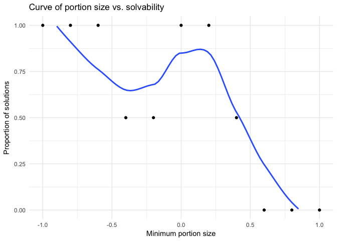
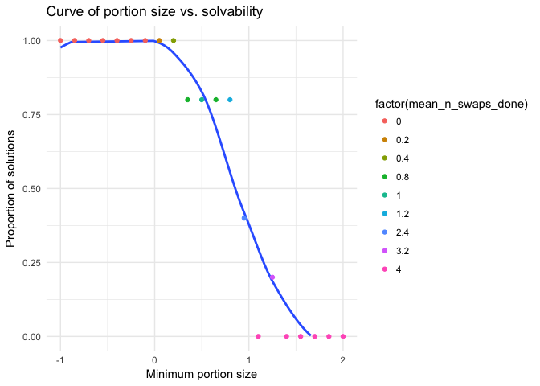
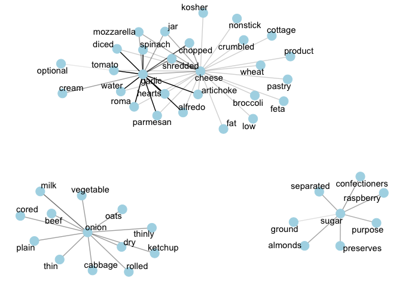

***


```r
dirs <- c("prep", "build", "score", "scrape", "solve", "simulate")
paths <- stringr::str_c("./scripts/", dirs)

# Import all .R scripts from all the dirs above 
for (p in paths) {
  suppressMessages(suppressPackageStartupMessages(dobtools::import_scripts(p)))
}
```

```
## Warning in read_fun(path = path, sheet = sheet, limits = limits, shim =
## shim, : partial argument match of 'sheet' to 'sheet_i'
```


### About

This is an ongoing project on menu optimizing. It's mainly an excuse for me to use several data science techniques in various proportions: along the way I query an API, generate menus, solve them algorithmically, simulate solving them, scrape the web for real menus, and touch on some natural language processing techniques. Don't worry about getting too hungry: this project has been fairly ~~nicknamed~~ slandered "Eat, Pray, Barf."

The meat of the project surrounds building menus and changing them until they are in compliance with daily nutritional guidelines. We'll simulate the curve of the proportion of these that are solvable as we increase the minimum portion size that each food must meet. Finally, I start about trying to improve the quality of the menus (i.e., decrease barf factor) by taking a cue from actual recipes scraped from Allrecipes.com. 

[](img/chinese_food.jpg)


## Getting from A to Beef

The data we'll be using here is conveniently located in an Excel file called ABBREV.xlsx on the USDA website. As the name suggests, this is an abbreviated version of all the foods in their database. 

If you do want the full list, they provide a Microsoft Access SQL dump as well (which requires that you have Access). The USDA also does have an open API so you can create an API key and grab foods from them with requests along the lines of a quick example I'll go through. The [API documentation](https://ndb.nal.usda.gov/ndb/doc/apilist/API-FOOD-REPORTV2.md) walks through the format for requesting data in more detail. I'll walk through an exmaple of how to get some foods and a few of their associated nutrient values.

The base URL we'll want is `http://api.nal.usda.gov/ndb/`.

The default number of results per request is 50 so we specify 1500 as our `max`. In this example I set `subset` to 1 in order to grab the most common foods. (Otherwise 1:1500 query only gets you from a to beef 😆.) If you do want to grab all foods, you can send requests of 1500 iteratively specifying `offset`, which refers to the number of the first row you want, and then glue them together. We've specified just 4 nutrient values we want here: calories, sugar, lipids, and carbohydrates.

After attaching those parameters to the end of our base URL, we'd have: 

`http://api.nal.usda.gov/ndb/nutrients/?format=json&api_key="<YOUR_KEY_HERE>&subset=1&max=1500&nutrients=205&nutrients=204&nutrients=208&nutrients=269`


In the browser, you could paste that same thing in to see:


We'll use the `jsonlite` package to turn that `fromJSON` into an R object.


```r
foods_raw <- jsonlite::fromJSON(paste0("http://api.nal.usda.gov/ndb/nutrients/?format=json&api_key=", 
                       key, "&subset=1&max=1500&nutrients=205&nutrients=204&nutrients=208&nutrients=269"), flatten = FALSE)

foods <- as_tibble(foods_raw$report$foods)
```


```r
head(foods) %>% kable(format = "html")
```

<table>
 <thead>
  <tr>
   <th style="text-align:left;"> ndbno </th>
   <th style="text-align:left;"> name </th>
   <th style="text-align:right;"> weight </th>
   <th style="text-align:left;"> measure </th>
   <th style="text-align:left;"> nutrients </th>
  </tr>
 </thead>
<tbody>
  <tr>
   <td style="text-align:left;"> 14007 </td>
   <td style="text-align:left;"> Alcoholic beverage, beer, light, BUD LIGHT </td>
   <td style="text-align:right;"> 29.5 </td>
   <td style="text-align:left;"> 1.0 fl oz </td>
   <td style="text-align:left;"> 208, 269, 204, 205, Energy, Sugars, total, Total lipid (fat), Carbohydrate, by difference, kcal, g, g, g, 9, --, 0.00, 0.38, 29, --, 0, 1.3 </td>
  </tr>
  <tr>
   <td style="text-align:left;"> 14009 </td>
   <td style="text-align:left;"> Alcoholic beverage, daiquiri, canned </td>
   <td style="text-align:right;"> 30.5 </td>
   <td style="text-align:left;"> 1.0 fl oz </td>
   <td style="text-align:left;"> 208, 269, 204, 205, Energy, Sugars, total, Total lipid (fat), Carbohydrate, by difference, kcal, g, g, g, 38, --, 0.00, 4.79, 125, --, 0, 15.7 </td>
  </tr>
  <tr>
   <td style="text-align:left;"> 14534 </td>
   <td style="text-align:left;"> Alcoholic beverage, liqueur, coffee, 63 proof </td>
   <td style="text-align:right;"> 34.8 </td>
   <td style="text-align:left;"> 1.0 fl oz </td>
   <td style="text-align:left;"> 208, 269, 204, 205, Energy, Sugars, total, Total lipid (fat), Carbohydrate, by difference, kcal, g, g, g, 107, --, 0.10, 11.21, 308, --, 0.3, 32.2 </td>
  </tr>
  <tr>
   <td style="text-align:left;"> 14015 </td>
   <td style="text-align:left;"> Alcoholic beverage, pina colada, canned </td>
   <td style="text-align:right;"> 32.6 </td>
   <td style="text-align:left;"> 1.0 fl oz </td>
   <td style="text-align:left;"> 208, 269, 204, 205, Energy, Sugars, total, Total lipid (fat), Carbohydrate, by difference, kcal, g, g, g, 77, --, 2.48, 9.00, 237, --, 7.6, 27.6 </td>
  </tr>
  <tr>
   <td style="text-align:left;"> 14019 </td>
   <td style="text-align:left;"> Alcoholic beverage, tequila sunrise, canned </td>
   <td style="text-align:right;"> 31.1 </td>
   <td style="text-align:left;"> 1.0 fl oz </td>
   <td style="text-align:left;"> 208, 269, 204, 205, Energy, Sugars, total, Total lipid (fat), Carbohydrate, by difference, kcal, g, g, g, 34, --, 0.03, 3.51, 110, --, 0.1, 11.3 </td>
  </tr>
  <tr>
   <td style="text-align:left;"> 14027 </td>
   <td style="text-align:left;"> Alcoholic beverage, whiskey sour, canned </td>
   <td style="text-align:right;"> 30.8 </td>
   <td style="text-align:left;"> 1.0 fl oz </td>
   <td style="text-align:left;"> 208, 269, 204, 205, Energy, Sugars, total, Total lipid (fat), Carbohydrate, by difference, kcal, g, g, g, 37, --, 0.00, 4.13, 119, --, 0, 13.4 </td>
  </tr>
</tbody>
</table>

We've got one row per food and a nested list-col of nutrients.


```r
str(foods$nutrients[1:3])
```

```
## List of 3
##  $ :'data.frame':	4 obs. of  5 variables:
##   ..$ nutrient_id: chr [1:4] "208" "269" "204" "205"
##   ..$ nutrient   : chr [1:4] "Energy" "Sugars, total" "Total lipid (fat)" "Carbohydrate, by difference"
##   ..$ unit       : chr [1:4] "kcal" "g" "g" "g"
##   ..$ value      : chr [1:4] "9" "--" "0.00" "0.38"
##   ..$ gm         : chr [1:4] "29" "--" "0" "1.3"
##  $ :'data.frame':	4 obs. of  5 variables:
##   ..$ nutrient_id: chr [1:4] "208" "269" "204" "205"
##   ..$ nutrient   : chr [1:4] "Energy" "Sugars, total" "Total lipid (fat)" "Carbohydrate, by difference"
##   ..$ unit       : chr [1:4] "kcal" "g" "g" "g"
##   ..$ value      : chr [1:4] "38" "--" "0.00" "4.79"
##   ..$ gm         : chr [1:4] "125" "--" "0" "15.7"
##  $ :'data.frame':	4 obs. of  5 variables:
##   ..$ nutrient_id: chr [1:4] "208" "269" "204" "205"
##   ..$ nutrient   : chr [1:4] "Energy" "Sugars, total" "Total lipid (fat)" "Carbohydrate, by difference"
##   ..$ unit       : chr [1:4] "kcal" "g" "g" "g"
##   ..$ value      : chr [1:4] "107" "--" "0.10" "11.21"
##   ..$ gm         : chr [1:4] "308" "--" "0.3" "32.2"
```


If we tried to unnest this right now we'd get an error. 

```r
foods %>% unnest()   # error :(
```


That's because missing values are coded as `--`. 


```r
foods$nutrients[[100]] %>% as_tibble() 
```

```
## # A tibble: 4 x 5
##   nutrient_id                    nutrient  unit value    gm
## *       <chr>                       <chr> <chr> <chr> <chr>
## 1         208                      Energy  kcal    --    --
## 2         269               Sugars, total     g    --    --
## 3         204           Total lipid (fat)     g  0.00     0
## 4         205 Carbohydrate, by difference     g    --    --
```

This becomes an issue for two of these columns, `gm` and `value` because `gm` gets coded as type numeric if there are no mising values and character otherwise. Consider the case where we have no missing values: here we see that `gm` is numeric.


```r
foods$nutrients[[200]] %>% as_tibble()
```

```
## # A tibble: 4 x 5
##   nutrient_id                    nutrient  unit value     gm
## *       <chr>                       <chr> <chr> <chr>  <dbl>
## 1         208                      Energy  kcal   216 540.00
## 2         269               Sugars, total     g 17.00  42.50
## 3         204           Total lipid (fat)     g 12.00  30.00
## 4         205 Carbohydrate, by difference     g 23.98  59.95
```

We can't unnest yet because a single column in a dataframe can only have values of one type; without changing the types of the various `gm` columns to a lowest common denominator, we won't be able to combine them.


We can replace our `--`s with `NA`s no problem


```r
foods$nutrients <- foods$nutrients %>% 
  map(na_if, "--") 
```


but unnesting is the challenge. 


```r
foods %>% unnest()
```

```
## Error in bind_rows_(x, .id): Column `gm` can't be converted from character to numeric
```

The naive approach of mapping character over all the nutrients columns doesn't give us the output we expect 


```r
foods$nutrients[1] %>% map(as.character)
```

```
## [[1]]
## [1] "c(\"208\", \"269\", \"204\", \"205\")"                                                   
## [2] "c(\"Energy\", \"Sugars, total\", \"Total lipid (fat)\", \"Carbohydrate, by difference\")"
## [3] "c(\"kcal\", \"g\", \"g\", \"g\")"                                                        
## [4] "c(\"9\", NA, \"0.00\", \"0.38\")"                                                        
## [5] "c(\"29\", NA, \"0\", \"1.3\")"
```

and we're stuck with the usual sense of not quite being able to reach the part of the data we want. (All credit here to the fantastic [Jenny Bryan](https://twitter.com/JennyBryan).)


<!-- From: https://giphy.com/gifs/water-funny-Bqn8Z7xdPCFy0 -->


So instead we'll dive into the second level of our nested list, take everything in there to character, and then unnest.


```r
foods$nutrients <- foods$nutrients %>% modify_depth(2, as.character)
```

Which is a nicer way of saying


```r
for (i in 1:length(foods$nutrients)) {
  for (j in 1:nrow(foods$nutrients[[1]])) {
    foods$nutrients[[i]]$nutrient_id[j] <- as.character(foods$nutrients[[i]]$nutrient_id[j])
    foods$nutrients[[i]]$nutrient[j] <- as.character(foods$nutrients[[i]]$nutrient[j])
    foods$nutrients[[i]]$unit[j] <- as.character(foods$nutrients[[i]]$unit[j])
    foods$nutrients[[i]]$gm[j] <- as.character(foods$nutrients[[i]]$gm[j])
    foods$nutrients[[i]]$value[j] <- as.character(foods$nutrients[[i]]$value[j])
  }
}
```

Now we can unnest the whole thing.


```r
foods <- foods %>% unnest()
```


Finally, let's set `value` and `gm` to numeric.


```r
foods$value <- as.numeric(foods$value)
foods$gm <- as.numeric(foods$gm)
```


```r
foods[1:20, ] %>% kable(format = "html")
```

<table>
 <thead>
  <tr>
   <th style="text-align:left;"> ndbno </th>
   <th style="text-align:left;"> name </th>
   <th style="text-align:right;"> weight </th>
   <th style="text-align:left;"> measure </th>
   <th style="text-align:left;"> nutrient_id </th>
   <th style="text-align:left;"> nutrient </th>
   <th style="text-align:left;"> unit </th>
   <th style="text-align:right;"> value </th>
   <th style="text-align:right;"> gm </th>
  </tr>
 </thead>
<tbody>
  <tr>
   <td style="text-align:left;"> 14007 </td>
   <td style="text-align:left;"> Alcoholic beverage, beer, light, BUD LIGHT </td>
   <td style="text-align:right;"> 29.5 </td>
   <td style="text-align:left;"> 1.0 fl oz </td>
   <td style="text-align:left;"> 208 </td>
   <td style="text-align:left;"> Energy </td>
   <td style="text-align:left;"> kcal </td>
   <td style="text-align:right;"> 9.00 </td>
   <td style="text-align:right;"> 29.0 </td>
  </tr>
  <tr>
   <td style="text-align:left;"> 14007 </td>
   <td style="text-align:left;"> Alcoholic beverage, beer, light, BUD LIGHT </td>
   <td style="text-align:right;"> 29.5 </td>
   <td style="text-align:left;"> 1.0 fl oz </td>
   <td style="text-align:left;"> 269 </td>
   <td style="text-align:left;"> Sugars, total </td>
   <td style="text-align:left;"> g </td>
   <td style="text-align:right;"> NA </td>
   <td style="text-align:right;"> NA </td>
  </tr>
  <tr>
   <td style="text-align:left;"> 14007 </td>
   <td style="text-align:left;"> Alcoholic beverage, beer, light, BUD LIGHT </td>
   <td style="text-align:right;"> 29.5 </td>
   <td style="text-align:left;"> 1.0 fl oz </td>
   <td style="text-align:left;"> 204 </td>
   <td style="text-align:left;"> Total lipid (fat) </td>
   <td style="text-align:left;"> g </td>
   <td style="text-align:right;"> 0.00 </td>
   <td style="text-align:right;"> 0.0 </td>
  </tr>
  <tr>
   <td style="text-align:left;"> 14007 </td>
   <td style="text-align:left;"> Alcoholic beverage, beer, light, BUD LIGHT </td>
   <td style="text-align:right;"> 29.5 </td>
   <td style="text-align:left;"> 1.0 fl oz </td>
   <td style="text-align:left;"> 205 </td>
   <td style="text-align:left;"> Carbohydrate, by difference </td>
   <td style="text-align:left;"> g </td>
   <td style="text-align:right;"> 0.38 </td>
   <td style="text-align:right;"> 1.3 </td>
  </tr>
  <tr>
   <td style="text-align:left;"> 14009 </td>
   <td style="text-align:left;"> Alcoholic beverage, daiquiri, canned </td>
   <td style="text-align:right;"> 30.5 </td>
   <td style="text-align:left;"> 1.0 fl oz </td>
   <td style="text-align:left;"> 208 </td>
   <td style="text-align:left;"> Energy </td>
   <td style="text-align:left;"> kcal </td>
   <td style="text-align:right;"> 38.00 </td>
   <td style="text-align:right;"> 125.0 </td>
  </tr>
  <tr>
   <td style="text-align:left;"> 14009 </td>
   <td style="text-align:left;"> Alcoholic beverage, daiquiri, canned </td>
   <td style="text-align:right;"> 30.5 </td>
   <td style="text-align:left;"> 1.0 fl oz </td>
   <td style="text-align:left;"> 269 </td>
   <td style="text-align:left;"> Sugars, total </td>
   <td style="text-align:left;"> g </td>
   <td style="text-align:right;"> NA </td>
   <td style="text-align:right;"> NA </td>
  </tr>
  <tr>
   <td style="text-align:left;"> 14009 </td>
   <td style="text-align:left;"> Alcoholic beverage, daiquiri, canned </td>
   <td style="text-align:right;"> 30.5 </td>
   <td style="text-align:left;"> 1.0 fl oz </td>
   <td style="text-align:left;"> 204 </td>
   <td style="text-align:left;"> Total lipid (fat) </td>
   <td style="text-align:left;"> g </td>
   <td style="text-align:right;"> 0.00 </td>
   <td style="text-align:right;"> 0.0 </td>
  </tr>
  <tr>
   <td style="text-align:left;"> 14009 </td>
   <td style="text-align:left;"> Alcoholic beverage, daiquiri, canned </td>
   <td style="text-align:right;"> 30.5 </td>
   <td style="text-align:left;"> 1.0 fl oz </td>
   <td style="text-align:left;"> 205 </td>
   <td style="text-align:left;"> Carbohydrate, by difference </td>
   <td style="text-align:left;"> g </td>
   <td style="text-align:right;"> 4.79 </td>
   <td style="text-align:right;"> 15.7 </td>
  </tr>
  <tr>
   <td style="text-align:left;"> 14534 </td>
   <td style="text-align:left;"> Alcoholic beverage, liqueur, coffee, 63 proof </td>
   <td style="text-align:right;"> 34.8 </td>
   <td style="text-align:left;"> 1.0 fl oz </td>
   <td style="text-align:left;"> 208 </td>
   <td style="text-align:left;"> Energy </td>
   <td style="text-align:left;"> kcal </td>
   <td style="text-align:right;"> 107.00 </td>
   <td style="text-align:right;"> 308.0 </td>
  </tr>
  <tr>
   <td style="text-align:left;"> 14534 </td>
   <td style="text-align:left;"> Alcoholic beverage, liqueur, coffee, 63 proof </td>
   <td style="text-align:right;"> 34.8 </td>
   <td style="text-align:left;"> 1.0 fl oz </td>
   <td style="text-align:left;"> 269 </td>
   <td style="text-align:left;"> Sugars, total </td>
   <td style="text-align:left;"> g </td>
   <td style="text-align:right;"> NA </td>
   <td style="text-align:right;"> NA </td>
  </tr>
  <tr>
   <td style="text-align:left;"> 14534 </td>
   <td style="text-align:left;"> Alcoholic beverage, liqueur, coffee, 63 proof </td>
   <td style="text-align:right;"> 34.8 </td>
   <td style="text-align:left;"> 1.0 fl oz </td>
   <td style="text-align:left;"> 204 </td>
   <td style="text-align:left;"> Total lipid (fat) </td>
   <td style="text-align:left;"> g </td>
   <td style="text-align:right;"> 0.10 </td>
   <td style="text-align:right;"> 0.3 </td>
  </tr>
  <tr>
   <td style="text-align:left;"> 14534 </td>
   <td style="text-align:left;"> Alcoholic beverage, liqueur, coffee, 63 proof </td>
   <td style="text-align:right;"> 34.8 </td>
   <td style="text-align:left;"> 1.0 fl oz </td>
   <td style="text-align:left;"> 205 </td>
   <td style="text-align:left;"> Carbohydrate, by difference </td>
   <td style="text-align:left;"> g </td>
   <td style="text-align:right;"> 11.21 </td>
   <td style="text-align:right;"> 32.2 </td>
  </tr>
  <tr>
   <td style="text-align:left;"> 14015 </td>
   <td style="text-align:left;"> Alcoholic beverage, pina colada, canned </td>
   <td style="text-align:right;"> 32.6 </td>
   <td style="text-align:left;"> 1.0 fl oz </td>
   <td style="text-align:left;"> 208 </td>
   <td style="text-align:left;"> Energy </td>
   <td style="text-align:left;"> kcal </td>
   <td style="text-align:right;"> 77.00 </td>
   <td style="text-align:right;"> 237.0 </td>
  </tr>
  <tr>
   <td style="text-align:left;"> 14015 </td>
   <td style="text-align:left;"> Alcoholic beverage, pina colada, canned </td>
   <td style="text-align:right;"> 32.6 </td>
   <td style="text-align:left;"> 1.0 fl oz </td>
   <td style="text-align:left;"> 269 </td>
   <td style="text-align:left;"> Sugars, total </td>
   <td style="text-align:left;"> g </td>
   <td style="text-align:right;"> NA </td>
   <td style="text-align:right;"> NA </td>
  </tr>
  <tr>
   <td style="text-align:left;"> 14015 </td>
   <td style="text-align:left;"> Alcoholic beverage, pina colada, canned </td>
   <td style="text-align:right;"> 32.6 </td>
   <td style="text-align:left;"> 1.0 fl oz </td>
   <td style="text-align:left;"> 204 </td>
   <td style="text-align:left;"> Total lipid (fat) </td>
   <td style="text-align:left;"> g </td>
   <td style="text-align:right;"> 2.48 </td>
   <td style="text-align:right;"> 7.6 </td>
  </tr>
  <tr>
   <td style="text-align:left;"> 14015 </td>
   <td style="text-align:left;"> Alcoholic beverage, pina colada, canned </td>
   <td style="text-align:right;"> 32.6 </td>
   <td style="text-align:left;"> 1.0 fl oz </td>
   <td style="text-align:left;"> 205 </td>
   <td style="text-align:left;"> Carbohydrate, by difference </td>
   <td style="text-align:left;"> g </td>
   <td style="text-align:right;"> 9.00 </td>
   <td style="text-align:right;"> 27.6 </td>
  </tr>
  <tr>
   <td style="text-align:left;"> 14019 </td>
   <td style="text-align:left;"> Alcoholic beverage, tequila sunrise, canned </td>
   <td style="text-align:right;"> 31.1 </td>
   <td style="text-align:left;"> 1.0 fl oz </td>
   <td style="text-align:left;"> 208 </td>
   <td style="text-align:left;"> Energy </td>
   <td style="text-align:left;"> kcal </td>
   <td style="text-align:right;"> 34.00 </td>
   <td style="text-align:right;"> 110.0 </td>
  </tr>
  <tr>
   <td style="text-align:left;"> 14019 </td>
   <td style="text-align:left;"> Alcoholic beverage, tequila sunrise, canned </td>
   <td style="text-align:right;"> 31.1 </td>
   <td style="text-align:left;"> 1.0 fl oz </td>
   <td style="text-align:left;"> 269 </td>
   <td style="text-align:left;"> Sugars, total </td>
   <td style="text-align:left;"> g </td>
   <td style="text-align:right;"> NA </td>
   <td style="text-align:right;"> NA </td>
  </tr>
  <tr>
   <td style="text-align:left;"> 14019 </td>
   <td style="text-align:left;"> Alcoholic beverage, tequila sunrise, canned </td>
   <td style="text-align:right;"> 31.1 </td>
   <td style="text-align:left;"> 1.0 fl oz </td>
   <td style="text-align:left;"> 204 </td>
   <td style="text-align:left;"> Total lipid (fat) </td>
   <td style="text-align:left;"> g </td>
   <td style="text-align:right;"> 0.03 </td>
   <td style="text-align:right;"> 0.1 </td>
  </tr>
  <tr>
   <td style="text-align:left;"> 14019 </td>
   <td style="text-align:left;"> Alcoholic beverage, tequila sunrise, canned </td>
   <td style="text-align:right;"> 31.1 </td>
   <td style="text-align:left;"> 1.0 fl oz </td>
   <td style="text-align:left;"> 205 </td>
   <td style="text-align:left;"> Carbohydrate, by difference </td>
   <td style="text-align:left;"> g </td>
   <td style="text-align:right;"> 3.51 </td>
   <td style="text-align:right;"> 11.3 </td>
  </tr>
</tbody>
</table>

<br>

### Prep Time: 20mins

Great, we've successfully unnested. As I mentioned before, we'll use our nice `ABBREV.xlsx` rather than using data pulled from the API. So:


```r
abbrev_raw <- readxl::read_excel("./data/raw/ABBREV.xlsx") %>% as_tibble()
```

```
## Warning in read_fun(path = path, sheet = sheet, limits = limits, shim =
## shim, : partial argument match of 'sheet' to 'sheet_i'
```

```r
abbrev_raw %>% sample_n(20) %>% kable(format = "html")
```

<table>
 <thead>
  <tr>
   <th style="text-align:left;"> NDB_No </th>
   <th style="text-align:left;"> Shrt_Desc </th>
   <th style="text-align:right;"> Water_(g) </th>
   <th style="text-align:right;"> Energ_Kcal </th>
   <th style="text-align:right;"> Protein_(g) </th>
   <th style="text-align:right;"> Lipid_Tot_(g) </th>
   <th style="text-align:right;"> Ash_(g) </th>
   <th style="text-align:right;"> Carbohydrt_(g) </th>
   <th style="text-align:right;"> Fiber_TD_(g) </th>
   <th style="text-align:right;"> Sugar_Tot_(g) </th>
   <th style="text-align:right;"> Calcium_(mg) </th>
   <th style="text-align:right;"> Iron_(mg) </th>
   <th style="text-align:right;"> Magnesium_(mg) </th>
   <th style="text-align:right;"> Phosphorus_(mg) </th>
   <th style="text-align:right;"> Potassium_(mg) </th>
   <th style="text-align:right;"> Sodium_(mg) </th>
   <th style="text-align:right;"> Zinc_(mg) </th>
   <th style="text-align:right;"> Copper_mg) </th>
   <th style="text-align:right;"> Manganese_(mg) </th>
   <th style="text-align:right;"> Selenium_(µg) </th>
   <th style="text-align:right;"> Vit_C_(mg) </th>
   <th style="text-align:right;"> Thiamin_(mg) </th>
   <th style="text-align:right;"> Riboflavin_(mg) </th>
   <th style="text-align:right;"> Niacin_(mg) </th>
   <th style="text-align:right;"> Panto_Acid_mg) </th>
   <th style="text-align:right;"> Vit_B6_(mg) </th>
   <th style="text-align:right;"> Folate_Tot_(µg) </th>
   <th style="text-align:right;"> Folic_Acid_(µg) </th>
   <th style="text-align:right;"> Food_Folate_(µg) </th>
   <th style="text-align:right;"> Folate_DFE_(µg) </th>
   <th style="text-align:right;"> Choline_Tot_ (mg) </th>
   <th style="text-align:right;"> Vit_B12_(µg) </th>
   <th style="text-align:right;"> Vit_A_IU </th>
   <th style="text-align:right;"> Vit_A_RAE </th>
   <th style="text-align:right;"> Retinol_(µg) </th>
   <th style="text-align:right;"> Alpha_Carot_(µg) </th>
   <th style="text-align:right;"> Beta_Carot_(µg) </th>
   <th style="text-align:right;"> Beta_Crypt_(µg) </th>
   <th style="text-align:right;"> Lycopene_(µg) </th>
   <th style="text-align:right;"> Lut+Zea_ (µg) </th>
   <th style="text-align:right;"> Vit_E_(mg) </th>
   <th style="text-align:right;"> Vit_D_µg </th>
   <th style="text-align:right;"> Vit_D_IU </th>
   <th style="text-align:right;"> Vit_K_(µg) </th>
   <th style="text-align:right;"> FA_Sat_(g) </th>
   <th style="text-align:right;"> FA_Mono_(g) </th>
   <th style="text-align:right;"> FA_Poly_(g) </th>
   <th style="text-align:right;"> Cholestrl_(mg) </th>
   <th style="text-align:right;"> GmWt_1 </th>
   <th style="text-align:left;"> GmWt_Desc1 </th>
   <th style="text-align:right;"> GmWt_2 </th>
   <th style="text-align:left;"> GmWt_Desc2 </th>
   <th style="text-align:right;"> Refuse_Pct </th>
  </tr>
 </thead>
<tbody>
  <tr>
   <td style="text-align:left;"> 10998 </td>
   <td style="text-align:left;"> CANADIAN BACON,CKD,PAN-FRIED </td>
   <td style="text-align:right;"> 62.50 </td>
   <td style="text-align:right;"> 146 </td>
   <td style="text-align:right;"> 28.31 </td>
   <td style="text-align:right;"> 2.78 </td>
   <td style="text-align:right;"> 4.60 </td>
   <td style="text-align:right;"> 1.80 </td>
   <td style="text-align:right;"> 0.0 </td>
   <td style="text-align:right;"> 1.20 </td>
   <td style="text-align:right;"> 7 </td>
   <td style="text-align:right;"> 0.56 </td>
   <td style="text-align:right;"> 27 </td>
   <td style="text-align:right;"> 309 </td>
   <td style="text-align:right;"> 999 </td>
   <td style="text-align:right;"> 993 </td>
   <td style="text-align:right;"> 1.73 </td>
   <td style="text-align:right;"> 0.063 </td>
   <td style="text-align:right;"> 0.016 </td>
   <td style="text-align:right;"> 50.4 </td>
   <td style="text-align:right;"> 0.0 </td>
   <td style="text-align:right;"> 0.669 </td>
   <td style="text-align:right;"> 0.185 </td>
   <td style="text-align:right;"> 9.988 </td>
   <td style="text-align:right;"> 0.720 </td>
   <td style="text-align:right;"> 0.280 </td>
   <td style="text-align:right;"> 4 </td>
   <td style="text-align:right;"> 0 </td>
   <td style="text-align:right;"> 4 </td>
   <td style="text-align:right;"> 4 </td>
   <td style="text-align:right;"> 104.8 </td>
   <td style="text-align:right;"> 0.43 </td>
   <td style="text-align:right;"> 0 </td>
   <td style="text-align:right;"> 0 </td>
   <td style="text-align:right;"> 0 </td>
   <td style="text-align:right;"> 0 </td>
   <td style="text-align:right;"> 0 </td>
   <td style="text-align:right;"> 0 </td>
   <td style="text-align:right;"> 0 </td>
   <td style="text-align:right;"> 0 </td>
   <td style="text-align:right;"> 0.41 </td>
   <td style="text-align:right;"> 0.2 </td>
   <td style="text-align:right;"> 9 </td>
   <td style="text-align:right;"> 0.2 </td>
   <td style="text-align:right;"> 1.039 </td>
   <td style="text-align:right;"> 1.255 </td>
   <td style="text-align:right;"> 0.485 </td>
   <td style="text-align:right;"> 67 </td>
   <td style="text-align:right;"> 13.80 </td>
   <td style="text-align:left;"> 1 slice </td>
   <td style="text-align:right;"> NA </td>
   <td style="text-align:left;"> NA </td>
   <td style="text-align:right;"> 0 </td>
  </tr>
  <tr>
   <td style="text-align:left;"> 21382 </td>
   <td style="text-align:left;"> MCDONALD'S,FILET-O-FISH (WITHOUT TARTAR SAUCE) </td>
   <td style="text-align:right;"> 46.90 </td>
   <td style="text-align:right;"> 243 </td>
   <td style="text-align:right;"> 12.47 </td>
   <td style="text-align:right;"> 7.62 </td>
   <td style="text-align:right;"> 1.93 </td>
   <td style="text-align:right;"> 31.08 </td>
   <td style="text-align:right;"> 1.0 </td>
   <td style="text-align:right;"> 4.27 </td>
   <td style="text-align:right;"> 128 </td>
   <td style="text-align:right;"> 1.64 </td>
   <td style="text-align:right;"> 23 </td>
   <td style="text-align:right;"> 131 </td>
   <td style="text-align:right;"> 194 </td>
   <td style="text-align:right;"> 464 </td>
   <td style="text-align:right;"> 0.54 </td>
   <td style="text-align:right;"> 0.065 </td>
   <td style="text-align:right;"> 0.230 </td>
   <td style="text-align:right;"> NA </td>
   <td style="text-align:right;"> 0.1 </td>
   <td style="text-align:right;"> 0.283 </td>
   <td style="text-align:right;"> 0.201 </td>
   <td style="text-align:right;"> 2.748 </td>
   <td style="text-align:right;"> NA </td>
   <td style="text-align:right;"> NA </td>
   <td style="text-align:right;"> 57 </td>
   <td style="text-align:right;"> NA </td>
   <td style="text-align:right;"> NA </td>
   <td style="text-align:right;"> NA </td>
   <td style="text-align:right;"> NA </td>
   <td style="text-align:right;"> 0.81 </td>
   <td style="text-align:right;"> 93 </td>
   <td style="text-align:right;"> NA </td>
   <td style="text-align:right;"> NA </td>
   <td style="text-align:right;"> NA </td>
   <td style="text-align:right;"> NA </td>
   <td style="text-align:right;"> NA </td>
   <td style="text-align:right;"> NA </td>
   <td style="text-align:right;"> NA </td>
   <td style="text-align:right;"> NA </td>
   <td style="text-align:right;"> NA </td>
   <td style="text-align:right;"> NA </td>
   <td style="text-align:right;"> NA </td>
   <td style="text-align:right;"> 1.773 </td>
   <td style="text-align:right;"> 2.768 </td>
   <td style="text-align:right;"> 2.323 </td>
   <td style="text-align:right;"> 25 </td>
   <td style="text-align:right;"> 124.00 </td>
   <td style="text-align:left;"> 1 item </td>
   <td style="text-align:right;"> NA </td>
   <td style="text-align:left;"> NA </td>
   <td style="text-align:right;"> 0 </td>
  </tr>
  <tr>
   <td style="text-align:left;"> 16596 </td>
   <td style="text-align:left;"> MORNINGSTAR FARMS GRILLERS QRTR PND VEGGIE BRGR,FRZ,UNPRP </td>
   <td style="text-align:right;"> 55.60 </td>
   <td style="text-align:right;"> 219 </td>
   <td style="text-align:right;"> 22.80 </td>
   <td style="text-align:right;"> 10.50 </td>
   <td style="text-align:right;"> 2.20 </td>
   <td style="text-align:right;"> 8.90 </td>
   <td style="text-align:right;"> 2.5 </td>
   <td style="text-align:right;"> 0.60 </td>
   <td style="text-align:right;"> 79 </td>
   <td style="text-align:right;"> 4.90 </td>
   <td style="text-align:right;"> NA </td>
   <td style="text-align:right;"> 124 </td>
   <td style="text-align:right;"> 235 </td>
   <td style="text-align:right;"> 429 </td>
   <td style="text-align:right;"> 1.10 </td>
   <td style="text-align:right;"> NA </td>
   <td style="text-align:right;"> NA </td>
   <td style="text-align:right;"> NA </td>
   <td style="text-align:right;"> 28.0 </td>
   <td style="text-align:right;"> 1.150 </td>
   <td style="text-align:right;"> 0.300 </td>
   <td style="text-align:right;"> 10.800 </td>
   <td style="text-align:right;"> NA </td>
   <td style="text-align:right;"> 0.780 </td>
   <td style="text-align:right;"> 2 </td>
   <td style="text-align:right;"> NA </td>
   <td style="text-align:right;"> 2 </td>
   <td style="text-align:right;"> NA </td>
   <td style="text-align:right;"> NA </td>
   <td style="text-align:right;"> 7.70 </td>
   <td style="text-align:right;"> 1 </td>
   <td style="text-align:right;"> NA </td>
   <td style="text-align:right;"> NA </td>
   <td style="text-align:right;"> NA </td>
   <td style="text-align:right;"> NA </td>
   <td style="text-align:right;"> NA </td>
   <td style="text-align:right;"> NA </td>
   <td style="text-align:right;"> NA </td>
   <td style="text-align:right;"> NA </td>
   <td style="text-align:right;"> NA </td>
   <td style="text-align:right;"> 0 </td>
   <td style="text-align:right;"> NA </td>
   <td style="text-align:right;"> 1.900 </td>
   <td style="text-align:right;"> 2.000 </td>
   <td style="text-align:right;"> 4.900 </td>
   <td style="text-align:right;"> 1 </td>
   <td style="text-align:right;"> 114.00 </td>
   <td style="text-align:left;"> 1 burger </td>
   <td style="text-align:right;"> NA </td>
   <td style="text-align:left;"> NA </td>
   <td style="text-align:right;"> 0 </td>
  </tr>
  <tr>
   <td style="text-align:left;"> 21018 </td>
   <td style="text-align:left;"> FAST FOODS,EGG,SCRAMBLED </td>
   <td style="text-align:right;"> 66.70 </td>
   <td style="text-align:right;"> 212 </td>
   <td style="text-align:right;"> 13.84 </td>
   <td style="text-align:right;"> 16.18 </td>
   <td style="text-align:right;"> 1.20 </td>
   <td style="text-align:right;"> 2.08 </td>
   <td style="text-align:right;"> 0.0 </td>
   <td style="text-align:right;"> 1.64 </td>
   <td style="text-align:right;"> 57 </td>
   <td style="text-align:right;"> 2.59 </td>
   <td style="text-align:right;"> 14 </td>
   <td style="text-align:right;"> 242 </td>
   <td style="text-align:right;"> 147 </td>
   <td style="text-align:right;"> 187 </td>
   <td style="text-align:right;"> 1.66 </td>
   <td style="text-align:right;"> 0.067 </td>
   <td style="text-align:right;"> 0.043 </td>
   <td style="text-align:right;"> 22.5 </td>
   <td style="text-align:right;"> 3.3 </td>
   <td style="text-align:right;"> 0.080 </td>
   <td style="text-align:right;"> 0.520 </td>
   <td style="text-align:right;"> 0.210 </td>
   <td style="text-align:right;"> 0.940 </td>
   <td style="text-align:right;"> 0.190 </td>
   <td style="text-align:right;"> 29 </td>
   <td style="text-align:right;"> 0 </td>
   <td style="text-align:right;"> 29 </td>
   <td style="text-align:right;"> 29 </td>
   <td style="text-align:right;"> 180.6 </td>
   <td style="text-align:right;"> 1.01 </td>
   <td style="text-align:right;"> 679 </td>
   <td style="text-align:right;"> 176 </td>
   <td style="text-align:right;"> 171 </td>
   <td style="text-align:right;"> 0 </td>
   <td style="text-align:right;"> 62 </td>
   <td style="text-align:right;"> 6 </td>
   <td style="text-align:right;"> 0 </td>
   <td style="text-align:right;"> 233 </td>
   <td style="text-align:right;"> 0.96 </td>
   <td style="text-align:right;"> 1.1 </td>
   <td style="text-align:right;"> 46 </td>
   <td style="text-align:right;"> 9.0 </td>
   <td style="text-align:right;"> 6.153 </td>
   <td style="text-align:right;"> 5.889 </td>
   <td style="text-align:right;"> 1.969 </td>
   <td style="text-align:right;"> 426 </td>
   <td style="text-align:right;"> 96.00 </td>
   <td style="text-align:left;"> 2 eggs </td>
   <td style="text-align:right;"> NA </td>
   <td style="text-align:left;"> NA </td>
   <td style="text-align:right;"> 0 </td>
  </tr>
  <tr>
   <td style="text-align:left;"> 01070 </td>
   <td style="text-align:left;"> DESSERT TOPPING,POWDERED </td>
   <td style="text-align:right;"> 1.47 </td>
   <td style="text-align:right;"> 577 </td>
   <td style="text-align:right;"> 4.90 </td>
   <td style="text-align:right;"> 39.92 </td>
   <td style="text-align:right;"> 1.17 </td>
   <td style="text-align:right;"> 52.54 </td>
   <td style="text-align:right;"> 0.0 </td>
   <td style="text-align:right;"> 52.54 </td>
   <td style="text-align:right;"> 17 </td>
   <td style="text-align:right;"> 0.03 </td>
   <td style="text-align:right;"> 7 </td>
   <td style="text-align:right;"> 74 </td>
   <td style="text-align:right;"> 166 </td>
   <td style="text-align:right;"> 122 </td>
   <td style="text-align:right;"> 0.08 </td>
   <td style="text-align:right;"> 0.118 </td>
   <td style="text-align:right;"> 0.225 </td>
   <td style="text-align:right;"> 0.6 </td>
   <td style="text-align:right;"> 0.0 </td>
   <td style="text-align:right;"> 0.000 </td>
   <td style="text-align:right;"> 0.000 </td>
   <td style="text-align:right;"> 0.000 </td>
   <td style="text-align:right;"> 0.000 </td>
   <td style="text-align:right;"> 0.000 </td>
   <td style="text-align:right;"> 0 </td>
   <td style="text-align:right;"> 0 </td>
   <td style="text-align:right;"> 0 </td>
   <td style="text-align:right;"> 0 </td>
   <td style="text-align:right;"> 0.1 </td>
   <td style="text-align:right;"> 0.00 </td>
   <td style="text-align:right;"> 0 </td>
   <td style="text-align:right;"> 0 </td>
   <td style="text-align:right;"> 0 </td>
   <td style="text-align:right;"> 0 </td>
   <td style="text-align:right;"> 0 </td>
   <td style="text-align:right;"> 0 </td>
   <td style="text-align:right;"> 0 </td>
   <td style="text-align:right;"> 0 </td>
   <td style="text-align:right;"> 1.52 </td>
   <td style="text-align:right;"> 0.0 </td>
   <td style="text-align:right;"> 0 </td>
   <td style="text-align:right;"> 9.9 </td>
   <td style="text-align:right;"> 36.723 </td>
   <td style="text-align:right;"> 0.600 </td>
   <td style="text-align:right;"> 0.447 </td>
   <td style="text-align:right;"> 0 </td>
   <td style="text-align:right;"> 43.00 </td>
   <td style="text-align:left;"> 1.5 oz </td>
   <td style="text-align:right;"> 1.3 </td>
   <td style="text-align:left;"> 1 portion,  amount to make 1 tbsp </td>
   <td style="text-align:right;"> 0 </td>
  </tr>
  <tr>
   <td style="text-align:left;"> 03009 </td>
   <td style="text-align:left;"> BABYFOOD,MEAT,HAM,JUNIOR </td>
   <td style="text-align:right;"> 80.50 </td>
   <td style="text-align:right;"> 97 </td>
   <td style="text-align:right;"> 11.30 </td>
   <td style="text-align:right;"> 3.80 </td>
   <td style="text-align:right;"> 0.70 </td>
   <td style="text-align:right;"> 3.70 </td>
   <td style="text-align:right;"> 0.0 </td>
   <td style="text-align:right;"> 0.00 </td>
   <td style="text-align:right;"> 5 </td>
   <td style="text-align:right;"> 1.01 </td>
   <td style="text-align:right;"> 11 </td>
   <td style="text-align:right;"> 89 </td>
   <td style="text-align:right;"> 210 </td>
   <td style="text-align:right;"> 44 </td>
   <td style="text-align:right;"> 1.70 </td>
   <td style="text-align:right;"> 0.068 </td>
   <td style="text-align:right;"> NA </td>
   <td style="text-align:right;"> 15.0 </td>
   <td style="text-align:right;"> 2.1 </td>
   <td style="text-align:right;"> 0.142 </td>
   <td style="text-align:right;"> 0.194 </td>
   <td style="text-align:right;"> 2.840 </td>
   <td style="text-align:right;"> 0.531 </td>
   <td style="text-align:right;"> 0.200 </td>
   <td style="text-align:right;"> 2 </td>
   <td style="text-align:right;"> 0 </td>
   <td style="text-align:right;"> 2 </td>
   <td style="text-align:right;"> 2 </td>
   <td style="text-align:right;"> 45.2 </td>
   <td style="text-align:right;"> 0.10 </td>
   <td style="text-align:right;"> 0 </td>
   <td style="text-align:right;"> 0 </td>
   <td style="text-align:right;"> 0 </td>
   <td style="text-align:right;"> 0 </td>
   <td style="text-align:right;"> 0 </td>
   <td style="text-align:right;"> 0 </td>
   <td style="text-align:right;"> 0 </td>
   <td style="text-align:right;"> 0 </td>
   <td style="text-align:right;"> 0.40 </td>
   <td style="text-align:right;"> 0.4 </td>
   <td style="text-align:right;"> 18 </td>
   <td style="text-align:right;"> 0.0 </td>
   <td style="text-align:right;"> 1.271 </td>
   <td style="text-align:right;"> 1.804 </td>
   <td style="text-align:right;"> 0.516 </td>
   <td style="text-align:right;"> 29 </td>
   <td style="text-align:right;"> 28.35 </td>
   <td style="text-align:left;"> 1 oz </td>
   <td style="text-align:right;"> 71.0 </td>
   <td style="text-align:left;"> 1 jar </td>
   <td style="text-align:right;"> 0 </td>
  </tr>
  <tr>
   <td style="text-align:left;"> 23584 </td>
   <td style="text-align:left;"> BEEF,TOP SIRLOIN,STEAK,LN,1/8&quot; FAT,SEL,RAW </td>
   <td style="text-align:right;"> 73.31 </td>
   <td style="text-align:right;"> 127 </td>
   <td style="text-align:right;"> 22.27 </td>
   <td style="text-align:right;"> 3.54 </td>
   <td style="text-align:right;"> 1.19 </td>
   <td style="text-align:right;"> 0.00 </td>
   <td style="text-align:right;"> 0.0 </td>
   <td style="text-align:right;"> 0.00 </td>
   <td style="text-align:right;"> 22 </td>
   <td style="text-align:right;"> 1.61 </td>
   <td style="text-align:right;"> 23 </td>
   <td style="text-align:right;"> 211 </td>
   <td style="text-align:right;"> 357 </td>
   <td style="text-align:right;"> 56 </td>
   <td style="text-align:right;"> 4.00 </td>
   <td style="text-align:right;"> 0.077 </td>
   <td style="text-align:right;"> 0.011 </td>
   <td style="text-align:right;"> 30.8 </td>
   <td style="text-align:right;"> 0.0 </td>
   <td style="text-align:right;"> 0.075 </td>
   <td style="text-align:right;"> 0.120 </td>
   <td style="text-align:right;"> 6.469 </td>
   <td style="text-align:right;"> 0.654 </td>
   <td style="text-align:right;"> 0.628 </td>
   <td style="text-align:right;"> 13 </td>
   <td style="text-align:right;"> 0 </td>
   <td style="text-align:right;"> 13 </td>
   <td style="text-align:right;"> 13 </td>
   <td style="text-align:right;"> 93.0 </td>
   <td style="text-align:right;"> 0.94 </td>
   <td style="text-align:right;"> 0 </td>
   <td style="text-align:right;"> 0 </td>
   <td style="text-align:right;"> 0 </td>
   <td style="text-align:right;"> 0 </td>
   <td style="text-align:right;"> 0 </td>
   <td style="text-align:right;"> 0 </td>
   <td style="text-align:right;"> 0 </td>
   <td style="text-align:right;"> 0 </td>
   <td style="text-align:right;"> 0.28 </td>
   <td style="text-align:right;"> 0.0 </td>
   <td style="text-align:right;"> 2 </td>
   <td style="text-align:right;"> 1.1 </td>
   <td style="text-align:right;"> 1.307 </td>
   <td style="text-align:right;"> 1.422 </td>
   <td style="text-align:right;"> 0.167 </td>
   <td style="text-align:right;"> 59 </td>
   <td style="text-align:right;"> 28.35 </td>
   <td style="text-align:left;"> 1 oz </td>
   <td style="text-align:right;"> 453.6 </td>
   <td style="text-align:left;"> 1 lb </td>
   <td style="text-align:right;"> 14 </td>
  </tr>
  <tr>
   <td style="text-align:left;"> 06740 </td>
   <td style="text-align:left;"> SOUP,CHICK VEG,CHUNKY,RED FAT,RED NA,RTS,SINGLE BRAND </td>
   <td style="text-align:right;"> 89.50 </td>
   <td style="text-align:right;"> 40 </td>
   <td style="text-align:right;"> 2.70 </td>
   <td style="text-align:right;"> 0.50 </td>
   <td style="text-align:right;"> 1.00 </td>
   <td style="text-align:right;"> 6.30 </td>
   <td style="text-align:right;"> NA </td>
   <td style="text-align:right;"> NA </td>
   <td style="text-align:right;"> NA </td>
   <td style="text-align:right;"> NA </td>
   <td style="text-align:right;"> NA </td>
   <td style="text-align:right;"> NA </td>
   <td style="text-align:right;"> NA </td>
   <td style="text-align:right;"> 192 </td>
   <td style="text-align:right;"> NA </td>
   <td style="text-align:right;"> NA </td>
   <td style="text-align:right;"> NA </td>
   <td style="text-align:right;"> NA </td>
   <td style="text-align:right;"> NA </td>
   <td style="text-align:right;"> NA </td>
   <td style="text-align:right;"> NA </td>
   <td style="text-align:right;"> NA </td>
   <td style="text-align:right;"> NA </td>
   <td style="text-align:right;"> NA </td>
   <td style="text-align:right;"> NA </td>
   <td style="text-align:right;"> NA </td>
   <td style="text-align:right;"> NA </td>
   <td style="text-align:right;"> NA </td>
   <td style="text-align:right;"> NA </td>
   <td style="text-align:right;"> NA </td>
   <td style="text-align:right;"> 1283 </td>
   <td style="text-align:right;"> NA </td>
   <td style="text-align:right;"> NA </td>
   <td style="text-align:right;"> NA </td>
   <td style="text-align:right;"> 770 </td>
   <td style="text-align:right;"> NA </td>
   <td style="text-align:right;"> NA </td>
   <td style="text-align:right;"> NA </td>
   <td style="text-align:right;"> NA </td>
   <td style="text-align:right;"> NA </td>
   <td style="text-align:right;"> NA </td>
   <td style="text-align:right;"> NA </td>
   <td style="text-align:right;"> 0.121 </td>
   <td style="text-align:right;"> 0.168 </td>
   <td style="text-align:right;"> 0.107 </td>
   <td style="text-align:right;"> 4 </td>
   <td style="text-align:right;"> 240.00 </td>
   <td style="text-align:left;"> 1 serving </td>
   <td style="text-align:right;"> 454.0 </td>
   <td style="text-align:left;"> 1 package,  yields </td>
   <td style="text-align:right;"> 0 </td>
  </tr>
  <tr>
   <td style="text-align:left;"> 21234 </td>
   <td style="text-align:left;"> MCDONALD'S,QUARTER POUNDER </td>
   <td style="text-align:right;"> 50.37 </td>
   <td style="text-align:right;"> 244 </td>
   <td style="text-align:right;"> 14.10 </td>
   <td style="text-align:right;"> 11.55 </td>
   <td style="text-align:right;"> 1.81 </td>
   <td style="text-align:right;"> 22.17 </td>
   <td style="text-align:right;"> 1.6 </td>
   <td style="text-align:right;"> 5.13 </td>
   <td style="text-align:right;"> 84 </td>
   <td style="text-align:right;"> 2.41 </td>
   <td style="text-align:right;"> 22 </td>
   <td style="text-align:right;"> 124 </td>
   <td style="text-align:right;"> 227 </td>
   <td style="text-align:right;"> 427 </td>
   <td style="text-align:right;"> 2.69 </td>
   <td style="text-align:right;"> 0.107 </td>
   <td style="text-align:right;"> 0.199 </td>
   <td style="text-align:right;"> NA </td>
   <td style="text-align:right;"> 0.9 </td>
   <td style="text-align:right;"> 0.183 </td>
   <td style="text-align:right;"> 0.344 </td>
   <td style="text-align:right;"> 4.452 </td>
   <td style="text-align:right;"> NA </td>
   <td style="text-align:right;"> NA </td>
   <td style="text-align:right;"> 56 </td>
   <td style="text-align:right;"> NA </td>
   <td style="text-align:right;"> NA </td>
   <td style="text-align:right;"> NA </td>
   <td style="text-align:right;"> NA </td>
   <td style="text-align:right;"> 1.28 </td>
   <td style="text-align:right;"> 56 </td>
   <td style="text-align:right;"> NA </td>
   <td style="text-align:right;"> NA </td>
   <td style="text-align:right;"> NA </td>
   <td style="text-align:right;"> NA </td>
   <td style="text-align:right;"> NA </td>
   <td style="text-align:right;"> NA </td>
   <td style="text-align:right;"> NA </td>
   <td style="text-align:right;"> NA </td>
   <td style="text-align:right;"> NA </td>
   <td style="text-align:right;"> NA </td>
   <td style="text-align:right;"> NA </td>
   <td style="text-align:right;"> 4.008 </td>
   <td style="text-align:right;"> 4.202 </td>
   <td style="text-align:right;"> 0.283 </td>
   <td style="text-align:right;"> 39 </td>
   <td style="text-align:right;"> 171.00 </td>
   <td style="text-align:left;"> 1 item </td>
   <td style="text-align:right;"> NA </td>
   <td style="text-align:left;"> NA </td>
   <td style="text-align:right;"> 0 </td>
  </tr>
  <tr>
   <td style="text-align:left;"> 11296 </td>
   <td style="text-align:left;"> ONION RINGS,BREADED,PAR FR,FRZ,PREP,HTD IN OVEN </td>
   <td style="text-align:right;"> 46.37 </td>
   <td style="text-align:right;"> 276 </td>
   <td style="text-align:right;"> 4.14 </td>
   <td style="text-align:right;"> 14.30 </td>
   <td style="text-align:right;"> 1.40 </td>
   <td style="text-align:right;"> 33.79 </td>
   <td style="text-align:right;"> 2.2 </td>
   <td style="text-align:right;"> 5.10 </td>
   <td style="text-align:right;"> 31 </td>
   <td style="text-align:right;"> 1.25 </td>
   <td style="text-align:right;"> 17 </td>
   <td style="text-align:right;"> 71 </td>
   <td style="text-align:right;"> 123 </td>
   <td style="text-align:right;"> 370 </td>
   <td style="text-align:right;"> 0.42 </td>
   <td style="text-align:right;"> 0.073 </td>
   <td style="text-align:right;"> 0.348 </td>
   <td style="text-align:right;"> 5.6 </td>
   <td style="text-align:right;"> 1.6 </td>
   <td style="text-align:right;"> 0.185 </td>
   <td style="text-align:right;"> 0.116 </td>
   <td style="text-align:right;"> 1.349 </td>
   <td style="text-align:right;"> 0.294 </td>
   <td style="text-align:right;"> 0.117 </td>
   <td style="text-align:right;"> 33 </td>
   <td style="text-align:right;"> 0 </td>
   <td style="text-align:right;"> 33 </td>
   <td style="text-align:right;"> 33 </td>
   <td style="text-align:right;"> 10.7 </td>
   <td style="text-align:right;"> 0.00 </td>
   <td style="text-align:right;"> 0 </td>
   <td style="text-align:right;"> 0 </td>
   <td style="text-align:right;"> 0 </td>
   <td style="text-align:right;"> 0 </td>
   <td style="text-align:right;"> 0 </td>
   <td style="text-align:right;"> 0 </td>
   <td style="text-align:right;"> 0 </td>
   <td style="text-align:right;"> 0 </td>
   <td style="text-align:right;"> 0.46 </td>
   <td style="text-align:right;"> 0.0 </td>
   <td style="text-align:right;"> 0 </td>
   <td style="text-align:right;"> 34.1 </td>
   <td style="text-align:right;"> 2.137 </td>
   <td style="text-align:right;"> 3.000 </td>
   <td style="text-align:right;"> 7.633 </td>
   <td style="text-align:right;"> 0 </td>
   <td style="text-align:right;"> 48.00 </td>
   <td style="text-align:left;"> 1 cup </td>
   <td style="text-align:right;"> 71.0 </td>
   <td style="text-align:left;"> 10 rings,  large (3-4&quot; dia) </td>
   <td style="text-align:right;"> 0 </td>
  </tr>
  <tr>
   <td style="text-align:left;"> 23449 </td>
   <td style="text-align:left;"> BEEF,NZ,IMP,BRISKET NAVEL END,LN &amp; FAT,RAW </td>
   <td style="text-align:right;"> 53.33 </td>
   <td style="text-align:right;"> 345 </td>
   <td style="text-align:right;"> 15.81 </td>
   <td style="text-align:right;"> 31.27 </td>
   <td style="text-align:right;"> 0.61 </td>
   <td style="text-align:right;"> 0.00 </td>
   <td style="text-align:right;"> 0.0 </td>
   <td style="text-align:right;"> 0.00 </td>
   <td style="text-align:right;"> 9 </td>
   <td style="text-align:right;"> 1.11 </td>
   <td style="text-align:right;"> 13 </td>
   <td style="text-align:right;"> 118 </td>
   <td style="text-align:right;"> 223 </td>
   <td style="text-align:right;"> 54 </td>
   <td style="text-align:right;"> 2.66 </td>
   <td style="text-align:right;"> 0.037 </td>
   <td style="text-align:right;"> 0.003 </td>
   <td style="text-align:right;"> 2.5 </td>
   <td style="text-align:right;"> 0.0 </td>
   <td style="text-align:right;"> 0.056 </td>
   <td style="text-align:right;"> 0.076 </td>
   <td style="text-align:right;"> 2.683 </td>
   <td style="text-align:right;"> 0.255 </td>
   <td style="text-align:right;"> 0.177 </td>
   <td style="text-align:right;"> NA </td>
   <td style="text-align:right;"> NA </td>
   <td style="text-align:right;"> NA </td>
   <td style="text-align:right;"> NA </td>
   <td style="text-align:right;"> NA </td>
   <td style="text-align:right;"> 1.38 </td>
   <td style="text-align:right;"> 29 </td>
   <td style="text-align:right;"> 9 </td>
   <td style="text-align:right;"> 9 </td>
   <td style="text-align:right;"> 0 </td>
   <td style="text-align:right;"> 0 </td>
   <td style="text-align:right;"> 0 </td>
   <td style="text-align:right;"> 0 </td>
   <td style="text-align:right;"> 0 </td>
   <td style="text-align:right;"> 0.29 </td>
   <td style="text-align:right;"> 0.2 </td>
   <td style="text-align:right;"> 8 </td>
   <td style="text-align:right;"> NA </td>
   <td style="text-align:right;"> 12.915 </td>
   <td style="text-align:right;"> 10.892 </td>
   <td style="text-align:right;"> 0.766 </td>
   <td style="text-align:right;"> 62 </td>
   <td style="text-align:right;"> 114.00 </td>
   <td style="text-align:left;"> 4 oz </td>
   <td style="text-align:right;"> NA </td>
   <td style="text-align:left;"> NA </td>
   <td style="text-align:right;"> 0 </td>
  </tr>
  <tr>
   <td style="text-align:left;"> 10956 </td>
   <td style="text-align:left;"> PORK,LOIN,LEG CAP STEAK,BNLESS,LN &amp; FAT,CKD,BRLD </td>
   <td style="text-align:right;"> 68.72 </td>
   <td style="text-align:right;"> 158 </td>
   <td style="text-align:right;"> 27.57 </td>
   <td style="text-align:right;"> 4.41 </td>
   <td style="text-align:right;"> 1.07 </td>
   <td style="text-align:right;"> 0.00 </td>
   <td style="text-align:right;"> 0.0 </td>
   <td style="text-align:right;"> 0.00 </td>
   <td style="text-align:right;"> 7 </td>
   <td style="text-align:right;"> 0.97 </td>
   <td style="text-align:right;"> 23 </td>
   <td style="text-align:right;"> 221 </td>
   <td style="text-align:right;"> 366 </td>
   <td style="text-align:right;"> 76 </td>
   <td style="text-align:right;"> 4.11 </td>
   <td style="text-align:right;"> 0.073 </td>
   <td style="text-align:right;"> 0.010 </td>
   <td style="text-align:right;"> 32.1 </td>
   <td style="text-align:right;"> 0.0 </td>
   <td style="text-align:right;"> 0.481 </td>
   <td style="text-align:right;"> 0.387 </td>
   <td style="text-align:right;"> 8.205 </td>
   <td style="text-align:right;"> 0.772 </td>
   <td style="text-align:right;"> 0.430 </td>
   <td style="text-align:right;"> 1 </td>
   <td style="text-align:right;"> 0 </td>
   <td style="text-align:right;"> 1 </td>
   <td style="text-align:right;"> 1 </td>
   <td style="text-align:right;"> 88.4 </td>
   <td style="text-align:right;"> 0.69 </td>
   <td style="text-align:right;"> 0 </td>
   <td style="text-align:right;"> 0 </td>
   <td style="text-align:right;"> 0 </td>
   <td style="text-align:right;"> 0 </td>
   <td style="text-align:right;"> 0 </td>
   <td style="text-align:right;"> 0 </td>
   <td style="text-align:right;"> 0 </td>
   <td style="text-align:right;"> 0 </td>
   <td style="text-align:right;"> 0.10 </td>
   <td style="text-align:right;"> NA </td>
   <td style="text-align:right;"> NA </td>
   <td style="text-align:right;"> 0.0 </td>
   <td style="text-align:right;"> 1.358 </td>
   <td style="text-align:right;"> 1.928 </td>
   <td style="text-align:right;"> 0.578 </td>
   <td style="text-align:right;"> 81 </td>
   <td style="text-align:right;"> 85.00 </td>
   <td style="text-align:left;"> 3 oz </td>
   <td style="text-align:right;"> 194.0 </td>
   <td style="text-align:left;"> 1 piece </td>
   <td style="text-align:right;"> 0 </td>
  </tr>
  <tr>
   <td style="text-align:left;"> 08575 </td>
   <td style="text-align:left;"> CEREALS,CRM OF WHT,2 1/2 MIN COOK TIME,CKD W/H2O,MW,WO/ SALT </td>
   <td style="text-align:right;"> 87.11 </td>
   <td style="text-align:right;"> 52 </td>
   <td style="text-align:right;"> 1.88 </td>
   <td style="text-align:right;"> 0.37 </td>
   <td style="text-align:right;"> 0.54 </td>
   <td style="text-align:right;"> 10.10 </td>
   <td style="text-align:right;"> 0.7 </td>
   <td style="text-align:right;"> 0.34 </td>
   <td style="text-align:right;"> 131 </td>
   <td style="text-align:right;"> 4.98 </td>
   <td style="text-align:right;"> 8 </td>
   <td style="text-align:right;"> 57 </td>
   <td style="text-align:right;"> 26 </td>
   <td style="text-align:right;"> 45 </td>
   <td style="text-align:right;"> 0.26 </td>
   <td style="text-align:right;"> 0.052 </td>
   <td style="text-align:right;"> 0.226 </td>
   <td style="text-align:right;"> NA </td>
   <td style="text-align:right;"> 0.0 </td>
   <td style="text-align:right;"> 0.087 </td>
   <td style="text-align:right;"> 0.045 </td>
   <td style="text-align:right;"> 0.715 </td>
   <td style="text-align:right;"> 0.312 </td>
   <td style="text-align:right;"> 0.033 </td>
   <td style="text-align:right;"> 32 </td>
   <td style="text-align:right;"> 20 </td>
   <td style="text-align:right;"> 12 </td>
   <td style="text-align:right;"> 46 </td>
   <td style="text-align:right;"> NA </td>
   <td style="text-align:right;"> NA </td>
   <td style="text-align:right;"> NA </td>
   <td style="text-align:right;"> NA </td>
   <td style="text-align:right;"> NA </td>
   <td style="text-align:right;"> NA </td>
   <td style="text-align:right;"> NA </td>
   <td style="text-align:right;"> NA </td>
   <td style="text-align:right;"> NA </td>
   <td style="text-align:right;"> NA </td>
   <td style="text-align:right;"> 0.06 </td>
   <td style="text-align:right;"> NA </td>
   <td style="text-align:right;"> NA </td>
   <td style="text-align:right;"> 0.0 </td>
   <td style="text-align:right;"> 0.099 </td>
   <td style="text-align:right;"> 0.058 </td>
   <td style="text-align:right;"> 0.176 </td>
   <td style="text-align:right;"> NA </td>
   <td style="text-align:right;"> 231.00 </td>
   <td style="text-align:left;"> 1 cup </td>
   <td style="text-align:right;"> NA </td>
   <td style="text-align:left;"> NA </td>
   <td style="text-align:right;"> 0 </td>
  </tr>
  <tr>
   <td style="text-align:left;"> 20022 </td>
   <td style="text-align:left;"> CORNMEAL,DEGERMED,ENR,YEL </td>
   <td style="text-align:right;"> 11.18 </td>
   <td style="text-align:right;"> 370 </td>
   <td style="text-align:right;"> 7.11 </td>
   <td style="text-align:right;"> 1.75 </td>
   <td style="text-align:right;"> 0.51 </td>
   <td style="text-align:right;"> 79.45 </td>
   <td style="text-align:right;"> 3.9 </td>
   <td style="text-align:right;"> 1.61 </td>
   <td style="text-align:right;"> 3 </td>
   <td style="text-align:right;"> 4.36 </td>
   <td style="text-align:right;"> 32 </td>
   <td style="text-align:right;"> 99 </td>
   <td style="text-align:right;"> 142 </td>
   <td style="text-align:right;"> 7 </td>
   <td style="text-align:right;"> 0.66 </td>
   <td style="text-align:right;"> 0.076 </td>
   <td style="text-align:right;"> 0.174 </td>
   <td style="text-align:right;"> 10.5 </td>
   <td style="text-align:right;"> 0.0 </td>
   <td style="text-align:right;"> 0.551 </td>
   <td style="text-align:right;"> 0.382 </td>
   <td style="text-align:right;"> 4.968 </td>
   <td style="text-align:right;"> 0.240 </td>
   <td style="text-align:right;"> 0.182 </td>
   <td style="text-align:right;"> 209 </td>
   <td style="text-align:right;"> 180 </td>
   <td style="text-align:right;"> 30 </td>
   <td style="text-align:right;"> 335 </td>
   <td style="text-align:right;"> 8.6 </td>
   <td style="text-align:right;"> 0.00 </td>
   <td style="text-align:right;"> 214 </td>
   <td style="text-align:right;"> 11 </td>
   <td style="text-align:right;"> 0 </td>
   <td style="text-align:right;"> 63 </td>
   <td style="text-align:right;"> 97 </td>
   <td style="text-align:right;"> 0 </td>
   <td style="text-align:right;"> 0 </td>
   <td style="text-align:right;"> 1628 </td>
   <td style="text-align:right;"> 0.12 </td>
   <td style="text-align:right;"> 0.0 </td>
   <td style="text-align:right;"> 0 </td>
   <td style="text-align:right;"> 0.0 </td>
   <td style="text-align:right;"> 0.220 </td>
   <td style="text-align:right;"> 0.390 </td>
   <td style="text-align:right;"> 0.828 </td>
   <td style="text-align:right;"> 0 </td>
   <td style="text-align:right;"> 157.00 </td>
   <td style="text-align:left;"> 1 cup </td>
   <td style="text-align:right;"> NA </td>
   <td style="text-align:left;"> NA </td>
   <td style="text-align:right;"> 0 </td>
  </tr>
  <tr>
   <td style="text-align:left;"> 10019 </td>
   <td style="text-align:left;"> PORK,FRSH,LEG (HAM),SHANK HALF,LN,CKD,RSTD </td>
   <td style="text-align:right;"> 65.28 </td>
   <td style="text-align:right;"> 175 </td>
   <td style="text-align:right;"> 28.69 </td>
   <td style="text-align:right;"> 5.83 </td>
   <td style="text-align:right;"> 1.20 </td>
   <td style="text-align:right;"> 0.00 </td>
   <td style="text-align:right;"> 0.0 </td>
   <td style="text-align:right;"> 0.00 </td>
   <td style="text-align:right;"> 14 </td>
   <td style="text-align:right;"> 0.92 </td>
   <td style="text-align:right;"> 24 </td>
   <td style="text-align:right;"> 261 </td>
   <td style="text-align:right;"> 376 </td>
   <td style="text-align:right;"> 84 </td>
   <td style="text-align:right;"> 2.67 </td>
   <td style="text-align:right;"> 0.123 </td>
   <td style="text-align:right;"> 0.019 </td>
   <td style="text-align:right;"> 28.6 </td>
   <td style="text-align:right;"> 0.0 </td>
   <td style="text-align:right;"> 0.440 </td>
   <td style="text-align:right;"> 0.373 </td>
   <td style="text-align:right;"> 8.082 </td>
   <td style="text-align:right;"> 0.877 </td>
   <td style="text-align:right;"> 0.478 </td>
   <td style="text-align:right;"> 0 </td>
   <td style="text-align:right;"> 0 </td>
   <td style="text-align:right;"> 0 </td>
   <td style="text-align:right;"> 0 </td>
   <td style="text-align:right;"> 98.6 </td>
   <td style="text-align:right;"> 0.50 </td>
   <td style="text-align:right;"> 4 </td>
   <td style="text-align:right;"> 1 </td>
   <td style="text-align:right;"> 1 </td>
   <td style="text-align:right;"> 0 </td>
   <td style="text-align:right;"> 0 </td>
   <td style="text-align:right;"> 0 </td>
   <td style="text-align:right;"> 0 </td>
   <td style="text-align:right;"> 0 </td>
   <td style="text-align:right;"> 0.26 </td>
   <td style="text-align:right;"> 0.4 </td>
   <td style="text-align:right;"> 15 </td>
   <td style="text-align:right;"> 0.0 </td>
   <td style="text-align:right;"> 1.837 </td>
   <td style="text-align:right;"> 2.482 </td>
   <td style="text-align:right;"> 1.130 </td>
   <td style="text-align:right;"> 93 </td>
   <td style="text-align:right;"> 85.00 </td>
   <td style="text-align:left;"> 3 oz </td>
   <td style="text-align:right;"> 2900.0 </td>
   <td style="text-align:left;"> 1 roast </td>
   <td style="text-align:right;"> 27 </td>
  </tr>
  <tr>
   <td style="text-align:left;"> 23321 </td>
   <td style="text-align:left;"> BEEF,AUS,IMP,WGU,SMLEDRIB STK/RST,BNLES,LN&amp;FAT,MRBSCR4/5,RAW </td>
   <td style="text-align:right;"> 54.63 </td>
   <td style="text-align:right;"> 317 </td>
   <td style="text-align:right;"> 17.07 </td>
   <td style="text-align:right;"> 27.64 </td>
   <td style="text-align:right;"> 0.78 </td>
   <td style="text-align:right;"> 0.00 </td>
   <td style="text-align:right;"> 0.0 </td>
   <td style="text-align:right;"> 0.00 </td>
   <td style="text-align:right;"> 4 </td>
   <td style="text-align:right;"> 1.68 </td>
   <td style="text-align:right;"> NA </td>
   <td style="text-align:right;"> NA </td>
   <td style="text-align:right;"> NA </td>
   <td style="text-align:right;"> 52 </td>
   <td style="text-align:right;"> NA </td>
   <td style="text-align:right;"> NA </td>
   <td style="text-align:right;"> NA </td>
   <td style="text-align:right;"> NA </td>
   <td style="text-align:right;"> 0.0 </td>
   <td style="text-align:right;"> NA </td>
   <td style="text-align:right;"> NA </td>
   <td style="text-align:right;"> NA </td>
   <td style="text-align:right;"> NA </td>
   <td style="text-align:right;"> NA </td>
   <td style="text-align:right;"> NA </td>
   <td style="text-align:right;"> NA </td>
   <td style="text-align:right;"> NA </td>
   <td style="text-align:right;"> NA </td>
   <td style="text-align:right;"> NA </td>
   <td style="text-align:right;"> NA </td>
   <td style="text-align:right;"> 17 </td>
   <td style="text-align:right;"> 5 </td>
   <td style="text-align:right;"> 5 </td>
   <td style="text-align:right;"> 0 </td>
   <td style="text-align:right;"> 0 </td>
   <td style="text-align:right;"> 0 </td>
   <td style="text-align:right;"> 0 </td>
   <td style="text-align:right;"> 0 </td>
   <td style="text-align:right;"> 0.00 </td>
   <td style="text-align:right;"> NA </td>
   <td style="text-align:right;"> NA </td>
   <td style="text-align:right;"> NA </td>
   <td style="text-align:right;"> 10.329 </td>
   <td style="text-align:right;"> 13.685 </td>
   <td style="text-align:right;"> 0.763 </td>
   <td style="text-align:right;"> 76 </td>
   <td style="text-align:right;"> 114.00 </td>
   <td style="text-align:left;"> 4 oz </td>
   <td style="text-align:right;"> 342.0 </td>
   <td style="text-align:left;"> 1 roast </td>
   <td style="text-align:right;"> 4 </td>
  </tr>
  <tr>
   <td style="text-align:left;"> 12061 </td>
   <td style="text-align:left;"> ALMONDS </td>
   <td style="text-align:right;"> 4.41 </td>
   <td style="text-align:right;"> 579 </td>
   <td style="text-align:right;"> 21.15 </td>
   <td style="text-align:right;"> 49.93 </td>
   <td style="text-align:right;"> 2.97 </td>
   <td style="text-align:right;"> 21.55 </td>
   <td style="text-align:right;"> 12.5 </td>
   <td style="text-align:right;"> 4.35 </td>
   <td style="text-align:right;"> 269 </td>
   <td style="text-align:right;"> 3.71 </td>
   <td style="text-align:right;"> 270 </td>
   <td style="text-align:right;"> 481 </td>
   <td style="text-align:right;"> 733 </td>
   <td style="text-align:right;"> 1 </td>
   <td style="text-align:right;"> 3.12 </td>
   <td style="text-align:right;"> 1.031 </td>
   <td style="text-align:right;"> 2.179 </td>
   <td style="text-align:right;"> 4.1 </td>
   <td style="text-align:right;"> 0.0 </td>
   <td style="text-align:right;"> 0.205 </td>
   <td style="text-align:right;"> 1.138 </td>
   <td style="text-align:right;"> 3.618 </td>
   <td style="text-align:right;"> 0.471 </td>
   <td style="text-align:right;"> 0.137 </td>
   <td style="text-align:right;"> 44 </td>
   <td style="text-align:right;"> 0 </td>
   <td style="text-align:right;"> 44 </td>
   <td style="text-align:right;"> 44 </td>
   <td style="text-align:right;"> 52.1 </td>
   <td style="text-align:right;"> 0.00 </td>
   <td style="text-align:right;"> 2 </td>
   <td style="text-align:right;"> 0 </td>
   <td style="text-align:right;"> 0 </td>
   <td style="text-align:right;"> 0 </td>
   <td style="text-align:right;"> 1 </td>
   <td style="text-align:right;"> 0 </td>
   <td style="text-align:right;"> 0 </td>
   <td style="text-align:right;"> 1 </td>
   <td style="text-align:right;"> 25.63 </td>
   <td style="text-align:right;"> 0.0 </td>
   <td style="text-align:right;"> 0 </td>
   <td style="text-align:right;"> 0.0 </td>
   <td style="text-align:right;"> 3.802 </td>
   <td style="text-align:right;"> 31.551 </td>
   <td style="text-align:right;"> 12.329 </td>
   <td style="text-align:right;"> 0 </td>
   <td style="text-align:right;"> 143.00 </td>
   <td style="text-align:left;"> 1 cup, whole </td>
   <td style="text-align:right;"> 92.0 </td>
   <td style="text-align:left;"> 1 cup, sliced </td>
   <td style="text-align:right;"> 60 </td>
  </tr>
  <tr>
   <td style="text-align:left;"> 10868 </td>
   <td style="text-align:left;"> PORK,CURED,HAM -- H2O ADDED,SLICE,BONE-IN,LN,HTD,PAN-BROIL </td>
   <td style="text-align:right;"> 68.58 </td>
   <td style="text-align:right;"> 131 </td>
   <td style="text-align:right;"> 22.04 </td>
   <td style="text-align:right;"> 4.30 </td>
   <td style="text-align:right;"> 4.06 </td>
   <td style="text-align:right;"> 1.48 </td>
   <td style="text-align:right;"> 0.0 </td>
   <td style="text-align:right;"> 1.48 </td>
   <td style="text-align:right;"> 11 </td>
   <td style="text-align:right;"> 1.12 </td>
   <td style="text-align:right;"> 20 </td>
   <td style="text-align:right;"> 260 </td>
   <td style="text-align:right;"> 289 </td>
   <td style="text-align:right;"> 1374 </td>
   <td style="text-align:right;"> 2.29 </td>
   <td style="text-align:right;"> 0.118 </td>
   <td style="text-align:right;"> 0.022 </td>
   <td style="text-align:right;"> 30.0 </td>
   <td style="text-align:right;"> 0.0 </td>
   <td style="text-align:right;"> 0.384 </td>
   <td style="text-align:right;"> 0.182 </td>
   <td style="text-align:right;"> 5.436 </td>
   <td style="text-align:right;"> 0.726 </td>
   <td style="text-align:right;"> 0.461 </td>
   <td style="text-align:right;"> 2 </td>
   <td style="text-align:right;"> 0 </td>
   <td style="text-align:right;"> 2 </td>
   <td style="text-align:right;"> 2 </td>
   <td style="text-align:right;"> 90.2 </td>
   <td style="text-align:right;"> 0.58 </td>
   <td style="text-align:right;"> 38 </td>
   <td style="text-align:right;"> 12 </td>
   <td style="text-align:right;"> 12 </td>
   <td style="text-align:right;"> 0 </td>
   <td style="text-align:right;"> 0 </td>
   <td style="text-align:right;"> 0 </td>
   <td style="text-align:right;"> 0 </td>
   <td style="text-align:right;"> 0 </td>
   <td style="text-align:right;"> 0.26 </td>
   <td style="text-align:right;"> NA </td>
   <td style="text-align:right;"> NA </td>
   <td style="text-align:right;"> 0.0 </td>
   <td style="text-align:right;"> 1.439 </td>
   <td style="text-align:right;"> 1.989 </td>
   <td style="text-align:right;"> 0.687 </td>
   <td style="text-align:right;"> 65 </td>
   <td style="text-align:right;"> 85.00 </td>
   <td style="text-align:left;"> 1 serving,  (3 oz) </td>
   <td style="text-align:right;"> 436.0 </td>
   <td style="text-align:left;"> 1 slice </td>
   <td style="text-align:right;"> 13 </td>
  </tr>
  <tr>
   <td style="text-align:left;"> 17398 </td>
   <td style="text-align:left;"> LAMB,NZ,IMP,LOIN CHOP,LN,CKD,FAST FRIED </td>
   <td style="text-align:right;"> 60.21 </td>
   <td style="text-align:right;"> 208 </td>
   <td style="text-align:right;"> 27.43 </td>
   <td style="text-align:right;"> 10.70 </td>
   <td style="text-align:right;"> 1.25 </td>
   <td style="text-align:right;"> 0.41 </td>
   <td style="text-align:right;"> 0.0 </td>
   <td style="text-align:right;"> 0.00 </td>
   <td style="text-align:right;"> 42 </td>
   <td style="text-align:right;"> 1.88 </td>
   <td style="text-align:right;"> 27 </td>
   <td style="text-align:right;"> 233 </td>
   <td style="text-align:right;"> 367 </td>
   <td style="text-align:right;"> 84 </td>
   <td style="text-align:right;"> 3.48 </td>
   <td style="text-align:right;"> 0.152 </td>
   <td style="text-align:right;"> 0.009 </td>
   <td style="text-align:right;"> 7.3 </td>
   <td style="text-align:right;"> 0.0 </td>
   <td style="text-align:right;"> 0.097 </td>
   <td style="text-align:right;"> 0.222 </td>
   <td style="text-align:right;"> 6.651 </td>
   <td style="text-align:right;"> 0.806 </td>
   <td style="text-align:right;"> 0.189 </td>
   <td style="text-align:right;"> NA </td>
   <td style="text-align:right;"> NA </td>
   <td style="text-align:right;"> NA </td>
   <td style="text-align:right;"> NA </td>
   <td style="text-align:right;"> NA </td>
   <td style="text-align:right;"> 1.84 </td>
   <td style="text-align:right;"> 20 </td>
   <td style="text-align:right;"> 6 </td>
   <td style="text-align:right;"> 6 </td>
   <td style="text-align:right;"> 0 </td>
   <td style="text-align:right;"> 0 </td>
   <td style="text-align:right;"> 0 </td>
   <td style="text-align:right;"> 0 </td>
   <td style="text-align:right;"> 0 </td>
   <td style="text-align:right;"> 0.37 </td>
   <td style="text-align:right;"> 0.1 </td>
   <td style="text-align:right;"> 2 </td>
   <td style="text-align:right;"> NA </td>
   <td style="text-align:right;"> 4.039 </td>
   <td style="text-align:right;"> 2.745 </td>
   <td style="text-align:right;"> 0.539 </td>
   <td style="text-align:right;"> 85 </td>
   <td style="text-align:right;"> 85.00 </td>
   <td style="text-align:left;"> 3 oz </td>
   <td style="text-align:right;"> NA </td>
   <td style="text-align:left;"> NA </td>
   <td style="text-align:right;"> 44 </td>
  </tr>
  <tr>
   <td style="text-align:left;"> 17413 </td>
   <td style="text-align:left;"> LAMB,NZ,IMP,NETTED SHLDR,ROLLED,BNLESS,L &amp; F,CKD,SLOW RSTD </td>
   <td style="text-align:right;"> 56.45 </td>
   <td style="text-align:right;"> 287 </td>
   <td style="text-align:right;"> 21.45 </td>
   <td style="text-align:right;"> 22.33 </td>
   <td style="text-align:right;"> 0.96 </td>
   <td style="text-align:right;"> 0.05 </td>
   <td style="text-align:right;"> 0.0 </td>
   <td style="text-align:right;"> 0.00 </td>
   <td style="text-align:right;"> 7 </td>
   <td style="text-align:right;"> 1.33 </td>
   <td style="text-align:right;"> 21 </td>
   <td style="text-align:right;"> 178 </td>
   <td style="text-align:right;"> 305 </td>
   <td style="text-align:right;"> 61 </td>
   <td style="text-align:right;"> 4.28 </td>
   <td style="text-align:right;"> 0.101 </td>
   <td style="text-align:right;"> 0.009 </td>
   <td style="text-align:right;"> 4.2 </td>
   <td style="text-align:right;"> 0.0 </td>
   <td style="text-align:right;"> 0.116 </td>
   <td style="text-align:right;"> 0.167 </td>
   <td style="text-align:right;"> 3.739 </td>
   <td style="text-align:right;"> 0.673 </td>
   <td style="text-align:right;"> 0.107 </td>
   <td style="text-align:right;"> NA </td>
   <td style="text-align:right;"> NA </td>
   <td style="text-align:right;"> NA </td>
   <td style="text-align:right;"> NA </td>
   <td style="text-align:right;"> NA </td>
   <td style="text-align:right;"> 1.94 </td>
   <td style="text-align:right;"> 46 </td>
   <td style="text-align:right;"> 14 </td>
   <td style="text-align:right;"> 14 </td>
   <td style="text-align:right;"> 0 </td>
   <td style="text-align:right;"> 0 </td>
   <td style="text-align:right;"> 0 </td>
   <td style="text-align:right;"> 0 </td>
   <td style="text-align:right;"> 0 </td>
   <td style="text-align:right;"> 0.47 </td>
   <td style="text-align:right;"> 0.1 </td>
   <td style="text-align:right;"> 3 </td>
   <td style="text-align:right;"> NA </td>
   <td style="text-align:right;"> 8.431 </td>
   <td style="text-align:right;"> 5.677 </td>
   <td style="text-align:right;"> 0.851 </td>
   <td style="text-align:right;"> 78 </td>
   <td style="text-align:right;"> 85.00 </td>
   <td style="text-align:left;"> 3 oz </td>
   <td style="text-align:right;"> NA </td>
   <td style="text-align:left;"> NA </td>
   <td style="text-align:right;"> 2 </td>
  </tr>
</tbody>
</table>


How much data are we working with here?


```r
dim(abbrev_raw)
```

```
## [1] 8790   53
```


You can read in depth the prep I did on this file in `/scripts/prep`. Mainly this involved a bit of cleaning like stripping out parentheses from column names, e.g., `Vit_C_(mg)` becomes `Vit_C_mg`.

In there you'll also find a dataframe called `all_nut_and_mr_df` where I define the nutritional constraints on menus. If a nutrient is among the "must restricts," that is, it's one of Lipid_Tot_g, Sodium_mg, Cholestrl_mg, FA_Sat_g, then its corresponding value is a daily *upper* bound. Otherwise, the nutrient is a "positive nutrient" and its vlaue is a lower bound. For example, you're supposed to have at least 18mg of Iron and no more than 2400mg of Sodium per day. (As someone who puts salt on everything indiscriminately I'd be shocked if I've ever been under that threshold.)


```r
all_nut_and_mr_df %>% kable(format = "html")
```

<table>
 <thead>
  <tr>
   <th style="text-align:left;"> nutrient </th>
   <th style="text-align:right;"> value </th>
  </tr>
 </thead>
<tbody>
  <tr>
   <td style="text-align:left;"> Lipid_Tot_g </td>
   <td style="text-align:right;"> 65 </td>
  </tr>
  <tr>
   <td style="text-align:left;"> Sodium_mg </td>
   <td style="text-align:right;"> 2400 </td>
  </tr>
  <tr>
   <td style="text-align:left;"> Cholestrl_mg </td>
   <td style="text-align:right;"> 300 </td>
  </tr>
  <tr>
   <td style="text-align:left;"> FA_Sat_g </td>
   <td style="text-align:right;"> 20 </td>
  </tr>
  <tr>
   <td style="text-align:left;"> Protein_g </td>
   <td style="text-align:right;"> 56 </td>
  </tr>
  <tr>
   <td style="text-align:left;"> Calcium_mg </td>
   <td style="text-align:right;"> 1000 </td>
  </tr>
  <tr>
   <td style="text-align:left;"> Iron_mg </td>
   <td style="text-align:right;"> 18 </td>
  </tr>
  <tr>
   <td style="text-align:left;"> Magnesium_mg </td>
   <td style="text-align:right;"> 400 </td>
  </tr>
  <tr>
   <td style="text-align:left;"> Phosphorus_mg </td>
   <td style="text-align:right;"> 1000 </td>
  </tr>
  <tr>
   <td style="text-align:left;"> Potassium_mg </td>
   <td style="text-align:right;"> 3500 </td>
  </tr>
  <tr>
   <td style="text-align:left;"> Zinc_mg </td>
   <td style="text-align:right;"> 15 </td>
  </tr>
  <tr>
   <td style="text-align:left;"> Copper_mg </td>
   <td style="text-align:right;"> 2 </td>
  </tr>
  <tr>
   <td style="text-align:left;"> Manganese_mg </td>
   <td style="text-align:right;"> 2 </td>
  </tr>
  <tr>
   <td style="text-align:left;"> Selenium_µg </td>
   <td style="text-align:right;"> 70 </td>
  </tr>
  <tr>
   <td style="text-align:left;"> Vit_C_mg </td>
   <td style="text-align:right;"> 60 </td>
  </tr>
  <tr>
   <td style="text-align:left;"> Thiamin_mg </td>
   <td style="text-align:right;"> 2 </td>
  </tr>
  <tr>
   <td style="text-align:left;"> Riboflavin_mg </td>
   <td style="text-align:right;"> 2 </td>
  </tr>
  <tr>
   <td style="text-align:left;"> Niacin_mg </td>
   <td style="text-align:right;"> 20 </td>
  </tr>
  <tr>
   <td style="text-align:left;"> Panto_Acid_mg </td>
   <td style="text-align:right;"> 10 </td>
  </tr>
  <tr>
   <td style="text-align:left;"> Vit_B6_mg </td>
   <td style="text-align:right;"> 2 </td>
  </tr>
</tbody>
</table>

In `/scripts/prep` we also create a z-scored version of `abbrev` with:


```r
scaled <- abbrev %>% 
  drop_na_(all_nut_and_mr_df$nutrient) %>% filter(!(is.na(Energ_Kcal)) & !(is.na(GmWt_1))) %>% 
  mutate_at(
    vars(nutrient_names, "Energ_Kcal"), dobtools::z_score   # <-- equivalent to scale(), but simpler
  )
```


I usually shunt `Shrt_Desc` all the way off screen to the right but here I'll put it next to its shorter sibling, `shorter_desc` so you can see how the truncation of name looks. Here's a random sample of 20 foods.


```r
scaled %>% sample_n(20) %>% 
  select(shorter_desc, Shrt_Desc, everything()) %>% kable(format = "html")
```

<table>
 <thead>
  <tr>
   <th style="text-align:left;"> shorter_desc </th>
   <th style="text-align:left;"> Shrt_Desc </th>
   <th style="text-align:right;"> solution_amounts </th>
   <th style="text-align:right;"> GmWt_1 </th>
   <th style="text-align:right;"> serving_gmwt </th>
   <th style="text-align:right;"> cost </th>
   <th style="text-align:right;"> Lipid_Tot_g </th>
   <th style="text-align:right;"> Sodium_mg </th>
   <th style="text-align:right;"> Cholestrl_mg </th>
   <th style="text-align:right;"> FA_Sat_g </th>
   <th style="text-align:right;"> Protein_g </th>
   <th style="text-align:right;"> Calcium_mg </th>
   <th style="text-align:right;"> Iron_mg </th>
   <th style="text-align:right;"> Magnesium_mg </th>
   <th style="text-align:right;"> Phosphorus_mg </th>
   <th style="text-align:right;"> Potassium_mg </th>
   <th style="text-align:right;"> Zinc_mg </th>
   <th style="text-align:right;"> Copper_mg </th>
   <th style="text-align:right;"> Manganese_mg </th>
   <th style="text-align:right;"> Selenium_µg </th>
   <th style="text-align:right;"> Vit_C_mg </th>
   <th style="text-align:right;"> Thiamin_mg </th>
   <th style="text-align:right;"> Riboflavin_mg </th>
   <th style="text-align:right;"> Niacin_mg </th>
   <th style="text-align:right;"> Panto_Acid_mg </th>
   <th style="text-align:right;"> Vit_B6_mg </th>
   <th style="text-align:right;"> Energ_Kcal </th>
   <th style="text-align:left;"> NDB_No </th>
   <th style="text-align:right;"> score </th>
   <th style="text-align:right;"> scaled_score </th>
  </tr>
 </thead>
<tbody>
  <tr>
   <td style="text-align:left;"> TUNA </td>
   <td style="text-align:left;"> TUNA,LT,CND IN OIL,WO/SALT,DRND SOL </td>
   <td style="text-align:right;"> 1 </td>
   <td style="text-align:right;"> 85.00 </td>
   <td style="text-align:right;"> 85.00 </td>
   <td style="text-align:right;"> 1.49 </td>
   <td style="text-align:right;"> -0.1329359 </td>
   <td style="text-align:right;"> -0.2243601 </td>
   <td style="text-align:right;"> -0.2369700 </td>
   <td style="text-align:right;"> -0.3085528 </td>
   <td style="text-align:right;"> 1.4434110 </td>
   <td style="text-align:right;"> -0.2594454 </td>
   <td style="text-align:right;"> -0.1957240 </td>
   <td style="text-align:right;"> -0.0542244 </td>
   <td style="text-align:right;"> 0.6145169 </td>
   <td style="text-align:right;"> -0.2197257 </td>
   <td style="text-align:right;"> -0.3739253 </td>
   <td style="text-align:right;"> -0.1985987 </td>
   <td style="text-align:right;"> -0.0803815 </td>
   <td style="text-align:right;"> 1.8350398 </td>
   <td style="text-align:right;"> -0.1318713 </td>
   <td style="text-align:right;"> -0.3130598 </td>
   <td style="text-align:right;"> -0.2579559 </td>
   <td style="text-align:right;"> 1.8612349 </td>
   <td style="text-align:right;"> -0.2079963 </td>
   <td style="text-align:right;"> -0.3881159 </td>
   <td style="text-align:right;"> -0.0955685 </td>
   <td style="text-align:left;"> 15183 </td>
   <td style="text-align:right;"> -2859.920 </td>
   <td style="text-align:right;"> 0.6169279 </td>
  </tr>
  <tr>
   <td style="text-align:left;"> BROCCOLI </td>
   <td style="text-align:left;"> BROCCOLI,RAW </td>
   <td style="text-align:right;"> 1 </td>
   <td style="text-align:right;"> 91.00 </td>
   <td style="text-align:right;"> 91.00 </td>
   <td style="text-align:right;"> 3.90 </td>
   <td style="text-align:right;"> -0.6926310 </td>
   <td style="text-align:right;"> -0.2394511 </td>
   <td style="text-align:right;"> -0.3613150 </td>
   <td style="text-align:right;"> -0.5482143 </td>
   <td style="text-align:right;"> -0.9547258 </td>
   <td style="text-align:right;"> -0.0979257 </td>
   <td style="text-align:right;"> -0.3496006 </td>
   <td style="text-align:right;"> -0.2454015 </td>
   <td style="text-align:right;"> -0.4803418 </td>
   <td style="text-align:right;"> 0.0496502 </td>
   <td style="text-align:right;"> -0.5073419 </td>
   <td style="text-align:right;"> -0.2319270 </td>
   <td style="text-align:right;"> -0.0560104 </td>
   <td style="text-align:right;"> -0.4358511 </td>
   <td style="text-align:right;"> 1.5091280 </td>
   <td style="text-align:right;"> -0.2446894 </td>
   <td style="text-align:right;"> -0.2644760 </td>
   <td style="text-align:right;"> -0.6419115 </td>
   <td style="text-align:right;"> -0.0610370 </td>
   <td style="text-align:right;"> -0.2347818 </td>
   <td style="text-align:right;"> -1.1698735 </td>
   <td style="text-align:left;"> 11090 </td>
   <td style="text-align:right;"> -2927.355 </td>
   <td style="text-align:right;"> 0.4880110 </td>
  </tr>
  <tr>
   <td style="text-align:left;"> EGG CUSTARDS </td>
   <td style="text-align:left;"> EGG CUSTARDS,DRY MIX,PREP W/ WHL MILK </td>
   <td style="text-align:right;"> 1 </td>
   <td style="text-align:right;"> 141.00 </td>
   <td style="text-align:right;"> 141.00 </td>
   <td style="text-align:right;"> 3.15 </td>
   <td style="text-align:right;"> -0.4334865 </td>
   <td style="text-align:right;"> -0.1941781 </td>
   <td style="text-align:right;"> -0.0090043 </td>
   <td style="text-align:right;"> -0.2287191 </td>
   <td style="text-align:right;"> -0.8480812 </td>
   <td style="text-align:right;"> 0.3391276 </td>
   <td style="text-align:right;"> -0.4405278 </td>
   <td style="text-align:right;"> -0.3409900 </td>
   <td style="text-align:right;"> -0.1943379 </td>
   <td style="text-align:right;"> -0.2197257 </td>
   <td style="text-align:right;"> -0.4801140 </td>
   <td style="text-align:right;"> -0.2607106 </td>
   <td style="text-align:right;"> -0.0813813 </td>
   <td style="text-align:right;"> -0.3277134 </td>
   <td style="text-align:right;"> -0.1300316 </td>
   <td style="text-align:right;"> -0.2654077 </td>
   <td style="text-align:right;"> -0.0406215 </td>
   <td style="text-align:right;"> -0.7498186 </td>
   <td style="text-align:right;"> 0.0301791 </td>
   <td style="text-align:right;"> -0.4966292 </td>
   <td style="text-align:right;"> -0.5934172 </td>
   <td style="text-align:left;"> 19170 </td>
   <td style="text-align:right;"> -2861.999 </td>
   <td style="text-align:right;"> 0.6129527 </td>
  </tr>
  <tr>
   <td style="text-align:left;"> CRAYFISH </td>
   <td style="text-align:left;"> CRAYFISH,MXD SP,WILD,RAW </td>
   <td style="text-align:right;"> 1 </td>
   <td style="text-align:right;"> 85.00 </td>
   <td style="text-align:right;"> 85.00 </td>
   <td style="text-align:right;"> 7.39 </td>
   <td style="text-align:right;"> -0.6512250 </td>
   <td style="text-align:right;"> -0.2172585 </td>
   <td style="text-align:right;"> 0.4262031 </td>
   <td style="text-align:right;"> -0.5289773 </td>
   <td style="text-align:right;"> 0.2438868 </td>
   <td style="text-align:right;"> -0.1929373 </td>
   <td style="text-align:right;"> -0.3239545 </td>
   <td style="text-align:right;"> -0.1306952 </td>
   <td style="text-align:right;"> 0.3687323 </td>
   <td style="text-align:right;"> 0.0150514 </td>
   <td style="text-align:right;"> -0.2650138 </td>
   <td style="text-align:right;"> 0.3285947 </td>
   <td style="text-align:right;"> -0.0540107 </td>
   <td style="text-align:right;"> 0.4632363 </td>
   <td style="text-align:right;"> -0.1097951 </td>
   <td style="text-align:right;"> -0.2467613 </td>
   <td style="text-align:right;"> -0.4492102 </td>
   <td style="text-align:right;"> -0.3079742 </td>
   <td style="text-align:right;"> -0.0805833 </td>
   <td style="text-align:right;"> -0.3928339 </td>
   <td style="text-align:right;"> -0.8881960 </td>
   <td style="text-align:left;"> 15145 </td>
   <td style="text-align:right;"> -2954.602 </td>
   <td style="text-align:right;"> 0.4359224 </td>
  </tr>
  <tr>
   <td style="text-align:left;"> GARLIC BREAD </td>
   <td style="text-align:left;"> GARLIC BREAD,FRZ </td>
   <td style="text-align:right;"> 1 </td>
   <td style="text-align:right;"> 43.00 </td>
   <td style="text-align:right;"> 43.00 </td>
   <td style="text-align:right;"> 7.23 </td>
   <td style="text-align:right;"> 0.4667376 </td>
   <td style="text-align:right;"> 0.2141670 </td>
   <td style="text-align:right;"> -0.3613150 </td>
   <td style="text-align:right;"> 0.2921239 </td>
   <td style="text-align:right;"> -0.4497589 </td>
   <td style="text-align:right;"> -0.1929373 </td>
   <td style="text-align:right;"> 0.1912992 </td>
   <td style="text-align:right;"> -0.2071661 </td>
   <td style="text-align:right;"> -0.3864967 </td>
   <td style="text-align:right;"> -0.4767449 </td>
   <td style="text-align:right;"> -0.3820936 </td>
   <td style="text-align:right;"> -0.1425466 </td>
   <td style="text-align:right;"> -0.0271400 </td>
   <td style="text-align:right;"> -0.0002108 </td>
   <td style="text-align:right;"> -0.1281919 </td>
   <td style="text-align:right;"> 0.5653959 </td>
   <td style="text-align:right;"> -0.1188619 </td>
   <td style="text-align:right;"> 0.1036477 </td>
   <td style="text-align:right;"> 0.0019455 </td>
   <td style="text-align:right;"> -0.4518085 </td>
   <td style="text-align:right;"> 0.9001288 </td>
   <td style="text-align:left;"> 18963 </td>
   <td style="text-align:right;"> -3499.014 </td>
   <td style="text-align:right;"> -0.6048485 </td>
  </tr>
  <tr>
   <td style="text-align:left;"> CHEESE </td>
   <td style="text-align:left;"> CHEESE,ROQUEFORT </td>
   <td style="text-align:right;"> 1 </td>
   <td style="text-align:right;"> 28.35 </td>
   <td style="text-align:right;"> 28.35 </td>
   <td style="text-align:right;"> 5.23 </td>
   <td style="text-align:right;"> 1.4683349 </td>
   <td style="text-align:right;"> 1.3371159 </td>
   <td style="text-align:right;"> 0.2604098 </td>
   <td style="text-align:right;"> 2.5335603 </td>
   <td style="text-align:right;"> 0.7515882 </td>
   <td style="text-align:right;"> 2.8236809 </td>
   <td style="text-align:right;"> -0.3892355 </td>
   <td style="text-align:right;"> -0.0733421 </td>
   <td style="text-align:right;"> 0.9764906 </td>
   <td style="text-align:right;"> -0.5064010 </td>
   <td style="text-align:right;"> -0.0526363 </td>
   <td style="text-align:right;"> -0.2546509 </td>
   <td style="text-align:right;"> -0.0785068 </td>
   <td style="text-align:right;"> -0.0650934 </td>
   <td style="text-align:right;"> -0.1318713 </td>
   <td style="text-align:right;"> -0.3089162 </td>
   <td style="text-align:right;"> 0.7548225 </td>
   <td style="text-align:right;"> -0.6216922 </td>
   <td style="text-align:right;"> 0.7772824 </td>
   <td style="text-align:right;"> -0.3550901 </td>
   <td style="text-align:right;"> 1.0245909 </td>
   <td style="text-align:left;"> 01039 </td>
   <td style="text-align:right;"> -3581.506 </td>
   <td style="text-align:right;"> -0.7625507 </td>
  </tr>
  <tr>
   <td style="text-align:left;"> ANISE SEED </td>
   <td style="text-align:left;"> ANISE SEED </td>
   <td style="text-align:right;"> 1 </td>
   <td style="text-align:right;"> 2.10 </td>
   <td style="text-align:right;"> 2.10 </td>
   <td style="text-align:right;"> 6.73 </td>
   <td style="text-align:right;"> 0.4160509 </td>
   <td style="text-align:right;"> -0.2545421 </td>
   <td style="text-align:right;"> -0.3613150 </td>
   <td style="text-align:right;"> -0.4605254 </td>
   <td style="text-align:right;"> 0.3924601 </td>
   <td style="text-align:right;"> 2.7476716 </td>
   <td style="text-align:right;"> 8.0972960 </td>
   <td style="text-align:right;"> 2.6031363 </td>
   <td style="text-align:right;"> 1.1909935 </td>
   <td style="text-align:right;"> 2.8299059 </td>
   <td style="text-align:right;"> 0.8241013 </td>
   <td style="text-align:right;"> 1.0724222 </td>
   <td style="text-align:right;"> 0.2051977 </td>
   <td style="text-align:right;"> -0.3586099 </td>
   <td style="text-align:right;"> 0.2544626 </td>
   <td style="text-align:right;"> 0.3126327 </td>
   <td style="text-align:right;"> 0.1115126 </td>
   <td style="text-align:right;"> -0.1266392 </td>
   <td style="text-align:right;"> 0.1011249 </td>
   <td style="text-align:right;"> 0.8857366 </td>
   <td style="text-align:right;"> 0.8149705 </td>
   <td style="text-align:left;"> 02002 </td>
   <td style="text-align:right;"> -3316.067 </td>
   <td style="text-align:right;"> -0.2551022 </td>
  </tr>
  <tr>
   <td style="text-align:left;"> SCHOOL LUNCH </td>
   <td style="text-align:left;"> SCHOOL LUNCH,PIZZA,SAUSAGE TOP,THICK CRUST,WHL GRN,FRZ,CKD </td>
   <td style="text-align:right;"> 1 </td>
   <td style="text-align:right;"> 129.00 </td>
   <td style="text-align:right;"> 129.00 </td>
   <td style="text-align:right;"> 9.06 </td>
   <td style="text-align:right;"> -0.0715407 </td>
   <td style="text-align:right;"> 0.1156315 </td>
   <td style="text-align:right;"> -0.1817056 </td>
   <td style="text-align:right;"> 0.1218761 </td>
   <td style="text-align:right;"> -0.0031276 </td>
   <td style="text-align:right;"> 0.4768945 </td>
   <td style="text-align:right;"> -0.0045439 </td>
   <td style="text-align:right;"> -0.2071661 </td>
   <td style="text-align:right;"> 0.4715149 </td>
   <td style="text-align:right;"> -0.0343753 </td>
   <td style="text-align:right;"> -0.1833301 </td>
   <td style="text-align:right;"> -0.1198227 </td>
   <td style="text-align:right;"> -0.0353887 </td>
   <td style="text-align:right;"> 0.2593196 </td>
   <td style="text-align:right;"> -0.1245126 </td>
   <td style="text-align:right;"> 0.2836271 </td>
   <td style="text-align:right;"> 0.1571528 </td>
   <td style="text-align:right;"> 0.0947086 </td>
   <td style="text-align:right;"> -0.1602164 </td>
   <td style="text-align:right;"> -0.3598080 </td>
   <td style="text-align:right;"> 0.2909192 </td>
   <td style="text-align:left;"> 21605 </td>
   <td style="text-align:right;"> -2950.914 </td>
   <td style="text-align:right;"> 0.4429727 </td>
  </tr>
  <tr>
   <td style="text-align:left;"> PICKLE&amp;PIMIENTO LOAF </td>
   <td style="text-align:left;"> PICKLE&amp;PIMIENTO LOAF,PORK </td>
   <td style="text-align:right;"> 1 </td>
   <td style="text-align:right;"> 38.00 </td>
   <td style="text-align:right;"> 38.00 </td>
   <td style="text-align:right;"> 9.32 </td>
   <td style="text-align:right;"> 0.4196204 </td>
   <td style="text-align:right;"> 0.6544695 </td>
   <td style="text-align:right;"> 0.0393521 </td>
   <td style="text-align:right;"> 0.2930858 </td>
   <td style="text-align:right;"> -0.1881606 </td>
   <td style="text-align:right;"> 0.1966102 </td>
   <td style="text-align:right;"> -0.2097128 </td>
   <td style="text-align:right;"> 0.0031287 </td>
   <td style="text-align:right;"> -0.0915552 </td>
   <td style="text-align:right;"> 0.1855738 </td>
   <td style="text-align:right;"> -0.1615478 </td>
   <td style="text-align:right;"> -0.1470913 </td>
   <td style="text-align:right;"> -0.0683834 </td>
   <td style="text-align:right;"> -0.2690101 </td>
   <td style="text-align:right;"> 0.0116241 </td>
   <td style="text-align:right;"> 0.4203679 </td>
   <td style="text-align:right;"> -0.2688226 </td>
   <td style="text-align:right;"> -0.2488062 </td>
   <td style="text-align:right;"> -0.1551489 </td>
   <td style="text-align:right;"> 0.3384519 </td>
   <td style="text-align:right;"> 0.0812988 </td>
   <td style="text-align:left;"> 07058 </td>
   <td style="text-align:right;"> -3532.926 </td>
   <td style="text-align:right;"> -0.6696790 </td>
  </tr>
  <tr>
   <td style="text-align:left;"> CANDIES </td>
   <td style="text-align:left;"> CANDIES,CAROB,UNSWTND </td>
   <td style="text-align:right;"> 1 </td>
   <td style="text-align:right;"> 28.35 </td>
   <td style="text-align:right;"> 28.35 </td>
   <td style="text-align:right;"> 2.25 </td>
   <td style="text-align:right;"> 1.5197355 </td>
   <td style="text-align:right;"> -0.1737608 </td>
   <td style="text-align:right;"> -0.3544070 </td>
   <td style="text-align:right;"> 4.0973718 </td>
   <td style="text-align:right;"> -0.4689003 </td>
   <td style="text-align:right;"> 1.1182227 </td>
   <td style="text-align:right;"> -0.2190386 </td>
   <td style="text-align:right;"> 0.0413641 </td>
   <td style="text-align:right;"> -0.2122131 </td>
   <td style="text-align:right;"> 0.8330645 </td>
   <td style="text-align:right;"> 0.3421679 </td>
   <td style="text-align:right;"> -0.0289273 </td>
   <td style="text-align:right;"> -0.0647590 </td>
   <td style="text-align:right;"> -0.3524306 </td>
   <td style="text-align:right;"> -0.1226729 </td>
   <td style="text-align:right;"> -0.1846064 </td>
   <td style="text-align:right;"> -0.1319019 </td>
   <td style="text-align:right;"> -0.5565649 </td>
   <td style="text-align:right;"> 0.0670999 </td>
   <td style="text-align:right;"> -0.3409362 </td>
   <td style="text-align:right;"> 2.1447504 </td>
   <td style="text-align:left;"> 19071 </td>
   <td style="text-align:right;"> -3104.445 </td>
   <td style="text-align:right;"> 0.1494628 </td>
  </tr>
  <tr>
   <td style="text-align:left;"> ONIONS </td>
   <td style="text-align:left;"> ONIONS,CND,SOL&amp;LIQUIDS </td>
   <td style="text-align:right;"> 1 </td>
   <td style="text-align:right;"> 63.00 </td>
   <td style="text-align:right;"> 63.00 </td>
   <td style="text-align:right;"> 7.65 </td>
   <td style="text-align:right;"> -0.7126202 </td>
   <td style="text-align:right;"> 0.0605937 </td>
   <td style="text-align:right;"> -0.3613150 </td>
   <td style="text-align:right;"> -0.5519014 </td>
   <td style="text-align:right;"> -1.1342898 </td>
   <td style="text-align:right;"> -0.1074269 </td>
   <td style="text-align:right;"> -0.4894885 </td>
   <td style="text-align:right;"> -0.5321670 </td>
   <td style="text-align:right;"> -0.6501566 </td>
   <td style="text-align:right;"> -0.4569742 </td>
   <td style="text-align:right;"> -0.5400153 </td>
   <td style="text-align:right;"> -0.2228375 </td>
   <td style="text-align:right;"> -0.0695082 </td>
   <td style="text-align:right;"> -0.5038233 </td>
   <td style="text-align:right;"> -0.0527648 </td>
   <td style="text-align:right;"> -0.3254908 </td>
   <td style="text-align:right;"> -0.5057172 </td>
   <td style="text-align:right;"> -0.7649298 </td>
   <td style="text-align:right;"> -0.4056312 </td>
   <td style="text-align:right;"> -0.3244233 </td>
   <td style="text-align:right;"> -1.2681331 </td>
   <td style="text-align:left;"> 11285 </td>
   <td style="text-align:right;"> -3484.090 </td>
   <td style="text-align:right;"> -0.5763172 </td>
  </tr>
  <tr>
   <td style="text-align:left;"> PIZZA HUT 12&quot; PEPPERONI PIZZA </td>
   <td style="text-align:left;"> PIZZA HUT 12&quot; PEPPERONI PIZZA,HAND-TOSSED CRUST </td>
   <td style="text-align:right;"> 1 </td>
   <td style="text-align:right;"> 96.00 </td>
   <td style="text-align:right;"> 96.00 </td>
   <td style="text-align:right;"> 3.96 </td>
   <td style="text-align:right;"> 0.0933695 </td>
   <td style="text-align:right;"> 0.4423076 </td>
   <td style="text-align:right;"> -0.1817056 </td>
   <td style="text-align:right;"> 0.2728869 </td>
   <td style="text-align:right;"> -0.0395873 </td>
   <td style="text-align:right;"> 0.4151369 </td>
   <td style="text-align:right;"> -0.0208641 </td>
   <td style="text-align:right;"> -0.2071661 </td>
   <td style="text-align:right;"> 0.1989175 </td>
   <td style="text-align:right;"> -0.2197257 </td>
   <td style="text-align:right;"> -0.1615478 </td>
   <td style="text-align:right;"> -0.1486062 </td>
   <td style="text-align:right;"> -0.0366385 </td>
   <td style="text-align:right;"> 0.1450027 </td>
   <td style="text-align:right;"> -0.1318713 </td>
   <td style="text-align:right;"> 0.2711961 </td>
   <td style="text-align:right;"> 0.0702191 </td>
   <td style="text-align:right;"> 0.0793846 </td>
   <td style="text-align:right;"> -0.1377744 </td>
   <td style="text-align:right;"> -0.2890385 </td>
   <td style="text-align:right;"> 0.4415840 </td>
   <td style="text-align:left;"> 21274 </td>
   <td style="text-align:right;"> -3562.980 </td>
   <td style="text-align:right;"> -0.7271334 </td>
  </tr>
  <tr>
   <td style="text-align:left;"> MUNG BNS </td>
   <td style="text-align:left;"> MUNG BNS,MATURE SEEDS,SPROUTED,RAW </td>
   <td style="text-align:right;"> 1 </td>
   <td style="text-align:right;"> 104.00 </td>
   <td style="text-align:right;"> 104.00 </td>
   <td style="text-align:right;"> 1.67 </td>
   <td style="text-align:right;"> -0.7061951 </td>
   <td style="text-align:right;"> -0.2634192 </td>
   <td style="text-align:right;"> -0.3613150 </td>
   <td style="text-align:right;"> -0.5470922 </td>
   <td style="text-align:right;"> -0.9346729 </td>
   <td style="text-align:right;"> -0.2594454 </td>
   <td style="text-align:right;"> -0.3076343 </td>
   <td style="text-align:right;"> -0.2454015 </td>
   <td style="text-align:right;"> -0.5339675 </td>
   <td style="text-align:right;"> -0.3630633 </td>
   <td style="text-align:right;"> -0.5073419 </td>
   <td style="text-align:right;"> -0.0577108 </td>
   <td style="text-align:right;"> -0.0587599 </td>
   <td style="text-align:right;"> -0.4945544 </td>
   <td style="text-align:right;"> 0.1109671 </td>
   <td style="text-align:right;"> -0.2177557 </td>
   <td style="text-align:right;"> -0.2492625 </td>
   <td style="text-align:right;"> -0.6184997 </td>
   <td style="text-align:right;"> -0.2007569 </td>
   <td style="text-align:right;"> -0.4400136 </td>
   <td style="text-align:right;"> -1.1960761 </td>
   <td style="text-align:left;"> 11043 </td>
   <td style="text-align:right;"> -3113.261 </td>
   <td style="text-align:right;"> 0.1326089 </td>
  </tr>
  <tr>
   <td style="text-align:left;"> GRAPES </td>
   <td style="text-align:left;"> GRAPES,CND,THOMPSON SEEDLESS,H2O PK,SOL&amp;LIQUIDS </td>
   <td style="text-align:right;"> 1 </td>
   <td style="text-align:right;"> 245.00 </td>
   <td style="text-align:right;"> 245.00 </td>
   <td style="text-align:right;"> 7.22 </td>
   <td style="text-align:right;"> -0.7111924 </td>
   <td style="text-align:right;"> -0.2634192 </td>
   <td style="text-align:right;"> -0.3613150 </td>
   <td style="text-align:right;"> -0.5488555 </td>
   <td style="text-align:right;"> -1.1661920 </td>
   <td style="text-align:right;"> -0.2736972 </td>
   <td style="text-align:right;"> -0.2913140 </td>
   <td style="text-align:right;"> -0.5321670 </td>
   <td style="text-align:right;"> -0.6948447 </td>
   <td style="text-align:right;"> -0.4668595 </td>
   <td style="text-align:right;"> -0.6053622 </td>
   <td style="text-align:right;"> -0.2213226 </td>
   <td style="text-align:right;"> -0.0773819 </td>
   <td style="text-align:right;"> -0.5100026 </td>
   <td style="text-align:right;"> -0.1134745 </td>
   <td style="text-align:right;"> -0.3275626 </td>
   <td style="text-align:right;"> -0.4687703 </td>
   <td style="text-align:right;"> -0.7502443 </td>
   <td style="text-align:right;"> -0.4461717 </td>
   <td style="text-align:right;"> -0.4942703 </td>
   <td style="text-align:right;"> -1.1305697 </td>
   <td style="text-align:left;"> 09133 </td>
   <td style="text-align:right;"> -3036.218 </td>
   <td style="text-align:right;"> 0.2798926 </td>
  </tr>
  <tr>
   <td style="text-align:left;"> PANCAKES </td>
   <td style="text-align:left;"> PANCAKES,PLN,DRY MIX,INCOMPLETE (INCL BTTRMLK) </td>
   <td style="text-align:right;"> 1 </td>
   <td style="text-align:right;"> 28.35 </td>
   <td style="text-align:right;"> 28.35 </td>
   <td style="text-align:right;"> 8.24 </td>
   <td style="text-align:right;"> -0.5976828 </td>
   <td style="text-align:right;"> 1.0592637 </td>
   <td style="text-align:right;"> -0.3613150 </td>
   <td style="text-align:right;"> -0.5143892 </td>
   <td style="text-align:right;"> -0.3002742 </td>
   <td style="text-align:right;"> 1.3034953 </td>
   <td style="text-align:right;"> 0.1912992 </td>
   <td style="text-align:right;"> -0.0542244 </td>
   <td style="text-align:right;"> 2.0266611 </td>
   <td style="text-align:right;"> -0.2592671 </td>
   <td style="text-align:right;"> -0.3902620 </td>
   <td style="text-align:right;"> -0.1319421 </td>
   <td style="text-align:right;"> -0.0328891 </td>
   <td style="text-align:right;"> -0.1145277 </td>
   <td style="text-align:right;"> -0.1318713 </td>
   <td style="text-align:right;"> 0.8720267 </td>
   <td style="text-align:right;"> 0.2875535 </td>
   <td style="text-align:right;"> 0.0219193 </td>
   <td style="text-align:right;"> -0.1674558 </td>
   <td style="text-align:right;"> -0.2159099 </td>
   <td style="text-align:right;"> 0.9328820 </td>
   <td style="text-align:left;"> 18291 </td>
   <td style="text-align:right;"> -3451.765 </td>
   <td style="text-align:right;"> -0.5145198 </td>
  </tr>
  <tr>
   <td style="text-align:left;"> PORK </td>
   <td style="text-align:left;"> PORK,FRSH,LOIN,SIRLOIN (CHOPS OR ROASTS),BNLESS,LN&amp;FAT,RAW </td>
   <td style="text-align:right;"> 1 </td>
   <td style="text-align:right;"> 85.00 </td>
   <td style="text-align:right;"> 85.00 </td>
   <td style="text-align:right;"> 4.88 </td>
   <td style="text-align:right;"> -0.4299170 </td>
   <td style="text-align:right;"> -0.2128199 </td>
   <td style="text-align:right;"> 0.0738923 </td>
   <td style="text-align:right;"> -0.3311563 </td>
   <td style="text-align:right;"> 0.8381800 </td>
   <td style="text-align:right;"> -0.2784477 </td>
   <td style="text-align:right;"> -0.3915670 </td>
   <td style="text-align:right;"> -0.2262838 </td>
   <td style="text-align:right;"> 0.3285130 </td>
   <td style="text-align:right;"> 0.1435610 </td>
   <td style="text-align:right;"> -0.1561023 </td>
   <td style="text-align:right;"> -0.2016286 </td>
   <td style="text-align:right;"> -0.0808814 </td>
   <td style="text-align:right;"> 0.6208083 </td>
   <td style="text-align:right;"> -0.1318713 </td>
   <td style="text-align:right;"> 0.8513084 </td>
   <td style="text-align:right;"> 0.0289255 </td>
   <td style="text-align:right;"> 0.7627961 </td>
   <td style="text-align:right;"> 0.0461057 </td>
   <td style="text-align:right;"> 0.7677873 </td>
   <td style="text-align:right;"> -0.5213601 </td>
   <td style="text-align:left;"> 10210 </td>
   <td style="text-align:right;"> -2888.234 </td>
   <td style="text-align:right;"> 0.5627985 </td>
  </tr>
  <tr>
   <td style="text-align:left;"> FAST FOODS </td>
   <td style="text-align:left;"> FAST FOODS,CHSEBURGER; DBLE,REG,PATTY &amp; BN; W/ CONDMNT &amp; VEG </td>
   <td style="text-align:right;"> 1 </td>
   <td style="text-align:right;"> 228.00 </td>
   <td style="text-align:right;"> 228.00 </td>
   <td style="text-align:right;"> 5.10 </td>
   <td style="text-align:right;"> 0.3853533 </td>
   <td style="text-align:right;"> 0.0898880 </td>
   <td style="text-align:right;"> -0.0780848 </td>
   <td style="text-align:right;"> 0.3432624 </td>
   <td style="text-align:right;"> -0.0231805 </td>
   <td style="text-align:right;"> 0.0303400 </td>
   <td style="text-align:right;"> -0.0371844 </td>
   <td style="text-align:right;"> -0.3409900 </td>
   <td style="text-align:right;"> -0.0915552 </td>
   <td style="text-align:right;"> -0.3086939 </td>
   <td style="text-align:right;"> -0.1261516 </td>
   <td style="text-align:right;"> -0.1985987 </td>
   <td style="text-align:right;"> -0.0672586 </td>
   <td style="text-align:right;"> 0.0214168 </td>
   <td style="text-align:right;"> -0.1097951 </td>
   <td style="text-align:right;"> 0.1261680 </td>
   <td style="text-align:right;"> -0.1058218 </td>
   <td style="text-align:right;"> 0.0010615 </td>
   <td style="text-align:right;"> -0.2731507 </td>
   <td style="text-align:right;"> -0.3645260 </td>
   <td style="text-align:right;"> 0.4743372 </td>
   <td style="text-align:left;"> 21095 </td>
   <td style="text-align:right;"> -3401.267 </td>
   <td style="text-align:right;"> -0.4179810 </td>
  </tr>
  <tr>
   <td style="text-align:left;"> RUTABAGAS </td>
   <td style="text-align:left;"> RUTABAGAS,CKD,BLD,DRND,W/SALT </td>
   <td style="text-align:right;"> 1 </td>
   <td style="text-align:right;"> 120.00 </td>
   <td style="text-align:right;"> 120.00 </td>
   <td style="text-align:right;"> 7.44 </td>
   <td style="text-align:right;"> -0.7061951 </td>
   <td style="text-align:right;"> -0.0432680 </td>
   <td style="text-align:right;"> -0.3613150 </td>
   <td style="text-align:right;"> -0.5498174 </td>
   <td style="text-align:right;"> -1.1269979 </td>
   <td style="text-align:right;"> -0.2356925 </td>
   <td style="text-align:right;"> -0.4778312 </td>
   <td style="text-align:right;"> -0.4556962 </td>
   <td style="text-align:right;"> -0.5920620 </td>
   <td style="text-align:right;"> -0.1974837 </td>
   <td style="text-align:right;"> -0.5863027 </td>
   <td style="text-align:right;"> -0.2622255 </td>
   <td style="text-align:right;"> -0.0701331 </td>
   <td style="text-align:right;"> -0.4914647 </td>
   <td style="text-align:right;"> 0.2139895 </td>
   <td style="text-align:right;"> -0.2218993 </td>
   <td style="text-align:right;"> -0.4296501 </td>
   <td style="text-align:right;"> -0.6257361 </td>
   <td style="text-align:right;"> -0.3636428 </td>
   <td style="text-align:right;"> -0.4069878 </td>
   <td style="text-align:right;"> -1.1960761 </td>
   <td style="text-align:left;"> 11851 </td>
   <td style="text-align:right;"> -3310.710 </td>
   <td style="text-align:right;"> -0.2448605 </td>
  </tr>
  <tr>
   <td style="text-align:left;"> PORK </td>
   <td style="text-align:left;"> PORK,SHLDR PETITE TENDER,BNLESS,LN &amp; FAT,RAW </td>
   <td style="text-align:right;"> 1 </td>
   <td style="text-align:right;"> 105.00 </td>
   <td style="text-align:right;"> 105.00 </td>
   <td style="text-align:right;"> 2.62 </td>
   <td style="text-align:right;"> -0.4399115 </td>
   <td style="text-align:right;"> -0.2243601 </td>
   <td style="text-align:right;"> 0.0946165 </td>
   <td style="text-align:right;"> -0.3922339 </td>
   <td style="text-align:right;"> 0.7616146 </td>
   <td style="text-align:right;"> -0.2926995 </td>
   <td style="text-align:right;"> -0.2703308 </td>
   <td style="text-align:right;"> -0.1880484 </td>
   <td style="text-align:right;"> 0.2480744 </td>
   <td style="text-align:right;"> 0.2350006 </td>
   <td style="text-align:right;"> -0.0308540 </td>
   <td style="text-align:right;"> -0.1698152 </td>
   <td style="text-align:right;"> -0.0808814 </td>
   <td style="text-align:right;"> 0.1511819 </td>
   <td style="text-align:right;"> -0.1318713 </td>
   <td style="text-align:right;"> 1.3299010 </td>
   <td style="text-align:right;"> 0.7852494 </td>
   <td style="text-align:right;"> 0.3526640 </td>
   <td style="text-align:right;"> 0.2350534 </td>
   <td style="text-align:right;"> 0.8857366 </td>
   <td style="text-align:right;"> -0.5541133 </td>
   <td style="text-align:left;"> 10961 </td>
   <td style="text-align:right;"> -2760.869 </td>
   <td style="text-align:right;"> 0.8062862 </td>
  </tr>
  <tr>
   <td style="text-align:left;"> BEANS </td>
   <td style="text-align:left;"> BEANS,KIDNEY,RED,MATURE SEEDS,CND,SOL &amp; LIQ,LO NA </td>
   <td style="text-align:right;"> 1 </td>
   <td style="text-align:right;"> 256.00 </td>
   <td style="text-align:right;"> 256.00 </td>
   <td style="text-align:right;"> 7.85 </td>
   <td style="text-align:right;"> -0.6933449 </td>
   <td style="text-align:right;"> -0.1648838 </td>
   <td style="text-align:right;"> -0.3613150 </td>
   <td style="text-align:right;"> -0.5344278 </td>
   <td style="text-align:right;"> -0.7359676 </td>
   <td style="text-align:right;"> -0.1834361 </td>
   <td style="text-align:right;"> -0.2283645 </td>
   <td style="text-align:right;"> -0.0733421 </td>
   <td style="text-align:right;"> -0.3015893 </td>
   <td style="text-align:right;"> -0.0887448 </td>
   <td style="text-align:right;"> -0.4501633 </td>
   <td style="text-align:right;"> -0.0834645 </td>
   <td style="text-align:right;"> -0.0458870 </td>
   <td style="text-align:right;"> -0.4791061 </td>
   <td style="text-align:right;"> -0.1171538 </td>
   <td style="text-align:right;"> -0.1721754 </td>
   <td style="text-align:right;"> -0.3731432 </td>
   <td style="text-align:right;"> -0.6727725 </td>
   <td style="text-align:right;"> -0.3817413 </td>
   <td style="text-align:right;"> -0.4588855 </td>
   <td style="text-align:right;"> -0.8619934 </td>
   <td style="text-align:left;"> 16337 </td>
   <td style="text-align:right;"> -2560.381 </td>
   <td style="text-align:right;"> 1.1895663 </td>
  </tr>
</tbody>
</table>


Then we do a few mutates to `abbrev` using the function below. This is a function we can use on any menu dataframe, not just `abbrev`, which is why it's called `do_menu_mutates()`. Turns out that the short descriptions of foods in the `Shrt_Desc` column actually aren't so short so we'll create a `shorter_desc` column by taking only the values in `Shrt_Desc` up to the first comma. That turns "BUTTER,WHIPPED,W/ SALT" into just "BUTTER".

Since we'll need a cost associated with each row in order to optimize something, for now each item gets a random cost between \$1 and \$10.

What we'll do when we eventually "solve" these menus is change the amount we have of each item, i.e. its `GmWt_1`. We'll vary that by multiplying it by some `solution_amount`. In order to keep a record of what the gram weight of a single serving of a food is, we'll save that in `serving_gmwt`. Since we know that all foods in `abbrev` are exactly one serving, for now `GmWt_1` and `serving_gmwt` are the same thing, and `solution_amounts` is 1.

Finally, we rearrange columns a bit.


```r
cols_to_keep <- c(nutrient_names, "Shrt_Desc", "GmWt_1", "NDB_No")

do_menu_mutates <- function(menu, to_keep = cols_to_keep) {

  quo_to_keep <- quo(to_keep)
  
  menu <- menu %>% 
    mutate(
      shorter_desc = map_chr(Shrt_Desc, grab_first_word, splitter = ","), # Take only the fist word
      cost = runif(nrow(.), min = 1, max = 10) %>% round(digits = 2) # Add a cost column
    ) 
  
  if (!("serving_gmwt" %in% names(menu))) {
    menu <- menu %>% mutate(
      serving_gmwt = GmWt_1   # Single serving gram weight
    )
  }
  
  if (!("solution_amounts" %in% names(menu))) {
    menu <- menu %>% mutate(
      solution_amounts = 1   # Single serving gram weight
    )
  }
  
  menu <- menu %>%
    select(shorter_desc, solution_amounts, GmWt_1, serving_gmwt, cost, !!quo_to_keep,  Shrt_Desc, NDB_No)
  
  return(menu)
}
```

We'll do these mutates and score each item (see `/scripts/score/rank_foods.R` for `add_ranked_foods()`; also more on scoring in the Scoring section below).


```r
abbrev <- abbrev %>% do_menu_mutates() %>% add_ranked_foods() 
```

```
## score column doesn't exist; creating it
```

```
## scaled_score doesn't exist; creating it
```

And now we've got our main bucket of foods to pull from, each with a single portion size for now.


```r
abbrev[1:20, ] %>% kable(format = "html")
```

<table>
 <thead>
  <tr>
   <th style="text-align:left;"> shorter_desc </th>
   <th style="text-align:right;"> solution_amounts </th>
   <th style="text-align:right;"> GmWt_1 </th>
   <th style="text-align:right;"> serving_gmwt </th>
   <th style="text-align:right;"> cost </th>
   <th style="text-align:right;"> Lipid_Tot_g </th>
   <th style="text-align:right;"> Sodium_mg </th>
   <th style="text-align:right;"> Cholestrl_mg </th>
   <th style="text-align:right;"> FA_Sat_g </th>
   <th style="text-align:right;"> Protein_g </th>
   <th style="text-align:right;"> Calcium_mg </th>
   <th style="text-align:right;"> Iron_mg </th>
   <th style="text-align:right;"> Magnesium_mg </th>
   <th style="text-align:right;"> Phosphorus_mg </th>
   <th style="text-align:right;"> Potassium_mg </th>
   <th style="text-align:right;"> Zinc_mg </th>
   <th style="text-align:right;"> Copper_mg </th>
   <th style="text-align:right;"> Manganese_mg </th>
   <th style="text-align:right;"> Selenium_µg </th>
   <th style="text-align:right;"> Vit_C_mg </th>
   <th style="text-align:right;"> Thiamin_mg </th>
   <th style="text-align:right;"> Riboflavin_mg </th>
   <th style="text-align:right;"> Niacin_mg </th>
   <th style="text-align:right;"> Panto_Acid_mg </th>
   <th style="text-align:right;"> Vit_B6_mg </th>
   <th style="text-align:right;"> Energ_Kcal </th>
   <th style="text-align:left;"> Shrt_Desc </th>
   <th style="text-align:left;"> NDB_No </th>
   <th style="text-align:right;"> score </th>
   <th style="text-align:right;"> scaled_score </th>
  </tr>
 </thead>
<tbody>
  <tr>
   <td style="text-align:left;"> BUTTER </td>
   <td style="text-align:right;"> 1 </td>
   <td style="text-align:right;"> 5.00 </td>
   <td style="text-align:right;"> 5.00 </td>
   <td style="text-align:right;"> 6.26 </td>
   <td style="text-align:right;"> 81.11 </td>
   <td style="text-align:right;"> 643 </td>
   <td style="text-align:right;"> 215 </td>
   <td style="text-align:right;"> 51.368 </td>
   <td style="text-align:right;"> 0.85 </td>
   <td style="text-align:right;"> 24 </td>
   <td style="text-align:right;"> 0.02 </td>
   <td style="text-align:right;"> 2 </td>
   <td style="text-align:right;"> 24 </td>
   <td style="text-align:right;"> 24 </td>
   <td style="text-align:right;"> 0.09 </td>
   <td style="text-align:right;"> 0.000 </td>
   <td style="text-align:right;"> 0.000 </td>
   <td style="text-align:right;"> 1.0 </td>
   <td style="text-align:right;"> 0.0 </td>
   <td style="text-align:right;"> 0.005 </td>
   <td style="text-align:right;"> 0.034 </td>
   <td style="text-align:right;"> 0.042 </td>
   <td style="text-align:right;"> 0.110 </td>
   <td style="text-align:right;"> 0.003 </td>
   <td style="text-align:right;"> 717 </td>
   <td style="text-align:left;"> BUTTER,WITH SALT </td>
   <td style="text-align:left;"> 01001 </td>
   <td style="text-align:right;"> -3419.716 </td>
   <td style="text-align:right;"> -0.4532518 </td>
  </tr>
  <tr>
   <td style="text-align:left;"> BUTTER </td>
   <td style="text-align:right;"> 1 </td>
   <td style="text-align:right;"> 3.80 </td>
   <td style="text-align:right;"> 3.80 </td>
   <td style="text-align:right;"> 3.88 </td>
   <td style="text-align:right;"> 78.30 </td>
   <td style="text-align:right;"> 583 </td>
   <td style="text-align:right;"> 225 </td>
   <td style="text-align:right;"> 45.390 </td>
   <td style="text-align:right;"> 0.49 </td>
   <td style="text-align:right;"> 23 </td>
   <td style="text-align:right;"> 0.05 </td>
   <td style="text-align:right;"> 1 </td>
   <td style="text-align:right;"> 24 </td>
   <td style="text-align:right;"> 41 </td>
   <td style="text-align:right;"> 0.05 </td>
   <td style="text-align:right;"> 0.010 </td>
   <td style="text-align:right;"> 0.001 </td>
   <td style="text-align:right;"> 0.0 </td>
   <td style="text-align:right;"> 0.0 </td>
   <td style="text-align:right;"> 0.007 </td>
   <td style="text-align:right;"> 0.064 </td>
   <td style="text-align:right;"> 0.022 </td>
   <td style="text-align:right;"> 0.097 </td>
   <td style="text-align:right;"> 0.008 </td>
   <td style="text-align:right;"> 718 </td>
   <td style="text-align:left;"> BUTTER,WHIPPED,W/ SALT </td>
   <td style="text-align:left;"> 01002 </td>
   <td style="text-align:right;"> -3405.992 </td>
   <td style="text-align:right;"> -0.4270146 </td>
  </tr>
  <tr>
   <td style="text-align:left;"> BUTTER OIL </td>
   <td style="text-align:right;"> 1 </td>
   <td style="text-align:right;"> 12.80 </td>
   <td style="text-align:right;"> 12.80 </td>
   <td style="text-align:right;"> 8.05 </td>
   <td style="text-align:right;"> 99.48 </td>
   <td style="text-align:right;"> 2 </td>
   <td style="text-align:right;"> 256 </td>
   <td style="text-align:right;"> 61.924 </td>
   <td style="text-align:right;"> 0.28 </td>
   <td style="text-align:right;"> 4 </td>
   <td style="text-align:right;"> 0.00 </td>
   <td style="text-align:right;"> 0 </td>
   <td style="text-align:right;"> 3 </td>
   <td style="text-align:right;"> 5 </td>
   <td style="text-align:right;"> 0.01 </td>
   <td style="text-align:right;"> 0.001 </td>
   <td style="text-align:right;"> 0.000 </td>
   <td style="text-align:right;"> 0.0 </td>
   <td style="text-align:right;"> 0.0 </td>
   <td style="text-align:right;"> 0.001 </td>
   <td style="text-align:right;"> 0.005 </td>
   <td style="text-align:right;"> 0.003 </td>
   <td style="text-align:right;"> 0.010 </td>
   <td style="text-align:right;"> 0.001 </td>
   <td style="text-align:right;"> 876 </td>
   <td style="text-align:left;"> BUTTER OIL,ANHYDROUS </td>
   <td style="text-align:left;"> 01003 </td>
   <td style="text-align:right;"> -3426.108 </td>
   <td style="text-align:right;"> -0.4654711 </td>
  </tr>
  <tr>
   <td style="text-align:left;"> CHEESE </td>
   <td style="text-align:right;"> 1 </td>
   <td style="text-align:right;"> 28.35 </td>
   <td style="text-align:right;"> 28.35 </td>
   <td style="text-align:right;"> 6.20 </td>
   <td style="text-align:right;"> 28.74 </td>
   <td style="text-align:right;"> 1146 </td>
   <td style="text-align:right;"> 75 </td>
   <td style="text-align:right;"> 18.669 </td>
   <td style="text-align:right;"> 21.40 </td>
   <td style="text-align:right;"> 528 </td>
   <td style="text-align:right;"> 0.31 </td>
   <td style="text-align:right;"> 23 </td>
   <td style="text-align:right;"> 387 </td>
   <td style="text-align:right;"> 256 </td>
   <td style="text-align:right;"> 2.66 </td>
   <td style="text-align:right;"> 0.040 </td>
   <td style="text-align:right;"> 0.009 </td>
   <td style="text-align:right;"> 14.5 </td>
   <td style="text-align:right;"> 0.0 </td>
   <td style="text-align:right;"> 0.029 </td>
   <td style="text-align:right;"> 0.382 </td>
   <td style="text-align:right;"> 1.016 </td>
   <td style="text-align:right;"> 1.729 </td>
   <td style="text-align:right;"> 0.166 </td>
   <td style="text-align:right;"> 353 </td>
   <td style="text-align:left;"> CHEESE,BLUE </td>
   <td style="text-align:left;"> 01004 </td>
   <td style="text-align:right;"> -3383.120 </td>
   <td style="text-align:right;"> -0.3832890 </td>
  </tr>
  <tr>
   <td style="text-align:left;"> CHEESE </td>
   <td style="text-align:right;"> 1 </td>
   <td style="text-align:right;"> 132.00 </td>
   <td style="text-align:right;"> 132.00 </td>
   <td style="text-align:right;"> 7.83 </td>
   <td style="text-align:right;"> 29.68 </td>
   <td style="text-align:right;"> 560 </td>
   <td style="text-align:right;"> 94 </td>
   <td style="text-align:right;"> 18.764 </td>
   <td style="text-align:right;"> 23.24 </td>
   <td style="text-align:right;"> 674 </td>
   <td style="text-align:right;"> 0.43 </td>
   <td style="text-align:right;"> 24 </td>
   <td style="text-align:right;"> 451 </td>
   <td style="text-align:right;"> 136 </td>
   <td style="text-align:right;"> 2.60 </td>
   <td style="text-align:right;"> 0.024 </td>
   <td style="text-align:right;"> 0.012 </td>
   <td style="text-align:right;"> 14.5 </td>
   <td style="text-align:right;"> 0.0 </td>
   <td style="text-align:right;"> 0.014 </td>
   <td style="text-align:right;"> 0.351 </td>
   <td style="text-align:right;"> 0.118 </td>
   <td style="text-align:right;"> 0.288 </td>
   <td style="text-align:right;"> 0.065 </td>
   <td style="text-align:right;"> 371 </td>
   <td style="text-align:left;"> CHEESE,BRICK </td>
   <td style="text-align:left;"> 01005 </td>
   <td style="text-align:right;"> -2550.059 </td>
   <td style="text-align:right;"> 1.2092995 </td>
  </tr>
  <tr>
   <td style="text-align:left;"> CHEESE </td>
   <td style="text-align:right;"> 1 </td>
   <td style="text-align:right;"> 28.35 </td>
   <td style="text-align:right;"> 28.35 </td>
   <td style="text-align:right;"> 1.06 </td>
   <td style="text-align:right;"> 27.68 </td>
   <td style="text-align:right;"> 629 </td>
   <td style="text-align:right;"> 100 </td>
   <td style="text-align:right;"> 17.410 </td>
   <td style="text-align:right;"> 20.75 </td>
   <td style="text-align:right;"> 184 </td>
   <td style="text-align:right;"> 0.50 </td>
   <td style="text-align:right;"> 20 </td>
   <td style="text-align:right;"> 188 </td>
   <td style="text-align:right;"> 152 </td>
   <td style="text-align:right;"> 2.38 </td>
   <td style="text-align:right;"> 0.019 </td>
   <td style="text-align:right;"> 0.034 </td>
   <td style="text-align:right;"> 14.5 </td>
   <td style="text-align:right;"> 0.0 </td>
   <td style="text-align:right;"> 0.070 </td>
   <td style="text-align:right;"> 0.520 </td>
   <td style="text-align:right;"> 0.380 </td>
   <td style="text-align:right;"> 0.690 </td>
   <td style="text-align:right;"> 0.235 </td>
   <td style="text-align:right;"> 334 </td>
   <td style="text-align:left;"> CHEESE,BRIE </td>
   <td style="text-align:left;"> 01006 </td>
   <td style="text-align:right;"> -3427.868 </td>
   <td style="text-align:right;"> -0.4688367 </td>
  </tr>
  <tr>
   <td style="text-align:left;"> CHEESE </td>
   <td style="text-align:right;"> 1 </td>
   <td style="text-align:right;"> 28.35 </td>
   <td style="text-align:right;"> 28.35 </td>
   <td style="text-align:right;"> 1.33 </td>
   <td style="text-align:right;"> 24.26 </td>
   <td style="text-align:right;"> 842 </td>
   <td style="text-align:right;"> 72 </td>
   <td style="text-align:right;"> 15.259 </td>
   <td style="text-align:right;"> 19.80 </td>
   <td style="text-align:right;"> 388 </td>
   <td style="text-align:right;"> 0.33 </td>
   <td style="text-align:right;"> 20 </td>
   <td style="text-align:right;"> 347 </td>
   <td style="text-align:right;"> 187 </td>
   <td style="text-align:right;"> 2.38 </td>
   <td style="text-align:right;"> 0.021 </td>
   <td style="text-align:right;"> 0.038 </td>
   <td style="text-align:right;"> 14.5 </td>
   <td style="text-align:right;"> 0.0 </td>
   <td style="text-align:right;"> 0.028 </td>
   <td style="text-align:right;"> 0.488 </td>
   <td style="text-align:right;"> 0.630 </td>
   <td style="text-align:right;"> 1.364 </td>
   <td style="text-align:right;"> 0.227 </td>
   <td style="text-align:right;"> 300 </td>
   <td style="text-align:left;"> CHEESE,CAMEMBERT </td>
   <td style="text-align:left;"> 01007 </td>
   <td style="text-align:right;"> -3365.981 </td>
   <td style="text-align:right;"> -0.3505239 </td>
  </tr>
  <tr>
   <td style="text-align:left;"> CHEESE </td>
   <td style="text-align:right;"> 1 </td>
   <td style="text-align:right;"> 28.35 </td>
   <td style="text-align:right;"> 28.35 </td>
   <td style="text-align:right;"> 8.82 </td>
   <td style="text-align:right;"> 29.20 </td>
   <td style="text-align:right;"> 690 </td>
   <td style="text-align:right;"> 93 </td>
   <td style="text-align:right;"> 18.584 </td>
   <td style="text-align:right;"> 25.18 </td>
   <td style="text-align:right;"> 673 </td>
   <td style="text-align:right;"> 0.64 </td>
   <td style="text-align:right;"> 22 </td>
   <td style="text-align:right;"> 490 </td>
   <td style="text-align:right;"> 93 </td>
   <td style="text-align:right;"> 2.94 </td>
   <td style="text-align:right;"> 0.024 </td>
   <td style="text-align:right;"> 0.021 </td>
   <td style="text-align:right;"> 14.5 </td>
   <td style="text-align:right;"> 0.0 </td>
   <td style="text-align:right;"> 0.031 </td>
   <td style="text-align:right;"> 0.450 </td>
   <td style="text-align:right;"> 0.180 </td>
   <td style="text-align:right;"> 0.190 </td>
   <td style="text-align:right;"> 0.074 </td>
   <td style="text-align:right;"> 376 </td>
   <td style="text-align:left;"> CHEESE,CARAWAY </td>
   <td style="text-align:left;"> 01008 </td>
   <td style="text-align:right;"> -3234.675 </td>
   <td style="text-align:right;"> -0.0995030 </td>
  </tr>
  <tr>
   <td style="text-align:left;"> CHEESE </td>
   <td style="text-align:right;"> 1 </td>
   <td style="text-align:right;"> 132.00 </td>
   <td style="text-align:right;"> 132.00 </td>
   <td style="text-align:right;"> 2.61 </td>
   <td style="text-align:right;"> 33.31 </td>
   <td style="text-align:right;"> 653 </td>
   <td style="text-align:right;"> 99 </td>
   <td style="text-align:right;"> 18.867 </td>
   <td style="text-align:right;"> 22.87 </td>
   <td style="text-align:right;"> 710 </td>
   <td style="text-align:right;"> 0.14 </td>
   <td style="text-align:right;"> 27 </td>
   <td style="text-align:right;"> 455 </td>
   <td style="text-align:right;"> 76 </td>
   <td style="text-align:right;"> 3.64 </td>
   <td style="text-align:right;"> 0.030 </td>
   <td style="text-align:right;"> 0.027 </td>
   <td style="text-align:right;"> 28.5 </td>
   <td style="text-align:right;"> 0.0 </td>
   <td style="text-align:right;"> 0.029 </td>
   <td style="text-align:right;"> 0.428 </td>
   <td style="text-align:right;"> 0.059 </td>
   <td style="text-align:right;"> 0.410 </td>
   <td style="text-align:right;"> 0.066 </td>
   <td style="text-align:right;"> 404 </td>
   <td style="text-align:left;"> CHEESE,CHEDDAR </td>
   <td style="text-align:left;"> 01009 </td>
   <td style="text-align:right;"> -2687.571 </td>
   <td style="text-align:right;"> 0.9464129 </td>
  </tr>
  <tr>
   <td style="text-align:left;"> CHEESE </td>
   <td style="text-align:right;"> 1 </td>
   <td style="text-align:right;"> 28.35 </td>
   <td style="text-align:right;"> 28.35 </td>
   <td style="text-align:right;"> 7.93 </td>
   <td style="text-align:right;"> 30.60 </td>
   <td style="text-align:right;"> 700 </td>
   <td style="text-align:right;"> 103 </td>
   <td style="text-align:right;"> 19.475 </td>
   <td style="text-align:right;"> 23.37 </td>
   <td style="text-align:right;"> 643 </td>
   <td style="text-align:right;"> 0.21 </td>
   <td style="text-align:right;"> 21 </td>
   <td style="text-align:right;"> 464 </td>
   <td style="text-align:right;"> 95 </td>
   <td style="text-align:right;"> 2.79 </td>
   <td style="text-align:right;"> 0.042 </td>
   <td style="text-align:right;"> 0.012 </td>
   <td style="text-align:right;"> 14.5 </td>
   <td style="text-align:right;"> 0.0 </td>
   <td style="text-align:right;"> 0.046 </td>
   <td style="text-align:right;"> 0.293 </td>
   <td style="text-align:right;"> 0.080 </td>
   <td style="text-align:right;"> 0.413 </td>
   <td style="text-align:right;"> 0.074 </td>
   <td style="text-align:right;"> 387 </td>
   <td style="text-align:left;"> CHEESE,CHESHIRE </td>
   <td style="text-align:left;"> 01010 </td>
   <td style="text-align:right;"> -3257.267 </td>
   <td style="text-align:right;"> -0.1426935 </td>
  </tr>
  <tr>
   <td style="text-align:left;"> CHEESE </td>
   <td style="text-align:right;"> 1 </td>
   <td style="text-align:right;"> 132.00 </td>
   <td style="text-align:right;"> 132.00 </td>
   <td style="text-align:right;"> 4.12 </td>
   <td style="text-align:right;"> 32.11 </td>
   <td style="text-align:right;"> 604 </td>
   <td style="text-align:right;"> 95 </td>
   <td style="text-align:right;"> 20.218 </td>
   <td style="text-align:right;"> 23.76 </td>
   <td style="text-align:right;"> 685 </td>
   <td style="text-align:right;"> 0.76 </td>
   <td style="text-align:right;"> 26 </td>
   <td style="text-align:right;"> 457 </td>
   <td style="text-align:right;"> 127 </td>
   <td style="text-align:right;"> 3.07 </td>
   <td style="text-align:right;"> 0.042 </td>
   <td style="text-align:right;"> 0.012 </td>
   <td style="text-align:right;"> 14.5 </td>
   <td style="text-align:right;"> 0.0 </td>
   <td style="text-align:right;"> 0.015 </td>
   <td style="text-align:right;"> 0.375 </td>
   <td style="text-align:right;"> 0.093 </td>
   <td style="text-align:right;"> 0.210 </td>
   <td style="text-align:right;"> 0.079 </td>
   <td style="text-align:right;"> 394 </td>
   <td style="text-align:left;"> CHEESE,COLBY </td>
   <td style="text-align:left;"> 01011 </td>
   <td style="text-align:right;"> -2599.704 </td>
   <td style="text-align:right;"> 1.1143912 </td>
  </tr>
  <tr>
   <td style="text-align:left;"> CHEESE </td>
   <td style="text-align:right;"> 1 </td>
   <td style="text-align:right;"> 113.00 </td>
   <td style="text-align:right;"> 113.00 </td>
   <td style="text-align:right;"> 8.72 </td>
   <td style="text-align:right;"> 4.30 </td>
   <td style="text-align:right;"> 364 </td>
   <td style="text-align:right;"> 17 </td>
   <td style="text-align:right;"> 1.718 </td>
   <td style="text-align:right;"> 11.12 </td>
   <td style="text-align:right;"> 83 </td>
   <td style="text-align:right;"> 0.07 </td>
   <td style="text-align:right;"> 8 </td>
   <td style="text-align:right;"> 159 </td>
   <td style="text-align:right;"> 104 </td>
   <td style="text-align:right;"> 0.40 </td>
   <td style="text-align:right;"> 0.029 </td>
   <td style="text-align:right;"> 0.002 </td>
   <td style="text-align:right;"> 9.7 </td>
   <td style="text-align:right;"> 0.0 </td>
   <td style="text-align:right;"> 0.027 </td>
   <td style="text-align:right;"> 0.163 </td>
   <td style="text-align:right;"> 0.099 </td>
   <td style="text-align:right;"> 0.557 </td>
   <td style="text-align:right;"> 0.046 </td>
   <td style="text-align:right;"> 98 </td>
   <td style="text-align:left;"> CHEESE,COTTAGE,CRMD,LRG OR SML CURD </td>
   <td style="text-align:left;"> 01012 </td>
   <td style="text-align:right;"> -3386.210 </td>
   <td style="text-align:right;"> -0.3891963 </td>
  </tr>
  <tr>
   <td style="text-align:left;"> CHEESE </td>
   <td style="text-align:right;"> 1 </td>
   <td style="text-align:right;"> 113.00 </td>
   <td style="text-align:right;"> 113.00 </td>
   <td style="text-align:right;"> 3.85 </td>
   <td style="text-align:right;"> 3.85 </td>
   <td style="text-align:right;"> 344 </td>
   <td style="text-align:right;"> 13 </td>
   <td style="text-align:right;"> 2.311 </td>
   <td style="text-align:right;"> 10.69 </td>
   <td style="text-align:right;"> 53 </td>
   <td style="text-align:right;"> 0.16 </td>
   <td style="text-align:right;"> 7 </td>
   <td style="text-align:right;"> 113 </td>
   <td style="text-align:right;"> 90 </td>
   <td style="text-align:right;"> 0.33 </td>
   <td style="text-align:right;"> 0.040 </td>
   <td style="text-align:right;"> 0.003 </td>
   <td style="text-align:right;"> 7.7 </td>
   <td style="text-align:right;"> 1.4 </td>
   <td style="text-align:right;"> 0.033 </td>
   <td style="text-align:right;"> 0.142 </td>
   <td style="text-align:right;"> 0.150 </td>
   <td style="text-align:right;"> 0.181 </td>
   <td style="text-align:right;"> 0.068 </td>
   <td style="text-align:right;"> 97 </td>
   <td style="text-align:left;"> CHEESE,COTTAGE,CRMD,W/FRUIT </td>
   <td style="text-align:left;"> 01013 </td>
   <td style="text-align:right;"> -3463.568 </td>
   <td style="text-align:right;"> -0.5370853 </td>
  </tr>
  <tr>
   <td style="text-align:left;"> CHEESE </td>
   <td style="text-align:right;"> 1 </td>
   <td style="text-align:right;"> 145.00 </td>
   <td style="text-align:right;"> 145.00 </td>
   <td style="text-align:right;"> 3.07 </td>
   <td style="text-align:right;"> 0.29 </td>
   <td style="text-align:right;"> 372 </td>
   <td style="text-align:right;"> 7 </td>
   <td style="text-align:right;"> 0.169 </td>
   <td style="text-align:right;"> 10.34 </td>
   <td style="text-align:right;"> 86 </td>
   <td style="text-align:right;"> 0.15 </td>
   <td style="text-align:right;"> 11 </td>
   <td style="text-align:right;"> 190 </td>
   <td style="text-align:right;"> 137 </td>
   <td style="text-align:right;"> 0.47 </td>
   <td style="text-align:right;"> 0.030 </td>
   <td style="text-align:right;"> 0.022 </td>
   <td style="text-align:right;"> 9.4 </td>
   <td style="text-align:right;"> 0.0 </td>
   <td style="text-align:right;"> 0.023 </td>
   <td style="text-align:right;"> 0.226 </td>
   <td style="text-align:right;"> 0.144 </td>
   <td style="text-align:right;"> 0.446 </td>
   <td style="text-align:right;"> 0.016 </td>
   <td style="text-align:right;"> 72 </td>
   <td style="text-align:left;"> CHEESE,COTTAGE,NONFAT,UNCRMD,DRY,LRG OR SML CURD </td>
   <td style="text-align:left;"> 01014 </td>
   <td style="text-align:right;"> -3278.578 </td>
   <td style="text-align:right;"> -0.1834343 </td>
  </tr>
  <tr>
   <td style="text-align:left;"> CHEESE </td>
   <td style="text-align:right;"> 1 </td>
   <td style="text-align:right;"> 113.00 </td>
   <td style="text-align:right;"> 113.00 </td>
   <td style="text-align:right;"> 7.66 </td>
   <td style="text-align:right;"> 2.27 </td>
   <td style="text-align:right;"> 308 </td>
   <td style="text-align:right;"> 12 </td>
   <td style="text-align:right;"> 1.235 </td>
   <td style="text-align:right;"> 10.45 </td>
   <td style="text-align:right;"> 111 </td>
   <td style="text-align:right;"> 0.13 </td>
   <td style="text-align:right;"> 9 </td>
   <td style="text-align:right;"> 150 </td>
   <td style="text-align:right;"> 125 </td>
   <td style="text-align:right;"> 0.51 </td>
   <td style="text-align:right;"> 0.033 </td>
   <td style="text-align:right;"> 0.015 </td>
   <td style="text-align:right;"> 11.9 </td>
   <td style="text-align:right;"> 0.0 </td>
   <td style="text-align:right;"> 0.020 </td>
   <td style="text-align:right;"> 0.251 </td>
   <td style="text-align:right;"> 0.103 </td>
   <td style="text-align:right;"> 0.524 </td>
   <td style="text-align:right;"> 0.057 </td>
   <td style="text-align:right;"> 81 </td>
   <td style="text-align:left;"> CHEESE,COTTAGE,LOWFAT,2% MILKFAT </td>
   <td style="text-align:left;"> 01015 </td>
   <td style="text-align:right;"> -3266.099 </td>
   <td style="text-align:right;"> -0.1595762 </td>
  </tr>
  <tr>
   <td style="text-align:left;"> CHEESE </td>
   <td style="text-align:right;"> 1 </td>
   <td style="text-align:right;"> 113.00 </td>
   <td style="text-align:right;"> 113.00 </td>
   <td style="text-align:right;"> 3.56 </td>
   <td style="text-align:right;"> 1.02 </td>
   <td style="text-align:right;"> 406 </td>
   <td style="text-align:right;"> 4 </td>
   <td style="text-align:right;"> 0.645 </td>
   <td style="text-align:right;"> 12.39 </td>
   <td style="text-align:right;"> 61 </td>
   <td style="text-align:right;"> 0.14 </td>
   <td style="text-align:right;"> 5 </td>
   <td style="text-align:right;"> 134 </td>
   <td style="text-align:right;"> 86 </td>
   <td style="text-align:right;"> 0.38 </td>
   <td style="text-align:right;"> 0.028 </td>
   <td style="text-align:right;"> 0.003 </td>
   <td style="text-align:right;"> 9.0 </td>
   <td style="text-align:right;"> 0.0 </td>
   <td style="text-align:right;"> 0.021 </td>
   <td style="text-align:right;"> 0.165 </td>
   <td style="text-align:right;"> 0.128 </td>
   <td style="text-align:right;"> 0.215 </td>
   <td style="text-align:right;"> 0.068 </td>
   <td style="text-align:right;"> 72 </td>
   <td style="text-align:left;"> CHEESE,COTTAGE,LOWFAT,1% MILKFAT </td>
   <td style="text-align:left;"> 01016 </td>
   <td style="text-align:right;"> -3490.534 </td>
   <td style="text-align:right;"> -0.5886355 </td>
  </tr>
  <tr>
   <td style="text-align:left;"> CHEESE </td>
   <td style="text-align:right;"> 1 </td>
   <td style="text-align:right;"> 14.50 </td>
   <td style="text-align:right;"> 14.50 </td>
   <td style="text-align:right;"> 8.59 </td>
   <td style="text-align:right;"> 34.44 </td>
   <td style="text-align:right;"> 314 </td>
   <td style="text-align:right;"> 101 </td>
   <td style="text-align:right;"> 20.213 </td>
   <td style="text-align:right;"> 6.15 </td>
   <td style="text-align:right;"> 97 </td>
   <td style="text-align:right;"> 0.11 </td>
   <td style="text-align:right;"> 9 </td>
   <td style="text-align:right;"> 107 </td>
   <td style="text-align:right;"> 132 </td>
   <td style="text-align:right;"> 0.50 </td>
   <td style="text-align:right;"> 0.018 </td>
   <td style="text-align:right;"> 0.011 </td>
   <td style="text-align:right;"> 8.6 </td>
   <td style="text-align:right;"> 0.0 </td>
   <td style="text-align:right;"> 0.023 </td>
   <td style="text-align:right;"> 0.230 </td>
   <td style="text-align:right;"> 0.091 </td>
   <td style="text-align:right;"> 0.517 </td>
   <td style="text-align:right;"> 0.056 </td>
   <td style="text-align:right;"> 350 </td>
   <td style="text-align:left;"> CHEESE,CREAM </td>
   <td style="text-align:left;"> 01017 </td>
   <td style="text-align:right;"> -3389.710 </td>
   <td style="text-align:right;"> -0.3958887 </td>
  </tr>
  <tr>
   <td style="text-align:left;"> CHEESE </td>
   <td style="text-align:right;"> 1 </td>
   <td style="text-align:right;"> 28.35 </td>
   <td style="text-align:right;"> 28.35 </td>
   <td style="text-align:right;"> 4.73 </td>
   <td style="text-align:right;"> 27.80 </td>
   <td style="text-align:right;"> 812 </td>
   <td style="text-align:right;"> 89 </td>
   <td style="text-align:right;"> 17.572 </td>
   <td style="text-align:right;"> 24.99 </td>
   <td style="text-align:right;"> 731 </td>
   <td style="text-align:right;"> 0.44 </td>
   <td style="text-align:right;"> 30 </td>
   <td style="text-align:right;"> 536 </td>
   <td style="text-align:right;"> 188 </td>
   <td style="text-align:right;"> 3.75 </td>
   <td style="text-align:right;"> 0.036 </td>
   <td style="text-align:right;"> 0.011 </td>
   <td style="text-align:right;"> 14.5 </td>
   <td style="text-align:right;"> 0.0 </td>
   <td style="text-align:right;"> 0.037 </td>
   <td style="text-align:right;"> 0.389 </td>
   <td style="text-align:right;"> 0.082 </td>
   <td style="text-align:right;"> 0.281 </td>
   <td style="text-align:right;"> 0.076 </td>
   <td style="text-align:right;"> 357 </td>
   <td style="text-align:left;"> CHEESE,EDAM </td>
   <td style="text-align:left;"> 01018 </td>
   <td style="text-align:right;"> -3208.657 </td>
   <td style="text-align:right;"> -0.0497637 </td>
  </tr>
  <tr>
   <td style="text-align:left;"> CHEESE </td>
   <td style="text-align:right;"> 1 </td>
   <td style="text-align:right;"> 150.00 </td>
   <td style="text-align:right;"> 150.00 </td>
   <td style="text-align:right;"> 3.77 </td>
   <td style="text-align:right;"> 21.28 </td>
   <td style="text-align:right;"> 917 </td>
   <td style="text-align:right;"> 89 </td>
   <td style="text-align:right;"> 14.946 </td>
   <td style="text-align:right;"> 14.21 </td>
   <td style="text-align:right;"> 493 </td>
   <td style="text-align:right;"> 0.65 </td>
   <td style="text-align:right;"> 19 </td>
   <td style="text-align:right;"> 337 </td>
   <td style="text-align:right;"> 62 </td>
   <td style="text-align:right;"> 2.88 </td>
   <td style="text-align:right;"> 0.032 </td>
   <td style="text-align:right;"> 0.028 </td>
   <td style="text-align:right;"> 15.0 </td>
   <td style="text-align:right;"> 0.0 </td>
   <td style="text-align:right;"> 0.154 </td>
   <td style="text-align:right;"> 0.844 </td>
   <td style="text-align:right;"> 0.991 </td>
   <td style="text-align:right;"> 0.967 </td>
   <td style="text-align:right;"> 0.424 </td>
   <td style="text-align:right;"> 264 </td>
   <td style="text-align:left;"> CHEESE,FETA </td>
   <td style="text-align:left;"> 01019 </td>
   <td style="text-align:right;"> -3516.569 </td>
   <td style="text-align:right;"> -0.6384083 </td>
  </tr>
  <tr>
   <td style="text-align:left;"> CHEESE </td>
   <td style="text-align:right;"> 1 </td>
   <td style="text-align:right;"> 132.00 </td>
   <td style="text-align:right;"> 132.00 </td>
   <td style="text-align:right;"> 6.64 </td>
   <td style="text-align:right;"> 31.14 </td>
   <td style="text-align:right;"> 800 </td>
   <td style="text-align:right;"> 116 </td>
   <td style="text-align:right;"> 19.196 </td>
   <td style="text-align:right;"> 25.60 </td>
   <td style="text-align:right;"> 550 </td>
   <td style="text-align:right;"> 0.23 </td>
   <td style="text-align:right;"> 14 </td>
   <td style="text-align:right;"> 346 </td>
   <td style="text-align:right;"> 64 </td>
   <td style="text-align:right;"> 3.50 </td>
   <td style="text-align:right;"> 0.025 </td>
   <td style="text-align:right;"> 0.014 </td>
   <td style="text-align:right;"> 14.5 </td>
   <td style="text-align:right;"> 0.0 </td>
   <td style="text-align:right;"> 0.021 </td>
   <td style="text-align:right;"> 0.204 </td>
   <td style="text-align:right;"> 0.150 </td>
   <td style="text-align:right;"> 0.429 </td>
   <td style="text-align:right;"> 0.083 </td>
   <td style="text-align:right;"> 389 </td>
   <td style="text-align:left;"> CHEESE,FONTINA </td>
   <td style="text-align:left;"> 01020 </td>
   <td style="text-align:right;"> -3304.806 </td>
   <td style="text-align:right;"> -0.2335737 </td>
  </tr>
</tbody>
</table>


**Per 100g vs. Raw**

Note how our column titles have aways end with `_g` or `_mg`. That's because this column is giving us the value of each nutrient, *per 100g of this food*. The value we've got in that column isn't the raw value. Our contraints, though, are in raw terms. We'll need a way to know whether we've gotten our 1000mg of Calcium from the foods in our menu, each of which list how much Calcium they provide per 100g of that food.

In order to get to the raw value of a nutrient, for each food in our menu we'll multiply the 100g value of that nutrient by the weight of the food in grams, or its `GmWt_1`:

$TotalNutrientVal = \sum_{i=1}^{k} Per100gVal_{i} * GmWt_{i}$ 

where `k` the total number of foods in our menu.

Two helper functions `get_per_g_vals()` and `get_raw_vals()` in `/scripts/solve` allow us to go back and forth between raw and per 100g values. We'll try to keep everything in per 100g whenever possible, as that's the format our raw data is in. Our main solving function does accept both formats, however.


```r
abbrev %>% sample_n(10) %>% get_raw_vals() %>% kable(format = "html")
```

<table>
 <thead>
  <tr>
   <th style="text-align:left;"> shorter_desc </th>
   <th style="text-align:right;"> GmWt_1 </th>
   <th style="text-align:right;"> serving_gmwt </th>
   <th style="text-align:right;"> cost </th>
   <th style="text-align:right;"> Lipid_Tot_g </th>
   <th style="text-align:right;"> Sodium_mg </th>
   <th style="text-align:right;"> Cholestrl_mg </th>
   <th style="text-align:right;"> FA_Sat_g </th>
   <th style="text-align:right;"> Protein_g </th>
   <th style="text-align:right;"> Calcium_mg </th>
   <th style="text-align:right;"> Iron_mg </th>
   <th style="text-align:right;"> Magnesium_mg </th>
   <th style="text-align:right;"> Phosphorus_mg </th>
   <th style="text-align:right;"> Potassium_mg </th>
   <th style="text-align:right;"> Zinc_mg </th>
   <th style="text-align:right;"> Copper_mg </th>
   <th style="text-align:right;"> Manganese_mg </th>
   <th style="text-align:right;"> Selenium_µg </th>
   <th style="text-align:right;"> Vit_C_mg </th>
   <th style="text-align:right;"> Thiamin_mg </th>
   <th style="text-align:right;"> Riboflavin_mg </th>
   <th style="text-align:right;"> Niacin_mg </th>
   <th style="text-align:right;"> Panto_Acid_mg </th>
   <th style="text-align:right;"> Vit_B6_mg </th>
   <th style="text-align:right;"> Energ_Kcal </th>
   <th style="text-align:right;"> solution_amounts </th>
   <th style="text-align:left;"> Shrt_Desc </th>
   <th style="text-align:left;"> NDB_No </th>
   <th style="text-align:right;"> score </th>
   <th style="text-align:right;"> scaled_score </th>
  </tr>
 </thead>
<tbody>
  <tr>
   <td style="text-align:left;"> SAUCE </td>
   <td style="text-align:right;"> 30.00 </td>
   <td style="text-align:right;"> 30.00 </td>
   <td style="text-align:right;"> 9.83 </td>
   <td style="text-align:right;"> 5.01000 </td>
   <td style="text-align:right;"> 200.1000 </td>
   <td style="text-align:right;"> 2.1000 </td>
   <td style="text-align:right;"> 0.9999000 </td>
   <td style="text-align:right;"> 0.300000 </td>
   <td style="text-align:right;"> 7.8000 </td>
   <td style="text-align:right;"> 0.07500 </td>
   <td style="text-align:right;"> 1.8000 </td>
   <td style="text-align:right;"> 5.1000 </td>
   <td style="text-align:right;"> 20.400 </td>
   <td style="text-align:right;"> 0.03600 </td>
   <td style="text-align:right;"> 0.0069000 </td>
   <td style="text-align:right;"> 0.03210 </td>
   <td style="text-align:right;"> 0.27000 </td>
   <td style="text-align:right;"> 0.69000 </td>
   <td style="text-align:right;"> 0.00480 </td>
   <td style="text-align:right;"> 0.008700 </td>
   <td style="text-align:right;"> 0.02790 </td>
   <td style="text-align:right;"> 0.0219000 </td>
   <td style="text-align:right;"> 0.013200 </td>
   <td style="text-align:right;"> 63.300 </td>
   <td style="text-align:right;"> 1 </td>
   <td style="text-align:left;"> SAUCE,TARTAR,RTS </td>
   <td style="text-align:left;"> 27049 </td>
   <td style="text-align:right;"> -3545.6234 </td>
   <td style="text-align:right;"> -0.6939525 </td>
  </tr>
  <tr>
   <td style="text-align:left;"> PASTA </td>
   <td style="text-align:right;"> 117.00 </td>
   <td style="text-align:right;"> 117.00 </td>
   <td style="text-align:right;"> 9.78 </td>
   <td style="text-align:right;"> 2.00070 </td>
   <td style="text-align:right;"> 4.6800 </td>
   <td style="text-align:right;"> 0.0000 </td>
   <td style="text-align:right;"> 0.2843100 </td>
   <td style="text-align:right;"> 7.008300 </td>
   <td style="text-align:right;"> 15.2100 </td>
   <td style="text-align:right;"> 2.01240 </td>
   <td style="text-align:right;"> 63.1800 </td>
   <td style="text-align:right;"> 148.5900 </td>
   <td style="text-align:right;"> 112.320 </td>
   <td style="text-align:right;"> 1.56780 </td>
   <td style="text-align:right;"> 0.2632500 </td>
   <td style="text-align:right;"> 1.54557 </td>
   <td style="text-align:right;"> 42.47100 </td>
   <td style="text-align:right;"> 0.00000 </td>
   <td style="text-align:right;"> 0.18252 </td>
   <td style="text-align:right;"> 0.115830 </td>
   <td style="text-align:right;"> 3.65742 </td>
   <td style="text-align:right;"> 0.3135600 </td>
   <td style="text-align:right;"> 0.108810 </td>
   <td style="text-align:right;"> 174.330 </td>
   <td style="text-align:right;"> 1 </td>
   <td style="text-align:left;"> PASTA,WHOLE-WHEAT,CKD </td>
   <td style="text-align:left;"> 20125 </td>
   <td style="text-align:right;"> -2982.4185 </td>
   <td style="text-align:right;"> 0.3827436 </td>
  </tr>
  <tr>
   <td style="text-align:left;"> CHEESE </td>
   <td style="text-align:right;"> 132.00 </td>
   <td style="text-align:right;"> 132.00 </td>
   <td style="text-align:right;"> 7.85 </td>
   <td style="text-align:right;"> 23.23200 </td>
   <td style="text-align:right;"> 811.8000 </td>
   <td style="text-align:right;"> 72.6000 </td>
   <td style="text-align:right;"> 14.9160000 </td>
   <td style="text-align:right;"> 32.604000 </td>
   <td style="text-align:right;"> 997.9200 </td>
   <td style="text-align:right;"> 0.68640 </td>
   <td style="text-align:right;"> 36.9600 </td>
   <td style="text-align:right;"> 654.7200 </td>
   <td style="text-align:right;"> 182.160 </td>
   <td style="text-align:right;"> 4.26360 </td>
   <td style="text-align:right;"> 0.0343200 </td>
   <td style="text-align:right;"> 0.01320 </td>
   <td style="text-align:right;"> 19.14000 </td>
   <td style="text-align:right;"> 0.00000 </td>
   <td style="text-align:right;"> 0.02508 </td>
   <td style="text-align:right;"> 0.423720 </td>
   <td style="text-align:right;"> 0.20592 </td>
   <td style="text-align:right;"> 0.6283200 </td>
   <td style="text-align:right;"> 0.096360 </td>
   <td style="text-align:right;"> 361.680 </td>
   <td style="text-align:right;"> 1 </td>
   <td style="text-align:left;"> CHEESE,PROVOLONE,RED FAT </td>
   <td style="text-align:left;"> 01208 </td>
   <td style="text-align:right;"> -2366.6671 </td>
   <td style="text-align:right;"> 1.5598948 </td>
  </tr>
  <tr>
   <td style="text-align:left;"> BABYFOOD </td>
   <td style="text-align:right;"> 15.00 </td>
   <td style="text-align:right;"> 15.00 </td>
   <td style="text-align:right;"> 3.47 </td>
   <td style="text-align:right;"> 0.07800 </td>
   <td style="text-align:right;"> 2.1000 </td>
   <td style="text-align:right;"> 0.1500 </td>
   <td style="text-align:right;"> 0.0555000 </td>
   <td style="text-align:right;"> 0.165000 </td>
   <td style="text-align:right;"> 4.5000 </td>
   <td style="text-align:right;"> 0.02100 </td>
   <td style="text-align:right;"> 1.5000 </td>
   <td style="text-align:right;"> 4.2000 </td>
   <td style="text-align:right;"> 15.000 </td>
   <td style="text-align:right;"> 0.03900 </td>
   <td style="text-align:right;"> 0.0030000 </td>
   <td style="text-align:right;"> NA </td>
   <td style="text-align:right;"> 0.13500 </td>
   <td style="text-align:right;"> 2.08500 </td>
   <td style="text-align:right;"> 0.00150 </td>
   <td style="text-align:right;"> 0.006000 </td>
   <td style="text-align:right;"> 0.02850 </td>
   <td style="text-align:right;"> NA </td>
   <td style="text-align:right;"> 0.012000 </td>
   <td style="text-align:right;"> 11.700 </td>
   <td style="text-align:right;"> 1 </td>
   <td style="text-align:left;"> BABYFOOD,DSSRT,BANANA YOGURT,STR </td>
   <td style="text-align:left;"> 43539 </td>
   <td style="text-align:right;"> -3348.6875 </td>
   <td style="text-align:right;"> -0.3174641 </td>
  </tr>
  <tr>
   <td style="text-align:left;"> MACKEREL </td>
   <td style="text-align:right;"> 28.35 </td>
   <td style="text-align:right;"> 28.35 </td>
   <td style="text-align:right;"> 6.69 </td>
   <td style="text-align:right;"> 1.78605 </td>
   <td style="text-align:right;"> 107.4465 </td>
   <td style="text-align:right;"> 22.3965 </td>
   <td style="text-align:right;"> 0.5264595 </td>
   <td style="text-align:right;"> 6.574365 </td>
   <td style="text-align:right;"> 68.3235 </td>
   <td style="text-align:right;"> 0.57834 </td>
   <td style="text-align:right;"> 10.4895 </td>
   <td style="text-align:right;"> 85.3335 </td>
   <td style="text-align:right;"> 54.999 </td>
   <td style="text-align:right;"> 0.28917 </td>
   <td style="text-align:right;"> 0.0416745 </td>
   <td style="text-align:right;"> 0.01134 </td>
   <td style="text-align:right;"> 10.68795 </td>
   <td style="text-align:right;"> 0.25515 </td>
   <td style="text-align:right;"> 0.01134 </td>
   <td style="text-align:right;"> 0.060102 </td>
   <td style="text-align:right;"> 1.75203 </td>
   <td style="text-align:right;"> 0.0864675 </td>
   <td style="text-align:right;"> 0.059535 </td>
   <td style="text-align:right;"> 44.226 </td>
   <td style="text-align:right;"> 1 </td>
   <td style="text-align:left;"> MACKEREL,JACK,CND,DRND SOL </td>
   <td style="text-align:left;"> 15048 </td>
   <td style="text-align:right;"> -3266.6025 </td>
   <td style="text-align:right;"> -0.1605397 </td>
  </tr>
  <tr>
   <td style="text-align:left;"> NUTS </td>
   <td style="text-align:right;"> 157.00 </td>
   <td style="text-align:right;"> 157.00 </td>
   <td style="text-align:right;"> 4.44 </td>
   <td style="text-align:right;"> 86.61690 </td>
   <td style="text-align:right;"> 224.5100 </td>
   <td style="text-align:right;"> 0.0000 </td>
   <td style="text-align:right;"> 6.6049900 </td>
   <td style="text-align:right;"> 33.331100 </td>
   <td style="text-align:right;"> 456.8700 </td>
   <td style="text-align:right;"> 5.77760 </td>
   <td style="text-align:right;"> 430.1800 </td>
   <td style="text-align:right;"> 731.6200 </td>
   <td style="text-align:right;"> 1097.430 </td>
   <td style="text-align:right;"> 4.81990 </td>
   <td style="text-align:right;"> 1.4993500 </td>
   <td style="text-align:right;"> 3.86220 </td>
   <td style="text-align:right;"> 6.43700 </td>
   <td style="text-align:right;"> 0.00000 </td>
   <td style="text-align:right;"> 0.14444 </td>
   <td style="text-align:right;"> 1.226170 </td>
   <td style="text-align:right;"> 5.75405 </td>
   <td style="text-align:right;"> 0.3595300 </td>
   <td style="text-align:right;"> 0.185260 </td>
   <td style="text-align:right;"> 952.990 </td>
   <td style="text-align:right;"> 1 </td>
   <td style="text-align:left;"> NUTS,ALMONDS,OIL RSTD,LIGHTLY SALTED </td>
   <td style="text-align:left;"> 12665 </td>
   <td style="text-align:right;"> -944.2775 </td>
   <td style="text-align:right;"> 4.2791211 </td>
  </tr>
  <tr>
   <td style="text-align:left;"> PORK </td>
   <td style="text-align:right;"> 85.00 </td>
   <td style="text-align:right;"> 85.00 </td>
   <td style="text-align:right;"> 2.25 </td>
   <td style="text-align:right;"> 11.57700 </td>
   <td style="text-align:right;"> 40.8000 </td>
   <td style="text-align:right;"> 68.0000 </td>
   <td style="text-align:right;"> 4.3435000 </td>
   <td style="text-align:right;"> 23.145500 </td>
   <td style="text-align:right;"> 17.8500 </td>
   <td style="text-align:right;"> 0.90950 </td>
   <td style="text-align:right;"> 16.1500 </td>
   <td style="text-align:right;"> 153.8500 </td>
   <td style="text-align:right;"> 317.900 </td>
   <td style="text-align:right;"> 2.02300 </td>
   <td style="text-align:right;"> 0.0654500 </td>
   <td style="text-align:right;"> 0.01020 </td>
   <td style="text-align:right;"> 38.50500 </td>
   <td style="text-align:right;"> 0.51000 </td>
   <td style="text-align:right;"> 0.53720 </td>
   <td style="text-align:right;"> 0.215900 </td>
   <td style="text-align:right;"> 3.75615 </td>
   <td style="text-align:right;"> 0.5508000 </td>
   <td style="text-align:right;"> 0.311100 </td>
   <td style="text-align:right;"> 203.150 </td>
   <td style="text-align:right;"> 1 </td>
   <td style="text-align:left;"> PORK,FRSH,LOIN,WHL,LN&amp;FAT,CKD,BRSD </td>
   <td style="text-align:left;"> 10021 </td>
   <td style="text-align:right;"> -2922.4307 </td>
   <td style="text-align:right;"> 0.4974243 </td>
  </tr>
  <tr>
   <td style="text-align:left;"> YOGURT </td>
   <td style="text-align:right;"> 170.00 </td>
   <td style="text-align:right;"> 170.00 </td>
   <td style="text-align:right;"> 5.29 </td>
   <td style="text-align:right;"> 0.66300 </td>
   <td style="text-align:right;"> 61.2000 </td>
   <td style="text-align:right;"> 8.5000 </td>
   <td style="text-align:right;"> 0.1989000 </td>
   <td style="text-align:right;"> 17.323000 </td>
   <td style="text-align:right;"> 187.0000 </td>
   <td style="text-align:right;"> 0.11900 </td>
   <td style="text-align:right;"> 18.7000 </td>
   <td style="text-align:right;"> 229.5000 </td>
   <td style="text-align:right;"> 239.700 </td>
   <td style="text-align:right;"> 0.88400 </td>
   <td style="text-align:right;"> 0.0289000 </td>
   <td style="text-align:right;"> 0.01530 </td>
   <td style="text-align:right;"> 16.49000 </td>
   <td style="text-align:right;"> 0.00000 </td>
   <td style="text-align:right;"> 0.03910 </td>
   <td style="text-align:right;"> 0.472600 </td>
   <td style="text-align:right;"> 0.35360 </td>
   <td style="text-align:right;"> 0.5627000 </td>
   <td style="text-align:right;"> 0.107100 </td>
   <td style="text-align:right;"> 100.300 </td>
   <td style="text-align:right;"> 1 </td>
   <td style="text-align:left;"> YOGURT,GREEK,PLN,NONFAT </td>
   <td style="text-align:left;"> 01256 </td>
   <td style="text-align:right;"> -2733.2666 </td>
   <td style="text-align:right;"> 0.8590551 </td>
  </tr>
  <tr>
   <td style="text-align:left;"> RUFFED GROUSE </td>
   <td style="text-align:right;"> 113.00 </td>
   <td style="text-align:right;"> 113.00 </td>
   <td style="text-align:right;"> 4.41 </td>
   <td style="text-align:right;"> 0.99440 </td>
   <td style="text-align:right;"> 56.5000 </td>
   <td style="text-align:right;"> 45.2000 </td>
   <td style="text-align:right;"> 0.1469000 </td>
   <td style="text-align:right;"> 29.312200 </td>
   <td style="text-align:right;"> 5.6500 </td>
   <td style="text-align:right;"> 0.65540 </td>
   <td style="text-align:right;"> 36.1600 </td>
   <td style="text-align:right;"> 258.7700 </td>
   <td style="text-align:right;"> 351.430 </td>
   <td style="text-align:right;"> 0.57630 </td>
   <td style="text-align:right;"> 0.0655400 </td>
   <td style="text-align:right;"> 0.01808 </td>
   <td style="text-align:right;"> NA </td>
   <td style="text-align:right;"> 0.00000 </td>
   <td style="text-align:right;"> 0.04746 </td>
   <td style="text-align:right;"> 0.316400 </td>
   <td style="text-align:right;"> 13.10800 </td>
   <td style="text-align:right;"> NA </td>
   <td style="text-align:right;"> 1.440750 </td>
   <td style="text-align:right;"> 126.560 </td>
   <td style="text-align:right;"> 1 </td>
   <td style="text-align:left;"> RUFFED GROUSE,BREAST MEAT,SKINLESS,RAW </td>
   <td style="text-align:left;"> 05363 </td>
   <td style="text-align:right;"> -2779.2912 </td>
   <td style="text-align:right;"> 0.7710685 </td>
  </tr>
  <tr>
   <td style="text-align:left;"> PATE </td>
   <td style="text-align:right;"> 13.00 </td>
   <td style="text-align:right;"> 13.00 </td>
   <td style="text-align:right;"> 7.78 </td>
   <td style="text-align:right;"> 3.64000 </td>
   <td style="text-align:right;"> 90.6100 </td>
   <td style="text-align:right;"> 33.1500 </td>
   <td style="text-align:right;"> 1.2441000 </td>
   <td style="text-align:right;"> 1.846000 </td>
   <td style="text-align:right;"> 9.1000 </td>
   <td style="text-align:right;"> 0.71500 </td>
   <td style="text-align:right;"> 1.6900 </td>
   <td style="text-align:right;"> 26.0000 </td>
   <td style="text-align:right;"> 17.940 </td>
   <td style="text-align:right;"> 0.37050 </td>
   <td style="text-align:right;"> 0.0520000 </td>
   <td style="text-align:right;"> 0.01560 </td>
   <td style="text-align:right;"> 5.40800 </td>
   <td style="text-align:right;"> 0.26000 </td>
   <td style="text-align:right;"> 0.00390 </td>
   <td style="text-align:right;"> 0.078000 </td>
   <td style="text-align:right;"> 0.42900 </td>
   <td style="text-align:right;"> 0.1560000 </td>
   <td style="text-align:right;"> 0.007800 </td>
   <td style="text-align:right;"> 41.470 </td>
   <td style="text-align:right;"> 1 </td>
   <td style="text-align:left;"> PATE,LIVER,NOT SPECIFIED,CND </td>
   <td style="text-align:left;"> 07055 </td>
   <td style="text-align:right;"> -3438.5723 </td>
   <td style="text-align:right;"> -0.4892996 </td>
  </tr>
</tbody>
</table>


# Creating and Solving Menus

### Building

Now that we've got our data, on to building a menu. The only constraint we'll worry about for now is that menus have to contain at least 2300 calories. Our strategy is simple; pick one serving of a food at random from our dataset and, if it doesn't yet exist in our menu, add it. We do this until we're no longer under 2300 calories. 

That's implemented in `add_calories()` below, which we'll as a helper inside the main building function, `build_menu()`. The reason I've spun `add_calories()` out into its own function is so that we can easily add more foods to existing menus. Unlike `build_menu()` which takes a dataframe of possible foods to choose from as its first argument, `add_calories()` takes `menu` as its first argument, making it convenient to pipe a menu in that needs more calories.


```r
add_calories <- function(menu = NULL, df = abbrev, seed = NULL, ...) {

  # If we're starting from an existing menu
  if (! is.null(menu)) {
    menu <- menu %>% drop_na_(all_nut_and_mr_df$nutrient) %>%  filter(!(is.na(Energ_Kcal)) & !(is.na(GmWt_1)))
    cals <- sum((menu$Energ_Kcal * menu$GmWt_1), na.rm = TRUE)/100   # Set calories to our current number of calories
  # If we're starting from scratch
  } else {
    cals <- 0   
    menu <- NULL
  }

  while (cals < 2300) {
    df <- df %>% filter(!NDB_No %in% menu$NDB_No)   # Only add foods we don't already have

    if (nrow(df) == 0) {
      message("No more elligible foods to sample from. Returning menu too low in calories.")
      return(menu)
    } else {
      food_i <- df %>%
        sample_n(1)   # Sample a new index from a food that doesn't already exist in our menu
    }

    this_food_cal <- (food_i$Energ_Kcal * food_i$GmWt_1)/100   
    cals <- cals + this_food_cal    

    menu <- bind_rows(menu, food_i)   
  }
  return(menu)   
}
```


Okay now for `build_menu()`. We'll make sure we don't have missing values in any of our nutrient columns, calories, or the food weight. The `from_better_cutoff` argument allows us to specify that we only want to pull foods that have at least a certain z-score on our `scaled_score` dimension. More on scoring in a bit. 

The default, though, will just be to pull foods from our main `abbrev` dataframe.


```r
build_menu <- function(df = abbrev, menu = NULL, seed = NULL, from_better_cutoff = NULL, do_mutates = TRUE) {
  if (!is.null(seed)) {
    set.seed(seed)
  }
  
  df <- df %>% drop_na_(all_nut_and_mr_df$nutrient) %>%
    filter(!(is.na(Energ_Kcal)) & !(is.na(GmWt_1)))    # Filter out rows that have NAs in columns that we need
  
  # Optionally choose a floor for what the z-score of each food to build from should be
  if (!is.null(from_better_cutoff)) {
    assert_that(is.numeric(from_better_cutoff), msg = "from_better_cutoff must be numeric or NULL")
    if (! "scaled_score" %in% names(df)) {
      df <- df %>% 
        add_ranked_foods()
    }
    df <- df %>% 
      filter(scaled_score > from_better_cutoff)
  }
  
  if (nrow(df) == 0) {
    stop("No foods to speak of; you might try a lower cutoff.")
  }
  
  # Add one serving of food until we hit 2300
  menu <- add_calories(menu = menu, df = df)
  
  return(menu)
}
```


```r
our_random_menu <- build_menu()
our_random_menu %>% kable(format = "html")
```

<table>
 <thead>
  <tr>
   <th style="text-align:left;"> shorter_desc </th>
   <th style="text-align:right;"> solution_amounts </th>
   <th style="text-align:right;"> GmWt_1 </th>
   <th style="text-align:right;"> serving_gmwt </th>
   <th style="text-align:right;"> cost </th>
   <th style="text-align:right;"> Lipid_Tot_g </th>
   <th style="text-align:right;"> Sodium_mg </th>
   <th style="text-align:right;"> Cholestrl_mg </th>
   <th style="text-align:right;"> FA_Sat_g </th>
   <th style="text-align:right;"> Protein_g </th>
   <th style="text-align:right;"> Calcium_mg </th>
   <th style="text-align:right;"> Iron_mg </th>
   <th style="text-align:right;"> Magnesium_mg </th>
   <th style="text-align:right;"> Phosphorus_mg </th>
   <th style="text-align:right;"> Potassium_mg </th>
   <th style="text-align:right;"> Zinc_mg </th>
   <th style="text-align:right;"> Copper_mg </th>
   <th style="text-align:right;"> Manganese_mg </th>
   <th style="text-align:right;"> Selenium_µg </th>
   <th style="text-align:right;"> Vit_C_mg </th>
   <th style="text-align:right;"> Thiamin_mg </th>
   <th style="text-align:right;"> Riboflavin_mg </th>
   <th style="text-align:right;"> Niacin_mg </th>
   <th style="text-align:right;"> Panto_Acid_mg </th>
   <th style="text-align:right;"> Vit_B6_mg </th>
   <th style="text-align:right;"> Energ_Kcal </th>
   <th style="text-align:left;"> Shrt_Desc </th>
   <th style="text-align:left;"> NDB_No </th>
   <th style="text-align:right;"> score </th>
   <th style="text-align:right;"> scaled_score </th>
  </tr>
 </thead>
<tbody>
  <tr>
   <td style="text-align:left;"> CANDIES </td>
   <td style="text-align:right;"> 1 </td>
   <td style="text-align:right;"> 40.00 </td>
   <td style="text-align:right;"> 40.00 </td>
   <td style="text-align:right;"> 5.43 </td>
   <td style="text-align:right;"> 34.50 </td>
   <td style="text-align:right;"> 39 </td>
   <td style="text-align:right;"> 11 </td>
   <td style="text-align:right;"> 20.600 </td>
   <td style="text-align:right;"> 5.58 </td>
   <td style="text-align:right;"> 109 </td>
   <td style="text-align:right;"> 1.33 </td>
   <td style="text-align:right;"> 38 </td>
   <td style="text-align:right;"> 129 </td>
   <td style="text-align:right;"> 306 </td>
   <td style="text-align:right;"> 0.79 </td>
   <td style="text-align:right;"> 0.180 </td>
   <td style="text-align:right;"> 0.000 </td>
   <td style="text-align:right;"> 0.0 </td>
   <td style="text-align:right;"> 1.0 </td>
   <td style="text-align:right;"> 0.040 </td>
   <td style="text-align:right;"> 0.160 </td>
   <td style="text-align:right;"> 0.330 </td>
   <td style="text-align:right;"> 0.250 </td>
   <td style="text-align:right;"> 0.060 </td>
   <td style="text-align:right;"> 563 </td>
   <td style="text-align:left;"> CANDIES,HERSHEY'S,ALMOND JOY BITES </td>
   <td style="text-align:left;"> 19248 </td>
   <td style="text-align:right;"> -3179.352 </td>
   <td style="text-align:right;"> 0.0062599 </td>
  </tr>
  <tr>
   <td style="text-align:left;"> SALMON </td>
   <td style="text-align:right;"> 1 </td>
   <td style="text-align:right;"> 85.00 </td>
   <td style="text-align:right;"> 85.00 </td>
   <td style="text-align:right;"> 3.75 </td>
   <td style="text-align:right;"> 7.31 </td>
   <td style="text-align:right;"> 75 </td>
   <td style="text-align:right;"> 44 </td>
   <td style="text-align:right;"> 1.644 </td>
   <td style="text-align:right;"> 20.47 </td>
   <td style="text-align:right;"> 239 </td>
   <td style="text-align:right;"> 1.06 </td>
   <td style="text-align:right;"> 29 </td>
   <td style="text-align:right;"> 326 </td>
   <td style="text-align:right;"> 377 </td>
   <td style="text-align:right;"> 1.02 </td>
   <td style="text-align:right;"> 0.084 </td>
   <td style="text-align:right;"> 0.030 </td>
   <td style="text-align:right;"> 35.4 </td>
   <td style="text-align:right;"> 0.0 </td>
   <td style="text-align:right;"> 0.016 </td>
   <td style="text-align:right;"> 0.193 </td>
   <td style="text-align:right;"> 5.480 </td>
   <td style="text-align:right;"> 0.550 </td>
   <td style="text-align:right;"> 0.300 </td>
   <td style="text-align:right;"> 153 </td>
   <td style="text-align:left;"> SALMON,SOCKEYE,CND,WO/SALT,DRND SOL W/BONE </td>
   <td style="text-align:left;"> 15182 </td>
   <td style="text-align:right;"> -2602.498 </td>
   <td style="text-align:right;"> 1.1090489 </td>
  </tr>
  <tr>
   <td style="text-align:left;"> BROADBEANS </td>
   <td style="text-align:right;"> 1 </td>
   <td style="text-align:right;"> 109.00 </td>
   <td style="text-align:right;"> 109.00 </td>
   <td style="text-align:right;"> 1.47 </td>
   <td style="text-align:right;"> 0.60 </td>
   <td style="text-align:right;"> 50 </td>
   <td style="text-align:right;"> 0 </td>
   <td style="text-align:right;"> 0.138 </td>
   <td style="text-align:right;"> 5.60 </td>
   <td style="text-align:right;"> 22 </td>
   <td style="text-align:right;"> 1.90 </td>
   <td style="text-align:right;"> 38 </td>
   <td style="text-align:right;"> 95 </td>
   <td style="text-align:right;"> 250 </td>
   <td style="text-align:right;"> 0.58 </td>
   <td style="text-align:right;"> 0.074 </td>
   <td style="text-align:right;"> 0.320 </td>
   <td style="text-align:right;"> 1.2 </td>
   <td style="text-align:right;"> 33.0 </td>
   <td style="text-align:right;"> 0.170 </td>
   <td style="text-align:right;"> 0.110 </td>
   <td style="text-align:right;"> 1.500 </td>
   <td style="text-align:right;"> 0.086 </td>
   <td style="text-align:right;"> 0.038 </td>
   <td style="text-align:right;"> 72 </td>
   <td style="text-align:left;"> BROADBEANS,IMMAT SEEDS,RAW </td>
   <td style="text-align:left;"> 11088 </td>
   <td style="text-align:right;"> -2939.264 </td>
   <td style="text-align:right;"> 0.4652428 </td>
  </tr>
  <tr>
   <td style="text-align:left;"> GELATIN DSSRT </td>
   <td style="text-align:right;"> 1 </td>
   <td style="text-align:right;"> 85.00 </td>
   <td style="text-align:right;"> 85.00 </td>
   <td style="text-align:right;"> 4.71 </td>
   <td style="text-align:right;"> 0.00 </td>
   <td style="text-align:right;"> 466 </td>
   <td style="text-align:right;"> 0 </td>
   <td style="text-align:right;"> 0.000 </td>
   <td style="text-align:right;"> 7.80 </td>
   <td style="text-align:right;"> 3 </td>
   <td style="text-align:right;"> 0.13 </td>
   <td style="text-align:right;"> 2 </td>
   <td style="text-align:right;"> 141 </td>
   <td style="text-align:right;"> 7 </td>
   <td style="text-align:right;"> 0.01 </td>
   <td style="text-align:right;"> 0.118 </td>
   <td style="text-align:right;"> 0.011 </td>
   <td style="text-align:right;"> 6.7 </td>
   <td style="text-align:right;"> 0.0 </td>
   <td style="text-align:right;"> 0.003 </td>
   <td style="text-align:right;"> 0.041 </td>
   <td style="text-align:right;"> 0.009 </td>
   <td style="text-align:right;"> 0.014 </td>
   <td style="text-align:right;"> 0.001 </td>
   <td style="text-align:right;"> 381 </td>
   <td style="text-align:left;"> GELATIN DSSRT,DRY MIX </td>
   <td style="text-align:left;"> 19172 </td>
   <td style="text-align:right;"> -3627.439 </td>
   <td style="text-align:right;"> -0.8503611 </td>
  </tr>
  <tr>
   <td style="text-align:left;"> CRAYFISH </td>
   <td style="text-align:right;"> 1 </td>
   <td style="text-align:right;"> 85.00 </td>
   <td style="text-align:right;"> 85.00 </td>
   <td style="text-align:right;"> 5.25 </td>
   <td style="text-align:right;"> 1.20 </td>
   <td style="text-align:right;"> 94 </td>
   <td style="text-align:right;"> 133 </td>
   <td style="text-align:right;"> 0.181 </td>
   <td style="text-align:right;"> 16.77 </td>
   <td style="text-align:right;"> 60 </td>
   <td style="text-align:right;"> 0.83 </td>
   <td style="text-align:right;"> 33 </td>
   <td style="text-align:right;"> 270 </td>
   <td style="text-align:right;"> 296 </td>
   <td style="text-align:right;"> 1.76 </td>
   <td style="text-align:right;"> 0.685 </td>
   <td style="text-align:right;"> 0.522 </td>
   <td style="text-align:right;"> 36.7 </td>
   <td style="text-align:right;"> 0.9 </td>
   <td style="text-align:right;"> 0.050 </td>
   <td style="text-align:right;"> 0.085 </td>
   <td style="text-align:right;"> 2.280 </td>
   <td style="text-align:right;"> 0.580 </td>
   <td style="text-align:right;"> 0.076 </td>
   <td style="text-align:right;"> 82 </td>
   <td style="text-align:left;"> CRAYFISH,MXD SP,WILD,CKD,MOIST HEAT </td>
   <td style="text-align:left;"> 15146 </td>
   <td style="text-align:right;"> -2955.922 </td>
   <td style="text-align:right;"> 0.4333988 </td>
  </tr>
  <tr>
   <td style="text-align:left;"> CRACKERS </td>
   <td style="text-align:right;"> 1 </td>
   <td style="text-align:right;"> 30.00 </td>
   <td style="text-align:right;"> 30.00 </td>
   <td style="text-align:right;"> 3.35 </td>
   <td style="text-align:right;"> 11.67 </td>
   <td style="text-align:right;"> 1167 </td>
   <td style="text-align:right;"> 0 </td>
   <td style="text-align:right;"> 3.333 </td>
   <td style="text-align:right;"> 10.00 </td>
   <td style="text-align:right;"> 67 </td>
   <td style="text-align:right;"> 4.80 </td>
   <td style="text-align:right;"> 22 </td>
   <td style="text-align:right;"> 162 </td>
   <td style="text-align:right;"> 141 </td>
   <td style="text-align:right;"> 0.90 </td>
   <td style="text-align:right;"> 0.118 </td>
   <td style="text-align:right;"> 0.517 </td>
   <td style="text-align:right;"> 26.2 </td>
   <td style="text-align:right;"> 0.0 </td>
   <td style="text-align:right;"> 1.087 </td>
   <td style="text-align:right;"> 0.750 </td>
   <td style="text-align:right;"> 7.170 </td>
   <td style="text-align:right;"> 0.528 </td>
   <td style="text-align:right;"> 0.044 </td>
   <td style="text-align:right;"> 418 </td>
   <td style="text-align:left;"> CRACKERS,CHS,RED FAT </td>
   <td style="text-align:left;"> 18965 </td>
   <td style="text-align:right;"> -3595.367 </td>
   <td style="text-align:right;"> -0.7890484 </td>
  </tr>
  <tr>
   <td style="text-align:left;"> CHEESE </td>
   <td style="text-align:right;"> 1 </td>
   <td style="text-align:right;"> 28.35 </td>
   <td style="text-align:right;"> 28.35 </td>
   <td style="text-align:right;"> 7.10 </td>
   <td style="text-align:right;"> 30.64 </td>
   <td style="text-align:right;"> 1809 </td>
   <td style="text-align:right;"> 90 </td>
   <td style="text-align:right;"> 19.263 </td>
   <td style="text-align:right;"> 21.54 </td>
   <td style="text-align:right;"> 662 </td>
   <td style="text-align:right;"> 0.56 </td>
   <td style="text-align:right;"> 30 </td>
   <td style="text-align:right;"> 392 </td>
   <td style="text-align:right;"> 91 </td>
   <td style="text-align:right;"> 2.08 </td>
   <td style="text-align:right;"> 0.034 </td>
   <td style="text-align:right;"> 0.030 </td>
   <td style="text-align:right;"> 14.5 </td>
   <td style="text-align:right;"> 0.0 </td>
   <td style="text-align:right;"> 0.040 </td>
   <td style="text-align:right;"> 0.586 </td>
   <td style="text-align:right;"> 0.734 </td>
   <td style="text-align:right;"> 1.731 </td>
   <td style="text-align:right;"> 0.124 </td>
   <td style="text-align:right;"> 369 </td>
   <td style="text-align:left;"> CHEESE,ROQUEFORT </td>
   <td style="text-align:left;"> 01039 </td>
   <td style="text-align:right;"> -3581.506 </td>
   <td style="text-align:right;"> -0.7625507 </td>
  </tr>
  <tr>
   <td style="text-align:left;"> SPICES </td>
   <td style="text-align:right;"> 1 </td>
   <td style="text-align:right;"> 0.70 </td>
   <td style="text-align:right;"> 0.70 </td>
   <td style="text-align:right;"> 3.60 </td>
   <td style="text-align:right;"> 4.07 </td>
   <td style="text-align:right;"> 76 </td>
   <td style="text-align:right;"> 0 </td>
   <td style="text-align:right;"> 2.157 </td>
   <td style="text-align:right;"> 22.98 </td>
   <td style="text-align:right;"> 2240 </td>
   <td style="text-align:right;"> 89.80 </td>
   <td style="text-align:right;"> 711 </td>
   <td style="text-align:right;"> 274 </td>
   <td style="text-align:right;"> 2630 </td>
   <td style="text-align:right;"> 7.10 </td>
   <td style="text-align:right;"> 2.100 </td>
   <td style="text-align:right;"> 9.800 </td>
   <td style="text-align:right;"> 3.0 </td>
   <td style="text-align:right;"> 0.8 </td>
   <td style="text-align:right;"> 0.080 </td>
   <td style="text-align:right;"> 1.200 </td>
   <td style="text-align:right;"> 4.900 </td>
   <td style="text-align:right;"> 0.838 </td>
   <td style="text-align:right;"> 1.340 </td>
   <td style="text-align:right;"> 233 </td>
   <td style="text-align:left;"> SPICES,BASIL,DRIED </td>
   <td style="text-align:left;"> 02003 </td>
   <td style="text-align:right;"> -3332.583 </td>
   <td style="text-align:right;"> -0.2866766 </td>
  </tr>
  <tr>
   <td style="text-align:left;"> RAVIOLI </td>
   <td style="text-align:right;"> 1 </td>
   <td style="text-align:right;"> 242.00 </td>
   <td style="text-align:right;"> 242.00 </td>
   <td style="text-align:right;"> 9.97 </td>
   <td style="text-align:right;"> 1.45 </td>
   <td style="text-align:right;"> 306 </td>
   <td style="text-align:right;"> 3 </td>
   <td style="text-align:right;"> 0.723 </td>
   <td style="text-align:right;"> 2.48 </td>
   <td style="text-align:right;"> 33 </td>
   <td style="text-align:right;"> 0.74 </td>
   <td style="text-align:right;"> 15 </td>
   <td style="text-align:right;"> 50 </td>
   <td style="text-align:right;"> 232 </td>
   <td style="text-align:right;"> 0.36 </td>
   <td style="text-align:right;"> 0.142 </td>
   <td style="text-align:right;"> 0.176 </td>
   <td style="text-align:right;"> 3.5 </td>
   <td style="text-align:right;"> 0.0 </td>
   <td style="text-align:right;"> 0.074 </td>
   <td style="text-align:right;"> 0.080 </td>
   <td style="text-align:right;"> 1.060 </td>
   <td style="text-align:right;"> 0.272 </td>
   <td style="text-align:right;"> 0.102 </td>
   <td style="text-align:right;"> 77 </td>
   <td style="text-align:left;"> RAVIOLI,CHEESE-FILLED,CND </td>
   <td style="text-align:left;"> 22899 </td>
   <td style="text-align:right;"> -3306.693 </td>
   <td style="text-align:right;"> -0.2371810 </td>
  </tr>
  <tr>
   <td style="text-align:left;"> LUXURY LOAF </td>
   <td style="text-align:right;"> 1 </td>
   <td style="text-align:right;"> 28.00 </td>
   <td style="text-align:right;"> 28.00 </td>
   <td style="text-align:right;"> 5.14 </td>
   <td style="text-align:right;"> 4.80 </td>
   <td style="text-align:right;"> 1225 </td>
   <td style="text-align:right;"> 36 </td>
   <td style="text-align:right;"> 1.580 </td>
   <td style="text-align:right;"> 18.40 </td>
   <td style="text-align:right;"> 36 </td>
   <td style="text-align:right;"> 1.05 </td>
   <td style="text-align:right;"> 20 </td>
   <td style="text-align:right;"> 185 </td>
   <td style="text-align:right;"> 377 </td>
   <td style="text-align:right;"> 3.05 </td>
   <td style="text-align:right;"> 0.100 </td>
   <td style="text-align:right;"> 0.041 </td>
   <td style="text-align:right;"> 21.5 </td>
   <td style="text-align:right;"> 0.0 </td>
   <td style="text-align:right;"> 0.707 </td>
   <td style="text-align:right;"> 0.297 </td>
   <td style="text-align:right;"> 3.482 </td>
   <td style="text-align:right;"> 0.515 </td>
   <td style="text-align:right;"> 0.310 </td>
   <td style="text-align:right;"> 141 </td>
   <td style="text-align:left;"> LUXURY LOAF,PORK </td>
   <td style="text-align:left;"> 07060 </td>
   <td style="text-align:right;"> -3541.980 </td>
   <td style="text-align:right;"> -0.6869870 </td>
  </tr>
  <tr>
   <td style="text-align:left;"> CANDIES </td>
   <td style="text-align:right;"> 1 </td>
   <td style="text-align:right;"> 14.50 </td>
   <td style="text-align:right;"> 14.50 </td>
   <td style="text-align:right;"> 9.75 </td>
   <td style="text-align:right;"> 30.00 </td>
   <td style="text-align:right;"> 11 </td>
   <td style="text-align:right;"> 0 </td>
   <td style="text-align:right;"> 17.750 </td>
   <td style="text-align:right;"> 4.20 </td>
   <td style="text-align:right;"> 32 </td>
   <td style="text-align:right;"> 3.13 </td>
   <td style="text-align:right;"> 115 </td>
   <td style="text-align:right;"> 132 </td>
   <td style="text-align:right;"> 365 </td>
   <td style="text-align:right;"> 1.62 </td>
   <td style="text-align:right;"> 0.700 </td>
   <td style="text-align:right;"> 0.800 </td>
   <td style="text-align:right;"> 4.2 </td>
   <td style="text-align:right;"> 0.0 </td>
   <td style="text-align:right;"> 0.055 </td>
   <td style="text-align:right;"> 0.090 </td>
   <td style="text-align:right;"> 0.427 </td>
   <td style="text-align:right;"> 0.105 </td>
   <td style="text-align:right;"> 0.035 </td>
   <td style="text-align:right;"> 480 </td>
   <td style="text-align:left;"> CANDIES,SEMISWEET CHOC </td>
   <td style="text-align:left;"> 19080 </td>
   <td style="text-align:right;"> -3286.911 </td>
   <td style="text-align:right;"> -0.1993645 </td>
  </tr>
  <tr>
   <td style="text-align:left;"> ONIONS </td>
   <td style="text-align:right;"> 1 </td>
   <td style="text-align:right;"> 210.00 </td>
   <td style="text-align:right;"> 210.00 </td>
   <td style="text-align:right;"> 2.31 </td>
   <td style="text-align:right;"> 0.05 </td>
   <td style="text-align:right;"> 8 </td>
   <td style="text-align:right;"> 0 </td>
   <td style="text-align:right;"> 0.009 </td>
   <td style="text-align:right;"> 0.71 </td>
   <td style="text-align:right;"> 27 </td>
   <td style="text-align:right;"> 0.34 </td>
   <td style="text-align:right;"> 8 </td>
   <td style="text-align:right;"> 2 </td>
   <td style="text-align:right;"> 101 </td>
   <td style="text-align:right;"> 0.09 </td>
   <td style="text-align:right;"> 0.024 </td>
   <td style="text-align:right;"> 0.040 </td>
   <td style="text-align:right;"> 0.4 </td>
   <td style="text-align:right;"> 5.1 </td>
   <td style="text-align:right;"> 0.016 </td>
   <td style="text-align:right;"> 0.018 </td>
   <td style="text-align:right;"> 0.132 </td>
   <td style="text-align:right;"> 0.078 </td>
   <td style="text-align:right;"> 0.070 </td>
   <td style="text-align:right;"> 28 </td>
   <td style="text-align:left;"> ONIONS,FRZ,WHL,CKD,BLD,DRND,WO/SALT </td>
   <td style="text-align:left;"> 11290 </td>
   <td style="text-align:right;"> -3086.386 </td>
   <td style="text-align:right;"> 0.1839856 </td>
  </tr>
  <tr>
   <td style="text-align:left;"> PIZZA HUT 14&quot; PEPPERONI PIZZA </td>
   <td style="text-align:right;"> 1 </td>
   <td style="text-align:right;"> 113.00 </td>
   <td style="text-align:right;"> 113.00 </td>
   <td style="text-align:right;"> 6.17 </td>
   <td style="text-align:right;"> 13.07 </td>
   <td style="text-align:right;"> 676 </td>
   <td style="text-align:right;"> 23 </td>
   <td style="text-align:right;"> 4.823 </td>
   <td style="text-align:right;"> 11.47 </td>
   <td style="text-align:right;"> 147 </td>
   <td style="text-align:right;"> 2.57 </td>
   <td style="text-align:right;"> 22 </td>
   <td style="text-align:right;"> 193 </td>
   <td style="text-align:right;"> 187 </td>
   <td style="text-align:right;"> 1.36 </td>
   <td style="text-align:right;"> 0.104 </td>
   <td style="text-align:right;"> 0.425 </td>
   <td style="text-align:right;"> 15.5 </td>
   <td style="text-align:right;"> 1.0 </td>
   <td style="text-align:right;"> 0.420 </td>
   <td style="text-align:right;"> 0.210 </td>
   <td style="text-align:right;"> 3.750 </td>
   <td style="text-align:right;"> 0.323 </td>
   <td style="text-align:right;"> 0.090 </td>
   <td style="text-align:right;"> 291 </td>
   <td style="text-align:left;"> PIZZA HUT 14&quot; PEPPERONI PIZZA,PAN CRUST </td>
   <td style="text-align:left;"> 21297 </td>
   <td style="text-align:right;"> -3521.658 </td>
   <td style="text-align:right;"> -0.6481376 </td>
  </tr>
  <tr>
   <td style="text-align:left;"> BEANS </td>
   <td style="text-align:right;"> 1 </td>
   <td style="text-align:right;"> 104.00 </td>
   <td style="text-align:right;"> 104.00 </td>
   <td style="text-align:right;"> 3.07 </td>
   <td style="text-align:right;"> 0.70 </td>
   <td style="text-align:right;"> 13 </td>
   <td style="text-align:right;"> 0 </td>
   <td style="text-align:right;"> 0.085 </td>
   <td style="text-align:right;"> 6.15 </td>
   <td style="text-align:right;"> 15 </td>
   <td style="text-align:right;"> 1.93 </td>
   <td style="text-align:right;"> 101 </td>
   <td style="text-align:right;"> 100 </td>
   <td style="text-align:right;"> 307 </td>
   <td style="text-align:right;"> 0.89 </td>
   <td style="text-align:right;"> 0.356 </td>
   <td style="text-align:right;"> 0.408 </td>
   <td style="text-align:right;"> 0.6 </td>
   <td style="text-align:right;"> 18.8 </td>
   <td style="text-align:right;"> 0.390 </td>
   <td style="text-align:right;"> 0.215 </td>
   <td style="text-align:right;"> 1.220 </td>
   <td style="text-align:right;"> 0.825 </td>
   <td style="text-align:right;"> 0.191 </td>
   <td style="text-align:right;"> 67 </td>
   <td style="text-align:left;"> BEANS,NAVY,MATURE SEEDS,SPROUTED,RAW </td>
   <td style="text-align:left;"> 11046 </td>
   <td style="text-align:right;"> -2811.162 </td>
   <td style="text-align:right;"> 0.7101393 </td>
  </tr>
  <tr>
   <td style="text-align:left;"> GRAPE JUC </td>
   <td style="text-align:right;"> 1 </td>
   <td style="text-align:right;"> 253.00 </td>
   <td style="text-align:right;"> 253.00 </td>
   <td style="text-align:right;"> 8.25 </td>
   <td style="text-align:right;"> 0.13 </td>
   <td style="text-align:right;"> 5 </td>
   <td style="text-align:right;"> 0 </td>
   <td style="text-align:right;"> 0.025 </td>
   <td style="text-align:right;"> 0.37 </td>
   <td style="text-align:right;"> 11 </td>
   <td style="text-align:right;"> 0.25 </td>
   <td style="text-align:right;"> 10 </td>
   <td style="text-align:right;"> 14 </td>
   <td style="text-align:right;"> 104 </td>
   <td style="text-align:right;"> 0.07 </td>
   <td style="text-align:right;"> 0.018 </td>
   <td style="text-align:right;"> 0.239 </td>
   <td style="text-align:right;"> 0.0 </td>
   <td style="text-align:right;"> 0.1 </td>
   <td style="text-align:right;"> 0.017 </td>
   <td style="text-align:right;"> 0.015 </td>
   <td style="text-align:right;"> 0.133 </td>
   <td style="text-align:right;"> 0.048 </td>
   <td style="text-align:right;"> 0.032 </td>
   <td style="text-align:right;"> 60 </td>
   <td style="text-align:left;"> GRAPE JUC,CND OR BTLD,UNSWTND,WO/ ADDED VIT C </td>
   <td style="text-align:left;"> 09135 </td>
   <td style="text-align:right;"> -3032.103 </td>
   <td style="text-align:right;"> 0.2877596 </td>
  </tr>
  <tr>
   <td style="text-align:left;"> PIE </td>
   <td style="text-align:right;"> 1 </td>
   <td style="text-align:right;"> 28.35 </td>
   <td style="text-align:right;"> 28.35 </td>
   <td style="text-align:right;"> 4.42 </td>
   <td style="text-align:right;"> 12.50 </td>
   <td style="text-align:right;"> 211 </td>
   <td style="text-align:right;"> 0 </td>
   <td style="text-align:right;"> 3.050 </td>
   <td style="text-align:right;"> 2.40 </td>
   <td style="text-align:right;"> 7 </td>
   <td style="text-align:right;"> 1.12 </td>
   <td style="text-align:right;"> 7 </td>
   <td style="text-align:right;"> 28 </td>
   <td style="text-align:right;"> 79 </td>
   <td style="text-align:right;"> 0.19 </td>
   <td style="text-align:right;"> 0.053 </td>
   <td style="text-align:right;"> 0.185 </td>
   <td style="text-align:right;"> 7.8 </td>
   <td style="text-align:right;"> 1.7 </td>
   <td style="text-align:right;"> 0.148 </td>
   <td style="text-align:right;"> 0.107 </td>
   <td style="text-align:right;"> 1.230 </td>
   <td style="text-align:right;"> 0.093 </td>
   <td style="text-align:right;"> 0.032 </td>
   <td style="text-align:right;"> 265 </td>
   <td style="text-align:left;"> PIE,APPL,PREP FROM RECIPE </td>
   <td style="text-align:left;"> 18302 </td>
   <td style="text-align:right;"> -3399.654 </td>
   <td style="text-align:right;"> -0.4148992 </td>
  </tr>
  <tr>
   <td style="text-align:left;"> PORK </td>
   <td style="text-align:right;"> 1 </td>
   <td style="text-align:right;"> 85.00 </td>
   <td style="text-align:right;"> 85.00 </td>
   <td style="text-align:right;"> 8.42 </td>
   <td style="text-align:right;"> 2.59 </td>
   <td style="text-align:right;"> 63 </td>
   <td style="text-align:right;"> 63 </td>
   <td style="text-align:right;"> 0.906 </td>
   <td style="text-align:right;"> 22.81 </td>
   <td style="text-align:right;"> 9 </td>
   <td style="text-align:right;"> 0.56 </td>
   <td style="text-align:right;"> 23 </td>
   <td style="text-align:right;"> 251 </td>
   <td style="text-align:right;"> 354 </td>
   <td style="text-align:right;"> 1.72 </td>
   <td style="text-align:right;"> 0.069 </td>
   <td style="text-align:right;"> 0.011 </td>
   <td style="text-align:right;"> 37.4 </td>
   <td style="text-align:right;"> 0.0 </td>
   <td style="text-align:right;"> 0.610 </td>
   <td style="text-align:right;"> 0.256 </td>
   <td style="text-align:right;"> 7.348 </td>
   <td style="text-align:right;"> 0.728 </td>
   <td style="text-align:right;"> 0.611 </td>
   <td style="text-align:right;"> 121 </td>
   <td style="text-align:left;"> PORK,FRSH,LOIN,SIRLOIN (CHOPS OR ROASTS),BNLESS,LN,RAW </td>
   <td style="text-align:left;"> 10214 </td>
   <td style="text-align:right;"> -2881.317 </td>
   <td style="text-align:right;"> 0.5760225 </td>
  </tr>
  <tr>
   <td style="text-align:left;"> FAST FOODS </td>
   <td style="text-align:right;"> 1 </td>
   <td style="text-align:right;"> 226.00 </td>
   <td style="text-align:right;"> 226.00 </td>
   <td style="text-align:right;"> 9.28 </td>
   <td style="text-align:right;"> 11.75 </td>
   <td style="text-align:right;"> 350 </td>
   <td style="text-align:right;"> 54 </td>
   <td style="text-align:right;"> 4.654 </td>
   <td style="text-align:right;"> 15.17 </td>
   <td style="text-align:right;"> 45 </td>
   <td style="text-align:right;"> 2.59 </td>
   <td style="text-align:right;"> 22 </td>
   <td style="text-align:right;"> 139 </td>
   <td style="text-align:right;"> 252 </td>
   <td style="text-align:right;"> 2.51 </td>
   <td style="text-align:right;"> 0.097 </td>
   <td style="text-align:right;"> 0.110 </td>
   <td style="text-align:right;"> 11.3 </td>
   <td style="text-align:right;"> 0.5 </td>
   <td style="text-align:right;"> 0.160 </td>
   <td style="text-align:right;"> 0.170 </td>
   <td style="text-align:right;"> 3.350 </td>
   <td style="text-align:right;"> 0.240 </td>
   <td style="text-align:right;"> 0.240 </td>
   <td style="text-align:right;"> 239 </td>
   <td style="text-align:left;"> FAST FOODS,HAMBURGER; DOUBLE,LRG PATTY; W/ CONDMNT &amp; VEG </td>
   <td style="text-align:left;"> 21114 </td>
   <td style="text-align:right;"> -3206.685 </td>
   <td style="text-align:right;"> -0.0459943 </td>
  </tr>
</tbody>
</table>

Alright nice -- we've got a random menu that's at least compliant on calories. Is it compliant on nutrients and must restricts?


#### Testing Compliance

A few quick functions for testing whether we're compliant on the other dimensions. Nothing fancy here; all we're doing is going through positives and must restricts and figuring out how much of a given nutrient we've got and comparing that to the requirement. If we're below the minimum on any positives, above the maximum on any must restricts, or we're below 2300 calories we're out of compliance. To make it easier to see where we're out of compliance, we'll return a dataframe of the nutrients we're uncompliant on.

For must restricts:


```r
test_mr_compliance <- function(orig_menu, capitalize_colname = TRUE) {
  
  compliance_df <- list(must_restricts_uncompliant_on = vector(), 
                        `difference_(g)` = vector()) %>% as_tibble()
  
  for (m in seq_along(mr_df$must_restrict)) {    
    nut_to_restrict <- mr_df$must_restrict[m]    # Grab the name of the nutrient we're restricting
    to_restrict <- (sum(orig_menu[[nut_to_restrict]] * orig_menu$GmWt_1, na.rm = TRUE))/100   # Get the amount of that must restrict nutrient in our original menu
    
    if ((to_restrict - mr_df$value[m]) > 0.01) {    # Account for rounding error
      this_compliance <- list(must_restricts_uncompliant_on = nut_to_restrict,
                              `difference_(g)` = (to_restrict - mr_df$value[m]) %>% round(digits = 2)) %>% as_tibble()
      compliance_df <- bind_rows(compliance_df, this_compliance)
    }
  }
  if (capitalize_colname == TRUE) {
    compliance_df <- compliance_df %>% cap_df()
  }
  return(compliance_df)
}
```

Same idea for positives. Then to test whether we're compliant overall, we'll see whether we pass all of these tests. If not, we're not compliant.


```r
test_all_compliance <- function(orig_menu) {
  combined_compliance <- "Undetermined"
  
  if (nrow(test_mr_compliance(orig_menu)) + nrow(test_pos_compliance(orig_menu)) > 0 |
      test_calories(orig_menu) == "Calories too low") {
    combined_compliance <- "Not Compliant"
    
  } else if (nrow(test_mr_compliance(orig_menu)) + nrow(test_pos_compliance(orig_menu)) == 0 &
             test_calories(orig_menu) == "Calorie compliant") {
    combined_compliance <- "Compliant"
    
  } else {
    combined_compliance <- "Undetermined"
  }
  return(combined_compliance)
}
```


Let's see where we are with our random menu.


```r
our_random_menu %>% test_all_compliance
```

```
## [1] "Not Compliant"
```


😔 We've got some work to do!


#### Scoring

Now I want an objective and preferably single scalar metric by which to judge menus. We want a metric that takes into account the following things:

* You don't get extra credit for going above the daily minimum on positive nutrients
    * This reflects the fact that your body can only absorb up to a certain amount of a vitamin
* You do, however, keep getting penalized for going farther and farther above the minimum on `must_restricts`
    * There's no cap on how bad an increase in bad stuff will keep 
    
For simplicity and because I'm not a doctor, we'll assume a linear relationship between increasing and decreasing nutrients and their effect on our score. Though they're really two different dimensions, I want to be able to combine a must restrict score with a postiive score to get a single number out. The directionality of the scores will also have to be the same if we want to combine them; so in both cases, *more positive scores mean worse*.

Similar to how we tested compliance, I'll do is go through a given menu and multiply the nutrient value per 100g by `GmWt_1`, the amount of the food we have. That will give us the raw amount of this nutrient. Then I'll see how much that raw amount differs from the minimum or maximum daily value of that nutrient we're supposed to have and give it a score accordingly. Then I'll add it up.

First, the must restricts. For each must restrict, we find the difference between our maximum allowed value and the value of that must restrict and add those all up. (Perhaps percent above the maximum would be a better metric.)

$\sum_{i=1}^{k} MaxAllowedAmount_{i} - AmountWeHave_{i}$ 

where `k` is the total number of must restricts.

So the farther above our max we are on must restricts, the higher our score will be.


```r
mr_score <- function(orig_menu) {
  total_mr_score <- 0
  
  for (m in seq_along(mr_df$must_restrict)) {    
    mr_considering <- mr_df$must_restrict[m]    
    val_mr_considering <- (sum((orig_menu[[mr_considering]] * orig_menu$GmWt_1), 
                                na.rm = TRUE))/100   
    
    mr_score <- mr_df$value[m] - val_mr_considering  # max amount it's supposed to be - amount it is

    total_mr_score <- total_mr_score + mr_score
  }
  return(total_mr_score)
}
```


Similar story for the positives: we'll take the difference between our minimum required amount and the amount of the nutrient we've got in our menu and multiply that by -1:

$\sum_{i=1}^{k} (-1) * (MaxAllowedAmount_{i} - AmountWeHave_{i})$ 

where `k` is the total number of positive nutrients in our constriants.

That means that if we've got less than the amount we need, this value will be negative; if we've got more than we need it'll be positive. Next, to make the best score 0 I'll turn everything greater than 0 into 0. This takes away the extra brownie points for going above and beyond. Same as with must restricts, lower scores mean "better." 


```r
pos_score <- function(orig_menu) {
  total_nut_score <- 0
  
  for (p in seq_along(pos_df$positive_nut)) {    
    nut_considering <- pos_df$positive_nut[p]    
    val_nut_considering <- (sum((orig_menu[[nut_considering]] * orig_menu$GmWt_1), 
                                na.rm = TRUE))/100   
    
    nut_score <- (-1)*(pos_df$value[p] - val_nut_considering)    # (-1)*(min amount it's supposed to be - amount it is here)
    
    if (nut_score > 0) {
      nut_score <- 0
    } else if (is.na(nut_score)) {
      message("Nutrient has no score")
      break
    }
    total_nut_score <- total_nut_score + nut_score
  }
  return(total_nut_score)
}
```


Last step is just a simple sum:


```r
score_menu <- function(orig_menu) {
  healthiness_score <- pos_score(orig_menu) + mr_score(orig_menu)
  return(healthiness_score)
}
```

Let's see what our menu's score is.


```r
our_random_menu %>% score_menu()
```

```
## [1] -2018.912
```


### Solving

#### Getting a Solution

Solving our menus is the next step. We've got a fixes set of constraints and an objective function: to minimize cost.

Given these conditions, it makes sense to use a simple linear programming algorithm. The implementation we use for solving is the [GNU linear program solver](https://cran.r-project.org/web/packages/Rglpk/Rglpk.pdf) which has an R interface via the `Rglpk` package.

The `Rglpk_solve_LP()` function is going to do the work for us. What `solve_it()` below will do is grab the elements of a menu that we need for this function, pass them to the solver in the format it needs, and return a solution that is a list of a few things we're intersted in: the cost of our final menu, the original menu, and the multiplier on each food's portion size.

Kind of a lot going on in `solve_it()`, which I'll walk through below. If you're only interested in what we get out of it, feel free to skip this section 😁.

**Into the bowels of `solve_it()`**

What we first have to do is get the raw values of every nutrient, if our nutrients are in per 100g form. (If they're already in raw form, we're all set.) We know they're in raw form already if the `df_is_per_100g` flag is FALSE. Whichever form we get our menu data in, we'll transform it to the other form in order to return that in our list at the end.

`Rglpk_solve_LP()` needs something to optimize for, which for us will be `df[["cost"]]`. We'll tell it we want to minimize that. 

Next we need to set up a series of constraint inequalities. On the left hand side of each inequality will be the raw values of each nutrient we've got in our menu. That will be followed by a directionality, either `">"` if the value of that nutrient is a positive or a `"<"` if it is a must restrict. Last we'll supply the upper or lower bound for that particular nutrient, which we supply in `bounds`. If we're thinking about Riboflavin in our menu and we've got `n` items in our menu each with some amount of Riboflavin, that would look like:

$\sum_{i=1}^{n} OurRawRiboflavin_{i} > MinRequiredDailyRiboflavin$ 

Now to construct the constraint matrix which I'm cleverly calling `constraint_matrix` for all the nutritional constraints that need to be met. We'll make this by essentially transposing our menu's nutrient columns; whereas in a typical menu dataframe we have one row per food and one column per nutrient, we'll turn this into a matrix with one row per constraint and one column per food. (In practice we do this by taking our vector of nutrient constraint values, and, in the `matrix` call of `construct_matrix()`, creating `byrow = TRUE` matrix from them.) We can print out the constraint matrix by turning `v_v_verbose` on.

Cool, so now we can read a given row in this matrix pertaining to a certain nutrient left to right as adding up the value of that nutrient contained in all of our menu foods. That gives us the sum total of that nutrient in the menu.

What we'd need next if we keep reading from left to right is the directionality which the solver accepts as a vector of `">"`s and `"<"`s. Farthest to the right, we'll need the min or max value of that nutrient, which we'll supply in the vector `rhs` for "right hand side" of the equation. We get `rhs` from the user-supplied `nut_df`, or dataframe of nutrients and their daily upper or lower bounds.

We'll specify minimum and serving sizes per food by creating `bounds` from `min_food_amount` and `max_food_amount`. This acts as the other half of the constraint on the solver; not only do we need a certain amount of each *nutrient*, we also need a certain amount of each *food*.

Finally, we can specify that we want only full serving sizes by setting `only_full_servings` to TRUE. If we do that, we'll tell the solver that the `types` must be integer, `"I"` rather than continuous, `"C"`.

If we turn `verbose` on we'll know whether a solution could be found or not, and what the cost of the solved menu is.  
**Return**

The native return value of the call to `Rglpk_solve_LP()` is a list including: vector of solution amounts, the cost, and the status (0 for solved, 1 for not solvable). `solve_it()` will take that list and append a few more things to it, so we can check that it's working correctly and pipe it into other things to distill menus and nutritional information out . We'll append the nutritional constraints we supplied in `nut_df`, the constraint matrix we constructed, and the nutrient values in our original menu in both raw and per 100g form.


```r
solve_it <- function(df, nut_df = nutrient_df, df_is_per_100g = TRUE, only_full_servings = FALSE, 
                     min_food_amount = 1, max_food_amount = 100, 
                     verbose = TRUE, v_v_verbose = FALSE, maximize = FALSE) {
  
  # If our nutrient values are per 100g (i.e., straight from menu_builder)
  if (df_is_per_100g == TRUE) {
    df_per_100g <- df        # Save our original df in df_per_100g
    df <- get_raw_vals(df)   # Get the raw values
  } else {
    df_per_100g <- get_per_g_vals(df)
    df <- df
  }
  
  n_foods <- length(df$shorter_desc)
  nut_quo <- quo(nut_df$nutrient)
  
  dir_mr <- rep("<", nut_df %>% filter(is_must_restrict == TRUE) %>% ungroup() %>% count() %>% as_vector())       # And less than on all the must_restricts
  dir_pos <- rep(">", nut_df %>% filter(is_must_restrict == FALSE) %>% ungroup() %>% count() %>% as_vector())     # Final menu must be greater than on all the positives
  
  dir <- c(dir_mr, dir_pos)
  rhs <- nut_df[["value"]]      # The right-hand side of the equation is all of the min or max nutrient values
  obj_fn <- df[["cost"]]             # Objective function will be to minimize total cost
  
  bounds <- list(lower = list(ind = seq(n_foods), 
                              val = rep(min_food_amount, n_foods)),
                 upper = list(ind = seq(n_foods), 
                              val = rep(max_food_amount, n_foods)))
  
  construct_matrix <- function(df, nut_df) {       # Set up matrix constraints
    mat_base <- df %>% select(!!nut_quo) %>% as_vector()    # Get a vector of all our nutrients
    mat <- matrix(mat_base, nrow = nrow(nut_df), byrow = TRUE)       # One row per constraint, one column per food (variable)
    return(mat)
  }
  
  const_mat_names <- str_c(df$shorter_desc,  # Use combo of shorter_desc and NDB_No
        df$NDB_No, sep = ", ")  # so that names are interpretable but also unique
  
  mat <- construct_matrix(df, nut_df)
  constraint_matrix <- mat %>% dplyr::as_data_frame() 
  names(constraint_matrix) <- const_mat_names
  
  constraint_matrix <- constraint_matrix %>% 
    mutate(
      dir = dir,
      rhs = rhs
    ) %>% left_join(nut_df, by = c("rhs" = "value")) %>% 
    select(nutrient, everything())
  
  if(only_full_servings == TRUE) {    # Integer values of coefficients if only full servings
    types <- rep("I", n_foods)
  } else {
    types <- rep("C", n_foods)
  }
  
  if(v_v_verbose == TRUE) {
    v_v_verbose <- TRUE
    message("Constraint matrix below:")
    print(constraint_matrix)
  } else {
    v_v_verbose <- FALSE
  }
  
  out <- Rglpk_solve_LP(obj_fn, mat, dir, rhs,                    # Do the solving; we get a list back
                        bounds = bounds, types = types, 
                        max = maximize, verbose = v_v_verbose)   
  
  out <- append(append(append(                                           # Append the dataframe of all min/max nutrient values
    out, list(necessary_nutrients = nut_df)),
    list(constraint_matrix = constraint_matrix)),                        # our constraint matrix
    list(original_menu_raw = df))                                            # and our original menu
  
  if (!is.null(df_per_100g)) {
    out <- append(out, list(original_menu_per_g = df_per_100g))
  }
  
  if (verbose == TRUE) {
    message(paste0("Cost is $", round(out$optimum, digits = 2), ".")) 
    if (out$status == 0) {
      message("Optimal solution found :)")
    } else {
      message("No optimal solution found :'(")
    }
  }
  
  return(out)
}
```

Let's try it out.


```r
our_menu_solution <- our_random_menu %>% solve_it()
```

```
## Cost is $101.44.
```

```
## No optimal solution found :'(
```

```r
our_menu_solution
```

```
## $optimum
## [1] 101.44
## 
## $solution
##  [1] 1 1 1 1 1 1 1 1 1 1 1 1 1 1 1 1 1 1
## 
## $status
## [1] 1
## 
## $solution_dual
##  [1] 5.43 3.75 1.47 4.71 5.25 3.35 7.10 3.60 9.97 5.14 9.75 2.31 6.17 3.07
## [15] 8.25 4.42 8.42 9.28
## 
## $auxiliary
## $auxiliary$primal
##  [1]   91.337680 4269.667000  399.285000   38.956894  143.787350
##  [6] 1019.891500   21.990730  432.931500 2032.328000 3677.960000
## [11]   16.206145    2.316085    3.516593  173.897050   70.397550
## [16]    2.861833    2.313175   34.651609    5.334605    2.381441
## [21] 2681.570000
## 
## $auxiliary$dual
##  [1] 0 0 0 0 0 0 0 0 0 0 0 0 0 0 0 0 0 0 0 0 0
## 
## 
## $necessary_nutrients
## # A tibble: 21 x 3
##         nutrient value is_must_restrict
##            <chr> <dbl>            <lgl>
##  1   Lipid_Tot_g    65             TRUE
##  2     Sodium_mg  2400             TRUE
##  3  Cholestrl_mg   300             TRUE
##  4      FA_Sat_g    20             TRUE
##  5     Protein_g    56            FALSE
##  6    Calcium_mg  1000            FALSE
##  7       Iron_mg    18            FALSE
##  8  Magnesium_mg   400            FALSE
##  9 Phosphorus_mg  1000            FALSE
## 10  Potassium_mg  3500            FALSE
## # ... with 11 more rows
## 
## $constraint_matrix
## # A tibble: 45 x 22
##         nutrient `CANDIES, 19248` `SALMON, 15182` `BROADBEANS, 11088`
##            <chr>            <dbl>           <dbl>               <dbl>
##  1   Lipid_Tot_g           13.800          6.2135             0.65400
##  2     Sodium_mg           15.600         63.7500            54.50000
##  3  Cholestrl_mg            4.400         37.4000             0.00000
##  4      FA_Sat_g            8.240          1.3974             0.15042
##  5     Niacin_mg            8.240          1.3974             0.15042
##  6     Protein_g            2.232         17.3995             6.10400
##  7    Calcium_mg           43.600        203.1500            23.98000
##  8 Phosphorus_mg           43.600        203.1500            23.98000
##  9       Iron_mg            0.532          0.9010             2.07100
## 10  Magnesium_mg           15.200         24.6500            41.42000
## # ... with 35 more rows, and 18 more variables: `GELATIN DSSRT,
## #   19172` <dbl>, `CRAYFISH, 15146` <dbl>, `CRACKERS, 18965` <dbl>,
## #   `CHEESE, 01039` <dbl>, `SPICES, 02003` <dbl>, `RAVIOLI, 22899` <dbl>,
## #   `LUXURY LOAF, 07060` <dbl>, `CANDIES, 19080` <dbl>, `ONIONS,
## #   11290` <dbl>, `PIZZA HUT 14" PEPPERONI PIZZA, 21297` <dbl>, `BEANS,
## #   11046` <dbl>, `GRAPE JUC, 09135` <dbl>, `PIE, 18302` <dbl>, `PORK,
## #   10214` <dbl>, `FAST FOODS, 21114` <dbl>, dir <chr>, rhs <dbl>,
## #   is_must_restrict <lgl>
## 
## $original_menu_raw
## # A tibble: 18 x 30
##                        shorter_desc GmWt_1 serving_gmwt  cost Lipid_Tot_g
##                               <chr>  <dbl>        <dbl> <dbl>       <dbl>
##  1                          CANDIES  40.00        40.00  5.43    13.80000
##  2                           SALMON  85.00        85.00  3.75     6.21350
##  3                       BROADBEANS 109.00       109.00  1.47     0.65400
##  4                    GELATIN DSSRT  85.00        85.00  4.71     0.00000
##  5                         CRAYFISH  85.00        85.00  5.25     1.02000
##  6                         CRACKERS  30.00        30.00  3.35     3.50100
##  7                           CHEESE  28.35        28.35  7.10     8.68644
##  8                           SPICES   0.70         0.70  3.60     0.02849
##  9                          RAVIOLI 242.00       242.00  9.97     3.50900
## 10                      LUXURY LOAF  28.00        28.00  5.14     1.34400
## 11                          CANDIES  14.50        14.50  9.75     4.35000
## 12                           ONIONS 210.00       210.00  2.31     0.10500
## 13 "PIZZA HUT 14\" PEPPERONI PIZZA" 113.00       113.00  6.17    14.76910
## 14                            BEANS 104.00       104.00  3.07     0.72800
## 15                        GRAPE JUC 253.00       253.00  8.25     0.32890
## 16                              PIE  28.35        28.35  4.42     3.54375
## 17                             PORK  85.00        85.00  8.42     2.20150
## 18                       FAST FOODS 226.00       226.00  9.28    26.55500
## # ... with 25 more variables: Sodium_mg <dbl>, Cholestrl_mg <dbl>,
## #   FA_Sat_g <dbl>, Protein_g <dbl>, Calcium_mg <dbl>, Iron_mg <dbl>,
## #   Magnesium_mg <dbl>, Phosphorus_mg <dbl>, Potassium_mg <dbl>,
## #   Zinc_mg <dbl>, Copper_mg <dbl>, Manganese_mg <dbl>, Selenium_µg <dbl>,
## #   Vit_C_mg <dbl>, Thiamin_mg <dbl>, Riboflavin_mg <dbl>,
## #   Niacin_mg <dbl>, Panto_Acid_mg <dbl>, Vit_B6_mg <dbl>,
## #   Energ_Kcal <dbl>, solution_amounts <dbl>, Shrt_Desc <chr>,
## #   NDB_No <chr>, score <dbl>, scaled_score <dbl>
## 
## $original_menu_per_g
## # A tibble: 18 x 30
##                        shorter_desc solution_amounts GmWt_1 serving_gmwt
##                               <chr>            <dbl>  <dbl>        <dbl>
##  1                          CANDIES                1  40.00        40.00
##  2                           SALMON                1  85.00        85.00
##  3                       BROADBEANS                1 109.00       109.00
##  4                    GELATIN DSSRT                1  85.00        85.00
##  5                         CRAYFISH                1  85.00        85.00
##  6                         CRACKERS                1  30.00        30.00
##  7                           CHEESE                1  28.35        28.35
##  8                           SPICES                1   0.70         0.70
##  9                          RAVIOLI                1 242.00       242.00
## 10                      LUXURY LOAF                1  28.00        28.00
## 11                          CANDIES                1  14.50        14.50
## 12                           ONIONS                1 210.00       210.00
## 13 "PIZZA HUT 14\" PEPPERONI PIZZA"                1 113.00       113.00
## 14                            BEANS                1 104.00       104.00
## 15                        GRAPE JUC                1 253.00       253.00
## 16                              PIE                1  28.35        28.35
## 17                             PORK                1  85.00        85.00
## 18                       FAST FOODS                1 226.00       226.00
## # ... with 26 more variables: cost <dbl>, Lipid_Tot_g <dbl>,
## #   Sodium_mg <dbl>, Cholestrl_mg <dbl>, FA_Sat_g <dbl>, Protein_g <dbl>,
## #   Calcium_mg <dbl>, Iron_mg <dbl>, Magnesium_mg <dbl>,
## #   Phosphorus_mg <dbl>, Potassium_mg <dbl>, Zinc_mg <dbl>,
## #   Copper_mg <dbl>, Manganese_mg <dbl>, Selenium_µg <dbl>,
## #   Vit_C_mg <dbl>, Thiamin_mg <dbl>, Riboflavin_mg <dbl>,
## #   Niacin_mg <dbl>, Panto_Acid_mg <dbl>, Vit_B6_mg <dbl>,
## #   Energ_Kcal <dbl>, Shrt_Desc <chr>, NDB_No <chr>, score <dbl>,
## #   scaled_score <dbl>
```

How long did that take?


```r
system.time(our_random_menu %>% solve_it(verbose = FALSE))
```

```
##    user  system elapsed 
##   0.023   0.000   0.023
```

Not long. Thanks for being written in C, GLPK! 


### Solve menu

Okay so our output of `solve_it()` is an informative but long list. It has all the building blocks we need to create a solved menu; now we just need to extract those parts and glue them together in the right ways. Here's where `solve_menu()` comes in.

`solve_menu()` takes one main argument: the result of a call to `solve_it()`. Since we've written the return value of `solve_it()` to contain the original menu *and* a vector of solution amounts -- that is, the amount we're multiplying each portion size by in order to arrive at our solution -- we can combine these to get our solved menu.

We also return a message, if `verbose` is TRUE, telling us which food we've got the most servings of, as this might be something we'd want to decrease. (Now that I'm thining about it, maybe a more helpful message would take a threshold portion size and only alert us if we've exceeded that threshold.)


```r
solve_menu <- function(sol, verbose = TRUE) {
  
  solved_col <-  tibble(solution_amounts = sol$solution)    # Grab the vector of solution amounts
  
  if (! "solution_amounts" %in% names(sol$original_menu_per_g)) {   # If we don't yet have a solution amounts column add it
    df_solved <- sol$original_menu_per_g %>% 
      bind_cols(solved_col)            # cbind that to the original menu
  } else {
    df_solved <- sol$original_menu_per_g %>% 
      mutate(
        solution_amounts = solved_col %>% as_vector()    # If we've already got a solution amounts column, replace the old one with the new
      ) 
  }
  
  df_solved <- df_solved %>% 
    mutate(
      GmWt_1 = GmWt_1 * solution_amounts,
      cost = cost * solution_amounts
    ) %>% 
    select(shorter_desc, solution_amounts, GmWt_1, serving_gmwt, everything()) 
  
  max_food <- df_solved %>%                                   # Find what the most of any one food we've got is
    filter(solution_amounts == max(df_solved$solution_amounts)) %>% 
    slice(1:1)                                           # If we've got multiple maxes, take only the first
  
  if (verbose == TRUE) {
    message(paste0("We've got a lot of ", max_food$shorter_desc %>% as_vector()), ". ",
            max_food$solution_amounts %>% round(digits = 2), " servings of ",
            max_food$shorter_desc %>% as_vector() %>% is_plural(return_bool = FALSE), ".")  
  }
  
  return(df_solved)
}
```

Let's see what our tidied output looks like.


```r
our_solved_menu <- our_menu_solution %>% solve_menu()
```

```
## We've got a lot of CANDIES. 1 servings of them.
```

```r
our_solved_menu %>% kable(format = "html")
```

<table>
 <thead>
  <tr>
   <th style="text-align:left;"> shorter_desc </th>
   <th style="text-align:right;"> solution_amounts </th>
   <th style="text-align:right;"> GmWt_1 </th>
   <th style="text-align:right;"> serving_gmwt </th>
   <th style="text-align:right;"> cost </th>
   <th style="text-align:right;"> Lipid_Tot_g </th>
   <th style="text-align:right;"> Sodium_mg </th>
   <th style="text-align:right;"> Cholestrl_mg </th>
   <th style="text-align:right;"> FA_Sat_g </th>
   <th style="text-align:right;"> Protein_g </th>
   <th style="text-align:right;"> Calcium_mg </th>
   <th style="text-align:right;"> Iron_mg </th>
   <th style="text-align:right;"> Magnesium_mg </th>
   <th style="text-align:right;"> Phosphorus_mg </th>
   <th style="text-align:right;"> Potassium_mg </th>
   <th style="text-align:right;"> Zinc_mg </th>
   <th style="text-align:right;"> Copper_mg </th>
   <th style="text-align:right;"> Manganese_mg </th>
   <th style="text-align:right;"> Selenium_µg </th>
   <th style="text-align:right;"> Vit_C_mg </th>
   <th style="text-align:right;"> Thiamin_mg </th>
   <th style="text-align:right;"> Riboflavin_mg </th>
   <th style="text-align:right;"> Niacin_mg </th>
   <th style="text-align:right;"> Panto_Acid_mg </th>
   <th style="text-align:right;"> Vit_B6_mg </th>
   <th style="text-align:right;"> Energ_Kcal </th>
   <th style="text-align:left;"> Shrt_Desc </th>
   <th style="text-align:left;"> NDB_No </th>
   <th style="text-align:right;"> score </th>
   <th style="text-align:right;"> scaled_score </th>
  </tr>
 </thead>
<tbody>
  <tr>
   <td style="text-align:left;"> CANDIES </td>
   <td style="text-align:right;"> 1 </td>
   <td style="text-align:right;"> 40.00 </td>
   <td style="text-align:right;"> 40.00 </td>
   <td style="text-align:right;"> 2.24 </td>
   <td style="text-align:right;"> 34.50 </td>
   <td style="text-align:right;"> 39 </td>
   <td style="text-align:right;"> 11 </td>
   <td style="text-align:right;"> 20.600 </td>
   <td style="text-align:right;"> 5.58 </td>
   <td style="text-align:right;"> 109 </td>
   <td style="text-align:right;"> 1.33 </td>
   <td style="text-align:right;"> 38 </td>
   <td style="text-align:right;"> 129 </td>
   <td style="text-align:right;"> 306 </td>
   <td style="text-align:right;"> 0.79 </td>
   <td style="text-align:right;"> 0.180 </td>
   <td style="text-align:right;"> 0.000 </td>
   <td style="text-align:right;"> 0.0 </td>
   <td style="text-align:right;"> 1.0 </td>
   <td style="text-align:right;"> 0.040 </td>
   <td style="text-align:right;"> 0.160 </td>
   <td style="text-align:right;"> 0.330 </td>
   <td style="text-align:right;"> 0.250 </td>
   <td style="text-align:right;"> 0.060 </td>
   <td style="text-align:right;"> 563 </td>
   <td style="text-align:left;"> CANDIES,HERSHEY'S,ALMOND JOY BITES </td>
   <td style="text-align:left;"> 19248 </td>
   <td style="text-align:right;"> -4490.352 </td>
   <td style="text-align:right;"> 0.0062599 </td>
  </tr>
  <tr>
   <td style="text-align:left;"> SALMON </td>
   <td style="text-align:right;"> 1 </td>
   <td style="text-align:right;"> 85.00 </td>
   <td style="text-align:right;"> 85.00 </td>
   <td style="text-align:right;"> 9.02 </td>
   <td style="text-align:right;"> 7.31 </td>
   <td style="text-align:right;"> 75 </td>
   <td style="text-align:right;"> 44 </td>
   <td style="text-align:right;"> 1.644 </td>
   <td style="text-align:right;"> 20.47 </td>
   <td style="text-align:right;"> 239 </td>
   <td style="text-align:right;"> 1.06 </td>
   <td style="text-align:right;"> 29 </td>
   <td style="text-align:right;"> 326 </td>
   <td style="text-align:right;"> 377 </td>
   <td style="text-align:right;"> 1.02 </td>
   <td style="text-align:right;"> 0.084 </td>
   <td style="text-align:right;"> 0.030 </td>
   <td style="text-align:right;"> 35.4 </td>
   <td style="text-align:right;"> 0.0 </td>
   <td style="text-align:right;"> 0.016 </td>
   <td style="text-align:right;"> 0.193 </td>
   <td style="text-align:right;"> 5.480 </td>
   <td style="text-align:right;"> 0.550 </td>
   <td style="text-align:right;"> 0.300 </td>
   <td style="text-align:right;"> 153 </td>
   <td style="text-align:left;"> SALMON,SOCKEYE,CND,WO/SALT,DRND SOL W/BONE </td>
   <td style="text-align:left;"> 15182 </td>
   <td style="text-align:right;"> -3913.498 </td>
   <td style="text-align:right;"> 1.1090489 </td>
  </tr>
  <tr>
   <td style="text-align:left;"> BROADBEANS </td>
   <td style="text-align:right;"> 1 </td>
   <td style="text-align:right;"> 109.00 </td>
   <td style="text-align:right;"> 109.00 </td>
   <td style="text-align:right;"> 3.93 </td>
   <td style="text-align:right;"> 0.60 </td>
   <td style="text-align:right;"> 50 </td>
   <td style="text-align:right;"> 0 </td>
   <td style="text-align:right;"> 0.138 </td>
   <td style="text-align:right;"> 5.60 </td>
   <td style="text-align:right;"> 22 </td>
   <td style="text-align:right;"> 1.90 </td>
   <td style="text-align:right;"> 38 </td>
   <td style="text-align:right;"> 95 </td>
   <td style="text-align:right;"> 250 </td>
   <td style="text-align:right;"> 0.58 </td>
   <td style="text-align:right;"> 0.074 </td>
   <td style="text-align:right;"> 0.320 </td>
   <td style="text-align:right;"> 1.2 </td>
   <td style="text-align:right;"> 33.0 </td>
   <td style="text-align:right;"> 0.170 </td>
   <td style="text-align:right;"> 0.110 </td>
   <td style="text-align:right;"> 1.500 </td>
   <td style="text-align:right;"> 0.086 </td>
   <td style="text-align:right;"> 0.038 </td>
   <td style="text-align:right;"> 72 </td>
   <td style="text-align:left;"> BROADBEANS,IMMAT SEEDS,RAW </td>
   <td style="text-align:left;"> 11088 </td>
   <td style="text-align:right;"> -4250.264 </td>
   <td style="text-align:right;"> 0.4652428 </td>
  </tr>
  <tr>
   <td style="text-align:left;"> GELATIN DSSRT </td>
   <td style="text-align:right;"> 1 </td>
   <td style="text-align:right;"> 85.00 </td>
   <td style="text-align:right;"> 85.00 </td>
   <td style="text-align:right;"> 1.96 </td>
   <td style="text-align:right;"> 0.00 </td>
   <td style="text-align:right;"> 466 </td>
   <td style="text-align:right;"> 0 </td>
   <td style="text-align:right;"> 0.000 </td>
   <td style="text-align:right;"> 7.80 </td>
   <td style="text-align:right;"> 3 </td>
   <td style="text-align:right;"> 0.13 </td>
   <td style="text-align:right;"> 2 </td>
   <td style="text-align:right;"> 141 </td>
   <td style="text-align:right;"> 7 </td>
   <td style="text-align:right;"> 0.01 </td>
   <td style="text-align:right;"> 0.118 </td>
   <td style="text-align:right;"> 0.011 </td>
   <td style="text-align:right;"> 6.7 </td>
   <td style="text-align:right;"> 0.0 </td>
   <td style="text-align:right;"> 0.003 </td>
   <td style="text-align:right;"> 0.041 </td>
   <td style="text-align:right;"> 0.009 </td>
   <td style="text-align:right;"> 0.014 </td>
   <td style="text-align:right;"> 0.001 </td>
   <td style="text-align:right;"> 381 </td>
   <td style="text-align:left;"> GELATIN DSSRT,DRY MIX </td>
   <td style="text-align:left;"> 19172 </td>
   <td style="text-align:right;"> -4938.439 </td>
   <td style="text-align:right;"> -0.8503611 </td>
  </tr>
  <tr>
   <td style="text-align:left;"> CRAYFISH </td>
   <td style="text-align:right;"> 1 </td>
   <td style="text-align:right;"> 85.00 </td>
   <td style="text-align:right;"> 85.00 </td>
   <td style="text-align:right;"> 6.64 </td>
   <td style="text-align:right;"> 1.20 </td>
   <td style="text-align:right;"> 94 </td>
   <td style="text-align:right;"> 133 </td>
   <td style="text-align:right;"> 0.181 </td>
   <td style="text-align:right;"> 16.77 </td>
   <td style="text-align:right;"> 60 </td>
   <td style="text-align:right;"> 0.83 </td>
   <td style="text-align:right;"> 33 </td>
   <td style="text-align:right;"> 270 </td>
   <td style="text-align:right;"> 296 </td>
   <td style="text-align:right;"> 1.76 </td>
   <td style="text-align:right;"> 0.685 </td>
   <td style="text-align:right;"> 0.522 </td>
   <td style="text-align:right;"> 36.7 </td>
   <td style="text-align:right;"> 0.9 </td>
   <td style="text-align:right;"> 0.050 </td>
   <td style="text-align:right;"> 0.085 </td>
   <td style="text-align:right;"> 2.280 </td>
   <td style="text-align:right;"> 0.580 </td>
   <td style="text-align:right;"> 0.076 </td>
   <td style="text-align:right;"> 82 </td>
   <td style="text-align:left;"> CRAYFISH,MXD SP,WILD,CKD,MOIST HEAT </td>
   <td style="text-align:left;"> 15146 </td>
   <td style="text-align:right;"> -4266.922 </td>
   <td style="text-align:right;"> 0.4333988 </td>
  </tr>
  <tr>
   <td style="text-align:left;"> CRACKERS </td>
   <td style="text-align:right;"> 1 </td>
   <td style="text-align:right;"> 30.00 </td>
   <td style="text-align:right;"> 30.00 </td>
   <td style="text-align:right;"> 3.41 </td>
   <td style="text-align:right;"> 11.67 </td>
   <td style="text-align:right;"> 1167 </td>
   <td style="text-align:right;"> 0 </td>
   <td style="text-align:right;"> 3.333 </td>
   <td style="text-align:right;"> 10.00 </td>
   <td style="text-align:right;"> 67 </td>
   <td style="text-align:right;"> 4.80 </td>
   <td style="text-align:right;"> 22 </td>
   <td style="text-align:right;"> 162 </td>
   <td style="text-align:right;"> 141 </td>
   <td style="text-align:right;"> 0.90 </td>
   <td style="text-align:right;"> 0.118 </td>
   <td style="text-align:right;"> 0.517 </td>
   <td style="text-align:right;"> 26.2 </td>
   <td style="text-align:right;"> 0.0 </td>
   <td style="text-align:right;"> 1.087 </td>
   <td style="text-align:right;"> 0.750 </td>
   <td style="text-align:right;"> 7.170 </td>
   <td style="text-align:right;"> 0.528 </td>
   <td style="text-align:right;"> 0.044 </td>
   <td style="text-align:right;"> 418 </td>
   <td style="text-align:left;"> CRACKERS,CHS,RED FAT </td>
   <td style="text-align:left;"> 18965 </td>
   <td style="text-align:right;"> -4906.367 </td>
   <td style="text-align:right;"> -0.7890484 </td>
  </tr>
  <tr>
   <td style="text-align:left;"> CHEESE </td>
   <td style="text-align:right;"> 1 </td>
   <td style="text-align:right;"> 28.35 </td>
   <td style="text-align:right;"> 28.35 </td>
   <td style="text-align:right;"> 7.25 </td>
   <td style="text-align:right;"> 30.64 </td>
   <td style="text-align:right;"> 1809 </td>
   <td style="text-align:right;"> 90 </td>
   <td style="text-align:right;"> 19.263 </td>
   <td style="text-align:right;"> 21.54 </td>
   <td style="text-align:right;"> 662 </td>
   <td style="text-align:right;"> 0.56 </td>
   <td style="text-align:right;"> 30 </td>
   <td style="text-align:right;"> 392 </td>
   <td style="text-align:right;"> 91 </td>
   <td style="text-align:right;"> 2.08 </td>
   <td style="text-align:right;"> 0.034 </td>
   <td style="text-align:right;"> 0.030 </td>
   <td style="text-align:right;"> 14.5 </td>
   <td style="text-align:right;"> 0.0 </td>
   <td style="text-align:right;"> 0.040 </td>
   <td style="text-align:right;"> 0.586 </td>
   <td style="text-align:right;"> 0.734 </td>
   <td style="text-align:right;"> 1.731 </td>
   <td style="text-align:right;"> 0.124 </td>
   <td style="text-align:right;"> 369 </td>
   <td style="text-align:left;"> CHEESE,ROQUEFORT </td>
   <td style="text-align:left;"> 01039 </td>
   <td style="text-align:right;"> -4892.506 </td>
   <td style="text-align:right;"> -0.7625507 </td>
  </tr>
  <tr>
   <td style="text-align:left;"> SPICES </td>
   <td style="text-align:right;"> 1 </td>
   <td style="text-align:right;"> 0.70 </td>
   <td style="text-align:right;"> 0.70 </td>
   <td style="text-align:right;"> 9.03 </td>
   <td style="text-align:right;"> 4.07 </td>
   <td style="text-align:right;"> 76 </td>
   <td style="text-align:right;"> 0 </td>
   <td style="text-align:right;"> 2.157 </td>
   <td style="text-align:right;"> 22.98 </td>
   <td style="text-align:right;"> 2240 </td>
   <td style="text-align:right;"> 89.80 </td>
   <td style="text-align:right;"> 711 </td>
   <td style="text-align:right;"> 274 </td>
   <td style="text-align:right;"> 2630 </td>
   <td style="text-align:right;"> 7.10 </td>
   <td style="text-align:right;"> 2.100 </td>
   <td style="text-align:right;"> 9.800 </td>
   <td style="text-align:right;"> 3.0 </td>
   <td style="text-align:right;"> 0.8 </td>
   <td style="text-align:right;"> 0.080 </td>
   <td style="text-align:right;"> 1.200 </td>
   <td style="text-align:right;"> 4.900 </td>
   <td style="text-align:right;"> 0.838 </td>
   <td style="text-align:right;"> 1.340 </td>
   <td style="text-align:right;"> 233 </td>
   <td style="text-align:left;"> SPICES,BASIL,DRIED </td>
   <td style="text-align:left;"> 02003 </td>
   <td style="text-align:right;"> -4643.583 </td>
   <td style="text-align:right;"> -0.2866766 </td>
  </tr>
  <tr>
   <td style="text-align:left;"> RAVIOLI </td>
   <td style="text-align:right;"> 1 </td>
   <td style="text-align:right;"> 242.00 </td>
   <td style="text-align:right;"> 242.00 </td>
   <td style="text-align:right;"> 7.63 </td>
   <td style="text-align:right;"> 1.45 </td>
   <td style="text-align:right;"> 306 </td>
   <td style="text-align:right;"> 3 </td>
   <td style="text-align:right;"> 0.723 </td>
   <td style="text-align:right;"> 2.48 </td>
   <td style="text-align:right;"> 33 </td>
   <td style="text-align:right;"> 0.74 </td>
   <td style="text-align:right;"> 15 </td>
   <td style="text-align:right;"> 50 </td>
   <td style="text-align:right;"> 232 </td>
   <td style="text-align:right;"> 0.36 </td>
   <td style="text-align:right;"> 0.142 </td>
   <td style="text-align:right;"> 0.176 </td>
   <td style="text-align:right;"> 3.5 </td>
   <td style="text-align:right;"> 0.0 </td>
   <td style="text-align:right;"> 0.074 </td>
   <td style="text-align:right;"> 0.080 </td>
   <td style="text-align:right;"> 1.060 </td>
   <td style="text-align:right;"> 0.272 </td>
   <td style="text-align:right;"> 0.102 </td>
   <td style="text-align:right;"> 77 </td>
   <td style="text-align:left;"> RAVIOLI,CHEESE-FILLED,CND </td>
   <td style="text-align:left;"> 22899 </td>
   <td style="text-align:right;"> -4617.693 </td>
   <td style="text-align:right;"> -0.2371810 </td>
  </tr>
  <tr>
   <td style="text-align:left;"> LUXURY LOAF </td>
   <td style="text-align:right;"> 1 </td>
   <td style="text-align:right;"> 28.00 </td>
   <td style="text-align:right;"> 28.00 </td>
   <td style="text-align:right;"> 4.64 </td>
   <td style="text-align:right;"> 4.80 </td>
   <td style="text-align:right;"> 1225 </td>
   <td style="text-align:right;"> 36 </td>
   <td style="text-align:right;"> 1.580 </td>
   <td style="text-align:right;"> 18.40 </td>
   <td style="text-align:right;"> 36 </td>
   <td style="text-align:right;"> 1.05 </td>
   <td style="text-align:right;"> 20 </td>
   <td style="text-align:right;"> 185 </td>
   <td style="text-align:right;"> 377 </td>
   <td style="text-align:right;"> 3.05 </td>
   <td style="text-align:right;"> 0.100 </td>
   <td style="text-align:right;"> 0.041 </td>
   <td style="text-align:right;"> 21.5 </td>
   <td style="text-align:right;"> 0.0 </td>
   <td style="text-align:right;"> 0.707 </td>
   <td style="text-align:right;"> 0.297 </td>
   <td style="text-align:right;"> 3.482 </td>
   <td style="text-align:right;"> 0.515 </td>
   <td style="text-align:right;"> 0.310 </td>
   <td style="text-align:right;"> 141 </td>
   <td style="text-align:left;"> LUXURY LOAF,PORK </td>
   <td style="text-align:left;"> 07060 </td>
   <td style="text-align:right;"> -4852.980 </td>
   <td style="text-align:right;"> -0.6869870 </td>
  </tr>
  <tr>
   <td style="text-align:left;"> CANDIES </td>
   <td style="text-align:right;"> 1 </td>
   <td style="text-align:right;"> 14.50 </td>
   <td style="text-align:right;"> 14.50 </td>
   <td style="text-align:right;"> 9.99 </td>
   <td style="text-align:right;"> 30.00 </td>
   <td style="text-align:right;"> 11 </td>
   <td style="text-align:right;"> 0 </td>
   <td style="text-align:right;"> 17.750 </td>
   <td style="text-align:right;"> 4.20 </td>
   <td style="text-align:right;"> 32 </td>
   <td style="text-align:right;"> 3.13 </td>
   <td style="text-align:right;"> 115 </td>
   <td style="text-align:right;"> 132 </td>
   <td style="text-align:right;"> 365 </td>
   <td style="text-align:right;"> 1.62 </td>
   <td style="text-align:right;"> 0.700 </td>
   <td style="text-align:right;"> 0.800 </td>
   <td style="text-align:right;"> 4.2 </td>
   <td style="text-align:right;"> 0.0 </td>
   <td style="text-align:right;"> 0.055 </td>
   <td style="text-align:right;"> 0.090 </td>
   <td style="text-align:right;"> 0.427 </td>
   <td style="text-align:right;"> 0.105 </td>
   <td style="text-align:right;"> 0.035 </td>
   <td style="text-align:right;"> 480 </td>
   <td style="text-align:left;"> CANDIES,SEMISWEET CHOC </td>
   <td style="text-align:left;"> 19080 </td>
   <td style="text-align:right;"> -4597.911 </td>
   <td style="text-align:right;"> -0.1993645 </td>
  </tr>
  <tr>
   <td style="text-align:left;"> ONIONS </td>
   <td style="text-align:right;"> 1 </td>
   <td style="text-align:right;"> 210.00 </td>
   <td style="text-align:right;"> 210.00 </td>
   <td style="text-align:right;"> 4.83 </td>
   <td style="text-align:right;"> 0.05 </td>
   <td style="text-align:right;"> 8 </td>
   <td style="text-align:right;"> 0 </td>
   <td style="text-align:right;"> 0.009 </td>
   <td style="text-align:right;"> 0.71 </td>
   <td style="text-align:right;"> 27 </td>
   <td style="text-align:right;"> 0.34 </td>
   <td style="text-align:right;"> 8 </td>
   <td style="text-align:right;"> 2 </td>
   <td style="text-align:right;"> 101 </td>
   <td style="text-align:right;"> 0.09 </td>
   <td style="text-align:right;"> 0.024 </td>
   <td style="text-align:right;"> 0.040 </td>
   <td style="text-align:right;"> 0.4 </td>
   <td style="text-align:right;"> 5.1 </td>
   <td style="text-align:right;"> 0.016 </td>
   <td style="text-align:right;"> 0.018 </td>
   <td style="text-align:right;"> 0.132 </td>
   <td style="text-align:right;"> 0.078 </td>
   <td style="text-align:right;"> 0.070 </td>
   <td style="text-align:right;"> 28 </td>
   <td style="text-align:left;"> ONIONS,FRZ,WHL,CKD,BLD,DRND,WO/SALT </td>
   <td style="text-align:left;"> 11290 </td>
   <td style="text-align:right;"> -4397.386 </td>
   <td style="text-align:right;"> 0.1839856 </td>
  </tr>
  <tr>
   <td style="text-align:left;"> PIZZA HUT 14&quot; PEPPERONI PIZZA </td>
   <td style="text-align:right;"> 1 </td>
   <td style="text-align:right;"> 113.00 </td>
   <td style="text-align:right;"> 113.00 </td>
   <td style="text-align:right;"> 5.69 </td>
   <td style="text-align:right;"> 13.07 </td>
   <td style="text-align:right;"> 676 </td>
   <td style="text-align:right;"> 23 </td>
   <td style="text-align:right;"> 4.823 </td>
   <td style="text-align:right;"> 11.47 </td>
   <td style="text-align:right;"> 147 </td>
   <td style="text-align:right;"> 2.57 </td>
   <td style="text-align:right;"> 22 </td>
   <td style="text-align:right;"> 193 </td>
   <td style="text-align:right;"> 187 </td>
   <td style="text-align:right;"> 1.36 </td>
   <td style="text-align:right;"> 0.104 </td>
   <td style="text-align:right;"> 0.425 </td>
   <td style="text-align:right;"> 15.5 </td>
   <td style="text-align:right;"> 1.0 </td>
   <td style="text-align:right;"> 0.420 </td>
   <td style="text-align:right;"> 0.210 </td>
   <td style="text-align:right;"> 3.750 </td>
   <td style="text-align:right;"> 0.323 </td>
   <td style="text-align:right;"> 0.090 </td>
   <td style="text-align:right;"> 291 </td>
   <td style="text-align:left;"> PIZZA HUT 14&quot; PEPPERONI PIZZA,PAN CRUST </td>
   <td style="text-align:left;"> 21297 </td>
   <td style="text-align:right;"> -4832.658 </td>
   <td style="text-align:right;"> -0.6481376 </td>
  </tr>
  <tr>
   <td style="text-align:left;"> BEANS </td>
   <td style="text-align:right;"> 1 </td>
   <td style="text-align:right;"> 104.00 </td>
   <td style="text-align:right;"> 104.00 </td>
   <td style="text-align:right;"> 8.77 </td>
   <td style="text-align:right;"> 0.70 </td>
   <td style="text-align:right;"> 13 </td>
   <td style="text-align:right;"> 0 </td>
   <td style="text-align:right;"> 0.085 </td>
   <td style="text-align:right;"> 6.15 </td>
   <td style="text-align:right;"> 15 </td>
   <td style="text-align:right;"> 1.93 </td>
   <td style="text-align:right;"> 101 </td>
   <td style="text-align:right;"> 100 </td>
   <td style="text-align:right;"> 307 </td>
   <td style="text-align:right;"> 0.89 </td>
   <td style="text-align:right;"> 0.356 </td>
   <td style="text-align:right;"> 0.408 </td>
   <td style="text-align:right;"> 0.6 </td>
   <td style="text-align:right;"> 18.8 </td>
   <td style="text-align:right;"> 0.390 </td>
   <td style="text-align:right;"> 0.215 </td>
   <td style="text-align:right;"> 1.220 </td>
   <td style="text-align:right;"> 0.825 </td>
   <td style="text-align:right;"> 0.191 </td>
   <td style="text-align:right;"> 67 </td>
   <td style="text-align:left;"> BEANS,NAVY,MATURE SEEDS,SPROUTED,RAW </td>
   <td style="text-align:left;"> 11046 </td>
   <td style="text-align:right;"> -4122.162 </td>
   <td style="text-align:right;"> 0.7101393 </td>
  </tr>
  <tr>
   <td style="text-align:left;"> GRAPE JUC </td>
   <td style="text-align:right;"> 1 </td>
   <td style="text-align:right;"> 253.00 </td>
   <td style="text-align:right;"> 253.00 </td>
   <td style="text-align:right;"> 4.53 </td>
   <td style="text-align:right;"> 0.13 </td>
   <td style="text-align:right;"> 5 </td>
   <td style="text-align:right;"> 0 </td>
   <td style="text-align:right;"> 0.025 </td>
   <td style="text-align:right;"> 0.37 </td>
   <td style="text-align:right;"> 11 </td>
   <td style="text-align:right;"> 0.25 </td>
   <td style="text-align:right;"> 10 </td>
   <td style="text-align:right;"> 14 </td>
   <td style="text-align:right;"> 104 </td>
   <td style="text-align:right;"> 0.07 </td>
   <td style="text-align:right;"> 0.018 </td>
   <td style="text-align:right;"> 0.239 </td>
   <td style="text-align:right;"> 0.0 </td>
   <td style="text-align:right;"> 0.1 </td>
   <td style="text-align:right;"> 0.017 </td>
   <td style="text-align:right;"> 0.015 </td>
   <td style="text-align:right;"> 0.133 </td>
   <td style="text-align:right;"> 0.048 </td>
   <td style="text-align:right;"> 0.032 </td>
   <td style="text-align:right;"> 60 </td>
   <td style="text-align:left;"> GRAPE JUC,CND OR BTLD,UNSWTND,WO/ ADDED VIT C </td>
   <td style="text-align:left;"> 09135 </td>
   <td style="text-align:right;"> -4343.103 </td>
   <td style="text-align:right;"> 0.2877596 </td>
  </tr>
  <tr>
   <td style="text-align:left;"> PIE </td>
   <td style="text-align:right;"> 1 </td>
   <td style="text-align:right;"> 28.35 </td>
   <td style="text-align:right;"> 28.35 </td>
   <td style="text-align:right;"> 1.75 </td>
   <td style="text-align:right;"> 12.50 </td>
   <td style="text-align:right;"> 211 </td>
   <td style="text-align:right;"> 0 </td>
   <td style="text-align:right;"> 3.050 </td>
   <td style="text-align:right;"> 2.40 </td>
   <td style="text-align:right;"> 7 </td>
   <td style="text-align:right;"> 1.12 </td>
   <td style="text-align:right;"> 7 </td>
   <td style="text-align:right;"> 28 </td>
   <td style="text-align:right;"> 79 </td>
   <td style="text-align:right;"> 0.19 </td>
   <td style="text-align:right;"> 0.053 </td>
   <td style="text-align:right;"> 0.185 </td>
   <td style="text-align:right;"> 7.8 </td>
   <td style="text-align:right;"> 1.7 </td>
   <td style="text-align:right;"> 0.148 </td>
   <td style="text-align:right;"> 0.107 </td>
   <td style="text-align:right;"> 1.230 </td>
   <td style="text-align:right;"> 0.093 </td>
   <td style="text-align:right;"> 0.032 </td>
   <td style="text-align:right;"> 265 </td>
   <td style="text-align:left;"> PIE,APPL,PREP FROM RECIPE </td>
   <td style="text-align:left;"> 18302 </td>
   <td style="text-align:right;"> -4710.654 </td>
   <td style="text-align:right;"> -0.4148992 </td>
  </tr>
  <tr>
   <td style="text-align:left;"> PORK </td>
   <td style="text-align:right;"> 1 </td>
   <td style="text-align:right;"> 85.00 </td>
   <td style="text-align:right;"> 85.00 </td>
   <td style="text-align:right;"> 2.46 </td>
   <td style="text-align:right;"> 2.59 </td>
   <td style="text-align:right;"> 63 </td>
   <td style="text-align:right;"> 63 </td>
   <td style="text-align:right;"> 0.906 </td>
   <td style="text-align:right;"> 22.81 </td>
   <td style="text-align:right;"> 9 </td>
   <td style="text-align:right;"> 0.56 </td>
   <td style="text-align:right;"> 23 </td>
   <td style="text-align:right;"> 251 </td>
   <td style="text-align:right;"> 354 </td>
   <td style="text-align:right;"> 1.72 </td>
   <td style="text-align:right;"> 0.069 </td>
   <td style="text-align:right;"> 0.011 </td>
   <td style="text-align:right;"> 37.4 </td>
   <td style="text-align:right;"> 0.0 </td>
   <td style="text-align:right;"> 0.610 </td>
   <td style="text-align:right;"> 0.256 </td>
   <td style="text-align:right;"> 7.348 </td>
   <td style="text-align:right;"> 0.728 </td>
   <td style="text-align:right;"> 0.611 </td>
   <td style="text-align:right;"> 121 </td>
   <td style="text-align:left;"> PORK,FRSH,LOIN,SIRLOIN (CHOPS OR ROASTS),BNLESS,LN,RAW </td>
   <td style="text-align:left;"> 10214 </td>
   <td style="text-align:right;"> -4192.317 </td>
   <td style="text-align:right;"> 0.5760225 </td>
  </tr>
  <tr>
   <td style="text-align:left;"> FAST FOODS </td>
   <td style="text-align:right;"> 1 </td>
   <td style="text-align:right;"> 226.00 </td>
   <td style="text-align:right;"> 226.00 </td>
   <td style="text-align:right;"> 5.02 </td>
   <td style="text-align:right;"> 11.75 </td>
   <td style="text-align:right;"> 350 </td>
   <td style="text-align:right;"> 54 </td>
   <td style="text-align:right;"> 4.654 </td>
   <td style="text-align:right;"> 15.17 </td>
   <td style="text-align:right;"> 45 </td>
   <td style="text-align:right;"> 2.59 </td>
   <td style="text-align:right;"> 22 </td>
   <td style="text-align:right;"> 139 </td>
   <td style="text-align:right;"> 252 </td>
   <td style="text-align:right;"> 2.51 </td>
   <td style="text-align:right;"> 0.097 </td>
   <td style="text-align:right;"> 0.110 </td>
   <td style="text-align:right;"> 11.3 </td>
   <td style="text-align:right;"> 0.5 </td>
   <td style="text-align:right;"> 0.160 </td>
   <td style="text-align:right;"> 0.170 </td>
   <td style="text-align:right;"> 3.350 </td>
   <td style="text-align:right;"> 0.240 </td>
   <td style="text-align:right;"> 0.240 </td>
   <td style="text-align:right;"> 239 </td>
   <td style="text-align:left;"> FAST FOODS,HAMBURGER; DOUBLE,LRG PATTY; W/ CONDMNT &amp; VEG </td>
   <td style="text-align:left;"> 21114 </td>
   <td style="text-align:right;"> -4517.685 </td>
   <td style="text-align:right;"> -0.0459943 </td>
  </tr>
</tbody>
</table>


### Solve nutrients

We'll want to do something with nutrients that's analagous to what we're doing in `solve_menu()`. This function will let us find what the raw nutrient amounts in our solved menu are, and let us know which nutrient we've overshot the lower bound on the most. Like `solve_menu()`, a result from `solve_it()` can be piped nicely in here.

One part of the solution returned by the solver is a vector of the values of the constraints -- that is, our nutrients -- at solution. That lives in `$auxiliary$primal` and becomes our `solved_nutrient_value` in the function below. 

Recall also that we took `nut_df`, the dataframe of nutritional requirements handed to us by the user, and appended it to the solution so that it's also returned as a result of our call to `solve_it()`. This means the outcome of `solve_it()` will let us compare the `required_value` for each nutrient to its `solved_nutrient_value`. We calculate the ratio of these two for every nutrient, and if `verbose` is TRUE, let the user know which nutrient they've overshot the daily minimum on the most.


```r
solve_nutrients <- function(sol, verbose = TRUE) {
  
  solved_nutrient_value <- list(solution_nutrient_value =       # Grab the vector of nutrient values in the solution
                              sol$auxiliary$primal) %>% as_tibble()
  
  nut_df_small_solved <- sol$necessary_nutrients %>%       # cbind it to the nutrient requirements
    bind_cols(solved_nutrient_value)  %>% 
    rename(
      required_value = value
    ) %>% 
    select(nutrient, is_must_restrict, required_value, solution_nutrient_value)
  
  ratios <- nut_df_small_solved %>%                # Find the solution:required ratios for each nutrient
    mutate(
      ratio = solution_nutrient_value/required_value
    )
  
  max_pos_overshot <- ratios %>%             # Find where we've overshot our positives the most
    filter(is_must_restrict == FALSE) %>% 
    filter(ratio == max(.$ratio))
  
  if (verbose == TRUE) {
    message(paste0("We've overshot the most on ", max_pos_overshot$nutrient %>% as_vector()), 
            ". It's ", 
        max_pos_overshot$ratio %>% round(digits = 2), " times what is needed.")
  }
  
  return(nut_df_small_solved)
}
```

Remember that we saved the result of `solve_it()` in `our_menu_solution`. Let's see what those ratios look like in our solution.


```r
our_menu_solution %>% solve_nutrients() %>% kable(format = "html")
```

```
## We've overshot the most on Protein_g. It's 2.57 times what is needed.
```

<table>
 <thead>
  <tr>
   <th style="text-align:left;"> nutrient </th>
   <th style="text-align:left;"> is_must_restrict </th>
   <th style="text-align:right;"> required_value </th>
   <th style="text-align:right;"> solution_nutrient_value </th>
  </tr>
 </thead>
<tbody>
  <tr>
   <td style="text-align:left;"> Lipid_Tot_g </td>
   <td style="text-align:left;"> TRUE </td>
   <td style="text-align:right;"> 65 </td>
   <td style="text-align:right;"> 91.337680 </td>
  </tr>
  <tr>
   <td style="text-align:left;"> Sodium_mg </td>
   <td style="text-align:left;"> TRUE </td>
   <td style="text-align:right;"> 2400 </td>
   <td style="text-align:right;"> 4269.667000 </td>
  </tr>
  <tr>
   <td style="text-align:left;"> Cholestrl_mg </td>
   <td style="text-align:left;"> TRUE </td>
   <td style="text-align:right;"> 300 </td>
   <td style="text-align:right;"> 399.285000 </td>
  </tr>
  <tr>
   <td style="text-align:left;"> FA_Sat_g </td>
   <td style="text-align:left;"> TRUE </td>
   <td style="text-align:right;"> 20 </td>
   <td style="text-align:right;"> 38.956894 </td>
  </tr>
  <tr>
   <td style="text-align:left;"> Protein_g </td>
   <td style="text-align:left;"> FALSE </td>
   <td style="text-align:right;"> 56 </td>
   <td style="text-align:right;"> 143.787350 </td>
  </tr>
  <tr>
   <td style="text-align:left;"> Calcium_mg </td>
   <td style="text-align:left;"> FALSE </td>
   <td style="text-align:right;"> 1000 </td>
   <td style="text-align:right;"> 1019.891500 </td>
  </tr>
  <tr>
   <td style="text-align:left;"> Iron_mg </td>
   <td style="text-align:left;"> FALSE </td>
   <td style="text-align:right;"> 18 </td>
   <td style="text-align:right;"> 21.990730 </td>
  </tr>
  <tr>
   <td style="text-align:left;"> Magnesium_mg </td>
   <td style="text-align:left;"> FALSE </td>
   <td style="text-align:right;"> 400 </td>
   <td style="text-align:right;"> 432.931500 </td>
  </tr>
  <tr>
   <td style="text-align:left;"> Phosphorus_mg </td>
   <td style="text-align:left;"> FALSE </td>
   <td style="text-align:right;"> 1000 </td>
   <td style="text-align:right;"> 2032.328000 </td>
  </tr>
  <tr>
   <td style="text-align:left;"> Potassium_mg </td>
   <td style="text-align:left;"> FALSE </td>
   <td style="text-align:right;"> 3500 </td>
   <td style="text-align:right;"> 3677.960000 </td>
  </tr>
  <tr>
   <td style="text-align:left;"> Zinc_mg </td>
   <td style="text-align:left;"> FALSE </td>
   <td style="text-align:right;"> 15 </td>
   <td style="text-align:right;"> 16.206145 </td>
  </tr>
  <tr>
   <td style="text-align:left;"> Copper_mg </td>
   <td style="text-align:left;"> FALSE </td>
   <td style="text-align:right;"> 2 </td>
   <td style="text-align:right;"> 2.316085 </td>
  </tr>
  <tr>
   <td style="text-align:left;"> Manganese_mg </td>
   <td style="text-align:left;"> FALSE </td>
   <td style="text-align:right;"> 2 </td>
   <td style="text-align:right;"> 3.516592 </td>
  </tr>
  <tr>
   <td style="text-align:left;"> Selenium_µg </td>
   <td style="text-align:left;"> FALSE </td>
   <td style="text-align:right;"> 70 </td>
   <td style="text-align:right;"> 173.897050 </td>
  </tr>
  <tr>
   <td style="text-align:left;"> Vit_C_mg </td>
   <td style="text-align:left;"> FALSE </td>
   <td style="text-align:right;"> 60 </td>
   <td style="text-align:right;"> 70.397550 </td>
  </tr>
  <tr>
   <td style="text-align:left;"> Thiamin_mg </td>
   <td style="text-align:left;"> FALSE </td>
   <td style="text-align:right;"> 2 </td>
   <td style="text-align:right;"> 2.861833 </td>
  </tr>
  <tr>
   <td style="text-align:left;"> Riboflavin_mg </td>
   <td style="text-align:left;"> FALSE </td>
   <td style="text-align:right;"> 2 </td>
   <td style="text-align:right;"> 2.313175 </td>
  </tr>
  <tr>
   <td style="text-align:left;"> Niacin_mg </td>
   <td style="text-align:left;"> FALSE </td>
   <td style="text-align:right;"> 20 </td>
   <td style="text-align:right;"> 34.651609 </td>
  </tr>
  <tr>
   <td style="text-align:left;"> Panto_Acid_mg </td>
   <td style="text-align:left;"> FALSE </td>
   <td style="text-align:right;"> 10 </td>
   <td style="text-align:right;"> 5.334605 </td>
  </tr>
  <tr>
   <td style="text-align:left;"> Vit_B6_mg </td>
   <td style="text-align:left;"> FALSE </td>
   <td style="text-align:right;"> 2 </td>
   <td style="text-align:right;"> 2.381441 </td>
  </tr>
  <tr>
   <td style="text-align:left;"> Energ_Kcal </td>
   <td style="text-align:left;"> FALSE </td>
   <td style="text-align:right;"> 2300 </td>
   <td style="text-align:right;"> 2681.570000 </td>
  </tr>
</tbody>
</table>


### Swapping

Our menus often aren't solvable. That is, at the minimum portion size we set, there's no way we can change portion sizes in such a way that we stay under all the maximum values for each must restrict and under the minimums for all positive nutrients as well as have enough calories.

In these cases, we'll need to change up our lineup. 

### Single Swap

I only use single swapping for the cases where we're above the max threshold on must restricts, but you could imagine implementing the same funcitons to deal with positives.

The idea with a single swap is to see which must restricts are not satisfied, find the food that is the `max_offender` on that must restrict (i.e., contributes the most in absolute terms to the value of the must restrict) and then swap it out. We try to `replace_food_w_better()`, that is, swap it out for a food from a pool of better foods on that dimension. We define better as foods that score above a user-specified z-score `cutoff` on that must_restrict. If there are no foods that satisfy that cutoff, we choose a food at random from the pool of all possible foods.


```r
smart_swap_single <- function(menu, max_offender, cutoff = 0.5, df = abbrev, verbose = FALSE) {
  
  swap_count <- 0

    for (m in seq_along(mr_df$must_restrict)) {   
      nut_to_restrict <- mr_df$must_restrict[m]    # grab the name of the nutrient we're restricting
      message(paste0("------- The nutrient we're restricting is ", nut_to_restrict, ". It has to be below ", mr_df$value[m])) 
      to_restrict <- (sum(menu[[nut_to_restrict]] * menu$GmWt_1, na.rm = TRUE))/100   # get the amount of that must restrict nutrient in our original menu
      message(paste0("The original total value of that nutrient in our menu is ", to_restrict)) 
      
      if (to_restrict > mr_df$value[m]) {     # if the amount of the must restrict in our current menu is above the max value it should be according to mr_df
        swap_count <- swap_count + 1
        
        max_offender <- which(menu[[nut_to_restrict]] == max(menu[[nut_to_restrict]]))   # Find the food that's the worst offender in this respect
        
        message(paste0("The worst offender in this respect is ", menu[max_offender, ]$Shrt_Desc))
        
        menu[max_offender, ] <- replace_food_w_better(menu, max_offender, 
                                                           nutrient_to_restrict = nut_to_restrict, cutoff = cutoff)
        
        to_restrict <- (sum(menu[[nut_to_restrict]] * menu$GmWt_1, na.rm = TRUE))/100   # recalculate the must restrict nutrient content
        message(paste0("Our new value of this must restrict is ", to_restrict)) 
      } else {
        message("We're all good on this nutrient.") 
      }
    }
  
  if (verbose == TRUE) {
    print(paste0(swap_count, " swaps were completed."))
  }
  
  return(menu)
}

do_single_swap <- function(menu, solve_if_unsolved = TRUE, verbose = FALSE,
                        new_solution_amount = 1){  # What should the solution amount of the newly swapped in foods be?
  
  if (verbose == FALSE) {
    out <- suppressWarnings(suppressMessages(menu %>% 
      smart_swap_single(menu))) 
  } else {
    out <- menu
      smart_swap_single(menu) 
  }

  return(out)
}
```

In practice, that looks like:


```r
our_random_menu %>% do_single_swap() %>% kable(format = "html")
```

<table>
 <thead>
  <tr>
   <th style="text-align:left;"> shorter_desc </th>
   <th style="text-align:right;"> solution_amounts </th>
   <th style="text-align:right;"> GmWt_1 </th>
   <th style="text-align:right;"> serving_gmwt </th>
   <th style="text-align:right;"> cost </th>
   <th style="text-align:right;"> Lipid_Tot_g </th>
   <th style="text-align:right;"> Sodium_mg </th>
   <th style="text-align:right;"> Cholestrl_mg </th>
   <th style="text-align:right;"> FA_Sat_g </th>
   <th style="text-align:right;"> Protein_g </th>
   <th style="text-align:right;"> Calcium_mg </th>
   <th style="text-align:right;"> Iron_mg </th>
   <th style="text-align:right;"> Magnesium_mg </th>
   <th style="text-align:right;"> Phosphorus_mg </th>
   <th style="text-align:right;"> Potassium_mg </th>
   <th style="text-align:right;"> Zinc_mg </th>
   <th style="text-align:right;"> Copper_mg </th>
   <th style="text-align:right;"> Manganese_mg </th>
   <th style="text-align:right;"> Selenium_µg </th>
   <th style="text-align:right;"> Vit_C_mg </th>
   <th style="text-align:right;"> Thiamin_mg </th>
   <th style="text-align:right;"> Riboflavin_mg </th>
   <th style="text-align:right;"> Niacin_mg </th>
   <th style="text-align:right;"> Panto_Acid_mg </th>
   <th style="text-align:right;"> Vit_B6_mg </th>
   <th style="text-align:right;"> Energ_Kcal </th>
   <th style="text-align:left;"> Shrt_Desc </th>
   <th style="text-align:left;"> NDB_No </th>
   <th style="text-align:right;"> score </th>
   <th style="text-align:right;"> scaled_score </th>
  </tr>
 </thead>
<tbody>
  <tr>
   <td style="text-align:left;"> RUTABAGAS </td>
   <td style="text-align:right;"> 1 </td>
   <td style="text-align:right;"> 170.00 </td>
   <td style="text-align:right;"> 170.00 </td>
   <td style="text-align:right;"> 7.72 </td>
   <td style="text-align:right;"> 0.18 </td>
   <td style="text-align:right;"> 5 </td>
   <td style="text-align:right;"> 0 </td>
   <td style="text-align:right;"> 0.029 </td>
   <td style="text-align:right;"> 0.93 </td>
   <td style="text-align:right;"> 18 </td>
   <td style="text-align:right;"> 0.18 </td>
   <td style="text-align:right;"> 10 </td>
   <td style="text-align:right;"> 41 </td>
   <td style="text-align:right;"> 216 </td>
   <td style="text-align:right;"> 0.12 </td>
   <td style="text-align:right;"> 0.029 </td>
   <td style="text-align:right;"> 0.097 </td>
   <td style="text-align:right;"> 0.7 </td>
   <td style="text-align:right;"> 18.8 </td>
   <td style="text-align:right;"> 0.082 </td>
   <td style="text-align:right;"> 0.041 </td>
   <td style="text-align:right;"> 0.715 </td>
   <td style="text-align:right;"> 0.155 </td>
   <td style="text-align:right;"> 0.102 </td>
   <td style="text-align:right;"> 30 </td>
   <td style="text-align:left;"> RUTABAGAS,CKD,BLD,DRND,WO/SALT </td>
   <td style="text-align:left;"> 11436 </td>
   <td style="text-align:right;"> -2861.039 </td>
   <td style="text-align:right;"> 0.6147894 </td>
  </tr>
  <tr>
   <td style="text-align:left;"> SALMON </td>
   <td style="text-align:right;"> 1 </td>
   <td style="text-align:right;"> 85.00 </td>
   <td style="text-align:right;"> 85.00 </td>
   <td style="text-align:right;"> 3.75 </td>
   <td style="text-align:right;"> 7.31 </td>
   <td style="text-align:right;"> 75 </td>
   <td style="text-align:right;"> 44 </td>
   <td style="text-align:right;"> 1.644 </td>
   <td style="text-align:right;"> 20.47 </td>
   <td style="text-align:right;"> 239 </td>
   <td style="text-align:right;"> 1.06 </td>
   <td style="text-align:right;"> 29 </td>
   <td style="text-align:right;"> 326 </td>
   <td style="text-align:right;"> 377 </td>
   <td style="text-align:right;"> 1.02 </td>
   <td style="text-align:right;"> 0.084 </td>
   <td style="text-align:right;"> 0.030 </td>
   <td style="text-align:right;"> 35.4 </td>
   <td style="text-align:right;"> 0.0 </td>
   <td style="text-align:right;"> 0.016 </td>
   <td style="text-align:right;"> 0.193 </td>
   <td style="text-align:right;"> 5.480 </td>
   <td style="text-align:right;"> 0.550 </td>
   <td style="text-align:right;"> 0.300 </td>
   <td style="text-align:right;"> 153 </td>
   <td style="text-align:left;"> SALMON,SOCKEYE,CND,WO/SALT,DRND SOL W/BONE </td>
   <td style="text-align:left;"> 15182 </td>
   <td style="text-align:right;"> -2602.498 </td>
   <td style="text-align:right;"> 1.1090489 </td>
  </tr>
  <tr>
   <td style="text-align:left;"> BROADBEANS </td>
   <td style="text-align:right;"> 1 </td>
   <td style="text-align:right;"> 109.00 </td>
   <td style="text-align:right;"> 109.00 </td>
   <td style="text-align:right;"> 1.47 </td>
   <td style="text-align:right;"> 0.60 </td>
   <td style="text-align:right;"> 50 </td>
   <td style="text-align:right;"> 0 </td>
   <td style="text-align:right;"> 0.138 </td>
   <td style="text-align:right;"> 5.60 </td>
   <td style="text-align:right;"> 22 </td>
   <td style="text-align:right;"> 1.90 </td>
   <td style="text-align:right;"> 38 </td>
   <td style="text-align:right;"> 95 </td>
   <td style="text-align:right;"> 250 </td>
   <td style="text-align:right;"> 0.58 </td>
   <td style="text-align:right;"> 0.074 </td>
   <td style="text-align:right;"> 0.320 </td>
   <td style="text-align:right;"> 1.2 </td>
   <td style="text-align:right;"> 33.0 </td>
   <td style="text-align:right;"> 0.170 </td>
   <td style="text-align:right;"> 0.110 </td>
   <td style="text-align:right;"> 1.500 </td>
   <td style="text-align:right;"> 0.086 </td>
   <td style="text-align:right;"> 0.038 </td>
   <td style="text-align:right;"> 72 </td>
   <td style="text-align:left;"> BROADBEANS,IMMAT SEEDS,RAW </td>
   <td style="text-align:left;"> 11088 </td>
   <td style="text-align:right;"> -2939.264 </td>
   <td style="text-align:right;"> 0.4652428 </td>
  </tr>
  <tr>
   <td style="text-align:left;"> GELATIN DSSRT </td>
   <td style="text-align:right;"> 1 </td>
   <td style="text-align:right;"> 85.00 </td>
   <td style="text-align:right;"> 85.00 </td>
   <td style="text-align:right;"> 4.71 </td>
   <td style="text-align:right;"> 0.00 </td>
   <td style="text-align:right;"> 466 </td>
   <td style="text-align:right;"> 0 </td>
   <td style="text-align:right;"> 0.000 </td>
   <td style="text-align:right;"> 7.80 </td>
   <td style="text-align:right;"> 3 </td>
   <td style="text-align:right;"> 0.13 </td>
   <td style="text-align:right;"> 2 </td>
   <td style="text-align:right;"> 141 </td>
   <td style="text-align:right;"> 7 </td>
   <td style="text-align:right;"> 0.01 </td>
   <td style="text-align:right;"> 0.118 </td>
   <td style="text-align:right;"> 0.011 </td>
   <td style="text-align:right;"> 6.7 </td>
   <td style="text-align:right;"> 0.0 </td>
   <td style="text-align:right;"> 0.003 </td>
   <td style="text-align:right;"> 0.041 </td>
   <td style="text-align:right;"> 0.009 </td>
   <td style="text-align:right;"> 0.014 </td>
   <td style="text-align:right;"> 0.001 </td>
   <td style="text-align:right;"> 381 </td>
   <td style="text-align:left;"> GELATIN DSSRT,DRY MIX </td>
   <td style="text-align:left;"> 19172 </td>
   <td style="text-align:right;"> -3627.439 </td>
   <td style="text-align:right;"> -0.8503611 </td>
  </tr>
  <tr>
   <td style="text-align:left;"> COWPEAS </td>
   <td style="text-align:right;"> 1 </td>
   <td style="text-align:right;"> 171.00 </td>
   <td style="text-align:right;"> 171.00 </td>
   <td style="text-align:right;"> 6.26 </td>
   <td style="text-align:right;"> 0.71 </td>
   <td style="text-align:right;"> 255 </td>
   <td style="text-align:right;"> 0 </td>
   <td style="text-align:right;"> 0.185 </td>
   <td style="text-align:right;"> 8.13 </td>
   <td style="text-align:right;"> 26 </td>
   <td style="text-align:right;"> 3.05 </td>
   <td style="text-align:right;"> 96 </td>
   <td style="text-align:right;"> 142 </td>
   <td style="text-align:right;"> 375 </td>
   <td style="text-align:right;"> 1.87 </td>
   <td style="text-align:right;"> 0.271 </td>
   <td style="text-align:right;"> 0.473 </td>
   <td style="text-align:right;"> 2.5 </td>
   <td style="text-align:right;"> 0.4 </td>
   <td style="text-align:right;"> 0.162 </td>
   <td style="text-align:right;"> 0.046 </td>
   <td style="text-align:right;"> 0.714 </td>
   <td style="text-align:right;"> 0.386 </td>
   <td style="text-align:right;"> 0.092 </td>
   <td style="text-align:right;"> 117 </td>
   <td style="text-align:left;"> COWPEAS,CATJANG,MATURE SEEDS,CKD,BLD,W/SALT </td>
   <td style="text-align:left;"> 16361 </td>
   <td style="text-align:right;"> -2687.950 </td>
   <td style="text-align:right;"> 0.9456888 </td>
  </tr>
  <tr>
   <td style="text-align:left;"> CRACKERS </td>
   <td style="text-align:right;"> 1 </td>
   <td style="text-align:right;"> 30.00 </td>
   <td style="text-align:right;"> 30.00 </td>
   <td style="text-align:right;"> 3.35 </td>
   <td style="text-align:right;"> 11.67 </td>
   <td style="text-align:right;"> 1167 </td>
   <td style="text-align:right;"> 0 </td>
   <td style="text-align:right;"> 3.333 </td>
   <td style="text-align:right;"> 10.00 </td>
   <td style="text-align:right;"> 67 </td>
   <td style="text-align:right;"> 4.80 </td>
   <td style="text-align:right;"> 22 </td>
   <td style="text-align:right;"> 162 </td>
   <td style="text-align:right;"> 141 </td>
   <td style="text-align:right;"> 0.90 </td>
   <td style="text-align:right;"> 0.118 </td>
   <td style="text-align:right;"> 0.517 </td>
   <td style="text-align:right;"> 26.2 </td>
   <td style="text-align:right;"> 0.0 </td>
   <td style="text-align:right;"> 1.087 </td>
   <td style="text-align:right;"> 0.750 </td>
   <td style="text-align:right;"> 7.170 </td>
   <td style="text-align:right;"> 0.528 </td>
   <td style="text-align:right;"> 0.044 </td>
   <td style="text-align:right;"> 418 </td>
   <td style="text-align:left;"> CRACKERS,CHS,RED FAT </td>
   <td style="text-align:left;"> 18965 </td>
   <td style="text-align:right;"> -3595.367 </td>
   <td style="text-align:right;"> -0.7890484 </td>
  </tr>
  <tr>
   <td style="text-align:left;"> PORK </td>
   <td style="text-align:right;"> 1 </td>
   <td style="text-align:right;"> 113.00 </td>
   <td style="text-align:right;"> 113.00 </td>
   <td style="text-align:right;"> 8.59 </td>
   <td style="text-align:right;"> 32.93 </td>
   <td style="text-align:right;"> 94 </td>
   <td style="text-align:right;"> 100 </td>
   <td style="text-align:right;"> 11.311 </td>
   <td style="text-align:right;"> 22.83 </td>
   <td style="text-align:right;"> 20 </td>
   <td style="text-align:right;"> 1.15 </td>
   <td style="text-align:right;"> 19 </td>
   <td style="text-align:right;"> 192 </td>
   <td style="text-align:right;"> 280 </td>
   <td style="text-align:right;"> 2.58 </td>
   <td style="text-align:right;"> 0.038 </td>
   <td style="text-align:right;"> 0.013 </td>
   <td style="text-align:right;"> 38.0 </td>
   <td style="text-align:right;"> 0.0 </td>
   <td style="text-align:right;"> 0.341 </td>
   <td style="text-align:right;"> 0.488 </td>
   <td style="text-align:right;"> 7.522 </td>
   <td style="text-align:right;"> 0.984 </td>
   <td style="text-align:right;"> 0.508 </td>
   <td style="text-align:right;"> 393 </td>
   <td style="text-align:left;"> PORK,GROUND,72% LN / 28% FAT,CKD,CRUMBLES </td>
   <td style="text-align:left;"> 10974 </td>
   <td style="text-align:right;"> -2981.649 </td>
   <td style="text-align:right;"> 0.3842142 </td>
  </tr>
  <tr>
   <td style="text-align:left;"> SPICES </td>
   <td style="text-align:right;"> 1 </td>
   <td style="text-align:right;"> 0.70 </td>
   <td style="text-align:right;"> 0.70 </td>
   <td style="text-align:right;"> 3.60 </td>
   <td style="text-align:right;"> 4.07 </td>
   <td style="text-align:right;"> 76 </td>
   <td style="text-align:right;"> 0 </td>
   <td style="text-align:right;"> 2.157 </td>
   <td style="text-align:right;"> 22.98 </td>
   <td style="text-align:right;"> 2240 </td>
   <td style="text-align:right;"> 89.80 </td>
   <td style="text-align:right;"> 711 </td>
   <td style="text-align:right;"> 274 </td>
   <td style="text-align:right;"> 2630 </td>
   <td style="text-align:right;"> 7.10 </td>
   <td style="text-align:right;"> 2.100 </td>
   <td style="text-align:right;"> 9.800 </td>
   <td style="text-align:right;"> 3.0 </td>
   <td style="text-align:right;"> 0.8 </td>
   <td style="text-align:right;"> 0.080 </td>
   <td style="text-align:right;"> 1.200 </td>
   <td style="text-align:right;"> 4.900 </td>
   <td style="text-align:right;"> 0.838 </td>
   <td style="text-align:right;"> 1.340 </td>
   <td style="text-align:right;"> 233 </td>
   <td style="text-align:left;"> SPICES,BASIL,DRIED </td>
   <td style="text-align:left;"> 02003 </td>
   <td style="text-align:right;"> -3332.583 </td>
   <td style="text-align:right;"> -0.2866766 </td>
  </tr>
  <tr>
   <td style="text-align:left;"> RAVIOLI </td>
   <td style="text-align:right;"> 1 </td>
   <td style="text-align:right;"> 242.00 </td>
   <td style="text-align:right;"> 242.00 </td>
   <td style="text-align:right;"> 9.97 </td>
   <td style="text-align:right;"> 1.45 </td>
   <td style="text-align:right;"> 306 </td>
   <td style="text-align:right;"> 3 </td>
   <td style="text-align:right;"> 0.723 </td>
   <td style="text-align:right;"> 2.48 </td>
   <td style="text-align:right;"> 33 </td>
   <td style="text-align:right;"> 0.74 </td>
   <td style="text-align:right;"> 15 </td>
   <td style="text-align:right;"> 50 </td>
   <td style="text-align:right;"> 232 </td>
   <td style="text-align:right;"> 0.36 </td>
   <td style="text-align:right;"> 0.142 </td>
   <td style="text-align:right;"> 0.176 </td>
   <td style="text-align:right;"> 3.5 </td>
   <td style="text-align:right;"> 0.0 </td>
   <td style="text-align:right;"> 0.074 </td>
   <td style="text-align:right;"> 0.080 </td>
   <td style="text-align:right;"> 1.060 </td>
   <td style="text-align:right;"> 0.272 </td>
   <td style="text-align:right;"> 0.102 </td>
   <td style="text-align:right;"> 77 </td>
   <td style="text-align:left;"> RAVIOLI,CHEESE-FILLED,CND </td>
   <td style="text-align:left;"> 22899 </td>
   <td style="text-align:right;"> -3306.693 </td>
   <td style="text-align:right;"> -0.2371810 </td>
  </tr>
  <tr>
   <td style="text-align:left;"> LUXURY LOAF </td>
   <td style="text-align:right;"> 1 </td>
   <td style="text-align:right;"> 28.00 </td>
   <td style="text-align:right;"> 28.00 </td>
   <td style="text-align:right;"> 5.14 </td>
   <td style="text-align:right;"> 4.80 </td>
   <td style="text-align:right;"> 1225 </td>
   <td style="text-align:right;"> 36 </td>
   <td style="text-align:right;"> 1.580 </td>
   <td style="text-align:right;"> 18.40 </td>
   <td style="text-align:right;"> 36 </td>
   <td style="text-align:right;"> 1.05 </td>
   <td style="text-align:right;"> 20 </td>
   <td style="text-align:right;"> 185 </td>
   <td style="text-align:right;"> 377 </td>
   <td style="text-align:right;"> 3.05 </td>
   <td style="text-align:right;"> 0.100 </td>
   <td style="text-align:right;"> 0.041 </td>
   <td style="text-align:right;"> 21.5 </td>
   <td style="text-align:right;"> 0.0 </td>
   <td style="text-align:right;"> 0.707 </td>
   <td style="text-align:right;"> 0.297 </td>
   <td style="text-align:right;"> 3.482 </td>
   <td style="text-align:right;"> 0.515 </td>
   <td style="text-align:right;"> 0.310 </td>
   <td style="text-align:right;"> 141 </td>
   <td style="text-align:left;"> LUXURY LOAF,PORK </td>
   <td style="text-align:left;"> 07060 </td>
   <td style="text-align:right;"> -3541.980 </td>
   <td style="text-align:right;"> -0.6869870 </td>
  </tr>
  <tr>
   <td style="text-align:left;"> BEVERAGES </td>
   <td style="text-align:right;"> 1 </td>
   <td style="text-align:right;"> 240.00 </td>
   <td style="text-align:right;"> 240.00 </td>
   <td style="text-align:right;"> 3.77 </td>
   <td style="text-align:right;"> 1.04 </td>
   <td style="text-align:right;"> 63 </td>
   <td style="text-align:right;"> 0 </td>
   <td style="text-align:right;"> 0.000 </td>
   <td style="text-align:right;"> 0.42 </td>
   <td style="text-align:right;"> 188 </td>
   <td style="text-align:right;"> 0.30 </td>
   <td style="text-align:right;"> 7 </td>
   <td style="text-align:right;"> 8 </td>
   <td style="text-align:right;"> 50 </td>
   <td style="text-align:right;"> 0.63 </td>
   <td style="text-align:right;"> 0.017 </td>
   <td style="text-align:right;"> 0.033 </td>
   <td style="text-align:right;"> 0.1 </td>
   <td style="text-align:right;"> 0.0 </td>
   <td style="text-align:right;"> 0.015 </td>
   <td style="text-align:right;"> 0.177 </td>
   <td style="text-align:right;"> 0.075 </td>
   <td style="text-align:right;"> 0.009 </td>
   <td style="text-align:right;"> 0.003 </td>
   <td style="text-align:right;"> 38 </td>
   <td style="text-align:left;"> BEVERAGES,ALMOND MILK,SWTND,VANILLA FLAVOR,RTD </td>
   <td style="text-align:left;"> 14016 </td>
   <td style="text-align:right;"> -2916.226 </td>
   <td style="text-align:right;"> 0.5092852 </td>
  </tr>
  <tr>
   <td style="text-align:left;"> ONIONS </td>
   <td style="text-align:right;"> 1 </td>
   <td style="text-align:right;"> 210.00 </td>
   <td style="text-align:right;"> 210.00 </td>
   <td style="text-align:right;"> 2.31 </td>
   <td style="text-align:right;"> 0.05 </td>
   <td style="text-align:right;"> 8 </td>
   <td style="text-align:right;"> 0 </td>
   <td style="text-align:right;"> 0.009 </td>
   <td style="text-align:right;"> 0.71 </td>
   <td style="text-align:right;"> 27 </td>
   <td style="text-align:right;"> 0.34 </td>
   <td style="text-align:right;"> 8 </td>
   <td style="text-align:right;"> 2 </td>
   <td style="text-align:right;"> 101 </td>
   <td style="text-align:right;"> 0.09 </td>
   <td style="text-align:right;"> 0.024 </td>
   <td style="text-align:right;"> 0.040 </td>
   <td style="text-align:right;"> 0.4 </td>
   <td style="text-align:right;"> 5.1 </td>
   <td style="text-align:right;"> 0.016 </td>
   <td style="text-align:right;"> 0.018 </td>
   <td style="text-align:right;"> 0.132 </td>
   <td style="text-align:right;"> 0.078 </td>
   <td style="text-align:right;"> 0.070 </td>
   <td style="text-align:right;"> 28 </td>
   <td style="text-align:left;"> ONIONS,FRZ,WHL,CKD,BLD,DRND,WO/SALT </td>
   <td style="text-align:left;"> 11290 </td>
   <td style="text-align:right;"> -3086.386 </td>
   <td style="text-align:right;"> 0.1839856 </td>
  </tr>
  <tr>
   <td style="text-align:left;"> PIZZA HUT 14&quot; PEPPERONI PIZZA </td>
   <td style="text-align:right;"> 1 </td>
   <td style="text-align:right;"> 113.00 </td>
   <td style="text-align:right;"> 113.00 </td>
   <td style="text-align:right;"> 6.17 </td>
   <td style="text-align:right;"> 13.07 </td>
   <td style="text-align:right;"> 676 </td>
   <td style="text-align:right;"> 23 </td>
   <td style="text-align:right;"> 4.823 </td>
   <td style="text-align:right;"> 11.47 </td>
   <td style="text-align:right;"> 147 </td>
   <td style="text-align:right;"> 2.57 </td>
   <td style="text-align:right;"> 22 </td>
   <td style="text-align:right;"> 193 </td>
   <td style="text-align:right;"> 187 </td>
   <td style="text-align:right;"> 1.36 </td>
   <td style="text-align:right;"> 0.104 </td>
   <td style="text-align:right;"> 0.425 </td>
   <td style="text-align:right;"> 15.5 </td>
   <td style="text-align:right;"> 1.0 </td>
   <td style="text-align:right;"> 0.420 </td>
   <td style="text-align:right;"> 0.210 </td>
   <td style="text-align:right;"> 3.750 </td>
   <td style="text-align:right;"> 0.323 </td>
   <td style="text-align:right;"> 0.090 </td>
   <td style="text-align:right;"> 291 </td>
   <td style="text-align:left;"> PIZZA HUT 14&quot; PEPPERONI PIZZA,PAN CRUST </td>
   <td style="text-align:left;"> 21297 </td>
   <td style="text-align:right;"> -3521.658 </td>
   <td style="text-align:right;"> -0.6481376 </td>
  </tr>
  <tr>
   <td style="text-align:left;"> BEANS </td>
   <td style="text-align:right;"> 1 </td>
   <td style="text-align:right;"> 104.00 </td>
   <td style="text-align:right;"> 104.00 </td>
   <td style="text-align:right;"> 3.07 </td>
   <td style="text-align:right;"> 0.70 </td>
   <td style="text-align:right;"> 13 </td>
   <td style="text-align:right;"> 0 </td>
   <td style="text-align:right;"> 0.085 </td>
   <td style="text-align:right;"> 6.15 </td>
   <td style="text-align:right;"> 15 </td>
   <td style="text-align:right;"> 1.93 </td>
   <td style="text-align:right;"> 101 </td>
   <td style="text-align:right;"> 100 </td>
   <td style="text-align:right;"> 307 </td>
   <td style="text-align:right;"> 0.89 </td>
   <td style="text-align:right;"> 0.356 </td>
   <td style="text-align:right;"> 0.408 </td>
   <td style="text-align:right;"> 0.6 </td>
   <td style="text-align:right;"> 18.8 </td>
   <td style="text-align:right;"> 0.390 </td>
   <td style="text-align:right;"> 0.215 </td>
   <td style="text-align:right;"> 1.220 </td>
   <td style="text-align:right;"> 0.825 </td>
   <td style="text-align:right;"> 0.191 </td>
   <td style="text-align:right;"> 67 </td>
   <td style="text-align:left;"> BEANS,NAVY,MATURE SEEDS,SPROUTED,RAW </td>
   <td style="text-align:left;"> 11046 </td>
   <td style="text-align:right;"> -2811.162 </td>
   <td style="text-align:right;"> 0.7101393 </td>
  </tr>
  <tr>
   <td style="text-align:left;"> GRAPE JUC </td>
   <td style="text-align:right;"> 1 </td>
   <td style="text-align:right;"> 253.00 </td>
   <td style="text-align:right;"> 253.00 </td>
   <td style="text-align:right;"> 8.25 </td>
   <td style="text-align:right;"> 0.13 </td>
   <td style="text-align:right;"> 5 </td>
   <td style="text-align:right;"> 0 </td>
   <td style="text-align:right;"> 0.025 </td>
   <td style="text-align:right;"> 0.37 </td>
   <td style="text-align:right;"> 11 </td>
   <td style="text-align:right;"> 0.25 </td>
   <td style="text-align:right;"> 10 </td>
   <td style="text-align:right;"> 14 </td>
   <td style="text-align:right;"> 104 </td>
   <td style="text-align:right;"> 0.07 </td>
   <td style="text-align:right;"> 0.018 </td>
   <td style="text-align:right;"> 0.239 </td>
   <td style="text-align:right;"> 0.0 </td>
   <td style="text-align:right;"> 0.1 </td>
   <td style="text-align:right;"> 0.017 </td>
   <td style="text-align:right;"> 0.015 </td>
   <td style="text-align:right;"> 0.133 </td>
   <td style="text-align:right;"> 0.048 </td>
   <td style="text-align:right;"> 0.032 </td>
   <td style="text-align:right;"> 60 </td>
   <td style="text-align:left;"> GRAPE JUC,CND OR BTLD,UNSWTND,WO/ ADDED VIT C </td>
   <td style="text-align:left;"> 09135 </td>
   <td style="text-align:right;"> -3032.103 </td>
   <td style="text-align:right;"> 0.2877596 </td>
  </tr>
  <tr>
   <td style="text-align:left;"> PIE </td>
   <td style="text-align:right;"> 1 </td>
   <td style="text-align:right;"> 28.35 </td>
   <td style="text-align:right;"> 28.35 </td>
   <td style="text-align:right;"> 4.42 </td>
   <td style="text-align:right;"> 12.50 </td>
   <td style="text-align:right;"> 211 </td>
   <td style="text-align:right;"> 0 </td>
   <td style="text-align:right;"> 3.050 </td>
   <td style="text-align:right;"> 2.40 </td>
   <td style="text-align:right;"> 7 </td>
   <td style="text-align:right;"> 1.12 </td>
   <td style="text-align:right;"> 7 </td>
   <td style="text-align:right;"> 28 </td>
   <td style="text-align:right;"> 79 </td>
   <td style="text-align:right;"> 0.19 </td>
   <td style="text-align:right;"> 0.053 </td>
   <td style="text-align:right;"> 0.185 </td>
   <td style="text-align:right;"> 7.8 </td>
   <td style="text-align:right;"> 1.7 </td>
   <td style="text-align:right;"> 0.148 </td>
   <td style="text-align:right;"> 0.107 </td>
   <td style="text-align:right;"> 1.230 </td>
   <td style="text-align:right;"> 0.093 </td>
   <td style="text-align:right;"> 0.032 </td>
   <td style="text-align:right;"> 265 </td>
   <td style="text-align:left;"> PIE,APPL,PREP FROM RECIPE </td>
   <td style="text-align:left;"> 18302 </td>
   <td style="text-align:right;"> -3399.654 </td>
   <td style="text-align:right;"> -0.4148992 </td>
  </tr>
  <tr>
   <td style="text-align:left;"> PORK </td>
   <td style="text-align:right;"> 1 </td>
   <td style="text-align:right;"> 85.00 </td>
   <td style="text-align:right;"> 85.00 </td>
   <td style="text-align:right;"> 8.42 </td>
   <td style="text-align:right;"> 2.59 </td>
   <td style="text-align:right;"> 63 </td>
   <td style="text-align:right;"> 63 </td>
   <td style="text-align:right;"> 0.906 </td>
   <td style="text-align:right;"> 22.81 </td>
   <td style="text-align:right;"> 9 </td>
   <td style="text-align:right;"> 0.56 </td>
   <td style="text-align:right;"> 23 </td>
   <td style="text-align:right;"> 251 </td>
   <td style="text-align:right;"> 354 </td>
   <td style="text-align:right;"> 1.72 </td>
   <td style="text-align:right;"> 0.069 </td>
   <td style="text-align:right;"> 0.011 </td>
   <td style="text-align:right;"> 37.4 </td>
   <td style="text-align:right;"> 0.0 </td>
   <td style="text-align:right;"> 0.610 </td>
   <td style="text-align:right;"> 0.256 </td>
   <td style="text-align:right;"> 7.348 </td>
   <td style="text-align:right;"> 0.728 </td>
   <td style="text-align:right;"> 0.611 </td>
   <td style="text-align:right;"> 121 </td>
   <td style="text-align:left;"> PORK,FRSH,LOIN,SIRLOIN (CHOPS OR ROASTS),BNLESS,LN,RAW </td>
   <td style="text-align:left;"> 10214 </td>
   <td style="text-align:right;"> -2881.317 </td>
   <td style="text-align:right;"> 0.5760225 </td>
  </tr>
  <tr>
   <td style="text-align:left;"> FAST FOODS </td>
   <td style="text-align:right;"> 1 </td>
   <td style="text-align:right;"> 226.00 </td>
   <td style="text-align:right;"> 226.00 </td>
   <td style="text-align:right;"> 9.28 </td>
   <td style="text-align:right;"> 11.75 </td>
   <td style="text-align:right;"> 350 </td>
   <td style="text-align:right;"> 54 </td>
   <td style="text-align:right;"> 4.654 </td>
   <td style="text-align:right;"> 15.17 </td>
   <td style="text-align:right;"> 45 </td>
   <td style="text-align:right;"> 2.59 </td>
   <td style="text-align:right;"> 22 </td>
   <td style="text-align:right;"> 139 </td>
   <td style="text-align:right;"> 252 </td>
   <td style="text-align:right;"> 2.51 </td>
   <td style="text-align:right;"> 0.097 </td>
   <td style="text-align:right;"> 0.110 </td>
   <td style="text-align:right;"> 11.3 </td>
   <td style="text-align:right;"> 0.5 </td>
   <td style="text-align:right;"> 0.160 </td>
   <td style="text-align:right;"> 0.170 </td>
   <td style="text-align:right;"> 3.350 </td>
   <td style="text-align:right;"> 0.240 </td>
   <td style="text-align:right;"> 0.240 </td>
   <td style="text-align:right;"> 239 </td>
   <td style="text-align:left;"> FAST FOODS,HAMBURGER; DOUBLE,LRG PATTY; W/ CONDMNT &amp; VEG </td>
   <td style="text-align:left;"> 21114 </td>
   <td style="text-align:right;"> -3206.685 </td>
   <td style="text-align:right;"> -0.0459943 </td>
  </tr>
</tbody>
</table>

<br>

#### Wholesale Swap

The wholesale swap takes a different approach. It uses knowledge we've gained from solving to keep the foods that the solver wanted more of and offer the rest up for swapping. The intuition here is that foods that the solver increased the portion sizes of are more valuable to the menu as a whole. We sample a `percent_to_swap` of the foods that the solver assigned the lowest portion size to, shamefully dubbed the `worst_foods`.


```r
wholesale_swap <- function(menu, df = abbrev, percent_to_swap = 0.5) {
  
  # Get foods with the lowest solution amounts
  min_solution_amount <- min(menu$solution_amounts)
  worst_foods <- menu %>% 
    filter(solution_amounts == min_solution_amount)
  
  if (nrow(worst_foods) >= 2) {
    to_swap_out <- worst_foods %>% sample_frac(percent_to_swap)
    message(paste0("Swapping out a random ", percent_to_swap*100, "% of foods: ", 
                   str_c(to_swap_out$shorter_desc, collapse = ", ")))
    
  } else if (nrow(worst_foods) == 1)  {
    message("Only one worst food. Swapping this guy out.")
    to_swap_out <- worst_foods
    
  } else {
    message("No worst foods")
  }
  
  get_swap_candidates <- function(df, to_swap_out) {
    candidate <- df %>% 
      filter(! (NDB_No %in% menu)) %>%    # We can't swap in a food that already exists in our menu
      sample_n(., size = nrow(to_swap_out)) %>% 
      mutate(solution_amounts = 1)    # Give us one serving of each of these new foods
    return(candidate)
  }
  swap_candidate <- get_swap_candidates(df = df, to_swap_out = to_swap_out)
  
  if (score_menu(swap_candidate) < score_menu(to_swap_out)) {
    message("Swap candidate not good enough; reswapping.")
    swap_candidate <- get_swap_candidates(df = df, to_swap_out = to_swap_out)
    
  } else {
      message("Swap candidate is good enough. Doing the wholesale swap.")
      return(swap_candidate)
  }
  
  newly_swapped_in <- get_swap_candidates(df, to_swap_out)
  
  message(paste0("Replacing with: ", 
                 str_c(newly_swapped_in$shorter_desc, collapse = ", ")))
  
  out <- menu %>% 
    filter(!NDB_No %in% worst_foods) %>% 
    bind_rows(newly_swapped_in)
  
  return(out)
}
```


Let's do a wholesale swap.


```r
our_random_menu %>% wholesale_swap() %>% kable(format = "html")
```

```
## Swapping out a random 50% of foods: LUXURY LOAF, CRACKERS, CANDIES, SPICES, PORK, GRAPE JUC, PIE, PIZZA HUT 14" PEPPERONI PIZZA, FAST FOODS
```

```
## Swap candidate is good enough. Doing the wholesale swap.
```

<table>
 <thead>
  <tr>
   <th style="text-align:left;"> shorter_desc </th>
   <th style="text-align:right;"> solution_amounts </th>
   <th style="text-align:right;"> GmWt_1 </th>
   <th style="text-align:right;"> serving_gmwt </th>
   <th style="text-align:right;"> cost </th>
   <th style="text-align:right;"> Lipid_Tot_g </th>
   <th style="text-align:right;"> Sodium_mg </th>
   <th style="text-align:right;"> Cholestrl_mg </th>
   <th style="text-align:right;"> FA_Sat_g </th>
   <th style="text-align:right;"> Protein_g </th>
   <th style="text-align:right;"> Calcium_mg </th>
   <th style="text-align:right;"> Iron_mg </th>
   <th style="text-align:right;"> Magnesium_mg </th>
   <th style="text-align:right;"> Phosphorus_mg </th>
   <th style="text-align:right;"> Potassium_mg </th>
   <th style="text-align:right;"> Zinc_mg </th>
   <th style="text-align:right;"> Copper_mg </th>
   <th style="text-align:right;"> Manganese_mg </th>
   <th style="text-align:right;"> Selenium_µg </th>
   <th style="text-align:right;"> Vit_C_mg </th>
   <th style="text-align:right;"> Thiamin_mg </th>
   <th style="text-align:right;"> Riboflavin_mg </th>
   <th style="text-align:right;"> Niacin_mg </th>
   <th style="text-align:right;"> Panto_Acid_mg </th>
   <th style="text-align:right;"> Vit_B6_mg </th>
   <th style="text-align:right;"> Energ_Kcal </th>
   <th style="text-align:left;"> Shrt_Desc </th>
   <th style="text-align:left;"> NDB_No </th>
   <th style="text-align:right;"> score </th>
   <th style="text-align:right;"> scaled_score </th>
  </tr>
 </thead>
<tbody>
  <tr>
   <td style="text-align:left;"> POTATOES </td>
   <td style="text-align:right;"> 1 </td>
   <td style="text-align:right;"> 245.00 </td>
   <td style="text-align:right;"> 245.00 </td>
   <td style="text-align:right;"> 4.01 </td>
   <td style="text-align:right;"> 3.68 </td>
   <td style="text-align:right;"> 335 </td>
   <td style="text-align:right;"> 12 </td>
   <td style="text-align:right;"> 2.255 </td>
   <td style="text-align:right;"> 2.87 </td>
   <td style="text-align:right;"> 57 </td>
   <td style="text-align:right;"> 0.57 </td>
   <td style="text-align:right;"> 19 </td>
   <td style="text-align:right;"> 63 </td>
   <td style="text-align:right;"> 378 </td>
   <td style="text-align:right;"> 0.40 </td>
   <td style="text-align:right;"> 0.163 </td>
   <td style="text-align:right;"> 0.166 </td>
   <td style="text-align:right;"> 1.6 </td>
   <td style="text-align:right;"> 10.6 </td>
   <td style="text-align:right;"> 0.069 </td>
   <td style="text-align:right;"> 0.092 </td>
   <td style="text-align:right;"> 1.053 </td>
   <td style="text-align:right;"> 0.514 </td>
   <td style="text-align:right;"> 0.178 </td>
   <td style="text-align:right;"> 88 </td>
   <td style="text-align:left;"> POTATOES,SCALLPD,HOME-PREPARED W/BUTTER </td>
   <td style="text-align:left;"> 11372 </td>
   <td style="text-align:right;"> -2927.267 </td>
   <td style="text-align:right;"> 0.4881786 </td>
  </tr>
  <tr>
   <td style="text-align:left;"> TURKEY BREAST </td>
   <td style="text-align:right;"> 1 </td>
   <td style="text-align:right;"> 85.00 </td>
   <td style="text-align:right;"> 85.00 </td>
   <td style="text-align:right;"> 7.74 </td>
   <td style="text-align:right;"> 3.46 </td>
   <td style="text-align:right;"> 397 </td>
   <td style="text-align:right;"> 42 </td>
   <td style="text-align:right;"> 0.980 </td>
   <td style="text-align:right;"> 22.16 </td>
   <td style="text-align:right;"> 9 </td>
   <td style="text-align:right;"> 0.66 </td>
   <td style="text-align:right;"> 21 </td>
   <td style="text-align:right;"> 214 </td>
   <td style="text-align:right;"> 248 </td>
   <td style="text-align:right;"> 1.53 </td>
   <td style="text-align:right;"> 0.041 </td>
   <td style="text-align:right;"> 0.015 </td>
   <td style="text-align:right;"> 25.7 </td>
   <td style="text-align:right;"> 0.0 </td>
   <td style="text-align:right;"> 0.053 </td>
   <td style="text-align:right;"> 0.133 </td>
   <td style="text-align:right;"> 9.067 </td>
   <td style="text-align:right;"> 0.489 </td>
   <td style="text-align:right;"> 0.320 </td>
   <td style="text-align:right;"> 126 </td>
   <td style="text-align:left;"> TURKEY BREAST,PRE-BASTED,MEAT&amp;SKN,CKD,RSTD </td>
   <td style="text-align:left;"> 05293 </td>
   <td style="text-align:right;"> -3281.581 </td>
   <td style="text-align:right;"> -0.1891749 </td>
  </tr>
  <tr>
   <td style="text-align:left;"> SNACKS </td>
   <td style="text-align:right;"> 1 </td>
   <td style="text-align:right;"> 28.35 </td>
   <td style="text-align:right;"> 28.35 </td>
   <td style="text-align:right;"> 6.90 </td>
   <td style="text-align:right;"> 49.60 </td>
   <td style="text-align:right;"> 1531 </td>
   <td style="text-align:right;"> 133 </td>
   <td style="text-align:right;"> 20.800 </td>
   <td style="text-align:right;"> 21.50 </td>
   <td style="text-align:right;"> 68 </td>
   <td style="text-align:right;"> 3.40 </td>
   <td style="text-align:right;"> 21 </td>
   <td style="text-align:right;"> 180 </td>
   <td style="text-align:right;"> 257 </td>
   <td style="text-align:right;"> 2.42 </td>
   <td style="text-align:right;"> 0.130 </td>
   <td style="text-align:right;"> 0.086 </td>
   <td style="text-align:right;"> NA </td>
   <td style="text-align:right;"> 6.8 </td>
   <td style="text-align:right;"> 0.141 </td>
   <td style="text-align:right;"> 0.436 </td>
   <td style="text-align:right;"> 4.540 </td>
   <td style="text-align:right;"> 0.328 </td>
   <td style="text-align:right;"> 0.205 </td>
   <td style="text-align:right;"> 550 </td>
   <td style="text-align:left;"> SNACKS,BF STKS,SMOKED </td>
   <td style="text-align:left;"> 19407 </td>
   <td style="text-align:right;"> -3705.245 </td>
   <td style="text-align:right;"> -0.9991068 </td>
  </tr>
  <tr>
   <td style="text-align:left;"> BEEF </td>
   <td style="text-align:right;"> 1 </td>
   <td style="text-align:right;"> 85.00 </td>
   <td style="text-align:right;"> 85.00 </td>
   <td style="text-align:right;"> 8.03 </td>
   <td style="text-align:right;"> 7.67 </td>
   <td style="text-align:right;"> 81 </td>
   <td style="text-align:right;"> 70 </td>
   <td style="text-align:right;"> 3.419 </td>
   <td style="text-align:right;"> 20.87 </td>
   <td style="text-align:right;"> 15 </td>
   <td style="text-align:right;"> 2.31 </td>
   <td style="text-align:right;"> 18 </td>
   <td style="text-align:right;"> 195 </td>
   <td style="text-align:right;"> 330 </td>
   <td style="text-align:right;"> 7.86 </td>
   <td style="text-align:right;"> 0.092 </td>
   <td style="text-align:right;"> 0.014 </td>
   <td style="text-align:right;"> 21.9 </td>
   <td style="text-align:right;"> 0.0 </td>
   <td style="text-align:right;"> 0.070 </td>
   <td style="text-align:right;"> 0.190 </td>
   <td style="text-align:right;"> 4.097 </td>
   <td style="text-align:right;"> 0.680 </td>
   <td style="text-align:right;"> 0.355 </td>
   <td style="text-align:right;"> 152 </td>
   <td style="text-align:left;"> BEEF,CHUCK EYE COUNTRY-STYLE RIBS,BNLESS,LN,0&quot; FAT,CHOIC,RAW </td>
   <td style="text-align:left;"> 23072 </td>
   <td style="text-align:right;"> -2987.803 </td>
   <td style="text-align:right;"> 0.3724493 </td>
  </tr>
  <tr>
   <td style="text-align:left;"> WHEAT FLR </td>
   <td style="text-align:right;"> 1 </td>
   <td style="text-align:right;"> NA </td>
   <td style="text-align:right;"> NA </td>
   <td style="text-align:right;"> 9.73 </td>
   <td style="text-align:right;"> 1.45 </td>
   <td style="text-align:right;"> 2 </td>
   <td style="text-align:right;"> NA </td>
   <td style="text-align:right;"> 0.268 </td>
   <td style="text-align:right;"> 11.50 </td>
   <td style="text-align:right;"> 20 </td>
   <td style="text-align:right;"> 5.06 </td>
   <td style="text-align:right;"> 30 </td>
   <td style="text-align:right;"> 112 </td>
   <td style="text-align:right;"> 138 </td>
   <td style="text-align:right;"> 0.84 </td>
   <td style="text-align:right;"> 0.161 </td>
   <td style="text-align:right;"> 0.679 </td>
   <td style="text-align:right;"> 27.5 </td>
   <td style="text-align:right;"> 0.0 </td>
   <td style="text-align:right;"> 0.736 </td>
   <td style="text-align:right;"> 0.445 </td>
   <td style="text-align:right;"> 5.953 </td>
   <td style="text-align:right;"> 0.405 </td>
   <td style="text-align:right;"> 0.032 </td>
   <td style="text-align:right;"> 363 </td>
   <td style="text-align:left;"> WHEAT FLR,WHITE (INDUSTRIAL),11.5% PROT,UNBLEACHED,ENR </td>
   <td style="text-align:left;"> 20636 </td>
   <td style="text-align:right;"> -3374.000 </td>
   <td style="text-align:right;"> -0.3658548 </td>
  </tr>
  <tr>
   <td style="text-align:left;"> OKARA </td>
   <td style="text-align:right;"> 1 </td>
   <td style="text-align:right;"> 122.00 </td>
   <td style="text-align:right;"> 122.00 </td>
   <td style="text-align:right;"> 9.38 </td>
   <td style="text-align:right;"> 1.73 </td>
   <td style="text-align:right;"> 9 </td>
   <td style="text-align:right;"> 0 </td>
   <td style="text-align:right;"> 0.193 </td>
   <td style="text-align:right;"> 3.52 </td>
   <td style="text-align:right;"> 80 </td>
   <td style="text-align:right;"> 1.30 </td>
   <td style="text-align:right;"> 26 </td>
   <td style="text-align:right;"> 60 </td>
   <td style="text-align:right;"> 213 </td>
   <td style="text-align:right;"> 0.56 </td>
   <td style="text-align:right;"> 0.200 </td>
   <td style="text-align:right;"> 0.404 </td>
   <td style="text-align:right;"> 10.6 </td>
   <td style="text-align:right;"> 0.0 </td>
   <td style="text-align:right;"> 0.020 </td>
   <td style="text-align:right;"> 0.020 </td>
   <td style="text-align:right;"> 0.100 </td>
   <td style="text-align:right;"> 0.088 </td>
   <td style="text-align:right;"> 0.115 </td>
   <td style="text-align:right;"> 76 </td>
   <td style="text-align:left;"> OKARA </td>
   <td style="text-align:left;"> 16130 </td>
   <td style="text-align:right;"> -2904.295 </td>
   <td style="text-align:right;"> 0.5320946 </td>
  </tr>
  <tr>
   <td style="text-align:left;"> CHICKEN </td>
   <td style="text-align:right;"> 1 </td>
   <td style="text-align:right;"> 140.00 </td>
   <td style="text-align:right;"> 140.00 </td>
   <td style="text-align:right;"> 1.78 </td>
   <td style="text-align:right;"> 13.60 </td>
   <td style="text-align:right;"> 82 </td>
   <td style="text-align:right;"> 88 </td>
   <td style="text-align:right;"> 3.790 </td>
   <td style="text-align:right;"> 27.30 </td>
   <td style="text-align:right;"> 15 </td>
   <td style="text-align:right;"> 1.26 </td>
   <td style="text-align:right;"> 23 </td>
   <td style="text-align:right;"> 182 </td>
   <td style="text-align:right;"> 223 </td>
   <td style="text-align:right;"> 1.94 </td>
   <td style="text-align:right;"> 0.066 </td>
   <td style="text-align:right;"> 0.020 </td>
   <td style="text-align:right;"> 23.9 </td>
   <td style="text-align:right;"> 0.0 </td>
   <td style="text-align:right;"> 0.063 </td>
   <td style="text-align:right;"> 0.168 </td>
   <td style="text-align:right;"> 8.487 </td>
   <td style="text-align:right;"> 1.030 </td>
   <td style="text-align:right;"> 0.400 </td>
   <td style="text-align:right;"> 239 </td>
   <td style="text-align:left;"> CHICKEN,BROILERS OR FRYERS,MEAT&amp;SKN,CKD,RSTD </td>
   <td style="text-align:left;"> 05009 </td>
   <td style="text-align:right;"> -2925.658 </td>
   <td style="text-align:right;"> 0.4912538 </td>
  </tr>
  <tr>
   <td style="text-align:left;"> FISH </td>
   <td style="text-align:right;"> 1 </td>
   <td style="text-align:right;"> NA </td>
   <td style="text-align:right;"> NA </td>
   <td style="text-align:right;"> 6.40 </td>
   <td style="text-align:right;"> 12.95 </td>
   <td style="text-align:right;"> 870 </td>
   <td style="text-align:right;"> 67 </td>
   <td style="text-align:right;"> 2.440 </td>
   <td style="text-align:right;"> 23.19 </td>
   <td style="text-align:right;"> 55 </td>
   <td style="text-align:right;"> 0.55 </td>
   <td style="text-align:right;"> 29 </td>
   <td style="text-align:right;"> 270 </td>
   <td style="text-align:right;"> 390 </td>
   <td style="text-align:right;"> 0.77 </td>
   <td style="text-align:right;"> 0.148 </td>
   <td style="text-align:right;"> 0.037 </td>
   <td style="text-align:right;"> 30.5 </td>
   <td style="text-align:right;"> 0.0 </td>
   <td style="text-align:right;"> 0.043 </td>
   <td style="text-align:right;"> 0.201 </td>
   <td style="text-align:right;"> 8.610 </td>
   <td style="text-align:right;"> 0.822 </td>
   <td style="text-align:right;"> 0.378 </td>
   <td style="text-align:right;"> 209 </td>
   <td style="text-align:left;"> FISH,SALMON,KING,W/ SKN,KIPPERED,(ALASKA NATIVE) </td>
   <td style="text-align:left;"> 35168 </td>
   <td style="text-align:right;"> -3374.000 </td>
   <td style="text-align:right;"> -0.3658548 </td>
  </tr>
  <tr>
   <td style="text-align:left;"> KRAFT </td>
   <td style="text-align:right;"> 1 </td>
   <td style="text-align:right;"> 28.00 </td>
   <td style="text-align:right;"> 28.00 </td>
   <td style="text-align:right;"> 8.07 </td>
   <td style="text-align:right;"> 4.10 </td>
   <td style="text-align:right;"> 1532 </td>
   <td style="text-align:right;"> 4 </td>
   <td style="text-align:right;"> 0.800 </td>
   <td style="text-align:right;"> 12.60 </td>
   <td style="text-align:right;"> 63 </td>
   <td style="text-align:right;"> 4.32 </td>
   <td style="text-align:right;"> NA </td>
   <td style="text-align:right;"> 129 </td>
   <td style="text-align:right;"> 267 </td>
   <td style="text-align:right;"> NA </td>
   <td style="text-align:right;"> NA </td>
   <td style="text-align:right;"> NA </td>
   <td style="text-align:right;"> NA </td>
   <td style="text-align:right;"> 3.3 </td>
   <td style="text-align:right;"> 0.390 </td>
   <td style="text-align:right;"> 0.290 </td>
   <td style="text-align:right;"> 3.840 </td>
   <td style="text-align:right;"> NA </td>
   <td style="text-align:right;"> NA </td>
   <td style="text-align:right;"> 381 </td>
   <td style="text-align:left;"> KRAFT,STOVE TOP STUFFING MIX CHICKEN FLAVOR </td>
   <td style="text-align:left;"> 18567 </td>
   <td style="text-align:right;"> -3670.005 </td>
   <td style="text-align:right;"> -0.9317363 </td>
  </tr>
</tbody>
</table>


### Full Solving


```r
fully_solved <- build_menu() %>% solve_full(verbose = FALSE)
fully_solved %>% kable(format = "html")
```

<table>
 <thead>
  <tr>
   <th style="text-align:left;"> shorter_desc </th>
   <th style="text-align:right;"> solution_amounts </th>
   <th style="text-align:right;"> GmWt_1 </th>
   <th style="text-align:right;"> serving_gmwt </th>
   <th style="text-align:right;"> cost </th>
   <th style="text-align:right;"> Lipid_Tot_g </th>
   <th style="text-align:right;"> Sodium_mg </th>
   <th style="text-align:right;"> Cholestrl_mg </th>
   <th style="text-align:right;"> FA_Sat_g </th>
   <th style="text-align:right;"> Protein_g </th>
   <th style="text-align:right;"> Calcium_mg </th>
   <th style="text-align:right;"> Iron_mg </th>
   <th style="text-align:right;"> Magnesium_mg </th>
   <th style="text-align:right;"> Phosphorus_mg </th>
   <th style="text-align:right;"> Potassium_mg </th>
   <th style="text-align:right;"> Zinc_mg </th>
   <th style="text-align:right;"> Copper_mg </th>
   <th style="text-align:right;"> Manganese_mg </th>
   <th style="text-align:right;"> Selenium_µg </th>
   <th style="text-align:right;"> Vit_C_mg </th>
   <th style="text-align:right;"> Thiamin_mg </th>
   <th style="text-align:right;"> Riboflavin_mg </th>
   <th style="text-align:right;"> Niacin_mg </th>
   <th style="text-align:right;"> Panto_Acid_mg </th>
   <th style="text-align:right;"> Vit_B6_mg </th>
   <th style="text-align:right;"> Energ_Kcal </th>
   <th style="text-align:left;"> Shrt_Desc </th>
   <th style="text-align:left;"> NDB_No </th>
   <th style="text-align:right;"> score </th>
   <th style="text-align:right;"> scaled_score </th>
  </tr>
 </thead>
<tbody>
  <tr>
   <td style="text-align:left;"> LAMB </td>
   <td style="text-align:right;"> 1 </td>
   <td style="text-align:right;"> 114.00000 </td>
   <td style="text-align:right;"> 114.0 </td>
   <td style="text-align:right;"> 1.540000 </td>
   <td style="text-align:right;"> 4.73 </td>
   <td style="text-align:right;"> 73 </td>
   <td style="text-align:right;"> 76 </td>
   <td style="text-align:right;"> 1.857 </td>
   <td style="text-align:right;"> 23.42 </td>
   <td style="text-align:right;"> 2 </td>
   <td style="text-align:right;"> 2.27 </td>
   <td style="text-align:right;"> 26 </td>
   <td style="text-align:right;"> 210 </td>
   <td style="text-align:right;"> 311 </td>
   <td style="text-align:right;"> 2.32 </td>
   <td style="text-align:right;"> 0.128 </td>
   <td style="text-align:right;"> 0.006 </td>
   <td style="text-align:right;"> 8.1 </td>
   <td style="text-align:right;"> 0.0 </td>
   <td style="text-align:right;"> 0.147 </td>
   <td style="text-align:right;"> 0.380 </td>
   <td style="text-align:right;"> 8.490 </td>
   <td style="text-align:right;"> 0.880 </td>
   <td style="text-align:right;"> 0.556 </td>
   <td style="text-align:right;"> 136 </td>
   <td style="text-align:left;"> LAMB,AUSTRALIAN,IMP,FRSH,TENDERLOIN,BNLESS,LN,1/8&quot; FAT,RAW </td>
   <td style="text-align:left;"> 17443 </td>
   <td style="text-align:right;"> -2872.275 </td>
   <td style="text-align:right;"> 0.5933092 </td>
  </tr>
  <tr>
   <td style="text-align:left;"> CHI FORMU </td>
   <td style="text-align:right;"> 1 </td>
   <td style="text-align:right;"> 31.00000 </td>
   <td style="text-align:right;"> 31.0 </td>
   <td style="text-align:right;"> 8.040000 </td>
   <td style="text-align:right;"> 4.70 </td>
   <td style="text-align:right;"> 36 </td>
   <td style="text-align:right;"> 2 </td>
   <td style="text-align:right;"> 1.256 </td>
   <td style="text-align:right;"> 2.80 </td>
   <td style="text-align:right;"> 92 </td>
   <td style="text-align:right;"> 1.32 </td>
   <td style="text-align:right;"> 19 </td>
   <td style="text-align:right;"> 80 </td>
   <td style="text-align:right;"> 124 </td>
   <td style="text-align:right;"> 0.56 </td>
   <td style="text-align:right;"> 0.106 </td>
   <td style="text-align:right;"> 0.144 </td>
   <td style="text-align:right;"> 3.0 </td>
   <td style="text-align:right;"> 9.6 </td>
   <td style="text-align:right;"> 0.256 </td>
   <td style="text-align:right;"> 0.200 </td>
   <td style="text-align:right;"> 0.960 </td>
   <td style="text-align:right;"> 0.960 </td>
   <td style="text-align:right;"> 0.248 </td>
   <td style="text-align:right;"> 99 </td>
   <td style="text-align:left;"> CHI FORMU,ABBT NUTR,PEDIASU,RTF,W/ IRON &amp; FIB (FORMER ROSS) </td>
   <td style="text-align:left;"> 03870 </td>
   <td style="text-align:right;"> -3283.729 </td>
   <td style="text-align:right;"> -0.1932802 </td>
  </tr>
  <tr>
   <td style="text-align:left;"> PUMPKIN LEAVES </td>
   <td style="text-align:right;"> 1 </td>
   <td style="text-align:right;"> 360.87918 </td>
   <td style="text-align:right;"> 39.0 </td>
   <td style="text-align:right;"> 76.987558 </td>
   <td style="text-align:right;"> 0.40 </td>
   <td style="text-align:right;"> 11 </td>
   <td style="text-align:right;"> 0 </td>
   <td style="text-align:right;"> 0.207 </td>
   <td style="text-align:right;"> 3.15 </td>
   <td style="text-align:right;"> 39 </td>
   <td style="text-align:right;"> 2.22 </td>
   <td style="text-align:right;"> 38 </td>
   <td style="text-align:right;"> 104 </td>
   <td style="text-align:right;"> 436 </td>
   <td style="text-align:right;"> 0.20 </td>
   <td style="text-align:right;"> 0.133 </td>
   <td style="text-align:right;"> 0.355 </td>
   <td style="text-align:right;"> 0.9 </td>
   <td style="text-align:right;"> 11.0 </td>
   <td style="text-align:right;"> 0.094 </td>
   <td style="text-align:right;"> 0.128 </td>
   <td style="text-align:right;"> 0.920 </td>
   <td style="text-align:right;"> 0.042 </td>
   <td style="text-align:right;"> 0.207 </td>
   <td style="text-align:right;"> 19 </td>
   <td style="text-align:left;"> PUMPKIN LEAVES,RAW </td>
   <td style="text-align:left;"> 11418 </td>
   <td style="text-align:right;"> -3130.351 </td>
   <td style="text-align:right;"> 0.0999373 </td>
  </tr>
  <tr>
   <td style="text-align:left;"> TANGERINES </td>
   <td style="text-align:right;"> 1 </td>
   <td style="text-align:right;"> 2958.09865 </td>
   <td style="text-align:right;"> 252.0 </td>
   <td style="text-align:right;"> 29.111447 </td>
   <td style="text-align:right;"> 0.10 </td>
   <td style="text-align:right;"> 6 </td>
   <td style="text-align:right;"> 0 </td>
   <td style="text-align:right;"> 0.012 </td>
   <td style="text-align:right;"> 0.45 </td>
   <td style="text-align:right;"> 7 </td>
   <td style="text-align:right;"> 0.37 </td>
   <td style="text-align:right;"> 8 </td>
   <td style="text-align:right;"> 10 </td>
   <td style="text-align:right;"> 78 </td>
   <td style="text-align:right;"> 0.24 </td>
   <td style="text-align:right;"> 0.044 </td>
   <td style="text-align:right;"> 0.032 </td>
   <td style="text-align:right;"> 0.4 </td>
   <td style="text-align:right;"> 19.8 </td>
   <td style="text-align:right;"> 0.053 </td>
   <td style="text-align:right;"> 0.044 </td>
   <td style="text-align:right;"> 0.445 </td>
   <td style="text-align:right;"> 0.125 </td>
   <td style="text-align:right;"> 0.042 </td>
   <td style="text-align:right;"> 61 </td>
   <td style="text-align:left;"> TANGERINES,(MANDARIN ORANGES),CND,LT SYRUP PK </td>
   <td style="text-align:left;"> 09220 </td>
   <td style="text-align:right;"> -3074.289 </td>
   <td style="text-align:right;"> 0.2071124 </td>
  </tr>
  <tr>
   <td style="text-align:left;"> CEREALS RTE </td>
   <td style="text-align:right;"> 1 </td>
   <td style="text-align:right;"> 39.30006 </td>
   <td style="text-align:right;"> 27.0 </td>
   <td style="text-align:right;"> 7.874567 </td>
   <td style="text-align:right;"> 4.50 </td>
   <td style="text-align:right;"> 639 </td>
   <td style="text-align:right;"> 0 </td>
   <td style="text-align:right;"> 1.000 </td>
   <td style="text-align:right;"> 8.80 </td>
   <td style="text-align:right;"> 370 </td>
   <td style="text-align:right;"> 16.70 </td>
   <td style="text-align:right;"> 89 </td>
   <td style="text-align:right;"> 222 </td>
   <td style="text-align:right;"> 230 </td>
   <td style="text-align:right;"> 13.90 </td>
   <td style="text-align:right;"> 0.253 </td>
   <td style="text-align:right;"> 2.320 </td>
   <td style="text-align:right;"> 18.5 </td>
   <td style="text-align:right;"> 22.2 </td>
   <td style="text-align:right;"> 1.400 </td>
   <td style="text-align:right;"> 1.600 </td>
   <td style="text-align:right;"> 18.500 </td>
   <td style="text-align:right;"> 0.749 </td>
   <td style="text-align:right;"> 1.852 </td>
   <td style="text-align:right;"> 378 </td>
   <td style="text-align:left;"> CEREALS RTE,GENERAL MILLS,BERRY BURST CHEERIOS,TRIPLE BERRY </td>
   <td style="text-align:left;"> 08239 </td>
   <td style="text-align:right;"> -3273.216 </td>
   <td style="text-align:right;"> -0.1731829 </td>
  </tr>
  <tr>
   <td style="text-align:left;"> EGG CUSTARDS </td>
   <td style="text-align:right;"> 1 </td>
   <td style="text-align:right;"> 141.00000 </td>
   <td style="text-align:right;"> 141.0 </td>
   <td style="text-align:right;"> 6.590000 </td>
   <td style="text-align:right;"> 2.83 </td>
   <td style="text-align:right;"> 87 </td>
   <td style="text-align:right;"> 49 </td>
   <td style="text-align:right;"> 1.475 </td>
   <td style="text-align:right;"> 4.13 </td>
   <td style="text-align:right;"> 146 </td>
   <td style="text-align:right;"> 0.33 </td>
   <td style="text-align:right;"> 17 </td>
   <td style="text-align:right;"> 137 </td>
   <td style="text-align:right;"> 214 </td>
   <td style="text-align:right;"> 0.61 </td>
   <td style="text-align:right;"> 0.012 </td>
   <td style="text-align:right;"> 0.016 </td>
   <td style="text-align:right;"> 4.9 </td>
   <td style="text-align:right;"> 0.2 </td>
   <td style="text-align:right;"> 0.056 </td>
   <td style="text-align:right;"> 0.235 </td>
   <td style="text-align:right;"> 0.135 </td>
   <td style="text-align:right;"> 0.683 </td>
   <td style="text-align:right;"> 0.066 </td>
   <td style="text-align:right;"> 112 </td>
   <td style="text-align:left;"> EGG CUSTARDS,DRY MIX,PREP W/ 2% MILK </td>
   <td style="text-align:left;"> 19205 </td>
   <td style="text-align:right;"> -2831.054 </td>
   <td style="text-align:right;"> 0.6721117 </td>
  </tr>
  <tr>
   <td style="text-align:left;"> PUDDINGS </td>
   <td style="text-align:right;"> 1 </td>
   <td style="text-align:right;"> 140.00000 </td>
   <td style="text-align:right;"> 140.0 </td>
   <td style="text-align:right;"> 4.490000 </td>
   <td style="text-align:right;"> 2.90 </td>
   <td style="text-align:right;"> 156 </td>
   <td style="text-align:right;"> 9 </td>
   <td style="text-align:right;"> 1.643 </td>
   <td style="text-align:right;"> 2.80 </td>
   <td style="text-align:right;"> 99 </td>
   <td style="text-align:right;"> 0.04 </td>
   <td style="text-align:right;"> 9 </td>
   <td style="text-align:right;"> 74 </td>
   <td style="text-align:right;"> 119 </td>
   <td style="text-align:right;"> 0.33 </td>
   <td style="text-align:right;"> 0.025 </td>
   <td style="text-align:right;"> 0.005 </td>
   <td style="text-align:right;"> 3.3 </td>
   <td style="text-align:right;"> 0.0 </td>
   <td style="text-align:right;"> 0.036 </td>
   <td style="text-align:right;"> 0.149 </td>
   <td style="text-align:right;"> 0.078 </td>
   <td style="text-align:right;"> 0.326 </td>
   <td style="text-align:right;"> 0.028 </td>
   <td style="text-align:right;"> 113 </td>
   <td style="text-align:left;"> PUDDINGS,VANILLA,DRY MIX,REG,PREP W/ WHL MILK </td>
   <td style="text-align:left;"> 19207 </td>
   <td style="text-align:right;"> -3179.996 </td>
   <td style="text-align:right;"> 0.0050279 </td>
  </tr>
  <tr>
   <td style="text-align:left;"> INF FORMULA </td>
   <td style="text-align:right;"> 1 </td>
   <td style="text-align:right;"> 9.60000 </td>
   <td style="text-align:right;"> 9.6 </td>
   <td style="text-align:right;"> 2.430000 </td>
   <td style="text-align:right;"> 27.65 </td>
   <td style="text-align:right;"> 154 </td>
   <td style="text-align:right;"> 0 </td>
   <td style="text-align:right;"> 11.430 </td>
   <td style="text-align:right;"> 15.36 </td>
   <td style="text-align:right;"> 998 </td>
   <td style="text-align:right;"> 10.20 </td>
   <td style="text-align:right;"> 46 </td>
   <td style="text-align:right;"> 666 </td>
   <td style="text-align:right;"> 768 </td>
   <td style="text-align:right;"> 3.84 </td>
   <td style="text-align:right;"> 0.461 </td>
   <td style="text-align:right;"> 0.026 </td>
   <td style="text-align:right;"> 9.2 </td>
   <td style="text-align:right;"> 61.0 </td>
   <td style="text-align:right;"> 0.512 </td>
   <td style="text-align:right;"> 0.768 </td>
   <td style="text-align:right;"> 5.376 </td>
   <td style="text-align:right;"> 2.304 </td>
   <td style="text-align:right;"> 0.307 </td>
   <td style="text-align:right;"> 512 </td>
   <td style="text-align:left;"> INF FORMULA, ABB NUTR, SIMIL, GO &amp; GR, PDR, W/ ARA &amp; DHA </td>
   <td style="text-align:left;"> 33871 </td>
   <td style="text-align:right;"> -3144.150 </td>
   <td style="text-align:right;"> 0.0735572 </td>
  </tr>
  <tr>
   <td style="text-align:left;"> SEA BASS </td>
   <td style="text-align:right;"> 1 </td>
   <td style="text-align:right;"> 129.00000 </td>
   <td style="text-align:right;"> 129.0 </td>
   <td style="text-align:right;"> 3.960000 </td>
   <td style="text-align:right;"> 2.00 </td>
   <td style="text-align:right;"> 68 </td>
   <td style="text-align:right;"> 41 </td>
   <td style="text-align:right;"> 0.511 </td>
   <td style="text-align:right;"> 18.43 </td>
   <td style="text-align:right;"> 10 </td>
   <td style="text-align:right;"> 0.29 </td>
   <td style="text-align:right;"> 41 </td>
   <td style="text-align:right;"> 194 </td>
   <td style="text-align:right;"> 256 </td>
   <td style="text-align:right;"> 0.40 </td>
   <td style="text-align:right;"> 0.019 </td>
   <td style="text-align:right;"> 0.015 </td>
   <td style="text-align:right;"> 36.5 </td>
   <td style="text-align:right;"> 0.0 </td>
   <td style="text-align:right;"> 0.110 </td>
   <td style="text-align:right;"> 0.120 </td>
   <td style="text-align:right;"> 1.600 </td>
   <td style="text-align:right;"> 0.750 </td>
   <td style="text-align:right;"> 0.400 </td>
   <td style="text-align:right;"> 97 </td>
   <td style="text-align:left;"> SEA BASS,MXD SP,RAW </td>
   <td style="text-align:left;"> 15091 </td>
   <td style="text-align:right;"> -2795.921 </td>
   <td style="text-align:right;"> 0.7392762 </td>
  </tr>
  <tr>
   <td style="text-align:left;"> WHEAT FLR </td>
   <td style="text-align:right;"> 1 </td>
   <td style="text-align:right;"> 125.00000 </td>
   <td style="text-align:right;"> 125.0 </td>
   <td style="text-align:right;"> 2.420000 </td>
   <td style="text-align:right;"> 0.98 </td>
   <td style="text-align:right;"> 2 </td>
   <td style="text-align:right;"> 0 </td>
   <td style="text-align:right;"> 0.155 </td>
   <td style="text-align:right;"> 10.33 </td>
   <td style="text-align:right;"> 15 </td>
   <td style="text-align:right;"> 1.17 </td>
   <td style="text-align:right;"> 22 </td>
   <td style="text-align:right;"> 108 </td>
   <td style="text-align:right;"> 107 </td>
   <td style="text-align:right;"> 0.70 </td>
   <td style="text-align:right;"> 0.144 </td>
   <td style="text-align:right;"> 0.682 </td>
   <td style="text-align:right;"> 33.9 </td>
   <td style="text-align:right;"> 0.0 </td>
   <td style="text-align:right;"> 0.120 </td>
   <td style="text-align:right;"> 0.040 </td>
   <td style="text-align:right;"> 1.250 </td>
   <td style="text-align:right;"> 0.438 </td>
   <td style="text-align:right;"> 0.044 </td>
   <td style="text-align:right;"> 364 </td>
   <td style="text-align:left;"> WHEAT FLR,WHITE,ALL-PURPOSE,UNENR </td>
   <td style="text-align:left;"> 20481 </td>
   <td style="text-align:right;"> -3001.896 </td>
   <td style="text-align:right;"> 0.3455075 </td>
  </tr>
  <tr>
   <td style="text-align:left;"> BEANS </td>
   <td style="text-align:right;"> 1 </td>
   <td style="text-align:right;"> 179.00000 </td>
   <td style="text-align:right;"> 179.0 </td>
   <td style="text-align:right;"> 4.840000 </td>
   <td style="text-align:right;"> 0.64 </td>
   <td style="text-align:right;"> 238 </td>
   <td style="text-align:right;"> 0 </td>
   <td style="text-align:right;"> 0.166 </td>
   <td style="text-align:right;"> 8.97 </td>
   <td style="text-align:right;"> 73 </td>
   <td style="text-align:right;"> 2.84 </td>
   <td style="text-align:right;"> 68 </td>
   <td style="text-align:right;"> 169 </td>
   <td style="text-align:right;"> 463 </td>
   <td style="text-align:right;"> 1.09 </td>
   <td style="text-align:right;"> 0.149 </td>
   <td style="text-align:right;"> 0.510 </td>
   <td style="text-align:right;"> 1.3 </td>
   <td style="text-align:right;"> 0.0 </td>
   <td style="text-align:right;"> 0.236 </td>
   <td style="text-align:right;"> 0.059 </td>
   <td style="text-align:right;"> 0.272 </td>
   <td style="text-align:right;"> 0.251 </td>
   <td style="text-align:right;"> 0.127 </td>
   <td style="text-align:right;"> 142 </td>
   <td style="text-align:left;"> BEANS,SML WHITE,MATURE SEEDS,CKD,BLD,W/SALT </td>
   <td style="text-align:left;"> 16346 </td>
   <td style="text-align:right;"> -2389.504 </td>
   <td style="text-align:right;"> 1.5162376 </td>
  </tr>
  <tr>
   <td style="text-align:left;"> MILK </td>
   <td style="text-align:right;"> 1 </td>
   <td style="text-align:right;"> 245.00000 </td>
   <td style="text-align:right;"> 245.0 </td>
   <td style="text-align:right;"> 7.340000 </td>
   <td style="text-align:right;"> 1.98 </td>
   <td style="text-align:right;"> 59 </td>
   <td style="text-align:right;"> 8 </td>
   <td style="text-align:right;"> 1.232 </td>
   <td style="text-align:right;"> 3.95 </td>
   <td style="text-align:right;"> 143 </td>
   <td style="text-align:right;"> 0.06 </td>
   <td style="text-align:right;"> 15 </td>
   <td style="text-align:right;"> 112 </td>
   <td style="text-align:right;"> 182 </td>
   <td style="text-align:right;"> 0.41 </td>
   <td style="text-align:right;"> 0.011 </td>
   <td style="text-align:right;"> 0.002 </td>
   <td style="text-align:right;"> 2.6 </td>
   <td style="text-align:right;"> 1.1 </td>
   <td style="text-align:right;"> 0.045 </td>
   <td style="text-align:right;"> 0.194 </td>
   <td style="text-align:right;"> 0.101 </td>
   <td style="text-align:right;"> 0.339 </td>
   <td style="text-align:right;"> 0.046 </td>
   <td style="text-align:right;"> 56 </td>
   <td style="text-align:left;"> MILK,RED FAT,FLUID,2% MILKFAT,W/ NONFAT MILK SOL,WO/ VIT A </td>
   <td style="text-align:left;"> 01152 </td>
   <td style="text-align:right;"> -2416.917 </td>
   <td style="text-align:right;"> 1.4638299 </td>
  </tr>
  <tr>
   <td style="text-align:left;"> BEANS </td>
   <td style="text-align:right;"> 1 </td>
   <td style="text-align:right;"> 169.00000 </td>
   <td style="text-align:right;"> 169.0 </td>
   <td style="text-align:right;"> 5.520000 </td>
   <td style="text-align:right;"> 0.49 </td>
   <td style="text-align:right;"> 2 </td>
   <td style="text-align:right;"> 0 </td>
   <td style="text-align:right;"> 0.126 </td>
   <td style="text-align:right;"> 9.06 </td>
   <td style="text-align:right;"> 52 </td>
   <td style="text-align:right;"> 2.30 </td>
   <td style="text-align:right;"> 65 </td>
   <td style="text-align:right;"> 165 </td>
   <td style="text-align:right;"> 508 </td>
   <td style="text-align:right;"> 0.96 </td>
   <td style="text-align:right;"> 0.271 </td>
   <td style="text-align:right;"> 0.548 </td>
   <td style="text-align:right;"> 1.4 </td>
   <td style="text-align:right;"> 0.0 </td>
   <td style="text-align:right;"> 0.257 </td>
   <td style="text-align:right;"> 0.063 </td>
   <td style="text-align:right;"> 0.570 </td>
   <td style="text-align:right;"> 0.299 </td>
   <td style="text-align:right;"> 0.175 </td>
   <td style="text-align:right;"> 149 </td>
   <td style="text-align:left;"> BEANS,PINK,MATURE SEEDS,CKD,BLD,WO/SALT </td>
   <td style="text-align:left;"> 16041 </td>
   <td style="text-align:right;"> -2016.445 </td>
   <td style="text-align:right;"> 2.2294253 </td>
  </tr>
  <tr>
   <td style="text-align:left;"> BEEF </td>
   <td style="text-align:right;"> 1 </td>
   <td style="text-align:right;"> 85.00000 </td>
   <td style="text-align:right;"> 85.0 </td>
   <td style="text-align:right;"> 4.560000 </td>
   <td style="text-align:right;"> 9.04 </td>
   <td style="text-align:right;"> 64 </td>
   <td style="text-align:right;"> 64 </td>
   <td style="text-align:right;"> 3.544 </td>
   <td style="text-align:right;"> 21.22 </td>
   <td style="text-align:right;"> 9 </td>
   <td style="text-align:right;"> 1.96 </td>
   <td style="text-align:right;"> 21 </td>
   <td style="text-align:right;"> 152 </td>
   <td style="text-align:right;"> 275 </td>
   <td style="text-align:right;"> 4.89 </td>
   <td style="text-align:right;"> 0.073 </td>
   <td style="text-align:right;"> 0.073 </td>
   <td style="text-align:right;"> 21.1 </td>
   <td style="text-align:right;"> 0.0 </td>
   <td style="text-align:right;"> 0.100 </td>
   <td style="text-align:right;"> 0.269 </td>
   <td style="text-align:right;"> 5.080 </td>
   <td style="text-align:right;"> 0.540 </td>
   <td style="text-align:right;"> 0.488 </td>
   <td style="text-align:right;"> 166 </td>
   <td style="text-align:left;"> BEEF,RIB EYE STK/RST,BONE-IN,LIP-ON,LN,1/8&quot; FAT,ALL GRDS,RAW </td>
   <td style="text-align:left;"> 23150 </td>
   <td style="text-align:right;"> -3057.622 </td>
   <td style="text-align:right;"> 0.2389742 </td>
  </tr>
  <tr>
   <td style="text-align:left;"> DESSERTS </td>
   <td style="text-align:right;"> 1 </td>
   <td style="text-align:right;"> 141.00000 </td>
   <td style="text-align:right;"> 141.0 </td>
   <td style="text-align:right;"> 8.460000 </td>
   <td style="text-align:right;"> 3.43 </td>
   <td style="text-align:right;"> 351 </td>
   <td style="text-align:right;"> 0 </td>
   <td style="text-align:right;"> 0.685 </td>
   <td style="text-align:right;"> 1.75 </td>
   <td style="text-align:right;"> 35 </td>
   <td style="text-align:right;"> 0.82 </td>
   <td style="text-align:right;"> 8 </td>
   <td style="text-align:right;"> 28 </td>
   <td style="text-align:right;"> 78 </td>
   <td style="text-align:right;"> 0.18 </td>
   <td style="text-align:right;"> 0.071 </td>
   <td style="text-align:right;"> 0.130 </td>
   <td style="text-align:right;"> 3.5 </td>
   <td style="text-align:right;"> 2.2 </td>
   <td style="text-align:right;"> 0.083 </td>
   <td style="text-align:right;"> 0.081 </td>
   <td style="text-align:right;"> 0.846 </td>
   <td style="text-align:right;"> 0.092 </td>
   <td style="text-align:right;"> 0.040 </td>
   <td style="text-align:right;"> 161 </td>
   <td style="text-align:left;"> DESSERTS,APPL CRISP,PREPARED-FROM-RECIPE </td>
   <td style="text-align:left;"> 19186 </td>
   <td style="text-align:right;"> -3650.814 </td>
   <td style="text-align:right;"> -0.8950487 </td>
  </tr>
</tbody>
</table>


<br>
<br>

## Simulating Solving

Cool, so we've got a mechanism for creating and solving menus. But what portion of our menus are even solvable from the get-go? We'll stipulate that solvable means solvable at a minimum portion size of 1 without doing any swapping. To answer that, I set about making a way to run a some simulations.

First, a helper funciton for just `pluck`ing the status portion of our `solve_it()` response telling us whether we solved the menu or not. The result of `get_status()` should always be either a 1 for unsolvable or 0 for solved. 


```r
get_status <- function(seed = NULL, min_food_amount = 0.5, verbose = TRUE) {  
  this_menu <- build_menu(seed = seed) %>% 
    solve_it(min_food_amount = min_food_amount, verbose = verbose, only_full_servings = FALSE) %>% 
    purrr::pluck("status")
}
```


Now to the simulations: or a given minimum portion size, what proportion of a random number of simulated menus can we solve?

We'll use `map_dbl` to get the status of each solution in our simulation. Then all we need to do is specify a minimum portion size for all menus to have and the number of simulations to run. We'll shuffle the seed at which random menus are built for each simulation and then return a vector of whether each was solved or not.


```r
simulate_menus <- function(n_sims = 10, min_food_amount = 0.5, verbose = FALSE) {
  
  # Choose as many random seeds as we have simulations
  seeds <- sample(1:n_sims, size = n_sims, replace = FALSE)
  
  out <- seeds %>% map2_dbl(.y = min_food_amount, .f = get_status)
  return(out)
}
```


```r
simulate_menus(verbose = FALSE)
```

```
## Cost is $454.63.
```

```
## No optimal solution found :'(
```

```
## Cost is $56.04.
```

```
## No optimal solution found :'(
```

```
## Cost is $56.06.
```

```
## No optimal solution found :'(
```

```
## Cost is $170.53.
```

```
## No optimal solution found :'(
```

```
## Cost is $244.35.
```

```
## No optimal solution found :'(
```

```
## Cost is $98.86.
```

```
## Optimal solution found :)
```

```
## Cost is $133.71.
```

```
## No optimal solution found :'(
```

```
## Cost is $99.43.
```

```
## Optimal solution found :)
```

```
## Cost is $53.44.
```

```
## No optimal solution found :'(
```

```
## Cost is $149.91.
```

```
## Optimal solution found :)
```

```
##  [1] 1 1 1 1 1 0 1 0 1 0
```


Alright so that's kinda useful for a single portion size, but what if we wanted to see how solvability varies as we change up portion size? Presumably as we decrease the lower bound for each food's portion size we'll give ourselves more flexibility and be able to solve a higher proportion of menus. But will the percent of menus that are solvable increase linearly as we decrease portion size? 

#### Simulate Spectrum

I named this next function `simulate_spectrum()` because it allows us to take a lower and an upper bound of minimum portion sizes and see what happens at each point between those two intervals. 

We specify the lower bound for the min portion size spectrum with `from` and the upper bound with `to`. How spaced out those points are and how many of them there are are set with `n_intervals` and `n_sims`; in other words, `n_intervals` is the number of chunks we want to split the spectrum of `from` to `to` into and `n_sims` is the number of times we want to repeat the simulation at each point. 

Instead of a vector, this time we'll return a dataframe in order to be able to match up the minimim portion size (`min_amount`, which we're varying) with whether or not the menu was solvable.


```r
simulate_spectrum <- function(n_intervals = 10, n_sims = 2, from = -1, to = 1,
                              min_food_amount = NULL, verbose = FALSE, ...) {

  interval <- (to - from) / n_intervals
  spectrum <- seq(from = from, to = to, by = interval) %>% rep(n_sims) %>% sort()
  
  seeds <- sample(1:length(spectrum), size = length(spectrum), replace = FALSE)
  
  out_status <- vector(length = length(spectrum))
  
  for (i in seq_along(spectrum)) {
    this_status <- get_status(seed = seeds[i], min_food_amount = spectrum[i], verbose = verbose)
    if (!is.integer(this_status)) {
      this_status <- integer(0)     # If we don't get an integer value back, make it NA
    }
    out_status[i] <- this_status
  }
  
  out <- tibble(min_amount = spectrum, status = out_status)
  
  return(out)
}
```


```r
status_spectrum <- simulate_spectrum()
status_spectrum %>% kable(format = "html")
```

<table>
 <thead>
  <tr>
   <th style="text-align:right;"> min_amount </th>
   <th style="text-align:right;"> status </th>
  </tr>
 </thead>
<tbody>
  <tr>
   <td style="text-align:right;"> -1.0 </td>
   <td style="text-align:right;"> 0 </td>
  </tr>
  <tr>
   <td style="text-align:right;"> -1.0 </td>
   <td style="text-align:right;"> 0 </td>
  </tr>
  <tr>
   <td style="text-align:right;"> -0.8 </td>
   <td style="text-align:right;"> 0 </td>
  </tr>
  <tr>
   <td style="text-align:right;"> -0.8 </td>
   <td style="text-align:right;"> 0 </td>
  </tr>
  <tr>
   <td style="text-align:right;"> -0.6 </td>
   <td style="text-align:right;"> 0 </td>
  </tr>
  <tr>
   <td style="text-align:right;"> -0.6 </td>
   <td style="text-align:right;"> 0 </td>
  </tr>
  <tr>
   <td style="text-align:right;"> -0.4 </td>
   <td style="text-align:right;"> 1 </td>
  </tr>
  <tr>
   <td style="text-align:right;"> -0.4 </td>
   <td style="text-align:right;"> 0 </td>
  </tr>
  <tr>
   <td style="text-align:right;"> -0.2 </td>
   <td style="text-align:right;"> 1 </td>
  </tr>
  <tr>
   <td style="text-align:right;"> -0.2 </td>
   <td style="text-align:right;"> 0 </td>
  </tr>
  <tr>
   <td style="text-align:right;"> 0.0 </td>
   <td style="text-align:right;"> 0 </td>
  </tr>
  <tr>
   <td style="text-align:right;"> 0.0 </td>
   <td style="text-align:right;"> 0 </td>
  </tr>
  <tr>
   <td style="text-align:right;"> 0.2 </td>
   <td style="text-align:right;"> 0 </td>
  </tr>
  <tr>
   <td style="text-align:right;"> 0.2 </td>
   <td style="text-align:right;"> 0 </td>
  </tr>
  <tr>
   <td style="text-align:right;"> 0.4 </td>
   <td style="text-align:right;"> 1 </td>
  </tr>
  <tr>
   <td style="text-align:right;"> 0.4 </td>
   <td style="text-align:right;"> 0 </td>
  </tr>
  <tr>
   <td style="text-align:right;"> 0.6 </td>
   <td style="text-align:right;"> 1 </td>
  </tr>
  <tr>
   <td style="text-align:right;"> 0.6 </td>
   <td style="text-align:right;"> 1 </td>
  </tr>
  <tr>
   <td style="text-align:right;"> 0.8 </td>
   <td style="text-align:right;"> 1 </td>
  </tr>
  <tr>
   <td style="text-align:right;"> 0.8 </td>
   <td style="text-align:right;"> 1 </td>
  </tr>
  <tr>
   <td style="text-align:right;"> 1.0 </td>
   <td style="text-align:right;"> 1 </td>
  </tr>
  <tr>
   <td style="text-align:right;"> 1.0 </td>
   <td style="text-align:right;"> 1 </td>
  </tr>
</tbody>
</table>


#### Simulate Spectrum with Swapping

The next obvious question is, how many menus are solvable within a certain number of swaps? 


`get_swap_status()` is analogous to `get_status()` from our vanilla simulator above. We specify a maximum number of allowed swaps. We build a random menu and count how many swaps it takes to solve it. If we can't solve it within `max_n_swaps` swaps, we'll give up. At the end, we return a tibble of the status and the number of swaps done for each food.


```r
get_swap_status <- function(seed = NULL, min_food_amount = 0.5, max_n_swaps = 3, return_status = TRUE,
                           verbose = TRUE, ...) {  
  counter <- 0
  this_solution <- build_menu(seed = seed) %>% 
    solve_it(min_food_amount = min_food_amount, verbose = verbose, only_full_servings = FALSE) 
  
  this_status <- this_solution %>% purrr::pluck("status")
  
  this_menu <- this_solution %>% solve_menu()
  
  while (counter < max_n_swaps & this_status == 1) {
    this_solution <- this_menu %>% do_single_swap() %>% 
      solve_it(min_food_amount = min_food_amount, verbose = verbose, only_full_servings = FALSE)
    this_status <- this_solution %>% purrr::pluck("status")
    
    if (this_status == 0) {
      message(paste0("Solution found in ", counter, " steps"))
      if (return_status == TRUE) {
        out <- list(status = this_status, n_swaps_done = counter) %>% as_tibble()
        return(out)
      } else {
        this_menu <- this_solution %>% solve_menu()
        return(this_menu)
      }
    }
    counter <- counter + 1
  }
  
  message(paste0("No solution found in ", counter, " steps :/"))
  out <- tibble(status = this_status, n_swaps_done = counter)
  return(out)
}
```

Let's test it.


```r
get_swap_status(seed = 12345)
```

```
## Cost is $315.88.
```

```
## No optimal solution found :'(
```

```
## We've got a lot of CARROTS. 100 servings of them.
```

```
## Cost is $311.39.
```

```
## No optimal solution found :'(
```

```
## Cost is $292.1.
```

```
## No optimal solution found :'(
```

```
## Cost is $216.46.
```

```
## No optimal solution found :'(
```

```
## No solution found in 3 steps :/
```

```
## # A tibble: 1 x 2
##   status n_swaps_done
##    <int>        <dbl>
## 1      1            3
```

So for this particular random menu that was created, we can see whether a solution was found and how many swaps we did to get there.


Now we can do the same for a spectrum of minimum portion sizes with a fixed max number of swaps we're willing to do. Like we did with `simulate_spectrum()`, we split a minimum portion size (`from` to `to`) into `n_intervals` and do `n_sims` at each interval, recording the number of  swaps it took to solve it. Our return tibble this time includes the minimum portion size we were allowed, the swap status (0 for good, 1 for bad), and the number of swaps we had to do


```r
simulate_swap_spectrum <- function(n_intervals = 10, n_sims = 2, max_n_swaps = 3, from = -1, to = 1,
                                   seed = NULL, verbose = FALSE, ...) {
  
  interval <- (to - from) / n_intervals
  spectrum <- seq(from = from, to = to, by = interval) %>% rep(n_sims) %>% sort()
  
  if (!is.null(seed)) { set.seed(seed) }
  seeds <- sample(1:length(spectrum), size = length(spectrum), replace = FALSE)
  
  out_spectrum <- tibble(min_amount = spectrum)
  out_status <- tibble(status = vector(length = length(spectrum)), 
                       n_swaps_done = vector(length = length(spectrum)))
  
  for (i in seq_along(spectrum)) {
    this_status_df <- get_swap_status(seed = seeds[i], min_food_amount = spectrum[i], max_n_swaps = max_n_swaps, verbose = verbose)
    if (!is.integer(this_status_df$status)) {
      this_status_df$status <- integer(0)     # If we don't get an integer value back, make it NA
    }
    out_status[i, ] <- this_status_df
  }
  
  out <- bind_cols(out_spectrum, out_status)
  
  return(out)
}
```


```r
simmed_swaps <- simulate_swap_spectrum(n_intervals = 20, n_sims = 5, max_n_swaps = 4, seed = 2018,
                                       from = -1, to = 2)
simmed_swaps %>% kable(format = "html")
```


#### Summarising a Spectrum

Let's get some summary values out of our spectra. `summarise_status_spectrum()` allows us to summarise either a vanilla status spectrum or a swap spectrum. For a given portion size, we'll find the proportion of those menus that are we were able to solve.

If we've allowed swapping, we'll find the average number of swaps we did at a given portion size.


```r
summarise_status_spectrum <- function(spec) {
  
  # If this was a product of simulate_spectrum()
  if (!"n_swaps_done" %in% names(spec)){
    spec_summary <- spec %>% 
      group_by(min_amount) %>% 
      summarise(
        sol_prop = mean(status)
      )
    
    # If this was a product of simulate_swap_spectrum()
  } else {
    spec_summary <- spec %>% 
      group_by(min_amount) %>% 
      summarise(
        sol_prop = mean(status),
        mean_n_swaps_done = mean(n_swaps_done)
      )
  }
  
  return(spec_summary)
}
```


Let's summarise our vanilla spectrum. `sol_prop` refers to the proportion of the recipes that we were able to solve.


```r
(status_spectrum_summary <- summarise_status_spectrum(status_spectrum))
```

```
## # A tibble: 11 x 2
##    min_amount sol_prop
##         <dbl>    <dbl>
##  1       -1.0      0.0
##  2       -0.8      0.0
##  3       -0.6      0.0
##  4       -0.4      0.5
##  5       -0.2      0.5
##  6        0.0      0.0
##  7        0.2      0.0
##  8        0.4      0.5
##  9        0.6      1.0
## 10        0.8      1.0
## 11        1.0      1.0
```


Now the fun part: visualizing the curve of minimum allowed portion size per food compared to the proportion of menus that were solvable at that portion size.


```r
ggplot() +
  geom_smooth(data = status_spectrum, aes(min_amount, 1 - status),
              se = FALSE) +
  geom_point(data = status_spectrum_summary, aes(min_amount, 1 - sol_prop)) +
  theme_minimal() +
  ggtitle("Curve of portion size vs. solvability") +
  labs(x = "Minimum portion size", y = "Proportion of solutions") +
  ylim(0, 1) 
```

<!-- -->


So we don't have a linear relationship between portion size and the porportion of menus that are solvable at that portion size.


We can do the same for our swap spectrum. 


```r
simmed_swaps_summary <- summarise_status_spectrum(simmed_swaps)
```


```r
# Plot min portion size vs. whether we solved it or not
ggplot() +
  geom_smooth(data = simmed_swaps, aes(min_amount, 1 - status),
              se = FALSE) +
  geom_point(data = simmed_swaps_summary, aes(min_amount, 1 - sol_prop, colour = factor(mean_n_swaps_done))) +
  # facet_wrap( ~ n_swaps_done) +
  theme_minimal() +
  ggtitle("Curve of portion size vs. solvability") +
  labs(x = "Minimum portion size", y = "Proportion of solutions") +
  ylim(0, 1) 
```

```
## Warning: Removed 31 rows containing missing values (geom_smooth).
```

<!-- -->


***

<br>
<br>


# Scraping

I joked with my co-data scientist at Earlybird, [Boaz Reisman](https://www.linkedin.com/in/boaz-reisman-b828273), that this project so far could fairly be called "Eat, Pray, Barf." The menus we generate start off random and that's bad enough -- then, once we change up portion sizes, the menus only get less appetizing.

I figured the best way to decrease the barf factor was to look through how real menus are structured and try to suss out general patterns or rules in them. For instance, maybe we could learn that usually more than 1/3 of a dish should be dairy, or pork and apples tend to go well together.

I thought allrecipes.com would be likely to live up to its name and provide a good amount of data to work with. After a bit of poking a few recipes to try to discern if there was a pattern in how Allrecipes structures its URLs, I found that that all the recipe URLs followed this basic structure: `http://allrecipes.com/recipe/<ID>/<NAME-OF-RECIPE>/`. Omitting the `<NAME-OF-RECIPE>` parameter seemed to be fine in all cases; `http://allrecipes.com/recipe/<ID>` would redirect you to `http://allrecipes.com/recipe/<ID>/<NAME-OF-RECIPE>/`.

I couldn't figure out much of a pattern behind `ID`s save that they were always all digits and appeared to usually be between 10000 and 200000. (There's probably some pattern I'm missing here but this was good enough to start off with.)

So we know our base URL is going to be `"http://allrecipes.com/recipe/"`.


```r
base_url <- "http://allrecipes.com/recipe/"
```


Then we need to attach IDs to it, so for instance


```r
grab_urls <- function(base_url, id) {
  id <- as.character(id)
  recipe_url <- str_c(base_url, id)
  return(recipe_url)
}

(urls <- grab_urls(base_url, 244940:244950))
```

```
##  [1] "http://allrecipes.com/recipe/244940"
##  [2] "http://allrecipes.com/recipe/244941"
##  [3] "http://allrecipes.com/recipe/244942"
##  [4] "http://allrecipes.com/recipe/244943"
##  [5] "http://allrecipes.com/recipe/244944"
##  [6] "http://allrecipes.com/recipe/244945"
##  [7] "http://allrecipes.com/recipe/244946"
##  [8] "http://allrecipes.com/recipe/244947"
##  [9] "http://allrecipes.com/recipe/244948"
## [10] "http://allrecipes.com/recipe/244949"
## [11] "http://allrecipes.com/recipe/244950"
```


Now that we've got URLs to scrape, we'll need to do the actual scraping.

Since we're appending some random numbers to the end of our base URL, there's a good chance some of those pages won't exist. We want a helper function that can try to read HTML on a page if it exists, and if the page doesn't exist, tell us without erroring out and exiting our loop. `purrr::possibly()` will let us do that. It provides a sort of try-catch set up where we try to `read_url()` but if we can't, return "Bad URL" and go on to the next URL.


```r
read_url <- function(url) {
  page <- read_html(url)
}
try_read <- possibly(read_url, otherwise = "Bad URL", quiet = TRUE)
```

For example,


```r
try_read("foo")
```

```
## [1] "Bad URL"
```


`read_html()` from the `xml2` package will return us the raw HTML for a given page. We're only interested in the recipe portion of that, so using the Chrome inspector or the [SelectorGadget Chrome extension](http://selectorgadget.com/) we can figure out what the CSS tag is of the content itself. 

The recipe's name gets the CSS class `.recipe-summary__h1` and the content gets `.checkList__line`. So, we'll pluck everything tagged with those two classes using `html_nodes()` and return text we can use with `html_text()`.


```r
get_recipe_name <- function(page) {
  recipe_name <- page %>% 
    html_nodes(".recipe-summary__h1") %>% 
    html_text() 
  return(recipe_name)
}
```


Let's test that out on our fourth URL.


```r
urls[4] %>% try_read() %>% get_recipe_name()
```

```
## [1] "Banana, Orange, and Ginger Smoothie"
```


We'll need an extra couple steps when it comes to recipe content to pare out all the stray garbage left over like `\n` new lines etc.


```r
get_recipe_content <- function(page) {
  recipe <- page %>% 
    html_nodes(".checkList__line") %>% 
    html_text() %>% 
    str_replace_all("ADVERTISEMENT", "") %>% 
    str_replace_all("\n", "") %>% 
    str_replace_all("\r", "") %>% 
    str_replace_all("Add all ingredients to list", "")
  return(recipe)
}
```


And the content:


```r
urls[4] %>% try_read() %>% get_recipe_content()
```

```
## [1] "                                            1 orange, peeled                                                                                                                                                                                                                                                                                                                                                                                                                                                                                                                                                                    "                                  
## [2] "                                            1/2 banana                                                                                                                                                                                                                                                                                                                                                                                                                                                                                                                                                                    "                                        
## [3] "                                            3 ice cubes                                                                                                                                                                                                                                                                                                                                                                                                                                                                                                                                                                    "                                       
## [4] "                                            2 teaspoons honey                                                                                                                                                                                                                                                                                                                                                                                                                                                                                                                                                                    "                                 
## [5] "                                            1/2 teaspoon grated fresh ginger root, or to taste                                                                                                                                                                                                                                                                                                                                                                                                                                                                                                                                                                    "
## [6] "                                            1/2 cup plain yogurt                                                                                                                                                                                                                                                                                                                                                                                                                                                                                                                                                                    "                              
## [7] "                                                                                "                                                                                                                                                                                                                                                                                                                                                                                                                                                                                                                                                                                  
## [8] "                                                                                                                                                                                                                                                                                                                                                                                                                                                        "                                                                                                                                                                                                          
## [9] "                                                "
```


Cool, so we've got three functions now, one for reading the content from a URL and turning it into a `page` and two for taking that `page` and grabbing the parts of it that we want. We'll use those functions in `get_recipes()` which will take a vector of URLs and return us a list of recipes. We also include parameters for how long to wait in between requests (`sleep`) so as to avoid getting booted from allrecipes.com and whether we want the "Bad URL"s included in our results list or not. If `verbose` is TRUE we'll get a message of count of the number of 404s we had and the number of duped recipes. 


**Note on dupes**

Dupes come up because multiple IDs can point to the same recipe which means that two different URLs could resolve to the same page. I figured there were two routes we could go to see whether a recipe is a dupe or not; one, just go off of the recipe name or two, go off of the recipe name and content. By going off of the name, we don't go through the trouble of pulling in duped recipe content if we think we've got a dupe; we just skip it. Going off of content and checking whether the recipe content exists in our list so far would be safer (we'd only skip the recipes that we definitely already have), but slower because we have to both `get_recipe_name()` and `get_recipe_content()`. I went with the faster way; in `get_recipes()` we just check the recipe name we're on against all the recipe names in our list with `if (!recipe_name %in% names(out))`.


```r
get_recipes <- function(urls, sleep = 5, verbose = TRUE, append_bad_URLs = TRUE) {
  bad_url_counter <- 0
  duped_recipe_counter <- 0
  
  if (append_bad_URLs == TRUE) {
    out <- vector(length = length(urls))    
  } else {
    out <- NULL       # In this case we don't know how long our list will be 
  }
  
  for (url in urls) {
    Sys.sleep(sleep)    # Sleep in between requests to avoid 429 (too many requests)
    recipe_page <- try_read(url)
  
    if (recipe_page == "Bad URL" ||
       (!class(recipe_page) %in% c("xml_document", "xml_node"))) { 
      recipe_list <- recipe_page    # If we've got a bad URL, recipe_df will be "Bad URL" because of the otherwise clause
      bad_url_counter <- bad_url_counter + 1
      
      if (append_bad_URLs == TRUE) { out <- append(out, recipe_list) }

    } else {
      recipe_name <- get_recipe_name(recipe_page)
      
      if (!recipe_name %in% names(out)) {
        
        if (verbose == TRUE) { message(recipe_name) }
      
        recipe <- recipe_page %>% 
          get_recipe_content() %>% 
          map(remove_whitespace) %>% as_vector()
        
        recipe_list <- list(tmp_name = recipe) %>% as_tibble()  
        names(recipe_list) <- recipe_name
        
        out <- append(out, recipe_list)
        
      } else {
        duped_recipe_counter <- duped_recipe_counter + 1
        if (verbose == TRUE) {
          message("Skipping recipe we already have")
        }
      }
    }
  }
  if (verbose == TRUE) { 
    message(paste0("Number bad URLs: ", bad_url_counter))
    message(paste0("Number duped recipes: ", duped_recipe_counter))
  }
  
  return(out)
}
```


Let's give it a shot with a couple URLs.


```r
(a_couple_recipes <- get_recipes(urls[4:5]))
```

```
## Banana, Orange, and Ginger Smoothie
```

```
## Alabama-Style White Barbecue Sauce
```

```
## Number bad URLs: 0
```

```
## Number duped recipes: 0
```

```
## [[1]]
## [1] FALSE
## 
## [[2]]
## [1] FALSE
## 
## $`Banana, Orange, and Ginger Smoothie`
## [1] "1 orange, peeled"                                  
## [2] "1/2 banana"                                        
## [3] "3 ice cubes"                                       
## [4] "2 teaspoons honey"                                 
## [5] "1/2 teaspoon grated fresh ginger root, or to taste"
## [6] "1/2 cup plain yogurt"                              
## 
## $`Alabama-Style White Barbecue Sauce`
## [1] "2 cups mayonnaise"                          
## [2] "1/2 cup apple cider vinegar"                
## [3] "1/4 cup prepared extra-hot horseradish"     
## [4] "2 tablespoons fresh lemon juice"            
## [5] "1 1/2 teaspoons freshly ground black pepper"
## [6] "2 teaspoons prepared yellow mustard"        
## [7] "1 teaspoon kosher salt"                     
## [8] "1/2 teaspoon cayenne pepper"                
## [9] "1/4 teaspoon garlic powder"
```

Now we've got a list of named recipes with one row per ingredient. Next step is tidying. We want to put this list of recipes into dataframe format with one observation per row and one variable per column. Our rows will contain items in the recipe content, each of which we'll associate with the recipe's name.


```r
dfize <- function(lst, remove_bad_urls = TRUE) {

  df <- NULL
  if (remove_bad_urls == TRUE) {
    lst <- lst[!lst == "Bad URL"]
  }

  for (i in seq_along(lst)) {
    this_df <- lst[i] %>% as_tibble()
    recipe_name <- names(lst[i])
    names(this_df) <- "ingredients"
    this_df <- this_df %>% 
      mutate(recipe_name = recipe_name)
    df <- df %>% bind_rows(this_df)
  }
  return(df)
}
```


```r
a_couple_recipes_df <- dfize(a_couple_recipes)
a_couple_recipes_df %>% kable(format = "html")
```

<table>
 <thead>
  <tr>
   <th style="text-align:left;"> ingredients </th>
   <th style="text-align:left;"> recipe_name </th>
  </tr>
 </thead>
<tbody>
  <tr>
   <td style="text-align:left;"> 1 (12 inch) pre-baked pizza crust </td>
   <td style="text-align:left;"> Johnsonville® Three Cheese Italian Style Chicken Sausage Skillet Pizza </td>
  </tr>
  <tr>
   <td style="text-align:left;"> 1 1/2 cups shredded mozzarella cheese </td>
   <td style="text-align:left;"> Johnsonville® Three Cheese Italian Style Chicken Sausage Skillet Pizza </td>
  </tr>
  <tr>
   <td style="text-align:left;"> 1 (14 ounce) jar pizza sauce </td>
   <td style="text-align:left;"> Johnsonville® Three Cheese Italian Style Chicken Sausage Skillet Pizza </td>
  </tr>
  <tr>
   <td style="text-align:left;"> 1 (12 ounce) package Johnsonville® Three Cheese Italian Style Chicken Sausage, sliced </td>
   <td style="text-align:left;"> Johnsonville® Three Cheese Italian Style Chicken Sausage Skillet Pizza </td>
  </tr>
  <tr>
   <td style="text-align:left;"> 1 (3.5 ounce) package sliced pepperoni </td>
   <td style="text-align:left;"> Johnsonville® Three Cheese Italian Style Chicken Sausage Skillet Pizza </td>
  </tr>
  <tr>
   <td style="text-align:left;"> 3 teaspoons peanut oil, divided </td>
   <td style="text-align:left;"> Ginger Fried Rice </td>
  </tr>
  <tr>
   <td style="text-align:left;"> 4 large eggs, beaten </td>
   <td style="text-align:left;"> Ginger Fried Rice </td>
  </tr>
  <tr>
   <td style="text-align:left;"> 1 bunch scallions, chopped </td>
   <td style="text-align:left;"> Ginger Fried Rice </td>
  </tr>
  <tr>
   <td style="text-align:left;"> 2 tablespoons minced fresh ginger </td>
   <td style="text-align:left;"> Ginger Fried Rice </td>
  </tr>
  <tr>
   <td style="text-align:left;"> 3 cups cold cooked long-grain brown rice </td>
   <td style="text-align:left;"> Ginger Fried Rice </td>
  </tr>
  <tr>
   <td style="text-align:left;"> 1 cup frozen peas </td>
   <td style="text-align:left;"> Ginger Fried Rice </td>
  </tr>
  <tr>
   <td style="text-align:left;"> 1 cup mung bean sprouts (see Note) </td>
   <td style="text-align:left;"> Ginger Fried Rice </td>
  </tr>
  <tr>
   <td style="text-align:left;"> 3 tablespoons prepared stir-fry or oyster sauce </td>
   <td style="text-align:left;"> Ginger Fried Rice </td>
  </tr>
</tbody>
</table>


Great, so we've got a tidy dataframe that we can start to get some useful data out of.

One of the goals here is to see what portion of a menu tends to be devoted to, say, meat or spices or a word that appears in the receipe name etc. In order to answer that, we'll need to extract portion names and portion sizes from the text. That wouldn't be pretty simple with a fixed list of portion names ("gram", "lb") if portion sizes were always just a single number.

But, as it happens, protion sizes don't usually consist of just one number. There are a few hurdles: 

1) Complex fractions
* `2 1/3 cups` of flour should become: `2.3333` cups of flour
2) Multiple items of the same item
* `4 (12oz)` bottles of beer should become: `48` oz of beer
3) Ranges
* `6-7` tomatoes should become: `6.5` tomatoes


Here is a fake recipe to illustrate some of those cases. (Certainly falls into Eat, Pray, Barf territory.)


```r
some_recipes_tester %>% kable(format = "html")
```

<table>
 <thead>
  <tr>
   <th style="text-align:left;"> ingredients </th>
  </tr>
 </thead>
<tbody>
  <tr>
   <td style="text-align:left;"> 1.2 ounces or maybe pounds of something with a decimal </td>
  </tr>
  <tr>
   <td style="text-align:left;"> 3 (14 ounce) cans o' beef broth </td>
  </tr>
  <tr>
   <td style="text-align:left;"> around 4 or 5 eels </td>
  </tr>
  <tr>
   <td style="text-align:left;"> 5-6 cans spam </td>
  </tr>
  <tr>
   <td style="text-align:left;"> 11 - 46 tbsp of sugar </td>
  </tr>
  <tr>
   <td style="text-align:left;"> 1/3 to 1/2 of a ham </td>
  </tr>
  <tr>
   <td style="text-align:left;"> 5 1/2 pounds of apples </td>
  </tr>
  <tr>
   <td style="text-align:left;"> 4g cinnamon </td>
  </tr>
  <tr>
   <td style="text-align:left;"> about 17 fluid ounces of wine </td>
  </tr>
  <tr>
   <td style="text-align:left;"> 4-5 cans of 1/2 caf coffee </td>
  </tr>
  <tr>
   <td style="text-align:left;"> 3 7oz figs with 1/3 rind </td>
  </tr>
</tbody>
</table>


Rather than start doing something conditional random field-level smart to get around these problems, to start off I started writing a few rules of thumb.

We'll worry first about how we find and extract numbers and next about how we'll add, multiply, or average them as necessary.


**Extracting Numbers**

We'll need a few regexes to extract our numbers. 

`portions_reg` will match any digit even if it contains a decimal or a slash in it, which will be important for capturing complex fractions.

`multiplier_reg` covers all cases of numbers that might need to be multiplied in the Allrecipes data, because these are always sepearated by `" ("`, whereas `multiplier_reg_looser` is a more loosely-defined case matching numbers separated just by `" "`.


```r
# Match any number, even if it has a decimal or slash in it
portions_reg <- "[[:digit:]]+\\.*[[:digit:]]*+\\/*[[:digit:]]*"

# Match numbers separated by " (" as in "3 (5 ounce) cans of broth" for multiplying
multiplier_reg <- "[[:digit:]]+ \\(+[[:digit:]]"   

# Match numbers separated by " "
multiplier_reg_looser <- "[0-9]+\ +[0-9]"
```


Now the `multiplier_reg` regexes will allow us to detect that we've got something that needs to be multiplied, like `"4 (12 oz) hams"` or a fraction like `"1 2/3 pound of butter"`. If we do, then we'll multiply or add those numbers as appropriate. The `only_mult_after_paren` parameter is something I put in that is specific to Allrecipes. On Allrecipes, it seems that if we do have multiples, they'll always be of the form "*number_of_things* (*quantity_of_single_thing*)". There are always parentheses around *quantity_of_single_thing*. If we're only using Allrecipes data, that gives us some more security that we're only multiplying quantities that actually should be multiplied. If we want to make this extensible in the future we'd want to set `only_mult_after_paren` to FALSE to account for cases like "7 4oz cans of broth".

We use `str_extract()` to check that our regexes are grabbing the parts of a string that we'll need to do computation on. 


```r
str_extract_all("3 1/4 lb patties", portions_reg)
```

```
## [[1]]
## [1] "3"   "1/4"
```

And check that `multiplier_reg` 

```r
str_extract_all("3 (4 pound patties) for grilling", multiplier_reg)
```

```
## [[1]]
## [1] "3 (4"
```

We'll clean that up by passing it to `portions_reg` to just grab the numbers:

```r
str_extract_all("3 (4 pound patties) for grilling", multiplier_reg) %>% str_extract_all(portions_reg)
```

```
## [[1]]
## [1] "3" "4"
```


Finally, let's make sure that our stricter multiplier regex doesn't want to multiply something shouldn't be multiplied.


```r
str_extract_all("3 or 4 lb patties", multiplier_reg)
```

```
## [[1]]
## character(0)
```


Okay, now to the multiplying and adding.

First, let's consider complex fractions. Off the bat, we know we'll need a way to turn a single fraction into a decimal form. We keep them `as.character` for now and turn them into numeric later down the pipe.


```r
frac_to_dec <- function(e) {
  if (length(e) == 0) {    # If NA because there are no numbers, make the portion 0
    out <- 0
  } else {
    out <- parse(text = e) %>% eval() %>% as.character()
  }
  return(out)
}
```

`eval()`, which is what does the work inside `frac_to_dec)` only only evaluates the last string in a vector, not multiple, so as a workaround I put it into a helper that will turn all fractions into decimal strings:


```r
map_frac_to_dec <- function(e) {
  out <- NULL
  for (i in e) {
    out <- e %>% map_chr(frac_to_dec)
  }
  return(out)
}
```


For example: 

```r
map_frac_to_dec(c("1/2", "1/8", "1/3"))
```

```
## [1] "0.5"               "0.125"             "0.333333333333333"
```


Cool, so for a given ingredient we'll need to look for numbers that are occur next to other numbers, and then and add complex fractions and multiply multiples. 

If we've got two numbers next to each other and the second number evaluates to a decimal less than 1, we've got a complex fraction. For example, if we're extracting digits and turning all fractions among them into decimals if we consider `"4 1/2 loaves of bread"` we'd end up with `"4"` and `"0.5"`. We know `0.5` is less than `1`, so we've got a complex fraction on our hands. We need to add `4 + 0.5` to end up with `4.5` loaves of bread.

It's true that this function doesn't address the issue of having both a complex fraction and multiples in a recipe. That would look like `"3 (2 1/4 inch)` blocks of cheese." I haven't run into that issue too much but it certainly could use a workaround.


```r
multiply_or_add_portions <- function(e) {
  if (length(e) == 0) {
    e <- 0    
  } else if (length(e) > 1) {
    if (e[2] < 1) {  # If our second element is a fraction, we know this is a complex fraction so we add the two
      e <- e[1:2] %>% reduce(`+`)
    } else {   # Otherwise, we multiply them
      e <- e[1:2] %>% reduce(`*`)
    }   
  }
  return(e)
}
```


```r
multiply_or_add_portions(c(4, 0.5))
```

```
## [1] 4.5
```


```r
multiply_or_add_portions(c(4, 5))
```

```
## [1] 20
```


This function will allow us to add a new column to our dataframe called `mult_add_portion`. If we've done any multiplying or adding of numbers, we'll have a value greater than 0 there, and 0 otherwise.


```r
get_mult_add_portion <- function(e, only_mult_after_paren = FALSE) {
  if ((str_detect(e, multiplier_reg) == TRUE | str_detect(e, multiplier_reg_looser) == TRUE)
      & only_mult_after_paren == FALSE) {  # If either matches and we don't care about where there's a parenthesis there or not
      if (str_detect(e, multiplier_reg) == TRUE) {
        out <- e %>% str_extract_all(portions_reg) %>% 
          map(map_frac_to_dec) %>%   
          map(as.numeric) %>% 
          map_dbl(multiply_or_add_portions) %>%   
          round(digits = 2)
    } else {    # If we do care, and we have a parenthesis
      out <- e %>% str_extract_all(portions_reg) %>% 
        map(map_frac_to_dec) %>%   
        map(as.numeric) %>% 
        map_dbl(multiply_or_add_portions) %>%   
        round(digits = 2)
    }
  } else {
    out <- 0
  }
  return(out)
}
```


```r
get_mult_add_portion("4 1/2 steaks") 
```

```
## [1] 4.5
```


```r
get_mult_add_portion("4 (5 lb melons)") 
```

```
## [1] 20
```


**Ranges**

Finally, let's deal with ranges. If two numbers are separated by an `"or"` or a `"-"` like "4-5 teaspoons of sugar" we know that this is a range. We'll take the average of those two numbers.

We'll add a new column to our dataframe called `range_portion` for the result of any range calculations. If we don't have a range, just like `mult_add_portion`, we set this value to 0.


```r
to_reg <- "([0-9])(( to ))(([0-9]))"
or_reg <- "([0-9])(( or ))(([0-9]))"
dash_reg_1 <- "([0-9])((-))(([0-9]))"
dash_reg_2 <- "([0-9])(( - ))(([0-9]))"
```


```r
get_ranges <- function(e) {
  
  if (determine_if_range(e) == TRUE) {
    out <- str_extract_all(e, portions_reg) %>%  
      
      map(str_split, pattern = " to ", simplify = FALSE) %>%  
      map(str_split, pattern = " - ", simplify = FALSE) %>%  
      map(str_split, pattern = "-", simplify = FALSE) %>%
      
      map(map_frac_to_dec) %>%
      map(as.numeric) %>% 
      map_dbl(get_portion_means) %>% round(digits = 2)
    
  } else {
    out <- 0
  }
  return(out)
}
```


Let's make sure we get the average.


```r
get_ranges("7 to 21 peaches")
```

```
## [1] 14
```


At the end of the day, we want to end up with a single number describing how much of our recipe item we want. So, let's put all that together into one function. Either `range_portion` or `mult_add_portion` will always be 0, so we add them together to get our final portion size. If we neither need to get a range nor multiply or add numbers, we'll just take whatever the first number is in there.


```r
get_portion_values <- function(df, only_mult_after_paren = FALSE) {
  df <- df %>% 
    mutate(
      range_portion = map_dbl(ingredients, get_ranges),
      mult_add_portion = map_dbl(ingredients, get_mult_add_portion, only_mult_after_paren = only_mult_after_paren),
      portion = ifelse(range_portion == 0 & mult_add_portion == 0,
                       str_extract_all(ingredients, portions_reg) %>%
                         map(map_frac_to_dec) %>%
                         map(as.numeric) %>%
                         map_dbl(first),
                       range_portion + mult_add_portion)   # Otherwise, take either the range or the multiplied value
    )
  return(df)
}
```


Let's see what that looks like in practice.


```r
some_recipes_tester %>% get_portion_values() %>% kable(format = "html")
```

<table>
 <thead>
  <tr>
   <th style="text-align:left;"> ingredients </th>
   <th style="text-align:right;"> range_portion </th>
   <th style="text-align:right;"> mult_add_portion </th>
   <th style="text-align:right;"> portion </th>
  </tr>
 </thead>
<tbody>
  <tr>
   <td style="text-align:left;"> 1.2 ounces or maybe pounds of something with a decimal </td>
   <td style="text-align:right;"> 0.00 </td>
   <td style="text-align:right;"> 0.0 </td>
   <td style="text-align:right;"> 1.20 </td>
  </tr>
  <tr>
   <td style="text-align:left;"> 3 (14 ounce) cans o' beef broth </td>
   <td style="text-align:right;"> 0.00 </td>
   <td style="text-align:right;"> 42.0 </td>
   <td style="text-align:right;"> 42.00 </td>
  </tr>
  <tr>
   <td style="text-align:left;"> around 4 or 5 eels </td>
   <td style="text-align:right;"> 4.50 </td>
   <td style="text-align:right;"> 0.0 </td>
   <td style="text-align:right;"> 4.50 </td>
  </tr>
  <tr>
   <td style="text-align:left;"> 5-6 cans spam </td>
   <td style="text-align:right;"> 5.50 </td>
   <td style="text-align:right;"> 0.0 </td>
   <td style="text-align:right;"> 5.50 </td>
  </tr>
  <tr>
   <td style="text-align:left;"> 11 - 46 tbsp of sugar </td>
   <td style="text-align:right;"> 28.50 </td>
   <td style="text-align:right;"> 0.0 </td>
   <td style="text-align:right;"> 28.50 </td>
  </tr>
  <tr>
   <td style="text-align:left;"> 1/3 to 1/2 of a ham </td>
   <td style="text-align:right;"> 0.42 </td>
   <td style="text-align:right;"> 0.0 </td>
   <td style="text-align:right;"> 0.42 </td>
  </tr>
  <tr>
   <td style="text-align:left;"> 5 1/2 pounds of apples </td>
   <td style="text-align:right;"> 0.00 </td>
   <td style="text-align:right;"> 5.5 </td>
   <td style="text-align:right;"> 5.50 </td>
  </tr>
  <tr>
   <td style="text-align:left;"> 4g cinnamon </td>
   <td style="text-align:right;"> 0.00 </td>
   <td style="text-align:right;"> 0.0 </td>
   <td style="text-align:right;"> 4.00 </td>
  </tr>
  <tr>
   <td style="text-align:left;"> about 17 fluid ounces of wine </td>
   <td style="text-align:right;"> 0.00 </td>
   <td style="text-align:right;"> 0.0 </td>
   <td style="text-align:right;"> 17.00 </td>
  </tr>
  <tr>
   <td style="text-align:left;"> 4-5 cans of 1/2 caf coffee </td>
   <td style="text-align:right;"> 4.50 </td>
   <td style="text-align:right;"> 0.0 </td>
   <td style="text-align:right;"> 4.50 </td>
  </tr>
  <tr>
   <td style="text-align:left;"> 3 7oz figs with 1/3 rind </td>
   <td style="text-align:right;"> 0.00 </td>
   <td style="text-align:right;"> 21.0 </td>
   <td style="text-align:right;"> 21.00 </td>
  </tr>
</tbody>
</table>

Looks pretty solid.


**Extracting Measurement Units**

Now onto easier waters: portion names. You can check out `/scripts/scrape/get_measurement_types.R` if you're interested in the steps I took to find some usual portion names and create an abbreviation dictionary, `abbrev_dict`. What we also do there is create `measures_collapsed` which is a single vector of all portion names separated by "|" so we can find all the portion names that might occur in a given item.


```r
measures_collapsed
```

```
## [1] "[[:digit:]]oz |[[:digit:]]pt |[[:digit:]]lb |[[:digit:]]kg |[[:digit:]]g |[[:digit:]]l |[[:digit:]]dl |[[:digit:]]ml |[[:digit:]] oz |[[:digit:]] pt |[[:digit:]] lb |[[:digit:]] kg |[[:digit:]] g |[[:digit:]] l |[[:digit:]] dl |[[:digit:]] ml |ounce|pint|pound|kilogram|gram|liter|deciliter|milliliter"
```

Then if there are multiple portions that match, we'll take the last one.

We'll also add `approximate` to our dataframe which is just a boolean value indicating whether this item is exact or approximate. If the item contains one of `approximate` (about ,around ,as desired ,as needed ,optional ,or so ,to taste) then we give it a TRUE.


```r
str_detect("8 or so cloves of garlic", approximate)
```

```
## [1] TRUE
```


```r
str_detect("8 cloves of garlic", approximate)
```

```
## [1] FALSE
```


```r
get_portion_text <- function(df) {
  
  df <- df %>% 
    mutate(
      raw_portion_num = str_extract_all(ingredients, portions_reg, simplify = FALSE) %>%   # Extract the raw portion numbers,
        map_chr(str_c, collapse = ", ", default = ""),   # separating by comma if multiple
      
      portion_name = str_extract_all(ingredients, measures_collapsed) %>%
        map(nix_nas) %>%  
        str_extract_all("[a-z]+") %>% 
        map(nix_nas) %>%   # Get rid of numbers
        map_chr(last),       # If there are multiple arguments that match, grab the last one

      approximate = str_detect(ingredients, approximate)
    )
  return(df)
}
```


Last thing for us for now on this subject (though there's a lot more to do here!) will be to add abbreviations. This will let us standardize things like `"ounces"` and `"oz"` which actually refer to the same thing. 

All `add_abbrevs()` will do is let us mutate our dataframe with a new column for the abbreviation of our portion size, if we've got a recognized portion size.


```r
add_abbrevs <- function(df) {

  out <- vector(length = nrow(df))
  for (i in seq_along(out)) {
    if (df$portion_name[i] %in% abbrev_dict$name) {
      out[i] <- abbrev_dict[which(abbrev_dict$name == df$portion_name[i]), ]$key
      
    } else {
      out[i] <- df$portion_name[i]
    }
  }
  
  out <- df %>% bind_cols(list(portion_abbrev = out) %>% as_tibble())
  return(out)
}
```


```r
tibble(ingredients = "10 pounds salt, or to taste") %>% 
  get_portion_text() %>% add_abbrevs() %>% kable(format = "html")
```

<table>
 <thead>
  <tr>
   <th style="text-align:left;"> ingredients </th>
   <th style="text-align:left;"> raw_portion_num </th>
   <th style="text-align:left;"> portion_name </th>
   <th style="text-align:left;"> approximate </th>
   <th style="text-align:left;"> portion_abbrev </th>
  </tr>
 </thead>
<tbody>
  <tr>
   <td style="text-align:left;"> 10 pounds salt, or to taste </td>
   <td style="text-align:left;"> 10 </td>
   <td style="text-align:left;"> pound </td>
   <td style="text-align:left;"> TRUE </td>
   <td style="text-align:left;"> lb </td>
  </tr>
</tbody>
</table>


All together now. Get the portion text and values. If we only want our best guess as to the portion size, that is, `final_portion_size`, we'll chuck `range_portion` and `mult_add_portion`.


```r
get_portions <- function(df, add_abbrevs = FALSE, pare_portion_info = FALSE) {
  df %<>% get_portion_text() 
  if (add_abbrevs == TRUE) {
    df %<>% add_abbrevs()
  }
  df %<>% get_portion_values()
  if (pare_portion_info == TRUE) {
    df %<>% select(-range_portion, -mult_add_portion)
  }
  return(df)
}
```


```r
some_recipes_tester %>% get_portions(pare_portion_info = TRUE) %>% add_abbrevs() %>% kable(format = "html")
```

<table>
 <thead>
  <tr>
   <th style="text-align:left;"> ingredients </th>
   <th style="text-align:left;"> raw_portion_num </th>
   <th style="text-align:left;"> portion_name </th>
   <th style="text-align:left;"> approximate </th>
   <th style="text-align:right;"> portion </th>
   <th style="text-align:left;"> portion_abbrev </th>
  </tr>
 </thead>
<tbody>
  <tr>
   <td style="text-align:left;"> 1.2 ounces or maybe pounds of something with a decimal </td>
   <td style="text-align:left;"> 1.2 </td>
   <td style="text-align:left;"> pound </td>
   <td style="text-align:left;"> FALSE </td>
   <td style="text-align:right;"> 1.20 </td>
   <td style="text-align:left;"> lb </td>
  </tr>
  <tr>
   <td style="text-align:left;"> 3 (14 ounce) cans o' beef broth </td>
   <td style="text-align:left;"> 3, 14 </td>
   <td style="text-align:left;"> ounce </td>
   <td style="text-align:left;"> FALSE </td>
   <td style="text-align:right;"> 42.00 </td>
   <td style="text-align:left;"> oz </td>
  </tr>
  <tr>
   <td style="text-align:left;"> around 4 or 5 eels </td>
   <td style="text-align:left;"> 4, 5 </td>
   <td style="text-align:left;">  </td>
   <td style="text-align:left;"> TRUE </td>
   <td style="text-align:right;"> 4.50 </td>
   <td style="text-align:left;">  </td>
  </tr>
  <tr>
   <td style="text-align:left;"> 5-6 cans spam </td>
   <td style="text-align:left;"> 5, 6 </td>
   <td style="text-align:left;">  </td>
   <td style="text-align:left;"> FALSE </td>
   <td style="text-align:right;"> 5.50 </td>
   <td style="text-align:left;">  </td>
  </tr>
  <tr>
   <td style="text-align:left;"> 11 - 46 tbsp of sugar </td>
   <td style="text-align:left;"> 11, 46 </td>
   <td style="text-align:left;">  </td>
   <td style="text-align:left;"> FALSE </td>
   <td style="text-align:right;"> 28.50 </td>
   <td style="text-align:left;">  </td>
  </tr>
  <tr>
   <td style="text-align:left;"> 1/3 to 1/2 of a ham </td>
   <td style="text-align:left;"> 1/3, 1/2 </td>
   <td style="text-align:left;">  </td>
   <td style="text-align:left;"> FALSE </td>
   <td style="text-align:right;"> 0.42 </td>
   <td style="text-align:left;">  </td>
  </tr>
  <tr>
   <td style="text-align:left;"> 5 1/2 pounds of apples </td>
   <td style="text-align:left;"> 5, 1/2 </td>
   <td style="text-align:left;"> pound </td>
   <td style="text-align:left;"> FALSE </td>
   <td style="text-align:right;"> 5.50 </td>
   <td style="text-align:left;"> lb </td>
  </tr>
  <tr>
   <td style="text-align:left;"> 4g cinnamon </td>
   <td style="text-align:left;"> 4 </td>
   <td style="text-align:left;"> g </td>
   <td style="text-align:left;"> FALSE </td>
   <td style="text-align:right;"> 4.00 </td>
   <td style="text-align:left;"> g </td>
  </tr>
  <tr>
   <td style="text-align:left;"> about 17 fluid ounces of wine </td>
   <td style="text-align:left;"> 17 </td>
   <td style="text-align:left;"> ounce </td>
   <td style="text-align:left;"> TRUE </td>
   <td style="text-align:right;"> 17.00 </td>
   <td style="text-align:left;"> oz </td>
  </tr>
  <tr>
   <td style="text-align:left;"> 4-5 cans of 1/2 caf coffee </td>
   <td style="text-align:left;"> 4, 5, 1/2 </td>
   <td style="text-align:left;">  </td>
   <td style="text-align:left;"> FALSE </td>
   <td style="text-align:right;"> 4.50 </td>
   <td style="text-align:left;">  </td>
  </tr>
  <tr>
   <td style="text-align:left;"> 3 7oz figs with 1/3 rind </td>
   <td style="text-align:left;"> 3, 7, 1/3 </td>
   <td style="text-align:left;"> oz </td>
   <td style="text-align:left;"> FALSE </td>
   <td style="text-align:right;"> 21.00 </td>
   <td style="text-align:left;"> oz </td>
  </tr>
</tbody>
</table>


We've got some units! Next step will be to convert all units into grams, so that we have them all in a standardized format.


**Converting to Grams**

Rather than rolling our own conversion dictionary, let's turn to the `measurements` package that sports the `conv_unit()` function for going from one unit to another. For example, coverting 12 inches to centimeters, we get:


```r
conv_unit(12, "inch", "cm")
```

```
## [1] 30.48
```


Let's see how that'll work with our data. Let's take our 14 oz to grams.


```r
conv_unit(more_recipes_df[3, ]$portion, more_recipes_df[3, ]$portion_abbrev, "g")
```

```
## [1] 396.8933
```

Let's see which of our units `conv_unit()` can successfully convert out of the box.

We'll set up exception handling so that `conv_unit()` gives us an `NA` rather than an error if it encounters a value it can't convert properly. 


```r
try_conv <- possibly(conv_unit, otherwise = NA)
```

We'll mutate our abbreviation dictionary, adding a new column to convert to either grams in the case that our unit is a solid or mililieters if it's a liquid. These have a 1-to-1 conversion (1g = 1ml) so we'll take whichever one of these is not a missing value and put that in our `converted` column.

We'll use a sample value of 10 for everything.


```r
test_abbrev_dict_conv <- function(dict, key_col, val = 10) {
  
  quo_col <- enquo(key_col)
  
  out <- dict %>% 
    rowwise() %>% 
    mutate(
      converted_g = try_conv(val, !!quo_col, "g"),
      converted_ml = try_conv(val, !!quo_col, "ml"),
      converted = case_when(
        !is.na(converted_g) ~ converted_g,
        !is.na(converted_ml) ~ converted_ml
      )
    )
  
  return(out)
}
```


```r
test_abbrev_dict_conv(abbrev_dict, key)
```

```
## Source: local data frame [12 x 5]
## Groups: <by row>
## 
## # A tibble: 12 x 5
##           name      key converted_g converted_ml  converted
##          <chr>    <chr>       <dbl>        <dbl>      <dbl>
##  1       ounce       oz    283.4952           NA   283.4952
##  2        pint       pt          NA           NA         NA
##  3       pound       lb          NA           NA         NA
##  4    kilogram       kg  10000.0000           NA 10000.0000
##  5        gram        g     10.0000           NA    10.0000
##  6       liter        l          NA        10000 10000.0000
##  7   deciliter       dl          NA         1000  1000.0000
##  8  milliliter       ml          NA           10    10.0000
##  9  tablespoon     tbsp          NA           NA         NA
## 10    teaspoon      tsp          NA           NA         NA
## 11         cup      cup          NA           NA         NA
## 12 fluid ounce fluid oz          NA           NA         NA
```

What proportion of the portion abbreviations are we able to to convert to grams off the bat?

```r
converted_units <- test_abbrev_dict_conv(abbrev_dict, key)
length(converted_units$converted[!is.na(converted_units$converted)]) / length(converted_units$converted)
```

```
## [1] 0.5
```

We can take a look at the units that `measurements` provides conversions for to see if we'll need to go elsewhere to do the conversion math ourselves.


```r
conv_unit_options$volume
```

```
##  [1] "ul"        "ml"        "dl"        "l"         "cm3"      
##  [6] "dm3"       "m3"        "km3"       "us_tsp"    "us_tbsp"  
## [11] "us_oz"     "us_cup"    "us_pint"   "us_quart"  "us_gal"   
## [16] "inch3"     "ft3"       "mi3"       "imp_tsp"   "imp_tbsp" 
## [21] "imp_oz"    "imp_cup"   "imp_pint"  "imp_quart" "imp_gal"
```

This explains why `pint`, `cup`, etc. weren't convertable. It looks like we need to put the prefix `"us_"` before some of our units. We'll create a new `accepted` column of `abbrev_units` that provides the convertable 


```r
to_usize <- c("tsp", "tbsp", "cup", "pint")  

accepted <- c("oz", "pint", "lbs", "kg", "g", "l", "dl", "ml", "tbsp", "tsp", "cup", "oz")
accepted[which(accepted %in% to_usize)] <- 
  stringr::str_c("us_", accepted[which(accepted %in% to_usize)])

# cbind this to our dictionary 
abbrev_dict_w_accepted <- abbrev_dict %>% bind_cols(accepted = accepted)
```

What percentage of units are we able to convert now?

```r
test_abbrev_dict_conv(abbrev_dict_w_accepted, accepted)
```

```
## Source: local data frame [12 x 6]
## Groups: <by row>
## 
## # A tibble: 12 x 6
##           name      key accepted converted_g converted_ml   converted
##          <chr>    <chr>    <chr>       <dbl>        <dbl>       <dbl>
##  1       ounce       oz       oz    283.4952           NA   283.49523
##  2        pint       pt  us_pint          NA   4731.76473  4731.76473
##  3       pound       lb      lbs   4535.9243           NA  4535.92428
##  4    kilogram       kg       kg  10000.0000           NA 10000.00000
##  5        gram        g        g     10.0000           NA    10.00000
##  6       liter        l        l          NA  10000.00000 10000.00000
##  7   deciliter       dl       dl          NA   1000.00000  1000.00000
##  8  milliliter       ml       ml          NA     10.00000    10.00000
##  9  tablespoon     tbsp  us_tbsp          NA    147.86765   147.86765
## 10    teaspoon      tsp   us_tsp          NA     49.28922    49.28922
## 11         cup      cup   us_cup          NA   2365.88236  2365.88236
## 12 fluid ounce fluid oz       oz    283.4952           NA   283.49523
```

Looks like all of them! Good stuff.

Let's write a function to convert units for our real dataframe.


```r
convert_units <- function(df, name_col = accepted, val_col = portion,
                          pare_down = TRUE) {
  
  quo_name_col <- enquo(name_col)
  quo_val_col <- enquo(val_col)
  
  out <- df %>% 
    rowwise() %>% 
    mutate(
      converted_g = try_conv(!!quo_val_col, !!quo_name_col, "g"),
      converted_ml = try_conv(!!quo_val_col, !!quo_name_col, "ml"), 
      converted = case_when(
        !is.na(converted_g) ~ as.numeric(converted_g), 
        !is.na(converted_ml) ~ as.numeric(converted_ml), 
        is.na(converted_g) && is.na(converted_ml) ~ NA_real_ 
      )
    ) 
  
  if (pare_down == TRUE) {
    out <- out %>% 
      select(-converted_g, -converted_ml)
  }
  
  return(out)
}
```


Next let's add an `accepted` column onto our dataframe to get our units in the right format and run our function.


```r
more_recipes_df %>% 
  left_join(abbrev_dict_w_accepted, by = c("portion_abbrev" = "key")) %>% 
  sample_n(30) %>%
  convert_units()
```

```
## Source: local data frame [30 x 12]
## Groups: <by row>
## 
## # A tibble: 30 x 12
##                         ingredients
##                               <chr>
##  1          4 KRAFT 2% Milk Singles
##  2 1 (14.5 ounce) can chicken broth
##  3                    3/4 cup honey
##  4 1/2 cup sweetened flaked coconut
##  5                           2 eggs
##  6      1 (.25 ounce) package yeast
##  7              1/4 teaspoon pepper
##  8                  1 teaspoon salt
##  9       1 cup chopped baby spinach
## 10        1/4 teaspoon curry powder
## # ... with 20 more rows, and 11 more variables: recipe_name <chr>,
## #   raw_portion_num <chr>, portion_name <chr>, approximate <lgl>,
## #   range_portion <dbl>, mult_add_portion <dbl>, portion <dbl>,
## #   portion_abbrev <chr>, name <chr>, accepted <chr>, converted <dbl>
```


**All the data**

Let's put it all together, scraping all of our URLs.


```r
recipes_raw <- more_urls %>% get_recipes(sleep = 3)
recipes <- recipes_raw[!recipes_raw == "Bad URL"]

recipes_df <- recipes %>% 
  dfize() %>% 
  get_portions() %>% 
  add_abbrevs() %>% 
  left_join(abbrev_dict_w_accepted, by = c("portion_abbrev" = "key")) %>% 
  convert_units()
```

<table>
 <thead>
  <tr>
   <th style="text-align:left;"> ingredients </th>
   <th style="text-align:left;"> recipe_name </th>
   <th style="text-align:left;"> raw_portion_num </th>
   <th style="text-align:left;"> portion_name </th>
   <th style="text-align:left;"> approximate </th>
   <th style="text-align:right;"> range_portion </th>
   <th style="text-align:right;"> mult_add_portion </th>
   <th style="text-align:right;"> portion </th>
   <th style="text-align:left;"> portion_abbrev </th>
  </tr>
 </thead>
<tbody>
  <tr>
   <td style="text-align:left;"> 1/3 cup butter </td>
   <td style="text-align:left;"> Scalloped Carrots </td>
   <td style="text-align:left;"> 1/3 </td>
   <td style="text-align:left;">  </td>
   <td style="text-align:left;"> FALSE </td>
   <td style="text-align:right;"> 0 </td>
   <td style="text-align:right;"> 0.00 </td>
   <td style="text-align:right;"> 0.3333333 </td>
   <td style="text-align:left;">  </td>
  </tr>
  <tr>
   <td style="text-align:left;"> 1/2 cup Egg Beaters </td>
   <td style="text-align:left;"> French Toast </td>
   <td style="text-align:left;"> 1/2 </td>
   <td style="text-align:left;">  </td>
   <td style="text-align:left;"> FALSE </td>
   <td style="text-align:right;"> 0 </td>
   <td style="text-align:right;"> 0.00 </td>
   <td style="text-align:right;"> 0.5000000 </td>
   <td style="text-align:left;">  </td>
  </tr>
  <tr>
   <td style="text-align:left;"> Freshly ground pepper to taste </td>
   <td style="text-align:left;"> Mary's Zucchini with Parmesan </td>
   <td style="text-align:left;">  </td>
   <td style="text-align:left;">  </td>
   <td style="text-align:left;"> TRUE </td>
   <td style="text-align:right;"> 0 </td>
   <td style="text-align:right;"> 0.00 </td>
   <td style="text-align:right;"> NA </td>
   <td style="text-align:left;">  </td>
  </tr>
  <tr>
   <td style="text-align:left;"> 2 cloves garlic, minced </td>
   <td style="text-align:left;"> White Bean Tabbouleh </td>
   <td style="text-align:left;"> 2 </td>
   <td style="text-align:left;">  </td>
   <td style="text-align:left;"> FALSE </td>
   <td style="text-align:right;"> 0 </td>
   <td style="text-align:right;"> 0.00 </td>
   <td style="text-align:right;"> 2.0000000 </td>
   <td style="text-align:left;">  </td>
  </tr>
  <tr>
   <td style="text-align:left;"> 1/4 cup drained and rinsed black beans, or more to taste </td>
   <td style="text-align:left;"> Delicious Spinach Salad </td>
   <td style="text-align:left;"> 1/4 </td>
   <td style="text-align:left;">  </td>
   <td style="text-align:left;"> TRUE </td>
   <td style="text-align:right;"> 0 </td>
   <td style="text-align:right;"> 0.00 </td>
   <td style="text-align:right;"> 0.2500000 </td>
   <td style="text-align:left;">  </td>
  </tr>
  <tr>
   <td style="text-align:left;"> 2 cups milk </td>
   <td style="text-align:left;"> Strawberry Cream Pie </td>
   <td style="text-align:left;"> 2 </td>
   <td style="text-align:left;">  </td>
   <td style="text-align:left;"> FALSE </td>
   <td style="text-align:right;"> 0 </td>
   <td style="text-align:right;"> 0.00 </td>
   <td style="text-align:right;"> 2.0000000 </td>
   <td style="text-align:left;">  </td>
  </tr>
  <tr>
   <td style="text-align:left;"> 1 tablespoon olive oil </td>
   <td style="text-align:left;"> Loaded Queso Fundido </td>
   <td style="text-align:left;"> 1 </td>
   <td style="text-align:left;">  </td>
   <td style="text-align:left;"> FALSE </td>
   <td style="text-align:right;"> 0 </td>
   <td style="text-align:right;"> 0.00 </td>
   <td style="text-align:right;"> 1.0000000 </td>
   <td style="text-align:left;">  </td>
  </tr>
  <tr>
   <td style="text-align:left;"> 9 cups chicken stock </td>
   <td style="text-align:left;"> Wonton Soup without Ginger </td>
   <td style="text-align:left;"> 9 </td>
   <td style="text-align:left;">  </td>
   <td style="text-align:left;"> FALSE </td>
   <td style="text-align:right;"> 0 </td>
   <td style="text-align:right;"> 0.00 </td>
   <td style="text-align:right;"> 9.0000000 </td>
   <td style="text-align:left;">  </td>
  </tr>
  <tr>
   <td style="text-align:left;"> 1 (.25 ounce) package active dry yeast </td>
   <td style="text-align:left;"> Manaaeesh Flatbread </td>
   <td style="text-align:left;"> 1, 25 </td>
   <td style="text-align:left;"> ounce </td>
   <td style="text-align:left;"> FALSE </td>
   <td style="text-align:right;"> 0 </td>
   <td style="text-align:right;"> 0.00 </td>
   <td style="text-align:right;"> 1.0000000 </td>
   <td style="text-align:left;"> oz </td>
  </tr>
  <tr>
   <td style="text-align:left;"> 2 tablespoons lemon juice </td>
   <td style="text-align:left;"> Honey-Dijon Chicken </td>
   <td style="text-align:left;"> 2 </td>
   <td style="text-align:left;">  </td>
   <td style="text-align:left;"> FALSE </td>
   <td style="text-align:right;"> 0 </td>
   <td style="text-align:right;"> 0.00 </td>
   <td style="text-align:right;"> 2.0000000 </td>
   <td style="text-align:left;">  </td>
  </tr>
  <tr>
   <td style="text-align:left;"> Sauce: </td>
   <td style="text-align:left;"> Spaghetti and Meatballs (Paleo Style) </td>
   <td style="text-align:left;">  </td>
   <td style="text-align:left;">  </td>
   <td style="text-align:left;"> FALSE </td>
   <td style="text-align:right;"> 0 </td>
   <td style="text-align:right;"> 0.00 </td>
   <td style="text-align:right;"> NA </td>
   <td style="text-align:left;">  </td>
  </tr>
  <tr>
   <td style="text-align:left;"> 4 1/4 cups all-purpose flour </td>
   <td style="text-align:left;"> Sweet-as-Sugar Cookies </td>
   <td style="text-align:left;"> 4, 1/4 </td>
   <td style="text-align:left;">  </td>
   <td style="text-align:left;"> FALSE </td>
   <td style="text-align:right;"> 0 </td>
   <td style="text-align:right;"> 4.25 </td>
   <td style="text-align:right;"> 4.2500000 </td>
   <td style="text-align:left;">  </td>
  </tr>
  <tr>
   <td style="text-align:left;"> 1/4 teaspoon black pepper </td>
   <td style="text-align:left;"> Crustless Feta and Cheddar Quiche </td>
   <td style="text-align:left;"> 1/4 </td>
   <td style="text-align:left;">  </td>
   <td style="text-align:left;"> FALSE </td>
   <td style="text-align:right;"> 0 </td>
   <td style="text-align:right;"> 0.00 </td>
   <td style="text-align:right;"> 0.2500000 </td>
   <td style="text-align:left;">  </td>
  </tr>
  <tr>
   <td style="text-align:left;"> 4 (6 ounce) salmon fillets </td>
   <td style="text-align:left;"> Glazed Salmon </td>
   <td style="text-align:left;"> 4, 6 </td>
   <td style="text-align:left;"> ounce </td>
   <td style="text-align:left;"> FALSE </td>
   <td style="text-align:right;"> 0 </td>
   <td style="text-align:right;"> 24.00 </td>
   <td style="text-align:right;"> 24.0000000 </td>
   <td style="text-align:left;"> oz </td>
  </tr>
  <tr>
   <td style="text-align:left;"> 2 dashes aromatic bitters (such as Angostura®) </td>
   <td style="text-align:left;"> The Delmonico Cocktail </td>
   <td style="text-align:left;"> 2 </td>
   <td style="text-align:left;">  </td>
   <td style="text-align:left;"> FALSE </td>
   <td style="text-align:right;"> 0 </td>
   <td style="text-align:right;"> 0.00 </td>
   <td style="text-align:right;"> 2.0000000 </td>
   <td style="text-align:left;">  </td>
  </tr>
  <tr>
   <td style="text-align:left;"> 3 tablespoons sliced almonds, toasted </td>
   <td style="text-align:left;"> Easy Puebla-Style Chicken Mole </td>
   <td style="text-align:left;"> 3 </td>
   <td style="text-align:left;">  </td>
   <td style="text-align:left;"> FALSE </td>
   <td style="text-align:right;"> 0 </td>
   <td style="text-align:right;"> 0.00 </td>
   <td style="text-align:right;"> 3.0000000 </td>
   <td style="text-align:left;">  </td>
  </tr>
  <tr>
   <td style="text-align:left;"> 1 large Spanish onion, sliced </td>
   <td style="text-align:left;"> Red Wine Braised Short Ribs with Smashed Fall Vegetables </td>
   <td style="text-align:left;"> 1 </td>
   <td style="text-align:left;">  </td>
   <td style="text-align:left;"> FALSE </td>
   <td style="text-align:right;"> 0 </td>
   <td style="text-align:right;"> 0.00 </td>
   <td style="text-align:right;"> 1.0000000 </td>
   <td style="text-align:left;">  </td>
  </tr>
  <tr>
   <td style="text-align:left;"> 1 bunch scallions, sliced diagonally into 2-inch pieces </td>
   <td style="text-align:left;"> Japanese Beef with Soba Noodles </td>
   <td style="text-align:left;"> 1, 2 </td>
   <td style="text-align:left;">  </td>
   <td style="text-align:left;"> FALSE </td>
   <td style="text-align:right;"> 0 </td>
   <td style="text-align:right;"> 0.00 </td>
   <td style="text-align:right;"> 1.0000000 </td>
   <td style="text-align:left;">  </td>
  </tr>
  <tr>
   <td style="text-align:left;"> 1/4 cup water </td>
   <td style="text-align:left;"> Seasoned Broccoli Spears </td>
   <td style="text-align:left;"> 1/4 </td>
   <td style="text-align:left;">  </td>
   <td style="text-align:left;"> FALSE </td>
   <td style="text-align:right;"> 0 </td>
   <td style="text-align:right;"> 0.00 </td>
   <td style="text-align:right;"> 0.2500000 </td>
   <td style="text-align:left;">  </td>
  </tr>
  <tr>
   <td style="text-align:left;"> 1 teaspoon baking powder </td>
   <td style="text-align:left;"> Banana Coffee Cake with Pecans </td>
   <td style="text-align:left;"> 1 </td>
   <td style="text-align:left;">  </td>
   <td style="text-align:left;"> FALSE </td>
   <td style="text-align:right;"> 0 </td>
   <td style="text-align:right;"> 0.00 </td>
   <td style="text-align:right;"> 1.0000000 </td>
   <td style="text-align:left;">  </td>
  </tr>
</tbody>
</table>


## NLP


```r
# Get a dataframe of all units (need plurals for abbrev_dict ones)
all_units <- c(units, abbrev_dict$name, abbrev_dict$key, "inch")
all_units_df <- list(word = all_units) %>% as_tibble()


# Get a sample (can't be random because we need foods that come from the same menus) and 
# unnest words
grab_words <- function(df, row_start = 1, row_stop = 100, n_grams = 1) {
  df <- df %>% 
    slice(row_start:row_stop) %>% 
    group_by(recipe_name) %>% 
    mutate(ingredient_num = row_number()) %>% 
    ungroup() %>% 
    unnest_tokens(word, ingredients, token = "ngrams", n = n_grams) %>% 
    select(recipe_name, word, everything())
  
  return(df)
}

unigrams <- grab_words(more_recipes_df)
bigrams <- grab_words(more_recipes_df, n_grams = 2)


# Logical for whether an word is a number or not
# we could have as easily done this w a regex
find_nums <- function(df) {
  df <- df %>% mutate(
    num = suppressWarnings(as.numeric(word)),    # we could have as easily done this w a regex
    is_num = case_when(
      !is.na(num) ~ TRUE,
      is.na(num) ~ FALSE
    )
  ) %>% select(-num)
  
  return(df)
}

# Filter out numbers
unigrams <- unigrams %>%
  find_nums() %>%
  filter(is_num == FALSE) %>% 
  select(-is_num)


# Looking at pairs of words within a recipe (not neccessarily bigrams), which paris tend to co-occur?
# i.e., higher frequency within the same recipe
per_rec_freq <- unigrams %>% 
  anti_join(stop_words) %>% 
  anti_join(all_units_df) %>% 
  group_by(recipe_name) %>% 
  add_count(word, sort = TRUE) %>%    # Count of number of times this word appears in this recipe
  rename(n_this_rec = n) %>% 
  ungroup() %>% 
  add_count(word, sort = TRUE) %>%    # Count of number of times this word appears in all recipes
  rename(n_all_rec = n) %>%
  select(recipe_name, word, n_this_rec, n_all_rec)
```

```
## Joining, by = "word"
## Joining, by = "word"
```

```r
# Get the total number of words per recipe
per_rec_totals <- per_rec_freq %>% 
  group_by(recipe_name) %>%
  summarise(total_this_recipe = sum(n_this_rec))

# Get the total number of times a word is used across all the recipes
all_rec_totals <- per_rec_freq %>% 
  ungroup() %>% 
  summarise(total_this_recipe = sum(n_this_rec))
  
# Join that on the sums we've found
per_rec_freq_out <- per_rec_freq %>% 
  mutate(
    total_overall = sum(n_this_rec)
  ) %>% 
  left_join(per_rec_totals) %>% 
  left_join(all_rec_totals)
```

```
## Joining, by = "recipe_name"
```

```
## Joining, by = "total_this_recipe"
```

```r
# See tfidf
per_rec_freq %>% 
  bind_tf_idf(word, recipe_name, n_this_rec) %>% 
  arrange(desc(tf_idf))
```

```
## # A tibble: 260 x 7
##                    recipe_name         word n_this_rec n_all_rec
##                          <chr>        <chr>      <int>     <int>
##  1 Tangy Cream Cheese Frosting       sifted          1         1
##  2 Tangy Cream Cheese Frosting philadelphia          1         1
##  3 Tangy Cream Cheese Frosting        greek          1         1
##  4         Blueberry Turnovers     crescent          1         1
##  5         Blueberry Turnovers        rolls          1         1
##  6         Blueberry Turnovers  blueberries          1         1
##  7         Blueberry Turnovers     frosting          1         1
##  8 Tangy Cream Cheese Frosting        cream          1         2
##  9 Tangy Cream Cheese Frosting       yogurt          1         2
## 10         Honey-Dijon Chicken        dijon          1         1
## # ... with 250 more rows, and 3 more variables: tf <dbl>, idf <dbl>,
## #   tf_idf <dbl>
```

```r
# --------- Pairwise ---------

# Get the pairwise correlation between words in each recipe
pairwise_per_rec <- per_rec_freq %>% 
  group_by(recipe_name) %>%      # <---- Not sure if we should be grouping here
  pairwise_cor(word, recipe_name, sort = TRUE) 

# Graph the correlations between a few words and their highest correlated neighbors
pairwise_per_rec %>%
  filter(item1 %in% c("cheese", "garlic", "onion", "sugar")) %>% 
  filter(correlation > .5) %>%
  graph_from_data_frame() %>%
  ggraph(layout = "fr") +
  geom_edge_link(aes(edge_alpha = correlation), show.legend = FALSE) +
  geom_node_point(color = "lightblue", size = 5) +
  geom_node_text(aes(label = name), repel = TRUE) +
  theme_void()
```

<!-- -->


